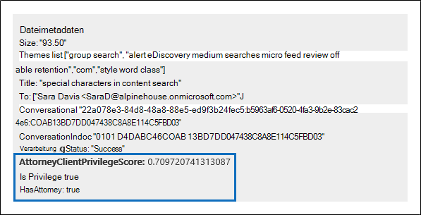
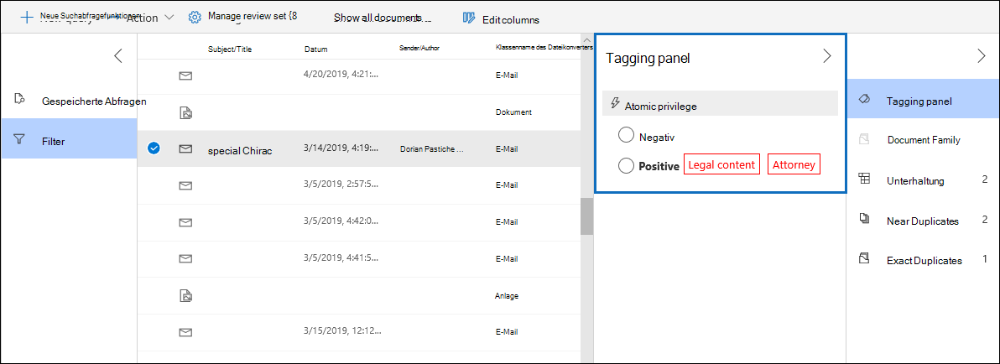
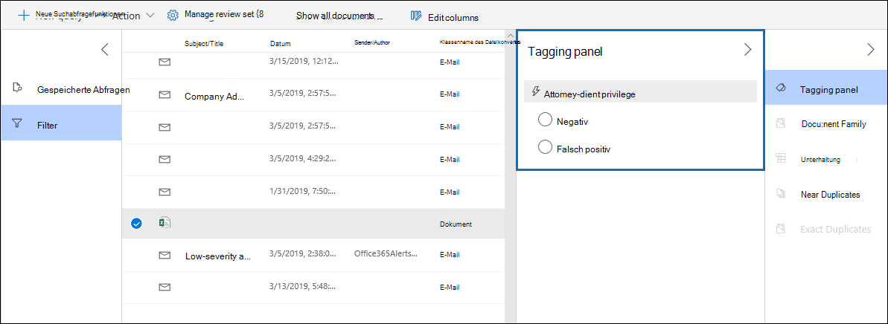

# Einrichten der Erkennung von Anwalts Mandanten-Berechtigungen in Advanced eDiscovery

Ein wichtiger und kostspieliger Aspekt der Überprüfungsphase eines eDiscovery-Prozesses besteht darin, Dokumente für privilegierte Inhalte zu überprüfen. Advanced eDiscovery bietet eine maschinelle Lern basierte Erkennung von privilegierten Inhalten, um diesen Prozess effizienter zu gestalten. Dieses Feature wird als *Anwalts Client-Berechtigungs Erkennung*bezeichnet.

## Wie funktioniert das?

Wenn die Erkennung der Anwalts-Client-Rechte aktiviert ist, werden alle Dokumente in einem Überprüfungs Satzes vom Anwalt-Client-Berechtigungs Erkennungs Modell verarbeitet, wenn Sie [die Daten](analyzing-data-in-review-set.md) im Überprüfungspaket analysieren. Das Modell sucht zwei Dinge:

- Privilegierte Inhalte – das Modell verwendet Maschinelles Lernen, um die Wahrscheinlichkeit zu ermitteln, dass das Dokumentinhalte enthält, die in der Natur legal sind.

- Teilnehmer – im Rahmen der Einrichtung der Anwalts-Client-Berechtigungs Erkennung müssen Sie eine Liste der Anwälte für Ihre Organisation übermitteln. Das Modell vergleicht dann die Teilnehmer des Dokuments mit der Liste der Rechtsanwälte, um festzustellen, ob mindestens ein Teilnehmer des Dokuments ein Rechtsanwalt ist.

Das Modell erzeugt für jedes Dokument die folgenden drei Eigenschaften:

- **AttorneyClientPrivilegeScore:** Die Wahrscheinlichkeit, dass das Dokument in der Natur legal ist; die Werte für die Partitur liegen zwischen **0** und **1**.

- **HasAttorney:** Diese Eigenschaft wird auf **true** festgelegt, wenn einer der Dokument Teilnehmer in der anwaltsliste aufgeführt ist; Andernfalls ist der Wert **false**. Der Wert wird auch auf **false** festgelegt, wenn Ihre Organisation keine Anwaltsliste hochgeladen hat.

- **Isprivilege:** Diese Eigenschaft wird auf **true** festgelegt, wenn der Wert für **AttorneyClientPrivilegeScore** oberhalb des Schwellenwerts liegt *oder* wenn das Dokument über einen Anwalts Teilnehmer verfügt; Andernfalls wird der Wert auf **false**festgelegt.

Diese Eigenschaften (und die entsprechenden Werte) werden den Datei Metadaten der Dokumente in einem Überprüfungs Satzes hinzugefügt, wie im folgenden Screenshot dargestellt:

Diese drei Eigenschaften können auch innerhalb eines Überprüfungs Satzes durchsucht werden. Weitere Informationen finden Sie unter [Abfragen der Daten in einem Überprüfungs Satzes](review-set-search.md).

## Einrichten des Erkennungs Modells für Anwalts Client-Berechtigungen

Um das Erkennungs Modell für das Attorney-Client-Privileg zu aktivieren, muss Ihre Organisation es aktivieren und dann eine anwaltsliste hochladen.

### Schritt 1: Aktivieren der Erkennung der Anwalts Client-Berechtigungen

Eine Person, die ein eDiscovery-Administrator in Ihrer Organisation ist (ein Mitglied der Untergruppe eDiscovery Administrator in der Rollengruppe eDiscovery-Manager), muss das Modell in ihren erweiterten eDiscovery-Fällen verfügbar machen.

1. Wechseln Sie im Security & Compliance Center zu **eDiscovery > Advanced eDiscovery**.

2. Klicken Sie auf der Seite für die **Erweiterte eDiscovery** -Homepage auf der Kachel **Einstellungen** auf **globale Analyse Einstellungen konfigurieren**.

   

3. Wählen Sie auf der Registerkarte **Analytics-Einstellungen** die Option **Attorney-Client-Berechtigungen verwalten**aus.

4. Klicken Sie auf der Flyoutseite **Anwaltsgeheimnisse** auf die Umschaltfläche, um das Feature zu aktivieren, und wählen Sie dann **Speichern** aus.

### Schritt 2: Hochladen einer Liste von Anwälten (optional)

Um das Erkennungs Modell "Attorney-Client-Berechtigung" vollständig zu nutzen und die Ergebnisse des " **hat Attorney** " oder der **potenziell privilegierten** Erkennung zu verwenden, die zuvor beschrieben wurde, wird empfohlen, eine Liste mit e-Mail-Adressen für die Anwälte und das juristische Personal hochzuladen, die für Ihre Organisation arbeiten. 

So laden Sie eine anwaltsliste für das Erkennungs Modell "Attorney-Client-Berechtigung" hoch:

1. Erstellen Sie eine CSV-Datei (ohne Kopfzeile), und fügen Sie die E-Mail-Adresse jeder relevanten Person in einer separaten Zeile hinzu. Speichern Sie die Datei auf Ihrem lokalen Computer.

2. Wählen Sie auf der Website für die **Erweiterte eDiscovery** -Startseite in der Kachel **Einstellungen** die Option **experimentelle Features konfigurieren**aus, und wählen Sie dann **Attorney-Client-Berechtigungseinstellung verwalten**aus.

   Die Seite " **Attorney-Client-Privilege** " wird angezeigt, und die Option " **Anwalt-Client-Berechtigung erkennen** " ist aktiviert.

   

3. Wählen Sie **Durchsuchen** aus, und suchen Sie die CSV-Datei, die Sie in Schritt 1 erstellt haben, und wählen Sie Sie aus.

4. Wählen Sie **Speichern** aus, um die anwaltsliste hochzuladen.

## Verwenden des Erkennungs Modells für Anwalts Client-Berechtigungen

Führen Sie die Schritte in diesem Abschnitt aus, um die Erkennung von Anwalts Mandanten-Berechtigungen für Dokumente in einem Überprüfungs Sätze zu verwenden.

### Schritt 1: Erstellen einer smarttaggruppe mit dem Anwalt-Client-Berechtigungs Erkennungs Modell

Eine der wichtigsten Methoden zum Anzeigen der Ergebnisse der Erkennung von Anwaltsgeheimnissen in Ihrem Überprüfungsprozess ist die Verwendung einer Smarttaggruppe. Eine Smarttaggruppe zeigt die Ergebnisse der Erkennung von Anwaltsgeheimnissen an und listet die Ergebnisse in der Zeile neben den Kategorien in einer Smarttaggruppe auf. Auf diese Weise können Sie während der Dokumentüberprüfung schnell potenziell privilegierte Dokumente identifizieren. Darüber hinaus können Sie auch die Tags der Smarttaggruppe verwenden, um Dokumente als privilegiert oder nicht privilegiert zu kennzeichnen. Weitere Informationen zu Smarttags finden Sie unter [Einrichten von Smart Tags in Advanced eDiscovery](smart-tags.md).

1. Wählen Sie in der Überprüfungsgruppe, die die Dokumente enthält, die Sie in Schritt 1 analysiert haben, die Option **Review-Gruppe verwalten** aus, und wählen Sie dann **Tags verwalten**aus.
 
2. Wählen Sie unter **Tags**die Dropdown Seite neben **Gruppe hinzufügen** aus, und wählen Sie dann **smarttaggruppe hinzufügen**aus.

   

3. Wählen Sie auf der Seite **Modell für Smarttag auswählen** die Option neben **Anwalt-Client-Privileg** **auswählen** aus.

   Es wird eine Transpondergruppe namens " **Attorney-Client Privilege** " angezeigt. Sie enthält zwei untergeordnete Tags mit dem Namen " **positiv** " und " **negativ**", die den möglichen Ergebnissen entsprechen, die das Modell erzeugt.

   

3. Benennen Sie die Tag-Gruppe und die Tags entsprechend ihrer Überprüfung um. Sie können beispielsweise " **positiv** " in " **privilegierte** " und " **negativ** " in " **nicht privilegierte**" umbenennen.

### Schritt 2: Analysieren eines Überprüfungs Satzes

Wenn Sie die Dokumente in einem Überprüfungs Satzes analysieren, wird auch das Clientzugriffs Berechtigungs-Erkennungs Modell ausgeführt und die entsprechenden Eigenschaften (beschrieben in [How is it work?](#how-does-it-work) wird jedem Dokument in der Überprüfungsgruppe hinzugefügt. Weitere Informationen zum Analysieren von Daten in Überprüfungs Sätzen finden Sie unter [Analysieren von Daten in einer Überprüfungsgruppe in Advanced eDiscovery](analyzing-data-in-review-set.md).

### Schritt 3: Verwenden der smarttaggruppe zur Überprüfung von privilegierten Inhalten

Nach der Analyse des Überprüfungs Satzes und der Einrichtung von Smarttags besteht der nächste Schritt darin, die Dokumente zu überprüfen. Wenn das Modell festgestellt hat, dass das Dokument möglicherweise privilegiert ist, zeigt das entsprechende Smarttag im **taggingbereich** die folgenden Ergebnisse an, die von der Berechtigung "Anwalt-Client-Erkennung" erzeugt werden:

- Wenn das Dokumentinhalt enthält, der möglicherweise zulässig ist, wird der **rechtliche Inhalt** der Bezeichnung neben dem entsprechenden Smarttag angezeigt (in diesem Fall das standardmäßige **positive** Tag).

- Wenn das Dokument über einen Teilnehmer verfügt, der in der anwaltsliste Ihrer Organisation gefunden wird, wird der Bezeichnungs **Anwalt** neben dem entsprechenden Smarttag angezeigt (in diesem Fall ist dies auch das standardmäßige **positive** Tag).

- Wenn das Dokumentinhalte enthält, die möglicherweise legal sind *und* ein Teilnehmer in der anwaltsliste gefunden wird, werden sowohl die **rechtlichen Inhalte**  als auch rechts **Anwalts** Bezeichnungen angezeigt. 

Wenn das Modell feststellt, dass ein Dokument keine Inhalte enthält, die in der Natur legal sind oder keinen Teilnehmer aus der anwaltsliste enthalten, wird im taggingbereich keine Bezeichnung angezeigt.

Die folgenden Screenshots zeigen beispielsweise zwei Dokumente. Der erste enthält Inhalte, die in der Natur legal sind und einen Teilnehmer in der Liste der Rechtsanwälte gefunden haben. Der zweite enthält weder und daher keine Beschriftungen angezeigt.

Nachdem Sie ein Dokument überprüft haben, um festzustellen, ob es privilegierte Inhalte enthält, können Sie das Dokument mit dem entsprechenden Tag versehen.
