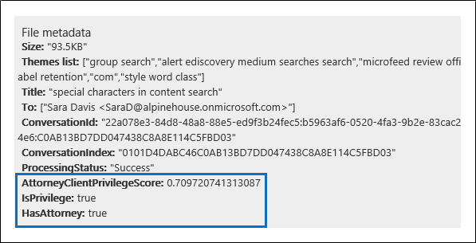

# Einrichten der Erkennung von Anwalts-Client-Rechten in Advanced eDiscoverySet up attorney-client privilege detection in Advanced eDiscovery

Ein wichtiger und kostspieliger Aspekt der Überprüfungsphase eines eDiscovery-Prozesses ist die Überprüfung von Dokumenten auf privilegierte Inhalte.A major and costly aspect of the review phase of any eDiscovery process is reviewing documents for privileged content. Advanced eDiscovery ermöglicht die maschinelle Lernerkennung privilegierter Inhalte, um diesen Prozess effizienter zu gestalten.Advanced eDiscovery provides machine learning-based detection of privileged content to make this process more efficient. Dieses Feature wird als *Erkennung von Anwalts-Client-Rechten bezeichnet.*This feature is called *attorney-client privilege detection*.

## Wie funktioniert das?How does it work?

Wenn die Erkennung von Anwalts-Client-Berechtigungen aktiviert ist, werden alle Dokumente in einem Überprüfungssatz vom Erkennungsmodell der Anwalts-Client-Rechte verarbeitet, wenn Sie die Daten [im](analyzing-data-in-review-set.md) Überprüfungssatz analysieren.When attorney-client privilege detection is enabled, all documents in a review set will be processed by the attorney-client privilege detection model when you [analyze the data](analyzing-data-in-review-set.md) in the review set. Das Modell sucht nach zwei Dingen:The model looks for two things:

- Privilegierter Inhalt – Das Modell verwendet maschinelles Lernen, um die Wahrscheinlichkeit zu bestimmen, dass das Dokument Inhalte enthält, die legaler Natur sind.Privileged content – The model uses machine learning to determine the likelihood that the document contains content that is legal in nature.

- Teilnehmer – Im Rahmen der Einrichtung der Anwalts-Client-Berechtigungserkennung müssen Sie eine Liste der Anwälte für Ihre Organisation einreichen.Participants – As part of setting up attorney-client privilege detection, you have to submit a list of attorneys for your organization. Das Modell vergleicht dann die Teilnehmer des Dokuments mit der Liste der Rechtsanwälte, um festzustellen, ob mindestens ein Teilnehmer des Dokuments ein Rechtsanwalt ist.The model then compares the participants of the document with the attorney list to determine if a document has at least one attorney participant.

Das Modell erzeugt die folgenden drei Eigenschaften für jedes Dokument:The model produces the following three properties for every document:

- **AttorneyClientPrivilegeScore:** Die Wahrscheinlichkeit, dass das Dokument rechtlicher Natur ist; Die Werte für die Bewertung liegen zwischen **0** und **1**.**AttorneyClientPrivilegeScore:** The likelihood the document is legal in nature; the values for the score are between **0** and **1**.

- **HasAttorney:** Diese Eigenschaft ist auf **true festgelegt,** wenn einer der Dokumentteilnehmer in der Anwaltsliste aufgeführt ist. Andernfalls ist der Wert **false**.**HasAttorney:** This property is set to **true** if one of the document participants is listed in the attorney list; otherwise the value is **false**. Der Wert wird auch auf **false** festgelegt, wenn Ihre Organisation keine Anwaltsliste hochgeladen hat.The value is also set to **false** if your organization didn't upload an attorney list.

- **IsPrivilege:** Diese Eigenschaft wird auf **true** festgelegt, wenn der Wert für  **AttorneyClientPrivilegeScore** über dem Schwellenwert liegt oder wenn das Dokument über einen Anwaltsteilnehmer verfügt. andernfalls wird der Wert auf **false festgelegt.****IsPrivilege:** This property is set to **true** if the value for **AttorneyClientPrivilegeScore** is above the threshold *or* if the document has an attorney participant; otherwise the value is set to **false**.

Diese Eigenschaften (und ihre entsprechenden Werte) werden den Dateimetadaten der Dokumente in einem Überprüfungssatz hinzugefügt, wie im folgenden Screenshot gezeigt:These properties (and their corresponding values) are added to the file metadata of the documents in a review set, as shown in the following screenshot:

Diese drei Eigenschaften können auch in einem Überprüfungssatz durchsucht werden.These three properties are also searchable within a review set. Weitere Informationen finden Sie unter [Query the data in a review set](review-set-search.md).For more information, see [Query the data in a review set](review-set-search.md).

## Einrichten des Erkennungsmodells für Anwalts-Client-RechteSet up the attorney-client privilege detection model

Um das Erkennungsmodell für Anwalts-Client-Rechte zu aktivieren, muss Ihre Organisation es aktivieren und dann eine Anwaltsliste hochladen.To enable the attorney-client privilege detection model, your organization has to turn it on and then upload an attorney list.

### Schritt 1: Aktivieren der Erkennung von Anwalts-Client-RechtenStep 1: Turn on attorney-client privilege detection

Eine Person, die ein eDiscovery-Administrator in Ihrer Organisation ist (Mitglied der eDiscovery-Administrator-Untergruppe in der Rollengruppe eDiscovery-Manager), muss das Modell in Ihren Advanced eDiscovery verfügbar machen.A person who is an eDiscovery Administrator in your organization (a member of the eDiscovery Administrator subgroup in the eDiscovery Manager role group) must make the model available in your Advanced eDiscovery cases.

1. Wechseln Sie im Security & Compliance Center zu **eDiscovery > Advanced eDiscovery**.In the Security & Compliance Center, go to **eDiscovery > Advanced eDiscovery**.

2. Klicken Sie **Advanced eDiscovery** Startseite in der Kachel **Einstellungen** auf **Globale Analyseeinstellungen konfigurieren**.On the **Advanced eDiscovery** home page, in the **Settings** tile, click **Configure global analytics settings**.

   

3. Wählen Sie **auf der Registerkarte** Analyseeinstellungen die Option **Anwalts-Client-Rechte verwalten aus.**On the **Analytics settings** tab, select **Manage attorney-client privilege setting**.

4. Klicken Sie auf der Flyoutseite **Anwaltsgeheimnisse** auf die Umschaltfläche, um das Feature zu aktivieren, und wählen Sie dann **Speichern** aus.On the **Attorney-client privilege** flyout page, use the toggle to turn on the feature and then select **Save**.

### Schritt 2: Hochladen einer Liste von Anwälten (optional)Step 2: Upload a list of attorneys (optional)

Um das Erkennungsmodell der Anwalts-Client-Rechte voll  zu nutzen  und die Ergebnisse der zuvor beschriebenen Erkennung von Anwalts- oder Potenziell privilegierten Rechten zu nutzen, empfehlen wir, eine Liste der E-Mail-Adressen für die Anwälte und Rechtsmitarbeiter hochzuladen, die für Ihre Organisation arbeiten.To take full advantage of the attorney-client privilege detection model and use the results of the **Has Attorney** or **Potentially Privileged** detection that was previously described, we recommend that you upload a list of email addresses for the lawyers and legal personnel who work for your organization. 

So laden Sie eine Anwaltsliste hoch, die vom Erkennungsmodell für Anwalts-Client-Rechte verwendet werden soll:To upload an attorney list for use by the attorney-client privilege detection model:

1. Erstellen Sie eine CSV-Datei (ohne Kopfzeile), und fügen Sie die E-Mail-Adresse jeder relevanten Person in einer separaten Zeile hinzu.Create a .csv file (without a header row) and add the email address for each appropriate person on a separate line. Speichern Sie die Datei auf Ihrem lokalen Computer.Save this file to your local computer.

2. Wählen Sie **Advanced eDiscovery** Startseite auf der Kachel **Einstellungen** Konfigurieren experimenteller Features **aus,** und wählen Sie dann Die Einstellung **Anwalts-Client-Rechte verwalten aus.**On the **Advanced eDiscovery** home page, in the **Settings** tile, select **Configure experimental features**, and then select **Manage attorney-client privilege setting**.

   Die **Seite Anwalt-Client-Rechte** wird angezeigt, und die **Option Anwalt-Client-Berechtigungserkennung** ist aktiviert.The **Attorney-client privilege** page is displayed, and the **Attorney-client privilege detection** toggle is turned on.

   

3. Wählen **Sie Durchsuchen** aus, und suchen Sie dann die .csv, die Sie in Schritt 1 erstellt haben.Select **Browse** and then find and select the .csv file that you created in step 1.

4. Wählen **Sie Speichern** aus, um die Anwaltsliste hochzuladen.Select **Save** to upload the attorney list.

## Verwenden des Anwalts-Client-BerechtigungserkennungsmodellsUse the attorney-client privilege detection model

Führen Sie die Schritte in diesem Abschnitt aus, um die Erkennung von Anwalts-Client-Rechten für Dokumente in einem Überprüfungssatz zu verwenden.Follow the steps in this section to use attorney-client privilege detection for documents in a review set.

### Schritt 1: Erstellen einer Smarttaggruppe mit Einem Anwalt-Client-BerechtigungserkennungsmodellStep 1: Create a smart tag group with attorney-client privilege detection model

Eine der wichtigsten Methoden zum Anzeigen der Ergebnisse der Erkennung von Anwaltsgeheimnissen in Ihrem Überprüfungsprozess ist die Verwendung einer Smarttaggruppe.One of the primary ways to see the results of attorney-client privilege detection in your review process is by using a smart tag group. Eine Smarttaggruppe zeigt die Ergebnisse der Erkennung von Anwaltsgeheimnissen an und listet die Ergebnisse in der Zeile neben den Kategorien in einer Smarttaggruppe auf.A smart tag group indicates the results of the attorney-client privilege detection and shows the results in-line next to the tags in a smart tag group. Auf diese Weise können Sie potenziell privilegierte Dokumente während der Dokumentüberprüfung schnell identifizieren.This lets you quickly identify potentially privileged documents during document review. Darüber hinaus können Sie auch die Tags der Smarttaggruppe verwenden, um Dokumente als privilegiert oder nicht privilegiert zu kennzeichnen.Additionally, you can also use the tags in the smart tag group to tag documents as privileged or non-privileged. Weitere Informationen zu Smarttags finden Sie unter [Einrichten von Smarttags in Advanced eDiscovery](smart-tags.md).For more information about smart tags, see [Set up smart tags in Advanced eDiscovery](smart-tags.md).

1. Wählen Sie im Überprüfungssatz, der die dokumente enthält, die Sie in Schritt 1 analysiert haben, **Die** Option Überprüfungssatz verwalten aus, und wählen Sie **dann Tags verwalten aus.**In the review set that contains the documents that you analyzed in Step 1, select **Manage review set** and then select **Manage tags**.
 
2. Wählen **Sie unter Tags** den Pull-Down neben Gruppe **hinzufügen** aus, und wählen Sie **dann Smarttaggruppe hinzufügen aus.**Under **Tags**, select the pull-down next to **Add group** and then select **Add smart tag group**.

   

3. Wählen Sie **auf der Seite Modell für Ihr Smarttag** auswählen **neben** **Anwalts-Client-Berechtigung auswählen aus.**On the **Choose a model for your smart tag** page, choose **Select** next to **Attorney-client privilege**.

   Eine Taggruppe mit dem **Namen Anwalt-Client-Berechtigung** wird angezeigt.A tag group named **Attorney-client privilege** is displayed. Sie enthält zwei untergeordnete Tags mit dem Namen **Positive** und **Negative,** die den möglichen Ergebnissen des Modells entsprechen.It contains two child tags named **Positive** and **Negative**, which correspond to the possible results produced by the model.

   

3. Benennen Sie die Taggruppe und die Tags entsprechend Ihrer Überprüfung um.Rename the tag group and tags as appropriate for your review. Sie können z. B. **Positive** in **Privileged und** **Negative in** Not **privileged umbenennen.**For example, you can rename **Positive** to **Privileged** and **Negative** to **Not privileged**.

### Schritt 2: Analysieren eines ÜberprüfungssatzStep 2: Analyze a review set

Wenn Sie die Dokumente in einem Überprüfungssatz analysieren, wird auch das Erkennungsmodell für Anwalts-Client-Berechtigungen ausgeführt, und die entsprechenden Eigenschaften (siehe Wie funktioniert [das?](#how-does-it-work) wird jedem Dokument im Überprüfungssatz hinzugefügt.When you analyze the documents in a review set, the attorney-client privilege detection model will also run and the corresponding properties (described in [How does it work?](#how-does-it-work) will be added to every document in the review set. Weitere Informationen zum Analysieren von Daten im Überprüfungssatz finden Sie unter Analysieren von Daten [in einem Überprüfungssatz in Advanced eDiscovery](analyzing-data-in-review-set.md).For more information about analyzing data in review set, see [Analyze data in a review set in Advanced eDiscovery](analyzing-data-in-review-set.md).

### Schritt 3: Verwenden der Smarttaggruppe zur Überprüfung privilegierter InhalteStep 3: Use the smart tag group for review of privileged content

Nach der Analyse des Überprüfungssets und dem Einrichten von Smarttags besteht der nächste Schritt in der Überprüfung der Dokumente.After analyzing the review set and setting up smart tags, the next step is to review the documents. Wenn das Modell festgestellt hat, dass das Dokument potenziell privilegiert ist, zeigt das entsprechende Smarttag im **Tagging-Panel** die folgenden Ergebnisse an, die durch die Erkennung von Anwalts-Client-Berechtigungen erzeugt werden:If the model has determined the document is potentially privileged, the corresponding smart tag in the **Tagging panel** will indicate the following results produced by the attorney-client privilege detection:

- Wenn das Dokument Inhalte enthält, die möglicherweise rechtlicher Natur sind, wird die Bezeichnung **Rechtlicher** Inhalt neben dem entsprechenden Smarttag angezeigt (in diesem Fall das standardmäßige **Positive** Tag).If the document has content that may be legal in nature, the label **Legal content** is displayed next to the corresponding smart tag (which in this case is the default **Positive** tag).

- Wenn das Dokument über einen Teilnehmer verfügt, der in der Anwaltsliste Ihrer Organisation gefunden wird, wird die Bezeichnung **Anwalt** neben dem entsprechenden Smarttag angezeigt (das in diesem Fall auch das standardmäßige **Positive** Tag ist).If the document has a participant who is found in your organization's attorney list, the label **Attorney** is displayed next to the corresponding smart tag (which in this case is also the default **Positive** tag).

- Wenn das Dokument Inhalte enthält,  die möglicherweise rechtlicher Natur sind und ein Teilnehmer in der Anwaltsliste gefunden wurde, werden sowohl die Bezeichnungen **"Rechtlicher Inhalt"** als auch **"Anwalt"** angezeigt.If the document has content that may be legal in nature *and* has a participant found in the attorney list, both the **Legal content**  and **Attorney** labels are displayed. 

Wenn das Modell feststellt, dass ein Dokument keine Inhalte enthält, die rechtlicher Natur sind oder keinen Teilnehmer aus der Anwaltsliste enthalten, wird keine Bezeichnung im Markierungspanel angezeigt.If the model determines that a document doesn't contain content that is legal in nature or doesn't contain a participant from the attorney list, then neither label is displayed in the tagging panel.

Die folgenden Screenshots zeigen beispielsweise zwei Dokumente.For example, the following screenshots show two documents. Der erste enthält Inhalte, die rechtlicher Natur sind und einen Teilnehmer in der Liste der Anwälte finden.The first one contains content that is legal in nature and has a participant found in the list of attorneys. Die zweite enthält keine bezeichnungen und zeigt daher keine Bezeichnungen an.The second contains neither and therefore doesn't display any labels.

Nachdem Sie ein Dokument überprüft haben, um zu sehen, ob es privilegierten Inhalt enthält, können Sie das Dokument mit dem entsprechenden Tag kennzeichnen.After you review a document to see if it contains privileged content, you can tag the document with the appropriate tag.
