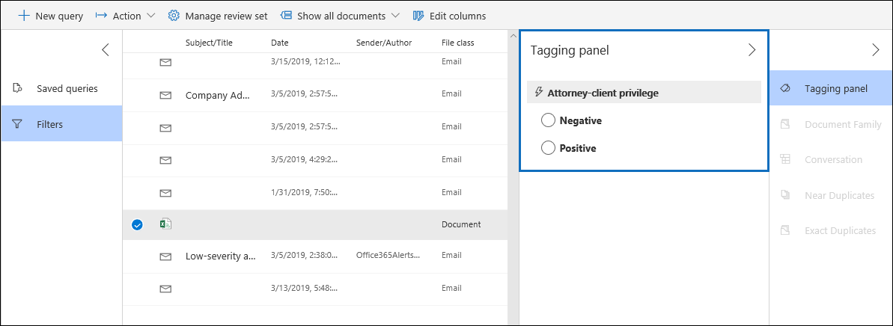

# Einrichten der Erkennung von Anwalts-Client-Rechten in Advanced eDiscovery

Ein wichtiger und kostspieliger Aspekt der Überprüfungsphase eines eDiscovery-Prozesses ist die Überprüfung von Dokumenten auf privilegierte Inhalte. Advanced eDiscovery ermöglicht die maschinelle Lernerkennung privilegierter Inhalte, um diesen Prozess effizienter zu gestalten. Dieses Feature wird als *Erkennung von Anwalts-Client-Rechten bezeichnet.*

## Wie funktioniert das?

Wenn die Erkennung von Anwalts-Client-Berechtigungen aktiviert ist, werden alle Dokumente in einem Überprüfungssatz vom Erkennungsmodell der Anwalts-Client-Rechte verarbeitet, wenn Sie die Daten [im](analyzing-data-in-review-set.md) Überprüfungssatz analysieren. Das Modell sucht nach zwei Dingen:

- Privilegierter Inhalt – Das Modell verwendet maschinelles Lernen, um die Wahrscheinlichkeit zu bestimmen, dass das Dokument Inhalte enthält, die legaler Natur sind.

- Teilnehmer – Im Rahmen der Einrichtung der Anwalts-Client-Berechtigungserkennung müssen Sie eine Liste der Anwälte für Ihre Organisation einreichen. Das Modell vergleicht dann die Teilnehmer des Dokuments mit der Liste der Rechtsanwälte, um festzustellen, ob mindestens ein Teilnehmer des Dokuments ein Rechtsanwalt ist.

Das Modell erzeugt die folgenden drei Eigenschaften für jedes Dokument:

- **AttorneyClientPrivilegeScore:** Die Wahrscheinlichkeit, dass das Dokument rechtlicher Natur ist; Die Werte für die Bewertung liegen zwischen **0** und **1**.

- **HasAttorney:** Diese Eigenschaft ist auf **true festgelegt,** wenn einer der Dokumentteilnehmer in der Anwaltsliste aufgeführt ist. Andernfalls ist der Wert **false**. Der Wert wird auch auf **false** festgelegt, wenn Ihre Organisation keine Anwaltsliste hochgeladen hat.

- **IsPrivilege:** Diese Eigenschaft wird auf **true** festgelegt, wenn der Wert für  **AttorneyClientPrivilegeScore** über dem Schwellenwert liegt oder wenn das Dokument über einen Anwaltsteilnehmer verfügt. andernfalls wird der Wert auf **false festgelegt.**

Diese Eigenschaften (und ihre entsprechenden Werte) werden den Dateimetadaten der Dokumente in einem Überprüfungssatz hinzugefügt, wie im folgenden Screenshot gezeigt:

Diese drei Eigenschaften können auch in einem Überprüfungssatz durchsucht werden. Weitere Informationen finden Sie unter [Query the data in a review set](review-set-search.md).

## Einrichten des Erkennungsmodells für Anwalts-Client-Rechte

Um das Erkennungsmodell für Anwalts-Client-Rechte zu aktivieren, muss Ihre Organisation es aktivieren und dann eine Anwaltsliste hochladen.

### Schritt 1: Aktivieren der Erkennung von Anwalts-Client-Rechten

Eine Person, die ein eDiscovery-Administrator in Ihrer Organisation ist (Mitglied der eDiscovery-Administrator-Untergruppe in der Rollengruppe eDiscovery-Manager), muss das Modell in Ihren Advanced eDiscovery verfügbar machen.

1. Wechseln Sie im Security & Compliance Center zu **eDiscovery > Advanced eDiscovery**.

2. Klicken Sie **Advanced eDiscovery** Startseite in der Kachel **Einstellungen** auf **Globale Analyseeinstellungen konfigurieren**.

   

3. Wählen Sie **auf der Registerkarte** Analyseeinstellungen die Option **Anwalts-Client-Rechte verwalten aus.**

4. Klicken Sie auf der Flyoutseite **Anwaltsgeheimnisse** auf die Umschaltfläche, um das Feature zu aktivieren, und wählen Sie dann **Speichern** aus.

### Schritt 2: Hochladen einer Liste von Anwälten (optional)

Um das Erkennungsmodell der Anwalts-Client-Rechte voll  zu nutzen  und die Ergebnisse der zuvor beschriebenen Erkennung von Anwalts- oder Potenziell privilegierten Rechten zu nutzen, empfehlen wir, eine Liste der E-Mail-Adressen für die Anwälte und Rechtsmitarbeiter hochzuladen, die für Ihre Organisation arbeiten. 

So laden Sie eine Anwaltsliste hoch, die vom Erkennungsmodell für Anwalts-Client-Rechte verwendet werden soll:

1. Erstellen Sie eine CSV-Datei (ohne Kopfzeile), und fügen Sie die E-Mail-Adresse jeder relevanten Person in einer separaten Zeile hinzu. Speichern Sie die Datei auf Ihrem lokalen Computer.

2. Wählen Sie **Advanced eDiscovery** Startseite auf der Kachel **Einstellungen** Konfigurieren experimenteller Features **aus,** und wählen Sie dann Die Einstellung **Anwalts-Client-Rechte verwalten aus.**

   Die **Seite Anwalt-Client-Rechte** wird angezeigt, und die **Option Anwalt-Client-Berechtigungserkennung** ist aktiviert.

   

3. Wählen **Sie Durchsuchen** aus, und suchen Sie dann die .csv, die Sie in Schritt 1 erstellt haben.

4. Wählen **Sie Speichern** aus, um die Anwaltsliste hochzuladen.

## Verwenden des Anwalts-Client-Berechtigungserkennungsmodells

Führen Sie die Schritte in diesem Abschnitt aus, um die Erkennung von Anwalts-Client-Rechten für Dokumente in einem Überprüfungssatz zu verwenden.

### Schritt 1: Erstellen einer Smarttaggruppe mit Einem Anwalt-Client-Berechtigungserkennungsmodell

Eine der wichtigsten Methoden zum Anzeigen der Ergebnisse der Erkennung von Anwaltsgeheimnissen in Ihrem Überprüfungsprozess ist die Verwendung einer Smarttaggruppe. Eine Smarttaggruppe zeigt die Ergebnisse der Erkennung von Anwaltsgeheimnissen an und listet die Ergebnisse in der Zeile neben den Kategorien in einer Smarttaggruppe auf. Auf diese Weise können Sie potenziell privilegierte Dokumente während der Dokumentüberprüfung schnell identifizieren. Darüber hinaus können Sie auch die Tags der Smarttaggruppe verwenden, um Dokumente als privilegiert oder nicht privilegiert zu kennzeichnen. Weitere Informationen zu Smarttags finden Sie unter [Einrichten von Smarttags in Advanced eDiscovery](smart-tags.md).

1. Wählen Sie im Überprüfungssatz, der die dokumente enthält, die Sie in Schritt 1 analysiert haben, **Die** Option Überprüfungssatz verwalten aus, und wählen Sie **dann Tags verwalten aus.**
 
2. Wählen **Sie unter Tags** den Pull-Down neben Gruppe **hinzufügen** aus, und wählen Sie **dann Smarttaggruppe hinzufügen aus.**

   

3. Wählen Sie **auf der Seite Modell für Ihr Smarttag** auswählen **neben** **Anwalts-Client-Berechtigung auswählen aus.**

   Eine Taggruppe mit dem **Namen Anwalt-Client-Berechtigung** wird angezeigt. Sie enthält zwei untergeordnete Tags mit dem Namen **Positive** und **Negative,** die den möglichen Ergebnissen des Modells entsprechen.

   

3. Benennen Sie die Taggruppe und die Tags entsprechend Ihrer Überprüfung um. Sie können z. B. **Positive** in **Privileged und** **Negative in** Not **privileged umbenennen.**

### Schritt 2: Analysieren eines Überprüfungssatz

Wenn Sie die Dokumente in einem Überprüfungssatz analysieren, wird auch das Erkennungsmodell für Anwalts-Client-Berechtigungen ausgeführt, und die entsprechenden Eigenschaften (siehe Wie funktioniert [das?](#how-does-it-work) wird jedem Dokument im Überprüfungssatz hinzugefügt. Weitere Informationen zum Analysieren von Daten im Überprüfungssatz finden Sie unter Analysieren von Daten [in einem Überprüfungssatz in Advanced eDiscovery](analyzing-data-in-review-set.md).

### Schritt 3: Verwenden der Smarttaggruppe zur Überprüfung privilegierter Inhalte

Nach der Analyse des Überprüfungssets und dem Einrichten von Smarttags besteht der nächste Schritt in der Überprüfung der Dokumente. Wenn das Modell festgestellt hat, dass das Dokument potenziell privilegiert ist, zeigt das entsprechende Smarttag im **Tagging-Panel** die folgenden Ergebnisse an, die durch die Erkennung von Anwalts-Client-Berechtigungen erzeugt werden:

- Wenn das Dokument Inhalte enthält, die möglicherweise rechtlicher Natur sind, wird die Bezeichnung **Rechtlicher** Inhalt neben dem entsprechenden Smarttag angezeigt (in diesem Fall das standardmäßige **Positive** Tag).

- Wenn das Dokument über einen Teilnehmer verfügt, der in der Anwaltsliste Ihrer Organisation gefunden wird, wird die Bezeichnung **Anwalt** neben dem entsprechenden Smarttag angezeigt (das in diesem Fall auch das standardmäßige **Positive** Tag ist).

- Wenn das Dokument Inhalte enthält,  die möglicherweise rechtlicher Natur sind und ein Teilnehmer in der Anwaltsliste gefunden wurde, werden sowohl die Bezeichnungen **"Rechtlicher Inhalt"** als auch **"Anwalt"** angezeigt. 

Wenn das Modell feststellt, dass ein Dokument keine Inhalte enthält, die rechtlicher Natur sind oder keinen Teilnehmer aus der Anwaltsliste enthalten, wird keine Bezeichnung im Markierungspanel angezeigt.

Die folgenden Screenshots zeigen beispielsweise zwei Dokumente. Der erste enthält Inhalte, die rechtlicher Natur sind und einen Teilnehmer in der Liste der Anwälte finden. Die zweite enthält keine bezeichnungen und zeigt daher keine Bezeichnungen an.

Nachdem Sie ein Dokument überprüft haben, um zu sehen, ob es privilegierten Inhalt enthält, können Sie das Dokument mit dem entsprechenden Tag kennzeichnen.
