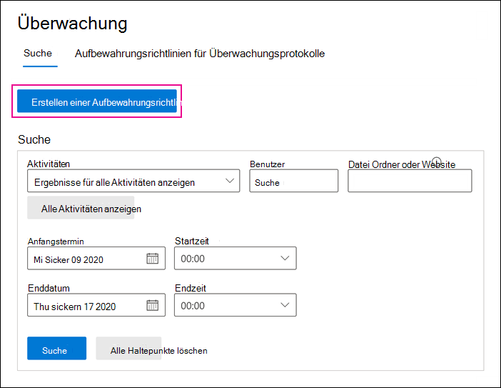
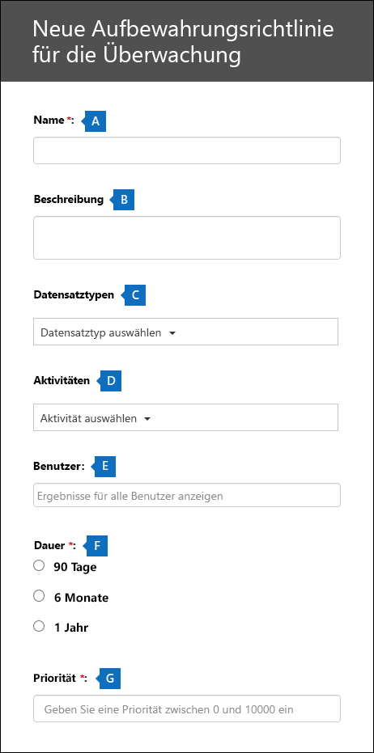

# <a name="manage-audit-log-retention-policies"></a>Verwalten von Aufbewahrungsrichtlinien für Überwachungsprotokolle

Sie können Aufbewahrungsrichtlinien für Überwachungsprotokolle im Security & Compliance Center erstellen und verwalten. Aufbewahrungsrichtlinien für Überwachungsprotokolle sind Bestandteil der neuen erweiterten Überwachungsfunktionen in Microsoft 365. Mit einer Aufbewahrungsrichtlinie für Überwachungsprotokolle können Sie festlegen, wie lange Überwachungsprotokolle in Ihrer Organisation aufbewahrt werden sollen. Sie können Überwachungsprotokolle bis zu 10 Jahre lang aufbewahren. Sie können Richtlinien nach folgenden Kriterien erstellen:

- Alle Aktivitäten in einem oder mehreren Microsoft 365-Diensten

- Bestimmte Aktivitäten (in einem Microsoft 365-Dienst), die von allen Benutzern oder von bestimmten Benutzern ausgeführt werden

- Eine Prioritätsstufe, die angibt, welche Richtlinie Vorrang hat, wenn es in Ihrer Organisation mehrere Richtlinien gibt

## <a name="default-audit-log-retention-policy"></a>Standardmäßige Aufbewahrungsrichtlinie für Überwachungsprotokolle

Die erweiterte Überwachung in Microsoft 365 stellt eine Standardaufbewahrungsrichtlinie für Überwachungsprotokolle für alle Organisationen bereit. Diese Richtlinie bewahrt alle Exchange-, SharePoint- und Azure Active Directory-Überwachungsdatensätze für ein Jahr auf. Diese Standardrichtlinie bewahrt Überwachungsdatensätze auf, die den Wert **AzureActiveDirectory** , **Exchange** oder **SharePoint** für die **Workload** -Eigenschaft (der Dienst, in dem die Aktivität aufgetreten ist) enthalten. Die Standardrichtlinie kann nicht geändert werden. Im Abschnitt [Weitere Informationen](#more-information) in diesem Artikel finden Sie eine Liste der Datensatztypen für die einzelnen Workloads, die in der Standardrichtlinie enthalten sind.

> [!NOTE]
> Die Standardrichtlinie zur Aufbewahrung von Überwachungsprotokollen gilt nur für Überwachungsdatensätze für Aktivitäten, die von Benutzern durchgeführt werden, denen eine Office 365- oder Microsoft 365 E5-Lizenz zugewiesen ist, oder die über eine Microsoft 365 E5 Compliance- oder E5 eDiscovery- und Überwachungs-Add-on-Lizenz verfügen. Wenn es in Ihrer Organisation nicht-E5-Benutzer gibt, werden die entsprechenden Überwachungsdatensätze für 90 Tage aufbewahrt.

## <a name="before-you-create-an-audit-log-retention-policy"></a>Vor dem Erstellen einer Aufbewahrungsrichtlinie für Überwachungsprotokolle

- Ihnen muss die Rolle "Organisationskonfiguration" im Security & Compliance Center zugewiesen sein, um eine Aufbewahrungsrichtlinie für Überwachungsprotokolle erstellen oder ändern zu können.

- In Ihrer Organisation kann es maximal 50 Aufbewahrungsrichtlinien für Überwachungsprotokolle geben.

- Wenn Sie ein Überwachungsprotokoll länger als 90 Tage aufbewahren möchten, muss der Benutzer, der das Überwachungsprotokoll generiert hat, über eine Lizenz für Office 365 E5 oder für Microsoft 365 E5 oder aber über eine Lizenz für Microsoft 365 E5 Compliance oder E5 eDiscovery und Audit-Add-on verfügen.

- Alle benutzerdefinierten (von Ihrer Organisation erstellten) Aufbewahrungsrichtlinien für Überwachungsprotokolle haben Vorrang vor der Standardaufbewahrungsrichtlinie. Wenn Sie beispielsweise eine Aufbewahrungsrichtlinie für Überwachungsprotokolle für Exchange-Postfachaktivitäten erstellen, die einen Aufbewahrungszeitraum von weniger als einem Jahr vorsieht, werden die Überwachungsdatensätze für Exchange-Postfachaktivitäten für die in der benutzerdefinierten Richtlinie festgelegte kürzere Dauer aufbewahrt.

## <a name="create-an-audit-log-retention-policy-in-the-compliance-center"></a>Erstellen einer Aufbewahrungsrichtlinie für Überwachungsprotokolle im Compliance Center

1. Wechseln Sie zu [https://compliance.microsoft.com](https://compliance.microsoft.com), und melden Sie sich mit dem Benutzerkonto an, dem die Rolle "Organisationskonfiguration"im Security & Compliance Center zugewiesen ist.

2. Klicken Sie im linken Bereich des Microsoft 365 Compliance Center auf **Alle anzeigen** und dann auf **Überwachung** .

    Die Seite **Überwachung** wird angezeigt.

    

3. Klicken Sie auf **Richtlinie zur Überwachungsaufbewahrung erstellen** , und füllen Sie dann die folgenden Felder auf der Flyout-Seite aus:

    

   1. **Name:** Der Name der Aufbewahrungsrichtlinie für Überwachungsprotokolle. Dieser Name muss in Ihrer Organisation eindeutig sein.

   2. **Beschreibung:** Optional, aber hilfreich, um Informationen zur Richtlinie bereitzustellen, z. B. den Datensatztyp oder den Workload, die in der Richtlinie angegebenen Benutzer sowie die Dauer.

   3. **Benutzer:** Wählen Sie einen oder mehrere Benutzer aus, auf die die Richtlinie angewendet werden soll. Wenn Sie dieses Feld leer lassen, gilt die Richtlinie für alle Benutzer. Wenn Sie die **Datensatzart** leer lassen, müssen Sie einen Benutzer auswählen.

   4. **Datensatzart:** die Art des Überwachungsdatensatzes, auf den sich die Richtlinie bezieht Wenn Sie diese Eigenschaft leer lassen, müssen Sie im Feld **Benutzer** einen Benutzer auswählen. Sie können einen einzelnen oder mehrere Datensatztypen auswählen:

   - Wenn Sie einen einzelnen Datensatztyp auswählen, wird das Feld **Aktivitäten** dynamisch angezeigt. Mithilfe der Drop-down-Liste können Sie Aktivitäten des ausgewählten Datensatztyps auswählen, auf die die Richtlinie angewendet werden soll. Wenn Sie keine bestimmten Aktivitäten auswählen, gilt die Richtlinie für alle Aktivitäten des ausgewählten Datensatztyps.

   - Wenn Sie mehrere Datensatztypen auswählen, können Sie keine Aktivitäten auswählen. Die Richtlinie wird auf alle Aktivitäten des ausgewählten Datensatztyps angewendet.

   5. **Dauer:** die Zeitdauer, wie lange die Überwachungsprotokolle aufbewahrt werden, die den Kriterien der Richtlinie entsprechen

   6. **Priorität:** Dieser Wert bestimmt die Reihenfolge, in der Aufbewahrungsrichtlinien für Überwachungsprotokolle in Ihrer Organisation angewandt werden. Ein höherer Wert weist auf eine höhere Priorität hin.  So würde beispielsweise eine Richtlinie mit einem Prioritätswert von **5** Vorrang vor einer Richtlinie mit einem Prioritätswert von **0** haben. Wie zuvor erläutert, hat jede benutzerdefinierte Aufbewahrungsrichtlinie für Überwachungsprotokolle Vorrang vor der Standardrichtlinie für Ihre Organisation.

4. Klicken Sie auf **Speichern** , um die neue Aufbewahrungsrichtlinie für Überwachungsprotokolle zu erstellen.

## <a name="create-an-audit-log-retention-policy-in-powershell"></a>Erstellen einer Aufbewahrungsrichtlinie für Überwachungsprotokolle in PowerShell

Aufbewahrungsrichtlinien für Überwachungsprotokolle können auch mithilfe von Security & Compliance Center PowerShell erstellt werden.

1. [Stellen Sie eine Verbindung mit der Security & Compliance Center PowerShell her](https://docs.microsoft.com/powershell/exchange/connect-to-scc-powershell).

2. Führen Sie zum Erstellen einer neuen Aufbewahrungsrichtlinie den folgenden Befehl aus:

   ```powershell
   New-UnifiedAuditLogRetentionPolicy -Name "Microsoft Teams Audit Policy" -Description "One year retention policy for all Microsoft Teams activities" -RecordTypes MicrosoftTeams -RetentionDuration TenYears -Priority 100
   ```

    In diesem Beispiel wird eine Aufbewahrungsrichtlinie für Überwachungsprotokolle namens "Microsoft Teams Audit Policy" mit diesen Einstellungen erstellt:

   - Eine Beschreibung der Richtlinie.

   - Bewahrt alle Microsoft Teams-Aktivitäten auf (gemäß der Definition durch den *RecordType* -Parameter).

   - Bewahrt Microsoft Teams-Überwachungsprotokolle 10 Jahre lang auf.

   - Eine Priorität von 100.

Hier ist ein weiteres Beispiel für das Erstellen einer Aufbewahrungsrichtlinie für Überwachungsprotokolle. Diese Richtlinie bewahrt Überwachungsprotokolle für die Aktivität "Benutzer angemeldet" für den Benutzer admin@contoso.onmicrosoft.com für sechs Monate auf.

```powershell
New-UnifiedAuditLogRetentionPolicy -Name "SixMonth retention for admin logons" -RecordTypes AzureActiveDirectoryStsLogon -Operations UserLoggedIn -UserIds admin@contoso.onmicrosoft.com -RetentionDuration SixMonths -Priority 25
```

Weitere Informationen finden Sie unter [New-UnifiedAuditLogRetentionPolicy-](https://docs.microsoft.com/powershell/module/exchange/new-unifiedauditlogretentionpolicy).

## <a name="view-audit-log-retention-policies"></a>Anzeigen von Aufbewahrungsrichtlinien für Überwachungsprotokolle

Zurzeit können benutzerdefinierte Aufbewahrungsrichtlinien für Überwachungsprotokolle nur mithilfe des Cmdlets **Get-UnifiedAuditRetentionPolicy** in Security & Compliance Center PowerShell angezeigt werden. Hier ist ein Beispielbefehl zum Anzeigen der Einstellungen (die Sie im vorherigen Schritt konfiguriert haben) für die Aufbewahrungsrichtlinien für Überwachungsprotokolle in Ihrer Organisation. Mit diesem Befehl werden die Richtlinien von der höchsten bis zur niedrigsten Priorität sortiert.

```powershell
Get-UnifiedAuditLogRetentionPolicy | Sort-Object -Property Priority -Descending | FL Priority,Name,Description,RecordTypes,Operations,UserIds,RetentionDuration
```

> [!NOTE]
> Zurzeit gibt das Cmdlet **Get-UnifiedAuditLogRetentionPolicy** nicht die Standardrichtlinie für Überwachungsprotokolle für Ihre Organisation zurück.

Weitere Informationen finden Sie unter [Get-UnifiedAuditLogRetentionPolicy](https://docs.microsoft.com/powershell/module/exchange/get-unifiedauditlogretentionpolicy).

## <a name="some-audit-log-retention-policies-not-supported-in-the-ui"></a>Einige Aufbewahrungsrichtlinien für Überwachungsprotokolle, die auf der Benutzeroberfläche nicht unterstützt werden.

Wenn Sie das Cmdlet **New-UnifiedAuditLogRetentionPolicy** verwenden, können Sie eine Aufbewahrungsrichtlinie für Überwachungsprotokolle für Datensatztypen oder Aktivitäten erstellen, die im Microsoft 365 Compliance Center-Tool **Erstellen von Aufbewahrungsrichtlinien für die Überwachung** nicht verfügbar sind. In diesem Fall werden Sie nicht in der Lage sein, die Richtlinie aus der Registerkarte **Aufbewahrungsrichtlinien für die Überwachung** im Compliance-Center zu bearbeiten (beispielsweise die Aufbewahrungsdauer ändern oder Aktivitäten hinzufügen oder entfernen).  Sie können die Richtlinie im Compliance-Center nur anzeigen oder löschen. Um die Richtlinie zu ändern, müssen Sie das Cmdlet **Set-UnifiedAuditLogRetentionPolicy** im PowerShell des Security & Compliance-Centers verwenden.

## <a name="more-information"></a>Weitere Informationen

- Verwenden Sie das Cmdlet **Set-UnifiedAuditLogRetentionPolicy** in Security & Compliance Center PowerShell, um eine bestehende Aufbewahrungsrichtlinie für Überwachungsprotokolle zu ändern. Weitere Informationen finden Sie unter [Set-UnifiedAuditLogRetentionPolicy](https://docs.microsoft.com/powershell/module/exchange/set-unifiedauditlogretentionpolicy).

- Verwenden Sie das Cmdlet **Remove-UnifiedAuditLogRetentionPolicy** in Security & Compliance Center PowerShell, um eine Aufbewahrungsrichtlinie für Überwachungsprotokolle zu löschen. Es kann bis zu 30 Minuten dauern, bis die Richtlinie entfernt wurde. Weitere Informationen finden Sie unter [Remove-UnifiedAuditLogRetentionPolicy](https://docs.microsoft.com/powershell/module/exchange/remove-unifiedauditlogretentionpolicy).

- Wie bereits erwähnt, werden Überwachungseinträge für Vorgänge in Azure Active Directory, Exchange und SharePoint für ein Jahr aufbewahrt. In der folgenden Tabelle sind alle Datensatztypen (für jeden dieser Dienste) aufgelistet, die in der standardmäßigen Aufbewahrungsrichtlinie für Überwachungsprotokolle enthalten sind. Dies bedeutet, dass Überwachungsprotokolle für jeden Vorgang mit diesem Datensatztyp für ein Jahr aufbewahrt werden, es sei denn, eine benutzerdefinierte Aufbewahrungsrichtlinie für Überwachungsprotokolle hat Vorrang in Hinblick auf einen bestimmten Datensatztyp, Vorgang oder Benutzer. Der Enumerationswert (der als Wert für die RecordType-Eigenschaft in einem Überwachungsdatensatz angezeigt wird) ist in Klammern angezeigt.

   |AzureActiveDirectory |Exchange  |SharePoint|
   |:---------|:---------|:---------|
   |AzureActiveDirectory (8)|ExchangeAdmin (1)|ComplianceDLPSharePoint (11)|
   |AzureActiveDirectoryAccountLogon (9)|ExchangeItem (2)|ComplianceDLPSharePointClassification (33)|
   |AzureActiveDirectoryStsLogon (15)|Campaign (62)|Project (35)|
   ||ComplianceDLPExchange (13)|SharePoint (4)|
   ||ComplianceSupervisionExchange (68)|SharePointCommentOperation (37)|
   ||CustomerKeyServiceEncryption (69)|SharePointContentTypeOperation (55)|
   ||ExchangeAggregatedOperation (19)|SharePointFieldOperation (56)|
   ||ExchangeItemAggregated (50)|SharePointFileOperation (6)|
   ||ExchangeItemGroup (3)|SharePointListOperation (36)|
   ||InformationBarrierPolicyApplication (53)|SharePointSharingOperation (14)|
   ||||
