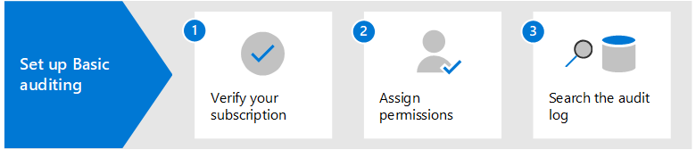
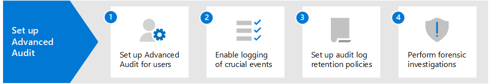

# Überwachungslösungen in Microsoft 365Auditing solutions in Microsoft 365

Die Überwachungslösungen von Microsoft 365 bieten eine integrierte Lösung, mit der Unternehmen effektiv auf Sicherheitsereignisse, forensische Untersuchungen, interne Untersuchungen und Compliance-Verpflichtungen reagieren können.Microsoft 365 auditing solutions provide an integrated solution to help organizations effectively respond to security events, forensic investigations, internal investigations, and compliance obligations. Tausende von Benutzer- und Administratorvorgängen, die in Dutzenden von Microsoft 365-Diensten und -Lösungen durchgeführt werden, werden erfasst, aufgezeichnet und im einheitlichen Überwachungsprotokoll Ihrer Organisation gespeichert.Thousands of user and admin operations performed in dozens of Microsoft 365 services and solutions are captured, recorded, and retained in your organization's unified audit log. Überwachungsdatensätze für diese Ereignisse können von Sicherheitsbeauftragten, IT-Administratoren, Insider-Risiko-Teams sowie Compliance- und Rechtsermittlern in Ihrem Unternehmen durchsucht werden.Audit records for these events are searchable by security ops, IT admins, insider risk teams, and compliance and legal investigators in your organization. Diese Funktion bietet einen Einblick in die Aktivitäten, die in Ihrer Microsoft 365-Organisation durchgeführt werden.This capability provides visibility into the activities performed across your Microsoft 365 organization.

## Microsoft 365-ÜberwachungslösungenMicrosoft 365 auditing solutions

Microsoft 365 bietet zwei Überwachungslösungen: Grundlegende Überwachung und Erweiterte Überwachung.Microsoft 365 provides two auditing solutions: Basic Audit and Advanced Audit.

### Grundlegende ÜberwachungBasic Audit

Die Grundlegende Überwachung bietet Ihnen die Möglichkeit, überwachte Aktivitäten zu protokollieren und danach zu suchen, und liefert Daten für Ihre forensischen, IT-, Compliance- und rechtlichen Untersuchungen.Basic Audit provides with you with the ability to log and search for audited activities and power your forensic, IT, compliance, and legal investigations.

- **Standardmäßig aktiviert**.**Enabled by default**. Die Grundlegende Überwachung ist standardmäßig für alle Organisationen mit dem entsprechenden Abonnement aktiviert.Basic Audit is turned on by default for all organizations with the appropriate subscription. Das bedeutet, dass Aufzeichnungen für überwachte Aktivitäten erfasst werden und durchsuchbar sind.That means records for audited activities will be captured and searchable. Die einzige Einrichtung, die erforderlich ist, besteht darin, die erforderlichen Berechtigungen für den Zugriff auf das Tool zur Suche im Überwachungsprotokoll (und das entsprechende Cmdlet) zuzuweisen und sicherzustellen, dass den Benutzern die richtige Lizenz für die Erweiterten Überwachungsfunktionen zugewiesen wird.The only setup that required is to assign the necessary permissions to access the audit log search tool (and the corresponding cmdlet) and make sure that user's are assigned the right license for Advanced Audit features.
- **Tausende von durchsuchbaren Überwachungsereignissen**.**Thousands of searchable audit events**. Sie können nach einer breiten Palette von überwachten Aktivitäten suchen, die bei den meisten Microsoft 365-Diensten in Ihrer Organisation auftreten.You can search for a wide-range of audited activities that occur is most of the Microsoft 365 services in your organization. Eine Teilliste der Aktivitäten, nach denen Sie suchen können, finden Sie unter [Überwachte Aktivitäten](search-the-audit-log-in-security-and-compliance.md#audited-activities).For a partial list of the activities you can search for, see [Audited activities](search-the-audit-log-in-security-and-compliance.md#audited-activities). Eine Liste der Dienste und Funktionen, die überwachte Aktivitäten unterstützen, finden Sie unter [Überwachungsprotokoll-Datensatztyp](/office/office-365-management-api/office-365-management-activity-api-schema#auditlogrecordtype).For a list of the services and features that support audited activities, see [Audit log record type](/office/office-365-management-api/office-365-management-activity-api-schema#auditlogrecordtype).
- **Suchtool für die Überwachung im Microsoft 365 Compliance Center**.**Audit search tool in the Microsoft 365 compliance center**. Verwenden Sie das Suchtool für Überwachungsprotokolle im Microsoft 365 Compliance Center, um nach Überwachungsdatensätze zu suchen.Use the Audit log search tool in the Microsoft 365 compliance center to search for audit records. Sie können nach bestimmten Aktivitäten suchen, nach Aktivitäten, die von bestimmten Benutzern ausgeführt wurden, und nach Aktivitäten, die in einem bestimmten Datumsbereich aufgetreten sind.You can search for specific activities, for activities performed by specific users, and activities that occurred with a date range. Hier ist ein Screenshot des Überwachungssuchtools im Compliance Center.Here's a screenshot of the Audit search tool in the compliance center.

   

- **Search-UnifiedAuditLog Cmdlet**.**Search-UnifiedAuditLog cmdlet**. Sie können auch das Cmdlet **Search-UnifiedAuditLog** in Exchange Online PowerShell (das zugrunde liegende Cmdlet für das Suchtool) verwenden, um nach Überwachungsereignissen zu suchen oder um es in einem Skript zu verwenden.You can also use the **Search-UnifiedAuditLog** cmdlet in Exchange Online PowerShell (the underlying cmdlet for the search tool) to search for audit events or to use in a script. Weitere Informationen finden Sie unter:For more information, see:

  - [Referenz für das Search-UnifiedAuditLog-CmdletSearch-UnifiedAuditLog cmdlet reference](/powershell/module/exchange/search-unifiedauditlog)
  - [Verwenden eines PowerShell-Skripts zum Durchsuchen des ÜberwachungsprotokollsUse a PowerShell script to search the audit log](audit-log-search-script.md)

- **Exportieren von Überwachungsdatensätzen in eine CSV-Datei**.**Export audit records to a CSV file**. Nach der Ausführung des Suchtools für das Überwachungsprotokoll im Compliance Center können Sie die von der Suche zurückgegebenen Überwachungsdatensätze in eine CSV-Datei exportieren.After running the Audit log search tool in the compliance center, you can export the audit records returned by the search to a CSV file. Damit können Sie in Microsoft Excel nach verschiedenen Eigenschaften von Überwachungsdatensätzen sortieren und filtern.This lets you use Microsoft Excel sort and filter on different audit record properties. Sie können auch die Transformationsfunktion in Microsoft Power Query für Excel verwenden, um jede Eigenschaft im AuditData JSON-Objekt in eine eigene Spalte aufzuteilen.You can also use Excel Power Query transform functionality to split each property in the AuditData JSON object into its own column. So können Sie ähnliche Daten für verschiedene Ereignisse effektiv anzeigen und vergleichen.This lets you effectively view and compare similar data for different events. Weitere Informationen finden Sie unter[Exportieren, Konfigurieren und Anzeigen von Überwachungsprotokoll-Datensätzen](export-view-audit-log-records.md).For more information, see [Export, configure, and view audit log records](export-view-audit-log-records.md).

- **Zugriff auf Überwachungsprotokolle über Office 365-Verwaltungsaktivitäts-API**.**Access to audit logs via Office 365 Management Activity API**. Eine dritte Methode für den Zugriff auf und das Abrufen von Überwachungsdatensätzen ist die Verwendung der Office 365-Verwaltungsaktivitäts-API.A third method for accessing and retrieving audit records is to use the Office 365 Management Activity API. Damit können Unternehmen Überwachungsdaten für längere Zeiträume als die standardmäßigen 90 Tage aufbewahren und ihre Überwachungsdaten in eine SIEM-Lösung importieren.This lets organizations retain auditing data for longer periods than the default 90 days and lets them import their auditing data to a SIEM solution. Weitere Informationen finden Sie in der [Referenz zur Office 365-Verwaltungsaktivitäts-API](/office/office-365-management-api/office-365-management-activity-api-reference).For more information, see [Office 365 Management Activity API reference](/office/office-365-management-api/office-365-management-activity-api-reference).

- **90-Tage-Aufbewahrung des Überwachungsprotokolls**.**90-day audit log retention**. Wenn eine überwachte Aktivität von einem Benutzer oder Administrator ausgeführt wird, wird ein Überwachungsdatensatz erstellt und im Überwachungsprotokoll Ihrer Organisation gespeichert.When an audited activity is performed by a user or admin, an audit record is generated and stored in the audit log for your organization. Bei der Grundlegenden Überwachung werden Aufzeichnungen 90 Tage lang aufbewahrt, d. h. Sie können nach Aktivitäten suchen, die innerhalb der letzten drei Monate stattgefunden haben.In Basic Audit, records are retained for 90 days, which means you can search for activities that occurred within the past three months.

### Erweiterte ÜberwachungAdvanced Audit

Die Erweiterte Überwachung baut auf den Funktionen der Grundlegenden Überwachung auf. Sie bietet Richtlinien für die Aufbewahrung von Überwachungsprotokollen, eine längere Aufbewahrung von Überwachungsdatensätzen, wichtige Ereignisse mit hohem Wert und erweiterten Zugriff auf die Office 365-Verwaltungsaktivitäts-API.Advanced Audit builds on the capabilities of Basic Audit by providing audit log retention policies, longer retention of audit records, high-value crucial events, and higher bandwidth access to the Office 365 Management Activity API.

- **Aufbewahrungsrichtlinien für Überwachungsprotokolle**.**Audit log retention policies**. Sie können benutzerdefinierte Aufbewahrungsrichtlinien für Überwachungsprotokolle erstellen, um Überwachungsdatensätze für längere Zeiträume bis zu einem Jahr (und bis zu 10 Jahren für Benutzer mit der erforderlichen Zusatzlizenz) aufzubewahren.You can create customized audit log retention policies to retain audit records for longer periods of time up to one year (and up to 10 years for users with required add-on license). Sie können die Aufbewahrungsrichtlinie für Überwachungsdatensätze basierend auf dem Dienst, in dem die Überwachungsaktivitäten stattfinden, auf bestimmten Überwachungsaktivitäten oder auf dem Benutzer, der eine Überwachungsaktivität durchführt, erstellen.You can create a policy to retain audit records based the service where the audited activities occur, specific audited activities, or the user who performs an audited activity.

- **Längere Aufbewahrung von Überwachungsdatensätzen**.**Longer retention of audit records**. Exchange-, SharePoint- und Azure Active Directory-Überwachungsdatensätzen werden standardmäßig ein Jahr lang aufbewahrt.Exchange, SharePoint, and Azure Active Directory audit records are retained for one year by default. Überwachungsdatensätze für alle anderen Aktivitäten werden standardmäßig 90 Tage lang aufbewahrt. Sie können jedoch mithilfe von Richtlinien zur Aufbewahrung von Überwachungsprotokollen auch längere Aufbewahrungszeiträume konfigurieren.Audit records for all other activities are retained for 90 days by default, or you can use audit log retention policies to configure longer retention periods.

- **Hochwertige, wichtige Ereignisse**. **High-value, crucial events**. Überwachungsdatensätze für wichtige Ereignisse können Ihrem Unternehmen helfen, forensische und Compliance-Untersuchungen durchzuführen, da sie Einblick in Ereignisse geben wie z. B. wann auf E-Mail-Elemente zugegriffen wurde oder wann E-Mail-Elemente beantwortet und weitergeleitet wurden, wann und wonach ein Benutzer in Exchange Online und SharePoint Online gesucht hat usw.Audit records for crucial events can help your organization conduct forensic and compliance investigations by providing visibility to events such as when mail items were accessed, or when mail items were replied to and forwarded, or when and what a user searched for in Exchange Online and SharePoint Online. Diese wichtigen Ereignisse können Ihnen dabei helfen, mögliche Verstöße zu untersuchen und das Ausmaß der Kompromittierung zu ermitteln.These crucial events can help you investigate possible breaches and determine the scope of compromise.

- **Höhere Bandbreite zur Office 365-Verwaltungsaktivitäts-API**.**Higher bandwidth to the Office 365 Management Activity API**. Erweiterte Überwachung bietet Organisationen eine größere Bandbreite für den Zugriff auf Überwachungsprotokolle über die Office 365-Verwaltungsaktivitäts-API.Advanced Audit provides organizations with more bandwidth to access auditing logs through the Office 365 Management Activity API. Obwohl allen Organisationen (die die Grundlegende oder Erweiterte Überwachung verwenden) anfänglich ein Basiswert von 2.000 Anfragen pro Minute zugewiesen wird, erhöht sich dieses Limit dynamisch in Abhängigkeit von der Anzahl der Arbeitsplätze einer Organisation und ihres Lizenzabonnements.Although all organizations (that have Basic Audit or Advanced Audit) are initially allocated a baseline of 2,000 requests per minute, this limit will dynamically increase depending on an organization's seat count and their licensing subscription. Dies führt dazu, dass Organisationen mit Erweiterter Überwachung etwa die doppelte Bandbreite erhalten als Organisationen mit Grundlegender Überwachung.This results in organizations with Advanced Audit getting about twice the bandwidth as organizations with Basic Audit.

Ausführlichere Informationen zu den Funktionen der Erweiterten Überwachung finden Sie unter [Erweiterte Überwachung in Microsoft 365](advanced-audit.md).For more detailed information about Advanced Audit features, see [Advanced Audit in Microsoft 365](advanced-audit.md).

## Vergleich der wichtigsten FunktionenComparison of key capabilities

In der folgenden Tabelle werden die wichtigsten Funktionen der Grundlegenden und der Erweiterten Überwachung verglichen.The following table compares the key capabilities available in Basic Audit and Advanced Audit. Alle Funktionen der Grundlegenden Überwachung sind in der Erweiterten Überwachung enthalten.All Basic Audit functionality is included in Advanced Audit.

|FunktionCapability|Grundlegende ÜberwachungBasic Audit|Erweiterte ÜberwachungAdvanced Audit|
|:------|:-------------|:-------------|
|Standardmäßig aktiviertEnabled by default|||
|Tausende von durchsuchbaren ÜberwachungsereignissenThousands of searchable audit events|||
|Suchtool für die Überwachung im Microsoft 365 Compliance CenterAudit search tool in the Microsoft 365 compliance center|||
|Search-UnifiedAuditLog-CmdletSearch-UnifiedAuditLog cmdlet|||
|Exportieren von Überwachungsdatensätzen in eine CSV-DateiExport audit records to CSV file|||
|Zugriff auf Überwachungsprotokolle über Office 365-Verwaltungsaktivitäts-API 1Access to audit logs via Office 365 Management Activity API 1|||
|90-Tage-Aufbewahrung des Überwachungsprotokolls90-day audit log retention|||
|1-jährige Aufbewahrung des Überwachungsprotokolls1-year audit log retention|||
|10-jährige Aufbewahrung des Überwachungsprotokolls 210-year audit log retention 2|||
|Aufbewahrungsrichtlinien für ÜberwachungsprotokolleAudit log retention policies|||
|Hochwertige, wichtige EreignisseHigh-value, crucial events|||
||||
> [!NOTE]
> 1 Die Erweiterte Überwachung beinhaltet einen Zugriff mit höherer Bandbreite auf die Office 365-Verwaltungsaktivitäts-API, die einen schnelleren Zugriff auf die Überwachungsdaten ermöglicht.1 Advanced Audit includes higher bandwidth access to the Office 365 Management Activity API, which provides faster access to audit data. 2 Zusätzlich zur erforderlichen Lizenzierung für die Erweiterte Überwachung (im nächsten Abschnitt beschrieben) muss einem Benutzer eine Zusatzlizenz für die 10-jährige Aufbewahrung des Überwachungsprotokolls zugewiesen werden, um seine Überwachungsprotokolle 10 Jahre lang aufzubewahren.2 In addition to the required licensing for Advanced Audit (described in the next section), a user must be assigned a 10-Year Audit Log Retention add on license to retain their audit records for 10 years.

## LizenzierungsanforderungenLicensing requirements

In den folgenden Abschnitten werden die Lizenzierungsanforderungen für die Grundlegende und die Erweiterte Überwachung beschrieben.The following sections identify the licensing requirements for Basic Audit and Advanced Audit. Die Funktionen der Grundlegenden Überwachung sind in der Erweiterten Überwachung enthalten.Basic Audit functionality is included with Advanced Auditing.

### Grundlegende ÜberwachungBasic Audit

- Microsoft 365 Enterprise E3-AbonnementMicrosoft 365 Enterprise E3 subscription
- Microsoft 365 Business PremiumMicrosoft 365 Business Premium
- Microsoft 365 Education A3-AbonnementMicrosoft 365 Education A3 subscription
- Microsoft 365 Government G3-AbonnementMicrosoft 365 Government G3 subscription
- Microsoft 365 Government G1-AbonnementMicrosoft 365 Government G1 subscription
- Office 365 Enterprise E3-AbonnementOffice 365 Enterprise E3 subscription
- Office 365 Enterprise E1-AbonnementOffice 365 Enterprise E1 subscription
- Office 365 Education A1-AbonnementOffice 365 Education A1 subscription
- Office 365 Education A3-AbonnementOffice 365 Education A3 subscription

### Erweiterte ÜberwachungAdvanced Audit

- Microsoft 365 Enterprise E5-AbonnementMicrosoft 365 Enterprise E5 subscription
- Microsoft 365 Enterprise E3-Abonnement mit dem Microsoft 365 E5 Compliance-Add-OnMicrosoft 365 Enterprise E3 subscription + the Microsoft 365 E5 Compliance add-on
- Microsoft 365 Enterprise E3-Abonnement mit dem Microsoft 365 E5 eDiscovery- und Überwachungs-Add-OnMicrosoft 365 Enterprise E3 subscription + the Microsoft 365 E5 eDiscovery and Audit add-on
- Microsoft 365 Education A5-AbonnementMicrosoft 365 Education A5 subscription
- Microsoft 365 Education A3-Abonnement mit dem Microsoft 365 A5-Compliance-Add-OnMicrosoft 365 Education A3 subscription + the Microsoft 365 A5 Compliance add-on
- Microsoft 365 Education A3-Abonnement mit dem Microsoft 365 A5 eDiscovery- und Überwachungs-Add-OnMicrosoft 365 Education A3 subscription + the Microsoft 365 A5 eDiscovery and Audit add-on
- Microsoft 365 Government G5-AbonnementMicrosoft 365 Government G5 subscription
- Microsoft 365 Government G5-Abonnement mit dem Microsoft 365 G5-Compliance-Add-OnMicrosoft 365 Government G5 subscription + the Microsoft 365 G5 Compliance add-on
- Microsoft 365 Government G5-Abonnement mit dem Microsoft 365 G5 eDiscovery- und Überwachungs-Add-OnMicrosoft 365 Government G5 subscription + the Microsoft 365 G5 eDiscovery and Audit add-on
- Office 365 Enterprise E5-AbonnementOffice 365 Enterprise E5 subscription
- Office 365 Education A5-AbonnementOffice 365 Education A5 subscription
- Office 365 Enterprise E3-Abonnement mit dem Add-On Office 365 Advanced Compliance (nicht mehr für neue Abonnements verfügbar)Office 365 Enterprise E3 subscription + the Office 365 Advanced Compliance add-on (no longer available for new subscriptions)

## Einrichten von Microsoft 365 ÜberwachungslösungenSet up Microsoft 365 auditing solutions

Um mit der Verwendung der Überwachungslösungen in Microsoft 365 zu beginnen, lesen Sie die folgende Anleitung zur Einrichtung.To get started using the auditing solutions in Microsoft 365, see the following setup guidance.

### Einrichten der Grundlegenden ÜberwachungSet up Basic Audit

Der erste Schritt besteht darin, die Grundlegende Überwachung einzurichten und dann die Suche im Überwachungsprotokoll zu starten.The first step is to set up Basic Audit and then start running audit log searches.

1. Vergewissern Sie sich, dass Ihr Unternehmen über ein Abonnement verfügt, das die Grundlegende Überwachung unterstützt, und gegebenenfalls ein Abonnement, das die Erweiterte Überwachung unterstützt.Verify that your organization has a subscription that supports Basic Audit and if applicable, a subscription that supports Advanced Audit.

2. Weisen Sie Personen in Ihrer Organisation, die das Suchtool für das Überwachungsprotokoll im Microsoft 365 Compliance Center oder das Cmdlet **Search-UnifiedAuditLog** verwenden werden, entsprechende Berechtigungen in Exchange Online zu.Assign permissions in Exchange Online to people in your organization who will use the audit log search tool in the Microsoft 365 compliance center or use the **Search-UnifiedAuditLog** cmdlet. Insbesondere muss den Benutzern die Rolle "Überwachungsprotokolle nur anzeigen" oder "Überwachungsprotokolle" in Exchange Online zugewiesen werden.Specifically, users must be assigned the View-Only Audit Logs or Audit Logs role in Exchange Online.

3. Durchsuchen des Überwachungsprotokolls. Nach Abschluss von Schritt 1 und Schritt 2 können Benutzer in Ihrer Organisation mit dem Tool für die Überwachungsprotokollsuche (oder dem entsprechenden Cmdlet) nach geprüften Aktivitäten suchen.Search the audit log. After completing step 1 and step 2, users in your organization can use the audit log search tool (or corresponding cmdlet) to search for audited activities.

Ausführlichere Anweisungen finden Sie unter [Einrichten der Grundlegenden Überwachung](set-up-basic-audit.md).For more detailed instructions, see [Set up Basic Audit](set-up-basic-audit.md).

### Einrichten der Erweiterten ÜberwachungSet up Advanced Audit

Wenn Ihr Unternehmen über ein Abonnement verfügt, das die Erweiterte Überwachung unterstützt, führen Sie die folgenden Schritte aus, um die zusätzlichen Funktionen der Erweiterten Überwachung einzurichten und zu nutzen.If your organization has a subscription that supports Advanced Audit, perform the following steps to set up and use the additional capabilities in Advanced Audit.

1. Erweiterte Überwachung für Benutzer einrichten.Set up Advanced Audit for users. Dieser Schritt besteht aus den folgenden Aufgaben:This step consists of the following tasks:

   - Überprüfen, ob den Benutzern die entsprechende Lizenz oder Zusatzlizenz für die Erweiterte Überwachung zugewiesen ist.Verifying that users are assigned the appropriate license or add-on license for Advanced Audit.
  
   - Die Erweiterte Überwachungs-App/der Serviceplan muss für diese Benutzer aktiviert werden.Turning on the Advanced Audit app/service plan must be for those users.
  
   - Aktivieren Sie die Überwachung wichtiger Ereignisse und schalten Sie dann die Erweiterte Überwachungs-App/den Serviceplan für diese Benutzer ein.Enabling the auditing of crucial events and then turning on the Advanced Auditing app/service plan for those users.

2. Aktivierung der Protokollierung von wichtigen Ereignissen, wenn Benutzer in Exchange Online und SharePoint Online Suchvorgänge durchführen.Enable crucial events to be logged when users perform searches in Exchange Online and SharePoint Online.

3. Einrichten von Richtlinien zur Aufbewahrung von Überwachungsprotokollen. Zusätzlich zur Standardrichtlinie, die Exchange-, SharePoint- und Azure AD-Überwachungsprotokolle ein Jahr lang aufbewahrt, können Sie weitere Richtlinien zur Aufbewahrung von Überwachungsprotokollen erstellen, um die Anforderungen der Sicherheits-, IT- und Compliance-Teams Ihres Unternehmens zu erfüllen.Set up audit log retention policies. In additional to the default policy that retains Exchange, SharePoint, and Azure AD audit records for one year, you can create additional audit log retention policies to meet the requirements of your organization's security operations, IT, and compliance teams.

4. Suchen nach wichtigen Ereignissen und anderen Aktvitäten während forensischer Untersuchungen. Nach Abschluss von Schritt 1 und Schritt 2 können Sie das Überwachungsprotokoll bei forensischen Untersuchungen von kompromittierten Konten und anderen Arten von Sicherheits- oder Compliance-Untersuchungen nach wichtigen Ereignissen und anderen Aktivitäten durchsuchen.Search for crucial events and other activities when conducting forensic investigations. After completing step 1 and step 2, you can search the audit log for crucial events and other activities during forensic investigations of compromised accounts and other types of security or compliance investigations.

Ausführlichere Anweisungen finden Sie unter [Einrichten der Erweiterten Überwachung](set-up-advanced-audit.md).For more detailed instructions, see [Set up Advanced Audit](set-up-advanced-audit.md).

## SchulungTraining

Die Schulung Ihres Teams für Sicherheitsvorgänge, Ihrer IT-Administratoren und Ihres Compliance-Ermittler-Teams in der grundlegenden und der erweiterten Überwachung kann Ihrer Organisation helfen, schneller mit der Verwendung von Überwachungen zur Unterstützung Ihrer Untersuchungen zu beginnen.Training your security operations team, IT administrators, and compliance investigators team in the fundamentals for Basic Audit and Advanced Audit can help your organization get started more quickly using auditing to help with your investigations. Microsoft 365 stellt die folgende Ressource zur Verfügung, um diesen Benutzern in Ihrer Organisation den Einstieg in die Überwachung zu erleichtern: [eDiscovery-Funktionen und Überwachungsfunktionen von Microsoft 365 beschreiben](/learn/modules/describe-ediscovery-capabilities-of-microsoft-365).Microsoft 365 provides the following resource to help these users in your organization getting started with auditing: [Describe the eDiscovery and audit capabilities of Microsoft 365](/learn/modules/describe-ediscovery-capabilities-of-microsoft-365).
