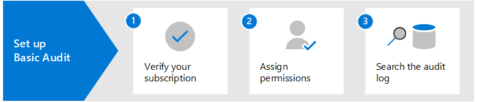

# Überwachungslösungen in Microsoft 365

Die Überwachungslösungen von Microsoft 365 bieten eine integrierte Lösung, mit der Unternehmen effektiv auf Sicherheitsereignisse, forensische Untersuchungen, interne Untersuchungen und Compliance-Verpflichtungen reagieren können. Tausende von Benutzer- und Administratorvorgängen, die in Dutzenden von Microsoft 365-Diensten und -Lösungen durchgeführt werden, werden erfasst, aufgezeichnet und im einheitlichen Überwachungsprotokoll Ihrer Organisation gespeichert. Überwachungsdatensätze für diese Ereignisse können von Sicherheitsbeauftragten, IT-Administratoren, Insider-Risiko-Teams sowie Compliance- und Rechtsermittlern in Ihrem Unternehmen durchsucht werden. Diese Funktion bietet einen Einblick in die Aktivitäten, die in Ihrer Microsoft 365-Organisation durchgeführt werden.

## Microsoft 365-Überwachungslösungen

Microsoft 365 bietet zwei Überwachungslösungen: Grundlegende Überwachung und Erweiterte Überwachung.

### Grundlegende Überwachung

Die Grundlegende Überwachung bietet Ihnen die Möglichkeit, überwachte Aktivitäten zu protokollieren und danach zu suchen, und liefert Daten für Ihre forensischen, IT-, Compliance- und rechtlichen Untersuchungen.

- **Standardmäßig aktiviert**. Die Grundlegende Überwachung ist standardmäßig für alle Organisationen mit dem entsprechenden Abonnement aktiviert. Das bedeutet, dass Aufzeichnungen für überwachte Aktivitäten erfasst werden und durchsuchbar sind. Die einzige Einrichtung, die erforderlich ist, besteht darin, die erforderlichen Berechtigungen für den Zugriff auf das Tool zur Suche im Überwachungsprotokoll (und das entsprechende Cmdlet) zuzuweisen und sicherzustellen, dass den Benutzern die richtige Lizenz für die Erweiterten Überwachungsfunktionen zugewiesen wird.
- **Tausende von durchsuchbaren Überwachungsereignissen**. Sie können nach einer breiten Palette von überwachten Aktivitäten suchen, die bei den meisten Microsoft 365-Diensten in Ihrer Organisation auftreten. Eine Teilliste der Aktivitäten, nach denen Sie suchen können, finden Sie unter [Überwachte Aktivitäten](search-the-audit-log-in-security-and-compliance.md#audited-activities). Eine Liste der Dienste und Funktionen, die überwachte Aktivitäten unterstützen, finden Sie unter [Überwachungsprotokoll-Datensatztyp](/office/office-365-management-api/office-365-management-activity-api-schema#auditlogrecordtype).
- **Suchtool für die Überwachung im Microsoft 365 Compliance Center**. Verwenden Sie das Suchtool für Überwachungsprotokolle im Microsoft 365 Compliance Center, um nach Überwachungsdatensätze zu suchen. Sie können nach bestimmten Aktivitäten suchen, nach Aktivitäten, die von bestimmten Benutzern ausgeführt wurden, und nach Aktivitäten, die in einem bestimmten Datumsbereich aufgetreten sind. Hier ist ein Screenshot des Überwachungssuchtools im Compliance Center.

   

- **Search-UnifiedAuditLog Cmdlet**. Sie können auch das Cmdlet **Search-UnifiedAuditLog** in Exchange Online PowerShell (das zugrunde liegende Cmdlet für das Suchtool) verwenden, um nach Überwachungsereignissen zu suchen oder um es in einem Skript zu verwenden. Weitere Informationen finden Sie unter:

  - [Referenz für das Search-UnifiedAuditLog-Cmdlet](/powershell/module/exchange/search-unifiedauditlog)
  - [Verwenden eines PowerShell-Skripts zum Durchsuchen des Überwachungsprotokolls](audit-log-search-script.md)

- **Exportieren von Überwachungsdatensätzen in eine CSV-Datei**. Nach der Ausführung des Suchtools für das Überwachungsprotokoll im Compliance Center können Sie die von der Suche zurückgegebenen Überwachungsdatensätze in eine CSV-Datei exportieren. Damit können Sie in Microsoft Excel nach verschiedenen Eigenschaften von Überwachungsdatensätzen sortieren und filtern. Sie können auch die Transformationsfunktion in Microsoft Power Query für Excel verwenden, um jede Eigenschaft im AuditData JSON-Objekt in eine eigene Spalte aufzuteilen. So können Sie ähnliche Daten für verschiedene Ereignisse effektiv anzeigen und vergleichen. Weitere Informationen finden Sie unter[Exportieren, Konfigurieren und Anzeigen von Überwachungsprotokoll-Datensätzen](export-view-audit-log-records.md).

- **Zugriff auf Überwachungsprotokolle über Office 365-Verwaltungsaktivitäts-API**. Eine dritte Methode für den Zugriff auf und das Abrufen von Überwachungsdatensätzen ist die Verwendung der Office 365-Verwaltungsaktivitäts-API. Damit können Unternehmen Überwachungsdaten für längere Zeiträume als die standardmäßigen 90 Tage aufbewahren und ihre Überwachungsdaten in eine SIEM-Lösung importieren. Weitere Informationen finden Sie in der [Referenz zur Office 365-Verwaltungsaktivitäts-API](/office/office-365-management-api/office-365-management-activity-api-reference).

- **90-Tage-Aufbewahrung des Überwachungsprotokolls**. Wenn eine überwachte Aktivität von einem Benutzer oder Administrator ausgeführt wird, wird ein Überwachungsdatensatz erstellt und im Überwachungsprotokoll Ihrer Organisation gespeichert. Bei der Grundlegenden Überwachung werden Aufzeichnungen 90 Tage lang aufbewahrt, d. h. Sie können nach Aktivitäten suchen, die innerhalb der letzten drei Monate stattgefunden haben.

### Erweiterte Überwachung

Die Erweiterte Überwachung baut auf den Funktionen der Grundlegenden Überwachung auf. Sie bietet Richtlinien für die Aufbewahrung von Überwachungsprotokollen, eine längere Aufbewahrung von Überwachungsdatensätzen, wichtige Ereignisse mit hohem Wert und erweiterten Zugriff auf die Office 365-Verwaltungsaktivitäts-API.

- **Aufbewahrungsrichtlinien für Überwachungsprotokolle**. Sie können benutzerdefinierte Aufbewahrungsrichtlinien für Überwachungsprotokolle erstellen, um Überwachungsdatensätze für längere Zeiträume bis zu einem Jahr (und bis zu 10 Jahren für Benutzer mit der erforderlichen Zusatzlizenz) aufzubewahren. Sie können die Aufbewahrungsrichtlinie für Überwachungsdatensätze basierend auf dem Dienst, in dem die Überwachungsaktivitäten stattfinden, auf bestimmten Überwachungsaktivitäten oder auf dem Benutzer, der eine Überwachungsaktivität durchführt, erstellen.

- **Längere Aufbewahrung von Überwachungsdatensätzen**. Exchange-, SharePoint- und Azure Active Directory-Überwachungsdatensätzen werden standardmäßig ein Jahr lang aufbewahrt. Überwachungsdatensätze für alle anderen Aktivitäten werden standardmäßig 90 Tage lang aufbewahrt. Sie können jedoch mithilfe von Richtlinien zur Aufbewahrung von Überwachungsprotokollen auch längere Aufbewahrungszeiträume konfigurieren.

- **Hochwertige, wichtige Ereignisse**.  Überwachungsdatensätze für wichtige Ereignisse können Ihrem Unternehmen helfen, forensische und Compliance-Untersuchungen durchzuführen, da sie Einblick in Ereignisse geben wie z. B. wann auf E-Mail-Elemente zugegriffen wurde oder wann E-Mail-Elemente beantwortet und weitergeleitet wurden, wann und wonach ein Benutzer in Exchange Online und SharePoint Online gesucht hat usw. Diese wichtigen Ereignisse können Ihnen dabei helfen, mögliche Verstöße zu untersuchen und das Ausmaß der Kompromittierung zu ermitteln.

- **Höhere Bandbreite zur Office 365-Verwaltungsaktivitäts-API**. Erweiterte Überwachung bietet Organisationen eine größere Bandbreite für den Zugriff auf Überwachungsprotokolle über die Office 365-Verwaltungsaktivitäts-API. Obwohl allen Organisationen (die die Grundlegende oder Erweiterte Überwachung verwenden) anfänglich ein Basiswert von 2.000 Anfragen pro Minute zugewiesen wird, erhöht sich dieses Limit dynamisch in Abhängigkeit von der Anzahl der Arbeitsplätze einer Organisation und ihres Lizenzabonnements. Dies führt dazu, dass Organisationen mit Erweiterter Überwachung etwa die doppelte Bandbreite erhalten als Organisationen mit Grundlegender Überwachung.

Ausführlichere Informationen zu den Funktionen der Erweiterten Überwachung finden Sie unter [Erweiterte Überwachung in Microsoft 365](advanced-audit.md).

## Vergleich der wichtigsten Funktionen

In der folgenden Tabelle werden die wichtigsten Funktionen der Grundlegenden und der Erweiterten Überwachung verglichen. Alle Funktionen der Grundlegenden Überwachung sind in der Erweiterten Überwachung enthalten.

|Funktion|Grundlegende Überwachung|Erweiterte Überwachung|
|:------|:-------------|:-------------|
|Standardmäßig aktiviert|||
|Tausende von durchsuchbaren Überwachungsereignissen|||
|Suchtool für die Überwachung im Microsoft 365 Compliance Center|||
|Search-UnifiedAuditLog-Cmdlet|||
|Exportieren von Überwachungsdatensätzen in eine CSV-Datei|||
|Zugriff auf Überwachungsprotokolle über Office 365-Verwaltungsaktivitäts-API 1|||
|90-Tage-Aufbewahrung des Überwachungsprotokolls|||
|1-jährige Aufbewahrung des Überwachungsprotokolls|||
|10-jährige Aufbewahrung des Überwachungsprotokolls 2|||
|Aufbewahrungsrichtlinien für Überwachungsprotokolle|||
|Hochwertige, wichtige Ereignisse|||
||||
> [!NOTE]
> 1 Die Erweiterte Überwachung beinhaltet einen Zugriff mit höherer Bandbreite auf die Office 365-Verwaltungsaktivitäts-API, die einen schnelleren Zugriff auf die Überwachungsdaten ermöglicht. 2 Zusätzlich zur erforderlichen Lizenzierung für die Erweiterte Überwachung (im nächsten Abschnitt beschrieben) muss einem Benutzer eine Zusatzlizenz für die 10-jährige Aufbewahrung des Überwachungsprotokolls zugewiesen werden, um seine Überwachungsprotokolle 10 Jahre lang aufzubewahren.

## Lizenzierungsanforderungen

In den folgenden Abschnitten werden die Lizenzierungsanforderungen für die Grundlegende und die Erweiterte Überwachung beschrieben. Die Funktionen der Grundlegenden Überwachung sind in der Erweiterten Überwachung enthalten.

### Grundlegende Überwachung

- Microsoft 365 Enterprise E3-Abonnement
- Microsoft 365 Business Premium
- Microsoft 365 Education A3-Abonnement
- Microsoft 365 Government G3-Abonnement
- Microsoft 365 Government G1-Abonnement
- Office 365 Enterprise E3-Abonnement
- Office 365 Enterprise E1-Abonnement
- Office 365 Education A1-Abonnement
- Office 365 Education A3-Abonnement

### Erweiterte Überwachung

- Microsoft 365 Enterprise E5-Abonnement
- Microsoft 365 Enterprise E3-Abonnement mit dem Microsoft 365 E5 Compliance-Add-On
- Microsoft 365 Enterprise E3-Abonnement mit dem Microsoft 365 E5 eDiscovery- und Überwachungs-Add-On
- Microsoft 365 Education A5-Abonnement
- Microsoft 365 Education A3-Abonnement mit dem Microsoft 365 A5-Compliance-Add-On
- Microsoft 365 Education A3-Abonnement mit dem Microsoft 365 A5 eDiscovery- und Überwachungs-Add-On
- Microsoft 365 Government G5-Abonnement
- Microsoft 365 Government G5-Abonnement mit dem Microsoft 365 G5-Compliance-Add-On
- Microsoft 365 Government G5-Abonnement mit dem Microsoft 365 G5 eDiscovery- und Überwachungs-Add-On
- Office 365 Enterprise E5-Abonnement
- Office 365 Education A5-Abonnement
- Office 365 Enterprise E3-Abonnement mit dem Add-On Office 365 Advanced Compliance (nicht mehr für neue Abonnements verfügbar)

## Einrichten von Microsoft 365 Überwachungslösungen

Um mit der Verwendung der Überwachungslösungen in Microsoft 365 zu beginnen, lesen Sie die folgende Anleitung zur Einrichtung.

### Einrichten der Grundlegenden Überwachung

Der erste Schritt besteht darin, die Grundlegende Überwachung einzurichten und dann die Suche im Überwachungsprotokoll zu starten.

1. Vergewissern Sie sich, dass Ihr Unternehmen über ein Abonnement verfügt, das die Grundlegende Überwachung unterstützt, und gegebenenfalls ein Abonnement, das die Erweiterte Überwachung unterstützt.

2. Weisen Sie Personen in Ihrer Organisation, die das Suchtool für das Überwachungsprotokoll im Microsoft 365 Compliance Center oder das Cmdlet **Search-UnifiedAuditLog** verwenden werden, entsprechende Berechtigungen in Exchange Online zu. Insbesondere muss den Benutzern die Rolle "Überwachungsprotokolle nur anzeigen" oder "Überwachungsprotokolle" in Exchange Online zugewiesen werden.

3. Durchsuchen des Überwachungsprotokolls. Nach Abschluss von Schritt 1 und Schritt 2 können Benutzer in Ihrer Organisation mit dem Tool für die Überwachungsprotokollsuche (oder dem entsprechenden Cmdlet) nach geprüften Aktivitäten suchen.

Ausführlichere Anweisungen finden Sie unter [Einrichten der Grundlegenden Überwachung](set-up-basic-audit.md).

### Einrichten der Erweiterten Überwachung

Wenn Ihr Unternehmen über ein Abonnement verfügt, das die Erweiterte Überwachung unterstützt, führen Sie die folgenden Schritte aus, um die zusätzlichen Funktionen der Erweiterten Überwachung einzurichten und zu nutzen.

1. Erweiterte Überwachung für Benutzer einrichten. Dieser Schritt besteht aus den folgenden Aufgaben:

   - Überprüfen, ob den Benutzern die entsprechende Lizenz oder Zusatzlizenz für die Erweiterte Überwachung zugewiesen ist.
  
   - Die Erweiterte Überwachungs-App/der Serviceplan muss für diese Benutzer aktiviert werden.
  
   - Aktivieren Sie die Überwachung wichtiger Ereignisse und schalten Sie dann die Erweiterte Überwachungs-App/den Serviceplan für diese Benutzer ein.

2. Aktivierung der Protokollierung von wichtigen Ereignissen, wenn Benutzer in Exchange Online und SharePoint Online Suchvorgänge durchführen.

3. Einrichten von Richtlinien zur Aufbewahrung von Überwachungsprotokollen. Zusätzlich zur Standardrichtlinie, die Exchange-, SharePoint- und Azure AD-Überwachungsprotokolle ein Jahr lang aufbewahrt, können Sie weitere Richtlinien zur Aufbewahrung von Überwachungsprotokollen erstellen, um die Anforderungen der Sicherheits-, IT- und Compliance-Teams Ihres Unternehmens zu erfüllen.

4. Suchen nach wichtigen Ereignissen und anderen Aktvitäten während forensischer Untersuchungen. Nach Abschluss von Schritt 1 und Schritt 2 können Sie das Überwachungsprotokoll bei forensischen Untersuchungen von kompromittierten Konten und anderen Arten von Sicherheits- oder Compliance-Untersuchungen nach wichtigen Ereignissen und anderen Aktivitäten durchsuchen.

Ausführlichere Anweisungen finden Sie unter [Einrichten der Erweiterten Überwachung](set-up-advanced-audit.md).

## Schulung

Die Schulung Ihres Teams für Sicherheitsabläufe, von IT-Administratoren und Compliance-Ermittlern in der Grundlegenden und der Erweiterten Überwachung kann Ihrer Organisation helfen, schneller mit der Verwendung von Überwachungen zur Unterstützung Ihrer Untersuchungen zu beginnen. Microsoft 365 stellt die folgende Ressource zur Verfügung, um diesen Benutzern in Ihrer Organisation den Einstieg in die Überwachung zu erleichtern: [Die Überwachungsfunktionen in Microsoft 365 beschreiben](/learn/modules/describe-audit-capabilities-microsoft-365).
