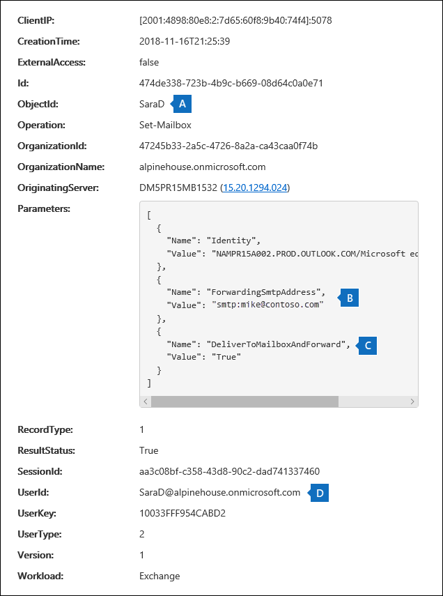

# <a name="search-the-audit-log-to-investigate-common-support-issues"></a><span data-ttu-id="61347-103">Durchsuchen des Überwachungsprotokolls, um häufige Supportprobleme zu untersuchen</span><span class="sxs-lookup"><span data-stu-id="61347-103">Search the audit log to investigate common support issues</span></span>

<span data-ttu-id="61347-104">In diesem Artikel wird beschrieben, wie Sie das Suchtool für Überwachungsprotokolle verwenden, um häufige Supportprobleme zu untersuchen.</span><span class="sxs-lookup"><span data-stu-id="61347-104">This article describes how to use the audit log search tool to help you investigate common support issues.</span></span> <span data-ttu-id="61347-105">Dazu gehört die Verwendung des Überwachungsprotokolls für:</span><span class="sxs-lookup"><span data-stu-id="61347-105">This includes using the audit log to:</span></span>

- <span data-ttu-id="61347-106">Suchen der IP-Adresse des Computers, der für den Zugriff auf ein gefährdetes Konto verwendet wird</span><span class="sxs-lookup"><span data-stu-id="61347-106">Find the IP address of the computer used to access a compromised account</span></span>
- <span data-ttu-id="61347-107">Bestimmen, wer die E-Mail-Weiterleitung für ein Postfach eingerichtet hat</span><span class="sxs-lookup"><span data-stu-id="61347-107">Determine who set up email forwarding for a mailbox</span></span>
- <span data-ttu-id="61347-108">Ermitteln, ob ein Benutzer E-Mail-Elemente in ihrem Postfach gelöscht hat</span><span class="sxs-lookup"><span data-stu-id="61347-108">Determine if a user deleted email items in their mailbox</span></span>
- <span data-ttu-id="61347-109">Ermitteln, ob ein Benutzer eine Posteingangsregel erstellt hat</span><span class="sxs-lookup"><span data-stu-id="61347-109">Determine if a user created an inbox rule</span></span>
- <span data-ttu-id="61347-110">Untersuchen, warum es eine erfolgreiche Anmeldung durch einen Benutzer außerhalb Ihrer Organisation gab</span><span class="sxs-lookup"><span data-stu-id="61347-110">Investigate why there was a successful login by a user outside your organization</span></span>
- <span data-ttu-id="61347-111">Suchen nach Postfachaktivitäten, die von Benutzern mit Nicht-E5-Lizenzen ausgeführt werden</span><span class="sxs-lookup"><span data-stu-id="61347-111">Search for mailbox activities performed by users with non-E5 licenses</span></span>
- <span data-ttu-id="61347-112">Suchen nach Postfachaktivitäten, die von stellvertretungsbenutzern ausgeführt werden</span><span class="sxs-lookup"><span data-stu-id="61347-112">Search for mailbox activities performed by delegate users</span></span>

## <a name="using-the-audit-log-search-tool"></a><span data-ttu-id="61347-113">Verwenden des Überwachungsprotokollsuchtools</span><span class="sxs-lookup"><span data-stu-id="61347-113">Using the audit log search tool</span></span>

<span data-ttu-id="61347-114">Jedes der in diesem Artikel beschriebenen Problembehandlungsszenarien basiert auf der Verwendung des Überwachungsprotokollsuchtools im Security & Compliance Center.</span><span class="sxs-lookup"><span data-stu-id="61347-114">Each of the troubleshooting scenarios described in this article is based on using the audit log search tool in the Security & Compliance Center.</span></span> <span data-ttu-id="61347-115">In diesem Abschnitt werden die berechtigungen aufgeführt, die zum Durchsuchen des Überwachungsprotokolls erforderlich sind, und die Schritte zum Zugreifen auf und Ausführen von Überwachungsprotokollsuchen beschrieben.</span><span class="sxs-lookup"><span data-stu-id="61347-115">This section lists the permissions required to search the audit log and describes the steps to access and run audit log searches.</span></span> <span data-ttu-id="61347-116">In jedem Szenarioabschnitt wird erläutert, wie Sie eine Überwachungsprotokollsuchabfrage konfigurieren und wie Sie in den detaillierten Informationen in den Überwachungsdatensätzen suchen, die den Suchkriterien entsprechen.</span><span class="sxs-lookup"><span data-stu-id="61347-116">Each scenario section explains how to configure an audit log search query and what to look for in the detailed information in the audit records that match the search criteria.</span></span>

### <a name="permissions-required-to-use-the-audit-log-search-tool"></a><span data-ttu-id="61347-117">Erforderliche Berechtigungen für die Verwendung des Überwachungsprotokollsuchtools</span><span class="sxs-lookup"><span data-stu-id="61347-117">Permissions required to use the audit log search tool</span></span>

<span data-ttu-id="61347-118">Ihnen muss die Rolle View-Only Überwachungsprotokolle oder Überwachungsprotokolle in der Exchange Online das Überwachungsprotokoll durchsucht werden.</span><span class="sxs-lookup"><span data-stu-id="61347-118">You must be assigned the View-Only Audit Logs or Audit Logs role in Exchange Online to search the audit log.</span></span> <span data-ttu-id="61347-119">Standardmäßig sind diese Rollen im Exchange Admin Center zugewiesen den Rollengruppen „Complianceverwaltung“ und „Organisationsverwaltung“ auf der Seite **Berechtigungen**.</span><span class="sxs-lookup"><span data-stu-id="61347-119">By default, these roles are assigned to the Compliance Management and Organization Management role groups on the **Permissions** page in the Exchange admin center.</span></span> <span data-ttu-id="61347-120">Globale Administratoren in Office 365 und Microsoft 365 werden automatisch als Mitglieder der Rollengruppe Organisationsverwaltung in Exchange Online.</span><span class="sxs-lookup"><span data-stu-id="61347-120">Global administrators in Office 365 and Microsoft 365 are automatically added as members of the Organization Management role group in Exchange Online.</span></span> <span data-ttu-id="61347-121">Weitere Informationen finden Sie unter [Verwalten von Rollengruppen in Exchange Online](/Exchange/permissions-exo/role-groups).</span><span class="sxs-lookup"><span data-stu-id="61347-121">For more information, see [Manage role groups in Exchange Online](/Exchange/permissions-exo/role-groups).</span></span>

### <a name="running-audit-log-searches"></a><span data-ttu-id="61347-122">Ausführen von Überwachungsprotokollsuchen</span><span class="sxs-lookup"><span data-stu-id="61347-122">Running audit log searches</span></span>

<span data-ttu-id="61347-123">In diesem Abschnitt werden die Grundlagen zum Erstellen und Ausführen von Überwachungsprotokollsuchen beschrieben.</span><span class="sxs-lookup"><span data-stu-id="61347-123">This section describes the basics for creating and running audit log searches.</span></span> <span data-ttu-id="61347-124">Verwenden Sie diese Anweisungen als Ausgangspunkt für jedes Problembehandlungsszenario in diesem Artikel.</span><span class="sxs-lookup"><span data-stu-id="61347-124">Use these instructions as a starting point for each troubleshooting scenario in this article.</span></span> <span data-ttu-id="61347-125">Ausführlichere Schritt-für-Schritt-Anweisungen finden Sie unter [Durchsuchen des Überwachungsprotokolls](search-the-audit-log-in-security-and-compliance.md#step-1-run-an-audit-log-search).</span><span class="sxs-lookup"><span data-stu-id="61347-125">For more detailed step-by-step instructions, see [Search the audit log](search-the-audit-log-in-security-and-compliance.md#step-1-run-an-audit-log-search).</span></span>

1. <span data-ttu-id="61347-126">Wechseln Sie [https://protection.office.com/unifiedauditlog](https://protection.office.com/unifiedauditlog) zu, und melden Sie sich mit Ihrem Arbeits- oder Schulkonto an.</span><span class="sxs-lookup"><span data-stu-id="61347-126">Go to [https://protection.office.com/unifiedauditlog](https://protection.office.com/unifiedauditlog) and sign in using your work or school account.</span></span>
    
    <span data-ttu-id="61347-127">Die Seite **Überwachungsprotokollsuche** wird angezeigt.</span><span class="sxs-lookup"><span data-stu-id="61347-127">The **Audit log search** page is displayed.</span></span> 
    
    
  
4. <span data-ttu-id="61347-129">Sie können die folgenden Suchkriterien konfigurieren.</span><span class="sxs-lookup"><span data-stu-id="61347-129">You can configure the following search criteria.</span></span> <span data-ttu-id="61347-130">Jedes Problembehandlungsszenario in diesem Artikel empfiehlt spezifische Anleitungen zum Konfigurieren dieser Felder.</span><span class="sxs-lookup"><span data-stu-id="61347-130">Each troubleshooting scenario in this article recommends specific guidance for configuring these fields.</span></span>
    
    <span data-ttu-id="61347-131">a.</span><span class="sxs-lookup"><span data-stu-id="61347-131">a.</span></span> <span data-ttu-id="61347-132">**Aktivitäten:** Wählen Sie die Dropdownliste aus, um die Aktivitäten anzeigen zu können, nach der Sie suchen können.</span><span class="sxs-lookup"><span data-stu-id="61347-132">**Activities:** Select the drop-down list to display the activities that you can search for.</span></span> <span data-ttu-id="61347-133">Nachdem Sie die Suche ausgeführt haben, werden nur die Überwachungsdatensätze für die ausgewählten Aktivitäten angezeigt.</span><span class="sxs-lookup"><span data-stu-id="61347-133">After you run the search, only the audit records for the selected activities are displayed.</span></span> <span data-ttu-id="61347-134">Wenn **Sie Ergebnisse für alle Aktivitäten anzeigen auswählen,** werden Ergebnisse für alle Aktivitäten angezeigt, die die anderen Suchkriterien erfüllen.</span><span class="sxs-lookup"><span data-stu-id="61347-134">Selecting **Show results for all activities** displays results for all activities that meet the other search criteria.</span></span> <span data-ttu-id="61347-135">Sie müssen dieses Feld auch in einigen Problembehandlungsszenarien leer lassen.</span><span class="sxs-lookup"><span data-stu-id="61347-135">You'll also have to leave this field blank in some of the troubleshooting scenarios.</span></span>
    
    <span data-ttu-id="61347-136">b.</span><span class="sxs-lookup"><span data-stu-id="61347-136">b.</span></span> <span data-ttu-id="61347-137">**Startdatum** und **Enddatum: Wählen** Sie einen Datums- und Uhrzeitbereich aus, um die Ereignisse zu anzeigen, die innerhalb dieses Zeitraums aufgetreten sind.</span><span class="sxs-lookup"><span data-stu-id="61347-137">**Start date** and **End date:** Select a date and time range to display the events that occurred within that period.</span></span> <span data-ttu-id="61347-138">Die letzten sieben Tage sind standardmäßig ausgewählt.</span><span class="sxs-lookup"><span data-stu-id="61347-138">The last seven days are selected by default.</span></span> <span data-ttu-id="61347-139">Das Datum und die Uhrzeit werden im UTC-Format (Coordinated Universal Time) angezeigt.</span><span class="sxs-lookup"><span data-stu-id="61347-139">The date and time are presented in Coordinated Universal Time (UTC) format.</span></span> <span data-ttu-id="61347-140">Der maximale Datumsbereich, den Sie angeben können, umfasst 90 Tage.</span><span class="sxs-lookup"><span data-stu-id="61347-140">The maximum date range that you can specify is 90 days.</span></span>

    <span data-ttu-id="61347-141">c.</span><span class="sxs-lookup"><span data-stu-id="61347-141">c.</span></span> <span data-ttu-id="61347-142">**Benutzer:** Klicken Sie in dieses Feld, und wählen Sie dann einen oder mehrere Benutzer aus, für die Suchergebnisse angezeigt werden sollen.</span><span class="sxs-lookup"><span data-stu-id="61347-142">**Users:** Click in this box and then select one or more users to display search results for.</span></span> <span data-ttu-id="61347-143">Überwachungsdatensätze für die ausgewählte Aktivität, die von den in diesem Feld ausgewählten Benutzern ausgeführt werden, werden in der Liste der Ergebnisse angezeigt.</span><span class="sxs-lookup"><span data-stu-id="61347-143">Audit records for the selected activity performed by the users you select in this box are displayed in the list of results.</span></span> <span data-ttu-id="61347-144">Lassen Sie dieses Feld leer, um die Einträge für alle Benutzer (und Dienstkonten) in Ihrer Organisation zurückzugeben.</span><span class="sxs-lookup"><span data-stu-id="61347-144">Leave this box blank to return entries for all users (and service accounts) in your organization.</span></span>
    
    <span data-ttu-id="61347-145">d.</span><span class="sxs-lookup"><span data-stu-id="61347-145">d.</span></span> <span data-ttu-id="61347-146">**Datei, Ordner oder Website:** Geben Sie einen oder alle Datei- oder Ordnernamen ein, um nach Aktivitäten im Zusammenhang mit der Ordnerdatei zu suchen, die das angegebene Schlüsselwort enthält.</span><span class="sxs-lookup"><span data-stu-id="61347-146">**File, folder, or site:** Type some or all of a file or folder name to search for activity related to the file of folder that contains the specified keyword.</span></span> <span data-ttu-id="61347-147">Sie können auch die URL einer Datei oder eines Ordners verwenden.</span><span class="sxs-lookup"><span data-stu-id="61347-147">You can also specify a URL of a file or folder.</span></span> <span data-ttu-id="61347-148">Wenn Sie eine URL verwenden, stellen Sie sicher, dass Sie den vollständigen URL-Pfad eingeben oder wenn Sie nur einen Teil der URL eingeben, keine Sonderzeichen oder Leerzeichen enthalten.</span><span class="sxs-lookup"><span data-stu-id="61347-148">If you use a URL, be sure the type the full URL path or if you only type a portion of the URL, don't include any special characters or spaces.</span></span> <span data-ttu-id="61347-149">Lassen Sie dieses Feld leer, um Einträge für alle Dateien und Ordner in Ihrer Organisation zurückzugeben.</span><span class="sxs-lookup"><span data-stu-id="61347-149">Leave this box blank to return entries for all files and folders in your organization.</span></span> <span data-ttu-id="61347-150">Dieses Feld wird in allen Problembehandlungsszenarien in diesem Artikel leer gelassen.</span><span class="sxs-lookup"><span data-stu-id="61347-150">This field is left blank in all the troubleshooting scenarios in this article.</span></span>
    
5. <span data-ttu-id="61347-151">Wählen **Sie Suchen** aus, um die Suche mithilfe Ihrer Suchkriterien ausführen zu können.</span><span class="sxs-lookup"><span data-stu-id="61347-151">Select **Search** to run the search using your search criteria.</span></span> 
    
    <span data-ttu-id="61347-152">Die Suchergebnisse werden geladen und nach einigen Momenten unter **Ergebnisse** auf der Seite **Überwachungsprotokollsuche** angezeigt.</span><span class="sxs-lookup"><span data-stu-id="61347-152">The search results are loaded, and after a few moments they're displayed under **Results** on the **Audit log search** page.</span></span> <span data-ttu-id="61347-153">Jeder abschnitt in diesem Artikel enthält Anleitungen zu Denkhilfen, die im Kontext des jeweiligen Problembehandlungsszenarios zu suchen sind.</span><span class="sxs-lookup"><span data-stu-id="61347-153">Each of the sections in this article provides guidance about things to look for in the context of the specific troubleshooting scenario.</span></span>

    <span data-ttu-id="61347-154">Weitere Informationen zum Anzeigen, Filtern oder Exportieren von Überwachungsprotokollsuchergebnissen finden Sie unter:</span><span class="sxs-lookup"><span data-stu-id="61347-154">For more information about viewing, filtering, or exporting audit log search results, see:</span></span>

    - [<span data-ttu-id="61347-155">Anzeigen von Suchergebnissen</span><span class="sxs-lookup"><span data-stu-id="61347-155">View search results</span></span>](search-the-audit-log-in-security-and-compliance.md#step-2-view-the-search-results)
    - [<span data-ttu-id="61347-156">Filtern von Suchergebnissen</span><span class="sxs-lookup"><span data-stu-id="61347-156">Filter search results</span></span>](search-the-audit-log-in-security-and-compliance.md#step-3-filter-the-search-results)
    - [<span data-ttu-id="61347-157">Exportieren der Suchergebnisse</span><span class="sxs-lookup"><span data-stu-id="61347-157">Export search results</span></span>](search-the-audit-log-in-security-and-compliance.md#step-4-export-the-search-results-to-a-file)

## <a name="find-the-ip-address-of-the-computer-used-to-access-a-compromised-account"></a><span data-ttu-id="61347-158">Suchen der IP-Adresse des Computers, der für den Zugriff auf ein gefährdetes Konto verwendet wird</span><span class="sxs-lookup"><span data-stu-id="61347-158">Find the IP address of the computer used to access a compromised account</span></span>

<span data-ttu-id="61347-159">Die IP-Adresse, die einer Aktivität eines beliebigen Benutzers entspricht, ist in den meisten Überwachungsdatensätzen enthalten.</span><span class="sxs-lookup"><span data-stu-id="61347-159">The IP address corresponding to an activity performed by any user is included in most audit records.</span></span> <span data-ttu-id="61347-160">Informationen zum verwendeten Client sind auch im Überwachungsdatensatz enthalten.</span><span class="sxs-lookup"><span data-stu-id="61347-160">Information about the client used is also included in the audit record.</span></span>

<span data-ttu-id="61347-161">So konfigurieren Sie eine Überwachungsprotokollsuchabfrage für dieses Szenario:</span><span class="sxs-lookup"><span data-stu-id="61347-161">Here's how to configure an audit log search query for this scenario:</span></span>

<span data-ttu-id="61347-162">**Aktivitäten:** Wählen Sie bei Relevanz für Ihren Fall eine bestimmte Aktivität aus, nach der gesucht werden soll.</span><span class="sxs-lookup"><span data-stu-id="61347-162">**Activities:** If relevant to your case, select a specific activity to search for.</span></span> <span data-ttu-id="61347-163">Zur Problembehandlung bei gefährdeten Konten sollten Sie die Option Benutzer, der sich bei **Postfachaktivitäten** angemeldet hat, unter Exchange **auswählen.**</span><span class="sxs-lookup"><span data-stu-id="61347-163">For troubleshooting compromised accounts, consider selecting the **User signed in to mailbox** activity under **Exchange mailbox activities**.</span></span> <span data-ttu-id="61347-164">Dadurch werden Überwachungsdatensätze zurückgegeben, die die BEI der Anmeldung beim Postfach verwendete IP-Adresse anzeigen.</span><span class="sxs-lookup"><span data-stu-id="61347-164">This returns auditing records showing the IP address that was use when signing in to the mailbox.</span></span> <span data-ttu-id="61347-165">Lassen Sie andernfalls dieses Feld leer, um Überwachungsdatensätze für alle Aktivitäten zurück zu geben.</span><span class="sxs-lookup"><span data-stu-id="61347-165">Otherwise, leave this field blank to return audit records for all activities.</span></span> 

> [!TIP]
> <span data-ttu-id="61347-166">Wenn Sie dieses Feld leer lassen, werden **UserLoggedIn-Aktivitäten** zurückgeben. Dies ist eine Azure Active Directory, die angibt, dass sich jemand bei einem Benutzerkonto angemeldet hat.</span><span class="sxs-lookup"><span data-stu-id="61347-166">Leaving this field blank will  return **UserLoggedIn** activities, which is an Azure Active Directory activity that indicates that someone has signed in to an user account.</span></span> <span data-ttu-id="61347-167">Verwenden Sie die Filterung in den Suchergebnissen, um die **UserLoggedIn-Überwachungsdatensätze** anzeigen.</span><span class="sxs-lookup"><span data-stu-id="61347-167">Use filtering in the search results to display the **UserLoggedIn** audit records.</span></span>

<span data-ttu-id="61347-168">**Startdatum** und **Enddatum: Wählen** Sie einen Datumsbereich aus, der für Ihre Untersuchung gilt.</span><span class="sxs-lookup"><span data-stu-id="61347-168">**Start date** and **End date:** Select a date range that's applicable to your investigation.</span></span>

<span data-ttu-id="61347-169">**Benutzer:** Wenn Sie ein gefährdetes Konto untersuchen, wählen Sie den Benutzer aus, dessen Konto gefährdet wurde.</span><span class="sxs-lookup"><span data-stu-id="61347-169">**Users:** If you're investigating a compromised account, select the user whose account was compromised.</span></span> <span data-ttu-id="61347-170">Dadurch werden Überwachungsdatensätze für Aktivitäten zurückgegeben, die von diesem Benutzerkonto ausgeführt werden.</span><span class="sxs-lookup"><span data-stu-id="61347-170">This returns audit records for activities performed by that user account.</span></span>

<span data-ttu-id="61347-171">**Datei, Ordner oder Website:** Lassen Sie dieses Feld leer.</span><span class="sxs-lookup"><span data-stu-id="61347-171">**File, folder, or site:** Leave this field blank.</span></span>

<span data-ttu-id="61347-172">Nachdem Sie die Suche ausgeführt haben, wird die IP-Adresse für jede Aktivität in der Spalte **IP-Adresse** in den Suchergebnissen angezeigt.</span><span class="sxs-lookup"><span data-stu-id="61347-172">After you run the search, the IP address for each activity is displayed in the **IP address** column in the search results.</span></span> <span data-ttu-id="61347-173">Wählen Sie den Datensatz in den Suchergebnissen aus, um detailliertere Informationen auf der Flyoutseite anzeigen zu können.</span><span class="sxs-lookup"><span data-stu-id="61347-173">Select the record in the search results to view more detailed information on the flyout page.</span></span>

## <a name="determine-who-set-up-email-forwarding-for-a-mailbox"></a><span data-ttu-id="61347-174">Bestimmen, wer die E-Mail-Weiterleitung für ein Postfach eingerichtet hat</span><span class="sxs-lookup"><span data-stu-id="61347-174">Determine who set up email forwarding for a mailbox</span></span>

<span data-ttu-id="61347-175">Wenn die E-Mail-Weiterleitung für ein Postfach konfiguriert ist, werden E-Mail-Nachrichten, die an das Postfach gesendet werden, an ein anderes Postfach weitergeleitet.</span><span class="sxs-lookup"><span data-stu-id="61347-175">When email forwarding is configured for a mailbox, email messages that are sent to the mailbox are forwarded to another mailbox.</span></span> <span data-ttu-id="61347-176">Nachrichten können an Benutzer innerhalb oder außerhalb Ihrer Organisation weitergeleitet werden.</span><span class="sxs-lookup"><span data-stu-id="61347-176">Messages can be forwarded to users inside or outside of your organization.</span></span> <span data-ttu-id="61347-177">Wenn die E-Mail-Weiterleitung für ein Postfach eingerichtet ist, ist Exchange Online verwendeten **Cmdlet Set-Mailbox**.</span><span class="sxs-lookup"><span data-stu-id="61347-177">When email forwarding is set up on a mailbox, the underlying Exchange Online cmdlet that's used is **Set-Mailbox**.</span></span>

<span data-ttu-id="61347-178">So konfigurieren Sie eine Überwachungsprotokollsuchabfrage für dieses Szenario:</span><span class="sxs-lookup"><span data-stu-id="61347-178">Here's how to configure an audit log search query for this scenario:</span></span>

<span data-ttu-id="61347-179">**Aktivitäten:** Lassen Sie dieses Feld leer, sodass die Suche Überwachungsdatensätze für alle Aktivitäten zurückgibt.</span><span class="sxs-lookup"><span data-stu-id="61347-179">**Activities:** Leave this field blank so that the search returns audit records for all activities.</span></span> <span data-ttu-id="61347-180">Dies ist erforderlich, um Überwachungsdatensätze im Zusammenhang mit dem **Cmdlet Set-Mailbox** zurücksennen.</span><span class="sxs-lookup"><span data-stu-id="61347-180">This is necessary to return any audit records related to the **Set-Mailbox** cmdlet.</span></span>

<span data-ttu-id="61347-181">**Startdatum** und **Enddatum: Wählen** Sie einen Datumsbereich aus, der für Ihre Untersuchung gilt.</span><span class="sxs-lookup"><span data-stu-id="61347-181">**Start date** and **End date:** Select a date range that's applicable to your investigation.</span></span>

<span data-ttu-id="61347-182">**Benutzer:** Lassen Sie dieses Feld leer, es sei denn, Sie untersuchen ein E-Mail-Weiterleitungsproblem für einen bestimmten Benutzer.</span><span class="sxs-lookup"><span data-stu-id="61347-182">**Users:** Unless you're investigating an email forwarding issue for a specific user, leave this field blank.</span></span> <span data-ttu-id="61347-183">Auf diese Weise können Sie ermitteln, ob die E-Mail-Weiterleitung für jeden Benutzer eingerichtet wurde.</span><span class="sxs-lookup"><span data-stu-id="61347-183">This helps you identify if email forwarding was set up for any user.</span></span>

<span data-ttu-id="61347-184">**Datei, Ordner oder Website:** Lassen Sie dieses Feld leer.</span><span class="sxs-lookup"><span data-stu-id="61347-184">**File, folder, or site:** Leave this field blank.</span></span>

<span data-ttu-id="61347-185">Nachdem Sie die Suche ausgeführt haben, wählen Sie **Auf der** Suchergebnissenseite Ergebnisse filtern aus.</span><span class="sxs-lookup"><span data-stu-id="61347-185">After you run the search, select **Filter results** on the search results page.</span></span> <span data-ttu-id="61347-186">Geben Sie im Feld unter **Spaltenüberschrift** Aktivität **Set-Mailbox** ein, damit nur Überwachungsdatensätze im Zusammenhang mit dem **Cmdlet Set-Mailbox** angezeigt werden.</span><span class="sxs-lookup"><span data-stu-id="61347-186">In the box under **Activity** column header, type **Set-Mailbox** so that only audit records related to the **Set-Mailbox** cmdlet are displayed.</span></span>


<span data-ttu-id="61347-188">An diesem Punkt müssen Sie sich die Details der einzelnen Überwachungsdatensatze anschauen, um festzustellen, ob die Aktivität im Zusammenhang mit der E-Mail-Weiterleitung steht.</span><span class="sxs-lookup"><span data-stu-id="61347-188">At this point, you have to look at the details of each audit record to determine if the activity is related to email forwarding.</span></span> <span data-ttu-id="61347-189">Wählen Sie den Überwachungsdatensatz aus, um die **Flyoutseite Details** anzuzeigen, und wählen Sie dann **Weitere Informationen aus.**</span><span class="sxs-lookup"><span data-stu-id="61347-189">Select the audit record to display the **Details** flyout page, and then select **More information**.</span></span> <span data-ttu-id="61347-190">Im folgenden Screenshot und in den Beschreibungen werden die Informationen hervorgehoben, die darauf hinweisen, dass die E-Mail-Weiterleitung für das Postfach festgelegt wurde.</span><span class="sxs-lookup"><span data-stu-id="61347-190">The following screenshot and descriptions highlight the information that indicates email forwarding was set on the mailbox.</span></span>



<span data-ttu-id="61347-192">a.</span><span class="sxs-lookup"><span data-stu-id="61347-192">a.</span></span> <span data-ttu-id="61347-193">Im Feld **ObjectId** wird der Alias des Postfachs angezeigt, für das die E-Mail-Weiterleitung festgelegt wurde.</span><span class="sxs-lookup"><span data-stu-id="61347-193">In the **ObjectId** field, the alias of the mailbox that email forwarding was set on is displayed.</span></span> <span data-ttu-id="61347-194">Dieses Postfach wird auch in der Spalte **Element** auf der Suchergebnissetseite angezeigt.</span><span class="sxs-lookup"><span data-stu-id="61347-194">This mailbox is also displayed on the **Item** column in the search results page.</span></span>

<span data-ttu-id="61347-195">b.</span><span class="sxs-lookup"><span data-stu-id="61347-195">b.</span></span> <span data-ttu-id="61347-196">Im Feld **Parameter gibt** der Wert *ForwardingSmtpAddress* an, dass die E-Mail-Weiterleitung für das Postfach festgelegt wurde.</span><span class="sxs-lookup"><span data-stu-id="61347-196">In the **Parameters** field, The value *ForwardingSmtpAddress* indicates that email forwarding was set on the mailbox.</span></span> <span data-ttu-id="61347-197">In diesem Beispiel wird E-Mail an die E-Mail-Adresse mike@contoso.com weitergeleitet, die sich außerhalb der alpinehouse.onmicrosoft.com befindet.</span><span class="sxs-lookup"><span data-stu-id="61347-197">In this example, mail is being forwarded to the email address mike@contoso.com, which is outside of the alpinehouse.onmicrosoft.com organization.</span></span>

<span data-ttu-id="61347-198">c.</span><span class="sxs-lookup"><span data-stu-id="61347-198">c.</span></span> <span data-ttu-id="61347-199">Der *True-Wert* für den *Parameter DeliverToMailboxAndForward* gibt an, dass eine  Kopie der Nachricht an sarad@alpinehouse.onmicrosoft.com übermittelt und an die E-Mail-Adresse weitergeleitet wird, die durch den *Parameter ForwardingSmtpAddress* angegeben wird, der in diesem Beispiel mike@contoso.com.</span><span class="sxs-lookup"><span data-stu-id="61347-199">The *True* value for the *DeliverToMailboxAndForward* parameter indicates that a copy of the message is delivered to sarad@alpinehouse.onmicrosoft.com *and* is forwarded to the email address specified by the *ForwardingSmtpAddress* parameter, which in this example is mike@contoso.com.</span></span> <span data-ttu-id="61347-200">Wenn der Wert für den *Parameter DeliverToMailboxAndForward* auf *False* festgelegt ist, wird die E-Mail nur an die adresse weitergeleitet, die durch den *Parameter ForwardingSmtpAddress angegeben* wird.</span><span class="sxs-lookup"><span data-stu-id="61347-200">If the value for the *DeliverToMailboxAndForward* parameter is set to *False*, then email is only forwarded to the address specified by the *ForwardingSmtpAddress* parameter.</span></span> <span data-ttu-id="61347-201">Es wird nicht an das postfach übermittelt, das im **Feld ObjectId angegeben** ist.</span><span class="sxs-lookup"><span data-stu-id="61347-201">It's not delivered to the mailbox specified in the **ObjectId** field.</span></span>

<span data-ttu-id="61347-202">d.</span><span class="sxs-lookup"><span data-stu-id="61347-202">d.</span></span> <span data-ttu-id="61347-203">Das **Feld UserId** gibt den Benutzer an, der die E-Mail-Weiterleitung für das im Feld **ObjectId** angegebene Postfach festgelegt hat.</span><span class="sxs-lookup"><span data-stu-id="61347-203">The **UserId** field indicates the user who set email forwarding on the mailbox specified in the **ObjectId** field.</span></span> <span data-ttu-id="61347-204">Dieser Benutzer wird auch in der **Spalte Benutzer** auf der Suchergebnissetseite angezeigt.</span><span class="sxs-lookup"><span data-stu-id="61347-204">This user is also displayed in the **User** column on the search results page.</span></span> <span data-ttu-id="61347-205">In diesem Fall scheint der Besitzer des Postfachs die E-Mail-Weiterleitung für ihr Postfach festgelegt zu haben.</span><span class="sxs-lookup"><span data-stu-id="61347-205">In this case, it seems that the owner of the mailbox set email forwarding on her mailbox.</span></span>

<span data-ttu-id="61347-206">Wenn Sie feststellen, dass die E-Mail-Weiterleitung nicht für das Postfach festgelegt werden soll, können Sie sie entfernen, indem Sie den folgenden Befehl in Exchange Online PowerShell ausführen:</span><span class="sxs-lookup"><span data-stu-id="61347-206">If you determine that email forwarding shouldn't be set on the mailbox, you can remove it by running the following command in Exchange Online PowerShell:</span></span>

```powershell
Set-Mailbox <mailbox alias> -ForwardingSmtpAddress $null 
```

<span data-ttu-id="61347-207">Weitere Informationen zu den Parametern im Zusammenhang mit der [E-Mail-Weiterleitung](/powershell/module/exchange/set-mailbox) finden Sie im Artikel Set-Mailbox.</span><span class="sxs-lookup"><span data-stu-id="61347-207">For more information about the parameters related to email forwarding, see the [Set-Mailbox](/powershell/module/exchange/set-mailbox) article.</span></span>

## <a name="determine-if-a-user-deleted-email-items"></a><span data-ttu-id="61347-208">Ermitteln, ob ein Benutzer E-Mail-Elemente gelöscht hat</span><span class="sxs-lookup"><span data-stu-id="61347-208">Determine if a user deleted email items</span></span>

<span data-ttu-id="61347-209">Ab Januar 2019 aktiviert Microsoft die Postfach-Überwachungsprotokollierung standardmäßig für alle Office 365 und Microsoft-Organisationen.</span><span class="sxs-lookup"><span data-stu-id="61347-209">Starting in January 2019, Microsoft is turning on mailbox audit logging by default for all Office 365 and Microsoft organizations.</span></span> <span data-ttu-id="61347-210">Dies bedeutet, dass bestimmte Aktionen, die von Postfachbesitzern ausgeführt werden, automatisch protokolliert werden, und die entsprechenden Postfach-Überwachungsdatensätze sind verfügbar, wenn Sie im Postfach-Überwachungsprotokoll nach diesen suchen.</span><span class="sxs-lookup"><span data-stu-id="61347-210">This means that certain actions performed by mailbox owners are automatically logged, and the corresponding mailbox audit records are available when you search for them in the mailbox audit log.</span></span> <span data-ttu-id="61347-211">Bevor die Postfachüberwachung standardmäßig aktiviert wurde, musste sie für jedes Benutzerpostfach in Ihrer Organisation manuell aktiviert werden.</span><span class="sxs-lookup"><span data-stu-id="61347-211">Before mailbox auditing was turned on by default, you had to manually enable it for every user mailbox in your organization.</span></span> 

<span data-ttu-id="61347-212">Die standardmäßig protokollierten Postfachaktionen umfassen die Postfachaktionen SoftDelete und HardDelete, die von Postfachbesitzern ausgeführt werden.</span><span class="sxs-lookup"><span data-stu-id="61347-212">The mailbox actions logged by default include the SoftDelete and HardDelete mailbox actions performed by mailbox owners.</span></span> <span data-ttu-id="61347-213">Dies bedeutet, dass Sie die folgenden Schritte ausführen können, um das Überwachungsprotokoll nach Ereignissen im Zusammenhang mit gelöschten E-Mail-Elementen zu durchsuchen.</span><span class="sxs-lookup"><span data-stu-id="61347-213">This means you can use the following steps to search the audit log for events related to deleted email items.</span></span> <span data-ttu-id="61347-214">Weitere Informationen zur Postfachüberwachung standardmäßig finden Sie unter [Verwalten der Postfachüberwachung](enable-mailbox-auditing.md).</span><span class="sxs-lookup"><span data-stu-id="61347-214">For more information about mailbox auditing on by default, see [Manage mailbox auditing](enable-mailbox-auditing.md).</span></span>

<span data-ttu-id="61347-215">So konfigurieren Sie eine Überwachungsprotokollsuchabfrage für dieses Szenario:</span><span class="sxs-lookup"><span data-stu-id="61347-215">Here's how to configure an audit log search query for this scenario:</span></span>

<span data-ttu-id="61347-216">**Aktivitäten:** Wählen **Exchange Postfachaktivitäten** eine oder beide der folgenden Aktivitäten aus:</span><span class="sxs-lookup"><span data-stu-id="61347-216">**Activities:** Under **Exchange mailbox activities**, select one or both of the following activities:</span></span>

- <span data-ttu-id="61347-217">**Gelöschte Nachrichten aus dem Ordner "Gelöschte Elemente":** Diese Aktivität entspricht der **SoftDelete-Postfachüberwachungsaktion.**</span><span class="sxs-lookup"><span data-stu-id="61347-217">**Deleted messages from Deleted Items folder:** This activity corresponds to the **SoftDelete** mailbox auditing action.</span></span> <span data-ttu-id="61347-218">Diese Aktivität wird auch protokolliert, wenn ein Benutzer ein Element durch Auswahl und Drücken von **Umschalt+Löschen** endgültig löscht.</span><span class="sxs-lookup"><span data-stu-id="61347-218">This activity is also logged when a user permanently deletes an item by selecting it and pressing **Shift+Delete**.</span></span> <span data-ttu-id="61347-219">Nachdem ein Element endgültig gelöscht wurde, kann der Benutzer es wiederherstellen, bis der Aufbewahrungszeitraum für gelöschte Elemente abläuft.</span><span class="sxs-lookup"><span data-stu-id="61347-219">After an item is permanently deleted, the user can recover it until the deleted item retention period expires.</span></span>

- <span data-ttu-id="61347-220">**Gelöschte Nachrichten aus dem Postfach:** Diese Aktivität entspricht der Aktion zur Überwachung des **HardDelete-Postfachs.**</span><span class="sxs-lookup"><span data-stu-id="61347-220">**Purged messages from mailbox:** This activity corresponds to the **HardDelete** mailbox auditing action.</span></span> <span data-ttu-id="61347-221">Dies wird protokolliert, wenn ein Benutzer ein Element aus dem Ordner "Wiederherstellbare Elemente" entfernt.</span><span class="sxs-lookup"><span data-stu-id="61347-221">This is logged when a user purges an item from the Recoverable Items folder.</span></span> <span data-ttu-id="61347-222">Administratoren können das Tool für die Inhaltssuche im Security and Compliance Center verwenden, um gelöschte Elemente zu suchen und wiederherstellungen, bis der Aufbewahrungszeitraum für gelöschte Elemente abläuft oder länger, wenn sich das Postfach des Benutzers im Haltebereich befindet.</span><span class="sxs-lookup"><span data-stu-id="61347-222">Admins can use the Content Search tool in the security and compliance center to search for and recover purged items until the deleted item retention period expires or longer if the user's mailbox is on hold.</span></span>

<span data-ttu-id="61347-223">**Startdatum** und **Enddatum: Wählen** Sie einen Datumsbereich aus, der für Ihre Untersuchung gilt.</span><span class="sxs-lookup"><span data-stu-id="61347-223">**Start date** and **End date:** Select a date range that's applicable to your investigation.</span></span>

<span data-ttu-id="61347-224">**Benutzer:** Wenn Sie einen Benutzer in diesem Feld auswählen, gibt das Überwachungsprotokollsuchtool Überwachungsdatensätze für E-Mail-Elemente zurück, die vom angegebenen Benutzer gelöscht wurden (SoftDeleted oder HardDeleted).</span><span class="sxs-lookup"><span data-stu-id="61347-224">**Users:** If you select a user in this field, the audit log search tool returns audit records for email items that were deleted (SoftDeleted or HardDeleted) by the user you specify.</span></span> <span data-ttu-id="61347-225">Manchmal ist der Benutzer, der eine E-Mail löscht, möglicherweise nicht der Postfachbesitzer.</span><span class="sxs-lookup"><span data-stu-id="61347-225">Sometimes the user who deletes an email might not be the mailbox owner.</span></span>

<span data-ttu-id="61347-226">**Datei, Ordner oder Website:** Lassen Sie dieses Feld leer.</span><span class="sxs-lookup"><span data-stu-id="61347-226">**File, folder, or site:** Leave this field blank.</span></span>

<span data-ttu-id="61347-227">Nachdem Sie die Suche ausgeführt haben, können Sie die Suchergebnisse filtern, um die Überwachungsdatensätze für elemente mit soft-deleted oder für hart gelöschte Elemente anzeigen zu können.</span><span class="sxs-lookup"><span data-stu-id="61347-227">After you run the search, you can filter the search results to display the audit records for soft-deleted items or for hard-deleted items.</span></span> <span data-ttu-id="61347-228">Wählen Sie den Überwachungsdatensatz aus, um die **Flyoutseite Details** anzuzeigen, und wählen Sie dann **Weitere Informationen aus.**</span><span class="sxs-lookup"><span data-stu-id="61347-228">Select the audit record to display the **Details** flyout page, and then select **More information**.</span></span> <span data-ttu-id="61347-229">Zusätzliche Informationen zum gelöschten Element, z. B. die Betreffzeile und der Speicherort des Elements, wenn es gelöscht wurde, werden im **Feld AffectedItems** angezeigt.</span><span class="sxs-lookup"><span data-stu-id="61347-229">Additional information about the deleted item, such as the subject line and the location of the item when it was deleted, is displayed in the **AffectedItems** field.</span></span> <span data-ttu-id="61347-230">Die folgenden Screenshots zeigen ein Beispiel für das **Feld AffectedItems** aus einem soft-deleted-Element und einem hart gelöschten Element.</span><span class="sxs-lookup"><span data-stu-id="61347-230">The following screenshots show an example of the **AffectedItems** field from a soft-deleted item and a hard-deleted item.</span></span>

<span data-ttu-id="61347-231">**Beispiel für das Feld "AffectedItems" für "Soft-Deleted"-Element**</span><span class="sxs-lookup"><span data-stu-id="61347-231">**Example of AffectedItems field for soft-deleted item**</span></span>


<span data-ttu-id="61347-233">**Beispiel für das Feld "AffectedItems" für ein fest gelöschtes Element**</span><span class="sxs-lookup"><span data-stu-id="61347-233">**Example of AffectedItems field for hard-deleted item**</span></span>


### <a name="recover-deleted-email-items"></a><span data-ttu-id="61347-235">Wiederherstellen gelöschter E-Mail-Elemente</span><span class="sxs-lookup"><span data-stu-id="61347-235">Recover deleted email items</span></span>

<span data-ttu-id="61347-236">Benutzer können elemente mit soft-deleted wiederherstellen, wenn der Aufbewahrungszeitraum für gelöschte Elemente nicht abgelaufen ist.</span><span class="sxs-lookup"><span data-stu-id="61347-236">Users can recover soft-deleted items if the deleted items retention period has not expired.</span></span> <span data-ttu-id="61347-237">In Exchange Online beträgt der Standardaufbewahrungszeitraum für gelöschte Elemente 14 Tage, administratoren können diese Einstellung jedoch auf maximal 30 Tage erhöhen.</span><span class="sxs-lookup"><span data-stu-id="61347-237">In Exchange Online, the default deleted items retention period is 14 days, but admins can increase this setting to a maximum of 30 days.</span></span> <span data-ttu-id="61347-238">Verweisen Sie Benutzer auf [die Wiederherstellen gelöschter Elemente oder E-Mails in Outlook](https://support.office.com/article/Recover-deleted-items-or-email-in-Outlook-Web-App-C3D8FC15-EEEF-4F1C-81DF-E27964B7EDD4) im Webartikel, um Anweisungen zum Wiederherstellen gelöschter Elemente zu erhalten.</span><span class="sxs-lookup"><span data-stu-id="61347-238">Point users to the [Recover deleted items or email in Outlook on the web](https://support.office.com/article/Recover-deleted-items-or-email-in-Outlook-Web-App-C3D8FC15-EEEF-4F1C-81DF-E27964B7EDD4) article for instructions on recovering deleted items.</span></span>

<span data-ttu-id="61347-239">Wie bereits erläutert, können Administratoren hart gelöschte Elemente möglicherweise wiederherstellen, wenn der Aufbewahrungszeitraum für gelöschte Elemente nicht abgelaufen ist oder das Postfach in der Warteschleife ist. In diesem Fall werden Elemente bis zum Ablauf der Aufbewahrungsdauer aufbewahrt.</span><span class="sxs-lookup"><span data-stu-id="61347-239">As previously explained, admins may be able to recover hard-deleted items if the deleted item retention period hasn't expired or if the mailbox is on hold, in which case items are kept until the hold duration expires.</span></span> <span data-ttu-id="61347-240">Wenn Sie eine Inhaltssuche ausführen, werden soft-deleted- und hard-deleted-Elemente im Ordner "Wiederherstellbare Elemente" in den Suchergebnissen zurückgegeben, wenn sie mit der Suchabfrage übereinstimmen.</span><span class="sxs-lookup"><span data-stu-id="61347-240">When you run a content search, soft-deleted and hard-deleted items in the Recoverable Items folder are returned in the search results if they match the search query.</span></span> <span data-ttu-id="61347-241">Weitere Informationen zum Ausführen von Inhaltssuchen finden Sie unter [Inhaltssuche in Office 365](content-search.md).</span><span class="sxs-lookup"><span data-stu-id="61347-241">For more information about running content searches, see [Content Search in Office 365](content-search.md).</span></span>

> [!TIP]
> <span data-ttu-id="61347-242">Um nach gelöschten E-Mail-Elementen zu suchen, suchen Sie nach der Betreffzeile, die im **Feld AffectedItems** im Überwachungsdatensatz angezeigt wird.</span><span class="sxs-lookup"><span data-stu-id="61347-242">To search for deleted email items, search for all or part of the subject line that's displayed in the **AffectedItems** field in the audit record.</span></span>

## <a name="determine-if-a-user-created-an-inbox-rule"></a><span data-ttu-id="61347-243">Ermitteln, ob ein Benutzer eine Posteingangsregel erstellt hat</span><span class="sxs-lookup"><span data-stu-id="61347-243">Determine if a user created an inbox rule</span></span>

<span data-ttu-id="61347-244">Wenn Benutzer eine Posteingangsregel für ihr Postfach Exchange Online, wird ein entsprechender Überwachungsdatensatz im Überwachungsprotokoll gespeichert.</span><span class="sxs-lookup"><span data-stu-id="61347-244">When users create an inbox rule for their Exchange Online mailbox, a corresponding audit record is saved to the audit log.</span></span> <span data-ttu-id="61347-245">Weitere Informationen zu Posteingangsregeln finden Sie unter:</span><span class="sxs-lookup"><span data-stu-id="61347-245">For more information about inbox rules, see:</span></span>

- [<span data-ttu-id="61347-246">Verwenden von Posteingangsregeln in Outlook im Web</span><span class="sxs-lookup"><span data-stu-id="61347-246">Use inbox rules in Outlook on the web</span></span>](https://support.office.com/article/use-inbox-rules-in-outlook-on-the-web-8400435c-f14e-4272-9004-1548bb1848f2)
- [<span data-ttu-id="61347-247">Verwalten von E-Mail-Outlook mithilfe von Regeln</span><span class="sxs-lookup"><span data-stu-id="61347-247">Manage email messages in Outlook by using rules</span></span>](https://support.office.com/article/Manage-email-messages-by-using-rules-C24F5DEA-9465-4DF4-AD17-A50704D66C59)

<span data-ttu-id="61347-248">So konfigurieren Sie eine Überwachungsprotokollsuchabfrage für dieses Szenario:</span><span class="sxs-lookup"><span data-stu-id="61347-248">Here's how to configure an audit log search query for this scenario:</span></span>

<span data-ttu-id="61347-249">**Aktivitäten:** Wählen **Exchange Unter Postfachaktivitäten wählen** Sie **New-InboxRule Posteingangsregel erstellen/ändern/aktivieren/deaktivieren aus.**</span><span class="sxs-lookup"><span data-stu-id="61347-249">**Activities:** Under **Exchange mailbox activities**, select **New-InboxRule Create/modify/enable/disable inbox rule**.</span></span>

<span data-ttu-id="61347-250">**Startdatum** und **Enddatum: Wählen** Sie einen Datumsbereich aus, der für Ihre Untersuchung gilt.</span><span class="sxs-lookup"><span data-stu-id="61347-250">**Start date** and **End date:** Select a date range that's applicable to your investigation.</span></span>

<span data-ttu-id="61347-251">**Benutzer:** Lassen Sie dieses Feld leer, es sei denn, Sie untersuchen einen bestimmten Benutzer.</span><span class="sxs-lookup"><span data-stu-id="61347-251">**Users:** Unless you're investigating a specific user, leave this field blank.</span></span> <span data-ttu-id="61347-252">Auf diese Weise können Sie neue Posteingangsregeln identifizieren, die von jedem Benutzer eingerichtet wurden.</span><span class="sxs-lookup"><span data-stu-id="61347-252">This helps you identify new inbox rules set up by any user.</span></span>

<span data-ttu-id="61347-253">**Datei, Ordner oder Website:** Lassen Sie dieses Feld leer.</span><span class="sxs-lookup"><span data-stu-id="61347-253">**File, folder, or site:** Leave this field blank.</span></span>

<span data-ttu-id="61347-254">Nachdem Sie die Suche ausgeführt haben, werden alle Überwachungsdatensätze für diese Aktivität in den Suchergebnissen angezeigt.</span><span class="sxs-lookup"><span data-stu-id="61347-254">After you run the search, any audit records for this activity are displayed in the search results.</span></span> <span data-ttu-id="61347-255">Wählen Sie einen Überwachungsdatensatz aus, um die **Flyoutseite Details** anzuzeigen, und wählen Sie dann **Weitere Informationen aus.**</span><span class="sxs-lookup"><span data-stu-id="61347-255">Select an audit record to display the **Details** flyout page, and then select **More information**.</span></span> <span data-ttu-id="61347-256">Informationen zu den Posteingangsregeleinstellungen werden im Feld **Parameter** angezeigt.</span><span class="sxs-lookup"><span data-stu-id="61347-256">Information about the inbox rule settings is displayed in the **Parameters** field.</span></span> <span data-ttu-id="61347-257">Im folgenden Screenshot und in den Beschreibungen werden die Informationen zu Posteingangsregeln hervorgehoben.</span><span class="sxs-lookup"><span data-stu-id="61347-257">The following screenshot and descriptions highlight the information about inbox rules.</span></span>


<span data-ttu-id="61347-259">a.</span><span class="sxs-lookup"><span data-stu-id="61347-259">a.</span></span> <span data-ttu-id="61347-260">Im **Feld ObjectId** wird der vollständige Name der Posteingangsregel angezeigt.</span><span class="sxs-lookup"><span data-stu-id="61347-260">In the **ObjectId** field, the full name of the inbox rule is displayed.</span></span> <span data-ttu-id="61347-261">Dieser Name enthält den Alias des Postfachs des Benutzers (z. B. SaraD) und den Namen der Posteingangsregel (z. B. "Nachrichten vom Administrator verschieben").</span><span class="sxs-lookup"><span data-stu-id="61347-261">This name includes the alias of the user's mailbox (for example, SaraD) and the name of the inbox rule (for example, "Move messages from admin").</span></span>

<span data-ttu-id="61347-262">b.</span><span class="sxs-lookup"><span data-stu-id="61347-262">b.</span></span> <span data-ttu-id="61347-263">Im Feld **Parameter** wird die Bedingung der Posteingangsregel angezeigt.</span><span class="sxs-lookup"><span data-stu-id="61347-263">In the **Parameters** field, the condition of the inbox rule is displayed.</span></span> <span data-ttu-id="61347-264">In diesem Beispiel wird die Bedingung durch den *Parameter From* angegeben.</span><span class="sxs-lookup"><span data-stu-id="61347-264">In this example, the condition is specified by the *From* parameter.</span></span> <span data-ttu-id="61347-265">Der für den *Parameter From* definierte Wert gibt an, dass die Posteingangsregel auf E-Mails wirkt, die von einem admin@alpinehouse.onmicrosoft.com.</span><span class="sxs-lookup"><span data-stu-id="61347-265">The value defined for the *From* parameter indicates that the inbox rule acts on email sent by admin@alpinehouse.onmicrosoft.com.</span></span> <span data-ttu-id="61347-266">Eine vollständige Liste der Parameter, die zum Definieren von Bedingungen von Posteingangsregeln verwendet werden können, finden Sie im [Artikel New-InboxRule.](/powershell/module/exchange/new-inboxrule)</span><span class="sxs-lookup"><span data-stu-id="61347-266">For a complete list of the parameters that can be used to define conditions of inbox rules, see the [New-InboxRule](/powershell/module/exchange/new-inboxrule) article.</span></span>

<span data-ttu-id="61347-267">c.</span><span class="sxs-lookup"><span data-stu-id="61347-267">c.</span></span> <span data-ttu-id="61347-268">Der *Parameter MoveToFolder* gibt die Aktion für die Posteingangsregel an.</span><span class="sxs-lookup"><span data-stu-id="61347-268">The *MoveToFolder* parameter specifies the action for the inbox rule.</span></span> <span data-ttu-id="61347-269">In diesem Beispiel werden nachrichten, die von admin@alpinehouse.onmicrosoft.com empfangen werden, in den Ordner *"AdminSearch" verschoben.*</span><span class="sxs-lookup"><span data-stu-id="61347-269">In this example, messages received from admin@alpinehouse.onmicrosoft.com are moved to the folder named *AdminSearch*.</span></span> <span data-ttu-id="61347-270">Eine vollständige Liste der Parameter, die zum Definieren der Aktion einer Posteingangsregel verwendet werden können, finden Sie im Artikel [New-InboxRule.](/powershell/module/exchange/new-inboxrule)</span><span class="sxs-lookup"><span data-stu-id="61347-270">Also see the [New-InboxRule](/powershell/module/exchange/new-inboxrule) article for a complete list of parameters that can be used to define the action of an inbox rule.</span></span>

<span data-ttu-id="61347-271">d.</span><span class="sxs-lookup"><span data-stu-id="61347-271">d.</span></span> <span data-ttu-id="61347-272">Das **Feld UserId** gibt den Benutzer an, der die im Feld **ObjectId** angegebene Posteingangsregel erstellt hat.</span><span class="sxs-lookup"><span data-stu-id="61347-272">The **UserId** field indicates the user who created the inbox rule specified in the **ObjectId** field.</span></span> <span data-ttu-id="61347-273">Dieser Benutzer wird auch in der **Spalte Benutzer** auf der Suchergebnissetseite angezeigt.</span><span class="sxs-lookup"><span data-stu-id="61347-273">This user is also displayed in the **User** column on the search results page.</span></span>

## <a name="investigate-why-there-was-a-successful-login-by-a-user-outside-your-organization"></a><span data-ttu-id="61347-274">Untersuchen, warum es eine erfolgreiche Anmeldung durch einen Benutzer außerhalb Ihrer Organisation gab</span><span class="sxs-lookup"><span data-stu-id="61347-274">Investigate why there was a successful login by a user outside your organization</span></span>

<span data-ttu-id="61347-275">Beim Überprüfen von Überwachungsdatensätzen im Überwachungsprotokoll werden möglicherweise Datensätze angezeigt, die darauf hinweisen, dass ein externer Benutzer von Azure Active Directory authentifiziert und erfolgreich bei Ihrer Organisation angemeldet wurde.</span><span class="sxs-lookup"><span data-stu-id="61347-275">When reviewing audit records in the audit log, you may see records that indicate an external user was authenticated by Azure Active Directory and successfully logged in to your organization.</span></span> <span data-ttu-id="61347-276">Beispielsweise wird einem Administrator in contoso.onmicrosoft.com möglicherweise ein Überwachungsdatensatz angezeigt, der zeigt, dass ein Benutzer aus einer anderen Organisation (z. B. fabrikam.onmicrosoft.com) erfolgreich bei einem contoso.onmicrosoft.com.</span><span class="sxs-lookup"><span data-stu-id="61347-276">For example, an admin in contoso.onmicrosoft.com may see an audit record showing that a user from a different organization (for example, fabrikam.onmicrosoft.com) successfully logged into contoso.onmicrosoft.com.</span></span> <span data-ttu-id="61347-277">Auf ähnliche Weise können Überwachungsdatensätze angezeigt werden, die darauf hinweisen, dass Benutzer mit einem Microsoft-Konto (MSA), z. B. Outlook.com oder Live.com, erfolgreich bei Ihrer Organisation angemeldet sind.</span><span class="sxs-lookup"><span data-stu-id="61347-277">Similarly, you may see audit records that indicate users with a Microsoft Account (MSA), such as an Outlook.com or Live.com, successfully logged in to your organization.</span></span> <span data-ttu-id="61347-278">In diesen Situationen ist die überwachte Aktivität **Benutzer angemeldet.**</span><span class="sxs-lookup"><span data-stu-id="61347-278">In these situations, the audited activity is **User logged In**.</span></span> 

<span data-ttu-id="61347-279">Es handelt sich hierbei um ein beabsichtigtes Verhalten.</span><span class="sxs-lookup"><span data-stu-id="61347-279">This behavior is by design.</span></span> <span data-ttu-id="61347-280">Azure Active Directory (Azure AD), der Verzeichnisdienst, ermöglicht eine so genannte *Pass-Through-Authentifizierung,* wenn ein externer Benutzer versucht, auf einen SharePoint-Standort oder einen OneDrive in Ihrer Organisation zu zugreifen.</span><span class="sxs-lookup"><span data-stu-id="61347-280">Azure Active Directory (Azure AD), the directory service, allows something called *pass-through authentication* when an external user tries to access a SharePoint site or a OneDrive location in your organization.</span></span> <span data-ttu-id="61347-281">Wenn der externe Benutzer versucht, dies zu tun, wird er zur Eingabe seiner Anmeldeinformationen aufgefordert.</span><span class="sxs-lookup"><span data-stu-id="61347-281">When the external user tries to do this, they're prompted to enter their credentials.</span></span> <span data-ttu-id="61347-282">Azure AD verwendet die Anmeldeinformationen, um den Benutzer zu authentifizieren, was bedeutet, dass nur Azure AD überprüft, ob der Benutzer der Benutzer ist, von dem er sagt, dass er es ist.</span><span class="sxs-lookup"><span data-stu-id="61347-282">Azure AD uses the credentials to authenticate the user, meaning only Azure AD verifies that the user is who they say they are.</span></span> <span data-ttu-id="61347-283">Der Hinweis auf die erfolgreiche Anmeldung im Überwachungsdatensatz ist das Ergebnis der Authentifizierung des Benutzers durch Azure AD.</span><span class="sxs-lookup"><span data-stu-id="61347-283">The indication of the successful login in the audit record is the result of Azure AD authenticating the user.</span></span> <span data-ttu-id="61347-284">Die erfolgreiche Anmeldung bedeutet nicht, dass der Benutzer auf Ressourcen zugreifen oder andere Aktionen in Ihrer Organisation ausführen konnte.</span><span class="sxs-lookup"><span data-stu-id="61347-284">The successful login doesn't mean that the user was able to access any resources or perform any other actions in your organization.</span></span> <span data-ttu-id="61347-285">Es gibt nur an, dass der Benutzer von Azure AD authentifiziert wurde.</span><span class="sxs-lookup"><span data-stu-id="61347-285">It only indicates that the user was authenticated by Azure AD.</span></span> <span data-ttu-id="61347-286">Damit ein Pass-Through-Benutzer auf SharePoint- oder OneDrive-Ressourcen zugreifen kann, müsste ein Benutzer in Ihrer Organisation eine Ressource explizit für den externen Benutzer freigeben, indem er ihm eine Freigabeeinladung oder einen anonymen Freigabelink sendet.</span><span class="sxs-lookup"><span data-stu-id="61347-286">In order for a pass-through user to access SharePoint or OneDrive resources, a user in your organization would have to explicitly share a resource with the external user by sending them a sharing invitation or anonymous sharing link.</span></span> 

> [!NOTE]
> <span data-ttu-id="61347-287">Azure AD ermöglicht die Pass-Through-Authentifizierung nur für Anwendungen erster SharePoint Online und OneDrive for Business. </span><span class="sxs-lookup"><span data-stu-id="61347-287">Azure AD allows pass-through authentication only for *first-party applications*, such as SharePoint Online and OneDrive for Business.</span></span> <span data-ttu-id="61347-288">Es ist für andere Drittanbieteranwendungen nicht zulässig.</span><span class="sxs-lookup"><span data-stu-id="61347-288">It isn't allowed for other third-party applications.</span></span>

<span data-ttu-id="61347-289">Im Folgenden finden Sie ein Beispiel und Beschreibungen der relevanten Eigenschaften in einem Überwachungsdatensatz für einen angemeldeten **Benutzer,** der ein Ergebnis der Pass-Through-Authentifizierung ist.</span><span class="sxs-lookup"><span data-stu-id="61347-289">Here's an example and descriptions of relevant properties in an audit record for a **User logged In** event that is a result of pass-through authentication.</span></span> <span data-ttu-id="61347-290">Wählen Sie den Überwachungsdatensatz aus, um die **Flyoutseite Details** anzuzeigen, und wählen Sie dann **Weitere Informationen aus.**</span><span class="sxs-lookup"><span data-stu-id="61347-290">Select the audit record to display the **Details** flyout page, and then select **More information**.</span></span>


   <span data-ttu-id="61347-292">a.</span><span class="sxs-lookup"><span data-stu-id="61347-292">a.</span></span> <span data-ttu-id="61347-293">Dieses Feld gibt an, dass der Benutzer, der versucht hat, auf eine Ressource in Ihrer Organisation zu zugreifen, nicht in Azure AD Ihrer Organisation gefunden wurde.</span><span class="sxs-lookup"><span data-stu-id="61347-293">This field indicates that the user who attempted to access a resource in your organization wasn't found in your organization's Azure AD.</span></span>

   <span data-ttu-id="61347-294">b.</span><span class="sxs-lookup"><span data-stu-id="61347-294">b.</span></span> <span data-ttu-id="61347-295">In diesem Feld wird der UPN des externen Benutzers angezeigt, der versucht hat, auf eine Ressource in Ihrer Organisation zu zugreifen.</span><span class="sxs-lookup"><span data-stu-id="61347-295">This field displays the UPN of the external user that attempted to access a resource in your organization.</span></span> <span data-ttu-id="61347-296">Diese Benutzer-ID wird auch in den **Eigenschaften User** und **UserId** im Überwachungsdatensatz identifiziert.</span><span class="sxs-lookup"><span data-stu-id="61347-296">This user ID is also identified in the **User** and **UserId** properties in the audit record.</span></span>

   <span data-ttu-id="61347-297">c.</span><span class="sxs-lookup"><span data-stu-id="61347-297">c.</span></span> <span data-ttu-id="61347-298">Die **ApplicationId-Eigenschaft** identifiziert die Anwendung, die die Anmeldeanforderung ausgelöst hat.</span><span class="sxs-lookup"><span data-stu-id="61347-298">The **ApplicationId** property identifies the application that triggered the logon request.</span></span> <span data-ttu-id="61347-299">Der Wert 00000003-0000-0ff1-ce00-00000000000000, der in der ApplicationId-Eigenschaft in diesem Überwachungsdatensatz angezeigt wird, gibt SharePoint Online an.</span><span class="sxs-lookup"><span data-stu-id="61347-299">The value of 00000003-0000-0ff1-ce00-000000000000 displayed in the ApplicationId property in this audit record indicates SharePoint Online.</span></span> <span data-ttu-id="61347-300">OneDrive for Business hat auch dieselbe ApplicationId.</span><span class="sxs-lookup"><span data-stu-id="61347-300">OneDrive for Business also has this same ApplicationId.</span></span>

   <span data-ttu-id="61347-301">d.</span><span class="sxs-lookup"><span data-stu-id="61347-301">d.</span></span> <span data-ttu-id="61347-302">Dies weist darauf hin, dass die Pass-Through-Authentifizierung erfolgreich war.</span><span class="sxs-lookup"><span data-stu-id="61347-302">This indicates that the pass-through authentication was successful.</span></span> <span data-ttu-id="61347-303">Anders ausgedrückt: Der Benutzer wurde erfolgreich von Azure AD authentifiziert.</span><span class="sxs-lookup"><span data-stu-id="61347-303">In other words, the user was successfully authenticated by Azure AD.</span></span> 

   <span data-ttu-id="61347-304">e.</span><span class="sxs-lookup"><span data-stu-id="61347-304">e.</span></span> <span data-ttu-id="61347-305">Der **RecordType-Wert** **von 15** gibt an, dass es sich bei der überwachten Aktivität (UserLoggedIn) um ein Secure Token Service (STS)-Anmeldeereignis in Azure AD handelt.</span><span class="sxs-lookup"><span data-stu-id="61347-305">The **RecordType** value of **15** indicates that the audited activity (UserLoggedIn) is a  Secure Token Service (STS) logon event in Azure AD.</span></span>

<span data-ttu-id="61347-306">Weitere Informationen zu den anderen Eigenschaften, die in einem UserLoggedIn-Überwachungsdatensatz angezeigt werden, finden Sie unter Azure AD-bezogenen [Schemainformationen](/office/office-365-management-api/office-365-management-activity-api-schema#azure-active-directory-base-schema)in Office 365 Management Activity API schema .</span><span class="sxs-lookup"><span data-stu-id="61347-306">For more information about the other properties displayed in a UserLoggedIn audit record, see the Azure AD-related schema information in [Office 365 Management Activity API schema](/office/office-365-management-api/office-365-management-activity-api-schema#azure-active-directory-base-schema).</span></span>

<span data-ttu-id="61347-307">Im Folgenden finden Sie zwei Beispielszenarien, die aufgrund der Pass-Through-Authentifizierung zu einer erfolgreichen Benutzer-angemeldeten Überwachungsaktivität führen würden: </span><span class="sxs-lookup"><span data-stu-id="61347-307">Here are two examples scenarios that would result in a successful **User logged in** audit activity because of pass-through authentication:</span></span> 

  - <span data-ttu-id="61347-308">Ein Benutzer mit einem Microsoft-Konto (z. B. SaraD@outlook.com) hat versucht, auf ein Dokument in einem OneDrive for Business-Konto in fourthcoffee.onmicrosoft.com zu zugreifen, und es gibt kein entsprechendes Gastbenutzerkonto für SaraD@outlook.com in fourthcoffee.onmicrosoft.com.</span><span class="sxs-lookup"><span data-stu-id="61347-308">A user with a Microsoft Account (such as SaraD@outlook.com) has tried to access a document in a OneDrive for Business account in fourthcoffee.onmicrosoft.com and there isn't a corresponding guest user account for SaraD@outlook.com in fourthcoffee.onmicrosoft.com.</span></span>

  - <span data-ttu-id="61347-309">Ein Benutzer mit einem Arbeits- oder Schulkonto in einer Organisation (z. B. pilarp@fabrikam.onmicrosoft.com) hat versucht, auf eine SharePoint-Website in contoso.onmicrosoft.com zu zugreifen, und es gibt kein entsprechendes Gastbenutzerkonto für pilarp@fabrikam.com in contoso.onmicrosoft.com.</span><span class="sxs-lookup"><span data-stu-id="61347-309">A user with a Work or School account in an organization (such as pilarp@fabrikam.onmicrosoft.com) has tried to access a SharePoint site in contoso.onmicrosoft.com and there isn't a corresponding guest user account for pilarp@fabrikam.com in contoso.onmicrosoft.com.</span></span>

### <a name="tips-for-investigating-successful-logins-resulting-from-pass-through-authentication"></a><span data-ttu-id="61347-310">Tipps für die Untersuchung erfolgreicher Anmeldungen, die sich aus der Pass-Through-Authentifizierung ergeben</span><span class="sxs-lookup"><span data-stu-id="61347-310">Tips for investigating successful logins resulting from pass-through authentication</span></span>

- <span data-ttu-id="61347-311">Durchsuchen Sie das Überwachungsprotokoll nach Aktivitäten, die von dem externen Benutzer ausgeführt werden, der im **Überwachungsdatensatz "Angemeldeter Benutzer"** identifiziert ist.</span><span class="sxs-lookup"><span data-stu-id="61347-311">Search the audit log for activities performed by the external user identified in the **User logged in** audit record.</span></span> <span data-ttu-id="61347-312">Geben Sie den UPN für den externen Benutzer in das Feld **Benutzer** ein, und verwenden Sie einen Datumsbereich, sofern dies für Ihr Szenario relevant ist.</span><span class="sxs-lookup"><span data-stu-id="61347-312">Type the UPN for the external user in the **Users** box and use a date range if relevant to your scenario.</span></span> <span data-ttu-id="61347-313">Sie können z. B. eine Suche mit den folgenden Suchkriterien erstellen:</span><span class="sxs-lookup"><span data-stu-id="61347-313">For example, you can create a search using the following search criteria:</span></span>

   

    <span data-ttu-id="61347-315">Zusätzlich zu  den angemeldeten Aktivitäten des Benutzers können andere Überwachungsdatensätze zurückgegeben werden, z. B. solche, die angeben, dass ein Benutzer in Ihrer Organisation Ressourcen für den externen Benutzer freigegeben hat und ob der externe Benutzer auf ein dokument zugegriffen, geändert oder heruntergeladen hat, das für sie freigegeben wurde.</span><span class="sxs-lookup"><span data-stu-id="61347-315">In addition to the **User logged in** activities, other audit records may be returned, such ones that indicate a user in your organization shared resources with the external user and whether the external user accessed, modified, or downloaded a document that was shared with them.</span></span>

- <span data-ttu-id="61347-316">Suchen Sie SharePoint Freigabeaktivitäten, die darauf hinweisen, dass eine Datei für den externen Benutzer freigegeben wurde, der durch einen **angemeldeten Benutzerdatensatz** identifiziert wurde.</span><span class="sxs-lookup"><span data-stu-id="61347-316">Search for SharePoint sharing activities that would indicate a file was shared with the external user identified by a **User logged in** audit record.</span></span> <span data-ttu-id="61347-317">Weitere Informationen finden Sie unter [Verwenden der Freigabeüberwachung im Überwachungsprotokoll](use-sharing-auditing.md).</span><span class="sxs-lookup"><span data-stu-id="61347-317">For more information, see [Use sharing auditing in the audit log](use-sharing-auditing.md).</span></span>

- <span data-ttu-id="61347-318">Exportieren Sie die Suchergebnisse des Überwachungsprotokolls, die datensätze enthalten, die für Ihre Untersuchung relevant sind, sodass Sie Excel verwenden können, um nach anderen Aktivitäten im Zusammenhang mit dem externen Benutzer zu suchen.</span><span class="sxs-lookup"><span data-stu-id="61347-318">Export the audit log search results that contain records relevant to your investigation so that you can use Excel to search for other activities related to the external user.</span></span> <span data-ttu-id="61347-319">Weitere Informationen finden Sie unter Exportieren, Konfigurieren und Anzeigen  [von Überwachungsprotokolleinträgen](export-view-audit-log-records.md).</span><span class="sxs-lookup"><span data-stu-id="61347-319">For more information, see  [Export, configure, and view audit log records](export-view-audit-log-records.md).</span></span>

## <a name="search-for-mailbox-activities-performed-by-users-with-non-e5-licenses"></a><span data-ttu-id="61347-320">Suchen nach Postfachaktivitäten, die von Benutzern mit Nicht-E5-Lizenzen ausgeführt werden</span><span class="sxs-lookup"><span data-stu-id="61347-320">Search for mailbox activities performed by users with non-E5 licenses</span></span>

<span data-ttu-id="61347-321">Selbst [](enable-mailbox-auditing.md) wenn die Postfachüberwachung für Ihre Organisation standardmäßig aktiviert ist, können Sie feststellen, dass Postfachüberwachungsereignisse für einige Benutzer mithilfe des Compliance Centers, des **Cmdlets Search-UnifiedAuditLog** oder der Office 365-Verwaltungsaktivitäts-API nicht in Überwachungsprotokollsuchen gefunden werden.</span><span class="sxs-lookup"><span data-stu-id="61347-321">Even when [mailbox auditing on by default](enable-mailbox-auditing.md) is turned on for your organization, you might notice that mailbox audit events for some users aren't found in audit log searches by using the compliance center, the **Search-UnifiedAuditLog** cmdlet, or the Office 365 Management Activity API.</span></span> <span data-ttu-id="61347-322">Der Grund dafür ist, dass Postfach-Überwachungsereignisse nur für Benutzer mit E5-Lizenzen zurückgegeben werden, wenn Sie eine der vorherigen Methoden zum Durchsuchen des einheitlichen Überwachungsprotokolls verwenden.</span><span class="sxs-lookup"><span data-stu-id="61347-322">The reason for this is that mailbox audit events will be returned only for users with E5 licenses when you one of the previous methods to search the unified audit log.</span></span>

<span data-ttu-id="61347-323">Zum Abrufen von Postfach-Überwachungsprotokolleinträgen für Nicht-E5-Benutzer können Sie eine der folgenden Problemumgehungen ausführen:</span><span class="sxs-lookup"><span data-stu-id="61347-323">To retrieve mailbox audit log records for non-E5 users, you can perform one of the following workarounds:</span></span>

- <span data-ttu-id="61347-324">Manuelles Aktivieren der Postfachüberwachung für einzelne Postfächer (führen Sie den `Set-Mailbox -Identity <MailboxIdentity> -AuditEnabled $true` Befehl in Exchange Online PowerShell aus).</span><span class="sxs-lookup"><span data-stu-id="61347-324">Manually enable mailbox auditing on individual mailboxes (run the `Set-Mailbox -Identity <MailboxIdentity> -AuditEnabled $true` command in Exchange Online PowerShell).</span></span> <span data-ttu-id="61347-325">Suchen Sie anschließend mithilfe des Compliance Centers, des **Cmdlets Search-UnifiedAuditLog** oder der Office 365-Verwaltungsaktivitäts-API nach Postfach-Überwachungsaktivitäten.</span><span class="sxs-lookup"><span data-stu-id="61347-325">After you do this, search for mailbox audit activities by using the compliance center, the **Search-UnifiedAuditLog** cmdlet, or the Office 365 Management Activity API.</span></span>
  
  > [!NOTE]
  > <span data-ttu-id="61347-326">Wenn die Postfachüberwachung bereits für das Postfach aktiviert zu sein scheint, ihre Suchen jedoch keine Ergebnisse zurückgeben, ändern Sie den Wert des _Parameters AuditEnabled_ in und dann `$false` wieder in `$true` .</span><span class="sxs-lookup"><span data-stu-id="61347-326">If mailbox auditing already appears to be enabled on the mailbox, but your searches return no results, change the value of the _AuditEnabled_ parameter to `$false` and then back to `$true`.</span></span>
  
- <span data-ttu-id="61347-327">Verwenden Sie die folgenden Cmdlets in Exchange Online PowerShell:</span><span class="sxs-lookup"><span data-stu-id="61347-327">Use the following cmdlets in Exchange Online PowerShell:</span></span>

  - <span data-ttu-id="61347-328">[Search-MailboxAuditLog](/powershell/module/exchange/search-mailboxauditlog) zum Durchsuchen des Postfach-Überwachungsprotokolls nach bestimmten Benutzern.</span><span class="sxs-lookup"><span data-stu-id="61347-328">[Search-MailboxAuditLog](/powershell/module/exchange/search-mailboxauditlog) to search the mailbox audit log for specific users.</span></span>

  - <span data-ttu-id="61347-329">[New-MailboxAuditLogSearch](/powershell/module/exchange/new-mailboxauditlogsearch) zum Durchsuchen des Postfach-Überwachungsprotokolls nach bestimmten Benutzern und zum Senden der Ergebnisse per E-Mail an angegebene Empfänger.</span><span class="sxs-lookup"><span data-stu-id="61347-329">[New-MailboxAuditLogSearch](/powershell/module/exchange/new-mailboxauditlogsearch) to search the mailbox audit log for specific users and to have the results sent via email to specified recipients.</span></span>

## <a name="search-for-mailbox-activities-performed-in-a-specific-mailbox-including-shared-mailboxes"></a><span data-ttu-id="61347-330">Suchen nach Postfachaktivitäten, die in einem bestimmten Postfach ausgeführt werden (einschließlich freigegebener Postfächer)</span><span class="sxs-lookup"><span data-stu-id="61347-330">Search for mailbox activities performed in a specific mailbox (including shared mailboxes)</span></span>

<span data-ttu-id="61347-331">Wenn Sie  die Dropdownliste Benutzer im Überwachungsprotokollsuchtool im Compliance Center oder den **Befehl Search-UnifiedAuditLog -UserIds** in Exchange Online PowerShell verwenden, können Sie nach Aktivitäten suchen, die von einem bestimmten Benutzer ausgeführt werden.</span><span class="sxs-lookup"><span data-stu-id="61347-331">When you use the **Users** dropdown list in the audit log search tool in the compliance center or the **Search-UnifiedAuditLog -UserIds** command in Exchange Online PowerShell, you can search for activities performed by a specific user.</span></span> <span data-ttu-id="61347-332">Bei Postfach-Überwachungsaktivitäten sucht diese Art von Suche nach Aktivitäten, die vom angegebenen Benutzer ausgeführt werden.</span><span class="sxs-lookup"><span data-stu-id="61347-332">For mailbox audit activities, this type of search will search for activities performed by the specified user.</span></span> <span data-ttu-id="61347-333">Es garantiert nicht, dass alle Aktivitäten, die im gleichen Postfach ausgeführt werden, in den Suchergebnissen zurückgegeben werden.</span><span class="sxs-lookup"><span data-stu-id="61347-333">It doesn't guarantee that all activities performed in the same mailbox are returned in the search results.</span></span> <span data-ttu-id="61347-334">Beispielsweise gibt eine Überwachungsprotokollsuche keine Überwachungsdatensätze für Aktivitäten zurück, die von einem Stellvertretungsbenutzer ausgeführt werden, da die Suche nach Postfachaktivitäten, die von einem bestimmten Benutzer ausgeführt werden, keine Aktivitäten zurücksendet, die von einem Stellvertretungsbenutzer ausgeführt werden, dem Berechtigungen für den Zugriff auf das Postfach eines anderen Benutzers zugewiesen wurden.</span><span class="sxs-lookup"><span data-stu-id="61347-334">For example, an audit log search won't return audit records for activities performed by a delegate user because searching for mailbox activities performed by a specific user will not return activities performed by a delegate user who's been assigned permissions to access another user's mailbox.</span></span> <span data-ttu-id="61347-335">(Ein Stellvertretungsbenutzer ist eine Person, der die Postfachberechtigung SendAs, SendOnBehalf oder FullAccess für das Postfach eines anderen Benutzers zugewiesen wurde.)</span><span class="sxs-lookup"><span data-stu-id="61347-335">(A delegate user is someone who's been assigned the SendAs, SendOnBehalf, or FullAccess mailbox permission to another user's mailbox.)</span></span>

<span data-ttu-id="61347-336">Darüber hinaus gibt die Verwendung der **Dropdownliste** Benutzer im Suchtool für Überwachungsprotokolle oder **search-UnifiedAuditLog -UserIds** keine Ergebnisse für Aktivitäten zurück, die in einem freigegebenen Postfach ausgeführt werden.</span><span class="sxs-lookup"><span data-stu-id="61347-336">Also, using the **User** dropdown list in the audit log search tool or the **Search-UnifiedAuditLog -UserIds** will not return results for activities performed in a shared mailbox.</span></span>

<span data-ttu-id="61347-337">Verwenden Sie beim Ausführen des **Cmdlets Search-UnifiedAuditLog** die folgende Syntax, um nach den Aktivitäten zu suchen, die in einem bestimmten Postfach ausgeführt werden, oder um nach Aktivitäten zu suchen, die in einem freigegebenen Postfach ausgeführt werden:</span><span class="sxs-lookup"><span data-stu-id="61347-337">To search for the activities performed in a specific mailbox or to search for activities performed in a shared mailbox, use the following syntax when running the **Search-UnifiedAuditLog** cmdlet:</span></span>

```powershell
Search-UnifiedAuditLog  -StartDate <date> -EndDate <date> -FreeText (Get-Mailbox <mailbox identity).ExchangeGuid
```

<span data-ttu-id="61347-338">Der folgende Befehl gibt beispielsweise Überwachungsdatensätze für Aktivitäten zurück, die zwischen August 2020 und Oktober 2020 im freigegebenen Postfach des Contoso Compliance Teams ausgeführt wurden:</span><span class="sxs-lookup"><span data-stu-id="61347-338">For example, the following command returns audit records for activities performed in the Contoso Compliance Team shared mailbox between August 2020 and October 2020:</span></span>

```powershell
Search-UnifiedAuditLog  -StartDate 08/01/2020 -EndDate 10/31/2020 -FreeText (Get-Mailbox complianceteam@contoso.onmicrosoft.com).ExchangeGuid
```

<span data-ttu-id="61347-339">Alternativ können Sie das **Cmdlet Search-MailboxAuditLog** verwenden, um nach Überwachungsdatensätzen für Aktivitäten zu suchen, die in einem bestimmten Postfach ausgeführt werden.</span><span class="sxs-lookup"><span data-stu-id="61347-339">Alternatively, you can use the **Search-MailboxAuditLog** cmdlet to search for audit records for activity performed in a specific mailbox.</span></span> <span data-ttu-id="61347-340">Dies umfasst die Suche nach Aktivitäten, die in einem freigegebenen Postfach ausgeführt werden.</span><span class="sxs-lookup"><span data-stu-id="61347-340">This includes searching for activities performed in a shared mailbox.</span></span>

<span data-ttu-id="61347-341">Im folgenden Beispiel werden Postfach-Überwachungsprotokolleinträge für Aktivitäten zurückgegeben, die im freigegebenen Postfach des Contoso Compliance Teams ausgeführt werden:</span><span class="sxs-lookup"><span data-stu-id="61347-341">The following example returns mailbox audit log records for activities performed in the Contoso Compliance Team shared mailbox:</span></span>

```powershell
Search-MailboxAuditLog -Identity complianceteam@contoso.onmicrosoft.com -StartDate 08/01/2020 -EndDate 10/31/2020 -ShowDetails
```

<span data-ttu-id="61347-342">Im folgenden Beispiel werden Postfach-Überwachungsprotokolleinträge für Aktivitäten zurückgegeben, die im angegebenen Postfach von Stellvertretungsbenutzern ausgeführt werden:</span><span class="sxs-lookup"><span data-stu-id="61347-342">The following example returns mailbox audit log records for activities performed in the specified mailbox by delegate users:</span></span>

```powershell
Search-MailboxAuditLog -Identity <mailbox identity> -StartDate <date> -EndDate <date> -LogonTypes Delegate -ShowDetails
```

<span data-ttu-id="61347-343">Sie können auch das **Cmdlet New-MailboxAuditLogSearch** verwenden, um das Überwachungsprotokoll nach einem bestimmten Postfach zu durchsuchen und die Ergebnisse per E-Mail an angegebene Empfänger zu senden.</span><span class="sxs-lookup"><span data-stu-id="61347-343">You can also use the **New-MailboxAuditLogSearch** cmdlet to search the audit log for a specific mailbox and to have the results sent via email to specified recipients.</span></span>