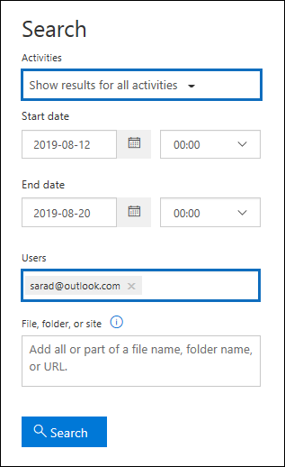

# <a name="search-the-audit-log-to-investigate-common-support-issues"></a>Durchsuchen des Überwachungsprotokolls, um allgemeine Supportprobleme zu untersuchen

In diesem Artikel wird beschrieben, wie Sie das Überwachungsprotokoll-Suchtool verwenden, um allgemeine Supportprobleme zu untersuchen. Dazu gehört die Verwendung des Überwachungsprotokolls für Folgendes:

- Suchen der IP-Adresse des Computers, der für den Zugriff auf ein kompromittiertes Konto verwendet wird
- Bestimmen, wer die E-Mail-Weiterleitung für ein Postfach eingerichtet hat
- Ermitteln, ob ein Benutzer E-Mail-Elemente in sein Postfach gelöscht hat
- Ermitteln, ob ein Benutzer eine Posteingangsregel erstellt hat
- Untersuchen, warum es eine erfolgreiche Anmeldung eines Benutzers außerhalb Ihrer Organisation gab
- Suchen nach Postfachaktivitäten, die von Benutzern mit Nicht-E5-Lizenzen ausgeführt werden
- Suchen nach Postfachaktivitäten, die von Delegiertenbenutzern ausgeführt werden

## <a name="using-the-audit-log-search-tool"></a>Verwenden des Überwachungsprotokollsuchtools

Jedes der in diesem Artikel beschriebenen Problembehandlungsszenarien basiert auf der Verwendung des Überwachungsprotokoll-Suchtools im Security & Compliance Center. In diesem Abschnitt werden die berechtigungen aufgeführt, die zum Durchsuchen des Überwachungsprotokolls erforderlich sind, und die Schritte zum Zugreifen auf und Ausführen von Überwachungsprotokollsuchen beschrieben. In jedem Szenarioabschnitt wird erläutert, wie Sie eine Suchabfrage für Überwachungsprotokolle konfigurieren und wonach Sie in den detaillierten Informationen in den Überwachungsdatensätzen suchen müssen, die den Suchkriterien entsprechen.

### <a name="permissions-required-to-use-the-audit-log-search-tool"></a>Erforderliche Berechtigungen für die Verwendung des Überwachungsprotokollsuchtools

Ihnen muss die Rolle View-Only Überwachungsprotokolle oder Überwachungsprotokolle in Exchange Online zugewiesen werden, um das Überwachungsprotokoll zu durchsuchen. Standardmäßig sind diese Rollen im Exchange Admin Center zugewiesen den Rollengruppen „Complianceverwaltung“ und „Organisationsverwaltung“ auf der Seite **Berechtigungen**. Globale Administratoren in Office 365 und Microsoft 365 werden automatisch als Mitglieder der Rollengruppe "Organisationsverwaltung" in Exchange Online hinzugefügt. Weitere Informationen finden Sie unter [Verwalten von Rollengruppen in Exchange Online](/Exchange/permissions-exo/role-groups).

### <a name="running-audit-log-searches"></a>Ausführen von Überwachungsprotokollsuchen

In diesem Abschnitt werden die Grundlagen zum Erstellen und Ausführen von Überwachungsprotokollsuchen beschrieben. Verwenden Sie diese Anweisungen als Ausgangspunkt für jedes Problembehandlungsszenario in diesem Artikel. Ausführlichere Schritt-für-Schritt-Anweisungen finden Sie unter [Durchsuchen des Überwachungsprotokolls.](search-the-audit-log-in-security-and-compliance.md#step-1-run-an-audit-log-search)

1. Wechseln Sie zu <https://compliance.microsoft.com/auditlogsearch>, und melden Sie sich mit Ihrem Arbeits-, Uni- oder Schulkonto an.
    
    Die Seite **Überwachung** wird angezeigt. 
    
    
  
4. Sie können die folgenden Suchkriterien konfigurieren. Jedes Problembehandlungsszenario in diesem Artikel empfiehlt spezifische Anleitungen zum Konfigurieren dieser Felder.
    
   a. **Startdatum** und **Enddatum:** Wählen Sie einen Datums- und Uhrzeitbereich aus, um die Ereignisse anzuzeigen, die innerhalb dieses Zeitraums aufgetreten sind. Die letzten sieben Tage sind standardmäßig ausgewählt. Das Datum und die Uhrzeit werden im UTC-Format (Coordinated Universal Time) angezeigt. Der maximale Datumsbereich, den Sie angeben können, umfasst 90 Tage.    

   b. **Aktivitäten:** Wählen Sie die Dropdownliste aus, um die Aktivitäten anzuzeigen, nach denen Sie suchen können. Nachdem Sie die Suche ausgeführt haben, werden nur die Überwachungsdatensätze für die ausgewählten Aktivitäten angezeigt. Wenn Sie **"Ergebnisse für alle Aktivitäten anzeigen"** auswählen, werden Ergebnisse für alle Aktivitäten angezeigt, die den anderen Suchkriterien entsprechen. Sie müssen dieses Feld auch in einigen Problembehandlungsszenarien leer lassen.
    
    c. **Benutzer:** Klicken Sie in dieses Feld, und wählen Sie dann einen oder mehrere Benutzer aus, für die Suchergebnisse angezeigt werden sollen. Überwachungsdatensätze für die ausgewählte Aktivität, die von den in diesem Feld ausgewählten Benutzern ausgeführt werden, werden in der Ergebnisliste angezeigt. Lassen Sie dieses Feld leer, um die Einträge für alle Benutzer (und Dienstkonten) in Ihrer Organisation zurückzugeben.
    
    d. **Datei, Ordner oder Website:** Geben Sie einen oder alle Datei- oder Ordnernamen ein, um nach Aktivitäten im Zusammenhang mit der Datei des Ordners zu suchen, die das angegebene Schlüsselwort enthält. Sie können auch die URL einer Datei oder eines Ordners verwenden. Wenn Sie eine URL verwenden, geben Sie unbedingt den vollständigen URL-Pfad ein, oder wenn Sie nur einen Teil der URL eingeben, schließen Sie keine Sonderzeichen oder Leerzeichen ein. Lassen Sie dieses Feld leer, um Einträge für alle Dateien und Ordner in Ihrer Organisation zurückzugeben. Dieses Feld ist in allen Problembehandlungsszenarien in diesem Artikel leer.
    
5. Wählen Sie **"Suchen"** aus, um die Suche anhand Ihrer Suchkriterien auszuführen. 
    
    Die Suchergebnisse werden geladen und nach ein paar Momenten unter **"Ergebnisse"** auf der Suchseite des **Überwachungsprotokolls** angezeigt. Jeder Abschnitt in diesem Artikel enthält Anleitungen zu Denkproblemen im Kontext des jeweiligen Problembehandlungsszenarios.

    Weitere Informationen zum Anzeigen, Filtern oder Exportieren von Suchergebnissen im Überwachungsprotokoll finden Sie unter:

    - [Anzeigen von Suchergebnissen](search-the-audit-log-in-security-and-compliance.md#step-2-view-the-search-results)
    - [Filtern von Suchergebnissen](search-the-audit-log-in-security-and-compliance.md#step-3-filter-the-search-results)
    - [Exportieren der Suchergebnisse](search-the-audit-log-in-security-and-compliance.md#step-4-export-the-search-results-to-a-file)

## <a name="find-the-ip-address-of-the-computer-used-to-access-a-compromised-account"></a>Suchen der IP-Adresse des Computers, der für den Zugriff auf ein kompromittiertes Konto verwendet wird

Die IP-Adresse, die einer von einem beliebigen Benutzer ausgeführten Aktivität entspricht, ist in den meisten Überwachungsdatensätzen enthalten. Informationen über den verwendeten Client sind auch im Überwachungsdatensatz enthalten.

Hier erfahren Sie, wie Sie eine Suchabfrage für überwachungsprotokolle für dieses Szenario konfigurieren:

**Aktivitäten:** Wenn dies für Ihren Fall relevant ist, wählen Sie eine bestimmte Aktivität aus, nach der gesucht werden soll. Für die Problembehandlung kompromittierte Konten sollten Sie den Benutzer auswählen, der bei **der Postfachaktivität** unter **Exchange Postfachaktivitäten** angemeldet ist. Dadurch werden Überwachungsdatensätze mit der IP-Adresse zurückgegeben, die bei der Anmeldung beim Postfach verwendet wurde. Andernfalls lassen Sie dieses Feld leer, um Überwachungsdatensätze für alle Aktivitäten zurückzugeben. 

> [!TIP]
> Wenn Sie dieses Feld leer lassen, werden **UserLoggedIn-Aktivitäten** zurückgegeben, bei denen es sich um eine Azure Active Directory Aktivität handelt, die angibt, dass sich eine Person bei einem Benutzerkonto angemeldet hat. Verwenden Sie die Filterung in den Suchergebnissen, um die **UserLoggedIn-Überwachungsdatensätze** anzuzeigen.

**Startdatum** und **Enddatum:** Wählen Sie einen Datumsbereich aus, der für Ihre Untersuchung gilt.

**Benutzer:** Wenn Sie ein kompromittiertes Konto untersuchen, wählen Sie den Benutzer aus, dessen Konto kompromittiert wurde. Dadurch werden Überwachungsdatensätze für Aktivitäten zurückgegeben, die von diesem Benutzerkonto ausgeführt werden.

**Datei, Ordner oder Website:** Lassen Sie dieses Feld leer.

Nachdem Sie die Suche ausgeführt haben, wird die IP-Adresse für jede Aktivität in der **SPALTE "IP-Adresse"** in den Suchergebnissen angezeigt. Wählen Sie den Datensatz in den Suchergebnissen aus, um ausführlichere Informationen auf der Flyoutseite anzuzeigen.

## <a name="determine-who-set-up-email-forwarding-for-a-mailbox"></a>Bestimmen, wer die E-Mail-Weiterleitung für ein Postfach eingerichtet hat

Wenn die E-Mail-Weiterleitung für ein Postfach konfiguriert ist, werden E-Mail-Nachrichten, die an das Postfach gesendet werden, an ein anderes Postfach weitergeleitet. Nachrichten können an Benutzer innerhalb oder außerhalb Ihrer Organisation weitergeleitet werden. Wenn die E-Mail-Weiterleitung für ein Postfach eingerichtet ist, ist das zugrunde liegende Exchange Online Cmdlet, das verwendet **wird, Set-Mailbox**.

Hier erfahren Sie, wie Sie eine Suchabfrage für überwachungsprotokolle für dieses Szenario konfigurieren:

**Aktivitäten:** Lassen Sie dieses Feld leer, damit die Suche Überwachungsdatensätze für alle Aktivitäten zurückgibt. Dies ist erforderlich, um alle Überwachungsdatensätze im Zusammenhang mit dem **Cmdlet "Set-Mailbox"** zurückzugeben.

**Startdatum** und **Enddatum:** Wählen Sie einen Datumsbereich aus, der für Ihre Untersuchung gilt.

**Benutzer:** Lassen Sie dieses Feld leer, es sei denn, Sie untersuchen ein E-Mail-Weiterleitungsproblem für einen bestimmten Benutzer. Auf diese Weise können Sie ermitteln, ob die E-Mail-Weiterleitung für einen Benutzer eingerichtet wurde.

**Datei, Ordner oder Website:** Lassen Sie dieses Feld leer.

Wählen Sie nach dem Ausführen der Suche auf der Suchergebnisseite die Option **"Ergebnisse** filtern" aus. Geben Sie  im Feld unter der Spaltenüberschrift Aktivität **"Set-Mailbox"** ein, sodass nur Überwachungsdatensätze im Zusammenhang mit dem Cmdlet **"Set-Mailbox"** angezeigt werden.


An diesem Punkt müssen Sie sich die Details jedes Überwachungsdatensatzes ansehen, um festzustellen, ob die Aktivität im Zusammenhang mit der E-Mail-Weiterleitung steht. Wählen Sie den Überwachungsdatensatz aus, um die **Flyoutseite "Details"** anzuzeigen, und wählen Sie dann **weitere Informationen** aus. Im folgenden Screenshot und in den Beschreibungen werden die Informationen hervorgehoben, die angeben, dass die E-Mail-Weiterleitung für das Postfach festgelegt wurde.


a. Im **Feld ObjectId** wird der Alias des Postfachs angezeigt, für das die E-Mail-Weiterleitung festgelegt wurde. Dieses Postfach wird auch in der Spalte **Element** auf der Suchergebnisseite angezeigt.

b. Im Feld **Parameter** gibt der Wert *ForwardingSmtpAddress* an, dass die E-Mail-Weiterleitung für das Postfach festgelegt wurde. In diesem Beispiel werden E-Mails an die E-Mail-Adresse mike@contoso.com weitergeleitet, die sich außerhalb der alpinehouse.onmicrosoft.com Organisation befindet.

c. Der *True-Wert* für den *DeliverToMailboxAndForward-Parameter* gibt an, dass eine Kopie der Nachricht an sarad@alpinehouse.onmicrosoft.com übermittelt *und* an die durch den *Parameter ForwardingSmtpAddress* angegebene E-Mail-Adresse weitergeleitet wird, die in diesem Beispiel mike@contoso.com ist. Wenn der Wert für den *DeliverToMailboxAndForward-Parameter* auf *"False"* festgelegt ist, wird die E-Mail nur an die durch den *Parameter ForwardingSmtpAddress* angegebene Adresse weitergeleitet. Sie wird nicht an das im **Feld ObjectId** angegebene Postfach übermittelt.

d. Das **Feld "UserId"** gibt den Benutzer an, der die E-Mail-Weiterleitung für das im **Feld ObjectId** angegebene Postfach festgelegt hat. Dieser Benutzer wird auch in der Spalte **"Benutzer"** auf der Suchergebnisseite angezeigt. In diesem Fall scheint der Besitzer des Postfachs die E-Mail-Weiterleitung für ihr Postfach festzulegen.

Wenn Sie feststellen, dass die E-Mail-Weiterleitung nicht für das Postfach festgelegt werden soll, können Sie es entfernen, indem Sie den folgenden Befehl in Exchange Online PowerShell ausführen:

```powershell
Set-Mailbox <mailbox alias> -ForwardingSmtpAddress $null 
```

Weitere Informationen zu den Parametern im Zusammenhang mit der E-Mail-Weiterleitung finden Sie im Artikel ["Set-Mailbox".](/powershell/module/exchange/set-mailbox)

## <a name="determine-if-a-user-deleted-email-items"></a>Ermitteln, ob ein Benutzer E-Mail-Elemente gelöscht hat

Ab Januar 2019 aktiviert Microsoft standardmäßig die Postfachüberwachungsprotokollierung für alle Office 365 und Microsoft-Organisationen. Dies bedeutet, dass bestimmte Aktionen, die von Postfachbesitzern ausgeführt werden, automatisch protokolliert werden und die entsprechenden Postfachüberwachungsdatensätze verfügbar sind, wenn Sie im Postfachüberwachungsprotokoll danach suchen. Bevor die Postfachüberwachung standardmäßig aktiviert wurde, mussten Sie sie manuell für jedes Benutzerpostfach in Ihrer Organisation aktivieren. 

Die standardmäßig protokollierten Postfachaktionen umfassen die Von Postfachbesitzern ausgeführten SoftDelete- und HardDelete-Postfachaktionen. Dies bedeutet, dass Sie die folgenden Schritte verwenden können, um das Überwachungsprotokoll nach Ereignissen im Zusammenhang mit gelöschten E-Mail-Elementen zu durchsuchen. Weitere Informationen zur Standardmäßigen Postfachüberwachung finden Sie unter Verwalten der [Postfachüberwachung.](enable-mailbox-auditing.md)

Hier erfahren Sie, wie Sie eine Suchabfrage für überwachungsprotokolle für dieses Szenario konfigurieren:

**Aktivitäten:** Wählen Sie unter **Exchange Postfachaktivitäten** eine oder beide der folgenden Aktivitäten aus:

- **Gelöschte Nachrichten aus dem Ordner "Gelöschte Elemente":** Diese Aktivität entspricht der SoftDelete-Postfachüberwachungsaktion.  Diese Aktivität wird auch protokolliert, wenn ein Benutzer ein Element dauerhaft löscht, indem er es auswählt und **UMSCHALT+ENTF** drückt. Nachdem ein Element endgültig gelöscht wurde, kann der Benutzer es wiederherstellen, bis der Aufbewahrungszeitraum für gelöschte Elemente abläuft.

- **Nachrichten aus Postfach gelöscht:** Diese Aktivität entspricht der HardDelete-Postfachüberwachungsaktion.  Dies wird protokolliert, wenn ein Benutzer ein Element aus dem Ordner "Wiederherstellbare Elemente" löscht. Administratoren können das Tool für die Inhaltssuche im Security and Compliance Center verwenden, um nach gelöschten Elementen zu suchen und diese wiederherzustellen, bis der Aufbewahrungszeitraum für gelöschte Elemente abläuft oder länger, wenn das Postfach des Benutzers in der Warteschleife ist.

**Startdatum** und **Enddatum:** Wählen Sie einen Datumsbereich aus, der für Ihre Untersuchung gilt.

**Benutzer:** Wenn Sie einen Benutzer in diesem Feld auswählen, gibt das Überwachungsprotokoll-Suchtool Überwachungsdatensätze für E-Mail-Elemente zurück, die von dem von Ihnen angegebenen Benutzer gelöscht wurden (SoftDeleted oder HardDeleted). Manchmal ist der Benutzer, der eine E-Mail löscht, möglicherweise nicht der Postfachbesitzer.

**Datei, Ordner oder Website:** Lassen Sie dieses Feld leer.

Nachdem Sie die Suche ausgeführt haben, können Sie die Suchergebnisse filtern, um die Überwachungsdatensätze für vorläufig gelöschte Elemente oder für endgültig gelöschte Elemente anzuzeigen. Wählen Sie den Überwachungsdatensatz aus, um die **Flyoutseite "Details"** anzuzeigen, und wählen Sie dann **weitere Informationen** aus. Zusätzliche Informationen zum gelöschten Element, z. B. die Betreffzeile und den Speicherort des Elements, als es gelöscht wurde, werden im **Feld "AffectedItems"** angezeigt. Die folgenden Screenshots zeigen ein Beispiel des **AffectedItems-Felds** aus einem vorläufig gelöschten Element und einem endgültig gelöschten Element.

**Beispiel für affectedItems-Feld für vorläufig gelöschte Elemente**


**Beispiel für affectedItems-Feld für endgültig gelöschtes Element**


### <a name="recover-deleted-email-items"></a>Wiederherstellen gelöschter E-Mail-Elemente

Benutzer können vorläufig gelöschte Elemente wiederherstellen, wenn der Aufbewahrungszeitraum für gelöschte Elemente nicht abgelaufen ist. In Exchange Online beträgt der Standardmäßige Aufbewahrungszeitraum für gelöschte Elemente 14 Tage, administratoren können diese Einstellung jedoch auf maximal 30 Tage erhöhen. Verweisen Sie Benutzer auf die [Wiederherstellung gelöschter Elemente oder E-Mails in Outlook im Web](https://support.office.com/article/Recover-deleted-items-or-email-in-Outlook-Web-App-C3D8FC15-EEEF-4F1C-81DF-E27964B7EDD4) Artikel, um Anweisungen zum Wiederherstellen gelöschter Elemente zu erhalten.

Wie bereits erläutert, können Administratoren möglicherweise endgültig gelöschte Elemente wiederherstellen, wenn der Aufbewahrungszeitraum für gelöschte Elemente nicht abgelaufen ist oder wenn das Postfach in der Warteschleife ist. In diesem Fall werden Elemente bis zum Ablauf der Aufbewahrungsdauer aufbewahrt. Wenn Sie eine Inhaltssuche ausführen, werden vorläufig gelöschte und endgültig gelöschte Elemente im Ordner "Wiederherstellbare Elemente" in den Suchergebnissen zurückgegeben, wenn sie mit der Suchabfrage übereinstimmen. Weitere Informationen zum Ausführen von Inhaltssuchen finden Sie unter [Inhaltssuche in Office 365](content-search.md).

> [!TIP]
> Um nach gelöschten E-Mail-Elementen zu suchen, suchen Sie nach der Betreffzeile, die im **Feld "Betroffene Elemente"** im Überwachungsdatensatz angezeigt wird, ganz oder teilweise.

## <a name="determine-if-a-user-created-an-inbox-rule"></a>Ermitteln, ob ein Benutzer eine Posteingangsregel erstellt hat

Wenn Benutzer eine Posteingangsregel für ihr Exchange Online Postfach erstellen, wird ein entsprechender Überwachungsdatensatz im Überwachungsprotokoll gespeichert. Weitere Informationen zu Posteingangsregeln finden Sie unter:

- [Verwenden von Posteingangsregeln in Outlook im Web](https://support.office.com/article/use-inbox-rules-in-outlook-on-the-web-8400435c-f14e-4272-9004-1548bb1848f2)
- [Verwalten von E-Mail-Nachrichten in Outlook mithilfe von Regeln](https://support.office.com/article/Manage-email-messages-by-using-rules-C24F5DEA-9465-4DF4-AD17-A50704D66C59)

Hier erfahren Sie, wie Sie eine Suchabfrage für überwachungsprotokolle für dieses Szenario konfigurieren:

**Aktivitäten:** Wählen Sie unter **Exchange Postfachaktivitäten** **die Option "Neue Posteingangsregel erstellen/ändern/aktivieren/deaktivieren"** aus.

**Startdatum** und **Enddatum:** Wählen Sie einen Datumsbereich aus, der für Ihre Untersuchung gilt.

**Benutzer:** Lassen Sie dieses Feld leer, es sei denn, Sie untersuchen einen bestimmten Benutzer. Auf diese Weise können Sie neue Posteingangsregeln identifizieren, die von jedem Benutzer eingerichtet wurden.

**Datei, Ordner oder Website:** Lassen Sie dieses Feld leer.

Nachdem Sie die Suche ausgeführt haben, werden alle Überwachungsdatensätze für diese Aktivität in den Suchergebnissen angezeigt. Wählen Sie einen Überwachungsdatensatz aus, um die **Flyoutseite "Details"** anzuzeigen, und wählen Sie dann **weitere Informationen** aus. Informationen zu den Posteingangsregeleinstellungen werden im **Parameterfeld** angezeigt. Im folgenden Screenshot und in den Beschreibungen werden die Informationen zu Posteingangsregeln hervorgehoben.


a. Im **Feld ObjectId** wird der vollständige Name der Posteingangsregel angezeigt. Dieser Name enthält den Alias des Postfachs des Benutzers (z. B. SaraD) und den Namen der Posteingangsregel (z. B. "Nachrichten vom Administrator verschieben").

b. Im Feld **"Parameter"** wird die Bedingung der Posteingangsregel angezeigt. In diesem Beispiel wird die Bedingung durch den *Parameter From* angegeben. Der für den *Parameter "From"* definierte Wert gibt an, dass die Posteingangsregel auf E-Mails reagiert, die von admin@alpinehouse.onmicrosoft.com gesendet werden. Eine vollständige Liste der Parameter, die zum Definieren von Bedingungen für Posteingangsregeln verwendet werden können, finden Sie im Artikel ["New-InboxRule".](/powershell/module/exchange/new-inboxrule)

c. Der *Parameter MoveToFolder* gibt die Aktion für die Posteingangsregel an. In diesem Beispiel werden Nachrichten, die von admin@alpinehouse.onmicrosoft.com empfangen wurden, in den Ordner mit dem Namen *AdminSearch* verschoben. Eine vollständige Liste der Parameter, die zum Definieren der Aktion einer Posteingangsregel verwendet werden können, finden Sie auch im Artikel ["New-InboxRule".](/powershell/module/exchange/new-inboxrule)

d. Das **Feld "UserId"** gibt den Benutzer an, der die im **Feld ObjectId** angegebene Posteingangsregel erstellt hat. Dieser Benutzer wird auch in der Spalte **"Benutzer"** auf der Suchergebnisseite angezeigt.

## <a name="investigate-why-there-was-a-successful-login-by-a-user-outside-your-organization"></a>Untersuchen, warum es eine erfolgreiche Anmeldung eines Benutzers außerhalb Ihrer Organisation gab

Beim Überprüfen von Überwachungsdatensätzen im Überwachungsprotokoll werden möglicherweise Datensätze angezeigt, die darauf hinweisen, dass ein externer Benutzer von Azure Active Directory authentifiziert und erfolgreich bei Ihrer Organisation angemeldet wurde. Beispielsweise wird einem Administrator in contoso.onmicrosoft.com möglicherweise ein Überwachungsdatensatz angezeigt, der anzeigt, dass sich ein Benutzer aus einer anderen Organisation (z. B. fabrikam.onmicrosoft.com) erfolgreich bei contoso.onmicrosoft.com angemeldet hat. Ebenso können Überwachungsdatensätze angezeigt werden, die angeben, dass Benutzer mit einem Microsoft-Konto (z. B. eine Outlook.com oder Live.com) erfolgreich bei Ihrer Organisation angemeldet sind. In diesen Situationen ist die überwachte Aktivität **vom Benutzer angemeldet.** 

Es handelt sich hierbei um ein beabsichtigtes Verhalten. Azure Active Directory (Azure AD), der Verzeichnisdienst, ermöglicht eine so genannte *Pass-Through-Authentifizierung,* wenn ein externer Benutzer versucht, auf einen SharePoint Standort oder einen OneDrive Standort in Ihrer Organisation zuzugreifen. Wenn der externe Benutzer versucht, dies zu tun, wird er aufgefordert, seine Anmeldeinformationen einzugeben. Azure AD verwendet die Anmeldeinformationen, um den Benutzer zu authentifizieren, d. h. nur Azure AD überprüft, ob der Benutzer die Person ist, von der er sagt, dass er es ist. Der Hinweis auf die erfolgreiche Anmeldung im Überwachungsdatensatz ist das Ergebnis der Azure AD-Authentifizierung des Benutzers. Die erfolgreiche Anmeldung bedeutet nicht, dass der Benutzer auf Ressourcen zugreifen oder andere Aktionen in Ihrer Organisation ausführen konnte. Es gibt nur an, dass der Benutzer von Azure AD authentifiziert wurde. Damit ein Pass-Through-Benutzer auf SharePoint oder OneDrive Ressourcen zugreifen kann, muss ein Benutzer in Ihrer Organisation eine Ressource explizit für den externen Benutzer freigeben, indem er eine Freigabe-Einladung oder einen anonymen Freigabelink sendet. 

> [!NOTE]
> Azure AD ermöglicht die Pass-Through-Authentifizierung nur für *Erstanbieteranwendungen,* z. B. SharePoint Online und OneDrive for Business. Sie ist für andere Drittanbieteranwendungen nicht zulässig.

Nachfolgend finden Sie ein Beispiel und Beschreibungen relevanter Eigenschaften in einem Überwachungsdatensatz für ein **vom Benutzer angemeldetes** Ereignis, das ein Ergebnis der Pass-Through-Authentifizierung ist. Wählen Sie den Überwachungsdatensatz aus, um die **Flyoutseite "Details"** anzuzeigen, und wählen Sie dann **weitere Informationen** aus.


   a. Dieses Feld gibt an, dass der Benutzer, der versucht hat, auf eine Ressource in Ihrer Organisation zuzugreifen, im Azure AD Ihrer Organisation nicht gefunden wurde.

   b. In diesem Feld wird der UPN des externen Benutzers angezeigt, der versucht hat, auf eine Ressource in Ihrer Organisation zuzugreifen. Diese Benutzer-ID wird auch in den Eigenschaften **"User"** und **"UserId"** im Überwachungsdatensatz identifiziert.

   c. Die **ApplicationId-Eigenschaft** identifiziert die Anwendung, die die Anmeldeanforderung ausgelöst hat. Der Wert von 000000003-0000-0ff1-ce00-0000000000000, der in der ApplicationId-Eigenschaft in diesem Überwachungsdatensatz angezeigt wird, gibt SharePoint Online an. OneDrive for Business hat auch dieselbe ApplicationId.

   d. Dies weist darauf hin, dass die Pass-Through-Authentifizierung erfolgreich war. Mit anderen Worten, der Benutzer wurde von Azure AD erfolgreich authentifiziert. 

   e. Der **RecordType-Wert** **von 15** gibt an, dass die überwachte Aktivität (UserLoggedIn) ein StS-Anmeldeereignis (Secure Token Service) in Azure AD ist.

Weitere Informationen zu den anderen Eigenschaften, die in einem UserLoggedIn-Überwachungsdatensatz angezeigt werden, finden Sie in den Azure AD-bezogenen Schemainformationen in [Office 365 Verwaltungsaktivitäts-API-Schema.](/office/office-365-management-api/office-365-management-activity-api-schema#azure-active-directory-base-schema)

Hier sind zwei Beispielszenarien, die zu einer erfolgreichen **Benutzeranmeldung aufgrund** der Pass-Through-Authentifizierung führen würden: 

  - Ein Benutzer mit einem Microsoft-Konto (z. B. SaraD@outlook.com) hat versucht, auf ein Dokument in einem OneDrive for Business-Konto in fourthcoffee.onmicrosoft.com zuzugreifen, und es gibt kein entsprechendes Gastbenutzerkonto für SaraD@outlook.com in fourthcoffee.onmicrosoft.com.

  - Ein Benutzer mit einem Geschäfts-, Schul- oder Unikonto in einer Organisation (z. B. pilarp@fabrikam.onmicrosoft.com) hat versucht, auf eine SharePoint Website in contoso.onmicrosoft.com zuzugreifen, und es gibt kein entsprechendes Gastbenutzerkonto für pilarp@fabrikam.com in contoso.onmicrosoft.com.

### <a name="tips-for-investigating-successful-logins-resulting-from-pass-through-authentication"></a>Tipps für die Untersuchung erfolgreicher Anmeldungen aufgrund der Pass-Through-Authentifizierung

- Durchsuchen Sie das Überwachungsprotokoll nach Aktivitäten, die von dem externen Benutzer ausgeführt werden, der im **angemeldeten Überwachungsdatensatz** des Benutzers identifiziert wurde. Geben Sie den UPN für den externen Benutzer in das Feld **"Benutzer"** ein, und verwenden Sie einen Datumsbereich, falls dies für Ihr Szenario relevant ist. Sie können z. B. eine Suche mit den folgenden Suchkriterien erstellen:

   

    Zusätzlich zu den **angemeldeten Aktivitäten** des Benutzers können andere Überwachungsdatensätze zurückgegeben werden, z. B. solche, die angeben, dass ein Benutzer in Ihrer Organisation Ressourcen für den externen Benutzer freigegeben hat und ob der externe Benutzer auf ein Dokument zugegriffen, es geändert oder heruntergeladen hat, das für diesen freigegeben wurde.

- Suchen Sie nach SharePoint Freigabeaktivitäten, die darauf hindeuten, dass eine Datei für den externen Benutzer freigegeben wurde, der von einem **angemeldeten Benutzer** als Überwachungsdatensatz identifiziert wurde. Weitere Informationen finden Sie unter [Verwenden der Freigabeüberwachung im Überwachungsprotokoll](use-sharing-auditing.md).

- Exportieren Sie die Suchergebnisse des Überwachungsprotokolls, die für Ihre Untersuchung relevante Datensätze enthalten, damit Sie Excel verwenden können, um nach anderen Aktivitäten im Zusammenhang mit dem externen Benutzer zu suchen. Weitere Informationen finden Sie unter [Exportieren, Konfigurieren und Anzeigen von Überwachungsprotokolldatensätzen.](export-view-audit-log-records.md)

## <a name="search-for-mailbox-activities-performed-by-users-with-non-e5-licenses"></a>Suchen nach Postfachaktivitäten, die von Benutzern mit Nicht-E5-Lizenzen ausgeführt werden

Auch wenn die [Postfachüberwachung für](enable-mailbox-auditing.md) Ihre Organisation standardmäßig aktiviert ist, stellen Sie möglicherweise fest, dass Postfachüberwachungsereignisse für einige Benutzer in Überwachungsprotokollsuchen mithilfe des Compliance Centers, des Cmdlets **Search-UnifiedAuditLog** oder der Office 365-Verwaltungsaktivitäts-API nicht gefunden werden. Der Grund dafür ist, dass Postfachüberwachungsereignisse nur für Benutzer mit E5-Lizenzen zurückgegeben werden, wenn Sie eine der vorherigen Methoden zum Durchsuchen des einheitlichen Überwachungsprotokolls verwenden.

Um Postfachüberwachungsprotokolleinträge für Nicht-E5-Benutzer abzurufen, können Sie eine der folgenden Problemumgehungen ausführen:

- Aktivieren Sie die Postfachüberwachung manuell für einzelne Postfächer (führen Sie den `Set-Mailbox -Identity <MailboxIdentity> -AuditEnabled $true` Befehl in Exchange Online PowerShell aus). Suchen Sie danach mithilfe des Compliance Centers, des Cmdlets **Search-UnifiedAuditLog** oder der Office 365-Verwaltungsaktivitäts-API nach Postfachüberwachungsaktivitäten.
  
  > [!NOTE]
  > Wenn die Postfachüberwachung für das Postfach bereits aktiviert zu sein scheint, ihre Suchvorgänge jedoch keine Ergebnisse zurückgeben, ändern Sie den Wert des _Parameters AuditEnabled_ in `$false` und dann zurück zu `$true` .
  
- Verwenden Sie die folgenden Cmdlets in Exchange Online PowerShell:

  - [Search-MailboxAuditLog](/powershell/module/exchange/search-mailboxauditlog) zum Durchsuchen des Postfachüberwachungsprotokolls nach bestimmten Benutzern.

  - [New-MailboxAuditLogSearch](/powershell/module/exchange/new-mailboxauditlogsearch) zum Durchsuchen des Postfachüberwachungsprotokolls nach bestimmten Benutzern und zum Senden der Ergebnisse per E-Mail an angegebene Empfänger.

## <a name="search-for-mailbox-activities-performed-in-a-specific-mailbox-including-shared-mailboxes"></a>Suchen nach Postfachaktivitäten, die in einem bestimmten Postfach ausgeführt werden (einschließlich freigegebener Postfächer)

Wenn Sie die Dropdownliste **"Benutzer"** im Überwachungsprotokoll-Suchtool im Compliance Center oder den Befehl **"Search-UnifiedAuditLog -UserIds"** in Exchange Online PowerShell verwenden, können Sie nach Aktivitäten suchen, die von einem bestimmten Benutzer ausgeführt werden. Bei Postfachüberwachungsaktivitäten sucht diese Art der Suche nach Aktivitäten, die vom angegebenen Benutzer ausgeführt werden. Es garantiert nicht, dass alle im selben Postfach ausgeführten Aktivitäten in den Suchergebnissen zurückgegeben werden. Beispielsweise gibt eine Überwachungsprotokollsuche keine Überwachungsdatensätze für Aktivitäten zurück, die von einem Stellvertreterbenutzer ausgeführt werden, da die Suche nach Postfachaktivitäten, die von einem bestimmten Benutzer ausgeführt werden, keine Aktivitäten zurückgibt, die von einem Delegiertenbenutzer ausgeführt werden, dem Berechtigungen für den Zugriff auf das Postfach eines anderen Benutzers zugewiesen wurden. (Ein Delegatbenutzer ist eine Person, der die SendAs-, SendOnBehalf- oder FullAccess-Postfachberechtigung für das Postfach eines anderen Benutzers zugewiesen wurde.)

Darüber hinaus werden bei Verwendung der **Dropdownliste "Benutzer"** im Überwachungsprotokoll-Suchtool oder der **Such-UnifiedAuditLog -UserIds** keine Ergebnisse für Aktivitäten zurückgegeben, die in einem freigegebenen Postfach ausgeführt werden.

Verwenden Sie die folgende Syntax, wenn Sie das Cmdlet **"Search-UnifiedAuditLog"** ausführen, um nach den in einem bestimmten Postfach ausgeführten Aktivitäten zu suchen oder nach Aktivitäten zu suchen, die in einem freigegebenen Postfach ausgeführt werden:

```powershell
Search-UnifiedAuditLog  -StartDate <date> -EndDate <date> -FreeText (Get-Mailbox <mailbox identity).ExchangeGuid
```

Der folgende Befehl gibt beispielsweise Überwachungsdatensätze für Aktivitäten zurück, die im freigegebenen Postfach des Contoso Compliance Teams zwischen August 2020 und Oktober 2020 ausgeführt wurden:

```powershell
Search-UnifiedAuditLog  -StartDate 08/01/2020 -EndDate 10/31/2020 -FreeText (Get-Mailbox complianceteam@contoso.onmicrosoft.com).ExchangeGuid
```

Alternativ können Sie das Cmdlet **"Search-MailboxAuditLog"** verwenden, um nach Überwachungsdatensätzen für Aktivitäten zu suchen, die in einem bestimmten Postfach ausgeführt werden. Dazu gehört die Suche nach Aktivitäten, die in einem freigegebenen Postfach ausgeführt werden.

Im folgenden Beispiel werden Postfachüberwachungsprotokolleinträge für Aktivitäten zurückgegeben, die im freigegebenen Postfach des Contoso Compliance Teams ausgeführt werden:

```powershell
Search-MailboxAuditLog -Identity complianceteam@contoso.onmicrosoft.com -StartDate 08/01/2020 -EndDate 10/31/2020 -ShowDetails
```

Im folgenden Beispiel werden Postfachüberwachungsprotokolleinträge für Aktivitäten zurückgegeben, die von Delegiertenbenutzern im angegebenen Postfach ausgeführt werden:

```powershell
Search-MailboxAuditLog -Identity <mailbox identity> -StartDate <date> -EndDate <date> -LogonTypes Delegate -ShowDetails
```

Sie können auch das Cmdlet **"New-MailboxAuditLogSearch"** verwenden, um das Überwachungsprotokoll nach einem bestimmten Postfach zu durchsuchen und die Ergebnisse per E-Mail an bestimmte Empfänger zu senden.