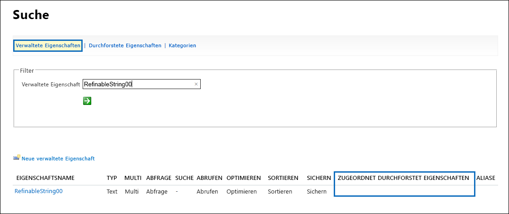

# <a name="manage-the-lifecycle-of-sharepoint-documents-with-retention-labels"></a>Verwalten des Lebenszyklus von SharePoint-Dokumenten mit Aufbewahrungsbezeichnungen

>*[Microsoft 365-Lizenzierungsleitfaden für Sicherheit und Compliance](https://aka.ms/ComplianceSD).*

In diesem Artikel wird beschrieben, wie Sie den Lebenszyklus von in SharePoint Online gespeicherten produktbezogenen Dokumenten mithilfe von Aufbewahrungsbezeichnungen verwalten können, und zwar durch automatisches Anwenden von Bezeichnungen und Konfigurieren der ereignisbasierten Aufbewahrung. Die Funktion für die automatische Anwendung verwendet die Dokumentklassifizierung mithilfe von SharePoint-Metadaten. Das in diesem Artikel beschriebene Szenario basiert auf produktbezogenen Dokumenten, für andere Szenarios können jedoch dieselben Konzepte verwendet werden. In der Öl- und Gasindustrie können Sie beispielsweise den Lebenszyklus von Dokumenten verwalten, die sich auf physische Vermögenswerte wie Ölplattformen, Bohrlochprotokolle oder Produktionslizenzen beziehen. In der Finanzdienstleistungsbranche können Sie Dokumente verwalten, die sich auf Bankkonten, Hypotheken oder Versicherungsverträge beziehen. Im öffentlichen Sektor können Sie Dokumente zu Baugenehmigungen oder Steuerformularen verwalten.

Schauen wir uns das Szenario für diesen Artikel an. Wir werden uns die Informationsarchitektur und die Definition der Aufbewahrungsbezeichnungen ansehen. Anschließend sehen wir uns an, wie Sie Dokumente klassifizieren, indem Sie die Bezeichnungen automatisch anwenden und schließlich die Ereignisse generieren, die den Beginn des Aufbewahrungszeitraums auslösen.

## <a name="information-architecture"></a>Informationsarchitektur

Das Szenario für diesen Artikel basiert auf einem Produktionsunternehmen, das SharePoint Online verwendet, um alle Dokumente zu den von dem Unternehmen entwickelten Produkten zu speichern. Diese Dokumente enthalten Produktspezifikationen, Verträge mit Lieferanten und Benutzerhandbücher. Beim Speichern dieser Dokumente in SharePoint als Teil der Enterprise Content Management-Richtlinien, werden Dokumentmetadaten definiert und zur Klassifizierung verwendet. Jedes Dokument verfügt über die folgenden Metadateneigenschaften:

- **Dokumenttyp** (wie Produktspezifikation, Vertrag und Benutzerhandbuch)

- **Produktname**

- **Status** (Entwurf oder endgültig)

Diese Metadaten bilden den Basisinhaltstyp namens **Produktionsdokument** für alle Dokumente.


> [!NOTE]
> Die Eigenschaften **Dokumententyp** und **Status** werden später im Szenario von Aufbewahrungsrichtlinien verwendet, um Aufbewahrungsbezeichnungen zu klassifizieren und automatisch anzuwenden.

Es können mehrere Inhaltstypen vorhanden sein, die verschiedene Dokumenttypen darstellen. Konzentrieren uns jedoch auf die Produktdokumentation.

In diesem Szenario erstellen wir mithilfe des Managed Metadata Service und des Termspeichers einen Termsatz für **Dokumenttyp** und einen weiteren für **Produktname**. Für jeden Ausdruckssatz erstellen wir einen Ausdruck für jeden Wert. Im Terminologiespeicher sieht es für Ihre SharePoint-Organisation ungefähr so aus:


Der Inhaltstyp kann mit dem [Inhaltstyphub](https://support.office.com/article/manage-content-type-publishing-06f39ac0-5576-4b68-abbc-82b68334889b) erstellt und veröffentlicht werden. Ein Inhaltstyp kann auch mit Site-Bereitstellungstools wie dem[PnP-Bereitstellungsframework](https://docs.microsoft.com/sharepoint/dev/solution-guidance/pnp-provisioning-framework) oder dem [Site-Design-JSON-Schema ](https://docs.microsoft.com/sharepoint/dev/declarative-customization/site-design-json-schema#define-a-new-content-type)erstellt und veröffentlicht werden.

Jedes Produkt verfügt über eine dedizierte SharePoint Online-Site, die eine Dokumentbibliothek mit den richtigen aktivierten Inhaltstypen enthält. Alle Dokumente werden in dieser Dokumentbibliothek gespeichert.


> [!NOTE]
> Anstatt eine SharePoint Online-Site pro Produkt zu haben, könnte das produzierende Unternehmen in diesem Szenario ein Microsoft-Team pro Produkt verwenden, das die Zusammenarbeit mit Mitgliedern des Teams unterstützt, z. B. durchgehender Chat, und die Registerkarte **Dateien** im Team für die Dokumentverwaltung verwenden. In diesem Artikel konzentrieren wir uns nur auf Dokumente, daher verwenden wir nur eine Site.

Hier ist eine Ansicht der Dokumentbibliothek für das Spinning Widget-Produkt:


Nachdem wir die grundlegende Informationsarchitektur für das Dokumentenmanagement eingerichtet haben, schauen wir uns die Aufbewahrungs- und Entsorgungsstrategie der Dokumente an, die die Metadaten und die Klassifizierung von Dokumenten verwenden.

## <a name="retention-and-disposition"></a>Aufbewahrung und Disposition

Die Compliance- und Data Governance-Richtlinien des Herstellers bestimmen, wie Daten aufbewahrt und entsorgt werden. Produktbezogene Dokumente müssen so lange aufbewahrt werden, wie das Produkt hergestellt wird, und für einen bestimmten Zeitraum danach. Dieser Zeitraum ist für Produktspezifikationen, Verträge und Benutzerhandbücher unterschiedlich. In der folgenden Tabelle sind die Aufbewahrungs- und Entsorgungsanforderungen aufgeführt:

| **Dokumenttyp**          | **Vermerkdauer**                          | **Disposition**                              |
| -------------------------- | -------------------------------------- | -------------------------------------------- |
| Produktspezifikation      | 5 Jahre nach Produktionsabbruch  | Löschen                                       |
| Produktvertrag          | 10 Jahre nach Produktionsabbruch | Überprüfung                                       |
| Benutzerhandbuch                | 5 Jahre nach Produktionsabbruch  | Löschen                                       |
| Alle anderen Dokumenttypen | Bewahren Sie andere Dokumente nicht aktiv auf  | Löschen, wenn Dokument älter als 3 Jahre ist<sup>\*</sup>  |
|||

> [!NOTE]
> <sup>\*</sup> Ein Dokument gilt als älter als 3 Jahre, wenn es in den letzten 3 Jahren nicht geändert wurde.

Mithilfe des Sicherheits- und Compliance-Centers erstellen wir die folgenden Aufbewahrungsbezeichnungen:

  - Produktspezifikation

  - Produktvertrag

  - Benutzerhandbuch

In diesem Artikel wird nur gezeigt, wie die Aufbewahrungsbezeichnung der Produktspezifikation erstellt und automatisch angewendet wird. Um das vollständige Szenario zu implementieren, erstellen Sie Aufbewahrungsbezeichnungen für die beiden anderen Dokumenttypen und wenden sie diese automatisch an.

### <a name="settings-for-the-product-specification-retention-label"></a>Einstellungen für die Aufbewahrungsbezeichnung der Produktspezifikation

Hier ist der [Aktenplan](file-plan-manager.md) für die Aufbewahrungsbezeichnung der Produktspezifikation: 

- **Name:** Produktspezifikation

- **Beschreibung für Administratoren:** Bezeichnung der Produktspezifikation, fünf Jahre nach Einstellung der Produktion aufbewahren, automatische Löschung, ereignisbasierte Aufbewahrung, Ereignistyp ist Einstellung des Produkts.

- **Beschreibung für Nutzer:** für fünf Jahre nach Beendigung der Produktion aufbewahren.

- **Aufbewahrungsaktion:** aufbewahren und löschen

- **Aufbewahrungsdauer:** Fünf Jahre (1825 Tage)

- **Datensatzbezeichnung**: Konfigurieren Sie die Aufbewahrungsbezeichnung so, dass Inhalte als [Datensatz](records.md) klassifiziert werden (Dokumente, die als Datensatz klassifiziert sind, können von Benutzern nicht geändert oder gelöscht werden).

- **Dateiplandeskriptoren:** (Zur Vereinfachung des Szenarios werden keine Dateideskriptoren bereitgestellt)

Der folgende Screenshot zeigt die Einstellungen, wenn Sie die [Aufbewahrungsbezeichnung](retention.md#retention-labels) der Produktspezifikation im Microsoft 365 Compliance-Center erstellen. Sie können den Ereignistyp der **Einstellung des Produkts** erstellen, wenn Sie die Aufbewahrungsbezeichnung erstellen. Beachten Sie die folgenden Schritte.


> [!NOTE]
> Legen Sie aus praktischen Gründen und um zu vermeiden, dass Sie 5 Jahre warten müssen, bis ein Dokument automatisch gelöscht wird, die Aufbewahrungsdauer auf 1 Tag fest, wenn Sie dieses Szenario in Ihrer Testumgebung neu erstellen.

### <a name="create-an-event-type-when-creating-a-retention-label"></a>Erstellen Sie einen Ereignistyp, wenn Sie eine Aufbewahrungsbezeichnung erstellen

1. Wählen Sie in der Dropdownliste **Inhalte basierend auf aufbewahren oder löschen** wählen Sie**ein Ereignis**aus.

2. Klicken Sie auf **Ereignistyp auswählen**.

   

3. Klicken Sie auf der Seite**Ereignistyp auswählen** auf **Sie können hier neue Ereignistypen erstellen**.

4. Erstellen Sie einen Ereignistyp namens **Einstellung des Produkts**, geben Sie eine Beschreibung ein, und klicken Sie auf **Ende**, um es zu erstellen. 

5. Wählen Sie auf der Seite **Ereignistyp auswählen** den Ereignistyp **Einstellung des Produkts** aus, den Sie erstellt haben, und klicken Sie dann auf **Hinzufügen**.

So sehen die Einstellungen für die Aufbewahrungsbezeichnung der Produktspezifikation aus. Klicken Sie auf **Diese Bezeichnung erstellen**, um sie zu erstellen.


> [!TIP]
> Ausführlichere Schritte finden Sie unter[Erstellen eines Etiketts, dessen Aufbewahrungsdauer auf einem Ereignis basiert](event-driven-retention.md#step-1-create-a-label-whose-retention-period-is-based-on-an-event).

Nachdem die Aufbewahrungsbezeichnung erstellt wurde, wird die Aufbewahrungsbezeichnung automatisch auf den Inhalt der Produktspezifikation angewendet.

## <a name="classifying-content-by-auto-applying-retention-labels"></a>Klassifizieren von Inhalten durch automatisches Anwenden von Aufbewahrungsbezeichnungen

Wir werden die Aufbewahrungsbezeichnungen, die wir für dieses Szenario erstellt haben, mithilfe von KQL (Keyword Query Language) [automatisch anwenden](apply-retention-labels-automatically.md). KQL ist die Sprache, mit der Suchanfragen erstellt werden. In KQL können Sie mithilfe von Schlüsselwörtern oder verwalteten Eigenschaften suchen. Weitere Informationen zu KQL finden Sie hier <https://docs.microsoft.com/sharepoint/dev/general-development/keyword-query-language-kql-syntax-reference>

Auf hoher Ebene möchten wir Microsoft 365 mitteilen, dass Sie die Aufbewahrungsbezeichnung der **Produktspezifikation** auf alle Dokumente anwenden möchten, die über den **Status** **Endgültig** verfügen und den **Dokumententypen** **Produktspezifikation** besitzen. Erinnern Sie sich daran, dass **Status** und **Dokumenttyp** die Sitespalten sind, die Sie zuvor für den Inhaltstyp "Produktdokumentation" im Abschnitt [Informationsarchitektur](#information-architecture) definiert haben. Um dies zu erreichen, müssen wir das Suchschema konfigurieren.

Wenn SharePoint Inhalte indiziert, werden automatisch gecrawlte Eigenschaften für jede Sitespalte generiert. In diesem Szenario interessieren uns die Eigenschaften **Dokumenttyp** und **Status**. Wir benötigen Dokumente in der Bibliothek mit dem richtigen Inhaltstyp und die ausgefüllten Sitespalten, damit bei der Suche die gecrawlten Eigenschaften erstellt werden können.

Im SharePoint Admin Center können wir die Suchkonfiguration öffnen und **Suchschema Verwalten** auswählen, um die durchforsteten Eigenschaften anzuzeigen und zu konfigurieren.


Wenn wir im Feld **Durchforstete Eigenschaften** **Status** eingeben und auf den grünen Pfeil klicken, sollte das Ergebnis folgendermaßen aussehen:


Die Eigenschaft **ows\_\_Status** ist diejenige, die uns interessiert. (Beachten Sie, dass es sich um einen doppelten Unterstrich handelt). Dies ist der **Status**-Eigenschaft des Produktionsdokuments-Inhaltstyps zugeordnet.

Wenn wir nun **ows\_doc** eingeben und auf den grünen Pfeil klicken, sollten wir so etwas sehen:


Die Eigenschaft **ows\_doc\_x0020\_Type** ist die zweite Eigenschaft, die uns interessiert. Dies ist der **Dokumenttyp**Eigenschaft des Produktionsdokuments-Inhaltstyps zugeordnet.

> [!TIP]
> Wechseln Sie zu der Dokumentbibliothek, die die Produktionsdokumente enthält, und wechseln Sie dann zu den Bibliothekseinstellungen, um den Namen einer durchforsteten Eigenschaft für dieses Szenario zu identifizieren. Klicken Sie in den **Spalten** auf den Namen der Spalte (z. B. **Status** oder **Dokumenttyp**), um die Seite mit der Websitespalte zu öffnen. Der Parameter **Feld** in der URL für diese Seite enthält den Namen des Feldes. Dieser Feldname mit dem Präfix "ows_" ist der Name der gecrawlten Eigenschaft. Beispielsweise`https://tenantname.sharepoint.com/sites/SpinningWidget/_layouts/15/FldEdit.aspx?List=%7BC38C2F45-3BD6-4C3B-AA3B-EF5DF6B3D172%7D&Field=_Status` entspricht die URL der gecrawlten Eigenschaft**ows\_\_Status**.

Wenn die gecrawlte Eigenschaften nicht im Abschnitt Suchschema Verwalten im SharePoint-Verwaltungscenter angezeigt werden, kann dies einen der folgenden Gründe haben:

- Die Dokumente wurden nicht indiziert. Sie können eine Neuindexierung der Bibliothek erzwingen, indem Sie zu Dokumentbibliothekseinstellungen> Erweiterte Einstellungen gehen.

- Wenn sich die Dokumentbibliothek in einer modernen Site befindet, stellen Sie sicher, dass der SharePoint-Administrator auch ein Site Collection Admin ist.

Weitere Informationen zu gecrawlten und verwalteten Eigenschaften finden Sie unter[ Automatisch erstellte verwaltete Eigenschaften in SharePoint Server](https://docs.microsoft.com/sharepoint/technical-reference/automatically-created-managed-properties-in-sharepoint).

### <a name="mapping-crawled-properties-to-pre-defined-managed-properties"></a>Gecrawlte Eigenschaften vordefinierten verwalteten Eigenschaften zuordnen

KQL kann keine gecrawlten Eigenschaften in Suchabfragen verwenden. Es muss eine verwaltete Eigenschaft verwendet werden. In einem normalen Suchszenario erstellen wir eine verwaltete Eigenschaft und ordnen sie der gecrawlten Eigenschaft zu, die wir benötigen. Für das automatische Anwenden von Aufbewahrungsbezeichnungen können Sie jedoch nur in KQL vordefinierte verwaltete Eigenschaften und keine benutzerdefinierten verwalteten Eigenschaften angeben. Es gibt eine Reihe vordefinierter verwalteter Eigenschaften, die bereits im System erstellt wurden, damit die Zeichenfolge RefinableString00 bis RefinableString199 verwendet werden kann. Eine umfassende Liste finden Sie unter [Standardmäßig nicht verwendete verwaltete Eigenschaften](https://docs.microsoft.com/sharepoint/manage-search-schema#default-unused-managed-properties). Diese standardmäßig verwalteten Eigenschaften werden normalerweise zum Definieren von Sucheinschränkungen verwendet.

Damit die KQL-Abfrage funktioniert und die richtige Aufbewahrungsbezeichnung automatisch auf den Inhalt des Produktdokuments anwendet, ordnen wir die gecrawlten Eigenschaften **ows\_Doc\_x0020\_Typ** zu und **ows\_\_Status** zwei anpassbaren verwalteten Eigenschaften zu. In unserer Testumgebung für dieses Szenario werden **RefinableString00** und **RefinableString01** nicht verwendet. Wir haben dies festgelegt, indem wir im SharePoint Admin Center **Verwalteten Eigenschaften** im **Suchschema verwalten** anzeigen.



Beachten Sie, dass die Spalte **Zugeordnete, durchforstete Eigenschaften** im vorherigen Screenshot leer ist.

Gehen Sie wie folgt vor, um die durchforstete Eigenschaft **ows\_Doc\_x0020\_Type** zuzuordnen:

1. Geben Sie im Filterfeld **Verwaltete Eigenschaft** **RefinableString00** ein, und klicken Sie auf den grünen Pfeil.

2. Klicken Sie in der Ergebnisliste auf den Link **RefinableString00**, und führen Sie dann einen Bildlauf nach unten zum Abschnitt **Zuordnungen zu durchforsteten Eigenschaften**.  

3. Klicken Sie auf **Zuordnung hinzufügen**, und geben Sie **ows\_Doc\_x0020\_Type** in das Feld **Namen einer durchforsteten Eigenschaft suchen** im Fenster **Auswahl für durchforstete Eigenschaft** ein. Wählen Sie **Suchen** aus.  

4. Wählen Sie in der Ergebnisliste **ows\_Doc\_x0020\_Type** aus, und klicken Sie dann auf **OK**.

   Im Abschnitt **Zugeordnete durchforstete Eigenschaften** sollten Sie so etwas wie diesen Screenshot sehen:

   

5. Führen Sie einen Bildlauf zum Ende der Seite aus, und klicken Sie auf **OK**, um die Zuordnung zu speichern.

Wiederholen Sie diesen Vorgang, um RefinableString01 und ows\_\_Status zuzuordnen.

Jetzt sollten zwei verwaltete Eigenschaften den beiden durchforsteten Eigenschaften zugeordnet sein:


Lassen Sie uns überprüfen, ob dies alles korrekt eingerichtet ist, indem Sie eine Unternehmenssuche ausführen. Gehen Sie in einem Browser zu https://yourtenant.sharepoint.com/search. Geben Sie im Suchfeld **RefinableString00:"Product Specification"** ein und drücken Sie die Eingabetaste. Dadurch werden alle Dokumente zurückgegeben, die über die Produktspezifikation **Dokumenttyp**verfügen.

Geben Sie nun im Suchfeld **RefinableString00:"Product Specification" AND RefinableString01:Final** ein und drücken Sie die Eingabetaste. Dies sollte alle Dokumente zurückgeben, die die Produktspezifikation als **Dokumenttyp** und den Status **Endgültig** haben.

### <a name="creating-the-auto-apply-label-policies"></a>Erstellen der Richtlinien zum automatischen Anwenden von Bezeichungen.

Nachdem wir überprüft haben, dass die KQL-Abfrage ordnungsgemäß funktioniert, erstellen wir die Bezeichungsrichtlinie, die eine KQL-Abfrage verwendet, um die Produktspezifikations-Aufbewahrungsbezeichung automatisch auf die entsprechenden Dokumente anzuwenden.

1. Wechseln Sie im [Compliance Center](https://compliance.microsoft.com/homepage)zu **Datensatzverwaltung** > **Bezeichnungsrichtlinien**, und wählen Sie dann **Automatisch eine Bezeichnung anwenden **aus. 

   

2. Klicken Sie auf der Assistenten-Seite **Automatisch anzuwendende Bezeichnung auswählen** auf **Automatisch anzuwendende Bezeichnung auswählen**.

3. Wählen Sie in der Liste der Bezeichnungen **Produktspezifikation** aus, klicken Sie auf **Hinzufügen**, und klicken Sie dann auf **Weiter**.

4. Wählen Sie **Bezeichnung auf Inhalt anwenden, der bestimmte Wörter oder Ausdrücke enthält** aus, und klicken Sie dann auf **Weiter**.

   

   Im nächsten Schritt stellen Sie dieselbe KQL-Suchabfrage bereit, die wir im vorherigen Abschnitt getestet haben. Wie Sie sich erinnern, hat diese Abfrage alle Produktspezifikationsdokumente zurückgegeben, die den Status "Endgültig" haben. Das Ergebnis der Verwendung derselben Abfrage in der Bezeichnungsrichtlinie bedeutet, dass die Aufbewahrungsbezeichnung der Produktspezifikation automatisch auf alle Dokumente angewendet wird, die dieser Suchabfrage entsprechen.

5. Geben Sie im Feld **Schlüsselwortabfrage-Editor** **RefinableString00:"Product Specification" AND RefinableString01:Final** ein, und klicken Sie dann auf **Weiter**.

   

6. Geben Sie einen Namen (z. B. **Bezeichnung „Produktspezifikation“ automatisch anwenden**) und eine optionale Beschreibung für die Bezeichnungsrichtlinie ein, und klicken Sie dann auf **Weiter**. 

7. Wählen Sie auf der Assistenten-Seite **Speicherorte auswählen** die Inhaltsspeicherorte aus, auf die Sie die Richtlinie anwenden möchten. In diesem Szenario wenden wir die Richtlinie nur auf SharePoint-Standorte an, da alle Produktionsdokumente nur in SharePoint-Dokumentbibliotheken gespeichert werden. Klicken Sie daher auf **Mich bestimmte Speicherorte auswählen lassen**, ändern Sie den Status für Exchange-E-Mails, OneDrive-Konten und Microsoft 365-Gruppen, und stellen Sie sicher, dass der Status für SharePoint-Sites aktiviert ist. 

    

   > [!TIP]
   > Anstatt die Richtlinie auf alle SharePoint-Websites anzuwenden, können Sie auf **Websites auswählen** klicken und die URLs für bestimmte SharePoint-Websites hinzufügen.

8. Klicken Sie auf **Weiter**, um die Seite **Einstellungen überprüfen** anzuzeigen. 

    

9. Klicken Sie auf **Automatisch anwenden**, um die Bezeichnungsrichtlinie zu erstellen. Es dauert bis zu sieben Tage, um die Produktspezifikationsbezeichnung automatisch auf alle Dokumente anzuwenden, die der von Ihnen angegebenen KQL-Suchabfrage entsprechen.

### <a name="verifying-the-retention-label-was-automatically-applied"></a>Überprüfen, dass die Aufbewahrungsbezeichnung automatisch angewendet wurde

Verwenden Sie nach sieben Tagen den[ Bezeichnungsaktivität-Explorer](view-label-activity-for-documents.md) im Compliance Center, um zu sehen, dass die von uns erstellte Bezeichnungsrichtlinie in diesem Szenario die Aufbewahrungszeichnungen automatisch auf die Produktdokumente angewendet hat. 

Ein weiterer Überprüfungsschritt besteht darin, die Eigenschaften des Dokuments in der Dokumentbibliothek zu überprüfen. Im Informationsbereich können Sie sehen, dass die Aufbewahrungsbezeichnung auf ein ausgewähltes Dokument angewendet wird.


Da die Aufbewahrungsbezeichnungen automatisch auf Dokumente angewendet wurden, sind die Dokumente vor dem Löschen geschützt, da die Aufbewahrungsbezeichnung so konfiguriert wurde, dass die Dokumente als Datensätze deklariert werden. Als Beispiel für diesen Schutz erhalten wir die im folgenden Screenshot gezeigte Fehlermeldung, wenn wir versuchen, eines dieser Dokumente zu löschen.


## <a name="generating-the-events-that-trigger-the-start-of-the-retention-period"></a>Generieren der Ereignisse, die den Beginn des Aufbewahrungszeitraums auslösen

Nachdem die Aufbewahrungsbeschriftungen erfolgreich automatisch angewendet wurden, konzentrieren wir uns auf das Ereignis, das das Ende der Produktion für ein bestimmtes Produkt anzeigt. Wenn dieses Ereignis eintritt, wird der Beginn des Aufbewahrungszeitraums ausgelöst, der in automatisch auf Dokumente angewendeten Aufbewahrungsbezeichnungen definiert ist. Beispielsweise beginnt bei Produktspezifikationsdokumenten die Aufbewahrungsfrist von fünf Jahren, wenn das Ereignis "Produktionsende" ausgelöst wird.

Sie können das Ereignis manuell im Security & Compliance Center erstellen (indem Sie zu **Records Managements** > **Events** wechseln), den Ereignistyp auswählen, die richtigen Objekt-IDs festlegen und ein Datum für das Ereignis eingeben. Weitere Informationen finden Sie unter [Übersicht über die ereignisgesteuerte Aufbewahrung](event-driven-retention.md).

In diesem Szenario erstellen wir das Ereignis automatisch, indem wir es aus einem externen Produktionssystem generieren. In diesem Fall ist das System, das das Ereignis generiert, eine einfache SharePoint-Liste, die angibt, ob ein Produkt in Produktion ist oder nicht, und ein [Microsoft Flow](https://docs.microsoft.com/flow/getting-started), der der Liste zugeordnet ist und das Ereignis auslöst. In einem realen Szenario kann es sich um ein beliebiges System handeln, das das Ereignis generiert, z. B. ein HR- oder CRM-System. Flow enthält viele einsatzbereite Interaktionen und Bausteine für Microsoft 365-Workloads wie Exchange, SharePoint, Teams und Dynamics 365 sowie Drittanbieter-Apps wie Twitter, Box, Salesforce und Workdays. Dies erleichtert die Integration von Flow in diesen Systemen. Weitere Informationen finden Sie unter [Automatisieren Sie die ereignisgesteuerte Aufbewahrung](automate-event-driven-retention.md).

Der folgende Screenshot zeigt die SharePoint-Liste, die zum Auslösen des Ereignisses verwendet wird: 


Derzeit sind zwei Produkte in Produktion. Dies wird durch den Wert **Ja** in der Spalte **In Produktion** angezeigt. Wenn der Wert in dieser Spalte für ein Produkt auf **Nein** gesetzt ist, generiert der mit der Liste verknüpfte Flow automatisch das Ereignis. Dies wiederum löst den Beginn der Aufbewahrungsfrist für die Aufbewahrungsbezeichnung aus, die automatisch auf die entsprechenden Produktdokumente angewendet wurde.

In diesem Szenario verwenden wir den folgenden Flow, um das Ereignis auszulösen:


Starten Sie zum Erstellen dieses Flows einen SharePoint-Connector, und wählen Sie den Auslöser **Wenn ein Element erstellt oder geändert wird** aus. Geben Sie die Site-Adresse und den Listennamen an und fügen Sie dann eine Bedingung hinzu, die darauf basiert, dass der Wert der Spalte **In Produktion** auf **Nein** gesetzt ist (oder auf der Bedingungskarte gleich „false“ ist). Fügen Sie dann eine Aktion hinzu, die auf der integrierten HTTP-Vorlage basiert. Verwenden Sie die Werte im folgenden Abschnitt, um die HTTP-Aktion zu konfigurieren. Sie können die Werte für die Eigenschaften URI und Textkörper aus dem folgenden Abschnitt kopieren und dann in die Vorlage einfügen.

- **Methode**: POST
- **URI**: `https://ps.compliance.protection.outlook.com/psws/service.svc/ComplianceRetentionEvent`
- **Headers**: Key = Content-Type, Value = application/atom+xml
- **Body**:
    
    ```HTML
    <?xml version='1.0' encoding='utf-8' standalone='yes'>
    <entry xmlns:d='http://schemas.microsoft.com/ado/2007/08/dataservices' xmlns:m='http://schemas.microsoft.com/ado/2007/08/dataservices/metadata' xmlns='https://www.w3.org/2005/Atom'>
    <category scheme='http://schemas.microsoft.com/ado/2007/08/dataservices/scheme' term='Exchange.ComplianceRetentionEvent'>
    <updated>9/9/2017 10:50:00 PM</updated>
    <content type='application/xml'>
    <m:properties>
    <d:Name>Cessation Production @{triggerBody()?['Product_x0020_Name']?['Value']}</d:Name>
    <d:EventType>Product Cessation&lt;</d:EventType>
    <d:SharePointAssetIdQuery>ProductName:&quot;@{triggerBody()?['Product_x0020_Name']?['Value']}<d:SharePointAssetIdQuery>
    <d:EventDateTime>@{formatDateTime(utcNow(),'yyyy-MM-dd')}</d:EventDateTime>
    </m:properties>
    </content&gt>
    </entry>
    ```

Im folgenden Abschnitt werden die Parameter in der Eigenschaft *Body* der Aktion beschrieben, die speziell für dieses Szenario konfiguriert werden müssen.

- **Name**: Dieser Parameter gibt den Namen des Ereignisses an, das im Security and Compliance Center erstellt wird. In diesem Szenario lautet der Name "Einstellung der Produktion xxx", wobei xxx der Wert der zuvor erstellten verwaltete Eigenschaft ProductName ist.
- **EventType**: Der Wert für diesen Parameter entspricht dem Ereignistyp, auf den das erstellte Ereignis angewendet wird. Dieser Ereignistyp wurde beim Erstellen der Aufbewahrungsbezeichnung definiert. In diesem Szenario lautet der Ereignistyp "Produkteinstellung".
- **SharePointAssetIdQuery**: Dieser Parameter definiert die Objekt-ID für das Ereignis. Die ereignisbasierte Aufbewahrung benötigt eine eindeutige Kennung für das Dokument. Wir können Objekt-IDs verwenden, um die Dokumente zu identifizieren, auf die ein bestimmtes Ereignis anwendbar ist, oder, wie in diesem Szenario, eine Metadatenspalte, unseren eigenen Produktnamen. Dazu müssen wir eine neue verwaltete Eigenschaft namens ProductName erstellen, die in der KQL-Abfrage verwendet werden kann (alternativ hätten wir RefinableString00 verwenden können, anstatt eine neue verwaltete Eigenschaft zu erstellen). Wir müssen diese neue verwaltete Eigenschaft auch der durchforsteten Eigenschaft „ows_Product_x0020_Name“ zuordnen. Hier ist ein Screenshot dieser verwalteten Eigenschaft.

    

- **EventDateTime**: Dieser Parameter definiert das Datum, an dem das Ereignis eintritt. Verwenden Sie das aktuelle Datumsformat: *formatDateTime(utcNow(),'yyyy-MM-dd'*)

### <a name="putting-it-all-together"></a>Zusammenfassung

Nachdem die Aufbewahrungsbezeichnung erstellt und automatisch angewendet wurde und der Ablauf konfiguriert und erstellt wurde, geschieht Folgendes, wenn der Wert in der Spalte **In Produktion** für das Produkt "Spinning Widget" in der Liste "Produkte" von **Ja** in **Nein** geändert wird. Der Flow wird ausgelöst und das Ereignis erstellt. Um dieses Ereignis im Security & Compliance Center anzuzeigen, wechseln Sie zu **Records management** > **Events**.


Wählen Sie das Ereignis aus, um die Details auf der Flyout-Seite anzuzeigen. Beachten Sie, dass trotz der Erstellung des Ereignisses die Details im Ereignisstatus anzeigen, dass keine SharePoint-Websites oder -Dokumente verarbeitet wurden.


Der Abschnitt zum Ereignisstatus zeigt jedoch nach einiger Zeit, dass eine SharePoint-Site und ein SharePoint-Dokument verarbeitet wurden.  


 
Dies bedeutet, dass der Aufbewahrungszeitraum für die Bezeichnung, die auf das Spinning Widget-Produktdokument angewendet wird, basierend auf dem Ereignisdatum des Ereignisses "Produktionseinstellung Spinning Widget", initiiert wurde. Angenommen, Sie haben das Szenario in Ihrer Testumgebung implementiert, indem Sie einen Aufbewahrungszeitraum von 1 Tag konfiguriert haben: Sie können nun einige Tage nach dem Erstellen des Ereignisses die Dokumentbibliothek für Ihre Produktdokumente aufrufen und überprüfen, ob das Dokument gelöscht wurde (nachdem der Löschauftrag in SharePoint ausgeführt wurde).

### <a name="more-about-asset-ids"></a>Mehr über Objekt-IDs

Wie im Artikel [Übersicht über die ereignisgesteuerte Aufbewahrung](event-driven-retention.md) erläutert, ist es wichtig, die Beziehung zwischen Ereignistypen, Aufbewahrungsbezeichnungen, Ereignissen und Objekt-IDs zu verstehen. Die Objekt-ID ist einfach eine weitere Dokumenteigenschaft in SharePoint und OneDrive. Auf diese Weise können Sie die Dokumente identifizieren, deren Aufbewahrungszeitraum durch das Ereignis ausgelöst wird. Standardmäßig verfügt SharePoint über eine Objekt-ID-Eigenschaft, die Sie für die ereignisgesteuerte Aufbewahrung verwenden können:


Wie im folgenden Screenshot gezeigt, heißt die verwaltete Eigenschaft Objekt-ID **ComplianceAssetId**.


Anstatt die standardmäßige Objekt-ID-Eigenschaft zu verwenden, können Sie auch eine andere Eigenschaft verwenden, wie wir es in diesem Szenario tun. Es ist jedoch wichtig zu verstehen, dass der Aufbewahrungszeitraum für alle Inhalte mit einer Bezeichnung dieses Ereignistyps durch das Ereignis ausgelöst wird, wenn Sie keine Objekt-ID oder Schlüsselwörter für ein Ereignis angeben.

### <a name="using-advanced-search-in-sharepoint"></a>Verwenden der erweiterten Suche in SharePoint

Im vorherigen Screenshot sehen Sie auch, dass es eine andere verwaltete Eigenschaft gibt, die sich auf Aufbewahrungsbezeichnungen bezieht, die als **ComplianceTag** bezeichnet wird, und dass sie einer durchforsteten Eigenschaft zugeordnet ist. Die verwaltete Eigenschaft **ComplianceAssetId** wird auch einer durchforsteten Eigenschaft zugeordnet. Dies bedeutet, dass Sie diese verwalteten Eigenschaften in der erweiterten Suche verwenden können, um alle Dokumente abzurufen, die mit einer Aufbewahrungsbezeichnung versehen wurden.

## <a name="summary"></a>Zusammenfassung

In diesem Artikel wurde ein Dokumentverwaltungsszenario veranschaulicht, in dem automatisch eine Aufbewahrungbezeichnung basierend auf einer Sitespalte in SharePoint angewendet wurde. Anschließend haben wir die ereignisbasierte Aufbewahrung und Microsoft Flow verwendet, um den Beginn des Aufbewahrungszeitraums basierend auf einem externen Ereignis automatisch auszulösen.

## <a name="credits"></a>Mitwirkende

Dieses Szenario wurde verfasst von: 

Frederic Lapierre<br/>Hauptberater, Microsoft Services
