# Verwalten des Lebenszyklus von SharePoint-Dokumenten mit AufbewahrungsbezeichnungenManage the lifecycle of SharePoint documents with retention labels

In diesem Artikel wird beschrieben, wie Sie den Lebenszyklus von in SharePoint Online gespeicherten produktbezogenen Dokumenten mithilfe von Office 365-Aufbewahrungsbezeichnungen verwalten können, und zwar durch automatisches Anwenden von Bezeichnungen und Konfigurieren der ereignisbasierten Aufbewahrung.This article describes how you can manage the lifecycle of product-related documents stored in SharePoint Online by using Office 365 retention labels, and specifically by auto-applying labels and configuring event-based retention. Die Funktion für die automatische Anwendung verwendet die Dokumentklassifizierung mithilfe von SharePoint-Metadaten.The auto-apply functionality leverages document classification by the use of SharePoint metadata. Das in diesem Artikel beschriebene Szenario basiert auf produktbezogenen Dokumenten, für andere Szenarios können jedoch dieselben Konzepte verwendet werden.The scenario in this article is based on product-related documents, but the same concepts can be used for other scenarios. In der Öl- und Gasindustrie können Sie beispielsweise den Lebenszyklus von Dokumenten verwalten, die sich auf physische Vermögenswerte wie Ölplattformen, Bohrlochprotokolle oder Produktionslizenzen beziehen.For example, in the oil and gas industry, you could manage the lifecycle of documents related to physical assets such as oil platforms, well logs, or production licenses. In der Finanzdienstleistungsbranche können Sie Dokumente verwalten, die sich auf Bankkonten, Hypotheken oder Versicherungsverträge beziehen.In the financial services industry, you can manage documents related to bank accounts, mortgages, or insurance contracts. Im öffentlichen Sektor können Sie Dokumente zu Baugenehmigungen oder Steuerformularen verwalten.In the public sector, you can manage documents related to construction permits or tax forms.

Schauen wir uns das Szenario für diesen Artikel an.Let's look at the scenario for this article. Wir werden uns die Informationsarchitektur und die Definition der Aufbewahrungsbezeichnungen ansehen.We'll look at the information architecture and the definition of the retention labels. Anschließend sehen wir uns an, wie Sie Dokumente klassifizieren, indem Sie die Bezeichnungen automatisch anwenden und schließlich die Ereignisse generieren, die den Beginn des Aufbewahrungszeitraums auslösen.Then we'll look at classifying documents by auto-applying the labels, and finally generating the events that initiate the start of the retention period.

## InformationsarchitekturInformation architecture

Das Szenario für diesen Artikel basiert auf einem Produktionsunternehmen, das Office 365 SharePoint Online verwendet, um alle Dokumente zu den von dem Unternehmen entwickelten Produkten zu speichern.The scenario for this article is based on a manufacturing company that uses Office 365 SharePoint Online to store all the documents related to the products the company develops. Diese Dokumente enthalten Produktspezifikationen, Verträge mit Lieferanten und Benutzerhandbücher.These documents include product specifications, agreements with suppliers, and user manuals. Beim Speichern dieser Dokumente in SharePoint als Teil der Enterprise Content Management-Richtlinien, werden Dokumentmetadaten definiert und zur Klassifizierung verwendet.When these documents are stored in SharePoint as part of the Enterprise Content Management policies, document metadata is defined and used to classify them. Jedes Dokument verfügt über die folgenden Metadateneigenschaften:Each rule has the following properties:

- **Dokumenttyp** (wie Produktspezifikation, Vertrag und Benutzerhandbuch)**Doc Type** (such as product specification, agreement, and user manual)

- **Produktname****Product name**

- **Status** (Entwurf oder endgültig)**Status** (draft or final)

Diese Metadaten bilden den Basisinhaltstyp namens **Produktionsdokument** für alle Dokumente.This metadata forms the base content type called **Production Document** for all documents.

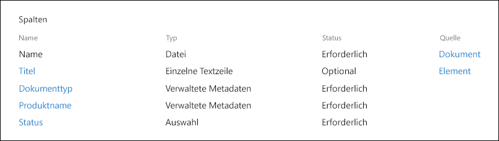

> [!NOTE]
> Die Eigenschaften **Dokumententyp** und **Status** werden später im Szenario von Aufbewahrungsrichtlinien verwendet, um Aufbewahrungsbezeichnungen zu klassifizieren und automatisch anzuwenden.The **Doc Type** and **Status** properties are used by retention policies later in the scenario to classify and auto-apply retention labels.

Es können mehrere Inhaltstypen vorhanden sein, die verschiedene Dokumenttypen darstellen. Konzentrieren uns jedoch auf die Produktdokumentation.We can have several content types that represent different types of documents, but let's focus on the Product Documentation.

In diesem Szenario erstellen wir mithilfe des Managed Metadata Service und des Termspeichers einen Termsatz für **Dokumenttyp** und einen weiteren für **Produktname**.In this scenario, we use the Managed Metadata service and the Term store to create a term set for **Doc Type** and another one for **Product Name**. Für jeden Ausdruckssatz erstellen wir einen Ausdruck für jeden Wert.For each term set, we create a term for each value. Im Terminologiespeicher sieht es für Ihre SharePoint-Organisation ungefähr so aus:It would look like something like this in Term store for your SharePoint organization:

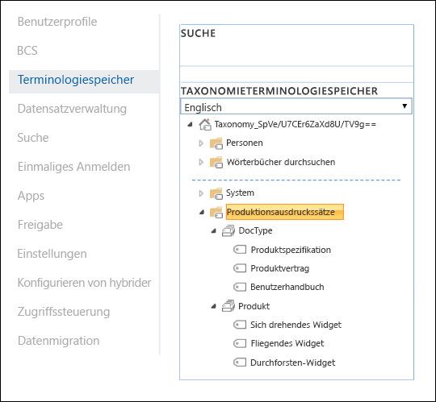

Der Inhaltstyp kann mit dem [Inhaltstyphub](https://support.office.com/article/manage-content-type-publishing-06f39ac0-5576-4b68-abbc-82b68334889b) erstellt und veröffentlicht werden.Content Type can be created and published using the [Content Type Hub](https://support.office.com/article/manage-content-type-publishing-06f39ac0-5576-4b68-abbc-82b68334889b). Ein Inhaltstyp kann auch mit Site-Bereitstellungstools wie dem[PnP-Bereitstellungsframework](https://docs.microsoft.com/sharepoint/dev/solution-guidance/pnp-provisioning-framework) oder dem [Site-Design-JSON-Schema ](https://docs.microsoft.com/sharepoint/dev/declarative-customization/site-design-json-schema#define-a-new-content-type)erstellt und veröffentlicht werden.A content type can also be created and published using site provisioning tools such as the [PnP provisioning framework](https://docs.microsoft.com/sharepoint/dev/solution-guidance/pnp-provisioning-framework) or the [site design JSON schema](https://docs.microsoft.com/sharepoint/dev/declarative-customization/site-design-json-schema#define-a-new-content-type).

Jedes Produkt verfügt über eine dedizierte SharePoint Online-Site, die eine Dokumentbibliothek mit den richtigen aktivierten Inhaltstypen enthält.Each product has a dedicated SharePoint Online site that contains one document library, with the right content types enabled. Alle Dokumente werden in dieser Dokumentbibliothek gespeichert.All page layouts and master pages are stored in this document library.

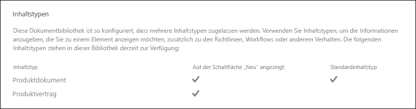

> [!NOTE]
> Anstatt eine SharePoint Online-Site pro Produkt zu haben, könnte das produzierende Unternehmen in diesem Szenario ein Microsoft-Team pro Produkt verwenden, das die Zusammenarbeit mit Mitgliedern des Teams unterstützt, z. B. durchgehender Chat, und die Registerkarte **Dateien** im Team für die Dokumentverwaltung verwenden.Instead of having a SharePoint Online site per product, the manufacturing company in this scenario could use a Microsoft Team per product that would support collaboration with members of the team, such as persistent chat and use the **Files** tab in the team for document management. In diesem Artikel konzentrieren wir uns nur auf Dokumente, daher verwenden wir nur eine Site.In this article we only focus on documents, therefore we will only use a site.

Hier ist eine Ansicht der Dokumentbibliothek für das Spinning Widget-Produkt:Here's a view of the document library for the Spinning Widget product:

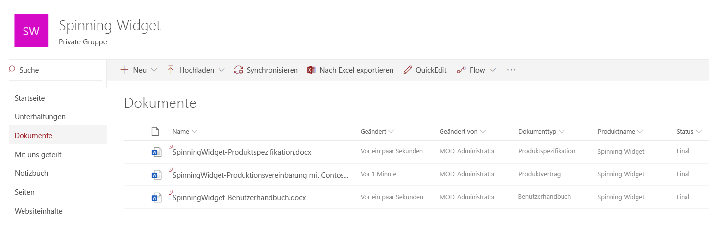

Nachdem wir die grundlegende Informationsarchitektur für das Dokumentenmanagement eingerichtet haben, schauen wir uns die Aufbewahrungs- und Entsorgungsstrategie der Dokumente an, die die Metadaten und die Klassifizierung von Dokumenten verwenden.Now that we have the basic information architecture in place for document management, let's look at the retention and disposal strategy of the documents that use the metadata and classification of documents.

## Aufbewahrung und DispositionRetention and disposition

Die Compliance- und Data Governance-Richtlinien des Herstellers bestimmen, wie Daten aufbewahrt und entsorgt werden.The manufacturing company's compliance and data governance policies dictate the way data is preserved and disposed of. Produktbezogene Dokumente müssen so lange aufbewahrt werden, wie das Produkt hergestellt wird, und für einen bestimmten Zeitraum danach.Product-related documents must be kept for as long as the product is manufactured, and for a certain period after that. Dieser Zeitraum ist für Produktspezifikationen, Verträge und Benutzerhandbücher unterschiedlich.This period is different for product specifications, agreements, and user manuals. In der folgenden Tabelle sind die Aufbewahrungs- und Entsorgungsanforderungen aufgeführt:The following table indicates the retention and disposition requirements:

| **Dokumenttyp****Document Type**          | **Vermerkdauer****Retention**                          | **Disposition****Disposition**                              |
| -------------------------- | -------------------------------------- | -------------------------------------------- |
| ProduktspezifikationProduct specification      | 5 Jahre nach Produktionsabbruch5 years after cessation of production  | LöschenDelete                                       |
| ProduktvertragProduct agreement          | 10 Jahre nach Produktionsabbruch10 years after cessation of production | ÜberprüfungReview                                       |
| BenutzerhandbuchUser manual                | 5 Jahre nach Produktionsabbruch5 years after cessation of production  | LöschenDelete                                       |
| Alle anderen DokumenttypenAll other types of documents | Bewahren Sie andere Dokumente nicht aktiv aufDon't actively retain other documents  | Löschen, wenn Dokument älter als 3 Jahre ist\*Delete when document is older than 3 years\*  |
|||

> [!NOTE]
> \* Ein Dokument gilt als älter als 3 Jahre, wenn es in den letzten 3 Jahren nicht geändert wurde.\* A document is considered older than 3 years if it hasn't been modified within the last 3 years.

Mithilfe des Sicherheits- und Compliance-Centers erstellen wir die folgenden Aufbewahrungsbezeichnungen:Using the security and compliance center, we create the following retention labels:

  - ProduktspezifikationProduct Specification

  - ProduktvertragProduct Agreement

  - BenutzerhandbuchUser manual

In diesem Artikel wird nur gezeigt, wie die Aufbewahrungsbezeichnung der Produktspezifikation erstellt und automatisch angewendet wird.In this article, we only show how to create and auto-apply the Product Specification retention label. Um das vollständige Szenario zu implementieren, erstellen Sie Aufbewahrungsbezeichnungen für die beiden anderen Dokumenttypen und wenden sie diese automatisch an.To implement the complete scenario, you would create and auto-apply retention labels for the other two document types.

### Einstellungen für die Aufbewahrungsbezeichnung der ProduktspezifikationSettings for the Product Specification retention label

Hier ist der [Aktenplan](file-plan-manager.md) für die Aufbewahrungsbezeichnung der Produktspezifikation:Here's the [file plan](file-plan-manager.md) for the Product Specification retention label: 

- **Name:** Produktspezifikation**Name:** Product Specification

- **Beschreibung für Administratoren:** Bezeichnung der Produktspezifikation, fünf Jahre nach Einstellung der Produktion aufbewahren, automatische Löschung, ereignisbasierte Aufbewahrung, Ereignistyp ist Einstellung des Produkts.**Description for admins:** Product Specification Label, retain for five years after cessation of production, auto delete, event-based retention, event type is Product Cessation.

- **Beschreibung für Nutzer:** für fünf Jahre nach Beendigung der Produktion aufbewahren.**Description for users:** Retain for five years after cessation of production.

- **Aufbewahrungsaktion:** aufbewahren und löschen**Retention action:** Keep and delete

- **Aufbewahrungsdauer:** Fünf Jahre (1825 Tage)**Retention duration:** Five years (1825 days)

- **Datensatzbezeichnung**: Konfigurieren Sie die Aufbewahrungsbezeichnung so, dass Inhalte als [Datensatz](labels.md#using-retention-labels-for-records-management) klassifiziert werden (Dokumente, die als Datensatz klassifiziert sind, können von Benutzern nicht geändert oder gelöscht werden).**Record label**: Configure the retention label to classify content as a [record](labels.md#using-retention-labels-for-records-management) (documents that are classified as a record can't be modified or deleted by users)

- **Dateiplandeskriptoren:** (Zur Vereinfachung des Szenarios werden keine Dateideskriptoren bereitgestellt)**File plan descriptors:** (for simplifying the scenario, no file descriptors are provided)

Der folgende Screenshot zeigt die Einstellungen, wenn Sie die [Aufbewahrungbezeichnung](labels.md) der Produktspezifikation im Sicherheits- und Compliance-Center erstellen.The following screenshot shows the settings when you create the Product Specification [retention label](labels.md) in the security and compliance center. Sie können den Ereignistyp der **Einstellung des Produkts** erstellen, wenn Sie die Aufbewahrungsbezeichnung erstellen.You can create the **Product Cessation** event type when you create the retention label. Beachten Sie die folgenden Schritte.See the steps below.

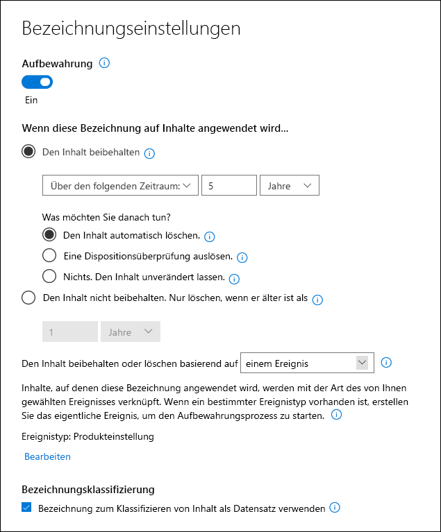

> [!NOTE]
> Legen Sie aus praktischen Gründen und um zu vermeiden, dass Sie 5 Jahre warten müssen, bis ein Dokument automatisch gelöscht wird, die Aufbewahrungsdauer auf 1 Tag fest, wenn Sie dieses Szenario in Ihrer Testumgebung neu erstellen.For the practical purposes and to avoid having to wait 5 years to see a document automatically deleted, set the retention duration to 1 day if you're recreating this scenario in your test environment.

### Erstellen Sie einen Ereignistyp, wenn Sie eine Aufbewahrungsbezeichnung erstellenCreate an event type when creating a retention label

1. Wählen Sie in der Dropdownliste **Inhalte basierend auf aufbewahren oder löschen** wählen Sie**ein Ereignis**aus.In the **Retain or delete content based** on dropdown list, select **an event**.

2. Klicken Sie auf **Ereignistyp auswählen**.Select **Choose an event type**.

   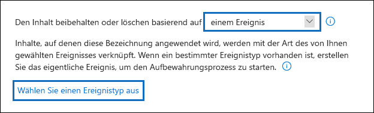

3. Klicken Sie auf der Seite**Ereignistyp auswählen** auf **Sie können hier neue Ereignistypen erstellen**.On the **Choose an event type** page, select **You can create new event types here**.

4. Erstellen Sie einen Ereignistyp namens **Einstellung des Produkts**, geben Sie eine Beschreibung ein, und klicken Sie auf **Ende**, um es zu erstellen.Create an event type named **Product Cessation**, give a description, and select **Finish** to create it. 

5. Wählen Sie auf der Seite **Ereignistyp auswählen** den Ereignistyp **Einstellung des Produkts** aus, den Sie erstellt haben, und klicken Sie dann auf **Hinzufügen**.Back on the **Choose an event type** page, select the **Product Cessation** event type that you created, and then select **Add**.

So sehen die Einstellungen für die Aufbewahrungsbezeichnung der Produktspezifikation aus.Here's what the settings look like for the Product Specification retention label. Klicken Sie auf **Diese Bezeichnung erstellen**, um sie zu erstellen.Select **Create this label** to create it.

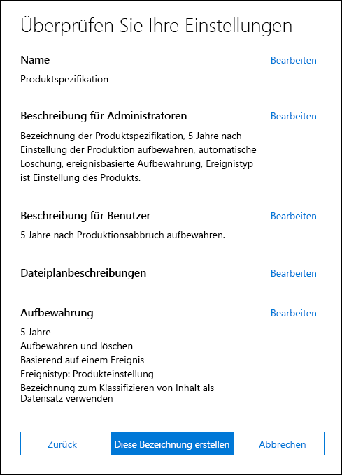

> [!TIP]
> Ausführlichere Schritte finden Sie unter[Erstellen eines Etiketts, dessen Aufbewahrungsdauer auf einem Ereignis basiert](event-driven-retention.md#step-1-create-a-label-whose-retention-period-is-based-on-an-event).For more detailed steps, see [Create a label whose retention period is based on an event](event-driven-retention.md#step-1-create-a-label-whose-retention-period-is-based-on-an-event).

Nachdem die Aufbewahrungsbezeichnung erstellt wurde, wird die Aufbewahrungsbezeichnung automatisch auf den Inhalt der Produktspezifikation angewendet.Now that the retention label is created, let's look at auto-applying the retention label to product specification content.

## Klassifizieren von Inhalten durch automatisches Anwenden von AufbewahrungsbezeichnungenClassifying content by auto-applying retention labels

Wir werden die Aufbewahrungsbezeichnungen, die wir für dieses Szenario erstellt haben, mithilfe von KQL (Keyword Query Language) [automatisch anwenden](labels.md#applying-a-retention-label-automatically-based-on-conditions).We're going to [auto-apply](labels.md#applying-a-retention-label-automatically-based-on-conditions) the retention labels that we've created for this scenario by using Keyword Query Language (KQL). KQL ist die Sprache, mit der Suchanfragen erstellt werden.KQL is the language used to build search queries. In KQL können Sie mithilfe von Schlüsselwörtern oder verwalteten Eigenschaften suchen.In KQL, you can search by using keywords or managed properties. Weitere Informationen zu KQL finden Sie hier <https://docs.microsoft.com/sharepoint/dev/general-development/keyword-query-language-kql-syntax-reference>For more information about parameters, see <https://docs.microsoft.com/sharepoint/dev/general-development/keyword-query-language-kql-syntax-reference>.

Auf hoher Ebene möchten wir Office 365 mitteilen, dass Sie die Aufbewahrungsbezeichnung der **Produktspezifikation** auf alle Dokumente "anwenden möchten, die über den **Status** **Entdültig** und einen **Dokumententypen** **Produktspezifikation** haben.At a high level, we want to tell Office 365 to "apply the **Product Specification** retention label to all documents that have a **Status** of **Final** and a **Doc Type** of **Product Specification**. Erinnern Sie sich daran, dass **Status** und **Dokumenttyp** die Sitespalten sind, die Sie zuvor für den Inhaltstyp "Produktdokumentation" im Abschnitt [Informationsarchitektur](#information-architecture) definiert haben.Recall that **Status** and **Doc Type** are the site columns we previously defined for Product Documentation content type in the [Information architecture](#information-architecture) section. Um dies zu erreichen, müssen wir das Suchschema konfigurieren.To achieve this, we need to configure the search schema.

Wenn SharePoint Inhalte indiziert, werden automatisch gecrawlte Eigenschaften für jede Sitespalte generiert.When SharePoint indexes content, it automatically generates crawled properties for each site column. In diesem Szenario interessieren uns die Eigenschaften **Dokumenttyp** und **Status**.For this scenario, we're interested in the **Doc Type** and **Status** properties. Wir benötigen Dokumente in der Bibliothek mit dem richtigen Inhaltstyp und die ausgefüllten Sitespalten, damit bei der Suche die gecrawlten Eigenschaften erstellt werden können.We need documents in the library using the right content type and have the site columns filled in, in order for search to create the crawled properties.

Im SharePoint Admin Center können wir die Suchkonfiguration öffnen und **Suchschema Verwalten** auswählen, um die durchforsteten Eigenschaften anzuzeigen und zu konfigurieren.In the SharePoint admin center, we can open the Search configuration, and select **Manage Search Schema** to view and configure the crawled properties.

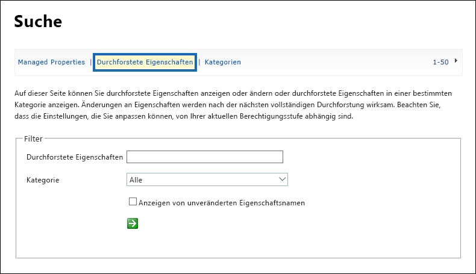

Wenn wir im Feld **Durchforstete Eigenschaften** **Status** eingeben und auf den grünen Pfeil klicken, sollte das Ergebnis folgendermaßen aussehen:If we type **status** in the **Crawled properties** box, and select the green arrow, we should see a result like this:

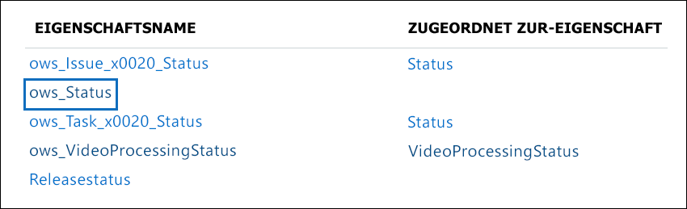

Die Eigenschaft **ows\_\_Status** ist diejenige, die uns interessiert. (Beachten Sie, dass es sich um einen doppelten Unterstrich handelt).The property **ows\_\_Status** (notice the double underscore) is the one that interests us. Dies ist der **Status**-Eigenschaft des Produktionsdokuments-Inhaltstyps zugeordnet.This maps to the **Status** property of the Production Document content type.

Wenn wir nun **ows\_doc** eingeben und auf den grünen Pfeil klicken, sollten wir so etwas sehen:Now if we type **ows\_doc** and select the green arrow we should see something like this:

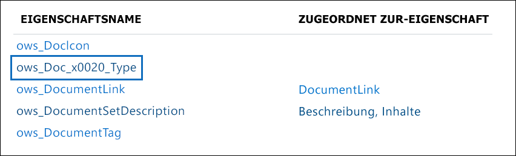

Die Eigenschaft **ows\_doc\_x0020\_Type** ist die zweite Eigenschaft, die uns interessiert.The property **ows\_Doc\_x0020\_Type** is the second property that interests us. Dies ist der **Dokumenttyp**Eigenschaft des Produktionsdokuments-Inhaltstyps zugeordnet.This maps to the **Doc Type** property of the Production Document content type.

> [!TIP]
> Wechseln Sie zu der Dokumentbibliothek, die die Produktionsdokumente enthält, und wechseln Sie dann zu den Bibliothekseinstellungen, um den Namen einer durchforsteten Eigenschaft für dieses Szenario zu identifizieren.To identify the name of a crawled property for this scenario, go the document library that contains the production documents and then go to the library settings. Klicken Sie in den **Spalten** auf den Namen der Spalte (z. B. **Status** oder **Dokumenttyp**), um die Seite mit der Websitespalte zu öffnen.In the **Columns**, select the name of the column (for example, **Status** or **Doc Type**) to open the site column page. Der Parameter **Feld** in der URL für diese Seite enthält den Namen des Feldes.The **Field** parameter in the URL for that page contains the name of the field. Dieser Feldname mit dem Präfix "ows_" ist der Name der gecrawlten Eigenschaft.This field name, prefixed with "ows_", is the name of the crawled property. Beispielsweise`https://tenantname.sharepoint.com/sites/SpinningWidget/_layouts/15/FldEdit.aspx?List=%7BC38C2F45-3BD6-4C3B-AA3B-EF5DF6B3D172%7D&Field=_Status` entspricht die URL der gecrawlten Eigenschaft**ows\_\_Status**.For example, the URL `https://tenantname.sharepoint.com/sites/SpinningWidget/_layouts/15/FldEdit.aspx?List=%7BC38C2F45-3BD6-4C3B-AA3B-EF5DF6B3D172%7D&Field=_Status` corresponds to the **ows\_\_Status** crawled property.

Wenn die gecrawlte Eigenschaften nicht im Abschnitt Suchschema Verwalten im SharePoint-Verwaltungscenter angezeigt werden, kann dies einen der folgenden Gründe haben:If the crawled properties you're looking for don't appear in the Manage Search Schema section in the SharePoint admin center, it could be for one of the following reasons:

- Die Dokumente wurden nicht indiziert.The documents haven't been indexed. Sie können eine Neuindexierung der Bibliothek erzwingen, indem Sie zu Dokumentbibliothekseinstellungen> Erweiterte Einstellungen gehen.You can force a re-index of the library by going to Document library settings > Advanced Settings.

- Wenn sich die Dokumentbibliothek in einer modernen Site befindet, stellen Sie sicher, dass der SharePoint-Administrator auch ein Site Collection Admin ist.If the document library is in a modern site, make sure that the SharePoint admin is also a site collection admin.

Weitere Informationen zu gecrawlten und verwalteten Eigenschaften finden Sie unter[ Automatisch erstellte verwaltete Eigenschaften in SharePoint Server](https://docs.microsoft.com/sharepoint/technical-reference/automatically-created-managed-properties-in-sharepoint).For more information about automatically created managed properties, see [Automatically created managed properties in SharePoint Server 2013](https://docs.microsoft.com/sharepoint/technical-reference/automatically-created-managed-properties-in-sharepoint).

### Gecrawlte Eigenschaften vordefinierten verwalteten Eigenschaften zuordnenMapping of crawled properties to managed properties.

KQL kann keine gecrawlten Eigenschaften in Suchabfragen verwenden.KQL can't use crawled properties in search queries. Es muss eine verwaltete Eigenschaft verwendet werden.It has to use a managed property. In einem normalen Suchszenario erstellen wir eine verwaltete Eigenschaft und ordnen sie der gecrawlten Eigenschaft zu, die wir benötigen.In a normal search scenario, we create a managed property and map it to the crawled property that we need. Für das automatische Anwenden von Aufbewahrungsbezeichnungen können Sie jedoch nur in KQL vordefinierte verwaltete Eigenschaften und keine benutzerdefinierten verwalteten Eigenschaften angeben.However, for auto-applying retention labels, you can only specify in KQL pre-defined managed properties and not custom managed properties. Es gibt eine Reihe vordefinierter verwalteter Eigenschaften, die bereits im System erstellt wurden, damit die Zeichenfolge RefinableString00 bis RefinableString199 verwendet werden kann.There's a set of predefined managed properties already created in the system for string RefinableString00 to RefinableString199 that can be used. Eine umfassende Liste finden Sie unter [Standardmäßig nicht verwendete verwaltete Eigenschaften](https://docs.microsoft.com/sharepoint/manage-search-schema#default-unused-managed-properties).For a complete list, see [Default unused managed properties](https://docs.microsoft.com/sharepoint/manage-search-schema#default-unused-managed-properties). Diese standardmäßig verwalteten Eigenschaften werden normalerweise zum Definieren von Sucheinschränkungen verwendet.These default managed properties are typically used for defining search refiners.

Damit die KQL-Abfrage funktioniert und die richtige Aufbewahrungsbezeichnung automatisch auf den Inhalt des Produktdokuments anwendet, ordnen wir die gecrawlten Eigenschaften **ows\_Doc\_x0020\_Typ** zu und **ows\_\_Status** zwei anpassbaren verwalteten Eigenschaften zu.For the KQL query to work and automatically apply the correct retention label to product document content, we map the crawled properties **ows\_Doc\_x0020\_Type** and **ows\_\_Status** to two refinable managed properties. In unserer Testumgebung für dieses Szenario werden **RefinableString00** und **RefinableString01** nicht verwendet.In our test environment for this scenario, **RefinableString00** and **RefinableString01** aren't being used. Wir haben dies festgelegt, indem wir **Verwaltete Eigenschaften** im **Suchschema Verwalten** im SharePont Admin Center angesehen haben.We determined this by looking at **Managed Properties** in the **Manage Search Schema** in the SharePont admin center.

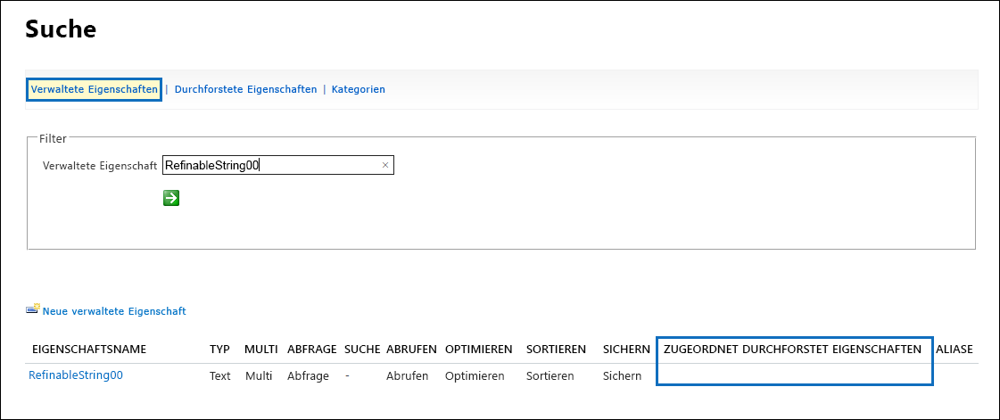

Beachten Sie, dass die Spalte **Zugeordnete, durchforstete Eigenschaften** im vorherigen Screenshot leer ist.Notice that the **Mapped Crawled Properties** column in the previous screenshot is empty.

Gehen Sie wie folgt vor, um die durchforstete Eigenschaft **ows\_Doc\_x0020\_Type** zuzuordnen:To map the **ows\_Doc\_x0020\_Type** crawled property, do the following:

1. Geben Sie im Filterfeld **Verwaltete Eigenschaft** **RefinableString00** ein, und klicken Sie auf den grünen Pfeil.In the **Managed property** filter box, type **RefinableString00** and select the green arrow.

2. Klicken Sie in der Ergebnisliste auf den Link **RefinableString00**, und führen Sie dann einen Bildlauf nach unten zum Abschnitt **Zuordnungen zu durchforsteten Eigenschaften**.In the results list, select the **RefinableString00** link, and then scroll down to the **Mappings to crawled properties** section.  

3. Klicken Sie auf **Zuordnung hinzufügen**, und geben Sie **ows\_Doc\_x0020\_Type** in das Feld **Namen einer durchforsteten Eigenschaft suchen** im Fenster **Auswahl für durchforstete Eigenschaft** ein.Select **Add a Mapping**, and then type **ows\_Doc\_x0020\_Type** in the **Search for a crawled property name** box in the **Crawled property selection** window. Wählen Sie **Suchen** aus.Select **Find**.  

4. Wählen Sie in der Ergebnisliste **ows\_Doc\_x0020\_Type** aus, und klicken Sie dann auf **OK**.In the results list, select **ows\_Doc\_x0020\_Type** and then select **OK**.

   Im Abschnitt **Zugeordnete durchforstete Eigenschaften** sollten Sie so etwas wie diesen Screenshot sehen:In the **Mapped Crawled Properties** section, you should see something similar to this screenshot:

   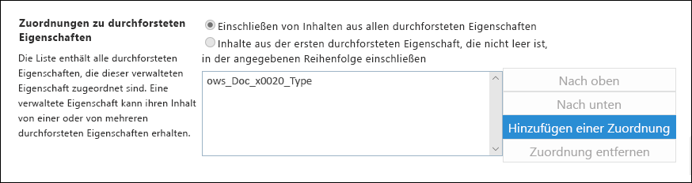

5. Führen Sie einen Bildlauf zum Ende der Seite aus, und klicken Sie auf **OK**, um die Zuordnung zu speichern.Scroll to the bottom of the page and select **OK** to save the mapping.

Wiederholen Sie diesen Vorgang, um RefinableString01 und ows\_\_Status zuzuordnen.Repeat this same procedure to map RefinableString01 and ows\_\_Status.

Jetzt sollten zwei verwaltete Eigenschaften den beiden durchforsteten Eigenschaften zugeordnet sein:Now you should have two managed properties mapped to the two crawled properties:

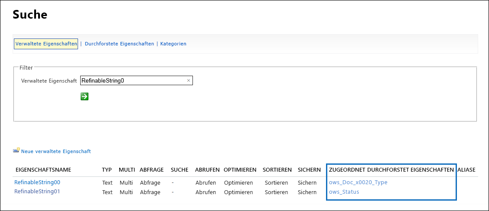

Lassen Sie uns überprüfen, ob dies alles korrekt eingerichtet ist, indem Sie eine Unternehmenssuche ausführen.Let's verify that all this is set up correctly by running an enterprise search. Gehen Sie in einem Browser zu https://yourtenant.sharepoint.com/search.In a web browser, go to https://yourtenant.sharepoint.com/search. Geben Sie im Suchfeld **RefinableString00:"Product Specification"** ein und drücken Sie die Eingabetaste.In the search box, type **RefinableString00:"Product Specification"** and press enter. Dadurch werden alle Dokumente zurückgegeben, die über die Produktspezifikation **Dokumenttyp**verfügen.This should return all documents that have Product Specification as **Doc Type**.

Geben Sie nun im Suchfeld **RefinableString00:"Product Specification" AND RefinableString01:Final** ein und drücken Sie die Eingabetaste.Now in the search box, type **RefinableString00:"Product Specification" AND RefinableString01:Final** and press enter. Dies sollte alle Dokumente zurückgeben, die die Produktspezifikation als **Dokumenttyp** und den Status **Endgültig** haben.This should return all documents that have Product Specification as **Doc Type** and a Status of **Final**.

### Erstellen der Richtlinien zum automatischen Anwenden von Bezeichungen.Creating the auto-apply label policies

Nachdem wir überprüft haben, dass die KQL-Abfrage ordnungsgemäß funktioniert, erstellen wir die Bezeichungsrichtlinie, die eine KQL-Abfrage verwendet, um die Produktspezifikations-Aufbewahrungsbezeichung automatisch auf die entsprechenden Dokumente anzuwenden.Now that we verified that the KQL query is working correctly, let's create the label policy that uses a KQL query to auto-apply the Product Specification retention label to the appropriate documents.

1. Wechseln Sie im [Security & Compliance Center](https://protection.office.com)zu **Klassifizierung** > **Aufbewahrungsbezeichnungen**, und klicken Sie dann auf **Beschriftung automatisch anwenden**.In the [security and compliance center](https://protection.office.com), go to **Classification** > **Retention labels**, and then select **Auto-apply a label**. 

   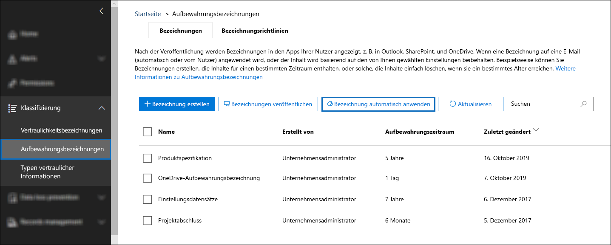

2. Klicken Sie auf der Assistenten-Seite **Automatisch anzuwendende Bezeichnung auswählen** auf **Automatisch anzuwendende Bezeichnung auswählen**.On the **Choose a label to auto-apply** wizard page, select **Choose a label to auto-apply**.

3. Wählen Sie in der Liste der Bezeichnungen **Produktspezifikation** aus, klicken Sie auf **Hinzufügen**, und klicken Sie dann auf **Weiter**.In the list of labels, select **Product Specification**, select **Add**, and then select **Next**.

4. Wählen Sie **Bezeichnung auf Inhalt anwenden, der bestimmte Wörter oder Ausdrücke enthält** aus, und klicken Sie dann auf **Weiter**.Select **Apply label to content that contains specific words or phrases, or properties**, and then select **Next**.

   

   Im nächsten Schritt stellen Sie dieselbe KQL-Suchabfrage bereit, die wir im vorherigen Abschnitt getestet haben.In the next step, you will provide the same KQL search query that we tested in the previous section. Wie Sie sich erinnern, hat diese Abfrage alle Produktspezifikationsdokumente zurückgegeben, die den Status "Endgültig" haben.As you recall, this query returned all Product Specification documents that have a status of Final. Das Ergebnis der Verwendung derselben Abfrage in der Bezeichnungsrichtlinie bedeutet, dass die Aufbewahrungsbezeichnung der Produktspezifikation automatisch auf alle Dokumente angewendet wird, die dieser Suchabfrage entsprechen.The result of using this same query in the label policy means that the Product Specification retention label will be automatically applied to all documents that match this search query.

5. Geben Sie im Feld **Schlüsselwortabfrage-Editor** **RefinableString00:"Product Specification" AND RefinableString01:Final** ein, und klicken Sie dann auf **Weiter**.In the **Keyword query editor** box, type **RefinableString00:"Product Specification" AND RefinableString01:Final**, and then select **Next**.

   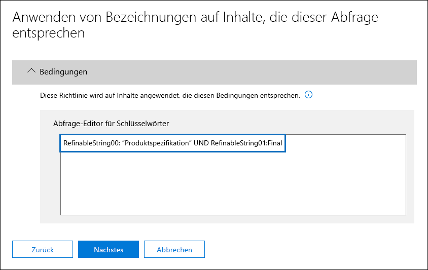

6. Geben Sie einen Namen (z. B. **Bezeichnung „Produktspezifikation“ automatisch anwenden**) und eine optionale Beschreibung für die Bezeichnungsrichtlinie ein, und klicken Sie dann auf **Weiter**.Type a name (for example, **Auto apply Product Specification label**) and an optional description for the label policy, and then select **Next**. 

7. Wählen Sie auf der Assistenten-Seite **Speicherorte auswählen** die Inhaltsspeicherorte aus, auf die Sie die Richtlinie anwenden möchten.On the **Choose locations** wizard page, you select the content locations that you want to apply the policy to. In diesem Szenario wenden wir die Richtlinie nur auf SharePoint-Standorte an, da alle Produktionsdokumente nur in SharePoint-Dokumentbibliotheken gespeichert werden.For this scenario, we apply the policy only to SharePoint locations because all production documents are stored only in SharePoint document libraries. Klicken Sie daher auf **Mich bestimmte Speicherorte auswählen lassen**, ändern Sie den Status für Exchange-E-Mails, OneDrive-Konten und Office 365-Gruppen, und stellen Sie sicher, dass der Status für SharePoint-Sites aktiviert ist.Select **Let me choose specific locations**, toggle the status for Exchange email, OneDrive accounts, and Office 365 groups to off and make sure the status for SharePoint sites is toggled on. 

    

   > [!TIP]
   > Anstatt die Richtlinie auf alle SharePoint-Websites anzuwenden, können Sie auf **Websites auswählen** klicken und die URLs für bestimmte SharePoint-Websites hinzufügen.Instead of applying the policy to all SharePoint sites, you can select **Choose sites** and add the URLs for specific SharePoint sites.

8. Klicken Sie auf **Weiter**, um die Seite **Einstellungen überprüfen** anzuzeigen.Select **Next** to display the **Review your settings** page. 

    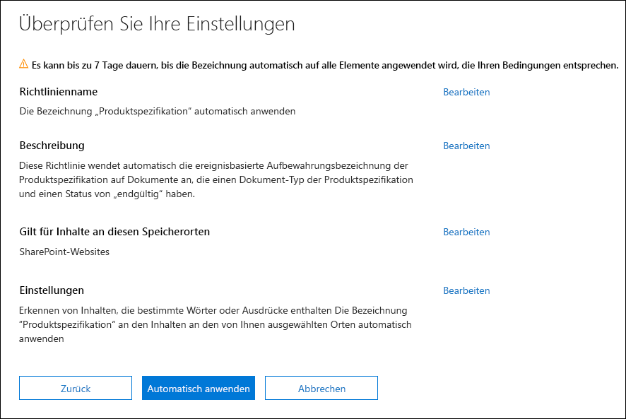

9. Klicken Sie auf **Automatisch anwenden**, um die Bezeichnungsrichtlinie zu erstellen.Select **Auto-apply** to create the label policy. Es dauert bis zu sieben Tage, um die Produktspezifikationsbezeichnung automatisch auf alle Dokumente anzuwenden, die der von Ihnen angegebenen KQL-Suchabfrage entsprechen.It takes up to seven days to automatically apply the Product Specification label to all documents that match the KQL search query that you provided.

### Überprüfen, dass die Aufbewahrungsbezeichnung automatisch angewendet wurdeVerifying the retention label was automatically applied

Verwenden Sie nach sieben Tagen den [Bezeichungsaktivitäts-Explorer](view-label-activity-for-documents.md) im Security & Compliance Center, um festzustellen, dass die von uns erstellte Bezeichnungsrichtlinie die Aufbewahrungsbezeichnungen in diesem Szenario automatisch auf die Produktdokumente angewendet hat.After seven days, use the [Label activity explorer](view-label-activity-for-documents.md) in the security and compliance center to see that the label policy that we created has automatically applied the retention labels in this scenario to the product documents. Im folgenden Screenshot wurden Aufbewahrungsbezeichnungen auch auf Produktverträge und Benutzerhandbücher angewendet, obwohl wir uns in diesem Artikel nicht mit dem Erstellen dieser Aufbewahrungsbezeichnungen und Bezeichnungsrichtlinien befasst haben.In the following screenshot, retention labels have also been applied to product agreements and user manuals, even though we didn't cover creating those retention labels and label policies in this article.

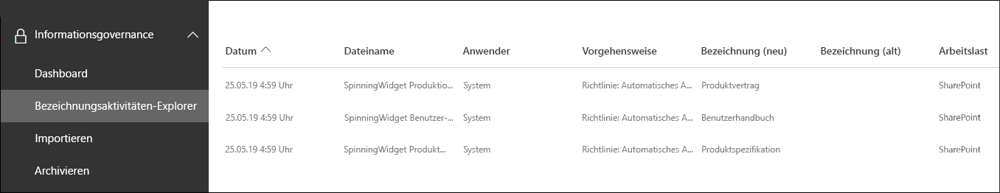

Ein weiterer Überprüfungsschritt besteht darin, die Eigenschaften des Dokuments in der Dokumentbibliothek zu überprüfen.Another verification step is to look at the properties of the document in the Document Library. Im Informationsbereich können Sie sehen, dass die Aufbewahrungsbezeichnung auf ein ausgewähltes Dokument angewendet wird.In the information panel, you can see that the retention label is applied to a selected document.

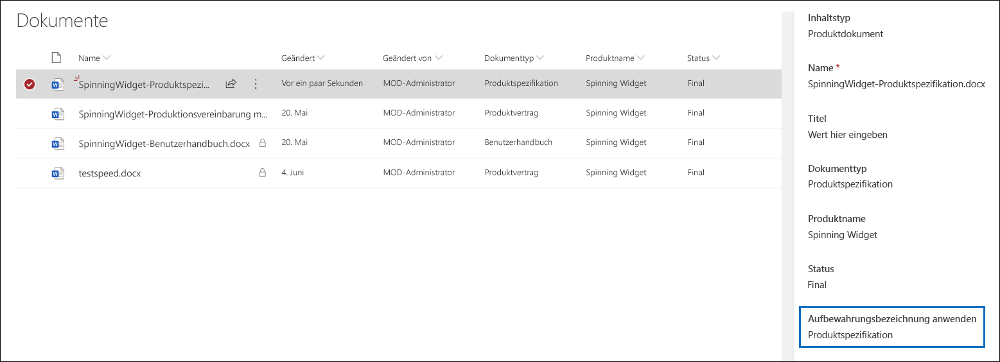

Da die Aufbewahrungsbezeichnungen automatisch auf Dokumente angewendet wurden, sind die Dokumente vor dem Löschen geschützt, da die Aufbewahrungsbezeichnung so konfiguriert wurde, dass die Dokumente als Datensätze deklariert werden.Because the retention labels have been auto-applied to documents, the documents are protected from being deleted because the retention label was configured to declare the documents as records. Als Beispiel für diesen Schutz erhalten wir die im folgenden Screenshot gezeigte Fehlermeldung, wenn wir versuchen, eines dieser Dokumente zu löschen.As an example of this protection, we receive an error message shown in the following screenshot when we try to delete one of these documents.

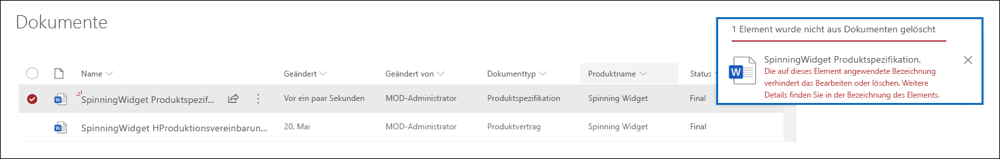

## Generieren der Ereignisse, die den Beginn des Aufbewahrungszeitraums auslösenGenerating the events that trigger the start of the retention period

Nachdem die Aufbewahrungsbeschriftungen erfolgreich automatisch angewendet wurden, konzentrieren wir uns auf das Ereignis, das das Ende der Produktion für ein bestimmtes Produkt anzeigt.Now that the retention labels were successfully automatically applied, let's focus on the event that will indicate the end of production for a particular product. Wenn dieses Ereignis eintritt, wird der Beginn des Aufbewahrungszeitraums ausgelöst, der in automatisch auf Dokumente angewendeten Aufbewahrungsbezeichnungen definiert ist.When this event occurs, it triggers the beginning of the retention period defined in retention labels auto-applied to documents. Beispielsweise beginnt bei Produktspezifikationsdokumenten die Aufbewahrungsfrist von fünf Jahren, wenn das Ereignis "Produktionsende" ausgelöst wird.For example, for product specification documents, the five-year retention period begins when the "end of production" event is triggered.

Sie können das Ereignis manuell im Security & Compliance Center erstellen (indem Sie zu **Records Managements** > **Events** wechseln), den Ereignistyp auswählen, die richtigen Objekt-IDs festlegen und ein Datum für das Ereignis eingeben.You can manually create the event in the security and compliance center by going to **Records Managements** > **Events** and choosing the event type, setting the correct Asset Ids, and entering a date for the event. Weitere Informationen finden Sie unter [Übersicht über die ereignisgesteuerte Aufbewahrung](event-driven-retention.md).For more information see, [Overview of retention labels](event-driven-retention.md).

In diesem Szenario erstellen wir das Ereignis automatisch, indem wir es aus einem externen Produktionssystem generieren.For this scenario, we'll automatically create the event by generating it from an external production system. In diesem Fall ist das System, das das Ereignis generiert, eine einfache SharePoint-Liste, die angibt, ob ein Produkt in Produktion ist oder nicht, und ein [Microsoft Flow](https://docs.microsoft.com/flow/getting-started), der der Liste zugeordnet ist und das Ereignis auslöst.In this case, the system that generates the event is a simple SharePoint list that indicates whether a product is in production and a [Microsoft Flow](https://docs.microsoft.com/flow/getting-started) that's associated with the list and will trigger the event. In einem realen Szenario kann es sich um ein beliebiges System handeln, das das Ereignis generiert, z. B. ein HR- oder CRM-System.In a real-world scenario, it could be any system that generates the event, such as an HR or CRM system. Flow enthält viele einsatzbereite Interaktionen und Bausteine für Office 365-Workloads wie Exchange, SharePoint, Teams und Dynamics 365 sowie Drittanbieter-Apps wie Twitter, Box, Salesforce und Workdays.Flow contains many ready-to-use interactions and building block for Office 365 workloads such as Exchange, SharePoint, Teams, and Dynamics 365, and third-party apps such as Twitter, Box, Salesforce, and Workdays. Dies erleichtert die Integration von Flow in diesen Systemen.This makes it easy to integrate Flow with these systems. Weitere Informationen finden Sie unter [Automatisieren Sie die ereignisgesteuerte Aufbewahrung](automate-event-driven-retention.md).For more information, see [Automate event-driven retention](automate-event-driven-retention.md).

Der folgende Screenshot zeigt die SharePoint-Liste, die zum Auslösen des Ereignisses verwendet wird:The following screenshot shows the SharePoint list that will be used the trigger the event: 

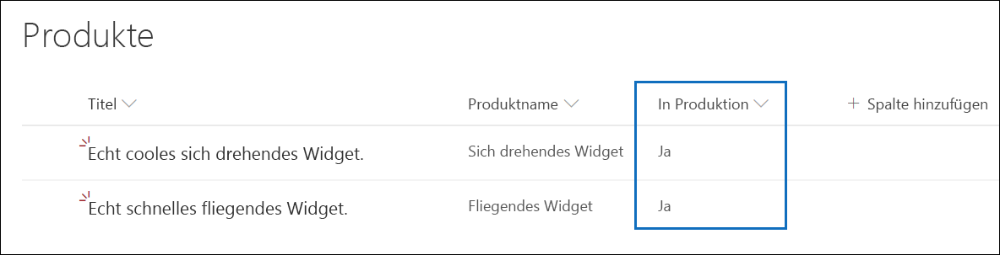

Derzeit sind zwei Produkte in Produktion. Dies wird durch den Wert **Ja** in der Spalte **In Produktion** angezeigt.There are two products currently in production, which is indicated by the value of **Yes** in the **In Production** column. Wenn der Wert in dieser Spalte für ein Produkt auf **Nein** gesetzt ist, generiert der mit der Liste verknüpfte Flow automatisch das Ereignis.When the value in this column is set to **No** for a product, the flow associated with the list will automatically generate the event. Dies wiederum löst den Beginn der Aufbewahrungsfrist für die Aufbewahrungsbezeichnung aus, die automatisch auf die entsprechenden Produktdokumente angewendet wurde.This in turn triggers the start of the retention period for the retention label that was auto-applied to the corresponding product documents.

In diesem Szenario verwenden wir den folgenden Flow, um das Ereignis auszulösen:For this scenario, we use the following flow to trigger the event:

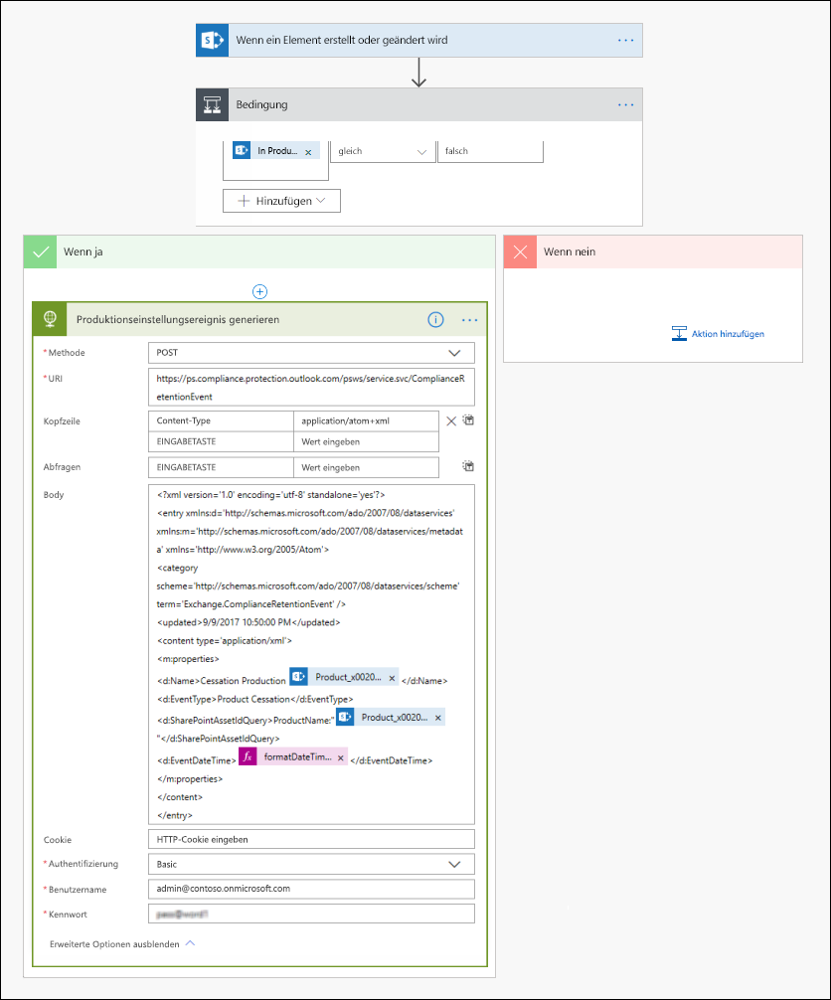

Starten Sie zum Erstellen dieses Flows einen SharePoint-Connector, und wählen Sie den Auslöser **Wenn ein Element erstellt oder geändert wird** aus.To create this flow, start from a SharePoint connector and select the **When an item is created or modified** trigger. Geben Sie die Site-Adresse und den Listennamen an und fügen Sie dann eine Bedingung hinzu, die darauf basiert, dass der Wert der Spalte **In Produktion** auf **Nein** gesetzt ist (oder auf der Bedingungskarte gleich „false“ ist).Specify the site address and list name, and then add a condition based on when the **In Production** list column value is set to **No** (or equal to false in the condition card). Fügen Sie dann eine Aktion hinzu, die auf der integrierten HTTP-Vorlage basiert.Then add an action based on the built-in HTTP template. Verwenden Sie die Werte in der folgenden Tabelle, um die HTTP-Aktion zu konfigurieren.Use the values in the following table to configure the HTTP action. Sie können die Werte für die Eigenschaften URI und Body aus der folgenden Tabelle kopieren und dann in die Vorlage einfügen.You can copy the values for the URI and Body properties from the table below and then paste them into the template.

<table>
<thead>
<tr class="header">
<th><strong>Parameter</strong><strong>Parameter</strong></th>
<th><strong>Wert</strong><strong>Value</strong></th>
</tr>
</thead>
<tbody>
<tr class="odd">
<td>MethodeMethod</td>
<td>POSTPOST</td>
<tr class="even">
<td>URIURI</td>
<td><a href="https://ps.compliance.protection.outlook.com/psws/service.svc/ComplianceRetentionEvent">https://ps.compliance.protection.outlook.com/psws/service.svc/ComplianceRetentionEvent</a></td>
<td></td>
</tr>
<tr class="odd">
<td>KopfzeileHeaders</td>
<td>Schlüssel = Inhaltstyp, Wert = application/atom+xmlKey = Content-Type, Value = application/atom+xml</td>
<td></td>
</tr>
<tr class="even">
<td>BodyBody</td>
<td>
&lt;?xml version='1.0' encoding='utf-8' standalone='yes'?&gt;&lt;?xml version='1.0' encoding='utf-8' standalone='yes'?&gt;

&lt;entry xmlns:d='https://schemas.microsoft.com/ado/2007/08/dataservices' xmlns:m='https://schemas.microsoft.com/ado/2007/08/dataservices/metadata' xmlns='https://www.w3.org/2005/Atom'&gt;&lt;entry xmlns:d='https://schemas.microsoft.com/ado/2007/08/dataservices' xmlns:m='https://schemas.microsoft.com/ado/2007/08/dataservices/metadata' xmlns='https://www.w3.org/2005/Atom'&gt;

&lt;category scheme='https://schemas.microsoft.com/ado/2007/08/dataservices/scheme' term='Exchange.ComplianceRetentionEvent' /&gt;&lt;category scheme='https://schemas.microsoft.com/ado/2007/08/dataservices/scheme' term='Exchange.ComplianceRetentionEvent' /&gt;

&lt;updated&gt;9/9/2017 10:50:00 PM&lt;/updated&gt;&lt;updated&gt;9/9/2017 10:50:00 PM&lt;/updated&gt;

&lt;content type='application/xml'&gt;&lt;content type='application/xml'&gt;

&lt;m:properties&gt;&lt;m:properties&gt;

&lt;d:Name&gt;Cessation Production @{triggerBody()?['Product_x0020_Name']?['Value']}&lt;/d:Name&gt;&lt;d:Name&gt;Cessation Production @{triggerBody()?['Product_x0020_Name']?['Value']}&lt;/d:Name&gt;

&lt;d:EventType&gt;Product Cessation&lt;/d:EventType&gt;&lt;d:EventType&gt;Product Cessation&lt;/d:EventType&gt;

&lt;d:SharePointAssetIdQuery&gt;ProductName:&quot;@{triggerBody()?['Product_x0020_Name']?['Value']}&quot;&lt;/d:SharePointAssetIdQuery&gt;&lt;d:SharePointAssetIdQuery&gt;ProductName:&quot;@{triggerBody()?['Product_x0020_Name']?['Value']}&quot;&lt;/d:SharePointAssetIdQuery&gt;

&lt;d:EventDateTime&gt;@{formatDateTime(utcNow(),'yyyy-MM-dd')}&lt;/d:EventDateTime&gt;&lt;d:EventDateTime&gt;@{formatDateTime(utcNow(),'yyyy-MM-dd')}&lt;/d:EventDateTime&gt;

&lt;/m:properties&gt;&lt;/m:properties&gt;

&lt;/content&gt;&lt;/content&gt;

&lt;/entry&gt;&lt;/entry&gt;
</td>
<td></td>
</tr>

</tbody>
</table>

In der folgenden Tabelle werden die Parameter in der Body-Eigenschaft der Aktion beschrieben, die speziell für dieses Szenario konfiguriert werden müssen.The following table describes the parameters within the Body property of the action that must be configured specifically for this scenario. 

<table>
<thead>
<tr class="header">
<th><strong>Parameter</strong><strong>Parameter</strong></th>
<th><strong>Beschreibung</strong><strong>Description</strong></th>
</tr>
</thead>
<tbody>
<tr class="odd">
<td>NameName</td>
<td>Dieser Parameter gibt den Namen des Ereignisses an, das im Sicherheits- und Compliance-Center erstellt wird.This parameter specifies the name of the event that will be created in the security and compliance center. In diesem Szenario lautet der Name "Einstellung der Produktion xxx", wobei xxx der Wert der zuvor erstellten verwaltete Eigenschaft ProductName ist.For this scenario, the name is "Cessation Production xxx", where xxx is the value of the ProductName managed property that we created earlier. </th>
</tr>
</thead>
<tbody>
<tr class="odd">
<td>EventTypeEventType</td>
<td>Der Wert für diesen Parameter entspricht dem Ereignistyp, auf den das erstellte Ereignis angewendet wird.The value for this parameter corresponds to the event type that the created event will apply to. Dieser Ereignistyp wurde beim Erstellen der Aufbewahrungsbezeichnung definiert.This event type was defined when you created the retention label. In diesem Szenario lautet der Ereignistyp "Produkteinstellung".For this scenario, the event type is "Product Cessation".</td>
</tr>
<tr class="even">
<td>SharePointAssetIdQuerySharePointAssetIdQuery</td>
<td>Dieser Parameter definiert die Objekt-ID für das Ereignis.This parameter defines the Asset Id for the event. Die ereignisbasierte Aufbewahrung benötigt eine eindeutige Kennung für das Dokument.Event-based retention needs a unique identifier for the document. Wir können Objekt-IDs verwenden, um die Dokumente zu identifizieren, auf die ein bestimmtes Ereignis anwendbar ist, oder, wie in diesem Szenario, eine Metadatenspalte, unseren eigenen Produktnamen.We can use Asset Ids to identify the documents that a particular event applies to, or as we do for this scenario, a metadata column, our own Product Name. Dazu müssen wir eine neue verwaltete Eigenschaft namens ProductName erstellen, die in der KQL-Abfrage verwendet werden kann (alternativ hätten wir RefinableString00 verwenden können, anstatt eine neue verwaltete Eigenschaft zu erstellen).To do  this, we have to create a new managed property named ProductName that can be used in the KQL query (or we could have used RefinableString00 instead of creating a new managed property). Wir müssen diese neue verwaltete Eigenschaft auch der durchforsteten Eigenschaft „ows_Product_x0020_Name“ zuordnen.We also need to map this new managed property to the ows_Product_x0020_Name crawled property. Hier ist ein Screenshot dieser verwalteten Eigenschaft.Here's a screenshot of this managed property.

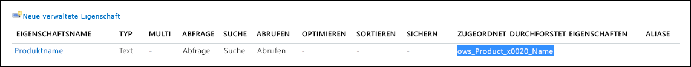</td>
</tr>
<tr class="odd">
<td>EventDateTimeeventDateTime</td>
<td>Dieser Parameter definiert das Datum, an dem das Ereignis eintritt.This parameter defines the date the event occurs. Verwenden Sie das aktuelle Datumsformat: <strong>formatDateTime(utcNow(),'yyyy-MM-dd'<strong>)</strong>Use the current date format: <strong>formatDateTime(utcNow(),'yyyy-MM-dd'<strong>)</strong></td>
</tr>
</tbody>
</table>

### ZusammenfassungPutting it all together

Nachdem die Aufbewahrungsbezeichnung erstellt und automatisch angewendet wurde und der Ablauf konfiguriert und erstellt wurde, geschieht Folgendes, wenn der Wert in der Spalte **In Produktion** für das Produkt "Spinning Widget" in der Liste "Produkte" von **Ja** in **Nein** geändert wird.Now that the retention label is created and auto-applied and the flow is configured and created, here's what happens when the value in the **In Production** column for the Spinning Widget product in the Products list is changed from **Yes** to **No**. Der Flow wird ausgelöst und das Ereignis erstellt.The flow is triggered and creates the event. Um dieses Ereignis im Security & Compliance Center anzuzeigen, wechseln Sie zu **Records management** > **Events**.To see this event in the security and compliance center, go to **Records management** > **Events**.

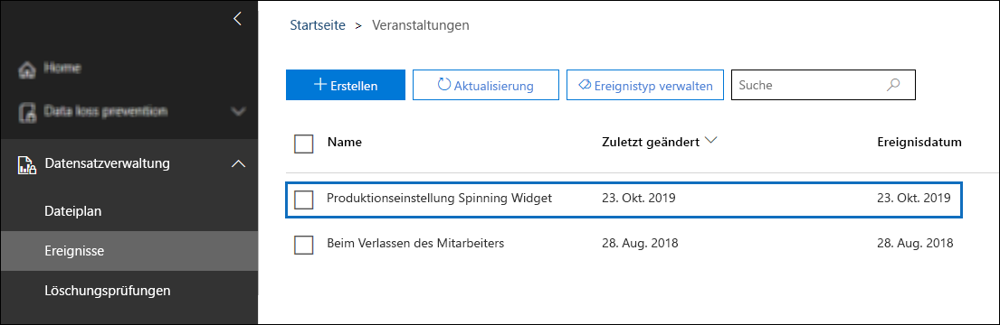

Wählen Sie das Ereignis aus, um die Details auf der Flyout-Seite anzuzeigen.Select the event to view the details on the flyout page. Beachten Sie, dass trotz der Erstellung des Ereignisses die Details im Ereignisstatus anzeigen, dass keine SharePoint-Websites oder -Dokumente verarbeitet wurden.Notice that even though the event is created, the details in the event status show that no SharePoint sites or documents have been processed.

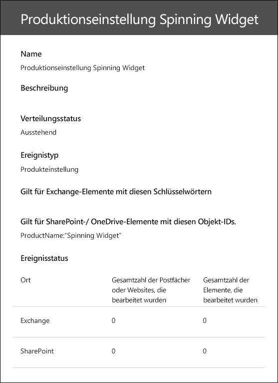

Der Abschnitt zum Ereignisstatus zeigt jedoch nach einiger Zeit, dass eine SharePoint-Site und ein SharePoint-Dokument verarbeitet wurden.But after some time, the event status section shows that for a SharePoint site and a SharePoint document have been processed.  

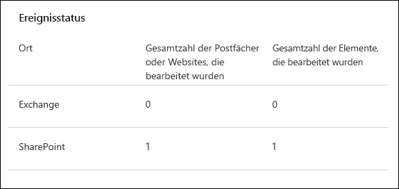
 
Dies bedeutet, dass der Aufbewahrungszeitraum für die Bezeichnung, die auf das Spinning Widget-Produktdokument angewendet wird, basierend auf dem Ereignisdatum des Ereignisses "Produktionseinstellung Spinning Widget", initiiert wurde.This means the retention period for the label applied to the Spinning Widget product document has been initiated, based on the event date of the Cessation Production Spinning Widget event. Angenommen, Sie haben das Szenario in Ihrer Testumgebung implementiert, indem Sie einen Aufbewahrungszeitraum von 1 Tag konfiguriert haben: Sie können nun einige Tage nach dem Erstellen des Ereignisses die Dokumentbibliothek für Ihre Produktdokumente aufrufen und überprüfen, ob das Dokument gelöscht wurde (nachdem der Löschauftrag in SharePoint ausgeführt wurde).Assuming you implemented the scenario in your test environment by configuring a one-day retention period, you can go to the document library for your product documents a few days after the event was created and verify that the document is deleted (after the deletion job in SharePoint has run).

### Mehr über Objekt-IDsMore about Asset Ids

Wie in der [Übersicht über die ereignisgesteuerte Aufbewahrung](event-driven-retention.md) erläutert, ist es wichtig, die Beziehung zwischen Ereignistypen, Bezeichnungen, Ereignissen und Objekt-IDs zu verstehen.As explained in the [overview of event-driven retention](event-driven-retention.md), it's important to understand the relationship between event types, labels, events, and asset Ids. Die Objekt-ID ist einfach eine weitere Dokumenteigenschaft in SharePoint und OneDrive.The Asset Id is simply another document property in SharePoint and OneDrive. Auf diese Weise können Sie die Dokumente identifizieren, deren Aufbewahrungszeitraum durch das Ereignis ausgelöst wird.It helps you to further identify the documents whose retention period will be triggered by the event. Standardmäßig verfügt SharePoint über eine Objekt-ID-Eigenschaft, die Sie für die ereignisgesteuerte Aufbewahrung verwenden können:By default, SharePoint has an Asset Id property that you can use for event-driven retention:

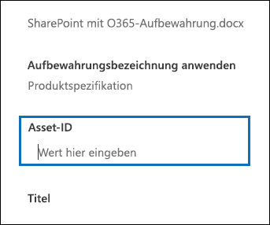

Wie im folgenden Screenshot gezeigt, heißt die verwaltete Eigenschaft Objekt-ID **ComplianceAssetId**.As shown in the following screenshot, the Asset Id managed property is called **ComplianceAssetId**.

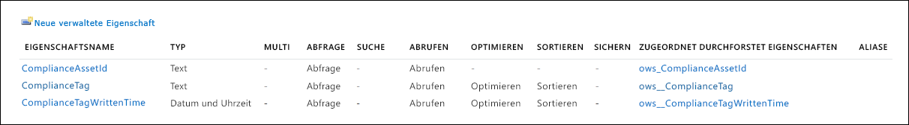

Anstatt die standardmäßige Objekt-ID-Eigenschaft zu verwenden, können Sie auch eine andere Eigenschaft verwenden, wie wir es in diesem Szenario tun.Instead of using the default Asset Id property, you can also use any other property, as we do in this scenario. Es ist jedoch wichtig zu verstehen, dass der Aufbewahrungszeitraum für alle Inhalte mit einer Bezeichnung dieses Ereignistyps durch das Ereignis ausgelöst wird, wenn Sie keine Objekt-ID oder Schlüsselwörter für ein Ereignis angeben.It's important to understand that if you don't specify an asset ID or keywords for an event, all of the content with a label of that event type will have its retention period triggered by the event. This means that in the diagram above, all of the content would start being retained. This may not be what you intend.

### Verwenden der erweiterten Suche in SharePointUsing advanced search in SharePoint

Im vorherigen Screenshot sehen Sie auch, dass es eine andere verwaltete Eigenschaft gibt, die sich auf Aufbewahrungsbezeichnungen bezieht, die als **ComplianceTag** bezeichnet wird, und dass sie einer durchforsteten Eigenschaft zugeordnet ist.In the previous screenshot, we can also see that there's another managed property related to retention labels called **ComplianceTag** and that it's mapped to a crawled property. Die verwaltete Eigenschaft **ComplianceAssetId** wird auch einer durchforsteten Eigenschaft zugeordnet.The **ComplianceAssetId** managed property is also mapped to a crawled property. Dies bedeutet, dass Sie diese verwalteten Eigenschaften in der erweiterten Suche verwenden können, um alle Dokumente abzurufen, die mit einer Aufbewahrungsbezeichnung versehen wurden.This means you can use these managed properties in advanced search to retrieve all documents that have been tagged with a retention label.

## ZusammenfassungSummary

In diesem Artikel wurde ein Dokumentverwaltungsszenario veranschaulicht, in dem automatisch eine Aufbewahrungbezeichnung basierend auf einer Sitespalte in SharePoint angewendet wurde.This article illustrated a document management scenario where we automatically applied a retention label based on a site column in SharePoint. Anschließend haben wir die ereignisbasierte Aufbewahrung und Microsoft Flow verwendet, um den Beginn des Aufbewahrungszeitraums basierend auf einem externen Ereignis automatisch auszulösen.Then we used event-based retention and Microsoft Flow to automatically trigger the start of the retention period based on an external event.

## MitwirkendeCredits

Dieses Szenario wurde verfasst von:This scenario was authored by:

Frederic LapierreFrederic Lapierre Hauptberater, Microsoft ServicesCraig Schwandt, Principal Consultant, Microsoft Consulting Services
