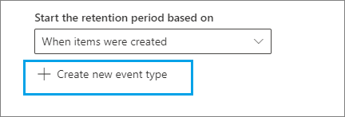

# <a name="use-retention-labels-to-manage-the-lifecycle-of-documents-stored-in-sharepoint"></a><span data-ttu-id="b2550-103">Verwenden von Aufbewahrungsbezeichnungen zur Verwaltung des Lebenszyklus von in SharePoint gespeicherten Dokumenten</span><span class="sxs-lookup"><span data-stu-id="b2550-103">Use retention labels to manage the lifecycle of documents stored in SharePoint</span></span>

><span data-ttu-id="b2550-104">*[Microsoft 365-Lizenzierungsleitfaden für Sicherheit und Compliance](/office365/servicedescriptions/microsoft-365-service-descriptions/microsoft-365-tenantlevel-services-licensing-guidance/microsoft-365-security-compliance-licensing-guidance).*</span><span class="sxs-lookup"><span data-stu-id="b2550-104">*[Microsoft 365 licensing guidance for security & compliance](/office365/servicedescriptions/microsoft-365-service-descriptions/microsoft-365-tenantlevel-services-licensing-guidance/microsoft-365-security-compliance-licensing-guidance).*</span></span>

<span data-ttu-id="b2550-105">In diesem Artikel erfahren Sie, wie Sie den Lebenszyklus von in SharePoint gespeicherten Dokumenten mithilfe von automatisch angewendeten Aufbewahrungsbezeichnungen und ereignisbasierter Aufbewahrung verwalten.</span><span class="sxs-lookup"><span data-stu-id="b2550-105">This article describes how you can manage the lifecycle of documents that are stored in SharePoint by using automatically applied retention labels and event-based retention.</span></span>

<span data-ttu-id="b2550-106">Die automatisch angewendete Funktion verwendet SharePoint-Metadaten für die Dokumentklassifizierung.</span><span class="sxs-lookup"><span data-stu-id="b2550-106">The auto-apply functionality uses SharePoint metadata for document classification.</span></span> <span data-ttu-id="b2550-107">Das in diesem Artikel beschriebene Beispiel gilt für produktbezogene Dokumente, für andere Szenarios können jedoch dieselben Konzepte verwendet werden.</span><span class="sxs-lookup"><span data-stu-id="b2550-107">The example in this article is for product-related documents, but the same concepts can be used for other scenarios.</span></span> <span data-ttu-id="b2550-108">In der Öl- und Gasindustrie könnte es beispielsweise dazu dienen, den Lebenszyklus von Dokumenten über physische Vermögenswerte, wie etwa Ölplattformen, Bohrlochprotokolle oder Produktionslizenzen, zu verwalten.</span><span class="sxs-lookup"><span data-stu-id="b2550-108">For example, in the oil and gas industry, you could use it to manage the lifecycle of documents about physical assets such as oil platforms, well logs, or production licenses.</span></span> <span data-ttu-id="b2550-109">In der Finanzdienstleistungsbranche könnten Sie Dokumente verwalten, die sich auf Bankkonten, Hypotheken oder Versicherungsverträge beziehen.</span><span class="sxs-lookup"><span data-stu-id="b2550-109">In the financial services industry, you could manage bank account, mortgage, or insurance contract documents.</span></span> <span data-ttu-id="b2550-110">Im öffentlichen Sektor könnten Sie Baugenehmigungen oder Steuerformulare verwalten.</span><span class="sxs-lookup"><span data-stu-id="b2550-110">In the public sector, you could manage construction permits or tax forms.</span></span>

<span data-ttu-id="b2550-111">Wir werden uns in diesem Artikel die Informationsarchitektur und Definition der Aufbewahrungsbezeichnungen ansehen.</span><span class="sxs-lookup"><span data-stu-id="b2550-111">In this article, we'll look at the information architecture and definition of the retention labels.</span></span> <span data-ttu-id="b2550-112">Anschließend klassifizieren wir Dokumente, indem die Bezeichnungen automatisch angewendet werden.</span><span class="sxs-lookup"><span data-stu-id="b2550-112">Then we'll classify documents by auto-applying the labels.</span></span> <span data-ttu-id="b2550-113">Und schließlich werden die Ereignisse generiert, die den Aufbewahrungszeitraum initiieren.</span><span class="sxs-lookup"><span data-stu-id="b2550-113">And finally we'll generate the events that initiate the retention period.</span></span>

## <a name="information-architecture"></a><span data-ttu-id="b2550-114">Informationsarchitektur</span><span class="sxs-lookup"><span data-stu-id="b2550-114">Information architecture</span></span>

<span data-ttu-id="b2550-115">Unser Szenario für diesen Artikel stellt ein Produktionsunternehmen dar, das SharePoint verwendet, um alle Dokumente zu den von dem Unternehmen entwickelten Produkten zu speichern.</span><span class="sxs-lookup"><span data-stu-id="b2550-115">Our scenario is a manufacturing company that uses SharePoint to store all the documents about the products that the company develops.</span></span> <span data-ttu-id="b2550-116">Diese Dokumente enthalten Produktspezifikationen, Verträge mit Lieferanten und Benutzerhandbücher.</span><span class="sxs-lookup"><span data-stu-id="b2550-116">These documents include product specifications, agreements with suppliers, and user manuals.</span></span> <span data-ttu-id="b2550-117">Beim Speichern dieser Dokumente in SharePoint als Teil der Enterprise Content Management-Richtlinien, werden Dokumentmetadaten definiert, die zur Klassifizierung verwendet werden.</span><span class="sxs-lookup"><span data-stu-id="b2550-117">When these documents are stored in SharePoint through Enterprise Content Management policies, document metadata is defined, which is used to classify them.</span></span> <span data-ttu-id="b2550-118">Jedes Dokument verfügt über die folgenden Metadateneigenschaften:</span><span class="sxs-lookup"><span data-stu-id="b2550-118">Each document has the following metadata properties:</span></span>

- <span data-ttu-id="b2550-119">**Dokumenttyp** (wie Produktspezifikation, Vertrag oder Benutzerhandbuch)</span><span class="sxs-lookup"><span data-stu-id="b2550-119">**Doc Type** (such as product specification, agreement, or user manual)</span></span>

- <span data-ttu-id="b2550-120">**Produktname**</span><span class="sxs-lookup"><span data-stu-id="b2550-120">**Product Name**</span></span>

- <span data-ttu-id="b2550-121">**Status** (Entwurf oder endgültig)</span><span class="sxs-lookup"><span data-stu-id="b2550-121">**Status** (draft or final)</span></span>

<span data-ttu-id="b2550-122">Diese Metadaten bilden einen Basisinhaltstyp namens *Produktionsdokument* für alle Dokumente.</span><span class="sxs-lookup"><span data-stu-id="b2550-122">This metadata forms a base content type called *Production Document* for all the documents.</span></span>


> [!NOTE]
> <span data-ttu-id="b2550-124">Die Eigenschaften **Dokumententyp** und **Status** werden später in diesem Szenario von Aufbewahrungsrichtlinien verwendet, um Aufbewahrungsbezeichnungen zu klassifizieren und automatisch anzuwenden.</span><span class="sxs-lookup"><span data-stu-id="b2550-124">The **Doc Type** and **Status** properties are used by retention policies later in this scenario to classify and auto-apply retention labels.</span></span>

<span data-ttu-id="b2550-125">Es können möglicherweise mehrere Inhaltstypen vorhanden sein, die verschiedene Dokumenttypen darstellen. Wir konzentrieren uns jedoch auf die Produktdokumentation.</span><span class="sxs-lookup"><span data-stu-id="b2550-125">We might have several content types that represent different types of documents, but let's focus on the product documentation.</span></span>

<span data-ttu-id="b2550-126">In diesem Szenario erstellen wir mithilfe des Managed Metadata Service und des Terminologiespeichers einen Terminologiesatz für *Dokumenttyp* und einen weiteren für *Produktname*.</span><span class="sxs-lookup"><span data-stu-id="b2550-126">In this scenario, we use the Managed Metadata service and the Term Store to create a term set for *Doc Type* and another one for *Product Name*.</span></span> <span data-ttu-id="b2550-127">Für jeden Ausdruckssatz erstellen wir einen Ausdruck für jeden Wert.</span><span class="sxs-lookup"><span data-stu-id="b2550-127">For each term set, we create a term for each value.</span></span> <span data-ttu-id="b2550-128">Im Terminologiespeicher sieht es für Ihre SharePoint-Organisation ungefähr so aus:</span><span class="sxs-lookup"><span data-stu-id="b2550-128">It would look like something like this in Term Store for your SharePoint organization:</span></span>


<span data-ttu-id="b2550-130">Der *Inhaltstyp* kann mit dem [Inhaltstyphub](https://support.office.com/article/manage-content-type-publishing-06f39ac0-5576-4b68-abbc-82b68334889b) erstellt und veröffentlicht werden.</span><span class="sxs-lookup"><span data-stu-id="b2550-130">*Content Type* can be created and published by using the [Content Type Hub](https://support.office.com/article/manage-content-type-publishing-06f39ac0-5576-4b68-abbc-82b68334889b).</span></span> <span data-ttu-id="b2550-131">Sie können auch einen Inhaltstyp mit Site-Bereitstellungstools wie dem [PnP-Bereitstellungsframework](/sharepoint/dev/solution-guidance/pnp-provisioning-framework) oder dem [Site-Design-JSON-Schema](/sharepoint/dev/declarative-customization/site-design-json-schema#define-a-new-content-type) erstellen und veröffentlichen.</span><span class="sxs-lookup"><span data-stu-id="b2550-131">You can also create and publish a content type by using site provisioning tools, such as the [PnP provisioning framework](/sharepoint/dev/solution-guidance/pnp-provisioning-framework) or [site design JSON schema](/sharepoint/dev/declarative-customization/site-design-json-schema#define-a-new-content-type).</span></span>

<span data-ttu-id="b2550-p106">Jedes Produkt verfügt über eine dedizierte SharePoint-Website, die eine Dokumentbibliothek enthält, für die die richtigen Inhaltstypen aktiviert sind. Alle Dokumente werden in dieser Dokumentbibliothek gespeichert.</span><span class="sxs-lookup"><span data-stu-id="b2550-p106">Each product has a dedicated SharePoint site that contains one document library that has the right content types enabled. All documents are stored in this document library.</span></span>

<span data-ttu-id="b2550-134">[  ](../media/SPRetention3.png#lightbox)</span><span class="sxs-lookup"><span data-stu-id="b2550-134">[  ](../media/SPRetention3.png#lightbox)</span></span>

> [!NOTE]
> <span data-ttu-id="b2550-135">Anstatt eine SharePoint-Website pro Produkt zu haben, könnte das produzierende Unternehmen in diesem Szenario ein Microsoft-Team pro Produkt verwenden, um die Zusammenarbeit mit Mitgliedern des Teams zu unterstützen, z. B. durch durchgehenden Chat, und die Registerkarte **Dateien** in Teams für die Dokumentverwaltung zu verwenden.</span><span class="sxs-lookup"><span data-stu-id="b2550-135">Instead of having a SharePoint site per product, the manufacturing company in this scenario could use a Microsoft Team per product to support collaboration among members of the team, such as through persistent chat, and use the **Files** tab in Teams for document management.</span></span> <span data-ttu-id="b2550-136">In diesem Artikel konzentrieren wir uns nur auf Dokumente, daher verwenden wir nur eine Website.</span><span class="sxs-lookup"><span data-stu-id="b2550-136">In this article we only focus on documents, so, we'll only use a site.</span></span>

<span data-ttu-id="b2550-137">Hier ist eine Ansicht der Dokumentbibliothek für das Spinning Widget-Produkt:</span><span class="sxs-lookup"><span data-stu-id="b2550-137">Here's a view of the document library for the Spinning Widget product:</span></span>

<span data-ttu-id="b2550-138">[  ](../media/SPRetention4.png#lightbox)</span><span class="sxs-lookup"><span data-stu-id="b2550-138">[  ](../media/SPRetention4.png#lightbox)</span></span>

<span data-ttu-id="b2550-139">Nachdem wir die grundlegende Informationsarchitektur für das Dokumentenmanagement eingerichtet haben, schauen wir uns die Aufbewahrungs- und Entsorgungsstrategie für die Dokumente an, die die Metadaten von Dokumenten verwenden, und wie wir diese Dokumente klassifizieren können.</span><span class="sxs-lookup"><span data-stu-id="b2550-139">Now that we have the basic information architecture in place for document management, let's look at the retention and disposal strategy for the documents that use the metadata and how we classify those documents.</span></span>

## <a name="retention-and-disposition"></a><span data-ttu-id="b2550-140">Aufbewahrung und Disposition</span><span class="sxs-lookup"><span data-stu-id="b2550-140">Retention and disposition</span></span>

<span data-ttu-id="b2550-141">Die Compliance- und Data Governance-Richtlinien des Herstellers bestimmen, wie Daten aufbewahrt und entsorgt werden.</span><span class="sxs-lookup"><span data-stu-id="b2550-141">The manufacturing company's compliance and data governance policies dictate how data is preserved and disposed of.</span></span> <span data-ttu-id="b2550-142">Produktbezogene Dokumente müssen so lange aufbewahrt werden, wie das Produkt hergestellt wird und für einen bestimmten zusätzlichen Zeitraum.</span><span class="sxs-lookup"><span data-stu-id="b2550-142">Product-related documents must be kept for as long as the product is manufactured and for a certain additional period.</span></span> <span data-ttu-id="b2550-143">Dieser zusätzliche Zeitraum ist für Produktspezifikationen, Verträge und Benutzerhandbücher unterschiedlich.</span><span class="sxs-lookup"><span data-stu-id="b2550-143">The additional period differs for product specifications, agreements, and user manuals.</span></span> <span data-ttu-id="b2550-144">In der folgenden Tabelle sind die Aufbewahrungs- und Entsorgungsanforderungen aufgeführt:</span><span class="sxs-lookup"><span data-stu-id="b2550-144">The following table indicates the retention and disposition requirements:</span></span>

|   <span data-ttu-id="b2550-145">Dokumenttyp</span><span class="sxs-lookup"><span data-stu-id="b2550-145">Document type</span></span>            |   <span data-ttu-id="b2550-146">Aufbewahrung</span><span class="sxs-lookup"><span data-stu-id="b2550-146">Retention</span></span>                            |   <span data-ttu-id="b2550-147">Disposition</span><span class="sxs-lookup"><span data-stu-id="b2550-147">Disposition</span></span>                                |
| -------------------------- | -------------------------------------- | -------------------------------------------- |
| <span data-ttu-id="b2550-148">Produktspezifikationen</span><span class="sxs-lookup"><span data-stu-id="b2550-148">Product specifications</span></span>      | <span data-ttu-id="b2550-149">5 Jahre nach Produktionsstopp</span><span class="sxs-lookup"><span data-stu-id="b2550-149">5 years after production stops</span></span>  | <span data-ttu-id="b2550-150">Löschen</span><span class="sxs-lookup"><span data-stu-id="b2550-150">Delete</span></span>                                       |
| <span data-ttu-id="b2550-151">Produktvereinbarungen</span><span class="sxs-lookup"><span data-stu-id="b2550-151">Product agreements</span></span>          | <span data-ttu-id="b2550-152">10 Jahre nach Produktionsstopp</span><span class="sxs-lookup"><span data-stu-id="b2550-152">10 years after production stops</span></span> | <span data-ttu-id="b2550-153">Überprüfung</span><span class="sxs-lookup"><span data-stu-id="b2550-153">Review</span></span>                                       |
| <span data-ttu-id="b2550-154">Benutzerhandbücher</span><span class="sxs-lookup"><span data-stu-id="b2550-154">User manuals</span></span>                | <span data-ttu-id="b2550-155">5 Jahre nach Produktionsstopp</span><span class="sxs-lookup"><span data-stu-id="b2550-155">5 years after production stops</span></span>  | <span data-ttu-id="b2550-156">Löschen</span><span class="sxs-lookup"><span data-stu-id="b2550-156">Delete</span></span>                                       |
| <span data-ttu-id="b2550-157">Alle anderen Dokumenttypen</span><span class="sxs-lookup"><span data-stu-id="b2550-157">All other types of documents</span></span> | <span data-ttu-id="b2550-158">Nicht aktiv aufbewahren</span><span class="sxs-lookup"><span data-stu-id="b2550-158">Don't actively retain</span></span>  | <span data-ttu-id="b2550-159">Löschen, wenn Dokument älter als 3 Jahre ist</span><span class="sxs-lookup"><span data-stu-id="b2550-159">Delete when document is older than 3 years</span></span> <br /><br /> <span data-ttu-id="b2550-160">Ein Dokument gilt als älter als 3 Jahre, wenn es in den letzten 3 Jahren nicht geändert wurde.</span><span class="sxs-lookup"><span data-stu-id="b2550-160">A document is considered older than 3 years if it hasn't been modified within the last 3 years.</span></span> |
|||

<span data-ttu-id="b2550-161">Wir nutzen das Microsoft 365 Compliance-Center, um die folgenden [Aufbewahrungsbezeichnungen](retention.md#retention-labels) zu erstellen:</span><span class="sxs-lookup"><span data-stu-id="b2550-161">We use the Microsoft 365 compliance center to create the following [retention labels](retention.md#retention-labels):</span></span>

  - <span data-ttu-id="b2550-162">Produktspezifikation</span><span class="sxs-lookup"><span data-stu-id="b2550-162">Product Specification</span></span>

  - <span data-ttu-id="b2550-163">Produktvertrag</span><span class="sxs-lookup"><span data-stu-id="b2550-163">Product Agreement</span></span>

  - <span data-ttu-id="b2550-164">Benutzerhandbuch</span><span class="sxs-lookup"><span data-stu-id="b2550-164">User Manual</span></span>

<span data-ttu-id="b2550-165">In diesem Artikel wird nur gezeigt, wie die Aufbewahrungsbezeichnung der Produktspezifikation erstellt und automatisch angewendet wird.</span><span class="sxs-lookup"><span data-stu-id="b2550-165">In this article, we only show how to create and auto-apply the Product Specification retention label.</span></span> <span data-ttu-id="b2550-166">Um das vollständige Szenario zu implementieren, erstellen Sie zudem Aufbewahrungsbezeichnungen für die beiden anderen Dokumenttypen und wenden sie diese automatisch an.</span><span class="sxs-lookup"><span data-stu-id="b2550-166">To implement the complete scenario, you would also create and auto-apply retention labels for the other two document types.</span></span>

### <a name="settings-for-the-product-specification-retention-label"></a><span data-ttu-id="b2550-167">Einstellungen für die Aufbewahrungsbezeichnung der Produktspezifikation</span><span class="sxs-lookup"><span data-stu-id="b2550-167">Settings for the Product Specification retention label</span></span>

<span data-ttu-id="b2550-168">Hier ist der [Aktenplan](file-plan-manager.md) für die Aufbewahrungsbezeichnung der Produktspezifikation:</span><span class="sxs-lookup"><span data-stu-id="b2550-168">Here's the [file plan](file-plan-manager.md) for the Product Specification retention label:</span></span>

- <span data-ttu-id="b2550-169">**Name:** Produktspezifikation</span><span class="sxs-lookup"><span data-stu-id="b2550-169">**Name:** Product Specification</span></span>

- <span data-ttu-id="b2550-170">**Beschreibung für Benutzer:** für 5 Jahre nach Produktionsstopp aufbewahren.</span><span class="sxs-lookup"><span data-stu-id="b2550-170">**Description for users:** Retain for 5 years after production stops.</span></span>

- <span data-ttu-id="b2550-171">**Beschreibung für Administratoren:** 5 Jahre nach Einstellung der Produktion aufbewahren, automatische Löschung, ereignisbasierte Aufbewahrung, Ereignistyp ist *Einstellung des Produkts*.</span><span class="sxs-lookup"><span data-stu-id="b2550-171">**Description for admins:** Retain for 5 years after production stops, auto delete, event-based retention, event type is *Product Cessation*.</span></span>

- <span data-ttu-id="b2550-172">**Aufbewahrungsaktion:** Aufbewahren und löschen.</span><span class="sxs-lookup"><span data-stu-id="b2550-172">**Retention action:** Retain and delete.</span></span>

- <span data-ttu-id="b2550-173">**Aufbewahrungsdauer:** 5 Jahre (1.825 Tage).</span><span class="sxs-lookup"><span data-stu-id="b2550-173">**Retention duration:** 5 years (1,825 days).</span></span>

- <span data-ttu-id="b2550-174">**Datensatzbezeichnung**: Konfigurieren Sie die Aufbewahrungsbezeichnung so, dass Elemente als [Datensatz](records-management.md#records) gekennzeichnet werden. Das bedeutet, dass die mit der Bezeichnung versehenen Dokumente dann nicht mehr von Benutzern geändert oder gelöscht werden können.</span><span class="sxs-lookup"><span data-stu-id="b2550-174">**Record label**: Configure the retention label to mark items as a [record](records-management.md#records), which means the labeled documents can't then be modified or deleted by users.</span></span>

- <span data-ttu-id="b2550-175">**Dateiplandeskriptoren:** Zur Vereinfachung des Szenarios werden keine optionalen Dateideskriptoren bereitgestellt.</span><span class="sxs-lookup"><span data-stu-id="b2550-175">**File plan descriptors:** For simplifying the scenario, no optional file descriptors are provided.</span></span>

<span data-ttu-id="b2550-176">Der folgende Screenshot zeigt die Einstellungen, wenn Sie die Aufbewahrungsbezeichnung der Produktspezifikation im Microsoft 365 Compliance-Center erstellen.</span><span class="sxs-lookup"><span data-stu-id="b2550-176">The following screenshot shows the settings when you create the Product Specification retention label in the Microsoft 365 compliance center.</span></span> <span data-ttu-id="b2550-177">Sie können den Ereignistyp der *Einstellung des Produkts* erstellen, wenn Sie die Aufbewahrungsbezeichnung erstellen.</span><span class="sxs-lookup"><span data-stu-id="b2550-177">You can create the *Product Cessation* event type when you create the retention label.</span></span> <span data-ttu-id="b2550-178">Informationen hierzu finden Sie in dem im folgenden Abschnitt dargestellten Verfahren.</span><span class="sxs-lookup"><span data-stu-id="b2550-178">See the procedure in the following section.</span></span>


> [!NOTE]
> <span data-ttu-id="b2550-180">Um eine 5-jährige Wartezeit für das Löschen von Dokumenten zu vermeiden, legen Sie die Aufbewahrungsdauer auf ***1 Tag*** fest, wenn Sie dieses Szenario in einer Testumgebung neu erstellen.</span><span class="sxs-lookup"><span data-stu-id="b2550-180">To avoid a 5-year wait for document deletion, set the retention duration to ***1 day*** if you're recreating this scenario in a test environment.</span></span>

### <a name="create-an-event-type-when-you-create-a-retention-label"></a><span data-ttu-id="b2550-181">Erstellen Sie einen Ereignistyp, wenn Sie eine Aufbewahrungsbezeichnung erstellen</span><span class="sxs-lookup"><span data-stu-id="b2550-181">Create an event type when you create a retention label</span></span>

1. <span data-ttu-id="b2550-182">Wählen Sie auf der Seite **Aufbewahrungseinstellungen definieren** des Assistenten zum Erstellen von Aufbewahrungsbezeichnungen nach **Aufbewahrungszeitraum starten basierend auf** die Option **Neuen Ereignistyp erstellen** aus:</span><span class="sxs-lookup"><span data-stu-id="b2550-182">On the **Define retention settings** page of the Create retention label wizard, after **Start the retention period based on**, select **Create new event type**:</span></span>

    

3. <span data-ttu-id="b2550-184">Geben Sie auf der Seite **Ereignistyp benennen** den Namen für den Ereignistyp **Produkteinstellung** und eine optionale Beschreibung ein.</span><span class="sxs-lookup"><span data-stu-id="b2550-184">On the **Name your event type** page, enter **Product Cessation** and an optional description.</span></span> <span data-ttu-id="b2550-185">Wählen Sie dann **Weiter**, **Senden** und **Fertig** aus.</span><span class="sxs-lookup"><span data-stu-id="b2550-185">Then select **Next**, **Submit**, and **Done**.</span></span>

4. <span data-ttu-id="b2550-186">Zurück auf der Seite **Aufbewahrungseinstellungen definieren** wählen Sie aus der Dropdownliste für **Aufbewahrungszeitraum starten basierend auf** den erstellten Ereignistyp **Produkteinstellung** aus.</span><span class="sxs-lookup"><span data-stu-id="b2550-186">Back on the **Define retention settings** page, for **Start the retention period based on**, use the dropdown box to select the **Product Cessation** event type that you created.</span></span>

    <span data-ttu-id="b2550-187">So sehen die Einstellungen für die Aufbewahrungsbezeichnung der Produktspezifikation aus:</span><span class="sxs-lookup"><span data-stu-id="b2550-187">Here's what the settings look like for the Product Specification retention label:</span></span>

   

6. <span data-ttu-id="b2550-189">Wählen Sie **Bezeichnung erstellen** aus. Wenn die Optionen zum Veröffentlichen der Bezeichnung auf der nächsten Seite angezeigt werden, können Sie die Bezeichnung entweder automatisch anwenden oder einfach nur speichern: Wählen Sie **Bezeichnung vorerst nur speichern** und dann **Fertig** aus.</span><span class="sxs-lookup"><span data-stu-id="b2550-189">Select **Create label**, and on the next page when you see the options to publish the label, auto-apply the label, or just save the label: Select **Just save the label for now**, and then select **Done**.</span></span>

    > [!TIP]
    > <span data-ttu-id="b2550-190">Ausführlichere Schritte finden Sie unter[Erstellen einer Bezeichnung, deren Aufbewahrungsdauer auf einem Ereignis basiert](event-driven-retention.md#step-1-create-a-label-whose-retention-period-is-based-on-an-event).</span><span class="sxs-lookup"><span data-stu-id="b2550-190">For more detailed steps, see [Create a label whose retention period is based on an event](event-driven-retention.md#step-1-create-a-label-whose-retention-period-is-based-on-an-event).</span></span>

<span data-ttu-id="b2550-191">Nun wird gezeigt, wie die Aufbewahrungsbezeichnung automatisch auf den Inhalt der Produktspezifikation angewendet wird.</span><span class="sxs-lookup"><span data-stu-id="b2550-191">Now let's look at how we'll auto-apply the retention label to product-specification content.</span></span>

## <a name="auto-apply-retention-labels-to-documents"></a><span data-ttu-id="b2550-192">Automatisch auf Dokumente angewendete Aufbewahrungsbezeichnungen</span><span class="sxs-lookup"><span data-stu-id="b2550-192">Auto-apply retention labels to documents</span></span>

<span data-ttu-id="b2550-193">Wir werden KQL (Keyword Query Language) verwenden, um die Aufbewahrungsbezeichnungen, die wir erstellt haben, [automatisch anzuwenden](apply-retention-labels-automatically.md).</span><span class="sxs-lookup"><span data-stu-id="b2550-193">We're going to use Keyword Query Language (KQL) to [auto-apply](apply-retention-labels-automatically.md) the retention labels that we created.</span></span> <span data-ttu-id="b2550-194">KQL ist die Sprache, die verwendet wird, um Suchanfragen zu erstellen.</span><span class="sxs-lookup"><span data-stu-id="b2550-194">KQL is the language that's used to build search queries.</span></span> <span data-ttu-id="b2550-195">In KQL können Sie mithilfe von Schlüsselwörtern oder verwalteten Eigenschaften suchen.</span><span class="sxs-lookup"><span data-stu-id="b2550-195">In KQL, you can search by using keywords or managed properties.</span></span> <span data-ttu-id="b2550-196">Ausführlichere Informationen finden Sie in der [KQL-Syntaxreferenz (Keyword Query Language)](/sharepoint/dev/general-development/keyword-query-language-kql-syntax-reference).</span><span class="sxs-lookup"><span data-stu-id="b2550-196">For more information, see [Keyword Query Language (KQL) syntax reference](/sharepoint/dev/general-development/keyword-query-language-kql-syntax-reference).</span></span>

<span data-ttu-id="b2550-197">Im Grunde möchten wir Microsoft 365 mitteilen, „die Aufbewahrungsbezeichnung der **Produktspezifikation** auf alle Dokumente anzuwenden, die über den **Status** **Endgültig** verfügen und den **Dokumententypen** **Produktspezifikation** besitzen“.</span><span class="sxs-lookup"><span data-stu-id="b2550-197">Basically, we want to tell Microsoft 365 to "apply the **Product Specification** retention label to all documents that have a **Status** of **Final** and a **Doc Type** of **Product Specification**."</span></span> <span data-ttu-id="b2550-198">Erinnern Sie sich daran, dass **Status** und **Dokumenttyp** die Sitespalten sind, die Sie für den Inhaltstyp "Produktdokumentation" im Abschnitt [Informationsarchitektur](#information-architecture) definiert haben.</span><span class="sxs-lookup"><span data-stu-id="b2550-198">Recall that **Status** and **Doc Type** are the site columns that we defined for the Product Documentation content type in the [Information architecture](#information-architecture) section.</span></span> <span data-ttu-id="b2550-199">Um dies zu tun, müssen wir das Suchschema konfigurieren.</span><span class="sxs-lookup"><span data-stu-id="b2550-199">To do this, we need to configure the search schema.</span></span>

<span data-ttu-id="b2550-200">Wenn SharePoint Inhalte indiziert, werden automatisch gecrawlte Eigenschaften für jede Sitespalte generiert.</span><span class="sxs-lookup"><span data-stu-id="b2550-200">When SharePoint indexes content, it automatically generates crawled properties for each site column.</span></span> <span data-ttu-id="b2550-201">In diesem Szenario interessieren uns die Eigenschaften **Dokumenttyp** und **Status**.</span><span class="sxs-lookup"><span data-stu-id="b2550-201">For this scenario, we're interested in the **Doc Type** and **Status** properties.</span></span> <span data-ttu-id="b2550-202">Wir benötigen Dokumente in der Bibliothek mit dem richtigen Inhaltstyp und ausgefüllten Sitespalten, damit bei der Suche die durchforsteten Eigenschaften erstellt werden können.</span><span class="sxs-lookup"><span data-stu-id="b2550-202">We need documents in the library that are the right content type and have the site columns filled in for search to create the crawled properties.</span></span>

<span data-ttu-id="b2550-203">Öffnen Sie im SharePoint Admin Center die Suchkonfiguration und wählen Sie **Suchschema Verwalten** aus, um die durchforsteten Eigenschaften anzuzeigen und zu konfigurieren.</span><span class="sxs-lookup"><span data-stu-id="b2550-203">In the SharePoint admin center, open the Search configuration, and select **Manage Search Schema** to view and configure the crawled properties.</span></span>


<span data-ttu-id="b2550-205">Wenn wir \* **status** _ in das Feld_ *Crawled properties*\* eingeben und den grünen Pfeil auswählen, sollte ein Ergebnis wie das folgende angezeigt werden:</span><span class="sxs-lookup"><span data-stu-id="b2550-205">If we type ***status** _ in the _ *Crawled properties** box and select the green arrow, we should see a result like this:</span></span>


<span data-ttu-id="b2550-207">Die Eigenschaft **ows\_\_Status** ist diejenige, die uns interessiert (beachten Sie den doppelten Unterstrich).</span><span class="sxs-lookup"><span data-stu-id="b2550-207">The **ows\_\_Status** property (notice the double underscore) is the one that interests us.</span></span> <span data-ttu-id="b2550-208">Sie ist der **Status**-Eigenschaft des Produktionsdokuments-Inhaltstyps zugeordnet.</span><span class="sxs-lookup"><span data-stu-id="b2550-208">It maps to the **Status** property of the Production Document content type.</span></span>

<span data-ttu-id="b2550-209">Wenn wir nun ***ows\_doc*** eingeben und auf den grünen Pfeil klicken, sollten wir so etwas sehen:</span><span class="sxs-lookup"><span data-stu-id="b2550-209">Now, if we type ***ows\_doc*** and select the green arrow, we should see something like this:</span></span>


<span data-ttu-id="b2550-211">Die Eigenschaft **ows\_doc\_x0020\_Type** ist die zweite Eigenschaft, die uns interessiert.</span><span class="sxs-lookup"><span data-stu-id="b2550-211">The **ows\_Doc\_x0020\_Type** property is the second property that interests us.</span></span> <span data-ttu-id="b2550-212">Sie ist der **Dokumenttyp** Eigenschaft des Produktionsdokuments-Inhaltstyps zugeordnet.</span><span class="sxs-lookup"><span data-stu-id="b2550-212">It maps to the **Doc Type** property of the Production Document content type.</span></span>

> [!TIP]
> <span data-ttu-id="b2550-213">Wechseln Sie zu der Dokumentbibliothek, die die Produktionsdokumente enthält, um den Namen einer durchforsteten Eigenschaft für dieses Szenario zu identifizieren.</span><span class="sxs-lookup"><span data-stu-id="b2550-213">To identify the name of a crawled property for this scenario, go to the document library that contains the production documents.</span></span> <span data-ttu-id="b2550-214">Wechseln Sie dann zu den Bibliothekseinstellungen.</span><span class="sxs-lookup"><span data-stu-id="b2550-214">Then go to the library settings.</span></span> <span data-ttu-id="b2550-215">Klicken Sie für die **Spalten** auf den Namen der Spalte (z. B. **Status** oder **Dokumenttyp**), um die Seite mit der Websitespalte zu öffnen.</span><span class="sxs-lookup"><span data-stu-id="b2550-215">For **Columns**, select the name of the column (for example, **Status** or **Doc Type**) to open the site column page.</span></span> <span data-ttu-id="b2550-216">Der Parameter *Feld* in der URL für diese Seite enthält den Namen des Feldes.</span><span class="sxs-lookup"><span data-stu-id="b2550-216">The *Field* parameter in the URL for that page contains the name of the field.</span></span> <span data-ttu-id="b2550-217">Dieser Feldname mit dem Präfix "ows_" ist der Name der gecrawlten Eigenschaft.</span><span class="sxs-lookup"><span data-stu-id="b2550-217">This field name, prefixed with "ows_", is the name of the crawled property.</span></span> <span data-ttu-id="b2550-218">Beispielsweise`https://tenantname.sharepoint.com/sites/SpinningWidget/_layouts/15/FldEdit.aspx?List=%7BC38C2F45-3BD6-4C3B-AA3B-EF5DF6B3D172%7D&Field=_Status` entspricht die URL der gecrawlten Eigenschaft *ows\_\_Status*.</span><span class="sxs-lookup"><span data-stu-id="b2550-218">For example, the URL `https://tenantname.sharepoint.com/sites/SpinningWidget/_layouts/15/FldEdit.aspx?List=%7BC38C2F45-3BD6-4C3B-AA3B-EF5DF6B3D172%7D&Field=_Status` corresponds to the *ows\_\_Status* crawled property.</span></span>

<span data-ttu-id="b2550-219">Wenn die durchforsteten Eigenschaften nicht im Abschnitt „Suchschema Verwalten“ im SharePoint-Verwaltungscenter angezeigt werden:</span><span class="sxs-lookup"><span data-stu-id="b2550-219">If the crawled properties you're looking for don't appear in the Manage Search Schema section in SharePoint admin center:</span></span>

- <span data-ttu-id="b2550-220">Möglicherweise wurden die Dokumente nicht indiziert.</span><span class="sxs-lookup"><span data-stu-id="b2550-220">Maybe the documents haven't been indexed.</span></span> <span data-ttu-id="b2550-221">Sie können eine Neuindexierung der Bibliothek erzwingen, indem Sie zu **Dokumentbibliothekseinstellungen** > **Erweiterte Einstellungen** gehen.</span><span class="sxs-lookup"><span data-stu-id="b2550-221">You can force a reindex of the library by going to **Document library settings** > **Advanced Settings**.</span></span>

- <span data-ttu-id="b2550-222">Wenn sich die Dokumentbibliothek in einer modernen Site befindet, stellen Sie sicher, dass der SharePoint-Administrator auch ein Site Collection Admin ist.</span><span class="sxs-lookup"><span data-stu-id="b2550-222">If the document library is in a modern site, make sure that the SharePoint admin is also a site collection admin.</span></span>

<span data-ttu-id="b2550-223">Weitere Informationen zu gecrawlten und verwalteten Eigenschaften finden Sie unter[ Automatisch erstellte verwaltete Eigenschaften in SharePoint Server](/sharepoint/technical-reference/automatically-created-managed-properties-in-sharepoint).</span><span class="sxs-lookup"><span data-stu-id="b2550-223">For more information about crawled and managed properties, see [Automatically created managed properties in SharePoint Server](/sharepoint/technical-reference/automatically-created-managed-properties-in-sharepoint).</span></span>

### <a name="map-crawled-properties-to-pre-defined-managed-properties"></a><span data-ttu-id="b2550-224">Ordnen Sie gecrawlte Eigenschaften vordefinierten verwalteten Eigenschaften zu</span><span class="sxs-lookup"><span data-stu-id="b2550-224">Map crawled properties to pre-defined managed properties</span></span>

<span data-ttu-id="b2550-225">KQL kann keine gecrawlten Eigenschaften in Suchabfragen verwenden.</span><span class="sxs-lookup"><span data-stu-id="b2550-225">KQL can't use crawled properties in search queries.</span></span> <span data-ttu-id="b2550-226">Es muss eine verwaltete Eigenschaft verwendet werden.</span><span class="sxs-lookup"><span data-stu-id="b2550-226">It has to use a managed property.</span></span> <span data-ttu-id="b2550-227">In einem typischen Suchszenario erstellen wir eine verwaltete Eigenschaft und ordnen sie der gecrawlten Eigenschaft zu, die wir benötigen.</span><span class="sxs-lookup"><span data-stu-id="b2550-227">In a typical search scenario, we create a managed property and map it to the crawled property that we need.</span></span> <span data-ttu-id="b2550-228">Für das automatische Anwenden von Aufbewahrungsbezeichnungen können Sie jedoch nur vordefinierte verwaltete Eigenschaften in KQL und keine benutzerdefinierten verwalteten Eigenschaften angeben.</span><span class="sxs-lookup"><span data-stu-id="b2550-228">However, for auto-applying retention labels, you can only specify pre-defined managed properties in KQL, not custom managed properties.</span></span> <span data-ttu-id="b2550-229">Es gibt eine Reihe vordefinierter verwalteter Eigenschaften im System, damit Sie die Zeichenfolge *RefinableString00* bis *RefinableString199* verwenden können.</span><span class="sxs-lookup"><span data-stu-id="b2550-229">There's a set of predefined managed properties in the system for string *RefinableString00* to *RefinableString199* that you can use.</span></span> <span data-ttu-id="b2550-230">Eine umfassende Liste finden Sie unter [Standardmäßig nicht verwendete verwaltete Eigenschaften](/sharepoint/manage-search-schema#default-unused-managed-properties).</span><span class="sxs-lookup"><span data-stu-id="b2550-230">For a complete list, see [Default unused managed properties](/sharepoint/manage-search-schema#default-unused-managed-properties).</span></span> <span data-ttu-id="b2550-231">Diese standardmäßig verwalteten Eigenschaften werden normalerweise zum Definieren von Sucheinschränkungen verwendet.</span><span class="sxs-lookup"><span data-stu-id="b2550-231">These default managed properties are typically used for defining search refiners.</span></span>

<span data-ttu-id="b2550-232">Damit die KQL-Abfrage die richtige Aufbewahrungsbezeichnung automatisch auf den Inhalt des Produktdokuments anwendet, ordnen wir die gecrawlten Eigenschaften **ows\_Doc\_x0020\_Type* und *ows\_\_Status** zwei anpassbaren verwalteten Eigenschaften zu.</span><span class="sxs-lookup"><span data-stu-id="b2550-232">For the KQL query to automatically apply the correct retention label to product document content, we map the crawled properties **ows\_Doc\_x0020\_Type* and *ows\_\_Status** to two refinable managed properties.</span></span> <span data-ttu-id="b2550-233">In unserer Testumgebung für dieses Szenario werden **RefinableString00** und **RefinableString01** nicht verwendet.</span><span class="sxs-lookup"><span data-stu-id="b2550-233">In our test environment for this scenario, **RefinableString00** and **RefinableString01** aren't being used.</span></span> <span data-ttu-id="b2550-234">Wir haben dies festgelegt, indem wir im SharePoint Admin Center **Verwaltete Eigenschaften** im **Suchschema verwalten** anzeigen.</span><span class="sxs-lookup"><span data-stu-id="b2550-234">We determined this by looking at **Managed Properties** in **Manage Search Schema** in the SharePoint admin center.</span></span>

<span data-ttu-id="b2550-235">[  ](../media/SPRetention12.png#lightbox)</span><span class="sxs-lookup"><span data-stu-id="b2550-235">[  ](../media/SPRetention12.png#lightbox)</span></span>

<span data-ttu-id="b2550-236">Beachten Sie, dass die Spalte **Zugeordnete, durchforstete Eigenschaften** im vorherigen Screenshot leer ist.</span><span class="sxs-lookup"><span data-stu-id="b2550-236">Notice that the **Mapped Crawled Properties** column in the previous screenshot is empty.</span></span>

<span data-ttu-id="b2550-237">Folgen Sie diesen Schritten, um die durchforstete Eigenschaft **ows\_Doc\_x0020\_Type** zuzuordnen:</span><span class="sxs-lookup"><span data-stu-id="b2550-237">To map the **ows\_Doc\_x0020\_Type** crawled property, follow these steps:</span></span>

1. <span data-ttu-id="b2550-238">Geben Sie im Filterfeld **Verwaltete Eigenschaften\*\*\*\*_RefinableString00_** ein, und klicken Sie auf den grünen Pfeil.</span><span class="sxs-lookup"><span data-stu-id="b2550-238">In the **Managed property** filter box, type **_RefinableString00_** and select the green arrow.</span></span>

2. <span data-ttu-id="b2550-239">Klicken Sie in der Ergebnisliste auf den Link **RefinableString00**, und führen Sie dann einen Bildlauf nach unten zum Abschnitt **Zuordnungen zu durchforsteten Eigenschaften**.</span><span class="sxs-lookup"><span data-stu-id="b2550-239">In the results list, select the **RefinableString00** link, and then scroll down to the **Mappings to crawled properties** section.</span></span>

3. <span data-ttu-id="b2550-240">Klicken Sie auf **Zuordnung hinzufügen**, und geben Sie **_ows\_Doc\_x0020\_Type_*_ in das Feld _\* Namen einer durchforsteten Eigenschaft suchen*\* im Fenster **Auswahl für durchforstete Eigenschaft** ein.</span><span class="sxs-lookup"><span data-stu-id="b2550-240">Select **Add a Mapping**, and then type **_ows\_Doc\_x0020\_Type_*_ in the _\* Search for a crawled property name*\* box in the **Crawled property selection** window.</span></span> <span data-ttu-id="b2550-241">Wählen Sie **Suchen** aus.</span><span class="sxs-lookup"><span data-stu-id="b2550-241">Select **Find**.</span></span>

4. <span data-ttu-id="b2550-242">Wählen Sie in der Ergebnisliste **ows\_Doc\_x0020\_Type** aus, und klicken Sie dann auf **OK**.</span><span class="sxs-lookup"><span data-stu-id="b2550-242">In the results list, select **ows\_Doc\_x0020\_Type** and then select **OK**.</span></span>

   <span data-ttu-id="b2550-243">Im Abschnitt **Zugeordnete durchforstete Eigenschaften** sollten Sie so etwas wie diesen Screenshot sehen:</span><span class="sxs-lookup"><span data-stu-id="b2550-243">In the **Mapped Crawled Properties** section, you should see something similar to this screenshot:</span></span>

   <span data-ttu-id="b2550-244">[  ](../media/SPRetention13.png#lightbox)</span><span class="sxs-lookup"><span data-stu-id="b2550-244">[  ](../media/SPRetention13.png#lightbox)</span></span>


5. <span data-ttu-id="b2550-245">Führen Sie einen Bildlauf zum Ende der Seite aus, und klicken Sie auf **OK**, um die Zuordnung zu speichern.</span><span class="sxs-lookup"><span data-stu-id="b2550-245">Scroll to the bottom of the page and select **OK** to save the mapping.</span></span>

<span data-ttu-id="b2550-246">Wiederholen Sie diese Schritte, um **RefinableString01** und **ows\_\_Status** zuzuordnen.</span><span class="sxs-lookup"><span data-stu-id="b2550-246">Repeat these steps to map **RefinableString01** and **ows\_\_Status**.</span></span>

<span data-ttu-id="b2550-247">Jetzt sollten zwei verwaltete Eigenschaften den beiden durchforsteten Eigenschaften zugeordnet sein:</span><span class="sxs-lookup"><span data-stu-id="b2550-247">Now you should have two managed properties mapped to the two crawled properties:</span></span>

<span data-ttu-id="b2550-248">[  ](../media/SPRetention14.png#lightbox)</span><span class="sxs-lookup"><span data-stu-id="b2550-248">[  ](../media/SPRetention14.png#lightbox)</span></span>

<span data-ttu-id="b2550-249">Lassen Sie uns überprüfen, ob alles korrekt eingerichtet ist, indem Sie eine Unternehmenssuche ausführen.</span><span class="sxs-lookup"><span data-stu-id="b2550-249">Let's verify that our setup is correct by running an enterprise search.</span></span> <span data-ttu-id="b2550-250">Gehen Sie in einem Browser auf *https://\<your_tenant>sharepoint.com/search*.</span><span class="sxs-lookup"><span data-stu-id="b2550-250">In a browser, go to *https://\<your_tenant>.sharepoint.com/search*.</span></span> <span data-ttu-id="b2550-251">Geben Sie im Suchfeld \***RefinableString00:"Product Specification"** _ ein, und drücken Sie die Eingabetaste.</span><span class="sxs-lookup"><span data-stu-id="b2550-251">In the search box, type \***RefinableString00:"Product Specification"** _ and press enter.</span></span> <span data-ttu-id="b2550-252">Diese Suche sollte alle Dokumente zurückgeben, die eine *Produktspezifikation*\* der Art **_Dok-Typ_** aufweisen.</span><span class="sxs-lookup"><span data-stu-id="b2550-252">This search should return all documents that have a _ *Product Specification*\* of **_Doc Type_**.</span></span>

<span data-ttu-id="b2550-253">Geben Sie nun im Suchfeld **RefinableString00:"Product Specification" AND RefinableString01:Final** ein und drücken Sie die Eingabetaste.</span><span class="sxs-lookup"><span data-stu-id="b2550-253">Now in the search box, type **RefinableString00:"Product Specification" AND RefinableString01:Final** and press enter.</span></span> <span data-ttu-id="b2550-254">Dies sollte alle Dokumente zurückgeben, welche die **Produktspezifikation** als **_Dok-Typ_*_und den_\* Status*\* als **_Endgültig_** haben.</span><span class="sxs-lookup"><span data-stu-id="b2550-254">This should return all documents that have **Product Specification** of **_Doc Type_*_ and a _\* Status*\* of **_Final_**.</span></span>

### <a name="create-auto-apply-label-policies"></a><span data-ttu-id="b2550-255">Erstellen Sie Bezeichnungsrichtlinien für die automatische Anwendung</span><span class="sxs-lookup"><span data-stu-id="b2550-255">Create auto-apply label policies</span></span>

<span data-ttu-id="b2550-256">Nachdem wir überprüft haben, dass die KQL-Abfrage funktioniert, erstellen wir eine Bezeichnungsrichtlinie für die automatische Anwendung, die eine KQL-Abfrage verwendet, um die Aufbewahrungsbezeichnung „Produktspezifikation“ automatisch auf die entsprechenden Dokumente anzuwenden.</span><span class="sxs-lookup"><span data-stu-id="b2550-256">Now that we've verified that the KQL query is working, let's create an auto-apply label policy that uses a KQL query to automatically apply the Product Specification retention label to the appropriate documents.</span></span>

1. <span data-ttu-id="b2550-257">Wechseln Sie im [Compliance Center](https://compliance.microsoft.com/homepage)zu **Datensatzverwaltung** > **Bezeichnungsrichtlinien** > **Automatisch eine Bezeichnung anwenden**.</span><span class="sxs-lookup"><span data-stu-id="b2550-257">In the [compliance center](https://compliance.microsoft.com/homepage), go to **Records management** > **Label policies** > **Auto-apply a label**.</span></span>

   <span data-ttu-id="b2550-258">[  ](../media/SPRetention16.png#lightbox)</span><span class="sxs-lookup"><span data-stu-id="b2550-258">[  ](../media/SPRetention16.png#lightbox)</span></span>

2. <span data-ttu-id="b2550-259">Geben Sie im Assistenten zum Erstellen einer automatischen Bezeichnungsrichtlinie auf der Seite **Richtlinie für die automatische Bezeichnung benennen** einen Namen wie z. B. **Bezeichnung „Produktspezifikation“ automatisch anwenden** und eine optionale Beschreibung ein.</span><span class="sxs-lookup"><span data-stu-id="b2550-259">In the Create auto-labeling policy wizard, on the **Name your auto-labeling policy** page, enter a name such as **Auto-apply Product Specification label**, and an optional description.</span></span> <span data-ttu-id="b2550-260">Wählen Sie dann **Weiter** aus.</span><span class="sxs-lookup"><span data-stu-id="b2550-260">Then select **Next**.</span></span>

3. <span data-ttu-id="b2550-261">Wählen Sie auf der Seite **Inhaltstyp auswählen, auf den diese Bezeichnung angewendet werden soll**, dann **Bezeichnung auf Inhalt anwenden, der bestimmte Wörter oder Ausdrücke oder Eigenschaften enthält** und schließlich **Weiter** aus.</span><span class="sxs-lookup"><span data-stu-id="b2550-261">On the **Choose the type of content you want to apply this label to** page, select **Apply label to content that contains specific words or phrases, or properties**, and then select **Next**.</span></span>

   <span data-ttu-id="b2550-262">[  ](../media/SPRetention17.png#lightbox)</span><span class="sxs-lookup"><span data-stu-id="b2550-262">[  ](../media/SPRetention17.png#lightbox)</span></span>

   <span data-ttu-id="b2550-263">Mit dieser Option können Sie dieselbe KQL-Suchabfrage bereitstellen, die wir im vorherigen Abschnitt getestet haben.</span><span class="sxs-lookup"><span data-stu-id="b2550-263">This option lets us provide the same KQL search query that we tested in the previous section.</span></span> <span data-ttu-id="b2550-264">Die Abfrage gibt alle Produktspezifikationsdokumente zurück, die den Status *Endgültig* haben.</span><span class="sxs-lookup"><span data-stu-id="b2550-264">The query returns all Product Specification documents that have a status of *Final*.</span></span> <span data-ttu-id="b2550-265">Wenn wir dieselbe Abfrage in der Bezeichnungsrichtlinie für die automatische Anwendung verwenden, wird die Aufbewahrungsbezeichnung der Produktspezifikation automatisch auf alle Dokumente angewendet, die ihr entsprechen.</span><span class="sxs-lookup"><span data-stu-id="b2550-265">When we use this same query in the auto-apply label policy, the Product Specification retention label will be automatically applied to all documents that match it.</span></span>

4. <span data-ttu-id="b2550-266">Geben Sie auf der Seite **Bezeichnungen auf Inhalte anwenden, die dieser Abfrage entsprechen** den Code **RefinableString00:"Product Specification" AND RefinableString01:Final** ein, und klicken Sie dann auf **Weiter**.</span><span class="sxs-lookup"><span data-stu-id="b2550-266">On the **Apply label to content matching this query** page, type **RefinableString00:"Product Specification" AND RefinableString01:Final**, and then select **Next**.</span></span>

   

5. <span data-ttu-id="b2550-268">Wählen Sie auf der Seite **Speicherorte zum Anwenden der Richtlinie auswählen** die Inhaltsspeicherorte aus, auf die Sie die Richtlinie anwenden möchten.</span><span class="sxs-lookup"><span data-stu-id="b2550-268">On the **Choose locations to apply the policy** page, you select the content locations that you want to apply the policy to.</span></span> <span data-ttu-id="b2550-269">In diesem Szenario wenden wir die Richtlinie nur auf SharePoint-Standorte an, da alle Produktionsdokumente in SharePoint-Dokumentbibliotheken gespeichert werden.</span><span class="sxs-lookup"><span data-stu-id="b2550-269">For this scenario, we apply the policy only to SharePoint locations, because all the production documents are stored in SharePoint document libraries.</span></span> <span data-ttu-id="b2550-270">Schalten Sie den Status für **Exchange-E-Mail-**, **OneDrive-Konten** und **Microsoft 365-Gruppen** auf **Aus**.</span><span class="sxs-lookup"><span data-stu-id="b2550-270">Toggle the status for **Exchange email**, **OneDrive accounts**, and **Microsoft 365 Groups** to **Off**.</span></span> <span data-ttu-id="b2550-271">Stellen Sie sicher, dass der Status für SharePoint-Websites auf **Ein** festgelegt ist, bevor Sie **Weiter** auswählen:</span><span class="sxs-lookup"><span data-stu-id="b2550-271">Make sure that the status for SharePoint sites is set to **On** before you select **Next**:</span></span>

    

   > [!TIP]
   > <span data-ttu-id="b2550-273">Anstatt die Richtlinie auf alle SharePoint-Websites anzuwenden, können Sie **Website auswählen** auswählen und die URLs für bestimmte SharePoint-Websites hinzufügen.</span><span class="sxs-lookup"><span data-stu-id="b2550-273">Instead of applying the policy to all SharePoint sites, you can select **Choose site** and add the URLs for specific SharePoint sites.</span></span>

6. <span data-ttu-id="b2550-274">Wählen Sie auf der Seite **Bezeichnung für automatische Anwendung auswählen** die Option **Bezeichnung hinzufügen** aus.</span><span class="sxs-lookup"><span data-stu-id="b2550-274">On the **Choose a label to auto-apply** page, select **Add label**.</span></span>

7. <span data-ttu-id="b2550-275">Wählen Sie aus der Liste der Aufbewahrungsbezeichnungen **Produktspezifikation** aus.</span><span class="sxs-lookup"><span data-stu-id="b2550-275">From the list of retention labels, select **Product Specification**.</span></span> <span data-ttu-id="b2550-276">Wählen Sie dann **Hinzufügen** und **Weiter** aus.</span><span class="sxs-lookup"><span data-stu-id="b2550-276">Then select **Add** and **Next**.</span></span>

8. <span data-ttu-id="b2550-277">Überprüfen Sie Ihre Einstellungen:</span><span class="sxs-lookup"><span data-stu-id="b2550-277">Review your settings:</span></span>

    

9. <span data-ttu-id="b2550-279">Wählen Sie **Senden** aus, um die Bezeichnungsrichtlinie für die automatische Anwendung zu erstellen.</span><span class="sxs-lookup"><span data-stu-id="b2550-279">Select **Submit** to create the auto-apply label policy.</span></span>

   > [!NOTE]
   > <span data-ttu-id="b2550-280">Es dauert bis zu 7 Tage, um die Produktspezifikationsbezeichnung automatisch auf alle Dokumente anzuwenden, die der KQL-Suchabfrage entsprechen.</span><span class="sxs-lookup"><span data-stu-id="b2550-280">It takes up to 7 days to automatically apply the Product Specification label to all documents that match the KQL search query.</span></span>

### <a name="verify-that-the-retention-label-was-automatically-applied"></a><span data-ttu-id="b2550-281">Überprüfen Sie, ob die Aufbewahrungsbezeichnung automatisch angewendet wurde</span><span class="sxs-lookup"><span data-stu-id="b2550-281">Verify that the retention label was automatically applied</span></span>

<span data-ttu-id="b2550-282">Verwenden Sie nach 7 Tagen den [Aktivitäten-Explorer](data-classification-activity-explorer.md) im Compliance Center, um zu überprüfen, ob die erstellte Bezeichnungsrichtlinie für die automatische Anwendung die Aufbewahrungsbezeichnungen automatisch auf die Produktdokumente angewendet hat.</span><span class="sxs-lookup"><span data-stu-id="b2550-282">After 7 days, use [activity explorer](data-classification-activity-explorer.md) in the compliance center to verify that the auto-apply label policy that we created did automatically apply the retention labels to the product documents.</span></span>

<span data-ttu-id="b2550-283">Überprüfen Sie auch die Eigenschaften der Dokumente in der Dokumentbibliothek.</span><span class="sxs-lookup"><span data-stu-id="b2550-283">Also look at the properties of the documents in the Document Library.</span></span> <span data-ttu-id="b2550-284">Im Informationsbereich können Sie sehen, dass die Aufbewahrungsbezeichnung auf ein ausgewähltes Dokument angewendet wird.</span><span class="sxs-lookup"><span data-stu-id="b2550-284">In the information panel, you can see that the retention label is applied to a selected document.</span></span>

<span data-ttu-id="b2550-285">[  ](../media/SPRetention21.png#lightbox)</span><span class="sxs-lookup"><span data-stu-id="b2550-285">[  ](../media/SPRetention21.png#lightbox)</span></span>

<span data-ttu-id="b2550-286">Da die Aufbewahrungsbezeichnungen automatisch auf Dokumente angewendet wurden, sind diese Dokumente vor dem Löschen geschützt, da die Aufbewahrungsbezeichnung so konfiguriert wurde, dass die Dokumente als *Datensätze* deklariert werden.</span><span class="sxs-lookup"><span data-stu-id="b2550-286">Because the retention labels were auto-applied to documents, those documents are protected from deletion because the retention label was configured to declare the documents as *records*.</span></span> <span data-ttu-id="b2550-287">Als Beispiel für diesen Schutz erhalten wir die folgende Fehlermeldung, wenn wir versuchen, eines dieser Dokumente zu löschen:</span><span class="sxs-lookup"><span data-stu-id="b2550-287">As an example of this protection, we get the following error message when we try to delete one of these documents:</span></span>

<span data-ttu-id="b2550-288">[  ](../media/SPRetention22.png#lightbox)</span><span class="sxs-lookup"><span data-stu-id="b2550-288">[  ](../media/SPRetention22.png#lightbox)</span></span>

## <a name="generate-the-event-that-triggers-the-retention-period"></a><span data-ttu-id="b2550-289">Generieren Sie das Ereignis, das den Aufbewahrungszeitraum auslöst.</span><span class="sxs-lookup"><span data-stu-id="b2550-289">Generate the event that triggers the retention period</span></span>

<span data-ttu-id="b2550-290">Nachdem die Aufbewahrungsbeschriftungen angewendet wurden, konzentrieren wir uns nun auf das Ereignis, das das Ende der Produktion für ein bestimmtes Produkt anzeigt.</span><span class="sxs-lookup"><span data-stu-id="b2550-290">Now that the retention labels are applied, let's focus on the event that will indicate the end of production for a particular product.</span></span> <span data-ttu-id="b2550-291">Dieses Ereignis löst den Anfang des Aufbewahrungszeitraums aus, der in den Aufbewahrungsbezeichnungen definiert ist.</span><span class="sxs-lookup"><span data-stu-id="b2550-291">This event triggers the beginning of the retention period that's defined in the retention labels.</span></span> <span data-ttu-id="b2550-292">Beispielsweise beginnt bei Produktspezifikationsdokumenten die Aufbewahrungsfrist von 5 Jahren, wenn das Ereignis "Produktionsende" ausgelöst wird.</span><span class="sxs-lookup"><span data-stu-id="b2550-292">For example, for product specification documents, the 5-year retention period begins when the "end of production" event is triggered.</span></span>

<span data-ttu-id="b2550-293">Sie können das Ereignis im Microsoft 365 Compliance Center manuell erstellen, indem Sie zu **Datensatzverwaltung** > **Ereignisse** gehen.</span><span class="sxs-lookup"><span data-stu-id="b2550-293">You can manually create the event in the Microsoft 365 compliance center by going to **Records Managements** > **Events**.</span></span> <span data-ttu-id="b2550-294">Wählen Sie den Ereignistyp aus, legen Sie die richtigen Objekt-IDs fest, und geben Sie ein Datum für das Ereignis ein.</span><span class="sxs-lookup"><span data-stu-id="b2550-294">You would choose the event type, set the correct asset IDs, and enter a date for the event.</span></span> <span data-ttu-id="b2550-295">Weitere Informationen finden Sie unter [Übersicht über die ereignisgesteuerte Aufbewahrung](event-driven-retention.md).</span><span class="sxs-lookup"><span data-stu-id="b2550-295">For more information, see [Start retention when an event occurs](event-driven-retention.md).</span></span>

<span data-ttu-id="b2550-296">In diesem Szenario generieren wir das Ereignis jedoch automatisch aus einem externen Produktionssystem.</span><span class="sxs-lookup"><span data-stu-id="b2550-296">But for this scenario, we'll automatically generate the event from an external production system.</span></span> <span data-ttu-id="b2550-297">Beim System handelt es sich um eine einfache SharePoint-Liste, die angibt, ob sich ein Produkt in der Produktion befindet.</span><span class="sxs-lookup"><span data-stu-id="b2550-297">The system is a simple SharePoint list that indicates whether a product is in production.</span></span> <span data-ttu-id="b2550-298">Das Ereignis wird durch einen [Power Automate](/flow/getting-started)-Workflow ausgelöst, der mit der Liste verknüpft ist.</span><span class="sxs-lookup"><span data-stu-id="b2550-298">A [Power Automate](/flow/getting-started) flow that's associated with the list will trigger the event.</span></span> <span data-ttu-id="b2550-299">In einem realen Szenario können Sie ein beliebiges System verwenden, um das Ereignis zu generieren, z. B. ein HR- oder CRM-System.</span><span class="sxs-lookup"><span data-stu-id="b2550-299">In a real-world scenario, you could use various systems to generate the event, such as an HR or CRM system.</span></span> <span data-ttu-id="b2550-300">Power Automate enthält viele einsatzbereite Interaktionen und Bausteine für Microsoft 365-Workloads wie Microsoft Exchange, SharePoint, Teams und Dynamics 365 sowie Drittanbieter-Apps wie Twitter, Box, Salesforce und Workdays.</span><span class="sxs-lookup"><span data-stu-id="b2550-300">Power Automate contains many ready-to-use interactions and building block for Microsoft 365 workloads, such as Microsoft Exchange, SharePoint, Teams, and Dynamics 365, plus third-party apps such as Twitter, Box, Salesforce, and Workdays.</span></span> <span data-ttu-id="b2550-301">Dieses Feature erleichtert die Integration von Power Automate mit verschiedenen Systemen.</span><span class="sxs-lookup"><span data-stu-id="b2550-301">This feature makes it easy to integrate Power Automate with various systems.</span></span> <span data-ttu-id="b2550-302">Weitere Informationen finden Sie unter [Automatisieren Sie die ereignisgesteuerte Aufbewahrung](./event-driven-retention.md#automate-events-by-using-a-rest-api).</span><span class="sxs-lookup"><span data-stu-id="b2550-302">For more information, see [Automate event-driven retention](./event-driven-retention.md#automate-events-by-using-a-rest-api).</span></span>

<span data-ttu-id="b2550-303">Der folgende Screenshot zeigt die SharePoint-Liste, die zum Auslösen des Ereignisses verwendet wird:</span><span class="sxs-lookup"><span data-stu-id="b2550-303">The following screenshot shows the SharePoint list that will be used the trigger the event:</span></span>

<span data-ttu-id="b2550-304">[  ](../media/SPRetention23.png#lightbox)</span><span class="sxs-lookup"><span data-stu-id="b2550-304">[  ](../media/SPRetention23.png#lightbox)</span></span>

<span data-ttu-id="b2550-305">Derzeit sind zwei Produkte in Produktion, wie mit \***Ja** _ in der Spalte _ *In Produktion* angezeigt.</span><span class="sxs-lookup"><span data-stu-id="b2550-305">There are two products currently in production, as indicated by the ***Yes** _ in the _ *In Production** column.</span></span> <span data-ttu-id="b2550-306">Wenn der Wert in dieser Spalte für ein Produkt auf **_Nein_** gesetzt ist, generiert der mit der Liste verknüpfte Flow automatisch das Ereignis.</span><span class="sxs-lookup"><span data-stu-id="b2550-306">When the value in this column is set to **_No_** for a product, the flow associated with the list will automatically generate the event.</span></span> <span data-ttu-id="b2550-307">Dieses Ereignis löst den Beginn der Aufbewahrungsfrist für die Aufbewahrungsbezeichnung aus, die automatisch auf die entsprechenden Produktdokumente angewendet wurde.</span><span class="sxs-lookup"><span data-stu-id="b2550-307">The event triggers the start of the retention period for the retention label that was auto-applied to the corresponding product documents.</span></span>

<span data-ttu-id="b2550-308">In diesem Szenario verwenden wir den folgenden Flow, um das Ereignis auszulösen:</span><span class="sxs-lookup"><span data-stu-id="b2550-308">For this scenario, we use the following flow to trigger the event:</span></span>

<span data-ttu-id="b2550-309">[  ](../media/SPRetention24.png#lightbox)</span><span class="sxs-lookup"><span data-stu-id="b2550-309">[  ](../media/SPRetention24.png#lightbox)</span></span>

<span data-ttu-id="b2550-310">Starten Sie zum Erstellen dieses Flows einen SharePoint-Connector, und wählen Sie den Auslöser **Wenn ein Element erstellt oder geändert wird** aus.</span><span class="sxs-lookup"><span data-stu-id="b2550-310">To create this flow, start from a SharePoint connector and select the **When an item is created or modified** trigger.</span></span> <span data-ttu-id="b2550-311">Geben Sie die Websiteadresse und den Listennamen an.</span><span class="sxs-lookup"><span data-stu-id="b2550-311">Specify the site address and list name.</span></span> <span data-ttu-id="b2550-312">Fügen Sie dann eine Bedingung hinzu, die darauf basiert, dass der Wert der Spalte **In Produktion** auf **_Nein_* _ (oder gleich _falsch* auf der Bedingungskarte ) gesetzt ist.</span><span class="sxs-lookup"><span data-stu-id="b2550-312">Then add a condition based on when the **In Production** list column value is set to **_No_* _ (or equal to _false* on the condition card).</span></span> <span data-ttu-id="b2550-313">Fügen Sie dann eine Aktion hinzu, die auf der integrierten HTTP-Vorlage basiert.</span><span class="sxs-lookup"><span data-stu-id="b2550-313">Then add an action based on the built-in HTTP template.</span></span> <span data-ttu-id="b2550-314">Verwenden Sie die Werte im folgenden Abschnitt, um die HTTP-Aktion zu konfigurieren.</span><span class="sxs-lookup"><span data-stu-id="b2550-314">Use the values in the following section to configure the HTTP action.</span></span> <span data-ttu-id="b2550-315">Sie können die Werte für die Eigenschaften **URI** und **Textkörper** aus dem folgenden Abschnitt kopieren und in die Vorlage einfügen.</span><span class="sxs-lookup"><span data-stu-id="b2550-315">You can copy the values for the **URI** and **Body** properties from the following section and paste them into the template.</span></span>

- <span data-ttu-id="b2550-316">**Methode**: POST</span><span class="sxs-lookup"><span data-stu-id="b2550-316">**Method**: POST</span></span>
- <span data-ttu-id="b2550-317">**URI**: `https://ps.compliance.protection.outlook.com/psws/service.svc/ComplianceRetentionEvent`</span><span class="sxs-lookup"><span data-stu-id="b2550-317">**URI**: `https://ps.compliance.protection.outlook.com/psws/service.svc/ComplianceRetentionEvent`</span></span>
- <span data-ttu-id="b2550-318">**Headers**: Key = Content-Type, Value = application/atom+xml</span><span class="sxs-lookup"><span data-stu-id="b2550-318">**Headers**: Key = Content-Type, Value = application/atom+xml</span></span>
- <span data-ttu-id="b2550-319">**Body**:</span><span class="sxs-lookup"><span data-stu-id="b2550-319">**Body**:</span></span>

    ```xml
    <?xml version='1.0' encoding='utf-8' standalone='yes'>
    <entry xmlns:d='http://schemas.microsoft.com/ado/2007/08/dataservices' xmlns:m='http://schemas.microsoft.com/ado/2007/08/dataservices/metadata' xmlns='https://www.w3.org/2005/Atom'>
    <category scheme='http://schemas.microsoft.com/ado/2007/08/dataservices/scheme' term='Exchange.ComplianceRetentionEvent'>
    <updated>9/9/2017 10:50:00 PM</updated>
    <content type='application/xml'>
    <m:properties>
    <d:Name>Cessation Production @{triggerBody()?['Product_x0020_Name']?['Value']}</d:Name>
    <d:EventType>Product Cessation&lt;</d:EventType>
    <d:SharePointAssetIdQuery>ProductName:&quot;@{triggerBody()?['Product_x0020_Name']?['Value']}<d:SharePointAssetIdQuery>
    <d:EventDateTime>@{formatDateTime(utcNow(),'yyyy-MM-dd')}</d:EventDateTime>
    </m:properties>
    </content&gt>
    </entry>
    ```

<span data-ttu-id="b2550-320">Diese Liste beschreibt die Parameter in der **Body**-Eigenschaft der Aktion, die für dieses Szenario konfiguriert werden müssen:</span><span class="sxs-lookup"><span data-stu-id="b2550-320">This list describes the parameters in the **Body** property of the action that must be configured for this scenario:</span></span>

- <span data-ttu-id="b2550-321">**Name**: Dieser Parameter gibt den Namen des Ereignisses an, das im Microsoft 365 Compliance Center erstellt wird.</span><span class="sxs-lookup"><span data-stu-id="b2550-321">**Name**: This parameter specifies the name of the event that will be created in the Microsoft 365 compliance center.</span></span> <span data-ttu-id="b2550-322">In diesem Szenario lautet der Name "Einstellung der Produktion *xxx*", wobei *xxx* der Wert der zuvor erstellten verwaltete Eigenschaft **ProductName** ist.</span><span class="sxs-lookup"><span data-stu-id="b2550-322">For this scenario, the name is "Cessation Production *xxx*", where *xxx* is the value of the **ProductName** managed property that we created earlier.</span></span>
- <span data-ttu-id="b2550-323">**EventType**: Der Wert für diesen Parameter entspricht dem Ereignistyp, auf den das erstellte Ereignis angewendet wird.</span><span class="sxs-lookup"><span data-stu-id="b2550-323">**EventType**: The value for this parameter corresponds to the event type that the created event will apply to.</span></span> <span data-ttu-id="b2550-324">Dieser Ereignistyp wurde beim Erstellen der Aufbewahrungsbezeichnung definiert.</span><span class="sxs-lookup"><span data-stu-id="b2550-324">This event type was defined when you created the retention label.</span></span> <span data-ttu-id="b2550-325">In diesem Szenario lautet der Ereignistyp "Produkteinstellung".</span><span class="sxs-lookup"><span data-stu-id="b2550-325">For this scenario, the event type is "Product Cessation."</span></span>
- <span data-ttu-id="b2550-326">**SharePointAssetIdQuery**: Dieser Parameter definiert die Objekt-ID für das Ereignis.</span><span class="sxs-lookup"><span data-stu-id="b2550-326">**SharePointAssetIdQuery**: This parameter defines the asset ID for the event.</span></span> <span data-ttu-id="b2550-327">Die ereignisbasierte Aufbewahrung benötigt eine eindeutige Kennung für das Dokument.</span><span class="sxs-lookup"><span data-stu-id="b2550-327">Event-based retention needs a unique identifier for the document.</span></span> <span data-ttu-id="b2550-328">Wir können Objekt-IDs verwenden, um die Dokumente zu identifizieren, auf die ein bestimmtes Ereignis anwendbar ist, oder, wie in diesem Szenario, die Metadatenspalte **Produktname**.</span><span class="sxs-lookup"><span data-stu-id="b2550-328">We can use asset IDs to identify the documents that a particular event applies to or, as in this scenario, the metadata column **Product Name**.</span></span> <span data-ttu-id="b2550-329">Dazu muss eine neue verwaltete Eigenschaft **Produktname** erstellt werden, die in der KQL-Abfrage verwendet werden kann.</span><span class="sxs-lookup"><span data-stu-id="b2550-329">To do  this, we need to create a new **ProductName** managed property that can be used in the KQL query.</span></span> <span data-ttu-id="b2550-330">(Sie können alternativ auch **RefinableString00** verwenden, statt eine neue verwaltete Eigenschaft zu erstellen).</span><span class="sxs-lookup"><span data-stu-id="b2550-330">(Alternatively, we could use **RefinableString00** instead of creating a new managed property).</span></span> <span data-ttu-id="b2550-331">Wir müssen diese neue verwaltete Eigenschaft auch der durchforsteten Eigenschaft **ows_Product_x0020_Name** zuordnen.</span><span class="sxs-lookup"><span data-stu-id="b2550-331">We also need to map this new managed property to the **ows_Product_x0020_Name** crawled property.</span></span> <span data-ttu-id="b2550-332">Hier ist ein Screenshot dieser verwalteten Eigenschaft.</span><span class="sxs-lookup"><span data-stu-id="b2550-332">Here's a screenshot of this managed property.</span></span>

    <span data-ttu-id="b2550-333">[  ](../media/SPRetention25.png#lightbox)</span><span class="sxs-lookup"><span data-stu-id="b2550-333">[  ](../media/SPRetention25.png#lightbox)</span></span>

- <span data-ttu-id="b2550-334">**EventDateTime**: Dieser Parameter definiert das Datum, an dem das Ereignis eintritt.</span><span class="sxs-lookup"><span data-stu-id="b2550-334">**EventDateTime**: This parameter defines the date that the event occurs.</span></span> <span data-ttu-id="b2550-335">Verwenden Sie das aktuelle Datumsformat:</span><span class="sxs-lookup"><span data-stu-id="b2550-335">Use the current date format:</span></span><br/><br/><span data-ttu-id="b2550-336">*formatDateTime(utcNow(),'yyyy-MM-dd'*)</span><span class="sxs-lookup"><span data-stu-id="b2550-336">*formatDateTime(utcNow(),'yyyy-MM-dd'*)</span></span>

### <a name="putting-it-all-together"></a><span data-ttu-id="b2550-337">Zusammenfassung</span><span class="sxs-lookup"><span data-stu-id="b2550-337">Putting it all together</span></span>

<span data-ttu-id="b2550-338">Nun wurde die Aufbewahrungsbezeichnung erstellt und automatisch angewendet, und der Datenstrom wurde konfiguriert und erstellt.</span><span class="sxs-lookup"><span data-stu-id="b2550-338">Now the retention label is created and auto-applied, and the flow is configured and created.</span></span> <span data-ttu-id="b2550-339">Wenn der Wert in der Spalte **In Produktion** für das Spinning-Widget-Produkt in der Liste "Produkte" von **_Ja_*_ zu _*_Nein_*__ geändert wird, wird der Flow ausgelöst, um das Ereignis zu erstellen. Wenn Sie dieses Ereignis im Compliance Center anzeigen möchten, wechseln Sie zu _\* Datensatzverwaltung*\* > **Ereignisse**.</span><span class="sxs-lookup"><span data-stu-id="b2550-339">When the value in the **In Production** column for the Spinning Widget product in the Products list is changed from **_Yes_*_ to _*_No_*_, the flow is triggered to create the event. To see this event in the compliance center, go to _\* Records management*\* > **Events**.</span></span>

<span data-ttu-id="b2550-340">[  ](../media/SPRetention28.png#lightbox)</span><span class="sxs-lookup"><span data-stu-id="b2550-340">[  ](../media/SPRetention28.png#lightbox)</span></span>

<span data-ttu-id="b2550-341">Wählen Sie das Ereignis aus, um die Details auf der Flyout-Seite anzuzeigen.</span><span class="sxs-lookup"><span data-stu-id="b2550-341">Select the event to view the details on the flyout page.</span></span> <span data-ttu-id="b2550-342">Beachten Sie, dass trotz der Erstellung des Ereignisses der Ereignisstatus anzeigt, dass keine SharePoint-Websites oder -Dokumente verarbeitet wurden.</span><span class="sxs-lookup"><span data-stu-id="b2550-342">Notice that even though the event is created, the event status shows that no SharePoint sites or documents have been processed.</span></span>


<span data-ttu-id="b2550-344">Der Ereignisstatus zeigt jedoch nach einer Verzögerung, dass eine SharePoint-Site und ein SharePoint-Dokument verarbeitet wurden.</span><span class="sxs-lookup"><span data-stu-id="b2550-344">But after a delay, the event status shows that a SharePoint site and a SharePoint document have been processed.</span></span>


<span data-ttu-id="b2550-346">Dies zeigt, dass der Aufbewahrungszeitraum für die Bezeichnung, die auf das Produktdokument von Spinning Widget angewendet wird, basierend auf dem Ereignisdatum des Ereignisses *Produktionseinstellung Spinning Widget*, initiiert wurde.</span><span class="sxs-lookup"><span data-stu-id="b2550-346">This shows that the retention period for the label applied to the Spinning Widget product document has been initiated, based on the event date of the *Cessation Production Spinning Widget* event.</span></span> <span data-ttu-id="b2550-347">Angenommen, Sie haben das Szenario in Ihrer Testumgebung implementiert, indem Sie einen Aufbewahrungszeitraum von 1 Tag konfiguriert haben: Sie können nun einige Tage nach dem Erstellen des Ereignisses die Dokumentbibliothek für Ihre Produktdokumente aufrufen und überprüfen, ob das Dokument gelöscht wurde (nachdem der Löschauftrag in SharePoint ausgeführt wurde).</span><span class="sxs-lookup"><span data-stu-id="b2550-347">Assuming that you implemented the scenario in your test environment by configuring a one-day retention period, you can go to the document library for your product documents a few days after the event was created and verify that the document was deleted (after the deletion job in SharePoint has run).</span></span>

### <a name="more-about-asset-ids"></a><span data-ttu-id="b2550-348">Mehr über Objekt-IDs</span><span class="sxs-lookup"><span data-stu-id="b2550-348">More about asset IDs</span></span>

<span data-ttu-id="b2550-349">Wie der Artikel [Übersicht über die ereignisgesteuerte Aufbewahrung](event-driven-retention.md) erläutert, ist es wichtig, die Beziehung zwischen Ereignistypen, Aufbewahrungsbezeichnungen, Ereignissen und Objekt-IDs zu verstehen.</span><span class="sxs-lookup"><span data-stu-id="b2550-349">As the [Start retention when an event occurs](event-driven-retention.md) article explains, it's important to understand the relationship between event types, retention labels, events, and asset IDs.</span></span> <span data-ttu-id="b2550-350">Die Objekt-ID ist einfach eine Dokumenteigenschaft in SharePoint und OneDrive.</span><span class="sxs-lookup"><span data-stu-id="b2550-350">The asset ID is simply a document property in SharePoint and OneDrive.</span></span> <span data-ttu-id="b2550-351">Auf diese Weise können Sie die Dokumente identifizieren, deren Aufbewahrungszeitraum durch das Ereignis ausgelöst wird.</span><span class="sxs-lookup"><span data-stu-id="b2550-351">It helps you identify the documents whose retention period will be triggered by the event.</span></span> <span data-ttu-id="b2550-352">Standardmäßig verfügt SharePoint über eine **Objekt-ID**-Eigenschaft, die Sie für die ereignisgesteuerte Aufbewahrung verwenden können:</span><span class="sxs-lookup"><span data-stu-id="b2550-352">By default, SharePoint has an **Asset Id** property that you can use for event-driven retention:</span></span>


<span data-ttu-id="b2550-354">Wie der folgende Screenshot zeigt, heißt die verwaltete Eigenschaft Objekt-ID **ComplianceAssetId**.</span><span class="sxs-lookup"><span data-stu-id="b2550-354">As the following screenshot shows, the asset ID managed property is called **ComplianceAssetId**.</span></span>

<span data-ttu-id="b2550-355">[  ](../media/SPRetention27.png#lightbox)</span><span class="sxs-lookup"><span data-stu-id="b2550-355">[  ](../media/SPRetention27.png#lightbox)</span></span>

<span data-ttu-id="b2550-356">Anstatt die standardmäßige **Objekt-ID**-Eigenschaft zu verwenden, wie wir es in diesem Szenario tun, können Sie jede andere Eigenschaft verwenden.</span><span class="sxs-lookup"><span data-stu-id="b2550-356">Instead of using the default **Asset Id** property as we do in this scenario, you can use any other property.</span></span> <span data-ttu-id="b2550-357">Es ist jedoch wichtig zu verstehen, dass der Aufbewahrungszeitraum für alle Inhalte, die eine Bezeichnung dieses Ereignistyps aufweisen, durch das Ereignis ausgelöst wird, wenn Sie keine Objekt-ID oder Schlüsselwörter für ein Ereignis angeben.</span><span class="sxs-lookup"><span data-stu-id="b2550-357">But it's important to understand that if you don't specify an asset ID or keywords for an event, all the content that has a label of that event type will get its retention period triggered by the event.</span></span>

### <a name="using-advanced-search-in-sharepoint"></a><span data-ttu-id="b2550-358">Verwenden der erweiterten Suche in SharePoint</span><span class="sxs-lookup"><span data-stu-id="b2550-358">Using advanced search in SharePoint</span></span>

<span data-ttu-id="b2550-359">Im vorherigen Screenshot sehen Sie, dass es eine andere verwaltete Eigenschaft gibt, die sich auf Aufbewahrungsbezeichnungen bezieht, die als **ComplianceTag** bezeichnet wird und die einer durchforsteten Eigenschaft zugeordnet ist.</span><span class="sxs-lookup"><span data-stu-id="b2550-359">In the previous screenshot, you can see that there's another managed property related to retention labels called **ComplianceTag** that's mapped to a crawled property.</span></span> <span data-ttu-id="b2550-360">Die verwaltete Eigenschaft **ComplianceAssetId** wird auch einer durchforsteten Eigenschaft zugeordnet.</span><span class="sxs-lookup"><span data-stu-id="b2550-360">The **ComplianceAssetId** managed property is also mapped to a crawled property.</span></span> <span data-ttu-id="b2550-361">Dies bedeutet, dass Sie diese verwalteten Eigenschaften in der erweiterten Suche verwenden können, um alle Dokumente abzurufen, die mit einer Aufbewahrungsbezeichnung versehen wurden.</span><span class="sxs-lookup"><span data-stu-id="b2550-361">This means that you can use these managed properties in advanced search to retrieve all documents that have been tagged with a retention label.</span></span>