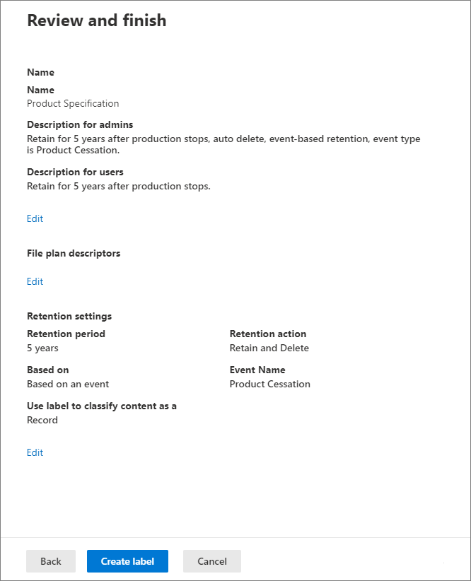

# <a name="use-retention-labels-to-manage-the-lifecycle-of-documents-stored-in-sharepoint"></a>Verwenden von Aufbewahrungsbezeichnungen zur Verwaltung des Lebenszyklus von in SharePoint gespeicherten Dokumenten

>*[Microsoft 365-Lizenzierungsleitfaden für Sicherheit und Compliance](https://aka.ms/ComplianceSD).*

In diesem Artikel erfahren Sie, wie Sie den Lebenszyklus von in SharePoint gespeicherten Dokumenten mithilfe von automatisch angewendeten Aufbewahrungsbezeichnungen und ereignisbasierter Aufbewahrung verwalten.

Die automatisch angewendete Funktion verwendet SharePoint-Metadaten für die Dokumentklassifizierung. Das in diesem Artikel beschriebene Beispiel gilt für produktbezogene Dokumente, für andere Szenarios können jedoch dieselben Konzepte verwendet werden. In der Öl- und Gasindustrie könnte es beispielsweise dazu dienen, den Lebenszyklus von Dokumenten über physische Vermögenswerte, wie etwa Ölplattformen, Bohrlochprotokolle oder Produktionslizenzen, zu verwalten. In der Finanzdienstleistungsbranche könnten Sie Dokumente verwalten, die sich auf Bankkonten, Hypotheken oder Versicherungsverträge beziehen. Im öffentlichen Sektor könnten Sie Baugenehmigungen oder Steuerformulare verwalten.

Wir werden uns in diesem Artikel die Informationsarchitektur und Definition der Aufbewahrungsbezeichnungen ansehen. Anschließend klassifizieren wir Dokumente, indem die Bezeichnungen automatisch angewendet werden. Und schließlich werden die Ereignisse generiert, die den Aufbewahrungszeitraum initiieren.

## <a name="information-architecture"></a>Informationsarchitektur

Unser Szenario für diesen Artikel stellt ein Produktionsunternehmen dar, das SharePoint verwendet, um alle Dokumente zu den von dem Unternehmen entwickelten Produkten zu speichern. Diese Dokumente enthalten Produktspezifikationen, Verträge mit Lieferanten und Benutzerhandbücher. Beim Speichern dieser Dokumente in SharePoint als Teil der Enterprise Content Management-Richtlinien, werden Dokumentmetadaten definiert, die zur Klassifizierung verwendet werden. Jedes Dokument verfügt über die folgenden Metadateneigenschaften:

- **Dokumenttyp** (wie Produktspezifikation, Vertrag oder Benutzerhandbuch)

- **Produktname**

- **Status** (Entwurf oder endgültig)

Diese Metadaten bilden einen Basisinhaltstyp namens *Produktionsdokument* für alle Dokumente.


> [!NOTE]
> Die Eigenschaften **Dokumententyp** und **Status** werden später in diesem Szenario von Aufbewahrungsrichtlinien verwendet, um Aufbewahrungsbezeichnungen zu klassifizieren und automatisch anzuwenden.

Es können möglicherweise mehrere Inhaltstypen vorhanden sein, die verschiedene Dokumenttypen darstellen. Wir konzentrieren uns jedoch auf die Produktdokumentation.

In diesem Szenario erstellen wir mithilfe des Managed Metadata Service und des Terminologiespeichers einen Terminologiesatz für *Dokumenttyp* und einen weiteren für *Produktname*. Für jeden Ausdruckssatz erstellen wir einen Ausdruck für jeden Wert. Im Terminologiespeicher sieht es für Ihre SharePoint-Organisation ungefähr so aus:


Der *Inhaltstyp* kann mit dem [Inhaltstyphub](https://support.office.com/article/manage-content-type-publishing-06f39ac0-5576-4b68-abbc-82b68334889b) erstellt und veröffentlicht werden. Sie können auch einen Inhaltstyp mit Site-Bereitstellungstools wie dem [PnP-Bereitstellungsframework](https://docs.microsoft.com/sharepoint/dev/solution-guidance/pnp-provisioning-framework) oder dem [Site-Design-JSON-Schema](https://docs.microsoft.com/sharepoint/dev/declarative-customization/site-design-json-schema#define-a-new-content-type) erstellen und veröffentlichen.

Jedes Produkt verfügt über eine dedizierte SharePoint-Website, die eine Dokumentbibliothek enthält, in denen die richtigen Inhaltstypen aktiviert sind. Alle Dokumente werden in dieser Dokumentbibliothek gespeichert.


> [!NOTE]
> Anstatt eine SharePoint-Website pro Produkt zu haben, könnte das produzierende Unternehmen in diesem Szenario ein Microsoft-Team pro Produkt verwenden, um die Zusammenarbeit mit Mitgliedern des Teams zu unterstützen, z. B. durch durchgehenden Chat, und die Registerkarte **Dateien** in Teams für die Dokumentverwaltung zu verwenden. In diesem Artikel konzentrieren wir uns nur auf Dokumente, daher verwenden wir nur eine Website.

Hier ist eine Ansicht der Dokumentbibliothek für das Spinning Widget-Produkt:


Nachdem wir die grundlegende Informationsarchitektur für das Dokumentenmanagement eingerichtet haben, schauen wir uns die Aufbewahrungs- und Entsorgungsstrategie für die Dokumente an, die die Metadaten von Dokumenten verwenden, und wie wir diese Dokumente klassifizieren können.

## <a name="retention-and-disposition"></a>Aufbewahrung und Disposition

Die Compliance- und Data Governance-Richtlinien des Herstellers bestimmen, wie Daten aufbewahrt und entsorgt werden. Produktbezogene Dokumente müssen so lange aufbewahrt werden, wie das Produkt hergestellt wird und für einen bestimmten zusätzlichen Zeitraum. Dieser zusätzliche Zeitraum ist für Produktspezifikationen, Verträge und Benutzerhandbücher unterschiedlich. In der folgenden Tabelle sind die Aufbewahrungs- und Entsorgungsanforderungen aufgeführt:

| **Dokumenttyp**          | **Vermerkdauer**                          | **Disposition**                              |
| -------------------------- | -------------------------------------- | -------------------------------------------- |
| Produktspezifikationen      | 5 Jahre nach Produktionsstopp  | Löschen                                       |
| Produktvereinbarungen          | 10 Jahre nach Produktionsstopp | Überprüfung                                       |
| Benutzerhandbücher                | 5 Jahre nach Produktionsstopp  | Löschen                                       |
| Alle anderen Dokumenttypen | Nicht aktiv aufbewahren  | Löschen, wenn Dokument älter als 3 Jahre ist <br /><br /> Ein Dokument gilt als älter als 3 Jahre, wenn es in den letzten 3 Jahren nicht geändert wurde. |
|||

Wir nutzen das Microsoft 365 Compliance-Center, um die folgenden [Aufbewahrungsbezeichnungen](retention.md#retention-labels) zu erstellen:

  - Produktspezifikation

  - Produktvertrag

  - Benutzerhandbuch

In diesem Artikel wird nur gezeigt, wie die Aufbewahrungsbezeichnung der Produktspezifikation erstellt und automatisch angewendet wird. Um das vollständige Szenario zu implementieren, erstellen Sie zudem Aufbewahrungsbezeichnungen für die beiden anderen Dokumenttypen und wenden sie diese automatisch an.

### <a name="settings-for-the-product-specification-retention-label"></a>Einstellungen für die Aufbewahrungsbezeichnung der Produktspezifikation

Hier ist der [Aktenplan](file-plan-manager.md) für die Aufbewahrungsbezeichnung der Produktspezifikation:

- **Name:** Produktspezifikation

- **Beschreibung für Administratoren:** 5 Jahre nach Einstellung der Produktion aufbewahren, automatische Löschung, ereignisbasierte Aufbewahrung, Ereignistyp ist *Einstellung des Produkts*.

- **Beschreibung für Nutzer:** für 5 Jahre nach Produktionsstopp aufbewahren.

- **Aufbewahrungsaktion:** Aufbewahren und löschen.

- **Aufbewahrungsdauer:** 5 Jahre (1.825 Tage).

- **Datensatzbezeichnung**: Konfigurieren Sie die Aufbewahrungsbezeichnung, um Inhalte als [*Datensatz*](records.md) zu kennzeichnen. (Dokumente, die als *Datensatz* klassifiziert sind, können von Benutzern nicht geändert oder gelöscht werden.)

- **Dateiplandeskriptoren:** (Zur Vereinfachung des Szenarios werden keine Dateideskriptoren bereitgestellt)

Der folgende Screenshot zeigt die Einstellungen, wenn Sie die Aufbewahrungsbezeichnung der Produktspezifikation im Microsoft 365 Compliance-Center erstellen. Sie können den Ereignistyp der *Einstellung des Produkts* erstellen, wenn Sie die Aufbewahrungsbezeichnung erstellen. Informationen hierzu finden Sie in dem im folgenden Abschnitt dargestellten Verfahren.


> [!NOTE]
> Um eine 5-jährige Wartezeit für das Löschen von Dokumenten zu vermeiden, legen Sie die Aufbewahrungsdauer auf ***1 Tag*** fest, wenn Sie dieses Szenario in einer Testumgebung neu erstellen.

### <a name="create-an-event-type-when-you-create-a-retention-label"></a>Erstellen Sie einen Ereignistyp, wenn Sie eine Aufbewahrungsbezeichnung erstellen

1. Wählen Sie aus der Dropdownliste **Inhalte basierend auf aufbewahren oder löschen**, wählen Sie**ein Ereignis** aus.

2. Klicken Sie auf **Ereignistyp auswählen**.
    
    

3. Wählen Sie **Ereignistyp auswählen** und wählen Sie dann **Neue Ereignistypen erstellen** auf der Seite **Ereignistyp auswählen** aus.

4. Erstellen Sie einen Ereignistyp namens ***Einstellung des Produkts***, geben Sie eine Beschreibung ein, und klicken Sie auf **Ende**.

5. Wählen Sie auf der Seite **Ereignistyp auswählen** den Ereignistyp **Einstellung des Produkts** aus, den Sie erstellt haben, und klicken Sie dann auf **Hinzufügen**.

   So sehen die Einstellungen für die Aufbewahrungsbezeichnung der Produktspezifikation aus. 

   

6. **Diese Bezeichnung erstellen** auswählen. 
> [!TIP]
> Ausführlichere Schritte finden Sie unter[Erstellen einer Bezeichnung, deren Aufbewahrungsdauer auf einem Ereignis basiert](event-driven-retention.md#step-1-create-a-label-whose-retention-period-is-based-on-an-event).

Nun wird die Aufbewahrungsbezeichnung automatisch auf den Inhalt der Produktspezifikation angewendet.

## <a name="auto-apply-retention-labels-to-classify-content"></a>Automatisches Anwenden von Aufbewahrungsbezeichnungen, um Inhalte zu klassifizieren

Wir werden KQL (Keyword Query Language) verwenden, um die Aufbewahrungsbezeichnungen, die wir erstellt haben, [automatisch anzuwenden](apply-retention-labels-automatically.md). KQL ist die Sprache, die verwendet wird, um Suchanfragen zu erstellen. In KQL können Sie mithilfe von Schlüsselwörtern oder verwalteten Eigenschaften suchen. Ausführlichere Informationen finden Sie in der [KQL-Syntaxreferenz (Keyword Query Language)](https://docs.microsoft.com/sharepoint/dev/general-development/keyword-query-language-kql-syntax-reference).

Im Grunde möchten wir Microsoft 365 mitteilen, „die Aufbewahrungsbezeichnung der *Produktspezifikation* auf alle Dokumente anzuwenden, die über den **Status** ***Endgültig*** verfügen und den **Dokumententypen** ***Produktspezifikation*** besitzen“. Erinnern Sie sich daran, dass **Status** und **Dokumenttyp** die Sitespalten sind, die Sie für den Inhaltstyp "Produktdokumentation" im Abschnitt [Informationsarchitektur](#information-architecture) definiert haben. Um dies zu tun, müssen wir das Suchschema konfigurieren.

Wenn SharePoint Inhalte indiziert, werden automatisch gecrawlte Eigenschaften für jede Sitespalte generiert. In diesem Szenario interessieren uns die Eigenschaften **Dokumenttyp** und **Status**. Wir benötigen Dokumente in der Bibliothek mit dem richtigen Inhaltstyp und ausgefüllten Sitespalten, damit bei der Suche die durchforsteten Eigenschaften erstellt werden können.

Öffnen Sie im SharePoint Admin Center die Suchkonfiguration und wählen Sie **Suchschema Verwalten** aus, um die durchforsteten Eigenschaften anzuzeigen und zu konfigurieren.


Wenn wir im Feld **Durchforstete Eigenschaften** ***Status*** eingeben und auf den grünen Pfeil klicken, sollte das Ergebnis folgendermaßen aussehen:


Die Eigenschaft **ows\_\_Status** ist diejenige, die uns interessiert (beachten Sie den doppelten Unterstrich). Sie ist der **Status**-Eigenschaft des Produktionsdokuments-Inhaltstyps zugeordnet.

Wenn wir nun ***ows\_doc*** eingeben und auf den grünen Pfeil klicken, sollten wir so etwas sehen:


Die Eigenschaft **ows\_doc\_x0020\_Type** ist die zweite Eigenschaft, die uns interessiert. Sie ist der **Dokumenttyp**Eigenschaft des Produktionsdokuments-Inhaltstyps zugeordnet.

> [!TIP]
> Wechseln Sie zu der Dokumentbibliothek, die die Produktionsdokumente enthält, um den Namen einer durchforsteten Eigenschaft für dieses Szenario zu identifizieren. Wechseln Sie dann zu den Bibliothekseinstellungen. Klicken Sie für die **Spalten** auf den Namen der Spalte (z. B. **Status** oder **Dokumenttyp**), um die Seite mit der Websitespalte zu öffnen. Der Parameter *Feld* in der URL für diese Seite enthält den Namen des Feldes. Dieser Feldname mit dem Präfix "ows_" ist der Name der gecrawlten Eigenschaft. Beispielsweise`https://tenantname.sharepoint.com/sites/SpinningWidget/_layouts/15/FldEdit.aspx?List=%7BC38C2F45-3BD6-4C3B-AA3B-EF5DF6B3D172%7D&Field=_Status` entspricht die URL der gecrawlten Eigenschaft*ows\_\_Status*.

Wenn die durchforsteten Eigenschaften nicht im Abschnitt „Suchschema Verwalten“ im SharePoint-Verwaltungscenter angezeigt werden:

- Möglicherweise wurden die Dokumente nicht indiziert. Sie können eine Neuindexierung der Bibliothek erzwingen, indem Sie zu **Dokumentbibliothekseinstellungen** > ** Erweiterte Einstellungen** gehen.

- Wenn sich die Dokumentbibliothek in einer modernen Site befindet, stellen Sie sicher, dass der SharePoint-Administrator auch ein Site Collection Admin ist.

Weitere Informationen zu gecrawlten und verwalteten Eigenschaften finden Sie unter[ Automatisch erstellte verwaltete Eigenschaften in SharePoint Server](https://docs.microsoft.com/sharepoint/technical-reference/automatically-created-managed-properties-in-sharepoint).

### <a name="map-crawled-properties-to-pre-defined-managed-properties"></a>Ordnen Sie gecrawlte Eigenschaften vordefinierten verwalteten Eigenschaften zu

KQL kann keine gecrawlten Eigenschaften in Suchabfragen verwenden. Es muss eine verwaltete Eigenschaft verwendet werden. In einem typischen Suchszenario erstellen wir eine verwaltete Eigenschaft und ordnen sie der gecrawlten Eigenschaft zu, die wir benötigen. Für das automatische Anwenden von Aufbewahrungsbezeichnungen können Sie jedoch nur vordefinierte verwaltete Eigenschaften in KQL und keine benutzerdefinierten verwalteten Eigenschaften angeben. Es gibt eine Reihe vordefinierter verwalteter Eigenschaften im System, damit Sie die Zeichenfolge *RefinableString00* bis *RefinableString199* verwenden können. Eine umfassende Liste finden Sie unter [Standardmäßig nicht verwendete verwaltete Eigenschaften](https://docs.microsoft.com/sharepoint/manage-search-schema#default-unused-managed-properties). Diese standardmäßig verwalteten Eigenschaften werden normalerweise zum Definieren von Sucheinschränkungen verwendet.

Damit die KQL-Abfrage die richtige Aufbewahrungsbezeichnung automatisch auf den Inhalt des Produktdokuments anwendet, ordnen wir die gecrawlten Eigenschaften **ows\_Doc\_x0020\_Type* und *ows\_\_Status** zwei anpassbaren verwalteten Eigenschaften zu. In unserer Testumgebung für dieses Szenario werden **RefinableString00** und **RefinableString01** nicht verwendet. Wir haben dies festgelegt, indem wir im SharePoint Admin Center **Verwaltete Eigenschaften** im **Suchschema verwalten** anzeigen.


Beachten Sie, dass die Spalte **Zugeordnete, durchforstete Eigenschaften** im vorherigen Screenshot leer ist.

Folgen Sie diesen Schritten, um die durchforstete Eigenschaft **ows\_Doc\_x0020\_Type** zuzuordnen:

1. Geben Sie im Filterfeld **Verwaltete Eigenschaft** ***RefinableString00*** ein, und klicken Sie auf den grünen Pfeil.

2. Klicken Sie in der Ergebnisliste auf den Link **RefinableString00**, und führen Sie dann einen Bildlauf nach unten zum Abschnitt **Zuordnungen zu durchforsteten Eigenschaften**.  

3. Klicken Sie auf **Zuordnung hinzufügen**, und geben Sie ***ows\_Doc\_x0020\_Type*** in das Feld **Namen einer durchforsteten Eigenschaft suchen** im Fenster **Auswahl für durchforstete Eigenschaft** ein. Wählen Sie **Suchen** aus.  

4. Wählen Sie in der Ergebnisliste **ows\_Doc\_x0020\_Type** aus, und klicken Sie dann auf **OK**.

   Im Abschnitt **Zugeordnete durchforstete Eigenschaften** sollten Sie so etwas wie diesen Screenshot sehen:

   

5. Führen Sie einen Bildlauf zum Ende der Seite aus, und klicken Sie auf **OK**, um die Zuordnung zu speichern.

Wiederholen Sie diese Schritte, um **RefinableString01** und **ows\_\_Status** zuzuordnen.

Jetzt sollten zwei verwaltete Eigenschaften den beiden durchforsteten Eigenschaften zugeordnet sein:


Lassen Sie uns überprüfen, ob alles korrekt eingerichtet ist, indem Sie eine Unternehmenssuche ausführen. Gehen Sie in einem Browser auf *https://\<your_tenant>sharepoint.com/search*. Geben Sie im Suchfeld ***RefinableString00:"Product Specification"*** ein und drücken Sie die Eingabetaste. Diese Suche sollte alle Dokumente zurückgeben, die über die **Produktspezifikation** ***Dokumenttyp***verfügen.

Geben Sie nun im Suchfeld **RefinableString00:"Product Specification" AND RefinableString01:Final** ein und drücken Sie die Eingabetaste. Dies sollte alle Dokumente zurückgeben, die die **Produktspezifikation** als ***Dokumenttyp*** und den **Status** als ***Endgültig*** haben.

### <a name="create-auto-apply-label-policies"></a>Erstellen Sie Bezeichnungsrichtlinien für die automatische Anwendung

Nachdem wir überprüft haben, dass die KQL-Abfrage funktioniert, erstellen wir eine Bezeichnungsrichtlinie, die eine KQL-Abfrage verwendet, um die Produktspezifikations-Aufbewahrungsbezeichnung automatisch auf die entsprechenden Dokumente anzuwenden.

1. Wechseln Sie im [Compliance Center](https://compliance.microsoft.com/homepage)zu **Datensatzverwaltung** > **Bezeichnungsrichtlinien** > **Automatisch eine Bezeichnung anwenden**.

   

2. Klicken Sie auf der Assistenten-Seite **Automatisch anzuwendende Bezeichnung auswählen** auf **Automatisch anzuwendende Bezeichnung auswählen**.

3. Wählen Sie aus der Liste der Bezeichnungen **Produktspezifikation** aus. Wählen Sie dann **Hinzufügen** und **Weiter** aus.

4. Wählen Sie **Bezeichnung auf Inhalt anwenden, der bestimmte Wörter oder Ausdrücke enthält** aus, und klicken Sie dann auf **Weiter**.

   

   Im nächsten Schritt stellen Sie dieselbe KQL-Suchabfrage bereit, die wir im vorherigen Abschnitt getestet haben. Diese Abfrage gibt alle Produktspezifikationsdokumente zurück, die den Status *Endgültig* haben. Wenn wir dieselbe Abfrage in der Bezeichnungsrichtlinie verwenden, wird die Aufbewahrungsbezeichnung der Produktspezifikation automatisch auf alle Dokumente angewendet, die ihr entsprechen.

5. Geben Sie im Feld **Schlüsselwortabfrage-Editor** ***RefinableString00:"Product Specification" AND RefinableString01:Final*** ein, und klicken Sie dann auf **Weiter**.

   

6. Geben Sie einen Namen (z. B. ***Bezeichnung „Produktspezifikation“ automatisch anwenden***) und eine optionale Beschreibung für die Bezeichnungsrichtlinie ein, und klicken Sie dann auf **Weiter**.

7. Wählen Sie auf der Assistenten-Seite **Speicherorte auswählen** die Inhaltsspeicherorte aus, auf die Sie die Richtlinie anwenden möchten. In diesem Szenario wenden wir die Richtlinie nur auf SharePoint-Standorte an, da alle Produktionsdokumente in SharePoint-Dokumentbibliotheken gespeichert werden. Klicken Sie daher auf **Mich bestimmte Speicherorte auswählen lassen** und ändern Sie dann den Status für **Exchange-E-Mails**, **OneDrive-Konten** und **Microsoft 365-Gruppen** auf „aus“. Stellen Sie sicher, dass der Status für SharePoint-Websites auf „ein“ gestellt ist. 

    

   > [!TIP]
   > Anstatt die Richtlinie auf alle SharePoint-Websites anzuwenden, können Sie auf **Websites auswählen** klicken und die URLs für bestimmte SharePoint-Websites hinzufügen.

8. Klicken Sie auf **Weiter**, um die Seite **Einstellungen überprüfen** anzuzeigen.

    

9. Klicken Sie auf **Automatisch anwenden**, um die Bezeichnungsrichtlinie zu erstellen.

   >[!NOTE]
   >Es dauert bis zu 7 Tage, um die Produktspezifikationsbezeichnung automatisch auf alle Dokumente anzuwenden, die der KQL-Suchabfrage entsprechen.

### <a name="verify-that-the-retention-label-was-automatically-applied"></a>Überprüfen Sie, ob die Aufbewahrungsbezeichnung automatisch angewendet wurde

Verwenden Sie nach 7 Tagen den[ Aktivität-Explorer](data-classification-activity-explorer.md) im Compliance Center, um zu sehen, dass die von uns erstellte Bezeichnungsrichtlinie die Aufbewahrungsbezeichnungen automatisch auf die Produktdokumente angewendet hat.

Überprüfen Sie auch die Eigenschaften der Dokumente in der Dokumentbibliothek. Im Informationsbereich können Sie sehen, dass die Aufbewahrungsbezeichnung auf ein ausgewähltes Dokument angewendet wird.


Da die Aufbewahrungsbezeichnungen automatisch auf Dokumente angewendet wurden, sind diese Dokumente vor dem Löschen geschützt, da die Aufbewahrungsbezeichnung so konfiguriert wurde, dass die Dokumente als *Datensätze* deklariert werden. Als Beispiel für diesen Schutz erhalten wir die folgende Fehlermeldung, wenn wir versuchen, eines dieser Dokumente zu löschen:


## <a name="generate-the-event-that-triggers-the-retention-period"></a>Generieren Sie das Ereignis, das den Aufbewahrungszeitraum auslöst.

Nachdem die Aufbewahrungsbeschriftungen angewendet wurden, konzentrieren wir uns nun auf das Ereignis, das das Ende der Produktion für ein bestimmtes Produkt anzeigt. Dieses Ereignis löst den Anfang des Aufbewahrungszeitraums aus, der in den Aufbewahrungsbezeichnungen definiert ist. Beispielsweise beginnt bei Produktspezifikationsdokumenten die Aufbewahrungsfrist von 5 Jahren, wenn das Ereignis "Produktionsende" ausgelöst wird.

Sie können das Ereignis im Microsoft 365 Compliance Center manuell erstellen, indem Sie zu **Datensatzverwaltung** > **Ereignisse** gehen. Wählen Sie den Ereignistyp aus, legen Sie die richtigen Objekt-IDs fest, und geben Sie ein Datum für das Ereignis ein. Weitere Informationen finden Sie unter [Übersicht über die ereignisgesteuerte Aufbewahrung](event-driven-retention.md).

In diesem Szenario generieren wir das Ereignis jedoch automatisch aus einem externen Produktionssystem. Beim System handelt es sich um eine einfache SharePoint-Liste, die angibt, ob sich ein Produkt in der Produktion befindet. Das Ereignis wird durch einen [Power Automate](https://docs.microsoft.com/flow/getting-started)-Workflow ausgelöst, der mit der Liste verknüpft ist. In einem realen Szenario können Sie ein beliebiges System verwenden, um das Ereignis zu generieren, z. B. ein HR- oder CRM-System. Power Automate enthält viele einsatzbereite Interaktionen und Bausteine für Microsoft 365-Workloads wie Microsoft Exchange, SharePoint, Teams und Dynamics 365 sowie Drittanbieter-Apps wie Twitter, Box, Salesforce und Workdays. Dieses Feature erleichtert die Integration von Power Automate mit verschiedenen Systemen. Weitere Informationen finden Sie unter [Automatisieren Sie die ereignisgesteuerte Aufbewahrung](automate-event-driven-retention.md).

Der folgende Screenshot zeigt die SharePoint-Liste, die zum Auslösen des Ereignisses verwendet wird:


Derzeit sind zwei Produkte in Produktion, wie mit ***Ja*** in der Spalte **In Produktion** angezeigt. Wenn der Wert in dieser Spalte für ein Produkt auf ***Nein*** gesetzt ist, generiert der mit der Liste verknüpfte Flow automatisch das Ereignis. Dieses Ereignis löst den Beginn der Aufbewahrungsfrist für die Aufbewahrungsbezeichnung aus, die automatisch auf die entsprechenden Produktdokumente angewendet wurde.

In diesem Szenario verwenden wir den folgenden Flow, um das Ereignis auszulösen:


Starten Sie zum Erstellen dieses Flows einen SharePoint-Connector, und wählen Sie den Auslöser **Wenn ein Element erstellt oder geändert wird** aus. Geben Sie die Websiteadresse und den Listennamen an. Fügen Sie dann eine Bedingung hinzu, die darauf basiert, dass der Wert der Spalte **In Produktion** auf ***Nein*** gesetzt ist (oder auf der Bedingungskarte gleich *False* ist). Fügen Sie dann eine Aktion hinzu, die auf der integrierten HTTP-Vorlage basiert. Verwenden Sie die Werte im folgenden Abschnitt, um die HTTP-Aktion zu konfigurieren. Sie können die Werte für die Eigenschaften **URI**und **Textkörper** aus dem folgenden Abschnitt kopieren und in die Vorlage einfügen.

- **Method**: POST
- **URI**: `https://ps.compliance.protection.outlook.com/psws/service.svc/ComplianceRetentionEvent`
- **Headers**: Key = Content-Type, Value = application/atom+xml
- **Body**:
    
    ```HTML
    <?xml version='1.0' encoding='utf-8' standalone='yes'>
    <entry xmlns:d='http://schemas.microsoft.com/ado/2007/08/dataservices' xmlns:m='http://schemas.microsoft.com/ado/2007/08/dataservices/metadata' xmlns='https://www.w3.org/2005/Atom'>
    <category scheme='http://schemas.microsoft.com/ado/2007/08/dataservices/scheme' term='Exchange.ComplianceRetentionEvent'>
    <updated>9/9/2017 10:50:00 PM</updated>
    <content type='application/xml'>
    <m:properties>
    <d:Name>Cessation Production @{triggerBody()?['Product_x0020_Name']?['Value']}</d:Name>
    <d:EventType>Product Cessation&lt;</d:EventType>
    <d:SharePointAssetIdQuery>ProductName:&quot;@{triggerBody()?['Product_x0020_Name']?['Value']}<d:SharePointAssetIdQuery>
    <d:EventDateTime>@{formatDateTime(utcNow(),'yyyy-MM-dd')}</d:EventDateTime>
    </m:properties>
    </content&gt>
    </entry>
    ```

Diese Liste beschreibt die Parameter in der **Body**-Eigenschaft der Aktion, die für dieses Szenario konfiguriert werden müssen:

- **Name**: Dieser Parameter gibt den Namen des Ereignisses an, das im Microsoft 365 Compliance Center erstellt wird. In diesem Szenario lautet der Name "Einstellung der Produktion *xxx*", wobei *xxx* der Wert der zuvor erstellten verwaltete Eigenschaft **ProductName** ist.
- **EventType**: Der Wert für diesen Parameter entspricht dem Ereignistyp, auf den das erstellte Ereignis angewendet wird. Dieser Ereignistyp wurde beim Erstellen der Aufbewahrungsbezeichnung definiert. In diesem Szenario lautet der Ereignistyp "Produkteinstellung".
- **SharePointAssetIdQuery**: Dieser Parameter definiert die Objekt-ID für das Ereignis. Die ereignisbasierte Aufbewahrung benötigt eine eindeutige Kennung für das Dokument. Wir können Objekt-IDs verwenden, um die Dokumente zu identifizieren, auf die ein bestimmtes Ereignis anwendbar ist, oder, wie in diesem Szenario, die Metadatenspalte **Produktname**. Dazu muss eine neue verwaltete Eigenschaft **Produktname** erstellt werden, die in der KQL-Abfrage verwendet werden kann. (Sie können alternativ auch **RefinableString00** verwenden, statt eine neue verwaltete Eigenschaft zu erstellen). Wir müssen diese neue verwaltete Eigenschaft auch der durchforsteten Eigenschaft **ows_Product_x0020_Name** zuordnen. Hier ist ein Screenshot dieser verwalteten Eigenschaft.

    

- **EventDateTime**: Dieser Parameter definiert das Datum, an dem das Ereignis eintritt. Verwenden Sie das aktuelle Datumsformat:<br/><br/>*formatDateTime(utcNow(),'yyyy-MM-dd'*)

### <a name="putting-it-all-together"></a>Zusammenfassung

Nun wurde die Aufbewahrungsbezeichnung erstellt und automatisch angewendet, und der Datenstrom wurde konfiguriert und erstellt. Wenn der Wert in der Spalte **In Produktion** für das Spinning Widget-Produkt in der Produktliste von ***Ja*** zu ***Nein***geändert wird, wird der Datenstrom ausgelöst, um das Ereignis zu erstellen. Um dieses Ereignis im Compliance Center anzuzeigen, wechseln Sie zu **Datensatzverwaltung** > **Ereignisse**.


Wählen Sie das Ereignis aus, um die Details auf der Flyout-Seite anzuzeigen. Beachten Sie, dass trotz der Erstellung des Ereignisses der Ereignisstatus anzeigt, dass keine SharePoint-Websites oder -Dokumente verarbeitet wurden.


Der Ereignisstatus zeigt jedoch nach einer Verzögerung, dass eine SharePoint-Site und ein SharePoint-Dokument verarbeitet wurden.  


 
Dies zeigt, dass der Aufbewahrungszeitraum für die Bezeichnung, die auf das Produktdokument von Spinning Widget angewendet wird, basierend auf dem Ereignisdatum des Ereignisses *Produktionseinstellung Spinning Widget*, initiiert wurde. Angenommen, Sie haben das Szenario in Ihrer Testumgebung implementiert, indem Sie einen Aufbewahrungszeitraum von 1 Tag konfiguriert haben: Sie können nun einige Tage nach dem Erstellen des Ereignisses die Dokumentbibliothek für Ihre Produktdokumente aufrufen und überprüfen, ob das Dokument gelöscht wurde (nachdem der Löschauftrag in SharePoint ausgeführt wurde).

### <a name="more-about-asset-ids"></a>Mehr über Objekt-IDs

Wie der Artikel [Übersicht über die ereignisgesteuerte Aufbewahrung](event-driven-retention.md) erläutert, ist es wichtig, die Beziehung zwischen Ereignistypen, Aufbewahrungsbezeichnungen, Ereignissen und Objekt-IDs zu verstehen. Die Objekt-ID ist einfach eine Dokumenteigenschaft in SharePoint und OneDrive. Auf diese Weise können Sie die Dokumente identifizieren, deren Aufbewahrungszeitraum durch das Ereignis ausgelöst wird. Standardmäßig verfügt SharePoint über eine **Objekt-ID**-Eigenschaft, die Sie für die ereignisgesteuerte Aufbewahrung verwenden können:


Wie der folgende Screenshot zeigt, heißt die verwaltete Eigenschaft Objekt-ID **ComplianceAssetId**.


Anstatt die standardmäßige **Objekt-ID**-Eigenschaft zu verwenden, wie wir es in diesem Szenario tun, können Sie jede andere Eigenschaft verwenden. Es ist jedoch wichtig zu verstehen, dass der Aufbewahrungszeitraum für alle Inhalte, die eine Bezeichnung dieses Ereignistyps aufweisen, durch das Ereignis ausgelöst wird, wenn Sie keine Objekt-ID oder Schlüsselwörter für ein Ereignis angeben.

### <a name="using-advanced-search-in-sharepoint"></a>Verwenden der erweiterten Suche in SharePoint

Im vorherigen Screenshot sehen Sie, dass es eine andere verwaltete Eigenschaft gibt, die sich auf Aufbewahrungsbezeichnungen bezieht, die als **ComplianceTag** bezeichnet wird und die einer durchforsteten Eigenschaft zugeordnet ist. Die verwaltete Eigenschaft **ComplianceAssetId** wird auch einer durchforsteten Eigenschaft zugeordnet. Dies bedeutet, dass Sie diese verwalteten Eigenschaften in der erweiterten Suche verwenden können, um alle Dokumente abzurufen, die mit einer Aufbewahrungsbezeichnung versehen wurden.

## <a name="credits"></a>Mitwirkende

Dieses Szenario wurde verfasst von: 

Frederic Lapierre<br/>Hauptberater, Microsoft Services
