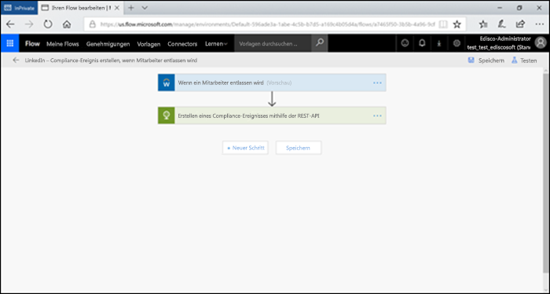
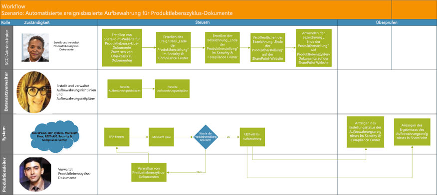

# <a name="automate-event-based-retention"></a><span data-ttu-id="d278e-103">Automatisieren der ereignisbasierten Aufbewahrung</span><span class="sxs-lookup"><span data-stu-id="d278e-103">Automate event-based retention</span></span>

><span data-ttu-id="d278e-104">*[Microsoft 365-Lizenzierungsleitfaden für Sicherheit und Compliance](https://aka.ms/ComplianceSD).*</span><span class="sxs-lookup"><span data-stu-id="d278e-104">*[Microsoft 365 licensing guidance for security & compliance](https://aka.ms/ComplianceSD).*</span></span>

<span data-ttu-id="d278e-p101">Die explosionsartige Zunahme von Inhalten in Unternehmen und wie erreicht werden kann, dass diese keine Rolle mehr spielt, ist eine ernste Angelegenheit. Um auch weiterhin den Herausforderungen im Zusammenhang mit der Einhaltung gesetzlicher und geschäftlicher Bestimmungen gerecht zu werden, müssen Organisationen in der Lage sein, wichtige Informationen aufzubewahren und zu schützen und schnell herauszufinden, was relevant ist. Die Aufbewahrung ausschließlich wichtiger, relevanter Informationen ist der Schlüssel zum Erfolg einer Organisation.</span><span class="sxs-lookup"><span data-stu-id="d278e-p101">The explosion of content in organizations and how it can become ROT (redundant, obsolete, trivial) is serious business. To continue to meet legal, business, and regulatory compliance challenges, organizations must be able to keep and protect important information and quickly find what’s relevant. Retaining only important, pertinent information is key to an organization's success.</span></span>

<span data-ttu-id="d278e-p102">Um dieser Anforderung gerecht zu werden, können Unternehmen die Aufbewahrungslösungen im Office 365 Security & Compliance Center nutzen. Aufbewahrung kann mithilfe von [Aufbewahrungsbezeichnungen](retention.md#retention-labels) ausgelöst werden. Eine Aufbewahrungsbezeichnung kann als [Grundlage für den Aufbewahrungszeitraum für ein bestimmtes Ereignis](event-driven-retention.md) dienen. In der Regel basiert der Aufbewahrungszeitraum auf einem bekannten Datum, z. B. dem Erstellungsdatum oder dem Datum der letzten Änderung der Inhalte. Unternehmen müssen jedoch auch Inhalte aufgrund des Eintretens eines Ereignisses entfernen, zum Beispiel 7 Jahre nach dem Austritt eines Mitarbeiters aus dem Unternehmen.</span><span class="sxs-lookup"><span data-stu-id="d278e-p102">To help meet this need, organizations can take advantage of retention solutions in the Office 365 Security & Compliance Center. Retention can be triggered by using [retention labels](retention.md#retention-labels). A retention label has the option to [base the retention period on a specific event](event-driven-retention.md). Typically, the retention period is based on a known date, such as the creation date or last modified date for the content. However, organizations also have requirements to dispose of content based on the occurrence of an event, such as seven years after an employee leaves an organization.</span></span>

<span data-ttu-id="d278e-p103">Um ein ordnungsgemäßes Entfernen der Inhalte sicherzustellen, ist es zwingend erforderlich zu wissen, wann ein Ereignis eintritt. Da die Inhaltsmenge rasant zunimmt, wird es immer schwieriger, Inhalte zeitnah und ordnungsgemäß aufzubewahren und zu entfernen.</span><span class="sxs-lookup"><span data-stu-id="d278e-p103">To ensure compliant disposal of content, it's imperative to know when an event takes place. With the volume of content increasing rapidly, it's becoming challenging to retain and dispose content in a timely and compliant manner.</span></span>

<span data-ttu-id="d278e-p104">Die ereignisbasierte Aufbewahrung stellt eine Lösung für dieses Problem dar. In diesem Artikel wird erläutert, wie Sie Geschäftsprozessabläufe über Ereignisse mithilfe der Microsoft 365-REST-API einrichten können, um die Aufbewahrung zu automatisieren.</span><span class="sxs-lookup"><span data-stu-id="d278e-p104">Event-based retention solves this problem. This article explains how to set up your business process flows to automate retention through events by using the Microsoft 365 REST API.</span></span>

## <a name="about-event-based-retention"></a><span data-ttu-id="d278e-117">Grundlegendes zur ereignisbasierten Aufbewahrung</span><span class="sxs-lookup"><span data-stu-id="d278e-117">About event-based retention</span></span>

<span data-ttu-id="d278e-p105">Es gibt kleine, mittelständige und Großunternehmen. Die Anzahl der Geschäftsdokumente, Rechtsdokumente, Mitarbeiterdateien, Verträgen und Produktdokumenten, die täglich erstellt und verwaltet werden, nimmt dramatisch zu.</span><span class="sxs-lookup"><span data-stu-id="d278e-p105">An organization can be small, medium, or large. The number of business documents, legal documents, employee files, contracts, and product documents that get created and managed on a day-to-day basis is increasing dramatically.</span></span>

<span data-ttu-id="d278e-p106">Zum Beispiel werden täglich Dutzende Mitarbeiter eingestellt, und es verlassen auch Dutzende Mitarbeiter die Unternehmen. Die Personalabteilung erstellt, aktualisiert oder löscht weiterhin mitarbeiterbezogene Dokumente gemäß den Geschäftsanforderungen. Dieser Prozess unterliegt verschiedenen Aufbewahrungsrichtlinien, die für das Unternehmen festgelegt sind:</span><span class="sxs-lookup"><span data-stu-id="d278e-p106">For example, each day, tens and hundreds of employees are joining and leaving organizations. The HR department continues to create, update, or delete employee-related documents as per business requirements. This process is subject to the different retention policies outlined for the business:</span></span>

- <span data-ttu-id="d278e-p107">**Der Aufbewahrungszeitraum für die Inhalte kann ein bekanntes Datum sein,** z. B. das Datum, an dem der Inhalt erstellt, zuletzt geändert oder mit einer Bezeichnung versehen wurde. Beispiel: Dokumente werden möglicherweise sieben Jahre lang ab Erstellung aufbewahrt und anschließend gelöscht.</span><span class="sxs-lookup"><span data-stu-id="d278e-p107">**The period of retention for content can be a known date** such as the date the content was created, last modified, or labeled. For example, you might retain documents for seven years after they're created and then delete them.</span></span>

- <span data-ttu-id="d278e-p108">**Der Aufbewahrungszeitraum für den Inhalt kann auch ein unbekanntes Datum sein**. Mit Aufbewahrungsbezeichnungen können Sie zum Beispiel als Basis für den Aufbewahrungszeitraum ein bestimmtes Ereignis festlegen, zum Beispiel den Austritt eines Mitarbeiters aus dem Unternehmen.</span><span class="sxs-lookup"><span data-stu-id="d278e-p108">**The period of retention of content can also be an unknown date**. For example, with retention labels, you can also base a retention period on when a specific type of event occurs, such as an employee leaving the organization.</span></span>

<span data-ttu-id="d278e-p109">Mit dem Ereignis wird der Anfang des Aufbewahrungszeitraums ausgelöst. Für alle Inhalte mit einer Bezeichnung, die für diese Art des Ereignisses angewendet wurde, werden die Aufbewahrungsmaßnahmen der Bezeichnung erzwungen. Dies wird auch als ereignisbasierte Aufbewahrung bezeichnet. Weitere Informationen hierzu finden Sie unter [Übersicht über die ereignisgesteuerte Aufbewahrung](event-driven-retention.md).</span><span class="sxs-lookup"><span data-stu-id="d278e-p109">The event triggers the start of the retention period, and all content with a label applied for that type of event get the label's retention actions enforced on them. This is called event-based retention. To learn more, see [Start retention when an event occurs](event-driven-retention.md).</span></span>

## <a name="set-up-event-based-retention"></a><span data-ttu-id="d278e-130">Einrichten der ereignisbasierten Aufbewahrung</span><span class="sxs-lookup"><span data-stu-id="d278e-130">Set up event-based retention</span></span>

<span data-ttu-id="d278e-131">Dieser Abschnitt beinhaltet die für die Aufbewahrung von Inhalten erforderlichen Schritte.</span><span class="sxs-lookup"><span data-stu-id="d278e-131">This section describes what needs to be done before retaining content.</span></span>

### <a name="identify-roles"></a><span data-ttu-id="d278e-132">Identifizieren von Rollen</span><span class="sxs-lookup"><span data-stu-id="d278e-132">Identify roles</span></span>

<span data-ttu-id="d278e-133">Identifizieren Sie die verschiedenen Rollen in einem Unternehmen, die Aufgaben für die Datensatzverwaltung ausführen und für eine effektive und effiziente Aufbewahrung von Geschäftsdokumenten verantwortlich sind.</span><span class="sxs-lookup"><span data-stu-id="d278e-133">Identify the different roles in an organization that perform Record Management tasks and would be responsible for effective and efficient retention of business documents.</span></span>

  | <span data-ttu-id="d278e-134">Persona</span><span class="sxs-lookup"><span data-stu-id="d278e-134">Persona</span></span> | <span data-ttu-id="d278e-135">Rolle</span><span class="sxs-lookup"><span data-stu-id="d278e-135">Role</span></span> |
  | - | - |
  | <span data-ttu-id="d278e-136">Administrator</span><span class="sxs-lookup"><span data-stu-id="d278e-136">Admin</span></span> | <span data-ttu-id="d278e-137">Erstellt Ereignistypen für die Aufbewahrung, Aufbewahrungsbezeichnungen und Repositorys für die Aufbewahrung in SharePoint.</span><span class="sxs-lookup"><span data-stu-id="d278e-137">Creates Retention Event types, Retention labels and Record repositories in SharePoint</span></span> |
  | <span data-ttu-id="d278e-138">Datensatzverwalter</span><span class="sxs-lookup"><span data-stu-id="d278e-138">Records Manager</span></span>                                  | <span data-ttu-id="d278e-139">Stellt Details zur Einhaltung von Aufbewahrungsrichtlinien und Aufbewahrungszeitplänen bereit.</span><span class="sxs-lookup"><span data-stu-id="d278e-139">Provides Retention Policies and Retention Schedules guidance and compliance details</span></span>   |
  | <span data-ttu-id="d278e-140">Systemadministrator (Unternehmen)</span><span class="sxs-lookup"><span data-stu-id="d278e-140">System Admin (business)</span></span>                          | <span data-ttu-id="d278e-141">Richtet externe Systeme für die Verwendung mit Microsoft 365 ein, und verwaltet diese.</span><span class="sxs-lookup"><span data-stu-id="d278e-141">Sets up and manages external systems to work with Microsoft 365</span></span>                       |
  | <span data-ttu-id="d278e-142">Information-Worker</span><span class="sxs-lookup"><span data-stu-id="d278e-142">Information Worker</span></span>                               | <span data-ttu-id="d278e-143">Verwaltet den Lebenszyklus der Geschäftsabläufe (HR, Finanzen, IT usw.).</span><span class="sxs-lookup"><span data-stu-id="d278e-143">Manages the lifecycle of their business process (HR, Finance, IT, and so on)</span></span>                 |

### <a name="set-up-the-security--compliance-center"></a><span data-ttu-id="d278e-144">Einrichten des Security & Compliance Center</span><span class="sxs-lookup"><span data-stu-id="d278e-144">Set up the Security & Compliance Center</span></span>
  
1. <span data-ttu-id="d278e-145">Der Compliance-Administrator erstellt einen Ereignistyp &ndash;, zum Beispiel Ende der Beschäftigung, Vertragsablauf oder Ende der Produktherstellung.</span><span class="sxs-lookup"><span data-stu-id="d278e-145">Compliance admin creates an event type &ndash; for example, Employee Termination or Contract Expiration or End of Product Manufacturing.</span></span> <span data-ttu-id="d278e-146">(Eine schrittweise Anleitung finden Sie unter [Ereignisgesteuerte Aufbewahrung](event-driven-retention.md)).</span><span class="sxs-lookup"><span data-stu-id="d278e-146">(See the step-by-step process in [Event-driven retention](event-driven-retention.md).</span></span>
    
2. <span data-ttu-id="d278e-147">Der Compliance-Administrator erstellt eine Aufbewahrungsbezeichnung auf der Grundlage eines Ereignisses und weist die Bezeichnung einem Ereignistyp zu.</span><span class="sxs-lookup"><span data-stu-id="d278e-147">Compliance admin creates a retention label based on an event and associates the label with an event type.</span></span>
    
    <span data-ttu-id="d278e-148">Es gibt vier Arten von Auslösern für Aufbewahrungsbezeichnungen:</span><span class="sxs-lookup"><span data-stu-id="d278e-148">There are four types of triggers for retention labels:</span></span>
            
    1. <span data-ttu-id="d278e-149">Erstellungsdatum</span><span class="sxs-lookup"><span data-stu-id="d278e-149">Create date</span></span>
                
    2. <span data-ttu-id="d278e-150">Zuletzt geändert</span><span class="sxs-lookup"><span data-stu-id="d278e-150">Last modified</span></span>
                
    3. <span data-ttu-id="d278e-151">Datum der Bezeichnung (Zeitpunkt, zu dem die Inhalte mit der Bezeichnung versehen wurden)</span><span class="sxs-lookup"><span data-stu-id="d278e-151">Label date (when the content was labeled)</span></span>
                
    4. <span data-ttu-id="d278e-152">Ereignis-basiert</span><span class="sxs-lookup"><span data-stu-id="d278e-152">Event-based</span></span>
    
3. <span data-ttu-id="d278e-153">Der Compliance-Administrator veröffentlicht die Aufbewahrungsbezeichnung.</span><span class="sxs-lookup"><span data-stu-id="d278e-153">Compliance admin publishes the retention label.</span></span>

### <a name="set-up-sharepoint"></a><span data-ttu-id="d278e-154">Einrichten von SharePoint</span><span class="sxs-lookup"><span data-stu-id="d278e-154">Set up SharePoint</span></span>
   
<span data-ttu-id="d278e-155">Der Compliance-Administrator geht wie folgt vor, um ein Repository für Datensätze zu erstellen:</span><span class="sxs-lookup"><span data-stu-id="d278e-155">To create a records repository, the compliance admin:</span></span>

1. <span data-ttu-id="d278e-156">Er erstellt eine SharePoint-Website.</span><span class="sxs-lookup"><span data-stu-id="d278e-156">Creates a SharePoint site.</span></span>

2. <span data-ttu-id="d278e-157">Er führt einen der folgenden Schritte aus:</span><span class="sxs-lookup"><span data-stu-id="d278e-157">Does one of the following:</span></span>
        
    - <span data-ttu-id="d278e-p111">Er erstellt eine SharePoint-Bibliothek: er legt eine ereignisbasierte Bezeichnung auf Bibliotheksebene fest. Weitere Informationen finden Sie unter [Anwenden einer Aufbewahrungsbezeichnung auf alle Inhalte in einer Bibliothek, einem Ordner oder einer Dokumentenmappe in SharePoint](create-apply-retention-labels.md#applying-a-default-retention-label-to-all-content-in-a-sharepoint-library-folder-or-document-set).</span><span class="sxs-lookup"><span data-stu-id="d278e-p111">Creates a SharePoint library: Set event-based label at the library level. For more information, see [Applying a default retention label to all content in a SharePoint library, folder, or document set](create-apply-retention-labels.md#applying-a-default-retention-label-to-all-content-in-a-sharepoint-library-folder-or-document-set).</span></span>

   - <span data-ttu-id="d278e-160">Richtet eine Dokumentenmappe in SharePoint ein.</span><span class="sxs-lookup"><span data-stu-id="d278e-160">Sets up a document set in SharePoint.</span></span> <span data-ttu-id="d278e-161">Weitere Informationen finden Sie unter [Einführung in Dokumentenmappen](https://support.microsoft.com/de-DE/office/introduction-to-document-sets-3dbcd93e-0bed-46b7-b1ba-b31de2bcd234).</span><span class="sxs-lookup"><span data-stu-id="d278e-161">For more information, see [Introduction to document sets](https://support.microsoft.com/de-DE/office/introduction-to-document-sets-3dbcd93e-0bed-46b7-b1ba-b31de2bcd234).</span></span>
      
3. <span data-ttu-id="d278e-162">Weist jeder Dokumentenmappe eines Mitarbeiters eine Objekt-ID zu.</span><span class="sxs-lookup"><span data-stu-id="d278e-162">Assigns an asset ID to each employee document set.</span></span> <span data-ttu-id="d278e-163">Bei einer Objekt-ID handelt es sich um einen Produktnamen oder Code, der von der Organisation verwendet wird; die Mitarbeiternummer kann z. B. eine Objekt-ID sein.</span><span class="sxs-lookup"><span data-stu-id="d278e-163">An asset ID is a product name or code used by the organization, for example, Employee number can be an asset ID.</span></span> <span data-ttu-id="d278e-164">Durch Zuweisen der Objekt-ID zum Ordner erbt jedes Element in diesem Ordner automatisch dieselbe Objekt-ID.</span><span class="sxs-lookup"><span data-stu-id="d278e-164">By assigning the asset ID to the folder, every item in that folder automatically inherits the same asset ID.</span></span> <span data-ttu-id="d278e-165">Dies bedeutet, dass der Aufbewahrungszeitraum aller Elemente durch das gleiche Ereignis ausgelöst werden kann.</span><span class="sxs-lookup"><span data-stu-id="d278e-165">This means all the items can have their retention period triggered by the same event.</span></span>

## <a name="ways-to-trigger-event-based-retention"></a><span data-ttu-id="d278e-166">Möglichkeiten zum Auslösen der ereignisbasierten Aufbewahrung</span><span class="sxs-lookup"><span data-stu-id="d278e-166">Ways to trigger event-based retention</span></span>

<span data-ttu-id="d278e-167">Es gibt zwei Möglichkeiten zum Auslösen der ereignisbasierten Aufbewahrung:</span><span class="sxs-lookup"><span data-stu-id="d278e-167">There are two ways in which event-based retention can be triggered:</span></span>

- <span data-ttu-id="d278e-168">**Verwenden der Benutzeroberfläche des Admin Centers** Dies ist ein Prozess, der verwendet werden kann, um weniger Inhalte gleichzeitig zu speichern, oder wenn Häufigkeit, mit der die Aufbewahrung ausgelöst wird, gering ist, z. B. monatlich oder jährlich.</span><span class="sxs-lookup"><span data-stu-id="d278e-168">**Using the admin center UI** This is a process that can be used to retain less content at a time or the frequency to trigger retention isn't often, such as monthly or yearly.</span></span> <span data-ttu-id="d278e-169">Weitere Informationen über diese Methode finden Sie unter [Übersicht über die ereignisgesteuerte Aufbewahrung](event-driven-retention.md).</span><span class="sxs-lookup"><span data-stu-id="d278e-169">For more information about this method, see [Start retention when an event occurs](event-driven-retention.md).</span></span> <span data-ttu-id="d278e-170">Allerdings kann diese Methode des Auslösens der Aufbewahrung zeitaufwändig und fehleranfällig sein, wodurch die Skalierbarkeit eingeschränkt wird.</span><span class="sxs-lookup"><span data-stu-id="d278e-170">However, this method of triggering retention can be time consuming and prone to error, thus stunting scalability.</span></span> <span data-ttu-id="d278e-171">Daher kann eine automatisierte, nahtlose Lösung zum Auslösen der Aufbewahrung die Datensicherheit und Compliance verbessern.</span><span class="sxs-lookup"><span data-stu-id="d278e-171">Therefore, an automated, seamless solution to trigger retention can enhance data security and compliance.</span></span>

- <span data-ttu-id="d278e-p115">**Mithilfe einer Microsoft 365-REST-API**Dieser Prozess kann verwendet werden, wenn sehr viele Inhalte aufbewahrt werden und/oder die Aufbewahrung häufig ausgelöst wird, zum Beispiel täglich oder wöchentlich. Der Ablauf erkennt, wenn ein Ereignis in Ihrem Branchensystem eintritt, und erstellt automatisch ein zugehöriges Ereignis im Security & Compliance Center. Sie müssen keine Ereignisse in der Benutzeroberfläche manuell erstellen, wenn diese eintreten.</span><span class="sxs-lookup"><span data-stu-id="d278e-p115">**Using a M365 REST API** This process can be used when large amounts of content are to be retained at a time and/or the frequency to trigger retention is often such as daily or weekly. The flow detects when an event occurs in your line-of-business system, and then automatically creates a related event in the Security & Compliance Center. You don't need to manually create an event in the UI each time one occurs.</span></span>

<span data-ttu-id="d278e-175">Es gibt zwei Optionen für die Verwendung der REST-API:</span><span class="sxs-lookup"><span data-stu-id="d278e-175">There are two options for using the REST API:</span></span>

- <span data-ttu-id="d278e-176">**Microsoft Flow oder eine ähnliche Anwendung** kann verwendet werden, um das Ereignis automatisch auszulösen.</span><span class="sxs-lookup"><span data-stu-id="d278e-176">**Microsoft Flow or a similar application** can be used to trigger the occurrence of an event automatically.</span></span> <span data-ttu-id="d278e-177">Microsoft Flow ist ein Orchestrator zum Herstellen einer Verbindung zu anderen Systemen.</span><span class="sxs-lookup"><span data-stu-id="d278e-177">Microsoft Flow is an orchestrator for connecting to other systems.</span></span> <span data-ttu-id="d278e-178">Für die Verwendung von Microsoft Flow ist keine benutzerdefinierte Lösung erforderlich.</span><span class="sxs-lookup"><span data-stu-id="d278e-178">Using Microsoft Flow doesn't require a custom solution.</span></span>

- <span data-ttu-id="d278e-179">**PowerShell oder ein HTTP-Client zum Aufrufen der REST-API** Sie können PowerShell (Version 6 oder höher) zum Aufrufen der Microsoft 365-REST-API verwenden, um Ereignisse zu erstellen.</span><span class="sxs-lookup"><span data-stu-id="d278e-179">**PowerShell or an HTTP client to call REST API** Using PowerShell (version 6 or higher) to call Microsoft 365 REST API to create events.</span></span> 

<span data-ttu-id="d278e-180">Bei einer Rest-API handelt es sich um einen Dienstendpunkt, der Gruppen von HTTP-Vorgängen (Methoden) unterstützt, die Zugriff zum Erstellen/Abrufen/Aktualisieren/Löschen der Dienstressourcen bieten.</span><span class="sxs-lookup"><span data-stu-id="d278e-180">A Rest API is a service endpoint that supports sets of HTTP operations (methods), which provide create/retrieve/update/delete access to the service's resources.</span></span> <span data-ttu-id="d278e-181">Weitere Informationen finden Sie unter [Komponenten einer REST-API-Anfrage/-Anfrage](https://docs.microsoft.com/rest/api/gettingstarted/#components-of-a-rest-api-requestresponse).</span><span class="sxs-lookup"><span data-stu-id="d278e-181">For more information, see [Components of a REST API request/response](https://docs.microsoft.com/rest/api/gettingstarted/#components-of-a-rest-api-requestresponse).</span></span> <span data-ttu-id="d278e-182">In diesem Fall können mithilfe der Microsoft 365 Rest-API Ereignisse erstellt und mit POST- und GET-Operationen abgerufen werden.</span><span class="sxs-lookup"><span data-stu-id="d278e-182">In this case, by using the Microsoft 365 REST API, events can be created and retrieved using operations (methods) POST and GET.</span></span>

## <a name="example-scenarios"></a><span data-ttu-id="d278e-183">Beispielszenarien</span><span class="sxs-lookup"><span data-stu-id="d278e-183">Example scenarios</span></span>

<span data-ttu-id="d278e-184">Betrachten Sie die folgenden Szenarien.</span><span class="sxs-lookup"><span data-stu-id="d278e-184">Let’s consider the following scenarios.</span></span>

### <a name="scenario-1-employees-leaving-the-organization"></a><span data-ttu-id="d278e-185">Scenario 1: Mitarbeiter tritt aus dem Unternehmen aus</span><span class="sxs-lookup"><span data-stu-id="d278e-185">Scenario 1: Employees leaving the organization</span></span> 

<span data-ttu-id="d278e-186">Eine Organisation erstellt und speichert zahlreiche mitarbeiterbezogene Dokumente pro Mitarbeiter.</span><span class="sxs-lookup"><span data-stu-id="d278e-186">An organization creates and stores numerous employee-related documents per employee.</span></span> <span data-ttu-id="d278e-187">Diese Dokumente werden während der Beschäftigungsdauer jedes Mitarbeiters verwaltet und aufbewahrt.</span><span class="sxs-lookup"><span data-stu-id="d278e-187">These documents are managed and retained during the employment of each employee.</span></span> <span data-ttu-id="d278e-188">Wenn der Mitarbeiter aber die Organisation verlässt oder das Beschäftigungsverhältnis beendet wird, ist die Organisation gemäß gesetzlicher und geschäftlicher Anforderungen verpflichtet, die Dokumente des Mitarbeiters für einen festgelegten Zeitraum aufzubewahren.</span><span class="sxs-lookup"><span data-stu-id="d278e-188">However, when the employee leaves the organization or the employment is terminated, the organization is obligated by legal and business requirements to retain the documents of that employee for a stipulated period.</span></span>

<span data-ttu-id="d278e-189">Wenn nun täglich mehrere Mitarbeiter aus dem Unternehmen austreten, muss das Unternehmen die Aufbewahrungszeit von Hunderten, wenn nicht Tausenden von Dokumenten pro Tag auslösen.</span><span class="sxs-lookup"><span data-stu-id="d278e-189">Now if multiple employees leave the organization every day, the organization must trigger the retention clock of hundreds if not thousands of documents each day.</span></span>

<span data-ttu-id="d278e-190">Darüber hinaus muss für jeden dieser Mitarbeiter die Aufbewahrungsfrist als Datum des Austritts aus dem Unternehmen + Anzahl der Tage, Monate oder Jahre je nach Art des Mitarbeiterdatensatzes berechnet werden.</span><span class="sxs-lookup"><span data-stu-id="d278e-190">In addition to this, the retention period needs to be calculated for each of these employees as Employee termination date + number of days, months, or years based on the type of the employee record.</span></span> <span data-ttu-id="d278e-191">So kann beispielsweise die Vergütung des Mitarbeiters gegenüber den Leistungsanmeldungen desselben Arbeitnehmers eine unterschiedliche Aufbewahrung erfordern.</span><span class="sxs-lookup"><span data-stu-id="d278e-191">For example, worker’s compensation of the employee vs. benefits filings of the same employee may need different retention.</span></span>

<span data-ttu-id="d278e-192">Das nachstehende Diagramm zeigt, dass mehrere Beschriftungen vorhanden sein können, die einem einzelnen Ereignis zugeordnet sind.</span><span class="sxs-lookup"><span data-stu-id="d278e-192">The diagram below shows how there can be multiple labels that are associated with a single event.</span></span> <span data-ttu-id="d278e-193">Hier werden alle Dateien unter der Bezeichnung „Mitarbeitervergütung“ und alle Dateien unter der Bezeichnung „Leistungen“ mit einem einzelnen Ereignis verknüpft, und zwar, dass der Mitarbeiter das Unternehmen verlässt.</span><span class="sxs-lookup"><span data-stu-id="d278e-193">Here all the files under Worker’s compensation label and all the files under Employee benefits label are both associated with a single event, which is the employee leaving the organization.</span></span> <span data-ttu-id="d278e-194">Jede dieser unterschiedlichen Dateien weist unterschiedliche Aufbewahrungszeitpläne auf.</span><span class="sxs-lookup"><span data-stu-id="d278e-194">Each of these different files has different retention clocks.</span></span> <span data-ttu-id="d278e-195">Wenn ein Mitarbeiter das Unternehmen verlässt, haben diese Dateien innerhalb der einzelnen Bezeichnungen einen anderen Aufbewahrungszeitraum.</span><span class="sxs-lookup"><span data-stu-id="d278e-195">So, when an employee leaves the organization, these files within each label experience a different retention period.</span></span> <span data-ttu-id="d278e-196">Das Auslösen dieser unterschiedlichen Aufbewahrungszeitpläne für jeden Dateityp oder jede Bezeichnung für jeden Mitarbeiter ist eine große Herausforderung.</span><span class="sxs-lookup"><span data-stu-id="d278e-196">Triggering all these different retention clocks for each file type or label for each employee is a very challenging task.</span></span> <span data-ttu-id="d278e-197">Stellen Sie sich vor, dies für mehrere Mitarbeiter auszuführen.</span><span class="sxs-lookup"><span data-stu-id="d278e-197">Imagine doing this for multiple employees.</span></span>


<span data-ttu-id="d278e-199">Ein automatisierter Prozess zum Auslösen dieser unterschiedlicher Aufbewahrungszeiten für mehrere Mitarbeiter ist daher zeitsparend, fehlerfrei und äußerst effizient.</span><span class="sxs-lookup"><span data-stu-id="d278e-199">Hence an automated process to trigger these different retention clocks for multiple employees will be time-saving, error-free, and extremely efficient.</span></span>

<span data-ttu-id="d278e-200">**Konfigurieren der automatisierten ereignisbasierten Aufbewahrung für dieses Szenario:**</span><span class="sxs-lookup"><span data-stu-id="d278e-200">**Configuring Automated Event Based Retention for this scenario:**</span></span>


  - <span data-ttu-id="d278e-202">Der Administrator erstellt in der Dokumentenmappe mehrere Mitarbeiterordner, zum Beispiel Jane Doe, John Smith.</span><span class="sxs-lookup"><span data-stu-id="d278e-202">Admin creates employee folders to the Document set such as Jane Doe, John Smith.</span></span>

  - <span data-ttu-id="d278e-203">Der Administrator fügt zu jedem Mitarbeiterordner mitarbeiterbezogene Dateien hinzu, zum Beispiel Leistungen, Lohn, Vergütung.</span><span class="sxs-lookup"><span data-stu-id="d278e-203">Admin adds employee files such as Benefits, Payroll, Worker’s Compensation to each employee folder.</span></span>

  - <span data-ttu-id="d278e-204">Der Administrator weist jedem Mitarbeiterordner eine Asset-ID zu.</span><span class="sxs-lookup"><span data-stu-id="d278e-204">Admin assigns Asset ID to each employee folder.</span></span> 

  - <span data-ttu-id="d278e-205">Der SCC-Administrator meldet sich beim Security & Compliance Center an.</span><span class="sxs-lookup"><span data-stu-id="d278e-205">SCC Admin logs into the Security & Compliance Center.</span></span>

  - <span data-ttu-id="d278e-206">SCC-Administrator erstellt mitarbeiterbezogene Ereignistypen wie „Beschäftigungsende“, „Einstellung des Mitarbeiters“.</span><span class="sxs-lookup"><span data-stu-id="d278e-206">SCC Admin creates employee-related events types such as “Employee Termination”, “Employee Hire” events.</span></span>

  - <span data-ttu-id="d278e-207">SCC-Administrator erstellt Bezeichnung „Mitarbeiterbindung“.</span><span class="sxs-lookup"><span data-stu-id="d278e-207">SCC Admin creates “Employee Retention” label.</span></span>

  - <span data-ttu-id="d278e-208">Diese Bezeichnung wird veröffentlicht und manuell oder automatisch auf die Dateien des Mitarbeiters in SharePoint angewendet.</span><span class="sxs-lookup"><span data-stu-id="d278e-208">This “Employee Retention” label is published and applied manually or automatically to the employee files in SharePoint.</span></span>

  - <span data-ttu-id="d278e-209">Ein HR-Managementsystem wie Workday kann regelmäßig mit Microsoft Flow verwendet werden, um die Dateien von Mitarbeitern zu verwalten.</span><span class="sxs-lookup"><span data-stu-id="d278e-209">HR Management System like Workday can work with Microsoft Flow to run periodically to manage employee files.</span></span>

  - <span data-ttu-id="d278e-210">Wenn ein Mitarbeiter aus dem Unternehmen ausgetreten ist, löst der Ablauf die Microsoft 365-REST-API für die ereignisbasierte Aufbewahrung aus, die den Aufbewahrungszeitraum für die Dateien eines bestimmten Mitarbeiters startet.</span><span class="sxs-lookup"><span data-stu-id="d278e-210">If an employee has left the organization, the Flow will trigger the M365 Event Based Retention REST API that will begin the retention clock on the specific employee’s files.</span></span>

#### <a name="using-microsoft-flow"></a><span data-ttu-id="d278e-211">Verwenden von Microsoft Flow</span><span class="sxs-lookup"><span data-stu-id="d278e-211">Using Microsoft Flow</span></span>

<span data-ttu-id="d278e-212">Schritt 1: Erstellen eines Ablaufs zum Erstellen einer Ereignisses mithilfe der Microsoft 365-REST-API</span><span class="sxs-lookup"><span data-stu-id="d278e-212">Step 1- Create a flow to create an event using the Microsoft 365 REST API</span></span>




##### <a name="create-an-event"></a><span data-ttu-id="d278e-215">Erstellen eines Ereignisses</span><span class="sxs-lookup"><span data-stu-id="d278e-215">Create an event</span></span>

<span data-ttu-id="d278e-216">Beispielcode zum Aufrufen der REST-API:</span><span class="sxs-lookup"><span data-stu-id="d278e-216">Sample code to call the REST API:</span></span>

- <span data-ttu-id="d278e-217">**Method**: POST</span><span class="sxs-lookup"><span data-stu-id="d278e-217">**Method**: POST</span></span>
- <span data-ttu-id="d278e-218">**URL**: `https://ps.compliance.protection.outlook.com/psws/service.svc/ComplianceRetentionEvent`</span><span class="sxs-lookup"><span data-stu-id="d278e-218">**URL**: `https://ps.compliance.protection.outlook.com/psws/service.svc/ComplianceRetentionEvent`</span></span>
- <span data-ttu-id="d278e-219">**Headers**: Key = Content-Type, Value = application/atom+xml</span><span class="sxs-lookup"><span data-stu-id="d278e-219">**Headers**: Key = Content-Type, Value = application/atom+xml</span></span>
- <span data-ttu-id="d278e-220">**Body**:</span><span class="sxs-lookup"><span data-stu-id="d278e-220">**Body**:</span></span>
    
    ```xml
    <?xml version='1.0' encoding='utf-8' standalone='yes'?>
    
    <entry xmlns:d='http://schemas.microsoft.com/ado/2007/08/dataservices'
    
    xmlns:m='http://schemas.microsoft.com/ado/2007/08/dataservices/metadata'
    
    xmlns='http://www.w3.org/2005/Atom'>
    
    <category scheme='http://schemas.microsoft.com/ado/2007/08/dataservices/scheme' term='Exchange.ComplianceRetentionEvent' />
    
    <updated>9/9/2017 10:50:00 PM</updated>
    
    <content type='application/xml'>
    
    <m:properties>
    
    <d:Name>Employee Termination </d:Name>
    
    <d:EventType>99e0ae64-a4b8-40bb-82ed-645895610f56</d:EventType>
    
    <d:SharePointAssetIdQuery>1234</d:SharePointAssetIdQuery>
    
    <d:EventDateTime>2018-12-01T00:00:00Z </d:EventDateTime>
    
    </m:properties>
    
    </content>
    
    </entry>
    ```
- <span data-ttu-id="d278e-221">**Authentication**: Basic</span><span class="sxs-lookup"><span data-stu-id="d278e-221">**Authentication**: Basic</span></span>
- <span data-ttu-id="d278e-222">**Username**: "Complianceuser"</span><span class="sxs-lookup"><span data-stu-id="d278e-222">**Username**: "Complianceuser"</span></span>
- <span data-ttu-id="d278e-223">**Password**: "Compliancepassword"</span><span class="sxs-lookup"><span data-stu-id="d278e-223">**Password**: "Compliancepassword"</span></span>


##### <a name="available-parameters"></a><span data-ttu-id="d278e-224">Verfügbare Parameter</span><span class="sxs-lookup"><span data-stu-id="d278e-224">Available parameters</span></span>


|<span data-ttu-id="d278e-225">Parameter</span><span class="sxs-lookup"><span data-stu-id="d278e-225">Parameters</span></span>|<span data-ttu-id="d278e-226">Beschreibung</span><span class="sxs-lookup"><span data-stu-id="d278e-226">Description</span></span>|<span data-ttu-id="d278e-227">Anmerkungen</span><span class="sxs-lookup"><span data-stu-id="d278e-227">Notes</span></span>|
|--- |--- |--- |
|<span data-ttu-id="d278e-228"><d:Name></d:Name></span><span class="sxs-lookup"><span data-stu-id="d278e-228"><d:Name></d:Name></span></span>|<span data-ttu-id="d278e-229">Geben Sie einen eindeutigen Namen für das Ereignis an.</span><span class="sxs-lookup"><span data-stu-id="d278e-229">Provide a unique name for the event,</span></span>|<span data-ttu-id="d278e-230">Der Name darf nachfolgende Leerzeichen und die folgenden Zeichen nicht enthalten: % \* \ & < \> \| # ?</span><span class="sxs-lookup"><span data-stu-id="d278e-230">Cannot contain trailing spaces, and the following characters: % \* \ & < \> \| # ?</span></span> <span data-ttu-id="d278e-231">, : ;</span><span class="sxs-lookup"><span data-stu-id="d278e-231">, : ;</span></span>|
|<span data-ttu-id="d278e-232"><d:EventType></d:EventType></span><span class="sxs-lookup"><span data-stu-id="d278e-232"><d:EventType></d:EventType></span></span>|<span data-ttu-id="d278e-233">Geben Sie den Namen des Ereignistyps (oder GUID) ein.</span><span class="sxs-lookup"><span data-stu-id="d278e-233">Enter event type name (or Guid),</span></span>|<span data-ttu-id="d278e-p122">Beispiel: „Austritt eines Mitarbeiters“. Der Ereignistyp muss mit einer Aufbewahrungsbezeichnung verknüpft sein.</span><span class="sxs-lookup"><span data-stu-id="d278e-p122">Example: “Employee termination”. Event type has to be associated with a retention label.</span></span>|
|<span data-ttu-id="d278e-236"><d:SharePointAssetIdQuery></d:SharePointAssetIdQuery></span><span class="sxs-lookup"><span data-stu-id="d278e-236"><d:SharePointAssetIdQuery></d:SharePointAssetIdQuery></span></span>|<span data-ttu-id="d278e-237">Geben Sie "ComplianceAssetId:" + Mitarbeiter-ID ein</span><span class="sxs-lookup"><span data-stu-id="d278e-237">Enter “ComplianceAssetId:” + employee Id</span></span>|<span data-ttu-id="d278e-238">Beispiel: "ComplianceAssetId:12345"</span><span class="sxs-lookup"><span data-stu-id="d278e-238">Example: "ComplianceAssetId:12345"</span></span>|
|<span data-ttu-id="d278e-239"><d:EventDateTime></d:EventDateTime></span><span class="sxs-lookup"><span data-stu-id="d278e-239"><d:EventDateTime></d:EventDateTime></span></span>|<span data-ttu-id="d278e-240">Datum und Uhrzeit des Ereignisses</span><span class="sxs-lookup"><span data-stu-id="d278e-240">Event Date and Time</span></span>|<span data-ttu-id="d278e-241">Format: jjjj-MM-ttTHH:mm:ssZ, Beispiel: 2018-12-01T00:00:00Z</span><span class="sxs-lookup"><span data-stu-id="d278e-241">Format: yyyy-MM-ddTHH:mm:ssZ, Example: 2018-12-01T00:00:00Z</span></span>
|

##### <a name="response-codes"></a><span data-ttu-id="d278e-242">Antwortcodes</span><span class="sxs-lookup"><span data-stu-id="d278e-242">Response codes</span></span>

| <span data-ttu-id="d278e-243">Antwortcode</span><span class="sxs-lookup"><span data-stu-id="d278e-243">Response Code</span></span> | <span data-ttu-id="d278e-244">Beschreibung</span><span class="sxs-lookup"><span data-stu-id="d278e-244">Description</span></span>       |
| ----------------- | --------------------- |
| <span data-ttu-id="d278e-245">302</span><span class="sxs-lookup"><span data-stu-id="d278e-245">302</span></span>               | <span data-ttu-id="d278e-246">Umleiten</span><span class="sxs-lookup"><span data-stu-id="d278e-246">Redirect</span></span>              |
| <span data-ttu-id="d278e-247">201</span><span class="sxs-lookup"><span data-stu-id="d278e-247">201</span></span>               | <span data-ttu-id="d278e-248">Erstellt</span><span class="sxs-lookup"><span data-stu-id="d278e-248">Created</span></span>               |
| <span data-ttu-id="d278e-249">403</span><span class="sxs-lookup"><span data-stu-id="d278e-249">403</span></span>               | <span data-ttu-id="d278e-250">Autorisierung fehlgeschlagen</span><span class="sxs-lookup"><span data-stu-id="d278e-250">Authorization Failed</span></span>  |
| <span data-ttu-id="d278e-251">401</span><span class="sxs-lookup"><span data-stu-id="d278e-251">401</span></span>               | <span data-ttu-id="d278e-252">Authentifizierung fehlgeschlagen</span><span class="sxs-lookup"><span data-stu-id="d278e-252">Authentication Failed</span></span> |

##### <a name="get-events-based-on-time-range"></a><span data-ttu-id="d278e-253">Abrufen von Ereignissen basierend auf dem Zeitraum</span><span class="sxs-lookup"><span data-stu-id="d278e-253">Get Events based on time range</span></span>

- <span data-ttu-id="d278e-254">**Method**: GET</span><span class="sxs-lookup"><span data-stu-id="d278e-254">**Method**: GET</span></span>

- <span data-ttu-id="d278e-255">**URL**: `https://ps.compliance.protection.outlook.com/psws/service.svc/ComplianceRetentionEvent?BeginDateTime=2019-01-11&EndDateTime=2019-01-16`</span><span class="sxs-lookup"><span data-stu-id="d278e-255">**URL**: `https://ps.compliance.protection.outlook.com/psws/service.svc/ComplianceRetentionEvent?BeginDateTime=2019-01-11&EndDateTime=2019-01-16`</span></span>

- <span data-ttu-id="d278e-256">**Headers**: Key = Content-Type, Value = application/atom+xml</span><span class="sxs-lookup"><span data-stu-id="d278e-256">**Headers**: Key = Content-Type, Value = application/atom+xml</span></span>

- <span data-ttu-id="d278e-257">**Authentication**: Basic</span><span class="sxs-lookup"><span data-stu-id="d278e-257">**Authentication**: Basic</span></span>

- <span data-ttu-id="d278e-258">**Username**: "Complianceuser"</span><span class="sxs-lookup"><span data-stu-id="d278e-258">**Username**: "Complianceuser"</span></span>

- <span data-ttu-id="d278e-259">**Password**: "Compliancepassword"</span><span class="sxs-lookup"><span data-stu-id="d278e-259">**Password**: "Compliancepassword"</span></span>


##### <a name="response-codes"></a><span data-ttu-id="d278e-260">Antwortcodes</span><span class="sxs-lookup"><span data-stu-id="d278e-260">Response codes</span></span>

| <span data-ttu-id="d278e-261">Antwortcode</span><span class="sxs-lookup"><span data-stu-id="d278e-261">Response Code</span></span> | <span data-ttu-id="d278e-262">Beschreibung</span><span class="sxs-lookup"><span data-stu-id="d278e-262">Description</span></span>                   |
| ----------------- | --------------------------------- |
| <span data-ttu-id="d278e-263">200</span><span class="sxs-lookup"><span data-stu-id="d278e-263">200</span></span>               | <span data-ttu-id="d278e-264">OK, eine Liste der Ereignisse in Atom + XML</span><span class="sxs-lookup"><span data-stu-id="d278e-264">OK, A list of events in atom+ xml</span></span> |
| <span data-ttu-id="d278e-265">404</span><span class="sxs-lookup"><span data-stu-id="d278e-265">404</span></span>               | <span data-ttu-id="d278e-266">Nicht gefunden</span><span class="sxs-lookup"><span data-stu-id="d278e-266">Not found</span></span>                         |
| <span data-ttu-id="d278e-267">302</span><span class="sxs-lookup"><span data-stu-id="d278e-267">302</span></span>               | <span data-ttu-id="d278e-268">Umleiten</span><span class="sxs-lookup"><span data-stu-id="d278e-268">Redirect</span></span>                          |
| <span data-ttu-id="d278e-269">401</span><span class="sxs-lookup"><span data-stu-id="d278e-269">401</span></span>               | <span data-ttu-id="d278e-270">Autorisierung fehlgeschlagen</span><span class="sxs-lookup"><span data-stu-id="d278e-270">Authorization Failed</span></span>              |
| <span data-ttu-id="d278e-271">403</span><span class="sxs-lookup"><span data-stu-id="d278e-271">403</span></span>               | <span data-ttu-id="d278e-272">Authentifizierung fehlgeschlagen</span><span class="sxs-lookup"><span data-stu-id="d278e-272">Authentication Failed</span></span>             |

##### <a name="get-an-event-by-id"></a><span data-ttu-id="d278e-273">Abrufen eines Ereignisses nach ID</span><span class="sxs-lookup"><span data-stu-id="d278e-273">Get an event by ID</span></span>

- <span data-ttu-id="d278e-274">**Method**: GET</span><span class="sxs-lookup"><span data-stu-id="d278e-274">**Method**: GET</span></span>

- <span data-ttu-id="d278e-275">**URL**: `https://ps.compliance.protection.outlook.com/psws/service.svc/ComplianceRetentionEvent('174e9a86-74ff-4450-8666-7c11f7730f66')`</span><span class="sxs-lookup"><span data-stu-id="d278e-275">**URL**: `https://ps.compliance.protection.outlook.com/psws/service.svc/ComplianceRetentionEvent('174e9a86-74ff-4450-8666-7c11f7730f66')`</span></span>

- <span data-ttu-id="d278e-276">**Headers**: Key = Content-Type, Value = application/atom+xml</span><span class="sxs-lookup"><span data-stu-id="d278e-276">**Headers**: Key = Content-Type, Value = application/atom+xml</span></span>

- <span data-ttu-id="d278e-277">**Authentication**: Basic</span><span class="sxs-lookup"><span data-stu-id="d278e-277">**Authentication**: Basic</span></span>

- <span data-ttu-id="d278e-278">**Username**: "Complianceuser"</span><span class="sxs-lookup"><span data-stu-id="d278e-278">**Username**: "Complianceuser"</span></span>

- <span data-ttu-id="d278e-279">**Password**: "Compliancepassword"</span><span class="sxs-lookup"><span data-stu-id="d278e-279">**Password**: "Compliancepassword"</span></span>


##### <a name="response-codes"></a><span data-ttu-id="d278e-280">Antwortcodes</span><span class="sxs-lookup"><span data-stu-id="d278e-280">Response codes</span></span>

| <span data-ttu-id="d278e-281">Antwortcode</span><span class="sxs-lookup"><span data-stu-id="d278e-281">Response Code</span></span> | <span data-ttu-id="d278e-282">Beschreibung</span><span class="sxs-lookup"><span data-stu-id="d278e-282">Description</span></span>                                      |
| ----------------- | ---------------------------------------------------- |
| <span data-ttu-id="d278e-283">200</span><span class="sxs-lookup"><span data-stu-id="d278e-283">200</span></span>               | <span data-ttu-id="d278e-284">OK, der Antworttext enthält das Ereignis in Atom + XML</span><span class="sxs-lookup"><span data-stu-id="d278e-284">OK, The response body contains the event in atom+xml</span></span> |
| <span data-ttu-id="d278e-285">404</span><span class="sxs-lookup"><span data-stu-id="d278e-285">404</span></span>               | <span data-ttu-id="d278e-286">Nicht gefunden</span><span class="sxs-lookup"><span data-stu-id="d278e-286">Not found</span></span>                                            |
| <span data-ttu-id="d278e-287">302</span><span class="sxs-lookup"><span data-stu-id="d278e-287">302</span></span>               | <span data-ttu-id="d278e-288">Umleiten</span><span class="sxs-lookup"><span data-stu-id="d278e-288">Redirect</span></span>                                             |
| <span data-ttu-id="d278e-289">401</span><span class="sxs-lookup"><span data-stu-id="d278e-289">401</span></span>               | <span data-ttu-id="d278e-290">Autorisierung fehlgeschlagen</span><span class="sxs-lookup"><span data-stu-id="d278e-290">Authorization Failed</span></span>                                 |
| <span data-ttu-id="d278e-291">403</span><span class="sxs-lookup"><span data-stu-id="d278e-291">403</span></span>               | <span data-ttu-id="d278e-292">Authentifizierung fehlgeschlagen</span><span class="sxs-lookup"><span data-stu-id="d278e-292">Authentication Failed</span></span>                                |

##### <a name="get-an-event-by-name"></a><span data-ttu-id="d278e-293">Abrufen eines Ereignisses anhand des Namens</span><span class="sxs-lookup"><span data-stu-id="d278e-293">Get an event by name</span></span>

- <span data-ttu-id="d278e-294">**Method**: GET</span><span class="sxs-lookup"><span data-stu-id="d278e-294">**Method**: GET</span></span>

- <span data-ttu-id="d278e-295">**URL**: `https://ps.compliance.protection.outlook.com/psws/service.svc/ComplianceRetentionEvent`</span><span class="sxs-lookup"><span data-stu-id="d278e-295">**URL**: `https://ps.compliance.protection.outlook.com/psws/service.svc/ComplianceRetentionEvent`</span></span>

- <span data-ttu-id="d278e-296">**Headers**: Key = Content-Type, Value = application/atom+xml</span><span class="sxs-lookup"><span data-stu-id="d278e-296">**Headers**: Key = Content-Type, Value = application/atom+xml</span></span>

- <span data-ttu-id="d278e-297">**Authentication**: Basic</span><span class="sxs-lookup"><span data-stu-id="d278e-297">**Authentication**: Basic</span></span>

- <span data-ttu-id="d278e-298">**Username**: "Complianceuser"</span><span class="sxs-lookup"><span data-stu-id="d278e-298">**Username**: "Complianceuser"</span></span>

- <span data-ttu-id="d278e-299">**Password**: "Compliancepassword"</span><span class="sxs-lookup"><span data-stu-id="d278e-299">**Password**: "Compliancepassword"</span></span>


##### <a name="response-codes"></a><span data-ttu-id="d278e-300">Antwortcodes</span><span class="sxs-lookup"><span data-stu-id="d278e-300">Response codes</span></span>

| <span data-ttu-id="d278e-301">Antwortcode</span><span class="sxs-lookup"><span data-stu-id="d278e-301">Response Code</span></span> | <span data-ttu-id="d278e-302">Beschreibung</span><span class="sxs-lookup"><span data-stu-id="d278e-302">Description</span></span>                                      |
| ----------------- | ---------------------------------------------------- |
| <span data-ttu-id="d278e-303">200</span><span class="sxs-lookup"><span data-stu-id="d278e-303">200</span></span>               | <span data-ttu-id="d278e-304">OK, der Antworttext enthält das Ereignis in Atom + XML</span><span class="sxs-lookup"><span data-stu-id="d278e-304">OK, The response body contains the event in atom+xml</span></span> |
| <span data-ttu-id="d278e-305">404</span><span class="sxs-lookup"><span data-stu-id="d278e-305">404</span></span>               | <span data-ttu-id="d278e-306">Nicht gefunden</span><span class="sxs-lookup"><span data-stu-id="d278e-306">Not found</span></span>                                            |
| <span data-ttu-id="d278e-307">302</span><span class="sxs-lookup"><span data-stu-id="d278e-307">302</span></span>               | <span data-ttu-id="d278e-308">Umleiten</span><span class="sxs-lookup"><span data-stu-id="d278e-308">Redirect</span></span>                                             |
| <span data-ttu-id="d278e-309">401</span><span class="sxs-lookup"><span data-stu-id="d278e-309">401</span></span>               | <span data-ttu-id="d278e-310">Autorisierung fehlgeschlagen</span><span class="sxs-lookup"><span data-stu-id="d278e-310">Authorization Failed</span></span>                                 |
| <span data-ttu-id="d278e-311">403</span><span class="sxs-lookup"><span data-stu-id="d278e-311">403</span></span>               | <span data-ttu-id="d278e-312">Authentifizierung fehlgeschlagen</span><span class="sxs-lookup"><span data-stu-id="d278e-312">Authentication Failed</span></span>                                |

#### <a name="using-powershell-version-6-or-later-or-any-http-client"></a><span data-ttu-id="d278e-313">Verwenden von PowerShell (Version 6 oder höher) oder eines beliebigen HTTP-Clients</span><span class="sxs-lookup"><span data-stu-id="d278e-313">Using PowerShell (version 6 or later) or any HTTP client</span></span>

<span data-ttu-id="d278e-314">Schritt 1: Stellen Sie eine Verbindung zu PowerShell her.</span><span class="sxs-lookup"><span data-stu-id="d278e-314">Step 1: Connect to PowerShell.</span></span>

<span data-ttu-id="d278e-315">Schritt 2: Führen Sie das folgende Skript aus.</span><span class="sxs-lookup"><span data-stu-id="d278e-315">Step 2: Run the following script.</span></span>

```powershell
param([string]$baseUri)

$userName = "UserName"

$password = "Password"

$securePassword = ConvertTo-SecureString $password -AsPlainText -Force

$credentials = New-Object System.Management.Automation.PSCredential($userName, $securePassword)

$EventName="EventByRESTPost-$(([Guid]::NewGuid()).ToString('N'))"

Write-Host "Start to create an event with name: $EventName"

$body = "<?xml version='1.0' encoding='utf-8' standalone='yes'?>

<entry xmlns:d='http://schemas.microsoft.com/ado/2007/08/dataservices'

xmlns:m='http://schemas.microsoft.com/ado/2007/08/dataservices/metadata'

xmlns='http://www.w3.org/2005/Atom'>

<category scheme='http://schemas.microsoft.com/ado/2007/08/dataservices/scheme' term='Exchange.ComplianceRetentionEvent' />

<updated>7/14/2017 2:03:36 PM</updated>

<content type='application/xml'>

<m:properties>

<d:Name>$EventName</d:Name>

<d:EventType>e823b782-9a07-4e30-8091-034fc01f9347</d:EventType>

<d:SharePointAssetIdQuery>'ComplianceAssetId:123'</d:SharePointAssetIdQuery>

</m:properties>

</content>

</entry>"

$event = $null

try

{

$event = Invoke-RestMethod -Body $body -Method 'POST' -Uri "$baseUri/ComplianceRetentionEvent" -ContentType "application/atom+xml" -Authentication Basic -Credential $credentials -MaximumRedirection 0

}

catch

{

$response = $_.Exception.Response

if($response.StatusCode -eq "Redirect")

{

$url = $response.Headers.Location

Write-Host "redirected to $url"

$event = Invoke-RestMethod -Body $body -Method 'POST' -Uri $url -ContentType "application/atom+xml" -Authentication Basic -Credential $credentials -MaximumRedirection 0

}

}

$event | fl *

```


#### <a name="verify-the-outcome-in-both-options"></a><span data-ttu-id="d278e-316">Überprüfen der Ausgabe bei beiden Optionen</span><span class="sxs-lookup"><span data-stu-id="d278e-316">Verify the outcome in both options</span></span>

<span data-ttu-id="d278e-317">Schritt 1: Wechseln Sie zum Security & Compliance Center.</span><span class="sxs-lookup"><span data-stu-id="d278e-317">Step 1: Go to the Security & Compliance Center.</span></span>

<span data-ttu-id="d278e-318">Schritt 2: Klicken Sie unter **Informationskontrolle** auf **Ereignisse**.</span><span class="sxs-lookup"><span data-stu-id="d278e-318">Step 2: Select **Events** under **Information governance**.</span></span>

<span data-ttu-id="d278e-319">Schritt 3: Überprüfen Sie, ob das Ereignis erstellt wurde.</span><span class="sxs-lookup"><span data-stu-id="d278e-319">Step 3: Verify Event has been created.</span></span>

<span data-ttu-id="d278e-320">Ebenso können die aufgeführten Optionen zum Automatisieren der ereignisbasierten Aufbewahrung auch für die folgenden Szenarien verwendet werden.</span><span class="sxs-lookup"><span data-stu-id="d278e-320">Similarly, the above options to automate event-based retention can be used for the following scenarios as well.</span></span>

### <a name="scenario-2-contracts-expiring"></a><span data-ttu-id="d278e-321">Szenario 2: Ablauf von Verträgen</span><span class="sxs-lookup"><span data-stu-id="d278e-321">Scenario 2: Contracts Expiring</span></span>

<span data-ttu-id="d278e-322">Eine Organisation kann mehrere Datensätze für einen einzigen Vertrag mit Kunden, Lieferanten und Partnern haben.</span><span class="sxs-lookup"><span data-stu-id="d278e-322">An organization can have multiple records for a single contract with customers, vendors, and partners.</span></span> <span data-ttu-id="d278e-323">Diese Dokumente können sich in einer Dokumentbibliothek wie SharePoint befinden.</span><span class="sxs-lookup"><span data-stu-id="d278e-323">These documents can reside in a document library like SharePoint.</span></span> <span data-ttu-id="d278e-324">Das Vertragsende bestimmt den Anfang des Aufbewahrungszeitraums der Dokumente, die dem Vertrag zugeordnet sind.</span><span class="sxs-lookup"><span data-stu-id="d278e-324">The end of a contract determines the start of the retention period of the documents associated with the contract.</span></span> <span data-ttu-id="d278e-325">So müssen z. B. alle Datensätze im Zusammenhang mit Verträgen fünf Jahre lang ab dem Zeitpunkt aufbewahrt werden, ab dem der Vertrag abläuft.</span><span class="sxs-lookup"><span data-stu-id="d278e-325">For example, all records related to contracts need to be retained for five years from the time the contract expires.</span></span> <span data-ttu-id="d278e-326">Das Ereignis, das den Aufbewahrungszeitraum von fünf Jahren ausgelöst, ist der Ablauf des Vertrags.</span><span class="sxs-lookup"><span data-stu-id="d278e-326">The event that triggers the five-year retention period is the expiration of the contract.</span></span>

<span data-ttu-id="d278e-327">Ein CRM-System kann mit Microsoft 365 verwendet werden und die Aufbewahrung für Vertragsdokumente auslösen.</span><span class="sxs-lookup"><span data-stu-id="d278e-327">A Customer Relationship Management (CRM) system can work with Microsoft 365 and trigger retention of Contract documents.</span></span>

<span data-ttu-id="d278e-328">**Konfigurieren der automatisierten ereignisbasierten Aufbewahrung für dieses Szenario:**</span><span class="sxs-lookup"><span data-stu-id="d278e-328">**Configuring Automated Event Based Retention for this scenario:**</span></span>


  - <span data-ttu-id="d278e-330">Der Administrator erstellt eine SharePoint-Bibliothek mit verschiedenen Ordnern für jeden Vertragstyp.</span><span class="sxs-lookup"><span data-stu-id="d278e-330">Admin creates a SharePoint library with various folders for each contract type.</span></span>

  - <span data-ttu-id="d278e-331">Der Administrator fügt Vertragsdateien zu jedem Vertragsordner hinzu, zum Beispiel Lizenzverträge, Entwicklungsverträge.</span><span class="sxs-lookup"><span data-stu-id="d278e-331">Admin adds contract files such as License Contracts, Development Contracts to each contract folder.</span></span>

  - <span data-ttu-id="d278e-332">Der Administrator weist jedem Vertragsordner eine Objekt-ID zu.</span><span class="sxs-lookup"><span data-stu-id="d278e-332">Admin assigns Asset ID to each contract folder.</span></span>

  - <span data-ttu-id="d278e-333">Der SCC-Administrator meldet sich beim Security & Compliance Center an.</span><span class="sxs-lookup"><span data-stu-id="d278e-333">SCC Admin logs into the Security & Compliance Center.</span></span>

  - <span data-ttu-id="d278e-334">Der SCC-Administrator erstellt vertragsbezogene Ereignisse wie „Erstellung des Vertrags“, „Ablauf des Vertrags“.</span><span class="sxs-lookup"><span data-stu-id="d278e-334">SCC Admin creates contract-related events types such as “Contract Creation”, “Contract Expiration” events.</span></span>

  - <span data-ttu-id="d278e-335">Der SCC-Administrator erstellt die Bezeichnung „Vertragsende“.</span><span class="sxs-lookup"><span data-stu-id="d278e-335">SCC Admin creates “Contract Expiration” label.</span></span>

  - <span data-ttu-id="d278e-336">Diese Bezeichnung wird veröffentlicht und manuell oder automatisch auf die Vertragsdateien in SharePoint angewendet.</span><span class="sxs-lookup"><span data-stu-id="d278e-336">This “ Contract Expiration” label is published and applied manually or automatically to the contract files in SharePoint.</span></span>

  - <span data-ttu-id="d278e-337">Ein Vertragsmanagementsystem kann mit Microsoft Flow oder einer ähnlichen Anwendung regelmäßig verwendet werden, um Vertragsdateien zu verwalten.</span><span class="sxs-lookup"><span data-stu-id="d278e-337">Contract Management System can work with Microsoft Flow or a similar application to run periodically to manage contract files.</span></span>

  - <span data-ttu-id="d278e-338">Wenn ein Vertrag abläuft, löst Microsoft Flow die Microsoft 365-REST-API für die ereignisbasierte Aufbewahrung aus, die den Aufbewahrungszeitraum für die Vertragsdateien startet.</span><span class="sxs-lookup"><span data-stu-id="d278e-338">If a contract expires, Microsoft Flow will trigger the M365 Event Based Retention REST API that will begin the retention clock on the specific contract’s files.</span></span>

### <a name="scenario-3-end-of-product-manufacturing"></a><span data-ttu-id="d278e-339">Szenario 3: Ende der Produktherstellung</span><span class="sxs-lookup"><span data-stu-id="d278e-339">Scenario 3: End of Product Manufacturing</span></span>

<span data-ttu-id="d278e-p124">Ein Produktionsunternehmen, das verschiedene Produktlinien herstellt, erstellt viele Fertigungsspezifikationen und Preisgestaltungsdokumente. Wenn das Produkt nicht mehr hergestellt wird, müssen alle mit diesem Produkt verknüpften Spezifikationen und Dokumente über einen bestimmten Zeitraum ab Ende der Lebensdauer des Produkts aufbewahrt werden.</span><span class="sxs-lookup"><span data-stu-id="d278e-p124">A manufacturing company that produces different lines of products creates many manufacturing specifications and pricing documents. When the product is no longer manufactured, all specifications and documents linked to this product need to be retained for a specific period after the end of the lifetime of the product.</span></span>

<span data-ttu-id="d278e-342">Ein ERP-System kann mit Microsoft 365 und Microsoft Flow verwendet werden, um die Aufbewahrung auszulösen.</span><span class="sxs-lookup"><span data-stu-id="d278e-342">An Enterprise Resource Planning (ERP) system can work with Microsoft 365 and Microsoft Flow to trigger retention.</span></span>

<span data-ttu-id="d278e-343">**Konfigurieren der automatisierten ereignisbasierten Aufbewahrung für dieses Szenario:**</span><span class="sxs-lookup"><span data-stu-id="d278e-343">**Configuring Automated Event Based Retention for this scenario:**</span></span>



  - <span data-ttu-id="d278e-345">Der Administrator erstellt in der Dokumentenmappe Produktordner wie Produkt 1, Produkt 2 usw.</span><span class="sxs-lookup"><span data-stu-id="d278e-345">Admin creates product folders in the Document set such as Product 1, Product 2, and so on.</span></span>

  - <span data-ttu-id="d278e-346">Der Administrator fügt jedem Produktordner Produktdateien hinzu, zum Beispiel Fertigungsspezifikationen, Produktpreisgestaltung, Produktlizenzierung.</span><span class="sxs-lookup"><span data-stu-id="d278e-346">Admin adds product files such as Manufacturing Specifications, Product Pricing, Product licensing to each product folder.</span></span>

  - <span data-ttu-id="d278e-347">Der Administrator weist jedem Produktordner eine Objekt-ID zu.</span><span class="sxs-lookup"><span data-stu-id="d278e-347">Admin assigns Asset ID to each product folder.</span></span>

  - <span data-ttu-id="d278e-348">Der SCC-Administrator meldet sich beim Security & Compliance Center an.</span><span class="sxs-lookup"><span data-stu-id="d278e-348">SCC Admin logs into the Security & Compliance Center.</span></span>

  - <span data-ttu-id="d278e-349">Der SCC-Administrator erstellt produktbezogene Ereignistypen, zum Beispiel „Beginn der Produktherstellung“, „Ende der Produktherstellung“.</span><span class="sxs-lookup"><span data-stu-id="d278e-349">SCC Admin creates employee-related events types such as “Start of Product Manufacturing”, “End of Product Manufacturing” events.</span></span>

  - <span data-ttu-id="d278e-350">Der SCC-Administrator erstellt die Bezeichnung „Ende der Produktherstellung“.</span><span class="sxs-lookup"><span data-stu-id="d278e-350">SCC Admin creates “End of Product Manufacturing” label.</span></span>

  - <span data-ttu-id="d278e-351">Diese Bezeichnung wird veröffentlicht und manuell oder automatisch auf die Produktdateien in SharePoint angewendet.</span><span class="sxs-lookup"><span data-stu-id="d278e-351">This “ End of Product Manufacturing” label is published and applied manually or automatically to the product files in SharePoint.</span></span>

  - <span data-ttu-id="d278e-352">ERP-Systeme können mit Microsoft Flow oder ähnlichen Anwendungen regelmäßig verwendet werden, um Produktdateien zu verwalten.</span><span class="sxs-lookup"><span data-stu-id="d278e-352">ERP Systems can work with Microsoft Flow or similar applications to run periodically to manage product files.</span></span>

  - <span data-ttu-id="d278e-353">Wenn die Herstellung eines Produkts endet, löst Microsoft Flow die Microsoft 365-REST-API für die ereignisbasierte Aufbewahrung aus, die den Aufbewahrungszeitraum für die Produktdateien startet.</span><span class="sxs-lookup"><span data-stu-id="d278e-353">If the manufacturing of a product ends, Microsoft Flow will trigger the M365 Event Based Retention REST API that will begin the retention clock on the specific product’s files.</span></span>

## <a name="appendix"></a><span data-ttu-id="d278e-354">Anhang</span><span class="sxs-lookup"><span data-stu-id="d278e-354">Appendix</span></span>

### <a name="using-redirect-302-response-results-to-call-the-rest-api"></a><span data-ttu-id="d278e-355">Verwenden der Redirect 302-Antwortergebnisse zum Aufrufen der REST-API</span><span class="sxs-lookup"><span data-stu-id="d278e-355">Using Redirect 302 response results to call the REST API</span></span>

1. <span data-ttu-id="d278e-356">Aufrufen eines POST-Aufbewahrungsereignisaufrufs mithilfe der REST-API-URL: `https://ps.compliance.protection.outlook.com/psws/service.svc/ComplianceRetentionEvent`</span><span class="sxs-lookup"><span data-stu-id="d278e-356">Invoke a POST retention event call by using the REST API URL: `https://ps.compliance.protection.outlook.com/psws/service.svc/ComplianceRetentionEvent`</span></span>
    
    <span data-ttu-id="d278e-357">Globale Administratorberechtigungen sind erforderlich.</span><span class="sxs-lookup"><span data-stu-id="d278e-357">Global administrator permissions are required.</span></span>

2. <span data-ttu-id="d278e-358">Überprüfen Sie den Antwortcode.</span><span class="sxs-lookup"><span data-stu-id="d278e-358">Check the response code.</span></span> <span data-ttu-id="d278e-359">Wenn dies 302 ist, rufen Sie die Umleitungs-URL aus der Location-Eigenschaft des Antwortheaders ab.</span><span class="sxs-lookup"><span data-stu-id="d278e-359">If it's 302, then get the redirected URL from Location property of the response header.</span></span>

3. <span data-ttu-id="d278e-360">Rufen Sie den POST-Aufbewahrungsereignisaufruf erneut mithilfe der Umleitungs-URL auf.</span><span class="sxs-lookup"><span data-stu-id="d278e-360">Invoke the POST retention event call again using the redirected URL.</span></span>

## <a name="credits"></a><span data-ttu-id="d278e-361">Mitwirkende</span><span class="sxs-lookup"><span data-stu-id="d278e-361">Credits</span></span>

<span data-ttu-id="d278e-362">Dieses Thema wurde von überprüft von:</span><span class="sxs-lookup"><span data-stu-id="d278e-362">This topic was reviewed by:</span></span>

<span data-ttu-id="d278e-363">Antonio Maio</span><span class="sxs-lookup"><span data-stu-id="d278e-363">Antonio Maio</span></span><br/><span data-ttu-id="d278e-364">MVP für Microsoft Office-Apps und -Dienste</span><span class="sxs-lookup"><span data-stu-id="d278e-364">Microsoft Office Apps and Services MVP</span></span><br/> <span data-ttu-id="d278e-365">Antonio.Maio@Protiviti.com</span><span class="sxs-lookup"><span data-stu-id="d278e-365">Antonio.Maio@Protiviti.com</span></span>
