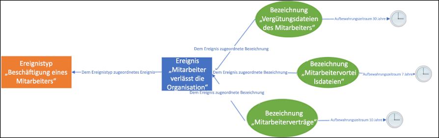
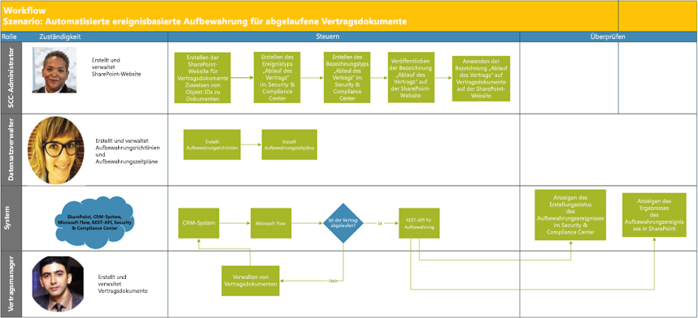

# Automatisieren der ereignisbasierten AufbewahrungAutomate event-based retention

Die explosionsartige Zunahme von Inhalten in Unternehmen und wie erreicht werden kann, dass diese keine Rolle mehr spielt, ist eine ernste Angelegenheit. Um auch weiterhin den Herausforderungen im Zusammenhang mit der Einhaltung gesetzlicher und geschäftlicher Bestimmungen gerecht zu werden, müssen Organisationen in der Lage sein, wichtige Informationen aufzubewahren und zu schützen und schnell herauszufinden, was relevant ist. Die Aufbewahrung ausschließlich wichtiger, relevanter Informationen ist der Schlüssel zum Erfolg einer Organisation.The explosion of content in organizations and how it can become ROT (redundant, obsolete, trivial) is serious business. To continue to meet legal, business, and regulatory compliance challenges, organizations must be able to keep and protect important information and quickly find what’s relevant. Retaining only important, pertinent information is key to an organization's success.

Um dieser Anforderung gerecht zu werden, können Unternehmen die Aufbewahrungslösungen im Office 365 Security & Compliance Center nutzen. Aufbewahrung kann mithilfe von [Aufbewahrungsbezeichnungen](labels.md) ausgelöst werden. Eine Aufbewahrungsbezeichnung kann als [Grundlage für den Aufbewahrungszeitraum für ein bestimmtes Ereignis](event-driven-retention.md) dienen. In der Regel basiert der Aufbewahrungszeitraum auf einem bekannten Datum, z. B. dem Erstellungsdatum oder dem Datum der letzten Änderung der Inhalte. Unternehmen müssen jedoch auch Inhalte aufgrund des Eintretens eines Ereignisses entfernen, zum Beispiel 7 Jahre nach dem Austritt eines Mitarbeiters aus dem Unternehmen.To help meet this need, organizations can take advantage of retention solutions in the Office 365 Security & Compliance Center. Retention can be triggered by using [retention labels](labels.md). A retention label has the option to [base the retention period on a specific event](event-driven-retention.md). Typically, the retention period is based on a known date, such as the creation date or last modified date for the content. However, organizations also have requirements to dispose of content based on the occurrence of an event, such as seven years after an employee leaves an organization.

Um ein ordnungsgemäßes Entfernen der Inhalte sicherzustellen, ist es zwingend erforderlich zu wissen, wann ein Ereignis eintritt. Da die Inhaltsmenge rasant zunimmt, wird es immer schwieriger, Inhalte zeitnah und ordnungsgemäß aufzubewahren und zu entfernen.To ensure compliant disposal of content, it's imperative to know when an event takes place. With the volume of content increasing rapidly, it's becoming challenging to retain and dispose content in a timely and compliant manner.

Die ereignisbasierte Aufbewahrung stellt eine Lösung für dieses Problem dar. In diesem Thema wird erläutert, wie Sie Geschäftsprozessabläufe über Ereignisse mithilfe der Microsoft 365-REST-API einrichten können, um die Aufbewahrung zu automatisieren.Event-based retention solves this problem. This topic explains how to set up your business process flows to automate retention through events by using the Microsoft 365 REST API.

## Grundlegendes zur ereignisbasierten AufbewahrungAbout event-based retention

Es gibt kleine, mittelständige und Großunternehmen. Die Anzahl der Geschäftsdokumente, Rechtsdokumente, Mitarbeiterdateien, Verträgen und Produktdokumenten, die täglich erstellt und verwaltet werden, nimmt dramatisch zu.An organization can be small, medium, or large. The number of business documents, legal documents, employee files, contracts, and product documents that get created and managed on a day-to-day basis is increasing dramatically.

Zum Beispiel werden täglich Dutzende Mitarbeiter eingestellt, und es verlassen auch Dutzende Mitarbeiter die Unternehmen. Die Personalabteilung erstellt, aktualisiert oder löscht weiterhin mitarbeiterbezogene Dokumente gemäß den Geschäftsanforderungen. Dieser Prozess unterliegt verschiedenen Aufbewahrungsrichtlinien, die für das Unternehmen festgelegt sind:For example, each day, tens and hundreds of employees are joining and leaving organizations. The HR department continues to create, update, or delete employee-related documents as per business requirements. This process is subject to the different retention policies outlined for the business:

- **Der Aufbewahrungszeitraum für die Inhalte kann ein bekanntes Datum sein,** z. B. das Datum, an dem der Inhalt erstellt, zuletzt geändert oder mit einer Bezeichnung versehen wurde. Beispiel: Dokumente werden möglicherweise sieben Jahre lang ab Erstellung aufbewahrt und anschließend gelöscht.**The period of retention for content can be a known date** such as the date the content was created, last modified, or labeled. For example, you might retain documents for seven years after they're created and then delete them.

- **Der Aufbewahrungszeitraum für den Inhalt kann auch ein unbekanntes Datum sein**. Mit Aufbewahrungsbezeichnungen können Sie zum Beispiel als Basis für den Aufbewahrungszeitraum ein bestimmtes Ereignis festlegen, zum Beispiel den Austritt eines Mitarbeiters aus dem Unternehmen.**The period of retention of content can also be an unknown date**. For example, with retention labels, you can also base a retention period on when a specific type of event occurs, such as an employee leaving the organization.

Mit dem Ereignis wird der Anfang des Aufbewahrungszeitraums ausgelöst. Für alle Inhalte mit einer Bezeichnung, die für diese Art des Ereignisses angewendet wurde, werden die Aufbewahrungsmaßnahmen der Bezeichnung erzwungen. Dies wird auch als ereignisbasierte Aufbewahrung bezeichnet. Weitere Informationen hierzu finden Sie unter [Übersicht über die ereignisgesteuerte Aufbewahrung](event-driven-retention.md).The event triggers the start of the retention period, and all content with a label applied for that type of event get the label's retention actions enforced on them. This is called event-based retention. To learn more, see [Overview of event-driven retention](event-driven-retention.md).

## Einrichten der ereignisbasierten AufbewahrungSet up event-based retention

Dieser Abschnitt beinhaltet die für die Aufbewahrung von Inhalten erforderlichen Schritte.This section describes what needs to be done before retaining content.

### Identifizieren von RollenIdentify roles

Identifizieren Sie die verschiedenen Rollen in einem Unternehmen, die Aufgaben für die Datensatzverwaltung ausführen und für eine effektive und effiziente Aufbewahrung von Geschäftsdokumenten verantwortlich sind.Identify the different roles in an organization that perform Record Management tasks and would be responsible for effective and efficient retention of business documents.

  | **Persona****Persona**| **Rolle****Role**|
  | - | - |
  | AdminAdmin | Erstellt Ereignistypen für die Aufbewahrung, Aufbewahrungsbezeichnungen und Repositorys für die Aufbewahrung in SharePoint.Creates Retention Event types, Retention labels and Record repositories in SharePoint |
  | DatensatzverwalterRecords Manager                                  | Stellt Details zur Einhaltung von Aufbewahrungsrichtlinien und Aufbewahrungszeitplänen bereit.Provides Retention Policies and Retention Schedules guidance and compliance details   |
  | Systemadministrator (Unternehmen)System Admin (business)                          | Richtet externe Systeme für die Verwendung mit Microsoft 365 ein, und verwaltet diese.Sets up and manages external systems to work with Microsoft 365                       |
  | Information-WorkerInformation Worker                               | Verwaltet den Lebenszyklus der Geschäftsabläufe (HR, Finanzen, IT usw.).Manages the lifecycle of their business process (HR, Finance, IT, and so on)                 |

### Einrichten des Security & Compliance CenterSet up the Security & Compliance Center
  
1. Der Compliance-Administrator erstellt einen Ereignistyp &ndash;, zum Beispiel Ende der Beschäftigung, Vertragsablauf oder Ende der Produktherstellung.Compliance admin creates an event type &ndash; for example, Employee Termination or Contract Expiration or End of Product Manufacturing. (Eine schrittweise Anleitung finden Sie unter [Ereignisgesteuerte Aufbewahrung](event-driven-retention.md)).(See the step-by-step process in [Event-driven retention](event-driven-retention.md).
    
2. Der Compliance-Administrator erstellt eine Aufbewahrungsbezeichnung auf der Grundlage eines Ereignisses und weist die Bezeichnung einem Ereignistyp zu.Compliance admin creates a retention label based on an event and associates the label with an event type.
    
    Es gibt vier Arten von Auslösern für Aufbewahrungsbezeichnungen:There are four types of triggers for retention labels:
            
    1. ErstellungsdatumCreate date
                
    2. Zuletzt geändertLast modified
                
    3. Datum der Bezeichnung (Zeitpunkt, zu dem die Inhalte mit der Bezeichnung versehen wurden)Label date (when the content was labeled)
                
    4. Ereignis-basiertEvent-based
    
3. Der Compliance-Administrator veröffentlicht die Aufbewahrungsbezeichnung.Compliance admin publishes the retention label.

### Einrichten von SharePointSet up SharePoint
   
Der Compliance-Administrator geht wie folgt vor, um ein Repository für Datensätze zu erstellen:To create a records repository, the compliance admin:

1. Er erstellt eine SharePoint-Website.Creates a SharePoint site.

2. Er führt einen der folgenden Schritte aus:Does one of the following:
        
    - Er erstellt eine SharePoint-Bibliothek: er legt eine ereignisbasierte Bezeichnung auf Bibliotheksebene fest. Weitere Informationen finden Sie unter [Anwenden einer Aufbewahrungsbezeichnung auf alle Inhalte in einer Bibliothek, einem Ordner oder einer Dokumentenmappe in SharePoint](labels.md#applying-a-default-retention-label-to-all-content-in-a-sharepoint-library-folder-or-document-set).Creates a SharePoint library: Set event-based label at the library level. For more information, see [Applying a default retention label to all content in a SharePoint library, folder, or document set](labels.md#applying-a-default-retention-label-to-all-content-in-a-sharepoint-library-folder-or-document-set).
          
    - Richtet eine Dokumentenmappe in SharePoint ein.Sets up a document set in SharePoint. Weitere Informationen finden Sie unter [Einführung in Dokumentenmappen](https://support.office.com/article/3DBCD93E-0BED-46B7-B1BA-B31DE2BCD234).For more information, see [Introduction to document sets](https://support.office.com/article/3DBCD93E-0BED-46B7-B1BA-B31DE2BCD234).
      
3. Weist jeder Dokumentenmappe eines Mitarbeiters eine Objekt-ID zu.Assigns an asset ID to each employee document set. Bei einer Objekt-ID handelt es sich um einen Produktnamen oder Code, der von der Organisation verwendet wird; die Mitarbeiternummer kann z. B. eine Objekt-ID sein.An asset ID is a product name or code used by the organization, for example, Employee number can be an asset ID. Durch Zuweisen der Objekt-ID zum Ordner erbt jedes Element in diesem Ordner automatisch dieselbe Objekt-ID.By assigning the asset ID to the folder, every item in that folder automatically inherits the same asset ID. Dies bedeutet, dass der Aufbewahrungszeitraum aller Elemente durch das gleiche Ereignis ausgelöst werden kann.This means all the items can have their retention period triggered by the same event.

## Möglichkeiten zum Auslösen der ereignisbasierten AufbewahrungWays to trigger event-based retention

Es gibt zwei Möglichkeiten zum Auslösen der ereignisbasierten Aufbewahrung:There are two ways in which event-based retention can be triggered:

- **Verwenden der Benutzeroberfläche des Admin Centers** Dies ist ein Prozess, der verwendet werden kann, um weniger Inhalte gleichzeitig zu speichern, oder wenn Häufigkeit, mit der die Aufbewahrung ausgelöst wird, gering ist, z. B. monatlich oder jährlich.**Using the admin center UI** This is a process that can be used to retain less content at a time or the frequency to trigger retention isn't often, such as monthly or yearly. Weitere Informationen über diese Methode finden Sie unter [Übersicht über die ereignisgesteuerte Aufbewahrung](event-driven-retention.md).For more information about this method, see [Overview of event-driven retention](event-driven-retention.md). Allerdings kann diese Methode des Auslösens der Aufbewahrung zeitaufwändig und fehleranfällig sein, wodurch die Skalierbarkeit eingeschränkt wird.However, this method of triggering retention can be time consuming and prone to error, thus stunting scalability. Daher kann eine automatisierte, nahtlose Lösung zum Auslösen der Aufbewahrung die Datensicherheit und Compliance verbessern.Therefore, an automated, seamless solution to trigger retention can enhance data security and compliance.

- **Mithilfe einer Microsoft 365-REST-API**Dieser Prozess kann verwendet werden, wenn sehr viele Inhalte aufbewahrt werden und/oder die Aufbewahrung häufig ausgelöst wird, zum Beispiel täglich oder wöchentlich. Der Ablauf erkennt, wenn ein Ereignis in Ihrem Branchensystem eintritt, und erstellt automatisch ein zugehöriges Ereignis im Security & Compliance Center. Sie müssen keine Ereignisse in der Benutzeroberfläche manuell erstellen, wenn diese eintreten.**Using a M365 REST API** This process can be used when large amounts of content are to be retained at a time and/or the frequency to trigger retention is often such as daily or weekly. The flow detects when an event occurs in your line-of-business system, and then automatically creates a related event in the Security & Compliance Center. You don't need to manually create an event in the UI each time one occurs.

Es gibt zwei Optionen für die Verwendung der REST-API:There are two options for using the REST API:

- **Microsoft Flow oder eine ähnliche Anwendung** kann verwendet werden, um das Ereignis automatisch auszulösen.**Microsoft Flow or a similar application** can be used to trigger the occurrence of an event automatically. Microsoft Flow ist ein Orchestrator zum Herstellen einer Verbindung zu anderen Systemen.Microsoft Flow is an orchestrator for connecting to other systems. Für die Verwendung von Microsoft Flow ist keine benutzerdefinierte Lösung erforderlich.Using Microsoft Flow doesn't require a custom solution.

- **PowerShell oder ein HTTP-Client zum Aufrufen der REST-API** Sie können PowerShell (Version 6 oder höher) zum Aufrufen der Microsoft 365-REST-API verwenden, um Ereignisse zu erstellen.**PowerShell or an HTTP client to call REST API** Using PowerShell (version 6 or higher) to call Microsoft 365 REST API to create events. 

Bei einer Rest-API handelt es sich um einen Dienstendpunkt, der Gruppen von HTTP-Vorgängen (Methoden) unterstützt, die Zugriff zum Erstellen/Abrufen/Aktualisieren/Löschen der Dienstressourcen bieten.A Rest API is a service endpoint that supports sets of HTTP operations (methods), which provide create/retrieve/update/delete access to the service's resources. Weitere Informationen finden Sie unter [Komponenten einer REST-API-Anfrage/-Anfrage](https://docs.microsoft.com/rest/api/gettingstarted/#components-of-a-rest-api-requestresponse).For more information, see [Components of a REST API request/response](https://docs.microsoft.com/rest/api/gettingstarted/#components-of-a-rest-api-requestresponse). In diesem Fall können mithilfe der Microsoft 365 Rest-API Ereignisse erstellt und mit POST- und GET-Operationen abgerufen werden.In this case, by using the Microsoft 365 REST API, events can be created and retrieved using operations (methods) POST and GET.

## BeispielszenarienExample scenarios

Betrachten Sie die folgenden Szenarien.Let’s consider the following scenarios.

### Scenario 1: Mitarbeiter tritt aus dem Unternehmen ausScenario 1: Employees leaving the organization 

Eine Organisation erstellt und speichert zahlreiche mitarbeiterbezogene Dokumente pro Mitarbeiter.An organization creates and stores numerous employee-related documents per employee. Diese Dokumente werden während der Beschäftigungsdauer jedes Mitarbeiters verwaltet und aufbewahrt.These documents are managed and retained during the employment of each employee. Wenn der Mitarbeiter aber die Organisation verlässt oder das Beschäftigungsverhältnis beendet wird, ist die Organisation gemäß gesetzlicher und geschäftlicher Anforderungen verpflichtet, die Dokumente des Mitarbeiters für einen festgelegten Zeitraum aufzubewahren.However, when the employee leaves the organization or the employment is terminated, the organization is obligated by legal and business requirements to retain the documents of that employee for a stipulated period.

Wenn nun täglich mehrere Mitarbeiter aus dem Unternehmen austreten, muss das Unternehmen die Aufbewahrungszeit von Hunderten, wenn nicht Tausenden von Dokumenten pro Tag auslösen.Now if multiple employees leave the organization every day, the organization must trigger the retention clock of hundreds if not thousands of documents each day.

Darüber hinaus muss für jeden dieser Mitarbeiter die Aufbewahrungsfrist als Datum des Austritts aus dem Unternehmen + Anzahl der Tage, Monate oder Jahre je nach Art des Mitarbeiterdatensatzes berechnet werden.In addition to this, the retention period needs to be calculated for each of these employees as Employee termination date + number of days, months, or years based on the type of the employee record. So kann beispielsweise die Vergütung des Mitarbeiters gegenüber den Leistungsanmeldungen desselben Arbeitnehmers eine unterschiedliche Aufbewahrung erfordern.For example, worker’s compensation of the employee vs. benefits filings of the same employee may need different retention.

Das nachstehende Diagramm zeigt, dass mehrere Beschriftungen vorhanden sein können, die einem einzelnen Ereignis zugeordnet sind.The diagram below shows how there can be multiple labels that are associated with a single event. Hier werden alle Dateien unter der Bezeichnung „Mitarbeitervergütung“ und alle Dateien unter der Bezeichnung „Leistungen“ mit einem einzelnen Ereignis verknüpft, und zwar, dass der Mitarbeiter das Unternehmen verlässt.Here all the files under Worker’s compensation label and all the files under Employee benefits label are both associated with a single event, which is the employee leaving the organization. Jede dieser unterschiedlichen Dateien weist unterschiedliche Aufbewahrungszeitpläne auf.Each of these different files has different retention clocks. Wenn ein Mitarbeiter das Unternehmen verlässt, haben diese Dateien innerhalb der einzelnen Bezeichnungen einen anderen Aufbewahrungszeitraum.So, when an employee leaves the organization, these files within each label experience a different retention period. Das Auslösen dieser unterschiedlichen Aufbewahrungszeitpläne für jeden Dateityp oder jede Bezeichnung für jeden Mitarbeiter ist eine große Herausforderung.Triggering all these different retention clocks for each file type or label for each employee is a very challenging task. Stellen Sie sich vor, dies für mehrere Mitarbeiter auszuführen.Imagine doing this for multiple employees.

Ein automatisierter Prozess zum Auslösen dieser unterschiedlicher Aufbewahrungszeiten für mehrere Mitarbeiter ist daher zeitsparend, fehlerfrei und äußerst effizient.Hence an automated process to trigger these different retention clocks for multiple employees will be time-saving, error-free, and extremely efficient.

**Konfigurieren der automatisierten ereignisbasierten Aufbewahrung für dieses Szenario:****Configuring Automated Event Based Retention for this scenario:**

  - Der Administrator erstellt in der Dokumentenmappe mehrere Mitarbeiterordner, zum Beispiel Jane Doe, John Smith.Admin creates employee folders to the Document set such as Jane Doe, John Smith.

  - Der Administrator fügt zu jedem Mitarbeiterordner mitarbeiterbezogene Dateien hinzu, zum Beispiel Leistungen, Lohn, Vergütung.Admin adds employee files such as Benefits, Payroll, Worker’s Compensation to each employee folder.

  - Der Administrator weist jedem Mitarbeiterordner eine Asset-ID zu.Admin assigns Asset ID to each employee folder. 

  - Der SCC-Administrator meldet sich beim Security & Compliance Center an.SCC Admin logs into the Security & Compliance Center.

  - SCC-Administrator erstellt mitarbeiterbezogene Ereignistypen wie „Beschäftigungsende“, „Einstellung des Mitarbeiters“.SCC Admin creates employee-related events types such as “Employee Termination”, “Employee Hire” events.

  - SCC-Administrator erstellt Bezeichnung „Mitarbeiterbindung“.SCC Admin creates “Employee Retention” label.

  - Diese Bezeichnung wird veröffentlicht und manuell oder automatisch auf die Dateien des Mitarbeiters in SharePoint angewendet.This “Employee Retention” label is published and applied manually or automatically to the employee files in SharePoint.

  - Ein HR-Managementsystem wie Workday kann regelmäßig mit Microsoft Flow verwendet werden, um die Dateien von Mitarbeitern zu verwalten.HR Management System like Workday can work with Microsoft Flow to run periodically to manage employee files.

  - Wenn ein Mitarbeiter aus dem Unternehmen ausgetreten ist, löst der Ablauf die Microsoft 365-REST-API für die ereignisbasierte Aufbewahrung aus, die den Aufbewahrungszeitraum für die Dateien eines bestimmten Mitarbeiters startet.If an employee has left the organization, the Flow will trigger the M365 Event Based Retention REST API that will begin the retention clock on the specific employee’s files.

#### Verwenden von Microsoft FlowUsing Microsoft Flow

Schritt 1: Erstellen eines Ablaufs zum Erstellen einer Ereignisses mithilfe der Microsoft 365-REST-APIStep 1- Create a flow to create an event using the Microsoft 365 REST API

##### Erstellen eines EreignissesCreate an event

Beispielcode zum Aufrufen der REST-APISample code to call the REST API

<table>
<thead>
<tr class="header">
<th>MethodeMethod</th>
<th>POSTPOST</th>
<th></th>
</tr>
</thead>
<tbody>
<tr class="odd">
<td>URLURL</td>
<td>https://ps.compliance.protection.outlook.com/psws/service.svc/ComplianceRetentionEvent</td>
<td></td>
</tr>
<tr class="even">
<td>HeaderHeaders</td>
<td>Content-TypeContent-Type</td>
<td>application/atom+xmlapplication/atom+xml</td>
</tr>
<tr class="odd">
<td>BodyBody</td>
<td>
&lt;?xml version='1.0' encoding='utf-8' standalone='yes'?&gt;&lt;?xml version='1.0' encoding='utf-8' standalone='yes'?&gt;

&lt;entry xmlns:d='https://schemas.microsoft.com/ado/2007/08/dataservices'&lt;entry xmlns:d='https://schemas.microsoft.com/ado/2007/08/dataservices'

xmlns:m='https://schemas.microsoft.com/ado/2007/08/dataservices/metadata'xmlns:m='https://schemas.microsoft.com/ado/2007/08/dataservices/metadata'

xmlns='https://www.w3.org/2005/Atom'&gt;xmlns='https://www.w3.org/2005/Atom'&gt;

&lt;category scheme='https://schemas.microsoft.com/ado/2007/08/dataservices/scheme' term='Exchange.ComplianceRetentionEvent' /&gt;&lt;category scheme='https://schemas.microsoft.com/ado/2007/08/dataservices/scheme' term='Exchange.ComplianceRetentionEvent' /&gt;

&lt;updated&gt;9/9/2017 10:50:00 PM&lt;/updated&gt;&lt;updated&gt;9/9/2017 10:50:00 PM&lt;/updated&gt;

&lt;content type='application/xml'&gt;&lt;content type='application/xml'&gt;

&lt;m:properties&gt;&lt;m:properties&gt;

&lt;d:Name&gt;Employee Termination &lt;/d:Name&gt;&lt;d:Name&gt;Employee Termination &lt;/d:Name&gt;

&lt;d:EventType&gt;99e0ae64-a4b8-40bb-82ed-645895610f56&lt;/d:EventType&gt;&lt;d:EventType&gt;99e0ae64-a4b8-40bb-82ed-645895610f56&lt;/d:EventType&gt;

&lt;d:SharePointAssetIdQuery&gt;1234&lt;/d:SharePointAssetIdQuery&gt;&lt;d:SharePointAssetIdQuery&gt;1234&lt;/d:SharePointAssetIdQuery&gt;

&lt;d:EventDateTime&gt;2018-12-01T00:00:00Z &lt;/d:EventDateTime&gt;&lt;d:EventDateTime&gt;2018-12-01T00:00:00Z &lt;/d:EventDateTime&gt;

&lt;/m:properties&gt;&lt;/m:properties&gt;

&lt;/content&gt;&lt;/content&gt;

&lt;/entry&gt;&lt;/entry&gt;
</td>
<td></td>
</tr>
<tr class="even">
<td>AuthenticationAuthentication</td>
<td>BasicBasic</td>
<td></td>
</tr>
<tr class="odd">
<td>UsernameUsername</td>
<td>“Complianceuser”“Complianceuser”</td>
<td></td>
</tr>
<tr class="even">
<td>PasswordPassword</td>
<td>“Compliancepassword”“Compliancepassword”</td>
<td></td>
</tr>
</tbody>
</table>

##### Verfügbare ParameterAvailable parameters

<table>
<thead>
<tr class="header">
<th><strong>Parameter</strong><strong>Parameters</strong></th>
<th><strong>Beschreibung</strong><strong>Description</strong></th>
<th><strong>Hinweise</strong><strong>Notes</strong></th>
</tr>
</thead>
<tbody>
<tr class="odd">
<td>&lt;d:Name&gt;&lt;/d:Name&gt;&lt;d:Name&gt;&lt;/d:Name&gt;</td>
<td>Geben Sie einen eindeutigen Namen für das Ereignis an.Provide a unique name for the event,</td>
<td>Der Name darf nachfolgende Leerzeichen und die folgenden Zeichen nicht enthalten: % \* \ &amp; &lt; &gt; | # ? , : ;Cannot contain trailing spaces, and the following characters: % \* \ &amp; &lt; &gt; | # ? , : ;</td>
</tr>
<tr class="even">
<td>&lt;d:EventType&gt;&lt;/d:EventType&gt;&lt;d:EventType&gt;&lt;/d:EventType&gt;</td>
<td>Geben Sie den Namen des Ereignistyps (oder GUID) ein.Enter event type name (or Guid),</td>
<td>Beispiel: „Austritt eines Mitarbeiters“. Der Ereignistyp muss mit einer Aufbewahrungsbezeichnung verknüpft sein.Example: “Employee termination”. Event type has to be associated with a retention label.</td>
</tr>
<tr class="odd">
<td>&lt;d:SharePointAssetIdQuery&gt;&lt;/d:SharePointAssetIdQuery&gt;&lt;d:SharePointAssetIdQuery&gt;&lt;/d:SharePointAssetIdQuery&gt;</td>
<td>Geben Sie „ComplianceAssetId:“ und die Mitarbeiter-ID ein.Enter “ComplianceAssetId:” + employee Id</td>
<td>Beispiel:&quot;ComplianceAssetId:12345&quot;Example:&quot;ComplianceAssetId:12345&quot;</td>
</tr>
<tr class="even">
<td>&lt;d:EventDateTime&gt;&lt;/d:EventDateTime&gt;&lt;d:EventDateTime&gt;&lt;/d:EventDateTime&gt;</td>
<td>Datum und Uhrzeit des Ereignisses.Event Date and Time</td>
<td>
Format: jjjj-MM-ttTHH:mm:ssZ, Beispiel:Format: yyyy-MM-ddTHH:mm:ssZ, Example:

2018-12-01T00:00:00Z2018-12-01T00:00:00Z
</td>
</tr>
</tbody>
</table>

##### AntwortcodesResponse codes

| **Antwortcode****Response Code** | **Beschreibung****Description**       |
| ----------------- | --------------------- |
| 302302               | UmleitenRedirect              |
| 201201               | ErstelltCreated               |
| 403403               | Autorisierung fehlgeschlagenAuthorization Failed  |
| 401401               | Authentifizierung fehlgeschlagenAuthentication Failed |

##### Abrufen von Ereignissen basierend auf dem ZeitraumGet Events based on time range

<table>
<thead>
<tr class="header">
<th>MethodeMethod</th>
<th>GETGET</th>
<th></th>
</tr>
</thead>
<tbody>
<tr class="odd">
<td>URLURL</td>
<td><ol start="4" type="1">
<li>
https://ps.compliance.protection.outlook.com/psws/service.svc/ComplianceRetentionEvent?BeginDateTime=2019-01-11&amp;EndDateTime=2019-01-16https://ps.compliance.protection.outlook.com/psws/service.svc/ComplianceRetentionEvent?BeginDateTime=2019-01-11&amp;EndDateTime=2019-01-16
</li>
</ol></td>
<td></td>
</tr>
<tr class="even">
<td>HeaderHeaders</td>
<td>Content-TypeContent-Type</td>
<td>application/atom+xmlapplication/atom+xml</td>
</tr>
<tr class="odd">
<td></td>
<td></td>
<td></td>
</tr>
<tr class="even">
<td>AuthenticationAuthentication</td>
<td>BasicBasic</td>
<td></td>
</tr>
<tr class="odd">
<td>UsernameUsername</td>
<td>“Complianceuser”“Complianceuser”</td>
<td></td>
</tr>
<tr class="even">
<td>PasswordPassword</td>
<td>“Compliancepassword”“Compliancepassword”</td>
<td></td>
</tr>
</tbody>
</table>

##### AntwortcodesResponse codes

| **Antwortcode****Response Code** | **Beschreibung****Description**                   |
| ----------------- | --------------------------------- |
| 200200               | OK, eine Liste der Ereignisse in Atom + XMLOK, A list of events in atom+ xml |
| 404404               | Nicht gefundenNot found                         |
| 302302               | UmleitenRedirect                          |
| 401401               | Autorisierung fehlgeschlagenAuthorization Failed              |
| 403403               | Authentifizierung fehlgeschlagenAuthentication Failed             |

##### Abrufen eines Ereignisses nach IDGet an event by ID

| MethodeMethod         | GETGET   |                      |
| -------------- | ------------------------------------------------------------------------------------------------------------------------------------------------------------------------------------------------------------------------------------------------------------------ | -------------------- |
| URLURL            | [https://ps.compliance.protection.outlook.com/psws/service.svc/ComplianceRetentionEvent(‘174e9a86-74ff-4450-8666-7c11f7730f66’)](https://ps.compliance.protection.outlook.com/psws/service.svc/ComplianceRetentionEvent\('174e9a86-74ff-4450-8666-7c11f7730f66'\))[https://ps.compliance.protection.outlook.com/psws/service.svc/ComplianceRetentionEvent(‘174e9a86-74ff-4450-8666-7c11f7730f66’)](https://ps.compliance.protection.outlook.com/psws/service.svc/ComplianceRetentionEvent\('174e9a86-74ff-4450-8666-7c11f7730f66'\)) |                      |
| HeaderHeader         | Content-TypeContent-Type                                                                                                                                                                                                                                                       | application/atom+xmlapplication/atom+xml |
| AuthenticationAuthentication | BasicBasic                                                                                                                                                                                                                                                              |                      |
| UsernameUsername       | “Complianceuser”“Complianceuser”                                                                                                                                                                                                                                                   |                      |
| PasswordPassword       | “Compliancepassword”“Compliancepassword”                                                                                                                                                                                                                                               |                      |

##### AntwortcodesResponse codes

| **Antwortcode****Response Code** | **Beschreibung****Description**                                      |
| ----------------- | ---------------------------------------------------- |
| 200200               | OK, der Antworttext enthält das Ereignis in Atom + XMLOK, The response body contains the event in atom+xml |
| 404404               | Nicht gefundenNot found                                            |
| 302302               | UmleitenRedirect                                             |
| 401401               | Autorisierung fehlgeschlagenAuthorization Failed                                 |
| 403403               | Authentifizierung fehlgeschlagenAuthentication Failed                                |

##### Abrufen eines Ereignisses anhand des NamensGet an event by name

| MethodeMethod         | GETGET       |                      |
| -------------- | -------------------------------------------------------------------------------------------------------------------------------------------- | -------------------- |
| URLURL            | <https://ps.compliance.protection.outlook.com/psws/service.svc/ComplianceRetentionEvent('EventByRESTPost-2226bfebcc2841a8968ba71f9516b763')> |                      |
| HeaderHeaders        | Content-TypeContent-Type                                                                                                                                 | application/atom+xmlapplication/atom+xml |
| AuthenticationAuthentication | BasicBasic                                                                                                                                        |                      |
| UsernameUsername       | “Complianceuser”“Complianceuser”                                                                                                                             |                      |
| PasswordPassword       | “Compliancepassword”“Compliancepassword”                                                                                                                         |                      |

##### AntwortcodesResponse codes

| **Antwortcode****Response Code** | **Beschreibung****Description**                                      |
| ----------------- | ---------------------------------------------------- |
| 200200               | OK, der Antworttext enthält das Ereignis in Atom + XMLOK, The response body contains the event in atom+xml |
| 404404               | Nicht gefundenNot found                                            |
| 302302               | UmleitenRedirect                                             |
| 401401               | Autorisierung fehlgeschlagenAuthorization Failed                                 |
| 403403               | Authentifizierung fehlgeschlagenAuthentication Failed                                |

#### Verwenden von PowerShell (Version 6 oder höher) oder eines beliebigen HTTP-ClientsUsing PowerShell (ver.6 or higher) or any HTTP client

Schritt 1: Stellen Sie eine Verbindung zu PowerShell her.Step 1: Connect to PowerShell.

Schritt 2: Führen Sie das folgende Skript aus.Step 2: Run the following script.

<table>
<tbody>
<tr class="odd">
<td>
param([string]$baseUri)param([string]$baseUri)

$userName = &quot;UserName&quot;$userName = &quot;UserName&quot;

$password = &quot;Password&quot;$password = &quot;Password&quot;

$securePassword = ConvertTo-SecureString $password -AsPlainText -Force$securePassword = ConvertTo-SecureString $password -AsPlainText -Force

$credentials = New-Object System.Management.Automation.PSCredential($userName, $securePassword)$credentials = New-Object System.Management.Automation.PSCredential($userName, $securePassword)

$EventName=&quot;EventByRESTPost-$(([Guid]::NewGuid()).ToString('N'))&quot;$EventName=&quot;EventByRESTPost-$(([Guid]::NewGuid()).ToString('N'))&quot;

Write-Host &quot;Start to create an event with name: $EventName&quot;Write-Host &quot;Start to create an event with name: $EventName&quot;

$body = &quot;&lt;?xml version='1.0' encoding='utf-8' standalone='yes'?&gt;$body = &quot;&lt;?xml version='1.0' encoding='utf-8' standalone='yes'?&gt;

&lt;entry xmlns:d='https://schemas.microsoft.com/ado/2007/08/dataservices'&lt;entry xmlns:d='https://schemas.microsoft.com/ado/2007/08/dataservices'

xmlns:m='https://schemas.microsoft.com/ado/2007/08/dataservices/metadata'xmlns:m='https://schemas.microsoft.com/ado/2007/08/dataservices/metadata'

xmlns='https://www.w3.org/2005/Atom'&gt;xmlns='https://www.w3.org/2005/Atom'&gt;

&lt;category scheme='https://schemas.microsoft.com/ado/2007/08/dataservices/scheme' term='Exchange.ComplianceRetentionEvent' /&gt;&lt;category scheme='https://schemas.microsoft.com/ado/2007/08/dataservices/scheme' term='Exchange.ComplianceRetentionEvent' /&gt;

&lt;updated&gt;7/14/2017 2:03:36 PM&lt;/updated&gt;&lt;updated&gt;7/14/2017 2:03:36 PM&lt;/updated&gt;

&lt;content type='application/xml'&gt;&lt;content type='application/xml'&gt;

&lt;m:properties&gt;&lt;m:properties&gt;

&lt;d:Name&gt;$EventName&lt;/d:Name&gt;&lt;d:Name&gt;$EventName&lt;/d:Name&gt;

&lt;d:EventType&gt;e823b782-9a07-4e30-8091-034fc01f9347&lt;/d:EventType&gt;&lt;d:EventType&gt;e823b782-9a07-4e30-8091-034fc01f9347&lt;/d:EventType&gt;

&lt;d:SharePointAssetIdQuery&gt;'ComplianceAssetId:123'&lt;/d:SharePointAssetIdQuery&gt;&lt;d:SharePointAssetIdQuery&gt;'ComplianceAssetId:123'&lt;/d:SharePointAssetIdQuery&gt;

&lt;/m:properties&gt;&lt;/m:properties&gt;

&lt;/content&gt;&lt;/content&gt;

&lt;/entry&gt;&quot;&lt;/entry&gt;&quot;

$event = $null$event = $null

trytry

{{

$event = Invoke-RestMethod -Body $body -Method 'POST' -Uri &quot;$baseUri/ComplianceRetentionEvent&quot; -ContentType &quot;application/atom+xml&quot; -Authentication Basic -Credential $credentials -MaximumRedirection 0$event = Invoke-RestMethod -Body $body -Method 'POST' -Uri &quot;$baseUri/ComplianceRetentionEvent&quot; -ContentType &quot;application/atom+xml&quot; -Authentication Basic -Credential $credentials -MaximumRedirection 0

}}

catchcatch

{{

$response = $_.Exception.Response$response = $_.Exception.Response

if($response.StatusCode -eq &quot;Redirect&quot;)if($response.StatusCode -eq &quot;Redirect&quot;)

{{

$url = $response.Headers.Location$url = $response.Headers.Location

Write-Host &quot;redirected to $url&quot;Write-Host &quot;redirected to $url&quot;

$event = Invoke-RestMethod -Body $body -Method 'POST' -Uri $url -ContentType &quot;application/atom+xml&quot; -Authentication Basic -Credential $credentials -MaximumRedirection 0$event = Invoke-RestMethod -Body $body -Method 'POST' -Uri $url -ContentType &quot;application/atom+xml&quot; -Authentication Basic -Credential $credentials -MaximumRedirection 0

}}

}}

$event | fl \*$event | fl \*
</td>
</tr>
</tbody>
</table>

#### Überprüfen der Ausgabe bei beiden OptionenVerify the outcome in both options

Schritt 1: Wechseln Sie zum Security & Compliance Center.Step 1: Go to the Security & Compliance Center.

Schritt 2: Klicken Sie unter **Informationskontrolle** auf **Ereignisse**.Step 2: Select **Events** under **Information governance**.

Schritt 3: Überprüfen Sie, ob das Ereignis erstellt wurde.Step 3: Verify Event has been created.

Ebenso können die aufgeführten Optionen zum Automatisieren der ereignisbasierten Aufbewahrung auch für die folgenden Szenarien verwendet werden.Similarly, the above options to automate event-based retention can be used for the following scenarios as well.

### Szenario 2: Ablauf von VerträgenScenario 2: Contracts Expiring

Eine Organisation kann mehrere Datensätze für einen einzigen Vertrag mit Kunden, Lieferanten und Partnern haben.An organization can have multiple records for a single contract with customers, vendors, and partners. Diese Dokumente können sich in einer Dokumentbibliothek wie SharePoint befinden.These documents can reside in a document library like SharePoint. Das Vertragsende bestimmt den Anfang des Aufbewahrungszeitraums der Dokumente, die dem Vertrag zugeordnet sind.The end of a contract determines the start of the retention period of the documents associated with the contract. So müssen z. B. alle Datensätze im Zusammenhang mit Verträgen fünf Jahre lang ab dem Zeitpunkt aufbewahrt werden, ab dem der Vertrag abläuft.For example, all records related to contracts need to be retained for five years from the time the contract expires. Das Ereignis, das den Aufbewahrungszeitraum von fünf Jahren ausgelöst, ist der Ablauf des Vertrags.The event that triggers the five-year retention period is the expiration of the contract.

Ein CRM-System kann mit Microsoft 365 verwendet werden und die Aufbewahrung für Vertragsdokumente auslösen.A Customer Relationship Management (CRM) system can work with Microsoft 365 and trigger retention of Contract documents

**Konfigurieren der automatisierten ereignisbasierten Aufbewahrung für dieses Szenario:****Configuring Automated Event Based Retention for this scenario:**

  - Der Administrator erstellt eine SharePoint-Bibliothek mit verschiedenen Ordnern für jeden Vertragstyp.Admin creates a SharePoint library with various folders for each contract type.

  - Der Administrator fügt Vertragsdateien zu jedem Vertragsordner hinzu, zum Beispiel Lizenzverträge, Entwicklungsverträge.Admin adds contract files such as License Contracts, Development Contracts to each contract folder.

  - Der Administrator weist jedem Vertragsordner eine Objekt-ID zu.Admin assigns Asset ID to each contract folder.

  - Der SCC-Administrator meldet sich beim Security & Compliance Center an.SCC Admin logs into the Security & Compliance Center.

  - Der SCC-Administrator erstellt vertragsbezogene Ereignisse wie „Erstellung des Vertrags“, „Ablauf des Vertrags“.SCC Admin creates contract-related events types such as “Contract Creation”, “Contract Expiration” events.

  - Der SCC-Administrator erstellt die Bezeichnung „Vertragsende“.SCC Admin creates “Contract Expiration” label.

  - Diese Bezeichnung wird veröffentlicht und manuell oder automatisch auf die Vertragsdateien in SharePoint angewendet.This “ Contract Expiration” label is published and applied manually or automatically to the contract files in SharePoint.

  - Ein Vertragsmanagementsystem kann mit Microsoft Flow oder einer ähnlichen Anwendung regelmäßig verwendet werden, um Vertragsdateien zu verwalten.Contract Management System can work with Microsoft Flow or a similar application to run periodically to manage contract files.

  - Wenn ein Vertrag abläuft, löst Microsoft Flow die Microsoft 365-REST-API für die ereignisbasierte Aufbewahrung aus, die den Aufbewahrungszeitraum für die Vertragsdateien startet.If a contract expires, Microsoft Flow will trigger the M365 Event Based Retention REST API that will begin the retention clock on the specific contract’s files.

### Szenario 3: Ende der ProduktherstellungScenario 3: End of Product Manufacturing

Ein Produktionsunternehmen, das verschiedene Produktlinien herstellt, erstellt viele Fertigungsspezifikationen und Preisgestaltungsdokumente. Wenn das Produkt nicht mehr hergestellt wird, müssen alle mit diesem Produkt verknüpften Spezifikationen und Dokumente über einen bestimmten Zeitraum ab Ende der Lebensdauer des Produkts aufbewahrt werden.A manufacturing company that produces different lines of products creates many manufacturing specifications and pricing documents. When the product is no longer manufactured, all specifications and documents linked to this product need to be retained for a specific period after the end of the lifetime of the product.

Ein ERP-System kann mit Microsoft 365 und Microsoft Flow verwendet werden, um die Aufbewahrung auszulösen.An Enterprise Resource Planning (ERP) system can work with Microsoft 365 and Microsoft Flow to trigger retention.

**Konfigurieren der automatisierten ereignisbasierten Aufbewahrung für dieses Szenario:****Configuring Automated Event Based Retention for this scenario:**

  - Der Administrator erstellt in der Dokumentenmappe Produktordner wie Produkt 1, Produkt 2 usw.Admin creates product folders in the Document set such as Product 1, Product 2, and so on.

  - Der Administrator fügt jedem Produktordner Produktdateien hinzu, zum Beispiel Fertigungsspezifikationen, Produktpreisgestaltung, Produktlizenzierung.Admin adds product files such as Manufacturing Specifications, Product Pricing, Product licensing to each product folder.

  - Der Administrator weist jedem Produktordner eine Objekt-ID zu.Admin assigns Asset ID to each product folder.

  - Der SCC-Administrator meldet sich beim Security & Compliance Center an.SCC Admin logs into the Security & Compliance Center.

  - Der SCC-Administrator erstellt produktbezogene Ereignistypen, zum Beispiel „Beginn der Produktherstellung“, „Ende der Produktherstellung“.SCC Admin creates employee-related events types such as “Start of Product Manufacturing”, “End of Product Manufacturing” events.

  - Der SCC-Administrator erstellt die Bezeichnung „Ende der Produktherstellung“.SCC Admin creates “End of Product Manufacturing” label.

  - Diese Bezeichnung wird veröffentlicht und manuell oder automatisch auf die Produktdateien in SharePoint angewendet.This “ End of Product Manufacturing” label is published and applied manually or automatically to the product files in SharePoint.

  - ERP-Systeme können mit Microsoft Flow oder ähnlichen Anwendungen regelmäßig verwendet werden, um Produktdateien zu verwalten.ERP Systems can work with Microsoft Flow or similar applications to run periodically to manage product files.

  - Wenn die Herstellung eines Produkts endet, löst Microsoft Flow die Microsoft 365-REST-API für die ereignisbasierte Aufbewahrung aus, die den Aufbewahrungszeitraum für die Produktdateien startet.If the manufacturing of a product ends, Microsoft Flow will trigger the M365 Event Based Retention REST API that will begin the retention clock on the specific product’s files.

## AnhangAppendix

### Verwenden der Redirect 302-Antwortergebnisse zum Aufrufen der REST-APIUsing Redirect 302 response results to call the REST API

1. Rufen Sie einen POST-Aufbewahrungsereignisaufruf mithilfe der REST-API-URL auf <https://ps.compliance.protection.outlook.com/psws/service.svc/ComplianceRetentionEvent> (globale Administratorrechte sind erforderlich).Invoke a POST retention event call using the REST API URL <https://ps.compliance.protection.outlook.com/psws/service.svc/ComplianceRetentionEvent> (Global Admin permissions are required)

2. Überprüfen Sie den Antwortcode. Wenn dies 302 ist, rufen Sie die Umleitungs-URL aus der Location-Eigenschaft des Antwortheaders ab.Check the response code. If it’s 302, then get the redirected URL from Location property of the response header

3. Rufen Sie den POST-Aufbewahrungsereignisaufruf erneut mithilfe der Umleitungs-URL auf.Invoke the POST retention event call again using the redirected URL.

## MitwirkendeCredits

Dieses Thema wurde von überprüft von:This topic was reviewed by:

Antonio MaioAntonio Maio MVP für Microsoft Office-Apps und -DiensteMicrosoft Office Apps and Services MVP  Antonio.Maio@Protiviti.comAntonio.Maio@Protiviti.com
