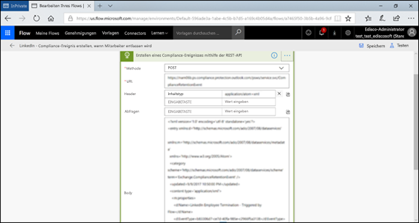

# <a name="automate-event-based-retention"></a>Automatisieren der ereignisbasierten Aufbewahrung

>*[Microsoft 365-Lizenzierungsleitfaden für Sicherheit und Compliance](https://aka.ms/ComplianceSD).*

The explosion of content in organizations and how it can become ROT (redundant, obsolete, trivial) is serious business. To continue to meet legal, business, and regulatory compliance challenges, organizations must be able to keep and protect important information and quickly find what’s relevant. Retaining only important, pertinent information is key to an organization's success.

To help meet this need, organizations can take advantage of retention solutions in the Office 365 Security & Compliance Center. Retention can be triggered by using [retention labels](labels.md). A retention label has the option to [base the retention period on a specific event](event-driven-retention.md). Typically, the retention period is based on a known date, such as the creation date or last modified date for the content. However, organizations also have requirements to dispose of content based on the occurrence of an event, such as seven years after an employee leaves an organization.

To ensure compliant disposal of content, it's imperative to know when an event takes place. With the volume of content increasing rapidly, it's becoming challenging to retain and dispose content in a timely and compliant manner.

Event-based retention solves this problem. This topic explains how to set up your business process flows to automate retention through events by using the Microsoft 365 REST API.

## <a name="about-event-based-retention"></a>Grundlegendes zur ereignisbasierten Aufbewahrung

An organization can be small, medium, or large. The number of business documents, legal documents, employee files, contracts, and product documents that get created and managed on a day-to-day basis is increasing dramatically.

For example, each day, tens and hundreds of employees are joining and leaving organizations. The HR department continues to create, update, or delete employee-related documents as per business requirements. This process is subject to the different retention policies outlined for the business:

- **The period of retention for content can be a known date** such as the date the content was created, last modified, or labeled. For example, you might retain documents for seven years after they're created and then delete them.

- **The period of retention of content can also be an unknown date**. For example, with retention labels, you can also base a retention period on when a specific type of event occurs, such as an employee leaving the organization.

The event triggers the start of the retention period, and all content with a label applied for that type of event get the label's retention actions enforced on them. This is called event-based retention. To learn more, see [Overview of event-driven retention](event-driven-retention.md).

## <a name="set-up-event-based-retention"></a>Einrichten der ereignisbasierten Aufbewahrung

Dieser Abschnitt beinhaltet die für die Aufbewahrung von Inhalten erforderlichen Schritte.

### <a name="identify-roles"></a>Identifizieren von Rollen

Identifizieren Sie die verschiedenen Rollen in einem Unternehmen, die Aufgaben für die Datensatzverwaltung ausführen und für eine effektive und effiziente Aufbewahrung von Geschäftsdokumenten verantwortlich sind.

  | Persona | Rolle |
  | - | - |
  | Administrator | Erstellt Ereignistypen für die Aufbewahrung, Aufbewahrungsbezeichnungen und Repositorys für die Aufbewahrung in SharePoint. |
  | Datensatzverwalter                                  | Stellt Details zur Einhaltung von Aufbewahrungsrichtlinien und Aufbewahrungszeitplänen bereit.   |
  | Systemadministrator (Unternehmen)                          | Richtet externe Systeme für die Verwendung mit Microsoft 365 ein, und verwaltet diese.                       |
  | Information-Worker                               | Verwaltet den Lebenszyklus der Geschäftsabläufe (HR, Finanzen, IT usw.).                 |

### <a name="set-up-the-security--compliance-center"></a>Einrichten des Security & Compliance Center
  
1. Der Compliance-Administrator erstellt einen Ereignistyp &ndash;, zum Beispiel Ende der Beschäftigung, Vertragsablauf oder Ende der Produktherstellung. (Eine schrittweise Anleitung finden Sie unter [Ereignisgesteuerte Aufbewahrung](event-driven-retention.md)).
    
2. Der Compliance-Administrator erstellt eine Aufbewahrungsbezeichnung auf der Grundlage eines Ereignisses und weist die Bezeichnung einem Ereignistyp zu.
    
    Es gibt vier Arten von Auslösern für Aufbewahrungsbezeichnungen:
            
    1. Erstellungsdatum
                
    2. Zuletzt geändert
                
    3. Datum der Bezeichnung (Zeitpunkt, zu dem die Inhalte mit der Bezeichnung versehen wurden)
                
    4. Ereignis-basiert
    
3. Der Compliance-Administrator veröffentlicht die Aufbewahrungsbezeichnung.

### <a name="set-up-sharepoint"></a>Einrichten von SharePoint
   
Der Compliance-Administrator geht wie folgt vor, um ein Repository für Datensätze zu erstellen:

1. Er erstellt eine SharePoint-Website.

2. Er führt einen der folgenden Schritte aus:
        
   - Creates a SharePoint library: Set event-based label at the library level. For more information, see [Applying a default retention label to all content in a SharePoint library, folder, or document set](labels.md#applying-a-default-retention-label-to-all-content-in-a-sharepoint-library-folder-or-document-set).
          
   - Richtet eine Dokumentenmappe in SharePoint ein. Weitere Informationen finden Sie unter [Einführung in Dokumentenmappen](https://support.microsoft.com/de-DE/office/introduction-to-document-sets-3dbcd93e-0bed-46b7-b1ba-b31de2bcd234).
      
3. Weist jeder Dokumentenmappe eines Mitarbeiters eine Objekt-ID zu. Bei einer Objekt-ID handelt es sich um einen Produktnamen oder Code, der von der Organisation verwendet wird; die Mitarbeiternummer kann z. B. eine Objekt-ID sein. Durch Zuweisen der Objekt-ID zum Ordner erbt jedes Element in diesem Ordner automatisch dieselbe Objekt-ID. Dies bedeutet, dass der Aufbewahrungszeitraum aller Elemente durch das gleiche Ereignis ausgelöst werden kann.

## <a name="ways-to-trigger-event-based-retention"></a>Möglichkeiten zum Auslösen der ereignisbasierten Aufbewahrung

Es gibt zwei Möglichkeiten zum Auslösen der ereignisbasierten Aufbewahrung:

- **Verwenden der Benutzeroberfläche des Admin Centers** Dies ist ein Prozess, der verwendet werden kann, um weniger Inhalte gleichzeitig zu speichern, oder wenn Häufigkeit, mit der die Aufbewahrung ausgelöst wird, gering ist, z. B. monatlich oder jährlich. Weitere Informationen über diese Methode finden Sie unter [Übersicht über die ereignisgesteuerte Aufbewahrung](event-driven-retention.md). Allerdings kann diese Methode des Auslösens der Aufbewahrung zeitaufwändig und fehleranfällig sein, wodurch die Skalierbarkeit eingeschränkt wird. Daher kann eine automatisierte, nahtlose Lösung zum Auslösen der Aufbewahrung die Datensicherheit und Compliance verbessern.

- **Using a M365 REST API** This process can be used when large amounts of content are to be retained at a time and/or the frequency to trigger retention is often such as daily or weekly. The flow detects when an event occurs in your line-of-business system, and then automatically creates a related event in the Security & Compliance Center. You don't need to manually create an event in the UI each time one occurs.

Es gibt zwei Optionen für die Verwendung der REST-API:

- **Microsoft Flow oder eine ähnliche Anwendung** kann verwendet werden, um das Ereignis automatisch auszulösen. Microsoft Flow ist ein Orchestrator zum Herstellen einer Verbindung zu anderen Systemen. Für die Verwendung von Microsoft Flow ist keine benutzerdefinierte Lösung erforderlich.

- **PowerShell oder ein HTTP-Client zum Aufrufen der REST-API** Sie können PowerShell (Version 6 oder höher) zum Aufrufen der Microsoft 365-REST-API verwenden, um Ereignisse zu erstellen. 

Bei einer Rest-API handelt es sich um einen Dienstendpunkt, der Gruppen von HTTP-Vorgängen (Methoden) unterstützt, die Zugriff zum Erstellen/Abrufen/Aktualisieren/Löschen der Dienstressourcen bieten. Weitere Informationen finden Sie unter [Komponenten einer REST-API-Anfrage/-Anfrage](https://docs.microsoft.com/rest/api/gettingstarted/#components-of-a-rest-api-requestresponse). In diesem Fall können mithilfe der Microsoft 365 Rest-API Ereignisse erstellt und mit POST- und GET-Operationen abgerufen werden.

## <a name="example-scenarios"></a>Beispielszenarien

Betrachten Sie die folgenden Szenarien.

### <a name="scenario-1-employees-leaving-the-organization"></a>Scenario 1: Mitarbeiter tritt aus dem Unternehmen aus 

Eine Organisation erstellt und speichert zahlreiche mitarbeiterbezogene Dokumente pro Mitarbeiter. Diese Dokumente werden während der Beschäftigungsdauer jedes Mitarbeiters verwaltet und aufbewahrt. Wenn der Mitarbeiter aber die Organisation verlässt oder das Beschäftigungsverhältnis beendet wird, ist die Organisation gemäß gesetzlicher und geschäftlicher Anforderungen verpflichtet, die Dokumente des Mitarbeiters für einen festgelegten Zeitraum aufzubewahren.

Wenn nun täglich mehrere Mitarbeiter aus dem Unternehmen austreten, muss das Unternehmen die Aufbewahrungszeit von Hunderten, wenn nicht Tausenden von Dokumenten pro Tag auslösen.

Darüber hinaus muss für jeden dieser Mitarbeiter die Aufbewahrungsfrist als Datum des Austritts aus dem Unternehmen + Anzahl der Tage, Monate oder Jahre je nach Art des Mitarbeiterdatensatzes berechnet werden. So kann beispielsweise die Vergütung des Mitarbeiters gegenüber den Leistungsanmeldungen desselben Arbeitnehmers eine unterschiedliche Aufbewahrung erfordern.

Das nachstehende Diagramm zeigt, dass mehrere Beschriftungen vorhanden sein können, die einem einzelnen Ereignis zugeordnet sind. Hier werden alle Dateien unter der Bezeichnung „Mitarbeitervergütung“ und alle Dateien unter der Bezeichnung „Leistungen“ mit einem einzelnen Ereignis verknüpft, und zwar, dass der Mitarbeiter das Unternehmen verlässt. Jede dieser unterschiedlichen Dateien weist unterschiedliche Aufbewahrungszeitpläne auf. Wenn ein Mitarbeiter das Unternehmen verlässt, haben diese Dateien innerhalb der einzelnen Bezeichnungen einen anderen Aufbewahrungszeitraum. Das Auslösen dieser unterschiedlichen Aufbewahrungszeitpläne für jeden Dateityp oder jede Bezeichnung für jeden Mitarbeiter ist eine große Herausforderung. Stellen Sie sich vor, dies für mehrere Mitarbeiter auszuführen.


Ein automatisierter Prozess zum Auslösen dieser unterschiedlicher Aufbewahrungszeiten für mehrere Mitarbeiter ist daher zeitsparend, fehlerfrei und äußerst effizient.

**Konfigurieren der automatisierten ereignisbasierten Aufbewahrung für dieses Szenario:**


  - Der Administrator erstellt in der Dokumentenmappe mehrere Mitarbeiterordner, zum Beispiel Jane Doe, John Smith.

  - Der Administrator fügt zu jedem Mitarbeiterordner mitarbeiterbezogene Dateien hinzu, zum Beispiel Leistungen, Lohn, Vergütung.

  - Der Administrator weist jedem Mitarbeiterordner eine Asset-ID zu. 

  - Der SCC-Administrator meldet sich beim Security & Compliance Center an.

  - SCC-Administrator erstellt mitarbeiterbezogene Ereignistypen wie „Beschäftigungsende“, „Einstellung des Mitarbeiters“.

  - SCC-Administrator erstellt Bezeichnung „Mitarbeiterbindung“.

  - Diese Bezeichnung wird veröffentlicht und manuell oder automatisch auf die Dateien des Mitarbeiters in SharePoint angewendet.

  - Ein HR-Managementsystem wie Workday kann regelmäßig mit Microsoft Flow verwendet werden, um die Dateien von Mitarbeitern zu verwalten.

  - Wenn ein Mitarbeiter aus dem Unternehmen ausgetreten ist, löst der Ablauf die Microsoft 365-REST-API für die ereignisbasierte Aufbewahrung aus, die den Aufbewahrungszeitraum für die Dateien eines bestimmten Mitarbeiters startet.

#### <a name="using-microsoft-flow"></a>Verwenden von Microsoft Flow

Schritt 1: Erstellen eines Ablaufs zum Erstellen einer Ereignisses mithilfe der Microsoft 365-REST-API




##### <a name="create-an-event"></a>Erstellen eines Ereignisses

Beispielcode zum Aufrufen der REST-API:

- **Method**: POST
- **URL**: `https://ps.compliance.protection.outlook.com/psws/service.svc/ComplianceRetentionEvent`
- **Headers**: Key = Content-Type, Value = application/atom+xml
- **Body**:
    
    ```xml
    <?xml version='1.0' encoding='utf-8' standalone='yes'?>
    
    <entry xmlns:d='http://schemas.microsoft.com/ado/2007/08/dataservices'
    
    xmlns:m='http://schemas.microsoft.com/ado/2007/08/dataservices/metadata'
    
    xmlns='http://www.w3.org/2005/Atom'>
    
    <category scheme='http://schemas.microsoft.com/ado/2007/08/dataservices/scheme' term='Exchange.ComplianceRetentionEvent' />
    
    <updated>9/9/2017 10:50:00 PM</updated>
    
    <content type='application/xml'>
    
    <m:properties>
    
    <d:Name>Employee Termination </d:Name>
    
    <d:EventType>99e0ae64-a4b8-40bb-82ed-645895610f56</d:EventType>
    
    <d:SharePointAssetIdQuery>1234</d:SharePointAssetIdQuery>
    
    <d:EventDateTime>2018-12-01T00:00:00Z </d:EventDateTime>
    
    </m:properties>
    
    </content>
    
    </entry>
    ```
- **Authentication**: Basic
- **Username**: "Complianceuser"
- **Password**: "Compliancepassword"


##### <a name="available-parameters"></a>Verfügbare Parameter


|Parameter|Beschreibung|Anmerkungen|
|--- |--- |--- |
|<d:Name></d:Name>|Geben Sie einen eindeutigen Namen für das Ereignis an.|Der Name darf nachfolgende Leerzeichen und die folgenden Zeichen nicht enthalten: % * \ & < \> \| # ? , : ;|
|<d:EventType></d:EventType>|Geben Sie den Namen des Ereignistyps (oder GUID) ein.|Example: “Employee termination”. Event type has to be associated with a retention label.|
|<d:SharePointAssetIdQuery></d:SharePointAssetIdQuery>|Geben Sie "ComplianceAssetId:" + Mitarbeiter-ID ein|Beispiel: "ComplianceAssetId:12345"|
|<d:EventDateTime></d:EventDateTime>|Datum und Uhrzeit des Ereignisses|Format: jjjj-MM-ttTHH:mm:ssZ, Beispiel: 2018-12-01T00:00:00Z
|

##### <a name="response-codes"></a>Antwortcodes

| Antwortcode | Beschreibung       |
| ----------------- | --------------------- |
| 302               | Umleiten              |
| 201               | Erstellt               |
| 403               | Autorisierung fehlgeschlagen  |
| 401               | Authentifizierung fehlgeschlagen |

##### <a name="get-events-based-on-time-range"></a>Abrufen von Ereignissen basierend auf dem Zeitraum

- **Method**: GET

- **URL**: `https://ps.compliance.protection.outlook.com/psws/service.svc/ComplianceRetentionEvent?BeginDateTime=2019-01-11&EndDateTime=2019-01-16`

- **Headers**: Key = Content-Type, Value = application/atom+xml

- **Authentication**: Basic

- **Username**: "Complianceuser"

- **Password**: "Compliancepassword"


##### <a name="response-codes"></a>Antwortcodes

| Antwortcode | Beschreibung                   |
| ----------------- | --------------------------------- |
| 200               | OK, eine Liste der Ereignisse in Atom + XML |
| 404               | Nicht gefunden                         |
| 302               | Umleiten                          |
| 401               | Autorisierung fehlgeschlagen              |
| 403               | Authentifizierung fehlgeschlagen             |

##### <a name="get-an-event-by-id"></a>Abrufen eines Ereignisses nach ID

- **Method**: GET

- **URL**: `https://ps.compliance.protection.outlook.com/psws/service.svc/ComplianceRetentionEvent('174e9a86-74ff-4450-8666-7c11f7730f66')`

- **Headers**: Key = Content-Type, Value = application/atom+xml

- **Authentication**: Basic

- **Username**: "Complianceuser"

- **Password**: "Compliancepassword"


##### <a name="response-codes"></a>Antwortcodes

| Antwortcode | Beschreibung                                      |
| ----------------- | ---------------------------------------------------- |
| 200               | OK, der Antworttext enthält das Ereignis in Atom + XML |
| 404               | Nicht gefunden                                            |
| 302               | Umleiten                                             |
| 401               | Autorisierung fehlgeschlagen                                 |
| 403               | Authentifizierung fehlgeschlagen                                |

##### <a name="get-an-event-by-name"></a>Abrufen eines Ereignisses anhand des Namens

- **Method**: GET

- **URL**: `https://ps.compliance.protection.outlook.com/psws/service.svc/ComplianceRetentionEvent`

- **Headers**: Key = Content-Type, Value = application/atom+xml

- **Authentication**: Basic

- **Username**: "Complianceuser"

- **Password**: "Compliancepassword"


##### <a name="response-codes"></a>Antwortcodes

| Antwortcode | Beschreibung                                      |
| ----------------- | ---------------------------------------------------- |
| 200               | OK, der Antworttext enthält das Ereignis in Atom + XML |
| 404               | Nicht gefunden                                            |
| 302               | Umleiten                                             |
| 401               | Autorisierung fehlgeschlagen                                 |
| 403               | Authentifizierung fehlgeschlagen                                |

#### <a name="using-powershell-version-6-or-later-or-any-http-client"></a>Verwenden von PowerShell (Version 6 oder höher) oder eines beliebigen HTTP-Clients

Schritt 1: Stellen Sie eine Verbindung zu PowerShell her.

Schritt 2: Führen Sie das folgende Skript aus.

```powershell
param([string]$baseUri)

$userName = "UserName"

$password = "Password"

$securePassword = ConvertTo-SecureString $password -AsPlainText -Force

$credentials = New-Object System.Management.Automation.PSCredential($userName, $securePassword)

$EventName="EventByRESTPost-$(([Guid]::NewGuid()).ToString('N'))"

Write-Host "Start to create an event with name: $EventName"

$body = "<?xml version='1.0' encoding='utf-8' standalone='yes'?>

<entry xmlns:d='http://schemas.microsoft.com/ado/2007/08/dataservices'

xmlns:m='http://schemas.microsoft.com/ado/2007/08/dataservices/metadata'

xmlns='http://www.w3.org/2005/Atom'>

<category scheme='http://schemas.microsoft.com/ado/2007/08/dataservices/scheme' term='Exchange.ComplianceRetentionEvent' />

<updated>7/14/2017 2:03:36 PM</updated>

<content type='application/xml'>

<m:properties>

<d:Name>$EventName</d:Name>

<d:EventType>e823b782-9a07-4e30-8091-034fc01f9347</d:EventType>

<d:SharePointAssetIdQuery>'ComplianceAssetId:123'</d:SharePointAssetIdQuery>

</m:properties>

</content>

</entry>"

$event = $null

try

{

$event = Invoke-RestMethod -Body $body -Method 'POST' -Uri "$baseUri/ComplianceRetentionEvent" -ContentType "application/atom+xml" -Authentication Basic -Credential $credentials -MaximumRedirection 0

}

catch

{

$response = $_.Exception.Response

if($response.StatusCode -eq "Redirect")

{

$url = $response.Headers.Location

Write-Host "redirected to $url"

$event = Invoke-RestMethod -Body $body -Method 'POST' -Uri $url -ContentType "application/atom+xml" -Authentication Basic -Credential $credentials -MaximumRedirection 0

}

}

$event | fl *

```


#### <a name="verify-the-outcome-in-both-options"></a>Überprüfen der Ausgabe bei beiden Optionen

Schritt 1: Wechseln Sie zum Security & Compliance Center.

Schritt 2: Klicken Sie unter **Informationskontrolle** auf **Ereignisse**.

Schritt 3: Überprüfen Sie, ob das Ereignis erstellt wurde.

Ebenso können die aufgeführten Optionen zum Automatisieren der ereignisbasierten Aufbewahrung auch für die folgenden Szenarien verwendet werden.

### <a name="scenario-2-contracts-expiring"></a>Szenario 2: Ablauf von Verträgen

Eine Organisation kann mehrere Datensätze für einen einzigen Vertrag mit Kunden, Lieferanten und Partnern haben. Diese Dokumente können sich in einer Dokumentbibliothek wie SharePoint befinden. Das Vertragsende bestimmt den Anfang des Aufbewahrungszeitraums der Dokumente, die dem Vertrag zugeordnet sind. So müssen z. B. alle Datensätze im Zusammenhang mit Verträgen fünf Jahre lang ab dem Zeitpunkt aufbewahrt werden, ab dem der Vertrag abläuft. Das Ereignis, das den Aufbewahrungszeitraum von fünf Jahren ausgelöst, ist der Ablauf des Vertrags.

Ein CRM-System kann mit Microsoft 365 verwendet werden und die Aufbewahrung für Vertragsdokumente auslösen.

**Konfigurieren der automatisierten ereignisbasierten Aufbewahrung für dieses Szenario:**


  - Der Administrator erstellt eine SharePoint-Bibliothek mit verschiedenen Ordnern für jeden Vertragstyp.

  - Der Administrator fügt Vertragsdateien zu jedem Vertragsordner hinzu, zum Beispiel Lizenzverträge, Entwicklungsverträge.

  - Der Administrator weist jedem Vertragsordner eine Objekt-ID zu.

  - Der SCC-Administrator meldet sich beim Security & Compliance Center an.

  - Der SCC-Administrator erstellt vertragsbezogene Ereignisse wie „Erstellung des Vertrags“, „Ablauf des Vertrags“.

  - Der SCC-Administrator erstellt die Bezeichnung „Vertragsende“.

  - Diese Bezeichnung wird veröffentlicht und manuell oder automatisch auf die Vertragsdateien in SharePoint angewendet.

  - Ein Vertragsmanagementsystem kann mit Microsoft Flow oder einer ähnlichen Anwendung regelmäßig verwendet werden, um Vertragsdateien zu verwalten.

  - Wenn ein Vertrag abläuft, löst Microsoft Flow die Microsoft 365-REST-API für die ereignisbasierte Aufbewahrung aus, die den Aufbewahrungszeitraum für die Vertragsdateien startet.

### <a name="scenario-3-end-of-product-manufacturing"></a>Szenario 3: Ende der Produktherstellung

A manufacturing company that produces different lines of products creates many manufacturing specifications and pricing documents. When the product is no longer manufactured, all specifications and documents linked to this product need to be retained for a specific period after the end of the lifetime of the product.

Ein ERP-System kann mit Microsoft 365 und Microsoft Flow verwendet werden, um die Aufbewahrung auszulösen.

**Konfigurieren der automatisierten ereignisbasierten Aufbewahrung für dieses Szenario:**


  - Der Administrator erstellt in der Dokumentenmappe Produktordner wie Produkt 1, Produkt 2 usw.

  - Der Administrator fügt jedem Produktordner Produktdateien hinzu, zum Beispiel Fertigungsspezifikationen, Produktpreisgestaltung, Produktlizenzierung.

  - Der Administrator weist jedem Produktordner eine Objekt-ID zu.

  - Der SCC-Administrator meldet sich beim Security & Compliance Center an.

  - Der SCC-Administrator erstellt produktbezogene Ereignistypen, zum Beispiel „Beginn der Produktherstellung“, „Ende der Produktherstellung“.

  - Der SCC-Administrator erstellt die Bezeichnung „Ende der Produktherstellung“.

  - Diese Bezeichnung wird veröffentlicht und manuell oder automatisch auf die Produktdateien in SharePoint angewendet.

  - ERP-Systeme können mit Microsoft Flow oder ähnlichen Anwendungen regelmäßig verwendet werden, um Produktdateien zu verwalten.

  - Wenn die Herstellung eines Produkts endet, löst Microsoft Flow die Microsoft 365-REST-API für die ereignisbasierte Aufbewahrung aus, die den Aufbewahrungszeitraum für die Produktdateien startet.

## <a name="appendix"></a>Anhang

### <a name="using-redirect-302-response-results-to-call-the-rest-api"></a>Verwenden der Redirect 302-Antwortergebnisse zum Aufrufen der REST-API

1. Aufrufen eines POST-Aufbewahrungsereignisaufrufs mithilfe der REST-API-URL: `https://ps.compliance.protection.outlook.com/psws/service.svc/ComplianceRetentionEvent`
    
    Globale Administratorberechtigungen sind erforderlich.

2. Überprüfen Sie den Antwortcode. Wenn dies 302 ist, rufen Sie die Umleitungs-URL aus der Location-Eigenschaft des Antwortheaders ab.

3. Rufen Sie den POST-Aufbewahrungsereignisaufruf erneut mithilfe der Umleitungs-URL auf.

## <a name="credits"></a>Mitwirkende

Dieses Thema wurde von überprüft von:

Antonio Maio<br/>MVP für Microsoft Office-Apps und -Dienste<br/> Antonio.Maio@Protiviti.com
