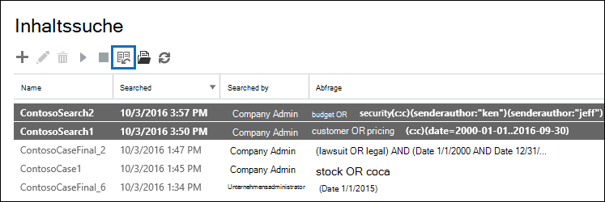
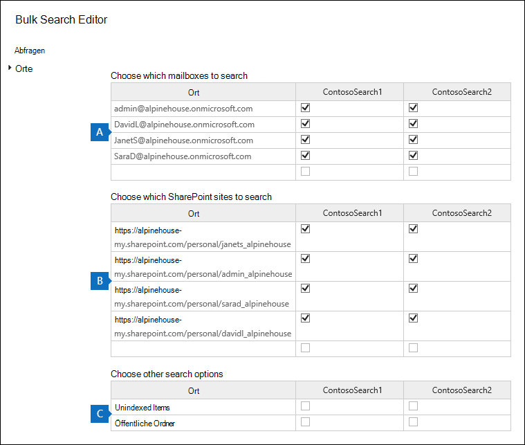

# Massenbearbeitung von Inhaltssuchen

Sie können den Massensuch-Editor im Tool für die Inhaltssuche verwenden, um mehrere Suchen gleichzeitig zu bearbeiten. Mit diesem Tool können Sie die Abfrage- und Inhaltsstandorte für eine oder mehrere Suchabfragen schnell ändern. Anschließend können Sie die Suchläufe erneut ausführen und neue geschätzte Suchergebnisse für die überarbeiteten Suchen erhalten. Mit dem Editor können Sie auch Abfragen und Inhaltspositionen aus einer Microsoft Excel Textdatei kopieren und einfügen. Dies bedeutet, dass Sie das Suchstatistiktool verwenden können, um die Statistiken einer oder mehreren Suchanfragen anzuzeigen und die Statistiken in eine CSV-Datei zu exportieren, in der Sie die Abfragen und Inhaltsorte in einer Excel. Anschließend verwenden Sie den Massensuch-Editor, um den Suchanfragen die überarbeiteten Abfragen und Inhaltsstandorte hinzuzufügen. Nachdem Sie eine oder mehrere Suchergebnisse überarbeitet haben, können Sie sie neu starten und neue geschätzte Suchergebnisse erhalten.
  
Weitere Informationen zur Verwendung des Suchstatistiktools finden Sie unter [View keyword statistics for Content Search results](view-keyword-statistics-for-content-search.md).
  
## Ändern von Abfragen mithilfe des Massensuch-Editors

1. Wechseln Sie [https://protection.office.com](https://protection.office.com) zu , und wählen Sie dann Suche  \> **Inhaltssuche aus.**
    
2. Wählen Sie in der Liste der Suchen eine oder  mehrere Suchen aus, und wählen Sie dann die Schaltfläche Massensuch-Editor-Massensuch-Editor  aus.
    
    
  
    Die folgenden Informationen werden auf der Seite **Abfragen** des Massensuch-Editors angezeigt. 
    
    
  
    a. In **der Spalte Suche** wird der Name der Inhaltssuche angezeigt. Wie bereits erwähnt, können Sie die Abfrage für mehrere Suchabfragen bearbeiten. 
    
    b. In **der Spalte Abfrage** wird die In der Spalte Suche aufgeführte Abfrage für die **Inhaltssuche** angezeigt. Wenn die Abfrage mithilfe des Schlüsselwortlistenfeatures erstellt wurde, werden die Schlüsselwörter durch den Text ** `(c:s)` **getrennt. Dies gibt an, dass die Schlüsselwörter über den **OR-Operator verbunden** sind. Wenn die Abfrage Bedingungen enthält, `(c:c)`** werden die Schlüsselwörter und Bedingungen durch den Text ** getrennt. Dies gibt an, dass die Schlüsselwörter (oder Stichwortphasen) durch den **AND-Operator** mit den Bedingungen verbunden sind. Beispiel: Im vorherigen Screenshot für die Suche ContosoSearch1 ist die KQL-Abfrage  `customer (c:s) pricing(c:c)(date=2000-01-01..2016-09-30)` gleichbedeutend mit  `(customer OR pricing) AND (date=2002-01-01..2016-09-30)` .
    
3. Wählen Sie zum Bearbeiten einer Abfrage in der Zelle der Abfrage aus, die Sie ändern möchten, und tun Sie eines der folgenden Schritte. Die Zelle wird durch ein blaues Feld umrandet, wenn Sie sie auswählen.
    
   - Geben Sie die neue Abfrage in die Zelle ein. Sie können einen Teil der Abfrage nicht bearbeiten. Sie müssen die gesamte Abfrage eingeben.
    
      Oder
    
    - Fügen Sie eine neue Abfrage in die Zelle ein. Dies setzt voraus, dass Sie den Abfragetext aus einer Datei kopiert haben, z. B. aus einer Textdatei oder einer Excel Datei.
    
4. Nachdem Sie eine oder mehrere Abfragen  auf der Seite Abfragen bearbeitet haben, wählen Sie **Speichern aus.**
    
    Die überarbeitete Abfrage wird in der Spalte **Abfrage für** die ausgewählte Suche angezeigt. 
    
5. Wählen **Sie Schließen** aus, um den Massensuch-Editor zu schließen. 
    
6. Wählen Sie **auf der Seite** Inhaltssuche die  von Ihnen bearbeitete Suche aus, und wählen Sie Suche starten aus, um die Suche mithilfe der überarbeiteten Abfrage neu zu starten. 
    
Im Folgenden finden Sie einige Tipps zum Bearbeiten von Abfragen mithilfe des Massensuch-Editors:
  
- Kopieren Sie die vorhandene Abfrage (mithilfe von **STRG C** ) in eine Textdatei. Bearbeiten Sie die Abfrage in der Textdatei, kopieren Sie die überarbeitete Abfrage, und fügen Sie sie (mit **STRG V** ) wieder in die Zelle auf der **Seite Abfragen** ein. 
    
- Sie können auch Abfragen aus anderen Anwendungen kopieren (z. B. Microsoft Word oder Microsoft Excel). Sie können jedoch versehentlich nicht unterstützte Zeichen zu einer Abfrage hinzufügen, indem Sie den Massensuch-Editor verwenden. Die beste Möglichkeit, nicht unterstützte Zeichen zu verhindern, besteht in der Eingabe der Abfrage in einer Zelle auf der **Seite Abfragen.** Sie können auch eine Abfrage aus Word oder Excel kopieren und dann in einen Nur-Text-Editor einfügen, z. B. Microsoft Editor. Speichern Sie dann die Textdatei, und wählen Sie **ANSI** in der Dropdownliste **Codierung** aus. Dadurch werden alle Formatierungen und nicht unterstützten Zeichen entfernt. Anschließend können Sie die Abfrage aus der Textdatei kopieren und in die **Seite Abfragen** einfügen. 
    
  
## Ändern von Inhaltsstandorten mithilfe des Massensuch-Editors

1. Wählen Sie im Massensuch-Editor für eine oder mehrere ausgewählte Suchen  die Option Massenspeicherort-Editor aktivieren aus, und wählen Sie dann den Link Speicherorte aus, der auf der Seite angezeigt wird.  
    
    Die folgenden Informationen werden auf der Seite **Speicherorte** des Massensuch-Editors angezeigt. 
    
    
  
    a. **Zu durchsuchende Postfächer** In diesem Abschnitt werden eine Spalte für jede ausgewählte Inhaltssuche und eine Zeile für jedes Postfach angezeigt, das in der Suche enthalten ist. Ein Häkchen gibt an, dass das Postfach in der Suche enthalten ist. Sie können einer Suche Postfächer hinzufügen, indem Sie die E-Mail-Adresse des Postfachs in eine leere Zeile eingeben und dann das Kontrollkästchen für die Inhaltssuche aktivieren, der Sie es hinzufügen möchten. Sie können auch ein Postfach aus einer Suche entfernen, indem Sie das Kontrollkästchen aktivieren.
    
    b. **SharePoint websites to search** In diesem Abschnitt wird eine Zeile für jede SharePoint und OneDrive angezeigt, die in jeder ausgewählten Inhaltssuche enthalten ist. Ein Häkchen gibt an, dass die Website in der Suche enthalten ist. Sie können einer Suche Websites hinzufügen, indem Sie die URL für die Website in eine leere Zeile eingeben und dann das Kontrollkästchen für die Inhaltssuche aktivieren, der Sie sie hinzufügen möchten. Sie können eine Website auch aus einer Suche entfernen, indem Sie das Kontrollkästchen aktivieren.
    
    c. **Andere Suchoptionen** Dieser Abschnitt gibt an, ob nicht indizierte Elemente und öffentliche Ordner in die Suche einbezogen werden. Stellen Sie sicher, dass das Kontrollkästchen aktiviert ist, um sie zu enthalten. Um sie zu entfernen, aktivieren Sie das Kontrollkästchen.
    
2. Nachdem Sie einen oder mehrere Abschnitte auf  der Seite Speicherorte bearbeitet haben, wählen Sie **Speichern aus.**
    
    Die überarbeiteten Inhaltspositionen werden im entsprechenden Abschnitt für die ausgewählten Suchen angezeigt.
    
3. Wählen **Sie Schließen** aus, um den Massensuch-Editor zu schließen. 
    
4. Wählen Sie **auf der Seite** Inhaltssuche die  von Ihnen bearbeitete Suche aus, und wählen Sie Suche starten aus, um die Suche mithilfe der überarbeiteten Inhaltspositionen neu zu starten. 
    
Im Folgenden finden Sie einige Tipps zum Bearbeiten von Inhaltsstandorten mithilfe des Massensuch-Editors:
  
- Sie können Inhaltssuchen bearbeiten, um alle Postfächer oder Websites in der Organisation  zu durchsuchen,  indem Sie **Alle** in einer leeren Zeile im Abschnitt Postfächer eingeben, um websites zu durchsuchen oder SharePoint zu durchsuchen, und dann das Kontrollkästchen aktivieren. 
    
- Sie können einer oder mehreren Suchen mehrere Inhaltsstandorte hinzufügen, indem Sie mehrere Zeilen aus einer Textdatei oder einer Excel-Datei kopieren und diese dann in einen Abschnitt auf der Seite Speicherorte **einfügen.** Nachdem Sie neue Speicherorte hinzugefügt haben, aktivieren Sie das Kontrollkästchen für jede Suche, der Sie den Speicherort hinzufügen möchten. 
    
    > [!TIP]
    > Führen Sie zum Generieren einer Liste von E-Mail-Adressen für alle Benutzer in Ihrer Organisation den Befehl PowerShell in Schritt 2 in [Schritt 2: Generieren](search-the-mailbox-and-onedrive-for-business-for-a-list-of-users.md#step-2-generate-a-list-of-users)einer Liste von Benutzern aus. Führen Sie auch die Schritte unter Liste aller Benutzer- [OneDrive URLs in](/onedrive/list-onedrive-urls) Ihrer Organisation aus, um eine Liste aller OneDrive for Business in Ihrer Organisation zu generieren. Beachten Sie, dass Sie die URL für die MySite-Domäne Ihrer Organisation anfügen müssen (z. B. an die OneDrive for Business Websites, die vom Skript https://contoso-my.sharepoint.com) erstellt werden. Nachdem Sie eine Liste der E-Mail-Adressen oder OneDrive for Business haben,  können Sie sie kopieren und in die Seite Speicherorte im Massensuch-Editor einfügen. 
  
- Nachdem Sie **Speichern ausgewählt** haben, um Änderungen im Massensuch-Editor zu speichern, wird die E-Mail-Adresse für Postfächer überprüft, die Sie einer Suche hinzugefügt haben. Wenn die E-Mail-Adresse nicht vorhanden ist, wird eine Fehlermeldung angezeigt, dass das Postfach nicht gespeichert werden kann. URLs für Websites werden nicht überprüft. 
