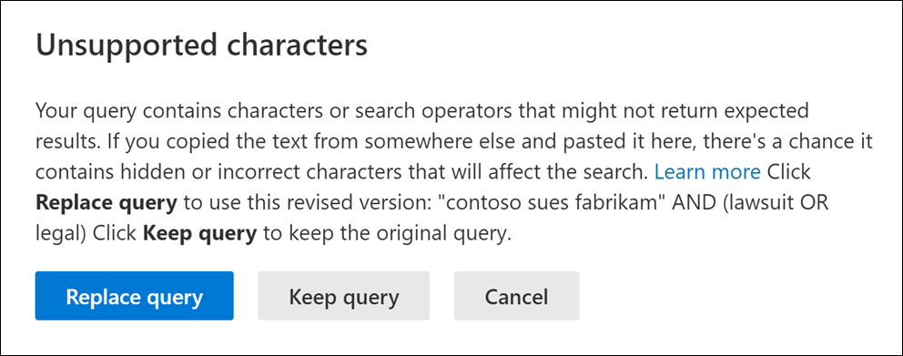

# Überprüfen Ihrer Suchabfrage auf Fehler
  
Hier ist eine Liste der nicht unterstützten Zeichen, die wir in Suchabfragen für die Inhaltssuche und Core eDiscovery suchen. Nicht unterstützte Zeichen werden häufig ausgeblendet und verursachen in der Regel einen Suchfehler oder geben unbeabsichtigte Ergebnisse zurück.
  
- **Intelligente Anführungszeichen** – Intelligente einfache und doppelte Anführungszeichen (auch als geschweifte Anführungszeichen bezeichnet) werden nicht unterstützt. Nur gerade Anführungszeichen können in einer Suchabfrage verwendet werden. 

- **Nicht druckbare Zeichen und Steuerelementzeichen** : Nicht druckbare Zeichen und Steuerelementzeichen stellen kein geschriebenes Symbol dar, z. B. ein alphanumerisches Zeichen. Beispiele für nicht druckbare Zeichen und Steuerzeichen sind Zeichen, die Text formatieren oder Textzeilen trennen. 

- Markierungen von links nach rechts und von rechts nach links **:** Diese Markierungen sind Steuerzeichen, die zum Angeben der Textrichtung für Sprachen von links nach rechts (z. B. Englisch und Spanisch) und von rechts nach links (z. B. Arabisch und Hebräisch) verwendet werden.

- **Boolesche Kleinbuchstabenoperatoren** : Wenn Sie einen booleschen Operator wie **AND**, **OR** und **NOT** in einer Suchabfrage verwenden, muss er Großbuchstaben sein. Wenn wir eine Abfrage auf Tippfehler überprüfen, weist die Abfragesyntax häufig darauf hin, dass ein boolescher Operator verwendet wird, auch wenn Kleinbuchstabenoperatoren verwendet werden können. Beispiel:  `(WordA or WordB) and (WordC or WordD)` .

## Was geschieht, wenn eine Abfrage ein nicht unterstütztes Zeichen hat?

Wenn in Ihrer Abfrage nicht unterstützte Zeichen gefunden werden, wird eine Warnmeldung angezeigt, dass nicht unterstützte Zeichen gefunden wurden, und es wird eine Alternative vorgeschlagen. Anschließend können Sie die ursprüngliche Abfrage behalten oder durch die vorgeschlagene überarbeitete Abfrage ersetzen.

Hier sehen Sie ein Beispiel für die Warnmeldung,  die angezeigt wird, nachdem Sie im vorherigen Screenshot auf Abfrage auf Tippfehler für die Suchabfrage überprüfen geklickt haben. Beachten Sie, dass die ursprüngliche Abfrage intelligente Anführungszeichen und boolesche Kleinbuchstabenoperatoren verwendet.
  

  
## Verhindern nicht unterstützter Zeichen in Suchabfragen

Nicht unterstützte Zeichen werden in der Regel einer Abfrage hinzugefügt, wenn Sie die Abfrage oder Teile der Abfrage aus anderen Anwendungen (z. B. Microsoft Word oder Microsoft Excel) kopieren und in das Schlüsselwortfeld auf der Abfrageseite einer Inhaltssuche einfügen. Die beste Möglichkeit zur Verhinderung nicht unterstützter Zeichen besteht darin, die Abfrage direkt in das Schlüsselwortfeld einzugeben. Sie können auch eine Abfrage aus Word oder Excel kopieren und dann in einen Nur-Text-Editor einfügen, z. B. Microsoft Editor. Speichern Sie die Textdatei, und wählen **Sie INSI** in der **Dropdownliste Codierung** aus. Dadurch werden alle Formatierungen und nicht unterstützten Zeichen entfernt. Anschließend können Sie die Abfrage aus der Textdatei kopieren und im Schlüsselwort-Abfragefeld einfügen.
