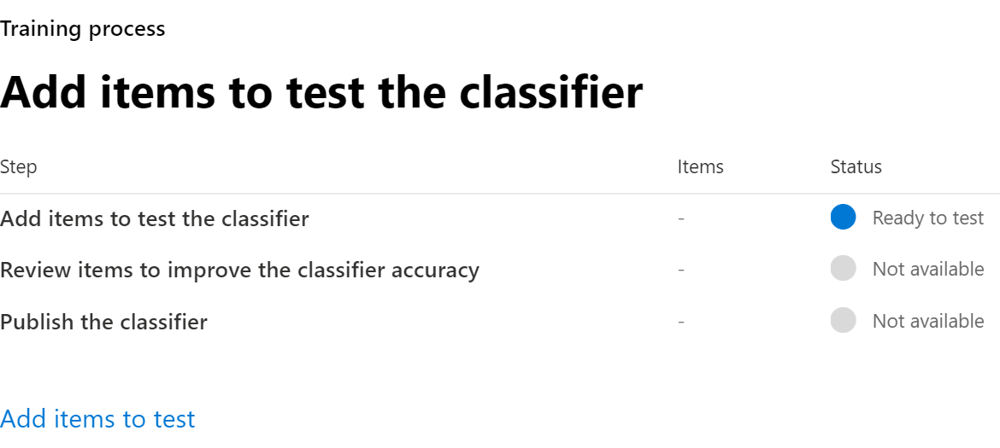

# Erstellen einer Schulungs Klassifizierer (Vorschau)

Verwenden Sie schulungsable Klassifizierungen, wenn eine der Out-of-the-Box-Klassifizierungen Ihren Anforderungen nicht gerecht wird. Eine Microsoft 365-Klassifizierung ist ein Tool, mit dem Sie verschiedene Arten von Inhalten erkennen können, indem Sie sich Beispiele ansehen. Training die Klassifizierung umfasst zunächst Stichproben, die von Menschen ausgewählt werden und der Kategorie positiv entsprechen. Anschließend testen Sie die Vorhersagen, nachdem Sie diese verarbeitet haben, indem Sie eine Mischung aus positiven und negativen Beispielen zuweisen.

Weitere Informationen zu den verschiedenen Klassifizierungstypen finden Sie unter [Erste Schritte mit Lern baren Klassifizierungen (Vorschau)](classifier-getting-started-with.md)

Diese Zeitachse spiegelt eine Beispielbereitstellung wider.

## Seed-Inhalt

Wenn Sie möchten, dass eine Lernende Klassifizierung ein Element in einer bestimmten Inhaltskategorie unabhängig und genau identifiziert, müssen Sie es zunächst mit vielen Beispielen des Inhaltstyps in der Kategorie präsentieren. Diese Fütterung von Proben zur Klassifizierer-Schulung wird als *Seeding*bezeichnet. Seed-Inhalt wird von einem Menschen ausgewählt und wird bewertet, um die Kategorie des Inhalts darzustellen.

> [!TIP]
> Sie benötigen mindestens 50 positive Beispiele und bis zu 500. Die eingestufte Klassifizierung wird bis zu den 500 zuletzt erstellten Beispielen verarbeitet (nach Dateierstellungsdatum/Zeitstempel). Je mehr Beispiele Sie bereitstellen, desto genauer sind die Vorhersagen, die von der Klassifizierung vorgenommen werden.

## Testen von Inhalten

Nachdem die Schulungs fähigen Klassifizierung genügend positive Beispiele zum Erstellen eines Vorhersagemodells verarbeitet hat, müssen Sie die vorher gestellten Voraussagen testen, um zu ermitteln, ob die Klassifizierung ordnungsgemäß zwischen Elementen unterscheiden kann, die der Kategorie und den Elementen entsprechen, die nicht übereinstimmen. Sie tun dies, indem Sie es eine andere, hoffentlich größere, Reihe von Menschen gepflückten Inhalte, die aus Beispielen, die in der Kategorie und Beispiele, die nicht fallen sollte. Nachdem Sie diese verarbeitet haben, gehen Sie die Ergebnisse manuell durch und überprüfen, ob jede Vorhersage korrekt, falsch oder nicht sicher ist. Die Schulungs-Klassifizierung verwendet dieses Feedback, um das Vorhersagemodell zu verbessern.

> [!TIP]
> Optimale Ergebnisse erzielen Sie, wenn Sie 10.000 Elemente in Ihrem Test Beispiel mit einer gleichmäßigen Verteilung positiver und negativer Übereinstimmungen festgelegt haben.

> [!TIP]
> Das Anmelden ist zum ersten Mal für Schulungs orientierte Klassifizierungen erforderlich. Es dauert zwölf Tage, bis Microsoft 365 eine Basisbewertung ihrer organisationsinhalte abgeschlossen hat.

## Vorgehensweise Erstellen einer Schulungs Klassifizierer

1. Sammeln zwischen 50-500-Seed-Inhaltselementen. Hierbei muss es sich nur um Beispiele handeln, die den Typ des Inhalts, den die Lernenden Klassifizierung positiv als in der Kategorie Klassifizierung identifiziert werden soll, stark darstellen. Weitere Informationen finden Sie unter [standardmäßig durchforstete Dateinamenerweiterungen und analysierte Dateitypen in SharePoint Server](https://docs.microsoft.com/sharepoint/technical-reference/default-crawled-file-name-extensions-and-parsed-file-types) für die unterstützten Dateitypen.

> [!IMPORTANT]
> Die Ausgangs-und Test Beispielelemente dürfen nicht verschlüsselt sein und müssen in Englisch sein.

> [!IMPORTANT]
> Stellen Sie sicher, dass die Elemente im seedsatz **starke** Beispiele für die Kategorie sind. Die eingestufte Klassifizierung erstellt zunächst Ihr Modell basierend auf dem, was Sie mit dem Seeding beginnen. Bei der Klassifizierung wird davon ausgegangen, dass alle Seed-Beispiele starke positive Ergebnisse aufweisen und keine Möglichkeit haben zu wissen, ob ein Beispiel einer schwachen oder negativen Übereinstimmung mit der Kategorie entspricht.

2. Platzieren Sie den Ausgangs Inhalt in einem SharePoint Online Ordner, *der ausschließlich für den Inhalt des Seeds*reserviert ist. Notieren Sie sich die Website-, Bibliotheks-und Ordner-URL.

> [!TIP]
> Wenn Sie eine neue Website und einen neuen Ordner für Ihre Seed-Daten erstellen, lassen Sie mindestens eine Stunde für diesen Standort indiziert werden, bevor Sie die Schulungs Klassifizierung erstellen, die diese Startdaten verwendet.

3. Melden Sie sich bei Microsoft 365 Compliance Center mit dem Compliance-Administrator oder der Rolle "Sicherheitsadministrator" an, und öffnen Sie **Microsoft 365 Compliance Center** oder **Microsoft 365 Security Center** > -**Datenklassifizierung** .

4. Klicken Sie auf die Registerkarte **Schulungs Klassifizierung** .

5. Wählen Sie **Create trainable Klassifizierer**aus.

6. Geben Sie die entsprechenden Werte für `Name`die `Description` Felder der Kategorie der Elemente ein, die diese lernbaren Klassifizierung identifizieren sollen.

7. Geben Sie in Schritt 2 die exakte SharePoint Online Website, Bibliothek und Ordner-URL für die Seed-Inhaltswebsite ein. Wählen `Add`Sie aus.

8. Überprüfen Sie die Einstellungen `Create trainable classifier`, und wählen Sie.

9. Innerhalb von 24 Stunden verarbeitet die Schulungs-und Klassifizierungs Stelle die seeddaten und erstellt ein Vorhersagemodell. Der Klassifizierungsstatus ist `In progress` , während er die seeddaten verarbeitet. Wenn die Klassifizierung die Verarbeitung der seeddaten abgeschlossen hat, wird der Status in `Need test items`geändert.

10. Sie können die Seite Details jetzt anzeigen, indem Sie die Klassifizierung auswählen.

11. Sammeln Sie mindestens 200 Testinhalts Elemente. Microsoft empfiehlt 10.000, um optimale Ergebnisse zu erzielen. Dabei muss es sich um eine Mischung von Elementen handeln, die starke positive Ergebnisse aufweisen, starke negative und einige, die in ihrer Natur etwas weniger offensichtlich sind. Weitere Informationen finden Sie unter [standardmäßig durchforstete Dateinamenerweiterungen und analysierte Dateitypen in SharePoint Server](https://docs.microsoft.com/sharepoint/technical-reference/default-crawled-file-name-extensions-and-parsed-file-types) für die unterstützten Dateitypen.

> [!IMPORTANT]
> Die Beispielelemente dürfen nicht verschlüsselt werden und müssen in Englisch sein.

12. Platzieren Sie den Testinhalt in einem SharePoint Online Ordner, *der ausschließlich für den Testinhalt*reserviert ist. Notieren Sie sich die SharePoint Online Website, Bibliothek und Ordner-URL.

> [!TIP]
> Wenn Sie eine neue Website und einen neuen Ordner für Ihre Testdaten erstellen, lassen Sie mindestens eine Stunde für diesen Ort indiziert werden, bevor Sie die Schulungs Klassifizierung erstellen, die diese Startdaten verwendet.

13. Wählen `Add items to test`Sie aus.

14. Geben Sie in Schritt 12 die exakte SharePoint Online Website, Bibliothek und Ordner-URL für die Testinhalts Website ein. Wählen `Add`Sie aus.

15. Beenden Sie den Assistenten, `Done`indem Sie auswählen. Ihre Schulungs-Klassifizierung dauert bis zu einer Stunde, um die Testdateien zu verarbeiten.

16. Wenn die ausbildende Klassifizierung die Verarbeitung Ihrer Testdateien abgeschlossen hat, wird der Status auf der Seite Details in `Ready to review`geändert. Wenn Sie die Größe des testsamples vergrößern möchten, `Add items to test` wählen Sie aus, und lassen Sie die Schulungs-Klassifizierung die zusätzlichen Elemente verarbeiten.

17. Klicken `Tested items to review` Sie auf die Registerkarte, um Elemente zu überprüfen.

18. Microsoft 365 wird 30 Elemente gleichzeitig darstellen. Überprüfen Sie diese, `We predict this item is "Relevant". Do you agree?` und wählen Sie `Yes` im `No` Feld `Not sure, skip to next item`entweder oder oder aus. Die Modellgenauigkeit wird nach jeweils 30 Elementen automatisch aktualisiert.

19. Über *prüfen Sie mindestens 200* Elemente.

20. Überprüfen Sie weiter, bis die Genauigkeit mindestens 70% erreicht und `Publish the classifier` der Status `Ready to use`lautet.

21. Veröffentlichen Sie die Klassifizierung.

22. Nach der Veröffentlichung ist Ihre Klassifizierung als Bedingung in der [Richtlinie für die automatische Beibehaltung von Aufbewahrungs Bezeichnungen verfügbar, die auf einer Bedingung](labels.md#applying-a-retention-label-automatically-based-on-conditions) und in der [Kommunikations Konformität](communication-compliance.md)basiert.

> [!CAUTION]
> Sobald eine Klassifizierung veröffentlicht wurde, kann Sie keine zusätzliche Schulung durchlaufen, daher sollten Sie sicherstellen, dass Sie so viele Elemente wie möglich getestet und überprüft haben, um sicherzustellen, dass die Genauigkeit so hoch wie möglich ist.

## Siehe auch

- [Erste Schritte mit lernbaren Klassifizierungen (Vorschau)](classifier-getting-started-with.md)
- [Standardmäßig durchforstete Dateinamenerweiterungen und analysierte Dateitypen in SharePoint Server](https://docs.microsoft.com/sharepoint/technical-reference/default-crawled-file-name-extensions-and-parsed-file-types)
