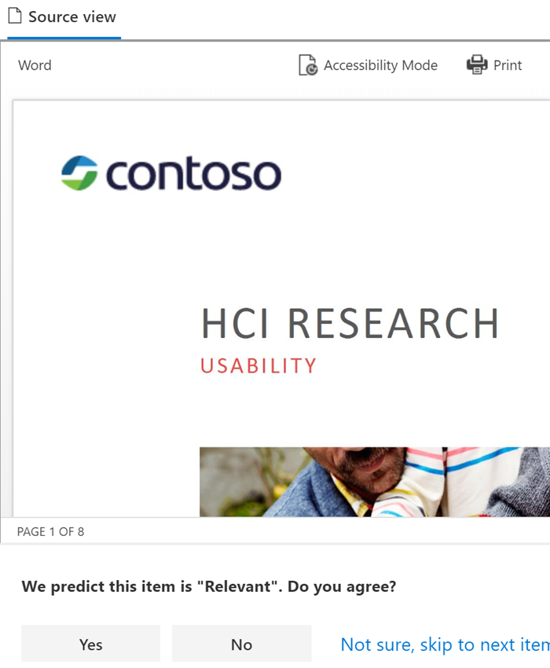

# Erste Schritte mit trainierbaren Klassifizierern

Ein trainierbarer Microsoft 365-Klassifikator ist ein Tool, das Sie schulen können, um verschiedene Arten von Inhalten zu erkennen, indem Sie ihm Beispiele zum Betrachten geben. Nach der Ausbildung können Sie es verwenden, um Elemente für die Anwendung von Office-Vertraulichkeitsbezeichnungen, Kommunikations-Compliancerichtlinien und Aufbewahrungsbezeichnungsrichtlinien zu identifizieren.

Das Erstellen eines benutzerdefinierten trainierbaren Klassifizierungsklassifikierers umfasst zunächst, ihm Beispiele zu geben, die vom Menschen ausgewählt und positiv mit der Kategorie übereinstimmen. Nachdem sie diese verarbeitet haben, testen Sie die Klassifiziererfähigkeit, die vorherzusagen ist, indem Sie ihr eine Mischung aus positiven und negativen Beispielen geben. In diesem Artikel erfahren Sie, wie Sie einen benutzerdefinierten Klassifikator erstellen und schulen und wie Sie die Leistung von benutzerdefinierten trainierbaren Klassifikatoren und vortrainierten Klassifikatoren über ihre Lebensdauer durch Umschulung verbessern.

Weitere Informationen zu den verschiedenen Typen von Klassifizierungen finden Sie [unter Learn about trainable classifiers](classifier-learn-about.md).

Sehen Sie sich dieses Video an, um eine kurze Zusammenfassung des Erstellens eines trainierbaren Klassifizierers zu finden. Sie müssen weiterhin diesen vollständigen Artikel lesen, um die Details zu erhalten.

 

> [!VIDEO https://www.microsoft.com/videoplayer/embed/RWyGL7]

## Voraussetzungen

### Lizenzierungsanforderungen

Klassifizierungen sind ein Microsoft 365 E5- oder E5-Compliancefeature. Sie müssen über eines dieser Abonnements verfügen, um sie nutzen zu können.

### Berechtigungen

So greifen Sie auf Klassifikatoren in der Benutzeroberfläche zu: 

- Der globale Administrator muss sich dafür entscheiden, dass der Mandant benutzerdefinierte Klassifizierungen erstellt.
- Die Rolle "Complianceadministrator" ist erforderlich, um einen Klassifikator zu schulen.

Sie benötigen Konten mit diesen Berechtigungen, um Klassifizierungen in den folgenden Szenarien verwenden zu können:

- Szenario der Aufbewahrungsbezeichnungsrichtlinie: Rollen "Datensatzverwaltung" und "Aufbewahrungsverwaltung" 
- Szenario der Vertraulichkeitsbezeichnungsrichtlinie: Sicherheitsadministrator, Kompatibilitätsadministrator, Compliancedatenadministrator
- Szenario der Kommunikationskonformitätsrichtlinie: Insider Risk Management Admin, Supervisory Review Administrator 

> [!IMPORTANT]
> Standardmäßig kann nur der Benutzer, der einen benutzerdefinierten Klassifikator erstellt, Vorhersagen trainieren und überprüfen, die von diesem Klassifikator vorgenommen wurden.

## Vorbereiten einer benutzerdefinierten trainierbaren Klassifizierung 

Es ist hilfreich zu verstehen, was beim Erstellen eines benutzerdefinierten trainierbaren Klassifizierungsklassifizierers vor dem Eintauchen dabei ist. 

### Zeitachse

Diese Zeitachse spiegelt eine Beispielbereitstellung trainierbarer Klassifizierungen wider.

> [!TIP]
> Das erste Mal ist die Opt-In für trainierbare Klassifizierungen erforderlich. Es dauert zwölf Tage, bis Microsoft 365 eine grundlegende Auswertung der Inhalte Ihrer Organisation abgeschlossen hat. Wenden Sie sich an Ihren globalen Administrator, um den Opt-In-Prozess zu starten.

### Gesamtworkflow

Weitere Informationen zum allgemeinen Workflow zum Erstellen benutzerdefinierter trainierbarer Klassifizierungen finden Sie unter Prozessablauf zum Erstellen von kunden [trainierbaren Klassifizierungen](classifier-learn-about.md#process-flow-for-creating-custom-classifiers).

### Seedinhalt

Wenn ein trainierbarer Klassifikator ein Element unabhängig und präzise als eine bestimmte Kategorie von Inhalten identifizieren soll, müssen Sie es zunächst mit vielen Beispielen des Inhaltstyps in der Kategorie präsentieren. Diese Zufuhr von Beispielen an den trainierbaren Klassifikator wird als *Seeding bezeichnet.* Seedinhalt wird von einem Menschen ausgewählt und als Die Kategorie von Inhalten bewertet.

> [!TIP]
> Sie benötigen mindestens 50 positive Beispiele und bis zu 500. Der trainierbare Klassifikator wird bis zu den 500 zuletzt erstellten Beispielen verarbeiten (nach Datei erstellter Datums-/Zeitstempel). Mit den mehr Beispielen, die Sie bereitstellen, werden die Vorhersagen, die der Klassifikator treffen wird, genauer.

### Testen von Inhalten

Nachdem der trainierbare Klassifikator genügend positive Beispiele zum Erstellen eines Vorhersagemodells verarbeitet hat, müssen Sie die Vorhersagen testen, um zu prüfen, ob der Klassifikator korrekt zwischen Elementen unterscheiden kann, die der Kategorie entsprechen, und Elementen, die nicht übereinstimmen. Wählen Sie dazu einen anderen, hoffentlich größeren Satz von vom Menschen ausgewählten Inhalten aus, der aus Beispielen besteht, die in die Kategorie fallen sollen, und Beispielen, die dies nicht tun. Sie sollten mit anderen Daten als die ursprünglichen Seeddaten testen, die Sie zuerst bereitgestellt haben. Sobald sie diese verarbeitet haben, führen Sie die Ergebnisse manuell durch und überprüfen, ob jede Vorhersage richtig, falsch oder nicht sicher ist. Der trainierbare Klassifikator verwendet dieses Feedback, um sein Vorhersagemodell zu verbessern.

> [!TIP]
> Um die besten Ergebnisse zu erzielen, müssen Sie mindestens 200 Elemente im Testbeispielsatz mit einer gleichmäßigen Verteilung positiver und negativer Übereinstimmungen festlegen.

## Erstellen eines trainierbaren Klassifizierers

1. Sammeln sie zwischen 50 und 500 Seedinhaltselemente. Dabei darf es sich nur um Beispiele handelt, die den Inhaltstyp stark darstellen, den der trainierbare Klassifikator positiv als In der Klassifizierungskategorie identifizieren soll. Unter [Standarddurchforstung von Dateinamenerweiterungen und analysierten Dateitypen in SharePoint Server](https://docs.microsoft.com/sharepoint/technical-reference/default-crawled-file-name-extensions-and-parsed-file-types) finden Sie informationen zu den unterstützten Dateitypen.

   > [!IMPORTANT]
   > Die Seed- und Testbeispielelemente dürfen nicht verschlüsselt sein und müssen in Englisch sein.

   > [!IMPORTANT]
   > Stellen Sie sicher, dass die Elemente in Ihrem Seedset **starke Beispiele** für die Kategorie sind. Der trainierbare Klassifikator erstellt sein Modell zunächst basierend auf dem Seeding. Der Klassifikator geht davon aus, dass alle Seedbeispiele starke positive Ergebnisse sind und keine Möglichkeit hat, zu wissen, ob eine Stichprobe eine schwache oder negative Übereinstimmung mit der Kategorie ist.

2. Platzieren Sie den Seedinhalt in einem SharePoint Online-Ordner, der nur für das Speichern *des Seedinhalts verwendet wird.* Notieren Sie sich die Website-, Bibliotheks- und Ordner-URL.

   > [!TIP]
   > Wenn Sie eine neue Website und einen neuen Ordner für Ihre Seeddaten erstellen, lassen Sie mindestens eine Stunde zeit, bis dieser Speicherort indiziert wird, bevor Sie die trainierbare Klassifizierung erstellen, die diese Seeddaten verwendet.

3. Melden Sie sich beim Microsoft 365 Compliance Center mit Zugriff auf die Rolle des Complianceadministrators oder Sicherheitsadministrators an, und öffnen Sie **Microsoft 365 Compliance Center** oder Microsoft **365 Security Center**  >  **Datenklassifizierung.**

4. Wählen Sie die **Registerkarte Trainable classifiers** aus.

5. Wählen **Sie Trainierbare Klassifizierung erstellen aus.**

6. Geben Sie die entsprechenden Werte für die Felder der Kategorie der Elemente ein, die von `Name` `Description` diesem trainierbaren Klassifizierungstyp identifiziert werden sollen.

7. Wählen Sie in Schritt 2 die SharePoint Online-Website-, Bibliotheks- und Ordner-URL für die Seedinhaltswebsite aus. Wählen Sie `Add` aus.

8. Überprüfen Sie die Einstellungen, und wählen Sie `Create trainable classifier` aus.

9. Innerhalb von 24 Stunden wird der trainierbare Klassifikator die Seeddaten verarbeiten und ein Vorhersagemodell erstellen. Der Klassifizierungsstatus `In progress` ist, während die Seeddaten verarbeitet werden. Wenn der Klassifikator die Verarbeitung der Seeddaten abgeschlossen hat, ändert sich der Status in `Need test items` .

10. Sie können nun die Detailseite anzeigen, indem Sie den Klassifikator auswählen.

    > [!div class="mx-imgBorder"]
    > 

11. Sammeln Sie mindestens 200 Testinhaltselemente (max. 10.000) für optimale Ergebnisse. Dies sollte eine Mischung aus Elementen sein, die starke Positive, starke Negative und einige sind, die in ihrer Natur etwas weniger offensichtlich sind. Unter [Standarddurchforstung von Dateinamenerweiterungen und analysierten Dateitypen in SharePoint Server](https://docs.microsoft.com/sharepoint/technical-reference/default-crawled-file-name-extensions-and-parsed-file-types) finden Sie informationen zu den unterstützten Dateitypen.

    > [!IMPORTANT]
    > Die Beispielelemente dürfen nicht verschlüsselt sein und müssen in Englisch sein.

12. Platzieren Sie den Testinhalt in einem SharePoint Online-Ordner, der nur für das Speichern *der Testinhalte verwendet wird.* Notieren Sie sich die SharePoint Online-Website-, Bibliotheks- und Ordner-URL.

    > [!TIP]
    > Wenn Sie eine neue Website und einen neuen Ordner für Ihre Testdaten erstellen, lassen Sie mindestens eine Stunde zeit, bis dieser Speicherort indiziert wird, bevor Sie den trainierbaren Klassifikator erstellen, der diese Seeddaten verwendet.

13. Wählen Sie `Add items to test` aus.

14. Wählen Sie in Schritt 12 die SharePoint Online-Website-, Bibliotheks- und Ordner-URL für die Testinhaltswebsite aus. Wählen Sie `Add` aus.

15. Beenden Sie den Assistenten, indem Sie `Done` auswählen. Ihre trainierbare Klassifizierung dauert bis zu einer Stunde, um die Testdateien zu verarbeiten.

16. Wenn der trainierbare Klassifikator ihre Testdateien verarbeitet hat, ändert sich der Status auf der Detailseite in `Ready to review` . Wenn Sie die Größe des Testbeispiels erhöhen müssen, wählen Sie den trainierbaren Klassifikator aus, um die `Add items to test` zusätzlichen Elemente zu verarbeiten.

    > [!div class="mx-imgBorder"]
    > 

17. Wählen `Tested items to review` Sie die Registerkarte aus, um Elemente zu überprüfen.

18. Microsoft 365 stellt 30 Elemente gleichzeitig vor. Überprüfen Sie sie, und wählen `We predict this item is "Relevant". Do you agree?` Sie im Feld entweder oder oder `Yes` `No` `Not sure, skip to next item` aus. Die Modellgenauigkeit wird nach allen 30 Elementen automatisch aktualisiert.

    > [!div class="mx-imgBorder"]
    > 

19. Überprüfen *Sie mindestens* 200 Elemente. Sobald sich die Genauigkeitsergebnis stabilisiert hat, wird **die** Veröffentlichungsoption verfügbar, und der Klassifizierungsstatus sagt `Ready to use` .

    > [!div class="mx-imgBorder"]
    > 

20. Veröffentlichen Sie den Klassifizierer.

21. Nach der Veröffentlichung ist Ihr Klassifikator als Bedingung in der automatischen Bezeichnung von [Office](apply-sensitivity-label-automatically.md)mit Vertraulichkeitsbezeichnungen,  automatischer Anwenden einer Aufbewahrungsbezeichnungsrichtlinie basierend auf einer Bedingung und unter Kommunikationskonformität [verfügbar.](communication-compliance.md)
