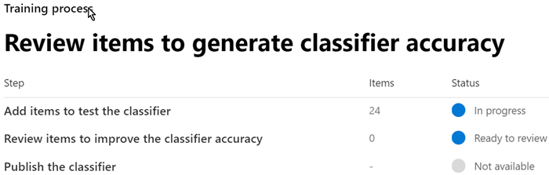

# Erste Schritte mit trainierbaren KlassifizierernGet started with trainable classifiers

Ein Microsoft 365 trainierbarer Klassifizierer ist ein Tool, das Sie trainieren können, um verschiedene Arten von Inhalten zu erkennen, indem Sie ihm Beispiele zum Betrachten geben.A Microsoft 365 trainable classifier is a tool you can train to recognize various types of content by giving it samples to look at. Sobald Sie geschult sind, können Sie damit Elemente für die Anwendung von Office Vertraulichkeitsbezeichnungen, Kommunikationscompliancerichtlinien und Aufbewahrungsbezeichnungsrichtlinien identifizieren.Once trained, you can use it to identify item for application of Office sensitivity labels, Communications compliance policies, and retention label policies.

Zum Erstellen eines benutzerdefinierten trainierbaren Klassifizierers müssen Sie zunächst Beispiele bereitstellen, die vom Menschen ausgewählt und positiv mit der Kategorie übereinstimmen.Creating a custom trainable classifier first involves giving it samples that are human picked and positively match the category. Nachdem diese verarbeitet wurden, testen Sie die Fähigkeit der Klassifizierer, vorherzusagen, indem Sie eine Mischung aus positiven und negativen Stichproben erhalten.Then, after it has processed those, you test the classifiers ability to predict by giving it a mix of positive and negative samples. In diesem Artikel erfahren Sie, wie Sie einen benutzerdefinierten Klassifizierer erstellen und trainieren und die Leistung von benutzerdefinierten trainierbaren Klassifizierern und vorab trainierten Klassifizierern während ihrer Lebensdauer durch Umschulung verbessern.This article shows you how to create and train a custom classifier and how to improve the performance of custom trainable classifiers and pre-trained classifiers over their lifetime through retraining.

Weitere Informationen zu den verschiedenen Typen von Klassifizierern finden Sie unter [Informationen zu trainierbaren Klassifizierern.](classifier-learn-about.md)To learn more about the different types of classifiers, see [Learn about trainable classifiers](classifier-learn-about.md).

Sehen Sie sich dieses Video an, um eine kurze Zusammenfassung der Erstellung eines trainierbaren Klassifizierers zu sehen.Watch this video for a quick summary of creating a trainable classifier. Sie müssen immer noch diesen vollständigen Artikel lesen, um die Details zu erhalten.You'll still need to read this full article to get the details.

 

> [!VIDEO https://www.microsoft.com/videoplayer/embed/RWyGL7]

## VoraussetzungenPrerequisites

### LizenzierungsanforderungenLicensing requirements

Klassifizierungen sind ein Microsoft 365 E5- oder E5-Compliance-Feature.Classifiers are a Microsoft 365 E5, or E5 Compliance feature. Sie müssen über eines dieser Abonnements verfügen, um sie nutzen zu können.You must have one of these subscriptions to make use of them.

### BerechtigungenPermissions

So greifen Sie auf Klassifizierer in der Benutzeroberfläche zu:To access classifiers in the UI: 

- Der globale Administrator muss sich dafür entscheiden, dass der Mandant benutzerdefinierte Klassifizierer erstellt.the Global admin needs to opt in for the tenant to create custom classifiers.
- Die Rolle "Complianceadministrator" ist erforderlich, um einen Klassifizierer zu trainieren.Compliance Administrator role is required to train a classifier.

Sie benötigen Konten mit diesen Berechtigungen, um Klassifizierer in diesen Szenarien zu verwenden:You'll need accounts with these permissions to use classifiers in these scenarios:

- Szenario mit Aufbewahrungsbezeichnungsrichtlinien: Rollen "Datensatzverwaltung" und "Aufbewahrungsverwaltung"Retention label policy scenario: Record Management and Retention Management roles 
- Richtlinienszenario für Vertraulichkeitsbezeichnungen: Sicherheitsadministrator, Complianceadministrator, CompliancedatenadministratorSensitivity label policy scenario: Security Administrator, Compliance Administrator, Compliance Data Administrator
- Szenario der Kommunikationscompliance-Richtlinie: Administrator des Insider-Risikomanagements, Administrator für aufsichtsrechtliche ÜberprüfungCommunication compliance policy scenario: Insider Risk Management Admin, Supervisory Review Administrator 

> [!IMPORTANT]
> Standardmäßig kann nur der Benutzer, der einen benutzerdefinierten Klassifizierer erstellt, die von diesem Klassifizierer erstellten Vorhersagen trainieren und überprüfen.By default, only the user who creates a custom classifier can train and review predictions made by that classifier.

## Vorbereiten eines benutzerdefinierten trainierbaren KlassifizierersPrepare for a custom trainable classifier 

Es ist hilfreich zu verstehen, was bei der Erstellung eines benutzerdefinierten trainierbaren Klassifizierers vor dem Einlassen erforderlich ist.It's helpful to understand what's involved in creating a custom trainable classifier before you dive in. 

### ZeitachseTimeline

Diese Zeitachse spiegelt eine Beispielbereitstellung trainierbarer Klassifizierer wider.This timeline reflects a sample deployment of trainable classifiers.

> [!TIP]
> Die Erstmalige Anmeldung für trainierbare Klassifizierer ist erforderlich.Opt-in is required the first time for trainable classifiers. Es dauert zwölf Tage, bis Microsoft 365 eine Grundlegende Auswertung der Inhalte Ihrer Organisation durchführen.It takes twelve days for Microsoft 365 to complete a baseline evaluation of your organizations content. Wenden Sie sich an Ihren globalen Administrator, um den Anmeldevorgang zu starten.Contact your global administrator to kick off the opt-in process.

### Gesamter WorkflowOverall workflow

Weitere Informationen zum Gesamtworkflow der Erstellung benutzerdefinierter trainierbarer Klassifizierer finden Sie unter [Prozessablauf zum Erstellen von trainierbaren Klassifizierern für Kunden.](classifier-learn-about.md#process-flow-for-creating-custom-classifiers)To understand more about the overall workflow of creating custom trainable classifiers, see [Process flow for creating customer trainable classifiers](classifier-learn-about.md#process-flow-for-creating-custom-classifiers).

### AusgangsinhaltSeed content

Wenn ein trainierbarer Klassifizierer ein Element unabhängig und genau als eine bestimmte Kategorie von Inhalten identifizieren soll, müssen Sie es zunächst mit vielen Beispielen des Inhaltstyps in der Kategorie präsentieren.When you want a trainable classifier to independently and accurately identify an item as being in particular category of content, you first have to present it with many samples of the type of content that are in the category. Diese Zufuhr von Beispielen an den trainierbaren Klassifizierer wird als *Seeding* bezeichnet.This feeding of samples to the trainable classifier is known as *seeding*. Ausgangsinhalte werden von einem Menschen ausgewählt und stehen für die Kategorie der Inhalte.Seed content is selected by a human and is judged to represent the category of content.

> [!TIP]
> Sie benötigen mindestens 50 positive Beispiele und bis zu 500.You need to have at least 50 positive samples and as many as 500. Der trainierbare Klassifizierer verarbeitet bis zu den 500 zuletzt erstellten Beispielen (nach Datums-/Zeitstempel der Datei).The trainable classifier will process up to the 500 most recent created samples (by file created date/time stamp). Je mehr Beispiele Sie bereitstellen, desto genauer sind die Vorhersagen, die der Klassifizierer macht.The more samples you provide, the more accurate the predictions the classifier will make.

### Testen von InhaltenTesting content

Nachdem der trainierbare Klassifizierer genügend positive Beispiele verarbeitet hat, um ein Vorhersagemodell zu erstellen, müssen Sie die getroffenen Vorhersagen testen, um festzustellen, ob der Klassifizierer zwischen Elementen, die der Kategorie entsprechen, und Elementen, die nicht übereinstimmen, ordnungsgemäß unterscheiden kann.Once the trainable classifier has processed enough positive samples to build a prediction model, you need to test the predictions it makes to see if the classifier can correctly distinguish between items that match the category and items that don't. Dazu wählen Sie einen weiteren, hoffentlich größeren Satz von vom Menschen ausgewählten Inhalten aus, die aus Beispielen bestehen, die in die Kategorie fallen sollten, und Beispielen, die nicht in die Kategorie fallen.You do this by selecting another, hopefully larger, set of human picked content that consists of samples that should fall into the category and samples that won't. Sie sollten mit anderen Daten als die anfänglichen Startdaten testen, die Sie zuerst angegeben haben.You should test with different data than the initial seed data you first provided. Nachdem diese verarbeitet wurden, durchlaufen Sie die Ergebnisse manuell und überprüfen, ob jede Vorhersage korrekt, falsch oder nicht sicher ist.Once it processes those, you manually go through the results and verify whether each prediction is correct, incorrect, or you aren't sure. Der trainierbare Klassifizierer verwendet dieses Feedback, um sein Vorhersagemodell zu verbessern.The trainable classifier uses this feedback to improve its prediction model.

> [!TIP]
> Um optimale Ergebnisse zu erzielen, müssen Sie mindestens 200 Elemente in Ihrem Testbeispiel mit einer gleichmäßigen Verteilung positiver und negativer Übereinstimmungen festlegen.For best results, have at least 200 items in your test sample set with an even distribution of positive and negative matches.

## So erstellen Sie einen trainierbaren KlassifiziererHow to create a trainable classifier

1. Sammeln sie zwischen 50 und 500 Startinhaltselementen.Collect between 50-500 seed content items. Hierbei darf es sich nur um Beispiele handeln, die den Inhaltstyp stark darstellen, den der trainierbare Klassifizierer positiv als in der Klassifizierungskategorie identifizieren soll.These must be only samples that strongly represent the type of content you want the trainable classifier to positively identify as being in the classification category. Die unterstützten Dateitypen finden Sie [unter "Standardmäßig durchforstete Dateinamenerweiterungen und analysierte Dateitypen in SharePoint Server".](/sharepoint/technical-reference/default-crawled-file-name-extensions-and-parsed-file-types)See, [Default crawled file name extensions and parsed file types in SharePoint Server](/sharepoint/technical-reference/default-crawled-file-name-extensions-and-parsed-file-types) for the supported file types.

   > [!IMPORTANT]
   > Die Ausgangs- und Testbeispielelemente dürfen nicht verschlüsselt werden, und sie müssen englisch sein.The seed and test sample items must not be encrypted and they must be in English.

   > [!IMPORTANT]
   > Stellen Sie sicher, dass die Elemente in Ihrem Startset **starke** Beispiele für die Kategorie sind.Make sure the items in your seed set are **strong** examples of the category. Der trainierbare Klassifizierer erstellt zunächst sein Modell basierend auf dem Ausgangswert.The trainable classifier initially builds its model based on what you seed it with. Der Klassifizierer geht davon aus, dass alle Ausgangsbeispiele starke positive Ergebnisse sind und keine Möglichkeit hat zu wissen, ob es sich bei einer Stichprobe um eine schwache oder negative Übereinstimmung mit der Kategorie handelt.The classifier assumes all seed samples are strong positives and has no way of knowing if a sample is a weak or negative match to the category.

2. Platzieren Sie den Startinhalt in einem SharePoint Online-Ordner, *der nur den Startinhalt* enthalten soll.Place the seed content in a SharePoint Online folder that is dedicated to holding *the seed content only*. Notieren Sie sich die Website, Bibliothek und Ordner-URL.Make note of the site, library, and folder URL.

   > [!TIP]
   > Wenn Sie eine neue Website und einen neuen Ordner für Ihre Startdaten erstellen, lassen Sie die Indizierung dieses Speicherorts mindestens eine Stunde zu, bevor Sie den trainierbaren Klassifizierer erstellen, der diese Startdaten verwendet.If you create a new site and folder for your seed data, allow at least an hour for that location to be indexed before creating the trainable classifier that will use that seed data.

3. Melden Sie sich bei Microsoft 365 Compliance Center mit Complianceadministrator- oder Sicherheitsadministratorrollenzugriff an, und öffnen **Sie Microsoft 365 Compliance Center** oder **Microsoft 365** Sicherheitscenter-Datenklassifizierung.  >  Sign in to Microsoft 365 compliance center with compliance admin or security admin role access and open **Microsoft 365 compliance center** or **Microsoft 365 security center** > **Data classification**.

4. Wählen Sie die Registerkarte **"Trainierbare Klassifizierer" aus.**Choose the **Trainable classifiers** tab.

5. Wählen Sie **trainierbaren Klassifizierer erstellen** aus.Choose **Create trainable classifier**.

6. Geben Sie die entsprechenden Werte für die und die Felder der Kategorie der Elemente ein, die `Name` dieser `Description` trainierbare Klassifizierer identifizieren soll.Fill in appropriate values for the `Name` and `Description` fields of the category of items you want this trainable classifier to identify.

7. Wählen Sie die SharePoint Onlinewebsite, Bibliothek und Ordner-URL für die Ausgangsinhaltswebsite aus Schritt 2 aus.Pick the SharePoint Online site, library, and folder URL for the seed content site from step 2. Wählen Sie `Add` .Choose `Add`.

8. Überprüfen Sie die Einstellungen, und wählen Sie `Create trainable classifier` aus.Review the settings and choose `Create trainable classifier`.

9. Innerhalb von 24 Stunden verarbeitet der trainierbare Klassifizierer die Startdaten und erstellt ein Vorhersagemodell.Within 24 hours the trainable classifier will process the seed data and build a prediction model. Der Klassifizierungsstatus `In progress` ist, während die Startdaten verarbeitet werden.The classifier status is `In progress` while it processes the seed data. Wenn der Klassifizierer die Verarbeitung der Startdaten abgeschlossen hat, ändert sich der Status in `Need test items` .When the classifier is finished processing the seed data, the status changes to `Need test items`.

10. Sie können jetzt die Detailseite anzeigen, indem Sie den Klassifizierer auswählen.You can now view the details page by choosing the classifier.

    > [!div class="mx-imgBorder"]
    > 

11. Sammeln Sie mindestens 200 Testinhaltselemente (maximal 10.000), um optimale Ergebnisse zu erzielen.Collect at least 200 test content items (10,000 max) for best results. Hierbei sollte es sich um eine Mischung aus Elementen mit starken positiven, starken negativen und einigen Elementen handelt, die ihrer Natur nach etwas weniger offensichtlich sind.These should be a mix of items that are strong positives, strong negatives and some that are a little less obvious in their nature. Die unterstützten Dateitypen finden Sie [unter "Standardmäßig durchforstete Dateinamenerweiterungen und analysierte Dateitypen in SharePoint Server".](/sharepoint/technical-reference/default-crawled-file-name-extensions-and-parsed-file-types)See, [Default crawled file name extensions and parsed file types in SharePoint Server](/sharepoint/technical-reference/default-crawled-file-name-extensions-and-parsed-file-types) for the supported file types.

    > [!IMPORTANT]
    > Die Beispielelemente dürfen nicht verschlüsselt werden und müssen in Englisch sein.The sample items must not be encrypted and they must be in English.

12. Platzieren Sie den Testinhalt in einem SharePoint Online-Ordner, *der nur den Testinhalt* enthalten soll.Place the test content in a SharePoint Online folder that is dedicated to holding *the test content only*. Notieren Sie sich die SharePoint Onlinewebsite, Bibliothek und Ordner-URL.Make note of the SharePoint Online site, library, and folder URL.

    > [!TIP]
    > Wenn Sie eine neue Website und einen neuen Ordner für Ihre Testdaten erstellen, lassen Sie die Indizierung dieses Speicherorts mindestens eine Stunde zu, bevor Sie den trainierbaren Klassifizierer erstellen, der diese Startdaten verwendet.If you create a new site and folder for your test data, allow at least an hour for that location to be indexed before creating the trainable classifier that will use that seed data.

13. Wählen Sie `Add items to test` .Choose `Add items to test`.

14. Wählen Sie die SharePoint Onlinewebsite, Bibliothek und Ordner-URL für die Testinhaltswebsite aus Schritt 12 aus.Pick the SharePoint Online site, library, and folder URL for the test content site from step 12. Wählen Sie `Add` .Choose `Add`.

15. Schließen Sie den Assistenten ab, indem Sie . `Done` auswählen.Finish the wizard by choosing `Done`. Die Verarbeitung der Testdateien durch den trainierbaren Klassifizierer dauert bis zu einer Stunde.Your trainable classifier will take up to an hour to process the test files.

16. Wenn der trainierbare Klassifizierer die Verarbeitung Ihrer Testdateien abgeschlossen hat, ändert sich der Status auf der Detailseite in `Ready to review` .When the trainable classifier is done processing your test files, the status on the details page will change to `Ready to review`. Wenn Sie die Testbeispielgröße erhöhen müssen, wählen `Add items to test` Sie den trainierbaren Klassifizierer aus, und lassen Sie es zu, um die zusätzlichen Elemente zu verarbeiten.If you need to increase the test sample size, choose `Add items to test` and allow the trainable classifier to process the additional items.

    > [!div class="mx-imgBorder"]
    > 

17. Wählen Sie `Tested items to review` die Registerkarte aus, um Elemente zu überprüfen.Choose `Tested items to review` tab to review items.

18. Microsoft 365 werden jeweils 30 Elemente präsentieren.Microsoft 365 will present 30 items at a time. Überprüfen Sie sie, und wählen Sie im `We predict this item is "Relevant". Do you agree?` Feld entweder `Yes` oder `No` `Not sure, skip to next item` aus.Review them and in the `We predict this item is "Relevant". Do you agree?` box choose either `Yes` or `No` or `Not sure, skip to next item`. Die Modellgenauigkeit wird nach 30 Elementen automatisch aktualisiert.Model accuracy is automatically updated after every 30 items.

    > [!div class="mx-imgBorder"]
    > 

19. Überprüfen Sie *mindestens* 200 Elemente.Review *at least* 200 items. Sobald sich die Genauigkeitsbewertung stabilisiert hat, wird die **Veröffentlichungsoption** verfügbar sein, und der Klassifizierungsstatus wird `Ready to use` sagen.Once the accuracy score has stabilized, the **publish** option will become available and the classifier status will say `Ready to use`.

    > [!div class="mx-imgBorder"]
    > 

20. Veröffentlichen Sie den Klassifizierer.Publish the classifier.

21. Nach der Veröffentlichung steht Der Klassifizierer als Bedingung in [Office automatischen Bezeichnung mit Vertraulichkeitsbezeichnungen,](apply-sensitivity-label-automatically.md) [automatisch angewendeter Aufbewahrungsbezeichnungsrichtlinie basierend auf einer Bedingung](apply-retention-labels-automatically.md#configuring-conditions-for-auto-apply-retention-labels) und in der [Kommunikationscompliance](communication-compliance.md)zur Verfügung.Once published your classifier will be available as a condition in [Office auto-labeling with sensitivity labels](apply-sensitivity-label-automatically.md), [auto-apply retention label policy based on a condition](apply-retention-labels-automatically.md#configuring-conditions-for-auto-apply-retention-labels) and in [Communication compliance](communication-compliance.md).
