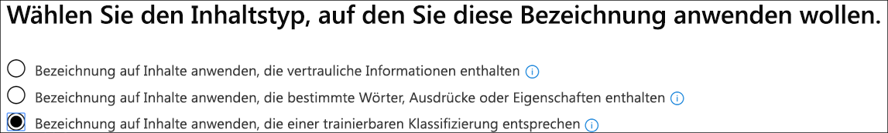

# Testen integrierter Klassifizierungen mithilfe von Aufbewahrungs Bezeichnungen (Vorschau)Testing built-in classifiers using retention labels (preview)

Microsoft hat fünf Klassifizierungen geschult und getestet, die bei der Identifizierung bestimmter Inhaltskategorien helfen können.Microsoft has trained and tested five classifiers which can help to identify certain categories of content. Diese Klassifizierungen werden `Ready to use` standardmäßig in der Gruppe angezeigt und wurden mit sehr umfangreichen Beispieldatensätzen geschult.These classifiers show up in the `Ready to use` group by default and were trained using very large sample data sets.

> [!IMPORTANT]
> Bevor Sie integrierte Klassifizierungen in Ihrem Klassifikations-und Bezeichnungs Workflow verwenden, sollten Sie Sie anhand eines Beispiels für die Inhalte Ihrer Organisation testen, das Ihrer Meinung nach der Kategorie entspricht, um sicherzustellen, dass Ihre Klassifizierungs Vorhersagen Ihren Erwartungen entsprechen.Before using built-in classifiers in your classification and labeling workflow, you should test it against a sample of your organization's content that you feel fits the category to verify that its classification predictions meet your expectations.

Weitere Informationen zu Schulungs Klassifizierern finden Sie unter [Erste Schritte mit Schulungs Klassifizierern (Preview)](classifier-getting-started-with.md).For more information on trainable classifiers, see [Getting started with trainable classifiers (preview)](classifier-getting-started-with.md).

Microsoft 365 verfügt über fünf Empfohlene integrierte Klassifizierungen:Microsoft 365 comes with five recommended built-in classifiers:

> [!CAUTION]
> Wir veraltern die integrierte Klassifizierung der **offensiven Sprache** , da Sie eine hohe Anzahl falsch positiver Ergebnisse erzeugt.We are deprecating the **Offensive Language** built-in classifier because it has been producing a high number of false positives. Verwenden Sie es nicht, und wenn Sie es derzeit verwenden, sollten Sie Ihre Geschäftsprozesse aus dieser entfernen.Don't use it and if you are currently using it, you should move your business processes off of it. Es wird empfohlen, stattdessen die integrierten Klassifizierungen " **Bedrohung**", " **Profanität**" und " **Belästigung** " zu verwenden.We recommend using the **Threat**, **Profanity**, and **Harassment** built-in classifiers instead.

- **Lebensläufe**: erkennt Elemente, bei denen es sich um Text Konten für persönliche, pädagogische, berufliche Qualifikationen, Berufserfahrung und andere personenbezogene Informationen handelt.**Resumes**: detects items that are textual accounts of an applicant's personal, educational, professional qualifications, work experience, and other personally identifying information.
- **Quellcode**: erkennt Elemente, die eine Reihe von Anweisungen und Anweisungen enthalten, die in den Top 25 verwendeten Computer Programmiersprachen auf GitHub geschrieben wurden.**Source Code**: detects items that contain a set of instructions and statements written in the top 25 used computer programming languages on GitHub.

|Name der Sprachelanguage name|||||
|---------|---------|---------|---------|---------|
|ActionScriptActionScript|CC        |C#C#       |C++C++     |ClojureClojure  |
|CoffeeScriptCoffeeScript|CSSCSS     |OKGo       |HaskellHaskell |HTMLHTML     |
|JavaJava     |JavaScriptJavaScript|LuaLua      |MATLABMATLAB   |Objective-CObjective-C|
|PerlPerl     |PHPPHP      |PythonPython   |RR        |RubyRuby     |
|ScalaScala    |ShellShell    |SWIFTSwift    |TexTex      |Vim-SkriptVim Script|

- **Belästigung**: erkennt eine bestimmte Kategorie von Textelementen anstößiger Sprache im Zusammenhang mit anstößigem Verhalten, das auf eine oder mehrere Personen basierend auf den folgenden Merkmalen ausgerichtet ist: Rasse, Ethnizität, Religion, nationale Herkunft, Geschlecht, sexuelle Orientierung, Alter, Behinderung.**Harassment**: detects a specific category of offensive language text items related to offensive conduct targeting one or multiple individuals based on the following traits: race, ethnicity, religion, national origin, gender, sexual orientation, age, disability.
- **Profanity**: erkennt eine bestimmte Kategorie von Textelementen anstößiger Sprache, die Ausdrücke enthalten, die die meisten Personen in Verlegenheit bringen.**Profanity**: detects a specific category of offensive language text items that contain expressions that embarrass most people.
- **Threat**: erkennt eine bestimmte Kategorie von Textelementen anstößiger Sprache im Zusammenhang mit Bedrohungen, um Gewalt zu begehen oder physischen Schaden oder einer Person oder einer Eigenschaft zu Schaden;**Threat**: detects a specific category of offensive language text items related to threats to commit violence or do physical harm or damage to a person or property,

> [!IMPORTANT]
> Bitte beachten Sie, dass die beleidigende Sprache, Belästigung, Profanität und Bedrohungs Klassifizierungen nur mit durchsuchbarem Text funktionieren, die nicht erschöpfend oder vollständig sind.Please note that the offensive language, harassment, profanity, and threat classifiers only work with searchable text are not exhaustive or complete. Außerdem ändern sich die Sprach-und Kulturstandards ständig, und in Anbetracht dieser Gegebenheiten behält sich Microsoft das Recht vor, diese Klassifizierungen nach eigenem Ermessen zu aktualisieren.Further, language and cultural standards continually change, and in light of these realities, Microsoft reserves the right to update these classifiers in its discretion. Während die Klassifizierungen Ihre Organisation bei der Überwachung von anstößigen und anderen Sprachen unterstützen können, befassen sich die Klassifizierungsverfahren nicht mit den Konsequenzen dieser Sprache und dienen nicht dazu, die Verwendung dieser Sprache allein zu überwachen oder zu beantworten.While the classifiers may assist your organization in monitoring offensive and other language used, the classifiers do not address consequences of such language and are not intended to provide your organization's sole means of monitoring or responding to the use of such language. Ihre Organisation und nicht Microsoft oder ihre Niederlassungen bleiben für alle Entscheidungen im Zusammenhang mit der Überwachung, Durchsetzung, Sperrung, Entfernung und Aufbewahrung von Inhalten, die von einer vorab ausgebildeten Klassifizierung identifiziert werden, verantwortlich.Your organization, and not Microsoft or its subsidiaries, remains responsible for all decisions related to monitoring, enforcement, blocking, removal and retention of any content identified by a pre-trained classifier.

## Überprüfen, ob eine integrierte Klassifizierung Ihren Anforderungen entsprichtHow to verify that a built-in classifier will meet your needs

1. Sammeln Sie Inhaltselemente für den verfügbaren Test, die Sie in die Kategorie der integrierten Klassifizierung (positive Übereinstimmungen) und diejenigen, die nicht berücksichtigt werden sollten (negative Übereinstimmungen) in der Kategorie, die Sie testen, gehören.Collect disposable test content items that you feel belong in the category of the built-in classifier (positive matches) and ones that shouldn't be included (negative matches) in the category you're testing.

> [!IMPORTANT]
> Die Beispielelemente dürfen nicht verschlüsselt werden und müssen in Englisch sein.The sample items must not be encrypted and they must be in English.

2. Erstellen eines dedizierten SharePoint Online Ordners; warten Sie mindestens eine Stunde, bis der Ordner dem Suchindex hinzugefügt wurde.Create a dedicated SharePoint Online folder; wait at least an hour for the folder to be added to the search index. Notieren Sie sich die Ordner-URL.Make note of the folder URL.

3. Melden Sie sich bei Microsoft 365 Compliance Center mit Compliance Admin oder Security Admin Role Access an, und öffnen Sie **Microsoft 365 Compliance Center**  >  **Records Management (Preview)**  >  **Label Policies** Tab.Sign in to Microsoft 365 compliance center with compliance admin or security admin role access and open **Microsoft 365 compliance center** > **Records management (preview)** > **Label policies** tab.

4. Wählen Sie aus `Auto-apply a label` .Choose `Auto-apply a label`.

5. Wählen Sie aus `Choose a label to auto-apply` .Choose `Choose a label to auto-apply`.

6. Wählen Sie `Create new labels` und erstellen Sie eine Bezeichnung für die Verwendung nur mit diesem Test.Choose `Create new labels` and create a label for use just with this test. Wenn Sie dies tun, lassen Sie `Retention` die Einstellung auf `off` .When you do this, leave `Retention` set to `off`. Sie möchten keine Aufbewahrung oder andere Aktionen aktivieren.You don't want to turn on any retention or other actions. In diesem Fall verwenden Sie die Aufbewahrungs Bezeichnung einfach als Textbeschriftung, ohne dass Aktionen erzwungen werden.In this case, you'll be using the retention label simply as a text label, without enforcing any actions. Sie können beispielsweise eine Aufbewahrungs Bezeichnung mit dem Namen "Sourcecode-Klassifizierungs Test" ohne Aktionen erstellen und diese Aufbewahrungs Bezeichnung automatisch auf Inhalte anwenden, für die die Quell Code Klassifizierung als Bedingung verwendet wird.For example, you can create a retention label named "SourceCode classifier test" with no actions, and then auto-apply that retention label to content that has Source code classifier as a condition. Weitere Informationen zum Erstellen von Aufbewahrungs Bezeichnungen finden Sie unter [Overview of Retention Labels](labels.md).To learn more about creating retention labels, see [Overview of retention labels](labels.md).
  
7. Wählen Sie `Auto-apply a label` und dann aus `Choose a label to auto-apply` .Choose `Auto-apply a label` and then `Choose a label to auto-apply`. Weitere Informationen zur Verwendung von Condition Based Auto-Apply a Label finden Sie unter [Automatisches Anwenden von Aufbewahrungs Bezeichnungsrichtlinien basierend auf einer Bedingung](labels.md#applying-a-retention-label-automatically-based-on-conditions).To learn more about using condition based auto-apply a label see, [auto-apply retention label policy based on a condition](labels.md#applying-a-retention-label-automatically-based-on-conditions).

8. Wählen Sie Ihre Test Bezeichnung in der Liste aus, und wählen Sie aus `Next` .Choose your test label from the list and choose `Next`.

9. Wählen Sie aus `Apply label to content that matches a trainable classifier` .Choose `Apply label to content that matches a trainable classifier`.

..

10. Wählen Sie Ihre Klassifizierung aus der Liste aus, in diesem Fall`Source Code`Choose your classifier from the list, in this case `Source Code`

11. Nennen Sie die Richtlinie, beispielsweise "Quellcode-integrierter Klassifizierungs Test".Name the policy, for example "Source code built-in classifier test".

12. Wählen Sie aus `Let me choose specific locations` .Choose `Let me choose specific locations`.

13. Deaktivieren Sie alle Speicherorte `SharePoint sites` , außer und wählen Sie `Choose sites` .Turn off all locations except `SharePoint sites` and choose `Choose sites`.

14. Geben Sie in Schritt 2 die URL für die Website ein.Enter the URL for the site from step 2.

15. Beenden Sie den Assistenten, und wählen Sie`Auto-apply`Finish the wizard and choose `Auto-apply`

16. Platzieren Sie die Testelemente in den Ordner dedizierter SharePoint Online.Place the test items into the dedicated SharePoint Online folder.

17. Lassen Sie eine Stunde für die Anwendung der Bezeichnung zu.Allow an hour for the label to be applied.

18. Überprüfen Sie die Eigenschaften der Dokumente für die Bezeichnung, um festzustellen, ob die Klassifizierung den Testinhalt wie erwartet enthielt und ausschloß.Check the properties of the documents for the label to see if the classifier included and excluded the test content as you expected.

19. Überprüfen Sie die Elemente, die beschriftet wurden.Review the items that were labeled.

20. Löschen Sie den Inhalt und die Bezeichnungsrichtlinie, wenn Sie mit Ihren Tests fertig sind.Delete the content and the label policy if you're done with your testing.

Siehe auch:See also:

- [Erste Schritte mit trainierbaren Klassifizierern (Vorschau)Getting started with trainable classifiers (preview)](classifier-getting-started-with.md)
- [Übersicht über AufbewahrungsbezeichnungenOverview of retention labels](labels.md)
- [Automatisches Anwenden von Aufbewahrungs Bezeichnungsrichtlinien basierend auf einer BedingungAuto-apply retention label policy based on a condition](labels.md#applying-a-retention-label-automatically-based-on-conditions)
