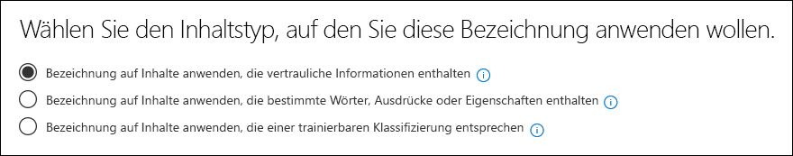

# Verwenden einer gebrauchsfertigen Klassifizierung (Vorschau)Using a ready to use classifier (preview)

Microsoft hat eine Reihe von Klassifizierungen mit sehr umfangreichen Beispieldatensätzen geschult und getestet, mit denen bestimmte Inhaltskategorien identifiziert werden können.Microsoft has trained and tested a number of classifiers using very large sample data sets, which can help to identify certain categories of content. Weitere Informationen finden Sie unter [Erste Schritte mit Schulungs Klassifizierern (Vorschau)](classifier-getting-started-with.md).See [Getting started with trainable classifiers (preview)](classifier-getting-started-with.md). Diese Klassifizierungen werden standardmäßig in `Ready to use` der Gruppe angezeigt.These classifiers show up in the `Ready to use` group by default.

- **Anstößige Sprache**: erkennt Textelemente, die Profanität, Beleidigungen, verspottungen und verschleierte Ausdrücke enthalten (bei denen es sich um Ausdrücke handelt, die die gleiche Bedeutung wie ein beleidigender Ausdruck haben).**Offensive Language**: detects text items that contain profanities, slurs, taunts, and disguised expressions (which are expressions that have the same meaning as a more offensive term).
- **Lebensläufe**: erkennt Elemente, bei denen es sich um Text Konten für persönliche, pädagogische, berufliche Qualifikationen, Berufserfahrung und andere personenbezogene Informationen handelt.**Resumes**: detects items that are textual accounts of an applicant's personal, educational, professional qualifications, work experience, and other personally identifying information.
- **Sourcecode**: erkennt Elemente, die eine Reihe von Anweisungen und Anweisungen enthalten, die in weit verbreiteten Programmiersprachen für Computer geschrieben wurden.**SourceCode**: detects items that contain a set of instructions and statements written in widely used computer programming languages.
- **Belästigung**: erkennt eine bestimmte Kategorie von Textelementen anstößiger Sprache im Zusammenhang mit anstößigem Verhalten, das auf eine oder mehrere Personen basierend auf den folgenden Merkmalen ausgerichtet ist: Rasse, Ethnizität, Religion, nationale Herkunft, Geschlecht, sexuelle Orientierung, Alter, Behinderung.**Harassment**: detects a specific category of offensive language text items related to offensive conduct targeting one or multiple individuals based on the following traits: race, ethnicity, religion, national origin, gender, sexual orientation, age, disability.
- **Profanity**: erkennt eine bestimmte Kategorie von Textelementen anstößiger Sprache, die Ausdrücke enthalten, die die meisten Personen in Verlegenheit bringen.**Profanity**: detects a specific category of offensive language text items that contain expressions that embarrass most people.
- **Threat**: erkennt eine bestimmte Kategorie von Textelementen anstößiger Sprache im Zusammenhang mit Bedrohungen, um Gewalt zu begehen oder physischen Schaden oder einer Person oder einer Eigenschaft zu Schaden;**Threat**: detects a specific category of offensive language text items related to threats to commit violence or do physical harm or damage to a person or property,

> [!NOTE]
> Bevor Sie die Klassifizierungstools in Ihrem Klassifikations-und Beschriftungs Workflow verwenden, sollten Sie Sie anhand eines Beispiels für die Inhalte Ihrer Organisation testen, das Ihrer Meinung nach der Kategorie entspricht, um zu überprüfen, ob Ihre Klassifizierungs Vorhersagen Ihren Erwartungen entsprechen.Before using ready to use classifiers in your classification and labeling workflow, you should test it against a sample of your organization's content that you feel fits the category to verify that its classification predictions meet your expectations.

> [!IMPORTANT]
> Bitte beachten Sie, dass die beleidigende Sprache, Belästigung, Profanität und Bedrohungs Klassifizierungen nur mit durchsuchbarem Text funktionieren, die nicht erschöpfend oder vollständig sind.Please note that the offensive language, harassment, profanity, and threat classifiers only work with searchable text are not exhaustive or complete. Außerdem ändern sich die Sprach-und Kulturstandards ständig, und in Anbetracht dieser Gegebenheiten behält sich Microsoft das Recht vor, diese Klassifizierungen nach eigenem Ermessen zu aktualisieren.Further, language and cultural standards continually change, and in light of these realities, Microsoft reserves the right to update these classifiers in its discretion. Während die Klassifizierungen Ihre Organisation bei der Überwachung von anstößigen und anderen Sprachen unterstützen können, befassen sich die Klassifizierungsverfahren nicht mit den Folgen dieser Sprache und dienen nicht dazu, die alleinigen Möglichkeiten Ihrer Organisation zur Überwachung oder Reaktion auf die Verwendung von zu bieten. solche Sprache.While the classifiers may assist your organization in monitoring offensive and other language used, the classifiers do not address consequences of such language and are not intended to provide your organization’s sole means of monitoring or responding to the use of such language. Ihre Organisation und nicht Microsoft oder ihre Niederlassungen bleiben für alle Entscheidungen im Zusammenhang mit der Überwachung, Durchsetzung, Sperrung, Entfernung und Aufbewahrung von Inhalten, die von einer vorab ausgebildeten Klassifizierung identifiziert werden, verantwortlich.Your organization, and not Microsoft or its subsidiaries, remains responsible for all decisions related to monitoring, enforcement, blocking, removal and retention of any content identified by a pre-trained classifier.

## Vorgehensweise vorbereiten und Verwenden einer bereit zu verwendenden KlassifizierungHow to prepare for and use a ready to use classifier

1. Sammeln Sie Inhaltselemente für den verfügbaren Test, die ihrer Meinung nach zur Kategorie der betriebsbereiten Klassifizierung gehören (positive Übereinstimmungen) und diejenigen, die nicht einbezogen werden sollten (negative Übereinstimmungen) in der Kategorie, die Sie testen.Collect disposable test content items that you feel belong in the category of the ready to use classifier (positive matches) and ones that shouldn't be included (negative matches) in the category you're testing.

> [!IMPORTANT]
> Die Beispielelemente dürfen nicht verschlüsselt werden und müssen in Englisch sein.The sample items must not be encrypted and they must be in English.

2. Erstellen eines dedizierten SharePoint Online Ordners; warten Sie mindestens eine Stunde, bis der Ordner dem Suchindex hinzugefügt wurde.Create a dedicated SharePoint Online folder; wait at least an hour for the folder to be added to the search index. Notieren Sie sich die Ordner-URL.Make note of the folder URL.

3. Melden Sie sich bei Microsoft 365 Compliance Center mit dem Zugriff auf Compliance Admin oder Sicherheitsadministrator Rolle an, und öffnen Sie das **Microsoft 365 Compliance Center** oder das **Microsoft 365 Security Center** > **Records Management (Preview)** > **Label Policies** Tab.Sign in to Microsoft 365 compliance center with compliance admin or security admin role access and open **Microsoft 365 compliance center** or **Microsoft 365 security center** > **Records management (preview)** > **Label policies** tab.

4. Wählen `Auto-apply a label`Sie aus.Choose `Auto-apply a label`.

5. Wählen `Choose a label to auto-apply`Sie aus.Choose `Choose a label to auto-apply`.

6. Wählen `Create new labels` Sie und erstellen Sie eine Bezeichnung für die Verwendung nur mit diesem Test.Choose `Create new labels` and create a label for use just with this test. Wenn Sie dies tun, lassen `Retention` Sie die Einstellung aus.When you do this, leave `Retention` set to off. Sie möchten keine Aufbewahrung oder andere Aktionen aktivieren.You don't want to turn on any retention or other actions. In diesem Fall verwenden Sie die Aufbewahrungs Bezeichnung einfach als Textbeschriftung, ohne dass Aktionen erzwungen werden.In this case, you'll be using the retention label simply as a text label, without enforcing any actions. Sie können beispielsweise eine Aufbewahrungs Bezeichnung mit dem Namen "Sourcecode-Klassifizierungs Test" ohne Aktionen erstellen und diese Aufbewahrungs Bezeichnung automatisch auf Inhalte anwenden, für die die Quell Code Klassifizierung als Bedingung verwendet wird.For example, you can create a retention label named "SourceCode classifier test" with no actions, and then auto-apply that retention label to content that has Source code classifier as a condition. Weitere Informationen zum Erstellen von Aufbewahrungs Bezeichnungen finden Sie unter [Overview of Retention Labels](labels.md).To learn more about creating retention labels, see [Overview of retention labels](labels.md).
  
7. Wählen `Auto-apply a label` Sie und `Choose a label to auto-apply`dann aus.Choose `Auto-apply a label` and then `Choose a label to auto-apply`. Weitere Informationen zur Verwendung von Condition Based Auto-Apply a Label finden Sie unter [Automatisches Anwenden von Aufbewahrungs Bezeichnungsrichtlinien basierend auf einer Bedingung](labels.md#applying-a-retention-label-automatically-based-on-conditions).To learn more about using condition based auto-apply a label see, [auto-apply retention label policy based on a condition](labels.md#applying-a-retention-label-automatically-based-on-conditions).

8. Wählen Sie Ihre Test Bezeichnung in der Liste aus `Next`, und wählen Sie aus.Choose your test label from the list and choose `Next`.

9. Wählen `Apply label to content that matches a trainable classifier`Sie aus.Choose `Apply label to content that matches a trainable classifier`.

.

10. Wählen Sie Ihre Klassifizierung aus der Liste aus, in diesem Fall`Source Code`Choose your classifier from the list, in this case `Source Code`

11. Nennen Sie die Richtlinie, beispielsweise "Quellcode-fähig für den Klassifizierungs Test".Name the policy, for example "Source code ready to use classifier test".

12. Wählen `Let me choose specific locations`Sie aus.Choose `Let me choose specific locations`.

13. Deaktivieren Sie alle Speicherorte `SharePoint sites` , außer `Choose sites`und wählen Sie.Turn off all locations except `SharePoint sites` and choose `Choose sites`.

14. Geben Sie in Schritt 2 die URL für die Website ein.Enter the URL for the site from step 2.

15. Beenden Sie den Assistenten, und wählen Sie`Auto-apply`Finish the wizard and choose `Auto-apply`

16. Platzieren Sie die Testelemente in den Ordner dedizierter SharePoint Online.Place the test items into the dedicated SharePoint Online folder.

17. Lassen Sie eine Stunde für die Anwendung der Bezeichnung zu.Allow an hour for the label to be applied.

18. Überprüfen Sie die Eigenschaften der Dokumente für die Bezeichnung, um festzustellen, ob die Klassifizierung den Testinhalt wie erwartet enthielt und ausschloß.Check the properties of the documents for the label to see if the classifier included and excluded the test content as you expected.

19. Überprüfen Sie die Elemente, die beschriftet wurden.Review the items that were labeled.

20. Löschen Sie den Inhalt und die Bezeichnungsrichtlinie, wenn Sie mit Ihren Tests fertig sind.Delete the content and the label policy if you're done with your testing.

Siehe auch:See also:

- [Erste Schritte mit lernbaren Klassifizierungen (Vorschau)Getting started with trainable classifiers (preview)](classifier-getting-started-with.md)
- [Übersicht über AufbewahrungsbezeichnungenOverview of retention labels](labels.md)
- [Automatisches Anwenden von Aufbewahrungs Bezeichnungsrichtlinien basierend auf einer BedingungAuto-apply retention label policy based on a condition](labels.md#applying-a-retention-label-automatically-based-on-conditions)
