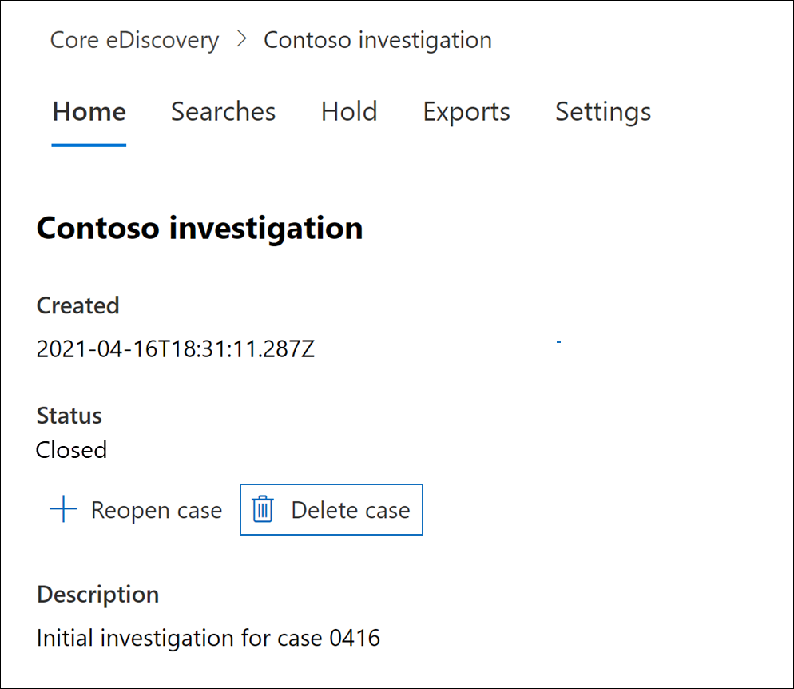

# Schließen, Erneut öffnen und Löschen eines Core eDiscovery-Falls

In diesem Artikel wird beschrieben, wie Sie Core eDiscovery-Fälle in einem Microsoft 365.

## Schließen eines Falls

Wenn der von einem Core eDiscovery-Fall unterstützte Rechtsstreit oder die Untersuchung abgeschlossen ist, können Sie den Fall schließen. Dies geschieht, wenn Sie einen Fall schließen:
  
- Wenn der Fall eDiscovery-Halte halte enthält, werden sie deaktiviert. Nachdem der Haltezeitraum deaktiviert wurde, wird eine 30-tägige Nachfrist (als Verzögerungsverzögerung *bezeichnet)* auf Inhaltsstandorte angewendet, die sich im Haltezeitraum befinden. Dadurch wird verhindert, dass Inhalte sofort gelöscht werden, und Administratoren können Inhalte suchen und wiederherstellen, bevor sie nach Ablauf des Verzögerungszeitraums endgültig gelöscht werden können. Weitere Informationen finden Sie unter [Entfernen von Inhaltsstandorten aus einem eDiscovery-Halteraum.](create-ediscovery-holds.md#removing-content-locations-from-an-ediscovery-hold)

- Durch das Abschließen eines Falls werden nur die Haltebereiche deaktiviert, die diesem Fall zugeordnet sind. Wenn andere Aufbewahrungsspeicherorts an einem Inhaltsspeicherort platziert werden (z. B. ein Prozessaufbewahrungsverfahren, eine Aufbewahrungsrichtlinie oder ein Haltebereich aus einem anderen Core eDiscovery-Fall), werden diese Aufbewahrungsspeicher weiterhin beibehalten.

- Der Fall wird weiterhin auf der Seite Core eDiscovery im Microsoft 365 Compliance Center aufgeführt. Die Details, Haltebereiche, Suchvorgänge und Mitglieder eines abgeschlossenen Falls bleiben erhalten.

- Sie können einen Fall bearbeiten, nachdem er geschlossen wurde. Beispielsweise können Sie Mitglieder hinzufügen oder entfernen, Suchen erstellen und Suchergebnisse exportieren. Der Hauptunterschied zwischen aktiven und geschlossenen Fällen besteht in der Deaktiviertheit von eDiscovery-Haltefällen, wenn ein Fall geschlossen wird.

So schließen Sie einen Fall ab
  
1. Klicken Sie Microsoft 365 Compliance Center auf **eDiscovery** Core, um die Liste der  >   Core eDiscovery-Fälle in Ihrer Organisation anzeigen zu können.

2. Klicken Sie auf den Namen des Falls, den Sie schließen möchten.

   

3. Klicken Sie auf der Startseite unter **Status** auf **Fall schließen**.

    Es wird eine Warnung angezeigt, dass die dem Fall zugeordneten Haltezeichen deaktiviert werden.

4. Klicken **Sie auf Ja,** um den Fall zu schließen.

    Der Status auf der Fall-Homepage wird von **Aktiv** in **Schließen geändert.**

5. Klicken Sie **auf der Seite Core eDiscovery** auf **Aktualisieren,** um den Status des geschlossenen Falls zu aktualisieren. Es kann bis zu 60 Minuten dauern, bis der Abschlussvorgang abgeschlossen ist.

    Wenn der Prozess abgeschlossen ist, wird der Status des Falls auf der Seite Core **eDiscovery** in **Closed** geändert.

## Erneuter Öffnen eines geschlossenen Falls

Wenn Sie einen Fall erneut öffnen, werden alle eDiscovery-Haltewerte, die beim Schließen des Falls aktiviert waren, nicht automatisch wiederhergestellt. Nachdem der Fall erneut geöffnet wurde, müssen  Sie zur Seite Halte halte wechseln und die vorherigen Halte halte aktivieren. Wenn Sie einen Haltebereich aktivieren möchten, wählen Sie ihn aus, um die Flyout-Seite anzuzeigen, und legen Sie dann den **Status** auf **Ein** fest.
  
1. Klicken Sie Microsoft 365 Compliance Center auf **eDiscovery** Core, um die Liste der  >   Core eDiscovery-Fälle in Ihrer Organisation anzeigen zu können.

2. Klicken Sie auf den Namen des Falls, den Sie erneut öffnen möchten.

   

3. Klicken Sie auf der Startseite unter **Status** auf **Erneuter Fall .**

    Es wird eine Warnung angezeigt, dass die halte, die dem Fall zugeordnet waren, als er geschlossen wurde, nicht automatisch aktiviert werden.

4. Klicken Sie **auf Ja,** um den Fall erneut zu öffnen.

    Der Status auf der Flyoutseite für die Fall-Homepage wird von **Closed in** **Active geändert.**

5. Klicken Sie **auf der Seite Core eDiscovery** auf **Aktualisieren,** um den Status des erneut geöffneten Falls zu aktualisieren. Es kann bis zu 60 Minuten dauern, bis der Erneutes Öffnen abgeschlossen ist. 

    Wenn der Prozess abgeschlossen ist, wird der Status des Falls auf der Seite Core **eDiscovery** in **Aktiv** geändert.

6. (Optional) Um alle halte, die dem erneut geöffneten Fall zugeordnet sind, zu aktivieren, wechseln Sie zur Registerkarte Halte, wählen Sie einen Haltestatus aus, und aktivieren Sie dann das Kontrollkästchen unter **Status** auf der Flyoutseite für halte. 
  
## Löschen eines Falls

Sie können auch aktive und geschlossene Core eDiscovery-Fälle löschen. Wenn Sie einen Fall löschen, werden alle Such- und Exporte in dem Fall gelöscht, und der Fall wird aus der Liste der Fälle auf der Seite Core **eDiscovery** im Microsoft 365 Compliance Center entfernt. Sie können einen gelöschten Fall nicht erneut öffnen.

Bevor Sie einen Fall löschen können (unabhängig davon, ob  er aktiv oder geschlossen ist), müssen Sie zunächst alle eDiscovery-Löscher löschen, die dem Fall zugeordnet sind. Dazu gehört das Löschen von Haltestatus mit dem Status **Aus**. 

So löschen Sie einen eDiscovery-Halteraum:

1. Wechseln Sie **in** dem Fall, den Sie löschen möchten, zur Registerkarte Halte.

2. Wählen Sie den Halteraum aus, den Sie löschen möchten.

3. Klicken Sie auf der Flyoutseite auf **Löschen**.

      

So löschen Sie einen Fall

1. Klicken Sie Microsoft 365 Compliance Center auf **eDiscovery** Core, um die Liste der  >   Core eDiscovery-Fälle in Ihrer Organisation anzeigen zu können.

2. Klicken Sie auf den Namen des Falls, den Sie löschen möchten.

3. Klicken Sie auf der Fall-Startseite unter **Status** auf **Fall löschen**.

      

Wenn der Fall, den Sie löschen möchten, weiterhin eDiscovery-Halte halte enthält, erhalten Sie eine Fehlermeldung. Sie müssen alle dem Fall zugeordneten Halte halte löschen und dann erneut versuchen, den Fall zu löschen.
