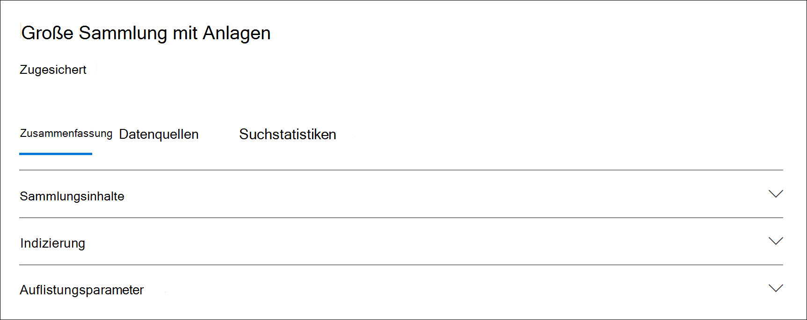

# Sammlungsstatistiken und -berichte in Advanced eDiscoveryCollection statistics and reports in Advanced eDiscovery

Nachdem Sie eine Entwurfssammlung erstellt haben, können Sie Statistiken zu den abgerufenen Elementen anzeigen, z. B. die Inhaltspositionen, die die meisten Elemente enthalten, die den Suchkriterien entsprechen, und die Anzahl der von der Suchabfrage zurückgegebenen Elemente.After you create a draft collection, you can view statistics on the retrieved items, such as the content locations that contain the most items that matched the search criteria and the number of items returned by the search query. Sie können auch eine Vorschau einer Teilmenge der Ergebnisse anzeigen.You can also preview a subset of the results.

Wenn Sie den Satz von Dokumenten identifiziert haben, den Sie weiter untersuchen möchten, können Sie die Suchergebnisse zu einem Prüfsatz hinzufügen, der gesammelt und verarbeiten werden soll.When you've identified the set of documents you want to further examine, you can add the search results to a review set to collect and process.

## Statistiken und Berichte für EntwurfssammlungenStatistics and reports for draft collections

In diesem Abschnitt werden die Statistiken beschrieben, die für Entwurfssammlungen verfügbar sind.This section describes the statistics that are available for draft collections. Diese Statistiken sind auf der Registerkarte **Suchstatistik** auf der Flyoutseite einer Entwurfssammlung verfügbar.These statistics are available on the **Search statistics** tab on the flyout page of a draft collection.

### SammlungsschätzungenCollection estimates

In diesem Abschnitt wird eine grafische Zusammenfassung der geschätzten Elemente angezeigt, die von der Auflistung zurückgegeben werden.This section displays a graphical summary of the estimated items returned by the collection. Dies gibt die Anzahl der Elemente an, die den Suchkriterien der Auflistung entsprechen.This indicates the number of items that match the search criteria of the collection. Diese Informationen geben Ihnen eine Vorstellung von der geschätzten Anzahl von Elementen, die von der Auflistung zurückgegeben werden.This information gives you an idea about the estimated number of items returned by the collection.

- **Geschätzte Elemente nach Speicherorten:** Die Gesamtanzahl der geschätzten Elemente, die von der Auflistung zurückgegeben werden.**Estimated items by locations**: The total number of estimated items returned by the collection. Die bestimmte Anzahl von Elementen, die sich in Postfächern und auf Websites befinden, wird ebenfalls angezeigt.The specific number of items located in mailboxes and located in sites is also displayed.

- **Geschätzte Speicherorte mit Treffern:** Die Gesamtanzahl der Inhaltspositionen, die von der Auflistung zurückgegebene Elemente enthalten.**Estimated locations with hits**: The total number of content locations that contain items returned by the collection. Die spezifische Anzahl von Postfach- und Standortspeicherorten wird ebenfalls angezeigt.The specific number of mailbox and site locations is also displayed.

- **Datenvolumen nach Speicherort (in MB):** Die Gesamtgröße aller geschätzten Elemente, die von der Auflistung zurückgegeben werden.**Data volume by location (in MB)**: The total size of all estimated items returned by the collection. Die spezifische Größe von Postfachelementen und Websiteelementen wird ebenfalls angezeigt.The specific size of mailbox items and site items is also displayed.

### BedingungsberichtCondition report

In diesem Abschnitt werden Statistiken zur Sammlungssuchabfrage und zur Anzahl der geschätzten Elemente angezeigt, die verschiedenen Teilen der Suchabfrage entsprechen.This section displays statistics about the collection search query and the number of estimated items that matched different parts of the search query. Sie können diese Statistiken verwenden, um die Anzahl der Elemente zu analysieren, die mit jeder Komponente der Suchabfrage übereinstimmen.You can use these statistics to analyze the number of items that match each component of search query. Dies kann Ihnen helfen, die Suchkriterien für die Auflistung zu verfeinern und bei Bedarf den Bereich der Auflistung zu einenten.This can help you refine the search criteria for the collection and if necessary narrow the scope of the collection.

- **Speicherorttyp**: Der Typ des Inhaltsspeicherorts, auf den die Abfragestatistiken anwendbar sind.**Location type**: The type of content location that the query statistics are applicable to. Der Wert von **Exchange** gibt einen Postfachspeicherort an. Ein Wert von **SharePoint** gibt einen Websitespeicherort an.The value of **Exchange** indicates a mailbox location; a value of **SharePoint** indicates a site location.

- **Teil**: Der Teil der Suchabfrage, auf den die Statistiken anwendbar sind.**Part**: The part of the search query the statistics are applicable to. **Primär** gibt die gesamte Suchabfrage an.**Primary** indicates the entire search query. **Schlüsselwort** gibt an, dass die Statistiken in der Zeile für ein bestimmtes Schlüsselwort verwendet werden.**Keyword** indicates the statistics in the row are for a specific keyword. Wenn Sie bei der Suchabfrage in der Auflistung eine Schlüsselwortliste verwenden, sind Statistiken für jede Komponente der Abfrage in dieser Tabelle enthalten.If you use a keyword list when for the search query in the collection, statistics for each component of the query are included in this table.

- **Bedingung:** Die tatsächliche Komponente (Schlüsselwort oder Bedingung) der Suchabfrage, die für die Entwurfssammlung ausgeführt wurde, die die in der entsprechenden Zeile angezeigten Statistiken zurückgegeben hat.**Condition**: The actual component (keyword or condition) of the search query that was run for the draft collection that returned the statistics displayed in the corresponding row.

- **Speicherorte mit Treffern**: Die Anzahl  der Inhaltsspeicherorte (angegeben durch die Spalte Standorttyp), die Elemente enthalten, die der primären abfrage oder der Schlüsselwortabfrage in der Spalte **Bedingung** entsprechen.**Locations with hits**: The number of the content locations (specified by the **Location type** column) that contain items that match the primary or keyword query listed in the **Condition** column.

- **Elemente**: Die Anzahl der Elemente (vom angegebenen Inhaltsspeicherort), die der in der Spalte Bedingung aufgeführten **Abfrage** entsprechen.**Items**: The number of items (from the specified content location) that match the query listed in the **Condition** column. Wie bereits erläutert, wird ein Element nur einmal in dieser Spalte gezählt, wenn es mehrere Instanzen eines gesuchten Schlüsselworts enthält.As previously explained, if an item contains multiple instances of a keyword that is being searched for, it's only counted once in this column.

- **Size (MB)**: Die Gesamtgröße aller Gefundenen (am angegebenen Inhaltsspeicherort), die der Suchabfrage in der **Spalte Bedingung** entsprechen.**Size (MB)**: The total size of all items that were found (in the specified content location) that match the search query in the **Condition** column.

### Top locationsTop locations

In diesem Abschnitt werden Statistiken zu den spezifischen Inhaltsstandorten mit den meisten von der Auflistung zurückgegebenen Elementen angezeigt.This section displays statistics about the specific content locations with the most items returned by the collection.

- Der Name des Standortnamens (die E-Mail-Adresse von Postfächern und die URL für Websites).The name of the location name (the email address of mailboxes and the URL for sites).

- Speicherorttyp (Postfach oder Standort).Location type (a mailbox or site).

- Geschätzte Anzahl von Elementen am Inhaltsspeicherort, die von der Auflistung zurückgegeben werden.Estimated number of items in the content location returned by the collection.

- Die Gesamtgröße der geschätzten Elemente an jedem Inhaltsspeicherort.The total size of estimated items in each content location.

## Statistiken und Berichte für verpflichtete SammlungenStatistics and reports for committed collections

In diesem Abschnitt werden die Statistiken beschrieben, die verfügbar sind, nachdem Sie eine Auflistung zu einem Überprüfungssatz festgelegt haben, einschließlich der tatsächlichen Anzahl von Elementen, die dem Überprüfungssatz hinzugefügt wurden.This section describes the statistics that are available after you commit a collection to a review set, including the actual number of items added to the review set. Diese Statistiken enthalten (zusätzlich zu Denksatzinformationen) verlaufshistorische Informationen zu Inhalten, die einem Fall hinzugefügt wurden.These statistics (in addition to load set information) provide historical information about content added to a case.

Nachdem Sie eine Auflistung für einen Überprüfungssatz festgelegt haben, werden die folgenden Registerkarten auf der Flyoutseite der gebundenen Verbindung angezeigt.After you commit a collection to a review set, the following tabs are displayed on the flyout page of the committed connection. Jede dieser Registerkarten enthält unterschiedliche Arten von Informationen zur Auflistung.Each of these tabs contains different types of information about the collection.

### SammlungsinhalteCollection contents

Dieser Abschnitt der Registerkarte **Zusammenfassung** enthält Statistiken und weitere Informationen zu den Elementen, die aus den Datenquellen in der Auflistung gesammelt und dem Überprüfungssatz hinzugefügt wurden.This section of the **Summary** tab contains statistics and other information about the items that were collected from the data sources in the collection and added to the review set.

- **Extrahierte Elemente insgesamt**.**Total extracted items**. Die Gesamtanzahl der Elemente, die dem Überprüfungssatz hinzugefügt wurden.The total number of items added to the review set. Diese Zahl gibt die Summe der übergeordneten und untergeordneten Elemente an, die dem Überprüfungssatz hinzugefügt wurden.This number indicates the sum of parent items and child items added to the review set.

  > [!TIP]
  > Zeigen Sie mit dem Cursor auf die übergeordneten oder untergeordneten Elementleisten, um die Gesamtanzahl der übergeordneten oder untergeordneten Elemente anzeigen zu können.Hover the cursor over the parent or child item bars to display the total number of parent or child items.

- **Übergeordnete Elemente**.**Parent items**. Die Anzahl der Elemente, die von der Auflistung zurückgegeben wurden, die zum Sammeln der Elemente verwendet wurde, die dem Überprüfungssatz hinzugefügt wurden.The number of items returned by the collection that was used to collect the items that were added to the review set. Diese Zahl entspricht (und entspricht) der geschätzten Anzahl von Elementen, die im Abschnitt **Auflistungsparameter angezeigt** werden.This number corresponds  to (and is equal to) the estimated number of items that is displayed in the **Collection parameters** section. Die Anzahl der übergeordneten Elemente, die er sammelt, die zum Sammeln der Elemente verwendet wurden, die dem Überprüfungssatz hinzugefügt wurden.The number of parent items he collection information that was used to collect the items that were added to the review set.
 
   Ein übergeordnetes Element kann mehrere untergeordnete Elemente enthalten.A parent item might contain multiple child items. Beispielsweise ist eine E-Mail-Nachricht ein übergeordnetes Element, wenn sie eine angefügte Datei enthält oder über eine Cloudanlage verfügt.For example, an email message is a parent item if it contains an attached file or has a cloud attachment. In diesem Fall werden die angefügte Datei oder das Ziel der Cloudanlage als untergeordnete Elemente betrachtet.In this case, the attached file or the target of the cloud attachment are considered child items. Wenn Sie ein Commit für eine Auflistung erstellen, werden übergeordnete Elemente und alle zugehörigen untergeordneten Elemente dem Überprüfungssatz als einzelne Elemente oder Dateien hinzugefügt.When you commit a collection, parent items and any corresponding child items are added to the review set as individual items or files.

- **Untergeordnete Elemente**.**Child items**. Die Anzahl der untergeordneten Elemente, die dem Überprüfungssatz hinzugefügt wurden.The number of child items added to the review set. Untergeordnete Elemente sind Anlagen oder andere Teile eines übergeordneten Elements.Child items are attachments or other parts of a parent item. Zu den untergeordneten Elementen gehören angefügte Dateien, Cloudanlagen, Bilder und E-Mail-Signaturen.Child items include attached files, cloud attachments, images, and email signatures. Wenn Sie eine Auflistung für einen Überprüfungssatz festlegen, werden untergeordnete Elemente extrahiert, indiziert und dem Überprüfungssatz als einzelne Dateien hinzugefügt.When you commit a collection to a review set, child items are extracted, indexed, and added to the review set as individual files.

- **Eindeutige Elemente**.**Unique items**. Die Anzahl der eindeutigen Elemente, die dem Überprüfungssatz hinzugefügt wurden.The number of unique items added to the review set. Eindeutige Elemente sind für den Überprüfungssatz eindeutig.Unique items are unique to the review set. Alle Elemente sind eindeutig, wenn die erste Auflistung einem neuen Überprüfungssatz hinzugefügt wird, da keine vorherigen Elemente im Überprüfungssatz enthalten waren.All items are unique when the first collection is added to a new review set because there were no previous items in the review set.

- **Identifizierte doppelte Elemente**.**Identified duplicate items**. Die Anzahl der Elemente aus der Auflistung, die dem Überprüfungssatz nicht hinzugefügt wurden, da das gleiche Element bereits im Überprüfungssatz vorhanden ist.The number of items from the collection that were not added to the review set because the same item already exists in the review set. Statistiken zu doppelten Elementen können dazu beitragen, die Unterschiede zwischen der Anzahl der geschätzten Elemente aus einer Entwurfssammlung und der tatsächlichen Anzahl der Elemente zu erklären, die dem Überprüfungssatz hinzugefügt wurden.Statistics about duplicate items can help explain the differences between the number of estimated items from a draft collection and the actual number of items added to the review set.

### IndizierungIndexing

Der **Abschnitt Indizierung** auf der Registerkarte **Zusammenfassung** eines festgelegten Überprüfungssatz enthält Indizierungsinformationen zu den Elementen, die dem Überprüfungssatz hinzugefügt wurden.The **Indexing** section on the **Summary** tab of a committed review set contains indexing information about the items added to the review set.

**Neue indizierte Elemente**.**New indexed items**. Die Anzahl der Elemente, die neu indiziert wurden, bevor sie dem Überprüfungssatz hinzugefügt wurden.The number of items that were newly indexed before they were added to the review set. Ein Beispiel für ein neu indiziertes Element sind untergeordnete Elemente, die aus einem übergeordneten Element extrahiert und dann indiziert werden, bevor sie dem Überprüfungssatz hinzugefügt werden.An example of a newly indexed item are child items that are extracted from a parent item then indexed before they're added to the review set. Außerdem werden Elemente, die sich nicht in verwahrten Datenquellen und  nicht verwahrten Inhaltsspeicherorten befinden, die in dem Fall auf der Registerkarte Datenquellen aufgeführt sind, indiziert, bevor sie der Überprüfung hinzugefügt werden.Also, items that aren't located in custodial data sources and non-custodial content locations listed on the **Data sources** tab in the case are indexed before they're added to the review. Beispielsweise würden neu indizierte Elemente Elemente enthalten, die von zusätzlichen Speicherorten gesammelt wurden.For example, newly indexed items would include items collected from additional locations.

**Indizierte Elemente aktualisiert.****Updated indexed items**. Die Anzahl der teilweise indizierten Elemente, die erfolgreich indiziert und dem Überprüfungssatz hinzugefügt wurden.The number of partially indexed items that were successfully indexed and added to the review set. Dies würde Elemente aus Verwahrungsspeicherorten  und nicht verwahrten Inhaltsspeicherorten teilweise indizierte Datenquellenregisterkarten, die erfolgreich indiziert wurden, als die Sammlung für den Überprüfungssatz festgelegt wurde.This would partially indexed items from custodial and non-custodial content locations **Data sources** tab that were successfully indexed when the collection was committed to the review set.

**Indizierungsfehler**.**Indexing errors**. Die Anzahl der teilweise indizierten Elemente, die nicht indiziert werden konnten, bevor sie dem Überprüfungssatz hinzugefügt wurden.The number of partially indexed items that couldn't be indexed before they were added to the review set. Für diese Elemente ist möglicherweise eine Fehlerbehebung erforderlich.These items might require error remediation.

### AuflistungsparameterCollection parameters

In diesem Abschnitt werden die Sammlungsinformationen angezeigt, die zum Sammeln der Elemente verwendet wurden, die dem Überprüfungssatz hinzugefügt wurden.This section displays the collection information that was used to collect the items that were added to the review set. Auf dieser Registerkarte werden Informationen angezeigt, die den Informationen auf der Registerkarte **Suchstatistik** ähneln. Dieser Abschnitt enthält einen Schnellstart der von der Auflistung verwendeten Suchabfrage, der durchsuchten Inhaltsorte und der geschätzten Sammlungsergebnisse.This tab displays information that is similar to the information on the **Search statistics** tab. This section provides a quick snap shot of the search query used by the collection, the content locations that were searched, and the estimated collection results. Wie bereits erläutert, entspricht die Anzahl der geschätzten Elemente in diesem Abschnitt der Anzahl der übergeordneten Elemente, die im Abschnitt **Sammlungsinhalt angezeigt** werden.As previously explained, the number of estimated items in this section would be equal to the number of parent items shown in the **Collection contents** section.

### Registerkarte "Suchstatistik"Search statistics tab

Die auf der Registerkarte **Suchstatistik** angezeigten Statistiken sind die gleichen Statistiken wie beim letzten Ausführen einer Entwurfssammlung.The statistics displayed on the **Search statistics** tab are the same statistics from the last time that a draft collection was run. Dazu gehören Auflistungsschätzungen, Bedingungsbericht und top-Speicherorte.This includes collection estimates, condition report, and top locations. Diese Informationen werden aus der Entwurfssammlung als historische Referenz beibehalten und können mit der tatsächlichen Auflistung verglichen werden, die für den Überprüfungssatz festgelegt wurde.This information is preserved from the draft collection for historical reference, and can be compared to the actual collection that was committed to the review set.

## Unterschiede zwischen Entwurfssammlungsschätzungen und der tatsächlichen gebundenen SammlungDifferences between draft collection estimates and the actual committed collection

Wenn Sie eine Entwurfssammlung ausführen, wird eine Schätzung der Anzahl der Elemente (und  deren Gesamtgröße), die die Sammlungskriterien erfüllen, auf der Registerkarte Zusammenfassung und im Abschnitt Sammlungsschätzungen der Registerkarte Suchstatistik **angezeigt.**  Nachdem Sie eine Entwurfssammlung für einen Überprüfungssatz festgelegt haben, unterscheiden sich die tatsächliche Anzahl der Elemente (und deren Gesamtgröße), die der Überprüfungssatz hinzugefügt hat, häufig von den Schätzungen.When you run a draft collection, an estimate of the number of items (and their total size) that meet the collection criteria is displayed on the **Summary** tab and in **Collection estimates** section of the **Search statistics** tab. After you commit a draft collection to a review set, the actual number of items (and their total size) added the review set are often different from the estimates. In den meisten Fällen werden dem Überprüfungssatz mehr Elemente hinzugefügt, als aus der Entwurfssammlung geschätzt wurden.In most cases, more items are added to the review set than were estimated from the draft collection. In der folgenden Liste werden die häufigsten Gründe für diese Unterschiede und Tipps zur Identifizierung beschrieben:The following list describes the most common reasons for these differences and tips for identifying them:

- **Untergeordnete Elemente**.**Child items**. Untergeordnete Elemente, die aus ihren übergeordneten Elementen extrahiert und als einzelne Dateien hinzugefügt werden.Child items that are extracted from their parent items and added as individual files. Die Anzahl der untergeordneten Elemente kann die Anzahl der Elemente, die tatsächlich dem Überprüfungssatz hinzugefügt werden, erheblich erhöhen.The number of child items may significantly increase the number of items that are actually added to the review set. Im Allgemeinen sollte die Anzahl der  übergeordneten Elemente, die im Abschnitt Sammlungsinhalte auf der Registerkarte Zusammenfassung einer gebundenen Auflistung identifiziert werden, der Anzahl der geschätzten Elemente aus der Entwurfssammlung entspricht. In general, the number of parent items identified in the **Collection contents** section on the **Summary** tab of a committed collection should be equal to the number of estimated items from the draft collection.

- **Doppelte Elemente**.**Duplicate items**. Elemente aus der Entwurfssammlung, die dem Überprüfungssatz in einer früheren Auflistung bereits hinzugefügt wurden, werden nicht hinzugefügt.Items from the draft collection that have already been added to the review set in a previous collection won't be added. Wie bereits erläutert, wird die Anzahl der doppelten Elemente in der Auflistung im Abschnitt **Sammlungsinhalte** auf der Registerkarte **Zusammenfassung** angezeigt.As previously explained, the number of duplicate items in the collection is displayed in the **Collection contents** section on the **Summary** tab.

- **Sammlungskonfigurationsoptionen**.**Collection configuration options**. Wenn Sie eine Entwurfssammlung für einen Überprüfungssatz festlegen, müssen Sie die Option zum Einfügen von Unterhaltungsthreads, Cloudanlagen und Dokumentversionen verwenden.When you commit a draft collection to a review set, you have to option to include conversation threads, cloud attachments, and document versions. Alle diese Elemente, die dem Überprüfungssatz hinzugefügt werden, sind nicht in den Schätzungen der Entwurfssammlung enthalten.Any of these items that are added to the review set aren't included in the estimates of the draft collection. Sie werden nur identifiziert und gesammelt, wenn Sie ein Commit für die Sammlung festlegen.They are identified and collected only when you commit the collection. Wenn Sie diese Optionen auswählen, erhöht sich wahrscheinlich die Anzahl der Elemente, die dem Überprüfungssatz hinzugefügt wurden.Selecting these options will most likely increase the number of items added to the review set. 

    Beispielsweise sind mehrere Versionen von SharePoint-Dokumenten nicht in der Schätzung für die Entwurfssammlung enthalten.For example, multiple versions of SharePoint documents aren't included in the estimate for the draft collection. Wenn Sie jedoch beim Exportieren der Suchergebnisse die Option zum Einfügen aller Dokumentversionen auswählen, wird die tatsächliche Anzahl (und Gesamtgröße) der Elemente erhöht, die dem Überprüfungssatz hinzugefügt wurden.But if you select the option to include all document versions when you export the search results, which will increase the actual number (and total size) of items added to the review set. 

    Weitere Informationen zu diesen Optionen finden Sie unter [Commit a draft collection to a review set](commit-draft-collection.md#commit-a-draft-collection-to-a-review-set-in-advanced-ediscovery).For more information about these options, see [Commit a draft collection to a review set](commit-draft-collection.md#commit-a-draft-collection-to-a-review-set-in-advanced-ediscovery). 

Dies sind weitere Gründe, warum die geschätzten Ergebnisse aus einer Entwurfssammlung von den tatsächlichen Ergebnissen für die Zugesagten abhingen können.Here are other reasons why the estimated results from a draft collection can be different that the actual committed results.

- **Die Art und Weise, wie Ergebnisse für Entwurfssammlungen geschätzt werden.****The way results are estimated for draft collections**. Eine Schätzung der suchergebnisse, die von einer Entwurfssammlung zurückgegeben werden, ist nur, dass eine Schätzung (und nicht eine tatsächliche Anzahl) der Elemente, die die Abfragekriterien der Auflistung erfüllen.An estimate of the search results returned by a draft collection is just that, an estimate (and not an actual count) of the items that meet the collection query criteria. Zum Kompilieren der Schätzung von E-Mail-Elementen wird eine Liste der Nachrichten-IDs angefordert, die die Suchkriterien erfüllen, aus der Exchange-Datenbank.To compile the estimate of email items, a list of the message IDs that meet the search criteria is requested from the Exchange database. Wenn Sie die Auflistung jedoch für einen Überprüfungssatz festlegen, wird die Auflistung erneut verwendet, und die tatsächlichen Nachrichten werden aus der Exchange-Datenbank abgerufen.But when you commit the collection to a review set, the collection is rerun and the actual messages are retrieved from the Exchange database. Daher können Unterschiede aufgrund der Art und Weise, wie die geschätzte Anzahl von Elementen und die tatsächliche Anzahl von Elementen bestimmt werden, resulten.So differences might result because of how the estimated number of items and the actual number of items are determined.

- Änderungen, die zwischen dem Zeitpunkt des Schätzens **und Commits von Entwurfssammlungen auftreten.****Changes that happen between the time when estimating and committing draft collections**. Wenn Sie eine Entwurfssammlung für einen Überprüfungssatz festlegen, wird die Suche erneut zum Erfassen der neuesten Elemente im Suchindex, die die Suchkriterien erfüllen, erneut verwendet.When you commit a draft collection to a review set, the search is rerun to collect that most recent items in the search index that meet the search criteria. Es ist möglich, dass zusätzliche Elemente erstellt, gesendet oder gelöscht wurden, die die Suchkriterien in der Zeit zwischen dem Zeitpunkt der letzten Ausführung der Entwurfssammlung und dem Zeitpunkt erfüllen, zu dem die Entwurfssammlung einem Überprüfungssatz verpflichtet ist.It's possible that additional items were created, sent, or deleted that meet the search criteria in the time between when the draft collection was last run and when the draft collection is committed to a review set. Es ist auch möglich, dass Elemente, die sich im Suchindex befinden, als die Entwurfssammlungsergebnisse geschätzt wurden, nicht mehr dort sind, da sie vor dem Commit der Sammlung aus einer Datenquelle gelöscht wurden.It's also possible that items that were in the search index when the draft collection results were estimated are no longer there because they were purged from a data source before committing the collection. Eine Möglichkeit, dieses Problem zu beheben, besteht in der Angabe eines Datumsbereichs für eine Auflistung.One way to mitigate this issue is to specify a date range for a collection. Eine weitere Möglichkeit besteht in der Einbehalten von Inhaltspositionen, damit Elemente beibehalten werden und nicht gelöscht werden können.Another way is to place a hold on content locations so that items are preserved and can't be purged.

- **Nicht indizierte Elemente**.**Unindexed items**. Wenn in der Entwurfssammlung alle Exchange-Postfächer oder alle SharePoint-Websites durchsucht wurden, werden dem Überprüfungssatz nur nicht indizierte Elemente aus Inhaltsspeicherorten hinzugefügt, die Elemente enthalten, die den Sammlungskriterien entsprechen.If the draft collection included searching all Exchange mailboxes or all SharePoint sites, then only unindexed items from content locations that contain items that match the collection criteria will be added to the review set. Anders ausgedrückt: Wenn keine Ergebnisse in einem Postfach oder einer Website gefunden werden, werden nicht indizierte Elemente in diesem Postfach oder Standort nicht zum Überprüfungssatz hinzugefügt.In other words, if no results are found in a mailbox or site, then any unindexed items in that mailbox or site won't be added to the review set. Nicht indizierte Elemente von allen Inhaltsverzeichnissen (auch solche, die keine Elemente enthalten, die mit der Auflistungsabfrage übereinstimmen) werden jedoch in die geschätzten Sammlungsergebnisse einbezogen.However, unindexed items from all content locations (even those that don't contain items that match the collection query) will be included in the estimated collection results.

    Wenn die Entwurfssammlung bestimmte Inhaltsspeicherorte enthält (d. h. bestimmte  Postfächer oder Websites, die auf der Seite Zusätzliche Speicherorte im Entwurfssammlungs-Assistenten angegeben sind), werden nicht indizierte Elemente (die von den Sammlungskriterien nicht ausgeschlossen werden) von den in der Suche angegebenen Inhaltsspeicherorten exportiert.Alternatively, if the draft collection included specific content locations (which means that specific mailboxes or sites where specified on the **Additional locations** page in the draft collection wizard), then unindexed items (that aren't excluded by the collection criteria) from the content locations specified in the search will be exported. In diesem Fall sollten die geschätzte Anzahl nicht indizierter Elemente und die Anzahl der nicht indizierten Elemente, die dem Überprüfungssatz hinzugefügt werden, identisch sein.In this case, the estimated number of unindexed items and the number of unindexed items that are added to the review set should be the same.
