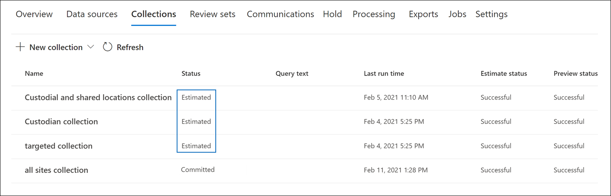

# Commit einer Entwurfssammlung in einen Prüfdateisatz in Advanced eDiscovery

Wenn Sie mit den Elementen zufrieden sind, die Sie in einer Entwurfssammlung gesammelt haben und bereit sind, diese zu analysieren, zu markieren und zu überprüfen, können Sie eine Sammlung zu einem Prüfdateisatz im Fall hinzufügen. Wenn Sie einen Entwurf einer Sammlung in einen Prüfdateisatz übernehmen, werden gesammelte Elemente von ihrem ursprünglichen Speicherort in Microsoft 365 in einen Prüfdateisatz kopiert. Ein Prüfdateisatz ist ein sicherer, von Microsoft bereitgestellter Azure Storage Ort in der Microsoft-Cloud.

## Festlegen einer Entwurfssammlung auf einen Überprüfungssatz

1. Öffnen Sie im Microsoft 365 Compliance Center die Advanced eDiscovery Fall, und wählen Sie dann die Registerkarte **Sammlungen** aus, um eine Liste der Auflistungen in dem Fall anzuzeigen.

   

   > [!TIP]
   > Ein Wert `Estimated` in der Spalte **Status** identifiziert die Entwurfssammlungen, die einem Prüfdateisatz hinzugefügt werden können. Der Status `Committed` "gibt an, dass eine Sammlung bereits zu einem Prüfdateisatz hinzugefügt wurde."

2. Wählen Sie auf der Seite **"Sammlungen"** die Entwurfssammlung aus, für die Sie einen Commit für einen Prüfdateisatz ausführen möchten.

3. **Wählen** Sie unten auf der Flyoutseite die  >  **Aktionsbearbeitungssammlung** aus.

4. Klicken Sie im Bearbeitungssammlungs-Assistenten auf **"Weiter",** bis die Seite **"Entwurf speichern" oder "Sammeln"** angezeigt wird.

5. Konfigurieren Sie die folgenden Einstellungen:

   1. Wählen Sie **"Elemente sammeln" aus, und fügen Sie den Prüfdateisatz hinzu.**

   2. Entscheiden Sie, ob die Sammlung einem neuen Prüfdateisatz (der nach dem Übermitteln der Auflistung erstellt wird) oder einem vorhandenen Prüfdateisatz hinzugefügt werden soll. Schließen Sie diesen Abschnitt basierend auf Ihrer Entscheidung ab.

   3. Konfigurieren Sie die zusätzlichen Sammlungseinstellungen:

       - **Teams und Yammer Nachrichten:** Wählen Sie diese Option aus, um der Sammlung Unterhaltungsthreads hinzuzufügen, die die von der Suchabfrage in der Auflistung zurückgegebenen Chatelemente enthalten. Dies bedeutet, dass die Chatunterhaltung, die Elemente enthält, die den Suchkriterien entsprechen, rekonstruiert wird. Auf diese Weise können Sie Chatelemente im Kontext der Hin- und Her-Unterhaltung überprüfen. Weitere Informationen finden Sie unter [Unterhaltungsthreading in Advanced eDiscovery](conversation-review-sets.md).

       - **Cloudanlagen:** Wählen Sie diese Option aus, um moderne Anlagen oder verknüpfte Dateien einzuschließen, wenn die Sammlungsergebnisse dem Prüfdateisatz hinzugefügt werden. Dies bedeutet, dass die Zieldatei einer modernen Anlage oder verknüpften Datei dem Prüfdateisatz hinzugefügt wird.

       - **SharePoint Versionen:** Wählen Sie diese Option aus, um die Sammlung aller Versionen eines SharePoint Dokuments gemäß den Versionsbeschränkungen und Suchparametern der Auflistung zu aktivieren. Wenn Sie diese Option auswählen, wird die Größe der Elemente, die dem Prüfdateisatz hinzugefügt werden, erheblich vergrößert.

   4. Konfigurieren Sie die Einstellungen, um den Umfang der Sammlung zu definieren, die dem Prüfdateisatz hinzugefügt werden soll:

      - **Fügen Sie alle Sammlungsergebnisse** hinzu: Wählen Sie diese Option aus, um dem Prüfdateisatz alle Elemente hinzuzufügen, die den Suchkriterien der Auflistung entsprechen.

      - **Fügen Sie ein Beispiel der Sammlungsergebnisse** hinzu: Wählen Sie diese Option aus, um dem Prüfdateisatz ein Beispiel der Sammlungsergebnisse hinzuzufügen, anstatt alle Ergebnisse hinzuzufügen. Wenn Sie diese Option auswählen, klicken Sie auf **Beispielparameter bearbeiten,** und wählen Sie eine der folgenden Optionen aus:

         - **Beispiel basierend auf der Konfidenz:** Elemente aus der Sammlung werden dem Prüfdateisatz hinzugefügt, die durch die von Ihnen festgelegten statistischen Parameter bestimmt werden. Wenn Sie beim Sampling von Ergebnissen in der Regel ein Konfidenzniveau und ein Intervall verwenden, geben Sie diese in den Dropdownfeldern an. Verwenden Sie andernfalls die Standardeinstellungen.

         - **Zufälliges Beispiel:** Elemente aus der Sammlung werden dem Prüfdateisatz basierend auf einer zufälligen Auswahl des angegebenen Prozentsatzes der Gesamtzahl der von der Suche zurückgegebenen Elemente hinzugefügt.

6. Auf der Seite **"Ihre Sammlung überprüfen"** können Sie die Sammlungseinstellungen überprüfen, die Sie auf der vorherigen Seite konfiguriert haben. Klicken Sie auf **"Bearbeiten",** wenn Sie sie ändern möchten.

7. Klicken Sie auf **"Absenden",** um die Entwurfssammlung zu erstellen. Es wird eine Seite angezeigt, die bestätigt, dass die Auflistung erstellt wurde.

## Was geschieht, nachdem Sie einen Commit für eine Entwurfssammlung ausgeführt haben

Wenn Sie einen Entwurf einer Sammlung in einen Prüfdateisatz übernehmen, geschieht Folgendes:

- Wenn Sie einen neuen Prüfdateisatz zum Übernehmen der Sammlung erstellt haben, wird der Prüfdateisatz erstellt und in diesem Fall auf der Registerkarte **"Prüfdateisätze"** angezeigt. Der Status des neuen Prüfdateisatzes ist **bereit.** Dieser Statuswert bedeutet, dass der Prüfdateisatz erstellt wurde. dies bedeutet nicht, dass die Sammlung dem Prüfdateisatz hinzugefügt wurde. Der Status des Hinzufügens von Elementen in der Sammlung zum Prüfdateisatz wird auf der Registerkarte **"Sammlungen"** angezeigt.

- Die Sammlungssuchabfrage wird erneut ausgeführt. Dies bedeutet, dass die tatsächlich in den Prüfdateisatz kopierten Suchergebnisse möglicherweise von den geschätzten Ergebnissen abweichen, die bei der letzten Ausführung der Sammlungssuche zurückgegeben wurden.

- Alle Elemente in den Suchergebnissen werden aus der ursprünglichen Datenquelle im Livedienst kopiert und an einen sicheren Azure Storage Speicherort in der Microsoft-Cloud kopiert.

- Alle Elemente (einschließlich der Inhalte und Metadaten), die sich nicht in Verwahrer- oder Nicht-Verwahrer-Datenquellen befinden, werden neu indiziert (in einem Prozess, der als *deep indexing* bezeichnet wird), sodass alle Daten im Prüfdateisatz während der Überprüfung der Falldaten vollständig durchsuchbar sind. Das Erneute Indizieren des Inhalts in einer Sammlung führt zu sorgfältigen und schnellen Suchvorgängen, wenn Sie während der Falluntersuchung den Inhalt im Prüfdateisatz durchsuchen oder filtern.

- Verschlüsselte SharePoint und OneDrive Dokumente und verschlüsselte Dateien angefügter E-Mail-Nachrichten, die in den Suchergebnissen zurückgegeben werden, werden entschlüsselt, wenn Sie die Sammlung in einen Prüfdateisatz übernehmen. Sie können die entschlüsselten Dateien im Prüfdateisatz überprüfen und abfragen. Weitere Informationen finden Sie unter [Entschlüsselung in Microsoft 365 eDiscovery-Tools.](ediscovery-decryption.md)

- Die Funktion der optischen Zeichenerkennung (OCR) extrahiert Text aus Bildern und schließt den Bildtext mit dem Inhalt ein, der einem Prüfdateisatz hinzugefügt wird. Weitere Informationen finden Sie im Abschnitt ["Optische Zeichenerkennung"](#optical-character-recognition) in diesem Artikel.

- Nachdem der Commit erfolgreich abgeschlossen wurde, wird der Wert der Statusspalte auf der Registerkarte **"Sammlungen"** in `Committed` geändert.

## Optical Character Recognition (optische Zeichenerkennung)

Wenn Sie eine Sammlung in einen Prüfdateisatz übernehmen, extrahiert die Ocr-Funktion (Optische Zeichenerkennung) in Advanced eDiscovery automatisch Text aus Bildern und schließt den Bildtext mit dem Inhalt ein, der einem Prüfdateisatz hinzugefügt wird. Sie können den extrahierten Text in der Textanzeige der ausgewählten Bilddatei im Prüfdateisatz anzeigen. Auf diese Weise können Sie den Text in Bildern genauer überprüfen und analysieren. OCR wird für lose Dateien, E-Mail-Anlagen und eingebettete Bilder unterstützt. Eine Liste der Bilddateiformate, für die OCR unterstützt wird, finden Sie unter [Unterstützte Dateitypen in Advanced eDiscovery](supported-filetypes-ediscovery20.md#image).

Sie müssen die OCR-Funktion für jeden Fall aktivieren, den Sie in Advanced eDiscovery erstellen. Weitere Informationen finden Sie unter [Konfigurieren von Such- und Analyseeinstellungen.](configure-search-and-analytics-settings-in-advanced-ediscovery.md#optical-character-recognition-ocr)
