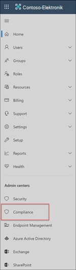

# Fallstudie: contoso konfiguriert schnell eine Offensive Sprachrichtlinie für Microsoft Teams, Exchange und jammern von Kommunikation

Die Kommunikations Kompatibilität in Microsoft 365 hilft, Kommunikationsrisiken zu minimieren, indem Sie Ihnen helfen, ungeeignete Nachrichten in Ihrer Organisation zu erkennen, zu erfassen und zu bearbeiten. Mit vordefinierten und benutzerdefinierten Richtlinien können Sie interne und externe Kommunikationen nach Richtlinien Übereinstimmungen durchsuchen, damit Sie von bestimmten Prüfern geprüft werden können. Bearbeiter können gescannte e-Mails, Microsoft Teams, jammern oder Kommunikation von Drittanbietern in Ihrer Organisation untersuchen und geeignete Korrekturaktionen durchführen, um sicherzustellen, dass diese mit den Nachrichtenstandards Ihrer Organisation konform sind.

Die Contoso Corporation ist eine fiktive Organisation, die schnell eine Richtlinie zur Überwachung auf anstößige Sprache konfigurieren muss. Sie verwenden Microsoft 365 in erster Linie für e-Mails, Microsoft Teams und für die Unterstützung von jammern für Ihre Benutzer, haben jedoch neue Anforderungen, um die Unternehmensrichtlinie um die Belästigung durch Mobbing zu erzwingen. IT-Administratoren und Compliance-Experten von Contoso verfügen über grundlegende Kenntnisse der Grundlagen der Zusammenarbeit mit Microsoft 365 und suchen nach einer End-to-End-Anleitung, wie Sie schnell mit der Kommunikation beginnen können.

In dieser Fallstudie werden die Grundlagen für die schnelle Konfiguration einer Richtlinie zur Kommunikationscompliance zur Überwachung der Kommunikation auf anstößige Sprache behandelt. Diese Anleitung enthält:

- Schritt 1 – Planen der Kommunikationscompliance
- Schritt 2 – Zugreifen auf die Kommunikationscompliance in Microsoft 365
- Schritt 3 – Konfigurieren von Voraussetzungen und Erstellen einer Richtlinie zur Kommunikationscompliance
- Schritt 4 – Untersuchung und Behebung von Warnungen

## Schritt 1: Planen der Kommunikation Compliance

IT-Administratoren und Compliance-Experten von Contoso nahmen an Online-Webinaren zu Compliance-Lösungen in Microsoft 365 Teil und entschieden, dass Compliance-Richtlinien für die Kommunikation Ihnen helfen, die aktualisierten Unternehmensrichtlinien Anforderungen für die Verringerung der Belästigung am Arbeitsplatz zu erfüllen. Gemeinsam haben Sie einen Plan zum Erstellen und Aktivieren einer Kommunikations Konformitätsrichtlinie entwickelt, mit der die beleidigende Sprache für in Microsoft Teams gesendete Chats, private Nachrichten und Community-Unterhaltungen in jammern sowie in Exchange Online gesendete e-Mail-Nachrichten überwacht werden. Ihr Plan umfasst die Identifizierung von:

- Die IT-Administratoren, die Zugriff auf die Kommunikationsrichtlinien Features benötigen.
- Die Compliance-Experten, die Kommunikationsrichtlinien erstellen und verwalten müssen.
- Die Compliance-Experten und andere Kollegen in anderen Abteilungen (Personal, Legal, etc.), die Benachrichtigungen zur Kommunikations Konformität untersuchen und beheben müssen.
- Die Benutzer, die für die Kommunikationsrichtlinien Compliance-Offensive-Sprachrichtlinie in der Reichweite sind.

### Lizenzierung

Der erste Schritt besteht darin zu bestätigen, dass die Microsoft 365-Lizenzierung von Contoso Unterstützung für die Kommunikations kompatibilitätslösung enthält. Für den Zugriff auf und die Verwendung der Kommunikations Konformität müssen die IT-Administratoren von Contoso überprüfen, ob contoso über eine der folgenden Optionen verfügt:

- Microsoft 365 E5-Abonnement (kostenpflichtige oder Testversion)
- Microsoft 365 E3-Abonnement + das Microsoft 365 E5-Compliance-Add-on
- Microsoft 365 E3-Abonnement + Microsoft 365 E5 Insider Risk Management-Add-on
- Microsoft 365 A5-Abonnement (kostenpflichtige oder Testversion)
- Microsoft 365 a3-Abonnement + das Microsoft 365 A5-Konformitäts-Add-on
- Microsoft 365 a3-Abonnement + Microsoft 365 A5 Insider Risk Management-Add-on
- Microsoft 365 G5-Abonnement (kostenpflichtige oder Testversion)
- Microsoft 365 G5-Abonnement + das Microsoft 365 G5-Compliance-Add-on
- Microsoft 365 G5-Abonnement + das Microsoft 365 G5-Insider Risiko Management-Add-on
- Office 365 Enterprise E5-Abonnement (kostenpflichtige oder Testversion)
- Office 365 Enterprise E3-Abonnement + das Office 365 Advanced Compliance-Add-on (nicht mehr für neue Abonnements verfügbar, siehe Hinweis)

Sie müssen außerdem sicherstellen, dass den Benutzern, die in Kommunikationsrichtlinien Richtlinien enthalten sind, eine der oben genannten Lizenzen zugewiesen werden muss.

>[!IMPORTANT]
>Office 365 Advanced Compliance wird nicht mehr als eigenständiges Abonnement verkauft. Wenn die aktuellen Abonnements ablaufen, sollten Kunden zu einem der oben genannten Abonnements übergehen, die die gleichen oder zusätzliche Compliance-Features enthalten.

IT-Administratoren von Contoso führen Sie die folgenden Schritte aus, um die Lizenzierungsunterstützung für contoso zu überprüfen:

1. IT-Administratoren melden sich beim **Microsoft 365 Admin Center** [an https://admin.microsoft.com) (](https://admin.microsoft.com) und wechseln zu **Microsoft 365 Admin Center**-  >  **Abrechnungs**  >  **Lizenzen**.

2. Hier bestätigen Sie, dass Sie über eine der [Lizenzoptionen](https://docs.microsoft.com/microsoft-365/compliance/communication-compliance-configure?view=o365-worldwide#before-you-begin) verfügen, die Unterstützung für die Kommunikations Kompatibilität beinhalten.

### Berechtigungen für die Kommunikations Konformität

Es gibt fünf Rollen, die zum Konfigurieren von Berechtigungen zum Verwalten von Kommunikations Kompatibilitätsfeatures verwendet werden. Um die Kommunikation Compliance als Menüoption im Microsoft 365 Compliance Center zur Verfügung zu stellen und diese Konfigurationsschritte fortzusetzen, werden Contoso-Administratoren die Administratorrolle " *Communications Compliance"* zugewiesen.

Contoso beschließt, eine benutzerdefinierte Rollengruppe zu erstellen und der Gruppe alle Kommunikations Konformitäts Rollen zuzuweisen. Dadurch ist es für Contoso einfacher, schnell zu beginnen und am besten Ihren Compliance-Verwaltungsanforderungen gerecht zu werden.

Contoso erstellt eine Rollengruppe, die alle folgenden Kommunikations Konformitäts Rollen enthält:

|**Rolle**|**Rollenberechtigungen**|
|:-----|:-----|
| **Communication Compliance-Administrator** | Benutzer, denen diese Rolle zugewiesen ist, können Kommunikationsrichtlinien, globale Einstellungen und Rollengruppen Zuordnungen erstellen, lesen, aktualisieren und löschen. Benutzern, denen diese Rolle zugewiesen ist, können keine Nachrichten Benachrichtigungen angezeigt werden. |
| **Kompatibilitätsanalyse für Kommunikation** | Benutzer, denen diese Rolle zugewiesen ist, können Richtlinien anzeigen, in denen Sie als Bearbeiter zugewiesen werden, Nachrichten Metadaten anzeigen (keine Nachrichteninhalte), an zusätzliche Bearbeiter eskalieren oder Benachrichtigungen an Benutzer senden. Ausstehende Warnungen können von Analysten nicht aufgelöst werden. |
| **Untersuchung der Kommunikations Konformität** | Benutzer, denen diese Rolle zugewiesen ist, können Nachrichten Metadaten und-Inhalte anzeigen, an zusätzliche Bearbeiter eskalieren, zu einem erweiterten eDiscovery-Fall eskalieren, Benachrichtigungen an Benutzer senden und die Warnung lösen. |
| **Communication Compliance Viewer** | Benutzer, denen diese Rolle zugewiesen ist, können auf der Homepage der Communication Compliance auf alle Berichts-Widgets zugreifen und alle Kommunikations Konformitätsberichte anzeigen. |
| **Kommunikation Compliance Case Management** | Benutzer, denen diese Rolle zugewiesen ist, können Fälle verwalten und Benachrichtigungen bearbeiten. Diese Rolle ist für das Erstellen benutzerdefinierter Rollengruppen für Administratoren, Analysten und Ermittler erforderlich. Benutzerdefinierte Gruppen für Viewer benötigen diese Rolle nicht zugewiesen. |

1. Contoso-IT-Administratoren melden sich auf der Seite Berechtigungen für das **Office 365 Security and Compliance Center** an [( https://protection.office.com/permissions) ](https://protection.office.com/permissions) Verwenden von Anmeldeinformationen für ein globales Administratorkonto und auswählen des Links zum Anzeigen und Verwalten von Rollen in Microsoft 365.
2. Nachdem Sie **Create**ausgewählt haben, weisen Sie der neuen Rollengruppe den Anzeigenamen "*Communication Compliance*" zu und wählen **dann weiter**aus.
3. Sie wählen **Rollen auswählen** und dann **Hinzufügen** aus. Sie fügen die erforderlichen Rollen hinzu, indem Sie das Kontrollkästchen für *Communication Compliance admin*, *Communication Compliance Analysis*, *Communication Compliance Investigation*, *Communication Compliance Viewer*und *Communication Compliance Case Management*aktivieren und dann **Hinzufügen**, **Fertig** und **weiter**auswählen.

    

4. Als nächstes wählen die IT-Administratoren **Mitglieder auswählen** aus, und dann **Hinzufügen**. Das Kontrollkästchen für alle Benutzer und Gruppen aktivieren, für die Sie Richtlinien erstellen und Nachrichten mit Richtlinien Übereinstimmungen verwalten möchten. Sie fügen die IT-Administratoren, Compliance-Spezialisten und andere Kollegen der Personal- und Rechtsabteilung hinzu, die sie bei der ursprünglichen Planung identifiziert haben, und wählen dann **Hinzufügen**, **Fertig** und **Weiter** aus.
5. Um die Berechtigungen abzuschließen, wählen die IT-Administratoren zum Abschluss **Rollengruppe** erstellen. Es dauert etwa 30 Minuten, bis die Rollen im Microsoft 365-Dienst von Contoso wirksam werden.

    

## Schritt 2: Zugreifen auf die Kommunikations Kompatibilität in Microsoft 365

Nach dem Konfigurieren der Berechtigungen für die Kommunikationscompliance können die IT-Administratoren und Compliance-Spezialisten von Contoso, die in der neuen Rollengruppe definiert wurden, auf die Kommunikationscompliance-Lösung in Microsoft 365 zugreifen. IT-Administratoren und Compliance-Experten von Contoso haben verschiedene Möglichkeiten für den Zugriff auf die Kommunikations Konformität und erste Schritte beim Erstellen einer neuen Richtlinie:

- Direktes Starten von der Kommunikations kompatibilitätslösung
- Ausgehend vom Microsoft 365 Compliance Center
- Ausgehend vom Microsoft 365-Lösungskatalog
- Ausgehend vom Microsoft 365 Admin Center

### Direktes Starten von der Kommunikations kompatibilitätslösung

Die schnellste Möglichkeit für den Zugriff auf die Lösung ist die direkte Anmeldung bei der **Communication Compliance** ( <https://compliance.microsoft.com/supervisoryreview> )-Lösung. Mithilfe dieses Links werden die Experten von Contoso IT-Administratoren und Compliance-Spezialisten an das Dashboard zur Kommunikation-Compliance-Übersicht weitergeleitet, in dem Sie schnell den Status von Warnungen überprüfen und neue Richtlinien aus den vordefinierten Vorlagen erstellen können.

### Ausgehend vom Microsoft 365 Compliance Center

Eine weitere einfache Möglichkeit für IT-Administratoren und Compliance-Experten von Contoso, auf die Lösung für die Kommunikations Konformität zuzugreifen, ist die direkte Anmeldung beim **Microsoft 365 Compliance Center** [( https://compliance.microsoft.com) ](https://compliance.microsoft.com). Nach der Anmeldung müssen die Benutzer lediglich das Steuerelement **Alle anzeigen** auswählen, um alle Compliance-Lösungen anzuzeigen, und dann die Lösung **Kommunikationscompliance** auswählen, um zu beginnen.

### Ausgehend vom Microsoft 365-Lösungskatalog

Contoso-IT-Administratoren und Compliance-Experten können sich auch für den Zugriff auf die Kommunikations kompatibilitätslösung entscheiden, indem Sie den Microsoft 365-Lösungskatalog auswählen. Wenn Sie im Abschnitt " **catalog** in **Solutions** " im linken Navigationsbereich im **Microsoft 365 Compliance Center**auswählen, können Sie den Lösungskatalog öffnen, in dem alle Microsoft 365-Kompatibilitätslösungen aufgelistet sind. Wenn Sie einen Bildlauf nach unten zum Abschnitt **Insider Risk Management** durchführen, können Contoso-IT-Administratoren die Kommunikations Kompatibilität für erste Schritte auswählen. Contoso-IT-Administratoren entscheiden sich außerdem für die Verwendung der Anzeige im Navigationssteuerelement, um die Lösung für die Kommunikations Konformität im linken Navigationsbereich für einen schnelleren Zugriff zu fixieren, wenn Sie sich in Zukunft anmelden.

### Ausgehend vom Microsoft 365 Admin Center

Für den Zugriff auf die Kommunikations Kompatibilität beim Start vom Microsoft 365 Admin Center melden sich Contoso IT-Administratoren und Compliance-Experten beim Microsoft 365 Admin Center an [( https://admin.microsoft.com) ](https://admin.microsoft.com) und navigieren Sie zu **Microsoft 365 Admin Center**  >  **Compliance**.

Mit dieser Aktion wird das **Office 365 Security and Compliance Center**geöffnet, und Sie müssen den Link zum **Microsoft 365 Compliance Center** auswählen, der im Banner oben auf der Seite angegeben ist.

Sobald Sie sich im **Microsoft 365 Compliance Center**befinden, wählen Sie " **Alle anzeigen** " aus, um die vollständige Liste der Kompatibilitätslösungen anzuzeigen.

Nachdem Sie **Alle anzeigen**ausgewählt haben, können die IT-Administratoren von Contoso auf die Lösung für die Kommunikations Konformität zugreifen.

## Schritt 3: Konfigurieren von Voraussetzungen und Erstellen einer Konformitätsrichtlinie für die Kommunikation

Um mit einer Richtlinie zur Kommunikationscompliance zu beginnen, müssen IT-Administratoren von Contoso mehrere Voraussetzungen konfigurieren, bevor sie die neue Richtlinie zur Überwachung auf anstößige Sprache einrichten können. Nachdem diese Voraussetzungen erfüllt sind, können die IT-Administratoren und Compliance-Spezialisten von Contoso die neue Richtlinie konfigurieren, und die Compliance-Spezialisten können mit der Untersuchung und Behebung aller generierten Warnungen beginnen.

### Aktivieren der Überwachung in Microsoft 365

Für die Kommunikationscompliance sind Überwachungsprotokolle erforderlich, um Warnungen anzuzeigen und die von den Prüfern ergriffenen Abhilfemaßnahmen zu verfolgen. Die Überwachungsprotokolle sind eine Zusammenfassung aller Aktivitäten im Zusammenhang mit einer definierten Organisationsrichtlinie oder immer dann, wenn es eine Änderung einer Richtlinie zur Kommunikationscompliance gibt.

Die IT-Administratoren von Contoso überprüfen und vervollständigen die [Schritt-für-Schritt-Anweisungen](https://docs.microsoft.com/microsoft-365/compliance/turn-audit-log-search-on-or-off) zum Aktivieren der Überwachung. Daraufhin teilt ihnen eine Meldung mit, dass das Überwachungsprotokoll vorbereitet wird und sie in ein paar Stunden nach Abschluss der Vorbereitung eine Suche durchführen können. Die IT-Administratoren von Contoso müssen diese Aktion nur einmal ausführen.

### Konfigurieren des Jammer-Mandanten für den einheitlichen Modus

Für die Kommunikation ist es erforderlich, dass der Jammer-Mandant für eine Organisation im einheitlichen Modus ist, um anstößige Sprachen in privaten Nachrichten und Unterhaltungen in öffentlichen Communitys zu überwachen.

IT-Administratoren von Contoso stellen Sie sicher, dass Sie die Informationen in der Übersicht über den [einheitlichen Modus "jammern" im Microsoft 365-Artikel](https://docs.microsoft.com/yammer/configure-your-yammer-network/overview-native-mode) lesen, und befolgen Sie die Schritte zum Ausführen des Migrationstools im Thema [Konfigurieren Ihres Jammer Netzwerks für den einheitlichen Modus für Microsoft 365](https://docs.microsoft.com/yammer/configure-your-yammer-network/native-mode) .

### Einrichten einer Gruppe für Benutzer im Bereich

Contoso-Compliance-Experten möchten alle Benutzer der Kommunikationsrichtlinie hinzufügen, die eine anstößige Sprache überwachen soll. Sie können beschließen, jedes Benutzerkonto separat zur Richtlinie hinzuzufügen, aber Sie haben beschlossen, dass es viel einfacher ist, und Zeit sparen, um eine Verteilergruppe " **alle Benutzer** " für die Benutzer dieser Richtlinie zu verwenden.

Sie müssen eine neue Gruppe erstellen, um alle Contoso-Benutzer einzubeziehen, sodass Sie die folgenden Schritte ausführen:

1. Contoso IT-Administratoren melden Sie sich beim **Microsoft 365 Admin Center** [an https://admin.microsoft.com) (](https://admin.microsoft.com) und navigieren Sie zu **Microsoft 365 Admin Center**  >  **Groups**  >  **Groups**.
2. Sie wählen **Hinzufügen einer Gruppe** und schließen den Assistenten aus, um eine neue *Microsoft 365-Gruppe* oder- *Verteilergruppe*zu erstellen.

    

3. Nachdem die neue Gruppe erstellt wurde, müssen alle Contoso-Benutzer zu der neuen Gruppe hinzugefügt werden. Sie öffnen das **Exchange Admin Center** [( https://outlook.office365.com/ecp) ](https://outlook.office365.com/ecp) und wechseln zu **Exchange Admin Center**  >  **Recipients**  >  **Groups**. Die IT-Administratoren von Contoso wählen den Mitgliedschaftsbereich und die neue Gruppe *alle Mitarbeiter* aus, die Sie erstellt haben, und wählen das **Bearbeitungs** Steuerelement aus, um alle Contoso-Benutzer der neuen Gruppe im Assistenten hinzuzufügen.

    

### Erstellung der Richtlinie zur Überwachung auf anstößige Sprache

Wenn alle Voraussetzungen erfüllt sind, sind die IT-Administratoren und die Compliance-Spezialisten von Contoso bereit, die Richtlinien für die Kommunikationscompliance zur Überwachung auf anstößige Sprache zu konfigurieren. Mit der neuen Richtlinienvorlage für anstößige Sprache ist die Konfiguration dieser Richtlinie einfach und schnell.

1. Die IT-Administratoren und Compliance-Spezialisten von Contoso melden sich beim **Microsoft 365 Compliance Center** an und wählen im linken Navigationsbereich die Option **Kommunikationscompliance** aus. Mit dieser Aktion wird das Dashboard **Übersicht** geöffnet, das Schnellverknüpfungen für Richtlinienvorlagen zur Kommunikationscompliance enthält. Sie wählen die Vorlage **Überwachung auf anstößige Sprache**, indem sie für die Vorlage **Erste Schritte** wählen.

    

2. Im Assistenten für Richtlinienvorlagen arbeiten die IT-Administratoren und Compliance-Spezialisten von Contoso zusammen, um die drei erforderlichen Felder auszufüllen: **Richtliniennamen**, **Zu beaufsichtigende Benutzer oder Gruppen** und **Prüfer**.
3. Da der Assistent für Richtlinien bereits einen Namen für die Richtlinie vorgeschlagen hat, beschließen die IT-Administratoren und Compliance-Spezialisten, den vorgeschlagenen Namen beizubehalten und sich auf die übrigen Bereiche zu konzentrieren. Sie wählen die Gruppe *alle Benutzer* für die **zu überwachenden Benutzer oder Gruppen** aus und wählen die Kompatibilitäts Experten aus, die Richtlinienwarnungen für das Feld **Bearbeiter** untersuchen und korrigieren sollten. Der letzte Schritt zum Konfigurieren der Richtlinie und zum Starten der Erfassung von Warnungsinformationen besteht in der Auswahl von **Create Policy**.

    

## Schritt 4: untersuchen und Beheben von Warnungen

Nun, da die Richtlinie zur Überwachung der Kommunikationscompliance auf anstößige Sprache konfiguriert ist, besteht der nächste Schritt für die Compliance-Spezialisten von Contoso darin, alle durch die Richtlinie erzeugten Warnungen zu untersuchen und zu beheben. Es wird bis zu 24 Stunden dauern, bis die Richtlinie die Kommunikationen in allen Kommunikationskanälen vollständig verarbeitet hat und die Warnungen im **Dashboard „Warnung“** angezeigt werden.

Nachdem Warnungen generiert wurden, befolgen die Contoso-Compliance-Experten die [Workflowanweisungen](https://docs.microsoft.com/microsoft-365/compliance/communication-compliance-investigate-remediate) , um anstößige Sprachprobleme zu untersuchen und zu beheben.