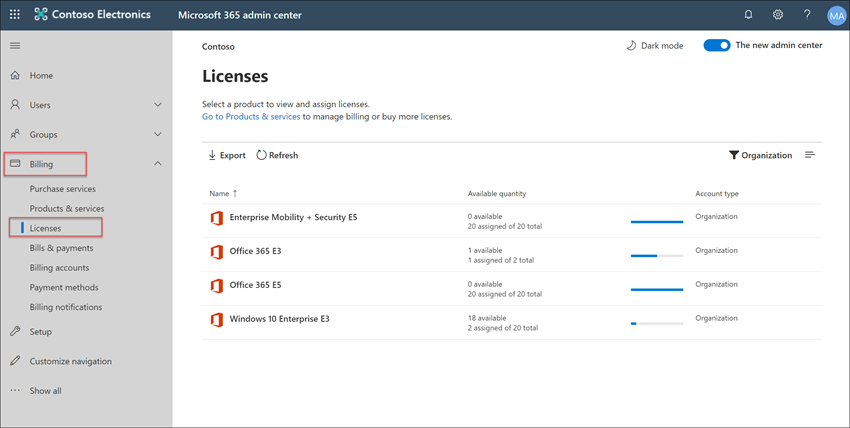
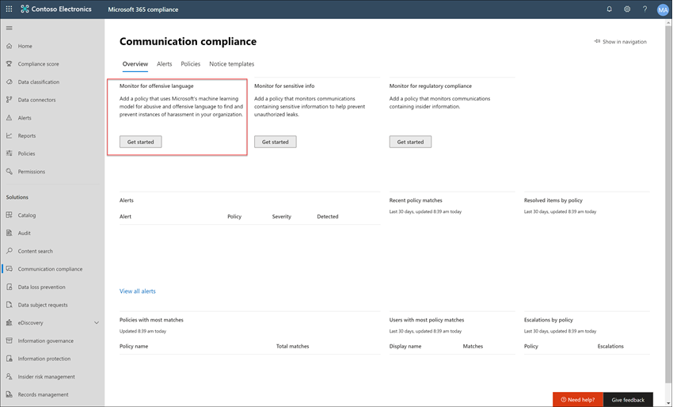

# Fallstudie – Contoso konfiguriert schnell eine anstößige Sprachrichtlinie für Microsoft Teams, Exchange und Yammer Kommunikation

Kommunikationskonformität in Microsoft 365 hilft, Kommunikationsrisiken zu minimieren, indem Sie unangemessene Nachrichten in Ihrer Organisation erkennen, erfassen und gegen sie handeln. Mit vordefinierten und benutzerdefinierten Richtlinien können Sie die interne und externe Kommunikation auf Richtlinien übereinstimmungen überprüfen, damit sie von bestimmten Prüfern geprüft werden können. Prüfer können die gescannte E-Mail-, Microsoft Teams-, Yammer- oder Drittanbieterkommunikation in Ihrer Organisation untersuchen und geeignete Abhilfemaßnahmen ergreifen, um sicherzustellen, dass sie den Nachrichtenstandards Ihrer Organisation entsprechen.

Die Contoso Corporation ist eine fiktive Organisation, die schnell eine Richtlinie zur Überwachung auf anstößige Sprache konfigurieren muss. Sie haben die Microsoft 365 in erster Linie für E-Mails, Microsoft Teams und Yammer für ihre Benutzer verwendet, haben jedoch neue Anforderungen, um Unternehmensrichtlinien im Microsoft Teams der Belästigung am Arbeitsplatz durchzusetzen. Contoso-IT-Administratoren und Compliancespezialisten verfügen über grundlegende Kenntnisse der Grundlagen der Arbeit mit Microsoft 365 und suchen nach end-to-end-Anleitungen, wie Sie schnell mit der Kommunikationskonformität beginnen können.

In dieser Fallstudie werden die Grundlagen für die schnelle Konfiguration einer Richtlinie zur Kommunikationscompliance zur Überwachung der Kommunikation auf anstößige Sprache behandelt. Diese Anleitung enthält:

- Schritt 1 – Planen der Kommunikationscompliance
- Schritt 2 – Zugreifen auf die Kommunikationscompliance in Microsoft 365
- Schritt 3 – Konfigurieren von Voraussetzungen und Erstellen einer Richtlinie zur Kommunikationscompliance
- Schritt 4 – Untersuchung und Behebung von Warnungen

## Schritt 1: Planen der Kommunikationskonformität

Contoso-IT-Administratoren und Compliancespezialisten besuchten Online-Webinare zu Compliancelösungen in Microsoft 365 und entschieden, dass Richtlinien zur Kommunikationskonformität ihnen helfen, die aktualisierten Unternehmensrichtlinienanforderungen zur Reduzierung von Belästigungen am Arbeitsplatz zu erfüllen. Gemeinsam haben sie einen Plan entwickelt, um eine Kommunikationskonformitätsrichtlinie zu erstellen und zu aktivieren, die auf anstößige Sprache für In Microsoft Teams gesendete Chats, private Nachrichten und Communityunterhaltungen in Yammer und in E-Mail-Nachrichten überwacht, die in Exchange Online gesendet werden. Ihr Plan umfasst die Identifizierung von:

- Die IT-Administratoren, die Zugriff auf Kommunikationskonformitätsfeatures benötigen.
- Die Compliancespezialisten, die Kommunikationsrichtlinien erstellen und verwalten müssen.
- Die Compliancespezialisten und andere Kollegen in anderen Abteilungen (Personalwesen, Recht usw.), die Warnungen zur Kommunikationskonformität untersuchen und begleichen müssen.
- Die Benutzer, die für die Kommunikationskonformität anstößige Sprachrichtlinie in den Bereich kommen.

### Lizenzierung

Der erste Schritt besteht in der Bestätigung, dass die Microsoft 365 von Contoso Unterstützung für die Kommunikationskonformitätslösung umfasst. Um auf die Kommunikationskonformität zu zugreifen und diese zu verwenden, müssen Contoso-IT-Administratoren überprüfen, ob Contoso über eine der folgenden Informationen verfügt:

- Microsoft 365 E5 Abonnement (kostenpflichtig oder Testversion)
- Microsoft 365 E3 Abonnement + das Microsoft 365 E5 Compliance-Add-On
- Microsoft 365 E3 Abonnement + das Microsoft 365 E5 Insider Risk Management-Add-On
- Microsoft 365 A5-Abonnement (kostenpflichtig oder Testversion)
- Microsoft 365 A3-Abonnement + Microsoft 365 A5 Compliance-Add-On
- Microsoft 365 A3-Abonnement + Microsoft 365 A5 Insider Risk Management-Add-On
- Microsoft 365 G5-Abonnement (kostenpflichtig oder Testversion)
- Microsoft 365 G5-Abonnement + Microsoft 365 G5 Compliance-Add-On
- Microsoft 365 G5-Abonnement + Microsoft 365 G5 Insider Risk Management-Add-On
- Office 365 Enterprise E5-Abonnement (kostenpflichtig oder Testversion)
- Office 365 Enterprise E3-Abonnement + Office 365 Advanced Compliance -Add-On (nicht mehr verfügbar für neue Abonnements, siehe Hinweis)

Sie müssen außerdem bestätigen, dass Benutzern, die in Kommunikationskonformitätsrichtlinien enthalten sind, eine der oben genannten Lizenzen zugewiesen werden muss.

>[!IMPORTANT]
>Office 365 Advanced Compliance wird nicht mehr als eigenständiges Abonnement verkauft. Wenn aktuelle Abonnements ablaufen, sollten Kunden zu einem der oben genannten Abonnements überwechseln, die die gleichen oder zusätzlichen Compliancefeatures enthalten.

Contoso-IT-Administratoren müssen die folgenden Schritte ausführen, um die Lizenzierungsunterstützung für Contoso zu überprüfen:

1. IT-Administratoren melden sich beim **Microsoft 365 Admin Center** an [( https://admin.microsoft.com)](https://admin.microsoft.com) und navigieren Sie zu **Microsoft 365 Admin Center**  >  **Billing**  >  **Licenses**.

2. Hier bestätigen sie, dass sie über eine der [Lizenzoptionen verfügen,](communication-compliance-configure.md#subscriptions-and-licensing) die Unterstützung für die Kommunikationskonformität umfassen.

### Berechtigungen für die Kommunikationskonformität

Es gibt fünf Rollengruppen, die zum Konfigurieren von Berechtigungen zum Verwalten von Kommunikationskonformitätsfeatures verwendet werden. Um  die Kommunikationskonformität als Menüoption im Microsoft 365 zur Verfügung zu stellen und mit diesen Konfigurationsschritten fortzufahren, wird Den Contoso-Administratoren die Administratorrolle *Kommunikationskonformität* zugewiesen.

Contoso entscheidet,  die Rollengruppe "Kommunikationskonformität" zu verwenden, um alle Kommunikationskonformitätsadministratoren, Analysten, Ermittler und Viewer der Gruppe zuzuordnen. Dies erleichtert Contoso die ersten Schritte und passt sich am besten ihren Anforderungen an die Complianceverwaltung an.

|**Rolle**|**Rollenberechtigungen**|
|:-----|:-----|
| **Kommunikationskonformität** | Verwenden Sie diese Rollengruppe, um die Kommunikationskonformität für Ihre Organisation in einer einzigen Gruppe zu verwalten. Durch Hinzufügen aller Benutzerkonten für designierte Administratoren, Analysten, Ermittler und Viewer können Sie Berechtigungen für die Kommunikationskonformität in einer einzigen Gruppe konfigurieren. Diese Rollengruppe enthält alle Berechtigungsrollen für die Kommunikationskonformität. Diese Konfiguration ist die einfachste Möglichkeit, schnell mit der Kommunikationskonformität zu beginnen und ist für Organisationen geeignet, die keine separaten Berechtigungen benötigen, die für separate Benutzergruppen definiert sind. |
| **Kommunikations-Compliance-Administrator** | Verwenden Sie diese Rollengruppe, um zunächst die Kommunikationskonformität zu konfigurieren und später Administratoren der Kommunikationskonformität in eine definierte Gruppe zu trennen. Benutzer, die dieser Rollengruppe zugewiesen sind, können Kommunikationskonformitätsrichtlinien, globale Einstellungen und Rollengruppenzuweisungen erstellen, lesen, aktualisieren und löschen. Benutzer, die dieser Rollengruppe zugewiesen sind, können keine Benachrichtigungen anzeigen. |
| **Communication Compliance Analyst** | Verwenden Sie diese Gruppe, um Benutzern Berechtigungen zu erteilen, die als Kommunikations-Compliance-Analysten fungieren. Benutzer, die dieser Rollengruppe zugewiesen sind, können Richtlinien anzeigen, an denen sie als Prüfer zugewiesen sind, Nachrichtenmetadaten (nicht Nachrichteninhalte) anzeigen, an zusätzliche Prüfer eskalieren oder Benachrichtigungen an Benutzer senden. Analysten können ausstehende Warnungen nicht auflösen. |
| **Kommunikations-Compliance-Prüfer** | Verwenden Sie diese Gruppe, um Benutzern Berechtigungen zu erteilen, die als Ermittler für die Kommunikationskonformität fungieren. Benutzer, die dieser Rollengruppe zugewiesen sind, können Nachrichtenmetadaten und -inhalte anzeigen, an zusätzliche Prüfer eskalieren, auf einen Advanced eDiscovery-Fall eskalieren, Benachrichtigungen an Benutzer senden und die Warnung auflösen. |
| **Communication Compliance Viewer** | Verwenden Sie diese Gruppe, um Benutzern Berechtigungen zu erteilen, die Kommunikationsberichte verwalten. Benutzer, die dieser Rollengruppe zugewiesen sind, können auf der Homepage der Kommunikationskonformität auf alle Berichts-Widgets zugreifen und alle Berichte zur Kommunikationskonformität anzeigen. |

1. Contoso-IT-Administratoren melden sich auf der Office 365 Security & Compliance Center-Berechtigungsseite [an ( https://protection.office.com/permissions) ](https://protection.office.com/permissions) verwenden Sie Anmeldeinformationen für ein globales Administratorkonto, und wählen Sie den Link zum Anzeigen und Verwalten von Rollen in Microsoft 365. 
2. Im **Security & Compliance Center** wechseln sie zu **Berechtigungen** und wählen den Link zum Anzeigen und Verwalten von Rollen in Office 365.
3. Die Administratoren wählen die *Rollengruppe Kommunikationskonformität* und dann **Rollengruppe bearbeiten aus.**
4. Die Administratoren wählen **Im** linken Navigationsbereich Mitglieder auswählen aus, und wählen Sie dann **Bearbeiten aus.**
5. Sie wählen **Hinzufügen** aus, und aktivieren Sie dann das Kontrollkästchen für alle Contoso-Benutzer, die die Kommunikationskonformität verwalten, Warnungen untersuchen und überprüfen.
6. Die Administratoren wählen **Hinzufügen** und dann **Fertig aus.**
7. Sie wählen **Speichern aus,** um der Rollengruppe Contoso-Benutzer hinzuzufügen. Sie wählen **Schließen aus,** um die Schritte zu ausführen.

## Schritt 2: Zugreifen auf Kommunikationskonformität in Microsoft 365

Nach dem Konfigurieren der Berechtigungen für die Kommunikationskonformität können contoso-IT-Administratoren und Compliancespezialisten, die der Rollengruppe Kommunikationskonformität zugewiesen sind, auf die Kommunikationskonformitätslösung in Microsoft 365. Contoso-IT-Administratoren und Compliancespezialisten haben verschiedene Möglichkeiten, auf Kommunikationskonformität zu zugreifen und mit dem Erstellen einer neuen Richtlinie zu beginnen:

- Direkt von der Kommunikationskonformitätslösung aus starten
- Beginnend mit dem Microsoft 365 Compliance Center
- Ausgehend vom Microsoft 365 Lösungskatalog
- Beginnend mit Microsoft 365 Admin Center

### Direkt von der Kommunikationskonformitätslösung aus starten

Die schnellste Möglichkeit, auf die Lösung zu  zugreifen, besteht in der direkten Anmeldung bei der Kommunikationskonformitätslösung ( <https://compliance.microsoft.com/supervisoryreview> ) Über diesen Link werden Contoso-IT-Administratoren und Compliancespezialisten an das Dashboard zur Kommunikationskonformitätsübersicht geleitet, wo Sie den Status von Warnungen schnell überprüfen und neue Richtlinien aus den vordefinierten Vorlagen erstellen können.

### Beginnend mit dem Microsoft 365 Compliance Center

Eine weitere einfache Möglichkeit für Contoso-IT-Administratoren und Compliance-Spezialisten, auf die Kommunikations-Compliance-Lösung zu zugreifen, ist die direkte Anmeldung beim **Microsoft 365 Compliance Center** [( https://compliance.microsoft.com)](https://compliance.microsoft.com). Nach der Anmeldung müssen die Benutzer lediglich das Steuerelement **Alle anzeigen** auswählen, um alle Compliance-Lösungen anzuzeigen, und dann die Lösung **Kommunikationscompliance** auswählen, um zu beginnen.

### Ausgehend vom Microsoft 365 Lösungskatalog

Contoso-IT-Administratoren und Compliancespezialisten können auch auf die Lösung für die Kommunikationskonformität zugreifen, indem sie den Microsoft 365 auswählen. Durch Auswählen  **des Abschnitts** Katalog im Abschnitt Lösungen der linken Navigation im **Microsoft 365 Compliance Center** können sie den Lösungskatalog öffnen, der alle Microsoft 365 enthält. Wenn Sie einen Bildlauf zum **Abschnitt Insider risk management** durchführen, können Contoso-IT-Administratoren die Kommunikationskonformität auswählen, um die ersten Schritte zu starten. Contoso-IT-Administratoren entscheiden außerdem, das Navigationssteuerelement Anzeigen zu verwenden, um die Lösung für die Kommunikationskonformität im linken Navigationsbereich anheften zu können, um schnelleren Zugriff zu erhalten, wenn sie sich bei der Anmeldung anmelden.

### Beginnend mit Microsoft 365 Admin Center

Um auf die Kommunikationskonformität zu zugreifen, wenn sie vom Microsoft 365 Admin Center aus beginnen, melden sich Contoso-IT-Administratoren und Compliancespezialisten beim Microsoft 365 Admin Center [an https://admin.microsoft.com) (](https://admin.microsoft.com) und navigieren Sie zu Microsoft 365 Admin **Center**  >  **Compliance**.

Mit dieser Aktion wird **das Office 365 Security and Compliance Center** geöffnet, und sie müssen den Link zum Microsoft 365 Compliance **Center** auswählen, das im Banner am oberen Rand der Seite bereitgestellt ist.

Sobald sich Microsoft 365 **Compliance Center** befindet, wählen Contoso-IT-Administratoren **Alle** anzeigen aus, um die vollständige Liste der Compliancelösungen anzeigen zu können.

Nachdem Sie **Alle anzeigen ausgewählt** haben, können die Contoso-IT-Administratoren auf die Kommunikationskonformitätslösung zugreifen.

## Schritt 3: Konfigurieren von Voraussetzungen und Erstellen einer Kommunikationskonformitätsrichtlinie

Um mit einer Richtlinie zur Kommunikationscompliance zu beginnen, müssen IT-Administratoren von Contoso mehrere Voraussetzungen konfigurieren, bevor sie die neue Richtlinie zur Überwachung auf anstößige Sprache einrichten können. Nachdem diese Voraussetzungen erfüllt sind, können die IT-Administratoren und Compliance-Spezialisten von Contoso die neue Richtlinie konfigurieren, und die Compliance-Spezialisten können mit der Untersuchung und Behebung aller generierten Warnungen beginnen.

### Aktivieren der Überwachung in Microsoft 365

Für die Kommunikationscompliance sind Überwachungsprotokolle erforderlich, um Warnungen anzuzeigen und die von den Prüfern ergriffenen Abhilfemaßnahmen zu verfolgen. Die Überwachungsprotokolle sind eine Zusammenfassung aller Aktivitäten im Zusammenhang mit einer definierten Organisationsrichtlinie oder immer dann, wenn es eine Änderung einer Richtlinie zur Kommunikationscompliance gibt.

Die IT-Administratoren von Contoso überprüfen und vervollständigen die [Schritt-für-Schritt-Anweisungen](turn-audit-log-search-on-or-off.md) zum Aktivieren der Überwachung. Daraufhin teilt ihnen eine Meldung mit, dass das Überwachungsprotokoll vorbereitet wird und sie in ein paar Stunden nach Abschluss der Vorbereitung eine Suche durchführen können. Die IT-Administratoren von Contoso müssen diese Aktion nur einmal ausführen.

### Konfigurieren Yammer Mandanten für den nativen Modus

Die Kommunikationskonformität setzt voraus, dass Yammer Mandanten für eine Organisation im nativen Modus ist, um die anstößige Sprache in privaten Nachrichten und öffentlichen Communityunterhaltungen zu überwachen.

Contoso-IT-Administratoren stellen sicher, dass sie die Informationen im Artikel Overview [of Yammer Native Mode in Microsoft 365](/yammer/configure-your-yammer-network/overview-native-mode) überprüfen und die Schritte zum Ausführen des Migrationstools im Artikel Configure your Yammer network for Native Mode for [Microsoft 365](/yammer/configure-your-yammer-network/native-mode) ausführen.

### Einrichten einer Gruppe für Benutzer im Bereich

Contoso-Compliancespezialisten möchten alle Benutzer zur Kommunikationsrichtlinie hinzufügen, die auf anstößige Sprache überwacht wird. Sie könnten entscheiden, jedes Benutzerkonto der Richtlinie separat hinzuzufügen, aber sie haben entschieden, dass es viel einfacher ist und zeitsparend ist, eine **Verteilergruppe** "Alle Benutzer" für die Benutzer für diese Richtlinie zu verwenden.

Sie müssen eine neue Gruppe erstellen, die alle Contoso-Benutzer enthält, sodass sie die folgenden Schritte ausführen:

1. Contoso IT administrators IT sign in to **the Microsoft 365 admin center** [ https://admin.microsoft.com) (](https://admin.microsoft.com) and navigate to Microsoft 365 admin **center**  >    >  **Groups**.
2. Sie wählen **Gruppe hinzufügen aus, und** schließen Sie den Assistenten ab, um eine Microsoft 365 *oder* *Verteilergruppe zu erstellen.*

    

3. Nachdem die neue Gruppe erstellt wurde, müssen alle Contoso-Benutzer zu der neuen Gruppe hinzugefügt werden. Sie öffnen das **Exchange Admin Center** [( https://outlook.office365.com/ecp)](https://outlook.office365.com/ecp) und navigieren zu **Exchange Admin**  >  **Center-Empfängergruppen**  >  . Die Contoso-IT-Administratoren wählen den Bereich Mitgliedschaft und die  neue Gruppe *Alle* Mitarbeiter aus, die sie erstellt haben, und wählen das Steuerelement Bearbeiten aus, um der neuen Gruppe im Assistenten alle Contoso-Benutzer hinzuzufügen.

    

### Erstellung der Richtlinie zur Überwachung auf anstößige Sprache

Wenn alle Voraussetzungen erfüllt sind, sind die IT-Administratoren und die Compliance-Spezialisten von Contoso bereit, die Richtlinien für die Kommunikationscompliance zur Überwachung auf anstößige Sprache zu konfigurieren. Mit der neuen Richtlinienvorlage für anstößige Sprache ist die Konfiguration dieser Richtlinie einfach und schnell.

1. Die IT-Administratoren und Compliance-Spezialisten von Contoso melden sich beim **Microsoft 365 Compliance Center** an und wählen im linken Navigationsbereich die Option **Kommunikationscompliance** aus. Mit dieser Aktion wird das Dashboard **Übersicht** geöffnet, das Schnellverknüpfungen für Richtlinienvorlagen zur Kommunikationscompliance enthält. Sie wählen die Vorlage **Überwachung auf anstößige Sprache**, indem sie für die Vorlage **Erste Schritte** wählen.

    

2. Im Assistenten für Richtlinienvorlagen arbeiten die IT-Administratoren und Compliance-Spezialisten von Contoso zusammen, um die drei erforderlichen Felder auszufüllen: **Richtliniennamen**, **Zu beaufsichtigende Benutzer oder Gruppen** und **Prüfer**.
3. Da der Assistent für Richtlinien bereits einen Namen für die Richtlinie vorgeschlagen hat, beschließen die IT-Administratoren und Compliance-Spezialisten, den vorgeschlagenen Namen beizubehalten und sich auf die übrigen Bereiche zu konzentrieren. Sie wählen die Gruppe  *Alle Benutzer* für das Zu überwachende Feld Benutzer oder Gruppen aus, und wählen die Compliancespezialisten aus, die Richtlinienwarnungen für das Feld Prüfer untersuchen und **berichtigen** sollten. Der letzte Schritt zum Konfigurieren der Richtlinie und zum Sammeln von Warnungsinformationen besteht in der Auswahl **von Richtlinie erstellen**.

    

## Schritt 4: Untersuchen und Behebung von Warnungen

Nun, da die Richtlinie zur Überwachung der Kommunikationscompliance auf anstößige Sprache konfiguriert ist, besteht der nächste Schritt für die Compliance-Spezialisten von Contoso darin, alle durch die Richtlinie erzeugten Warnungen zu untersuchen und zu beheben. Es wird bis zu 24 Stunden dauern, bis die Richtlinie die Kommunikationen in allen Kommunikationskanälen vollständig verarbeitet hat und die Warnungen im **Dashboard „Warnung“** angezeigt werden.

Nachdem Warnungen generiert wurden, befolgen Contoso-Compliancespezialisten die [Workflowanweisungen,](communication-compliance-investigate-remediate.md) um anstößige Sprachprobleme zu untersuchen und zu beheben.