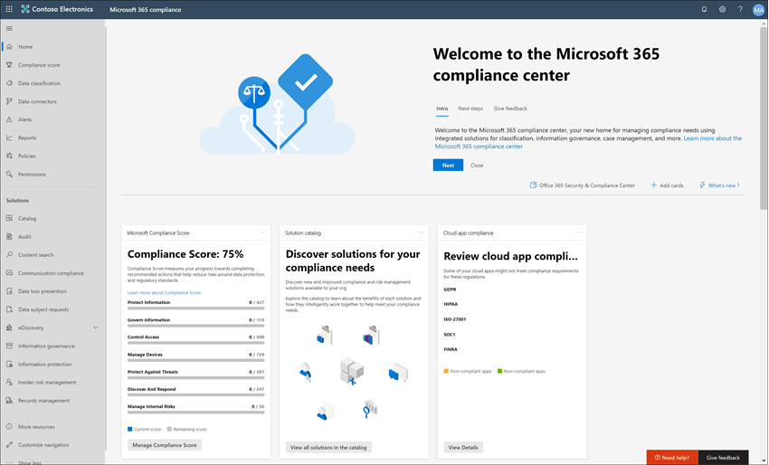

# Fallstudie: contoso konfiguriert schnell eine Offensive Sprachrichtlinie für Microsoft Teams, Exchange und jammern von KommunikationCase study - Contoso quickly configures an offensive language policy for Microsoft Teams, Exchange, and Yammer communications

Die Kommunikations Kompatibilität in Microsoft 365 hilft, Kommunikationsrisiken zu minimieren, indem Sie Sie bei der Erkennung, Erfassung und Durchführung von Korrekturaktionen für ungeeignete Nachrichten in Ihrer Organisation unterstützen.Communication compliance in Microsoft 365 helps minimize communication risks by helping you detect, capture, and take remediation actions for inappropriate messages in your organization. Mit vordefinierten und benutzerdefinierten Richtlinien können Sie interne und externe Kommunikationen nach Richtlinien Übereinstimmungen durchsuchen, damit Sie von bestimmten Prüfern geprüft werden können.Pre-defined and custom policies allow you to scan internal and external communications for policy matches so they can be examined by designated reviewers. Bearbeiter können gescannte e-Mails, Microsoft Teams, jammern oder Kommunikation von Drittanbietern in Ihrer Organisation untersuchen und geeignete Korrekturaktionen durchführen, um sicherzustellen, dass diese mit den Nachrichtenstandards Ihrer Organisation konform sind.Reviewers can investigate scanned email, Microsoft Teams, Yammer, or third-party communications in your organization and take appropriate remediation actions to make sure they're compliant with your organization's message standards.

Die Contoso Corporation ist eine fiktive Organisation, die schnell eine Richtlinie zur Überwachung auf anstößige Sprache konfigurieren muss.The Contoso Corporation is a fictional organization that needs to quickly configure a policy to monitor for offensive language. Sie verwenden Microsoft 365 in erster Linie für e-Mails, Microsoft Teams und für die Unterstützung von jammern für Ihre Mitarbeiter, haben jedoch neue Anforderungen, um die Unternehmensrichtlinie um die Belästigung durch Mobbing zu erzwingen.They have been using Microsoft 365 primarily for email, Microsoft Teams, and Yammer support for their employees but have new requirements to enforce company policy around workplace harassment. IT-Administratoren und Compliance-Experten von Contoso verfügen über grundlegende Kenntnisse der Grundlagen der Zusammenarbeit mit Microsoft 365 und suchen nach einer End-to-End-Anleitung, wie Sie schnell mit der Kommunikation beginnen können.Contoso IT administrators and compliance specialists have a basic understanding of the fundamentals of working with Microsoft 365 and are looking for end-to-end guidance for how to quickly get started with communication compliance.

In dieser Fallstudie werden die Grundlagen für die schnelle Konfiguration einer Richtlinie zur Kommunikationscompliance zur Überwachung der Kommunikation auf anstößige Sprache behandelt.This case study will cover the basics for quickly configuring a communication compliance policy to monitor communications for offensive language. Diese Anleitung enthält:This guidance includes:

- Schritt 1 – Planen der KommunikationscomplianceStep 1 - Planning for communication compliance
- Schritt 2 – Zugreifen auf die Kommunikationscompliance in Microsoft 365Step 2 - Accessing communication compliance in Microsoft 365
- Schritt 3 – Konfigurieren von Voraussetzungen und Erstellen einer Richtlinie zur KommunikationscomplianceStep 3 - Configuring prerequisites and creating a communication compliance policy
- Schritt 4 – Untersuchung und Behebung von WarnungenStep 4 - Investigation and remediation of alerts

## Schritt 1: Planen der Kommunikation ComplianceStep 1: Planning for communication compliance

IT-Administratoren und Compliance-Experten von Contoso nahmen an Online-Webinaren zu Compliance-Lösungen in Microsoft 365 Teil und entschieden, dass Compliance-Richtlinien für die Kommunikation Ihnen helfen, die aktualisierten Unternehmensrichtlinien Anforderungen für die Verringerung der Belästigung am Arbeitsplatz zu erfüllen.Contoso IT administrators and compliance specialists attended online webinars about compliance solutions in Microsoft 365 and decided that communication compliance policies will help them meet the updated corporate policy requirements for reducing workplace harassment. Gemeinsam haben Sie einen Plan zum Erstellen und Aktivieren einer Kommunikations Konformitätsrichtlinie entwickelt, mit der die beleidigende Sprache für in Microsoft Teams gesendete Chats, private Nachrichten und Community-Unterhaltungen in jammern sowie in Exchange Online gesendete e-Mail-Nachrichten überwacht werden.Working together, they've developed a plan to create and enable a communication compliance policy that will monitor for offensive language for chats sent in Microsoft Teams, private messages and community conversations in Yammer, and in email messages sent in Exchange Online. Ihr Plan umfasst die Identifizierung von:Their plan includes identifying:

- Die IT-Administratoren, die Zugriff auf die Kommunikationsrichtlinien Features benötigen.The IT administrators that need access to communication compliance features.
- Die Compliance-Experten, die Kommunikationsrichtlinien erstellen und verwalten müssen.The compliance specialists that need to create and manage communication policies.
- Die Compliance-Experten und andere Kollegen in anderen Abteilungen (Personal, Legal, etc.), die Benachrichtigungen zur Kommunikations Konformität untersuchen und beheben müssen.The compliance specialists and other colleague in other departments (Human Resources, Legal, etc.) that need to investigate and remediate communication compliance alerts.
- Die Benutzer, die für die Kommunikationsrichtlinien Compliance-Offensive-Sprachrichtlinie in der Reichweite sind.The users that will be in-scope for the communication compliance offensive language policy.

### LizenzierungLicensing

Der erste Schritt besteht darin zu bestätigen, dass die Microsoft 365-Lizenzierung von Contoso Unterstützung für die Kommunikations kompatibilitätslösung enthält.The first step is to confirm that Contoso's Microsoft 365 licensing includes support for the communication compliance solution. Für den Zugriff auf und die Verwendung der Kommunikations Konformität müssen die IT-Administratoren von Contoso überprüfen, ob contoso über eine der folgenden Optionen verfügt:To access and use communication compliance, Contoso IT administrators need to verify that Contoso has one of the following:

- Microsoft 365 E5-Abonnement (kostenpflichtige oder Testversion)Microsoft 365 E5 subscription (paid or trial version)
- Microsoft 365 E3-Abonnement + das Microsoft 365 E5-Compliance-Add-onMicrosoft 365 E3 subscription + the Microsoft 365 E5 Compliance add-on
- Microsoft 365 E3-Abonnement + Microsoft 365 E5 Insider Risk Management-Add-onMicrosoft 365 E3 subscription + the Microsoft 365 E5 Insider Risk Management add-on
- Microsoft 365 A5-Abonnement (kostenpflichtige oder Testversion)Microsoft 365 A5 subscription (paid or trial version)
- Microsoft 365 a3-Abonnement + das Microsoft 365 A5-Konformitäts-Add-onMicrosoft 365 A3 subscription + the Microsoft 365 A5 Compliance add-on
- Microsoft 365 a3-Abonnement + Microsoft 365 A5 Insider Risk Management-Add-onMicrosoft 365 A3 subscription + the Microsoft 365 A5 Insider Risk Management add-on
- Microsoft 365 G5-Abonnement (kostenpflichtige oder Testversion)Microsoft 365 G5 subscription (paid or trial version)
- Microsoft 365 G5-Abonnement + das Microsoft 365 G5-Compliance-Add-onMicrosoft 365 G5 subscription + the Microsoft 365 G5 Compliance add-on
- Microsoft 365 G5-Abonnement + das Microsoft 365 G5-Insider Risiko Management-Add-onMicrosoft 365 G5 subscription + the Microsoft 365 G5 Insider Risk Management add-on
- Office 365 Enterprise E5-Abonnement (kostenpflichtige oder Testversion)Office 365 Enterprise E5 subscription (paid or trial version)
- Office 365 Enterprise E3-Abonnement + das Office 365 Advanced Compliance-Add-on (nicht mehr für neue Abonnements verfügbar, siehe Hinweis)Office 365 Enterprise E3 subscription + the Office 365 Advanced Compliance add-on (no longer available for new subscriptions, see note)

Sie müssen außerdem sicherstellen, dass den Benutzern, die in Kommunikationsrichtlinien Richtlinien enthalten sind, eine der oben genannten Lizenzen zugewiesen werden muss.They must also confirm that users included in communication compliance policies must be assigned one of the licenses above.

>[!IMPORTANT]
>Office 365 Advanced Compliance wird nicht mehr als eigenständiges Abonnement verkauft.Office 365 Advanced Compliance is no longer sold as a standalone subscription. Wenn die aktuellen Abonnements ablaufen, sollten Kunden zu einem der oben genannten Abonnements übergehen, die die gleichen oder zusätzliche Compliance-Features enthalten.When current subscriptions expire, customers should transition to one of the subscriptions above, which contain the same or additional compliance features.

IT-Administratoren von Contoso führen Sie die folgenden Schritte aus, um die Lizenzierungsunterstützung für contoso zu überprüfen:Contoso IT administrators take the following steps to verify the licensing support for Contoso:

1. IT-Administratoren melden sich beim **Microsoft 365 Admin Center** [an https://admin.microsoft.com) (](https://admin.microsoft.com) und wechseln zu **Microsoft 365 Admin Center**-  >  **Abrechnungs**  >  **Lizenzen**.IT administrators sign in to the **Microsoft 365 admin center** [(https://admin.microsoft.com)](https://admin.microsoft.com) and navigate to **Microsoft 365 admin center** > **Billing** > **Licenses**.

2. Hier bestätigen Sie, dass Sie über eine der [Lizenzoptionen](https://docs.microsoft.com/microsoft-365/compliance/communication-compliance-configure?view=o365-worldwide#before-you-begin) verfügen, die Unterstützung für die Kommunikations Kompatibilität beinhalten.Here they confirm that they have one of the [license options](https://docs.microsoft.com/microsoft-365/compliance/communication-compliance-configure?view=o365-worldwide#before-you-begin) that includes support for communication compliance.

### Berechtigungen für die Kommunikations KonformitätPermissions for communication compliance

Standardmäßig haben globale Administratoren keinen Zugriff auf Features für die Kommunikations Kompatibilität.By default, Global Administrators do not have access to communication compliance features. [Berechtigungen müssen konfiguriert werden](https://docs.microsoft.com/microsoft-365/compliance/communication-compliance-configure?view=o365-worldwide#step-1-required-enable-permissions-for-communication-compliance) damit die IT-Administratoren und Compliance-Spezialisten von Contoso Zugriff auf die Einhaltung von Kommunikationsvorschriften haben.[Permissions must be configured](https://docs.microsoft.com/microsoft-365/compliance/communication-compliance-configure?view=o365-worldwide#step-1-required-enable-permissions-for-communication-compliance) so that Contoso IT administrators and compliance specialists have access to communication compliance.

1. Contoso-IT-Administratoren melden sich auf der Seite Berechtigungen für das **Office 365 Security and Compliance Center** an [( https://protection.office.com/permissions) ](https://protection.office.com/permissions) Verwenden von Anmeldeinformationen für ein globales Administratorkonto und auswählen des Links zum Anzeigen und Verwalten von Rollen in Microsoft 365.Contoso IT administrators sign into the **Office 365 Security and Compliance center** permissions page [(https://protection.office.com/permissions)](https://protection.office.com/permissions) using credentials for a global administrator account and select the link to view and manage roles in Microsoft 365.
2. Nachdem Sie **Create**ausgewählt haben, weisen Sie der neuen Rollengruppe den Anzeigenamen "*Communication Compliance*" zu und wählen **dann weiter**aus.After selecting **Create**, they give the new role group a friendly name of "*Communication compliance*" and select **Next**.
3. Sie wählen **Rollen auswählen** und dann **Hinzufügen** aus.They select **Choose roles** and then select **Add**. Sie fügen die erforderlichen Rollen hinzu, indem Sie das Kontrollkästchen für *Aufsichts Überprüfungs Administrator*, *Fallverwaltung*, *Kompatibilitäts Administrator*und *Überprüfung*aktivieren und dann **Hinzufügen**, **Fertig** und **weiter**auswählen.They add the required roles by selecting the checkbox for *Supervisory Review Administrator*, *Case Management*, *Compliance Administrator*, and *Review*, then they select **Add**, **Done,** and **Next**.

4. Als nächstes wählen die IT-Administratoren **Mitglieder auswählen** aus, und dann **Hinzufügen**.Next, the IT administrators select **Choose members** then select **Add**. Das Kontrollkästchen für alle Benutzer und Gruppen aktivieren, für die Sie Richtlinien erstellen und Nachrichten mit Richtlinien Übereinstimmungen verwalten möchten.The select the checkbox for all the users and groups that they want to create policies and manage messages with policy matches. Sie fügen die IT-Administratoren, Compliance-Spezialisten und andere Kollegen der Personal- und Rechtsabteilung hinzu, die sie bei der ursprünglichen Planung identifiziert haben, und wählen dann **Hinzufügen**, **Fertig** und **Weiter** aus.They add the IT administrators, compliance specialists, and other colleagues in Human Resources and Legal departments that they identified in the initial planning, then select **Add**, **Done**, and **Next**.
5. Um die Berechtigungen abzuschließen, wählen die IT-Administratoren zum Abschluss **Rollengruppe** erstellen.To finalize the permissions, the IT administrators select **Create role group** to finish. Es dauert etwa 30 Minuten, bis die Rollen im Microsoft 365-Dienst von Contoso wirksam werden.It will take about 30 minutes for the roles to be effective in Contoso's Microsoft 365 service.

## Schritt 2: Zugreifen auf die Kommunikations Kompatibilität in Microsoft 365Step 2: Accessing communication compliance in Microsoft 365

Nach dem Konfigurieren der Berechtigungen für die Kommunikationscompliance können die IT-Administratoren und Compliance-Spezialisten von Contoso, die in der neuen Rollengruppe definiert wurden, auf die Kommunikationscompliance-Lösung in Microsoft 365 zugreifen.After configuring the permissions for communication compliance, Contoso IT administrators and compliance specialists defined in the new role group can access the communication compliance solution in Microsoft 365. IT-Administratoren und Compliance-Experten von Contoso haben verschiedene Möglichkeiten für den Zugriff auf die Kommunikations Konformität und erste Schritte beim Erstellen einer neuen Richtlinie:Contoso IT administrators and compliance specialists have several ways to access communication compliance and get started creating a new policy:

- Direktes Starten von der Kommunikations kompatibilitätslösungStarting directly from the communication compliance solution
- Ausgehend vom Microsoft 365 Compliance CenterStarting from the Microsoft 365 compliance center
- Ausgehend vom Microsoft 365-LösungskatalogStarting from the Microsoft 365 solution catalog
- Ausgehend vom Microsoft 365 Admin CenterStarting from the Microsoft 365 admin center

### Direktes Starten von der Kommunikations kompatibilitätslösungStarting directly from the communication compliance solution

Die schnellste Möglichkeit für den Zugriff auf die Lösung ist die direkte Anmeldung bei der **Communication Compliance** ( <https://compliance.microsoft.com/supervisoryreview> )-Lösung.The quickest way to access the solution is to sign in directly to the **Communication compliance** (<https://compliance.microsoft.com/supervisoryreview>) solution. Mithilfe dieses Links werden die Experten von Contoso IT-Administratoren und Compliance-Spezialisten an das Dashboard zur Kommunikation-Compliance-Übersicht weitergeleitet, in dem Sie schnell den Status von Warnungen überprüfen und neue Richtlinien aus den vordefinierten Vorlagen erstellen können.Using this link, Contoso IT administrators and compliance specialists will be directed to the communication compliance Overview dashboard where you can quickly review the status of alerts and create new policies from the pre-defined templates.

### Ausgehend vom Microsoft 365 Compliance CenterStarting from the Microsoft 365 compliance center

Eine weitere einfache Möglichkeit für IT-Administratoren und Compliance-Experten von Contoso, auf die Lösung für die Kommunikations Konformität zuzugreifen, ist die direkte Anmeldung beim **Microsoft 365 Compliance Center** [( https://compliance.microsoft.com) ](https://compliance.microsoft.com).Another easy way for Contoso IT administrators and compliance specialists to access the communication compliance solution is to sign in directly to the **Microsoft 365 compliance center** [(https://compliance.microsoft.com)](https://compliance.microsoft.com). Nach der Anmeldung müssen die Benutzer lediglich das Steuerelement **Alle anzeigen** auswählen, um alle Compliance-Lösungen anzuzeigen, und dann die Lösung **Kommunikationscompliance** auswählen, um zu beginnen.After signing in, users simply need to select the **Show all** control to display all the compliance solutions and then select the **Communication compliance** solution to get started.

### Ausgehend vom Microsoft 365-LösungskatalogStarting from the Microsoft 365 solution catalog

Contoso-IT-Administratoren und Compliance-Experten können sich auch für den Zugriff auf die Kommunikations kompatibilitätslösung entscheiden, indem Sie den Microsoft 365-Lösungskatalog auswählen.Contoso IT administrators and compliance specialists could also choose to access the communication compliance solution by selecting the Microsoft 365 solution catalog. Wenn Sie im Abschnitt " **catalog** in **Solutions** " im linken Navigationsbereich im **Microsoft 365 Compliance Center**auswählen, können Sie den Lösungskatalog öffnen, in dem alle Microsoft 365-Kompatibilitätslösungen aufgelistet sind.By selecting **Catalog** in **Solutions** section of the left navigation while in the **Microsoft 365 compliance center**, they can open the solution catalog listing all Microsoft 365 compliance solutions. Wenn Sie einen Bildlauf nach unten zum Abschnitt **Insider Risk Management** durchführen, können Contoso-IT-Administratoren die Kommunikations Kompatibilität für erste Schritte auswählen.Scrolling down to the **Insider risk management** section, Contoso IT administrators can select Communication compliance to get started. Contoso-IT-Administratoren entscheiden sich außerdem für die Verwendung der Anzeige im Navigationssteuerelement, um die Lösung für die Kommunikations Konformität im linken Navigationsbereich für einen schnelleren Zugriff zu fixieren, wenn Sie sich in Zukunft anmelden.Contoso IT administrators also decide to use the Show in navigation control to pin the communication compliance solution to the left-navigation pane for quicker access when they sign in going forward.

### Ausgehend vom Microsoft 365 Admin CenterStarting from the Microsoft 365 admin center

Für den Zugriff auf die Kommunikations Kompatibilität beim Start vom Microsoft 365 Admin Center melden sich Contoso IT-Administratoren und Compliance-Experten beim Microsoft 365 Admin Center an [( https://admin.microsoft.com) ](https://admin.microsoft.com) und navigieren Sie zu **Microsoft 365 Admin Center**  >  **Compliance**.To access communication compliance when starting from the Microsoft 365 admin center, Contoso IT administrators and compliance specialists sign in to the Microsoft 365 admin center [(https://admin.microsoft.com)](https://admin.microsoft.com) and navigate to **Microsoft 365 admin center** > **Compliance**.

Dadurch wird das **Office 365 Security and Compliance Center**geöffnet, und Sie müssen den Link zum **Microsoft 365 Compliance Center** auswählen, der im Banner oben auf der Seite bereitgestellt wird.This opens the **Office 365 Security and Compliance center**, and they must select the link to the **Microsoft 365 compliance center** provided in the banner at the top of the page.

Sobald Sie sich im **Microsoft 365 Compliance Center**befinden, wählen Sie " **Alle anzeigen** " aus, um die vollständige Liste der Kompatibilitätslösungen anzuzeigen.Once in the **Microsoft 365 compliance center**, Contoso IT administrators select **Show all** to display the full list of compliance solutions.

Nachdem Sie **Alle anzeigen**ausgewählt haben, können die IT-Administratoren von Contoso auf die Lösung für die Kommunikations Konformität zugreifen.After selecting **Show all**, the Contoso IT administrators can access the communication compliance solution.

## Schritt 3: Konfigurieren von Voraussetzungen und Erstellen einer Konformitätsrichtlinie für die KommunikationStep 3: Configuring prerequisites and creating a communication compliance policy

Um mit einer Richtlinie zur Kommunikationscompliance zu beginnen, müssen IT-Administratoren von Contoso mehrere Voraussetzungen konfigurieren, bevor sie die neue Richtlinie zur Überwachung auf anstößige Sprache einrichten können.To get started with a communication compliance policy, there are several prerequisites that Contoso IT administrators need to configure before setting up the new policy to monitor for offensive language. Nachdem diese Voraussetzungen erfüllt sind, können die IT-Administratoren und Compliance-Spezialisten von Contoso die neue Richtlinie konfigurieren, und die Compliance-Spezialisten können mit der Untersuchung und Behebung aller generierten Warnungen beginnen.After these prerequisites have been completed, Contoso IT administrators and compliance specialists can configure the new policy and compliance specialists can start investigation and remediating any generated alerts.

### Aktivieren der Überwachung in Microsoft 365Enabling auditing in Microsoft 365

Für die Kommunikationscompliance sind Überwachungsprotokolle erforderlich, um Warnungen anzuzeigen und die von den Prüfern ergriffenen Abhilfemaßnahmen zu verfolgen.Communication compliance requires audit logs to show alerts and track remediation actions taken by reviewers. Die Überwachungsprotokolle sind eine Zusammenfassung aller Aktivitäten im Zusammenhang mit einer definierten Organisationsrichtlinie oder immer dann, wenn es eine Änderung einer Richtlinie zur Kommunikationscompliance gibt.The audit logs are a summary of all activities associated with a defined organizational policy or anytime there is a change to a communication compliance policy.

Die IT-Administratoren von Contoso überprüfen und vervollständigen die [Schritt-für-Schritt-Anweisungen](https://docs.microsoft.com/microsoft-365/compliance/turn-audit-log-search-on-or-off) zum Aktivieren der Überwachung.Contoso IT administrators review and complete the [step-by-step instructions](https://docs.microsoft.com/microsoft-365/compliance/turn-audit-log-search-on-or-off) to turn on auditing. Daraufhin teilt ihnen eine Meldung mit, dass das Überwachungsprotokoll vorbereitet wird und sie in ein paar Stunden nach Abschluss der Vorbereitung eine Suche durchführen können.After they turn on auditing, a message is displayed that says the audit log is being prepared and that they can run a search in a couple of hours after the preparation is complete. Die IT-Administratoren von Contoso müssen diese Aktion nur einmal ausführen.The Contoso IT administrators only have to do this action once.

### Konfigurieren des Jammer-Mandanten für den einheitlichen ModusConfiguring Yammer tenant for Native Mode

Für die Kommunikation ist es erforderlich, dass der Jammer-Mandant für eine Organisation im einheitlichen Modus ist, um anstößige Sprachen in privaten Nachrichten und Unterhaltungen in öffentlichen Communitys zu überwachen.Communication compliance requires that the Yammer tenant for an organization is in Native Mode to monitor for offensive language in private messages and public community conversations.

IT-Administratoren von Contoso stellen Sie sicher, dass Sie die Informationen im [Thema "Übersicht über den einheitlichen Modus" "jammern" im Microsoft 365-Thema](https://docs.microsoft.com/yammer/configure-your-yammer-network/overview-native-mode) lesen, und befolgen Sie die Schritte zum Ausführen des Migrationstools im Thema [configure your jammern Network for Native Mode for Microsoft 365](https://docs.microsoft.com/yammer/configure-your-yammer-network/native-mode) .Contoso IT administrators make sure they review the information in the [Overview of Yammer Native Mode in Microsoft 365 topic](https://docs.microsoft.com/yammer/configure-your-yammer-network/overview-native-mode) and follow the steps for running the migration tool in the [Configure your Yammer network for Native Mode for Microsoft 365](https://docs.microsoft.com/yammer/configure-your-yammer-network/native-mode) topic.

### Einrichten einer Gruppe für Benutzer im BereichSetting up a group for in-scope users

Die Compliance-Spezialisten von Contoso wollen alle Mitarbeiter in die Kommunikationsrichtlinie aufnehmen, die auf anstößige Sprache überwacht werden sollen.Contoso compliance specialists want to add all employee to the communication policy that will monitor for offensive language. Sie könnten sich dafür entscheiden, jedes Mitarbeiterkonto separat der Richtlinie hinzuzufügen, aber sie haben entschieden, dass es viel einfacher und zeitsparender ist, für diese Richtlinie eine Verteilergruppe **Alle Mitarbeiter** für die Benutzer zu verwenden.They could decide to add each employee user account to the policy separately, but they've decided it is much easier and saves a lot of time to use an **All Employees** distribution group for the users for this policy.

Sie müssen eine neue Gruppe erstellen, die alle Mitarbeiter von Contoso einschließt, damit sie die folgenden Schritte durchführen können:They need to create a new group to include all Contoso employees, so they take the following steps:

1. Contoso IT-Administratoren melden Sie sich beim **Microsoft 365 Admin Center** [an https://admin.microsoft.com) (](https://admin.microsoft.com) und navigieren Sie zu **Microsoft 365 Admin Center**  >  **Groups**  >  **Groups**.Contoso IT administrators IT sign in to the **Microsoft 365 admin center** [(https://admin.microsoft.com)](https://admin.microsoft.com) and navigate to **Microsoft 365 admin center** > **Groups** > **Groups**.
2. Sie wählen **Hinzufügen einer Gruppe** und schließen den Assistenten aus, um eine neue *Microsoft 365-Gruppe* oder- *Verteilergruppe*zu erstellen.They select **Add a group** and complete the wizard to create a new *Microsoft 365 group* or *Distribution group*.

3. Nachdem die neue Gruppe erstellt wurde, müssen alle Contoso-Benutzer zu der neuen Gruppe hinzugefügt werden.After the new group is created, they need to add all Contoso users to the new group. Sie öffnen das **Exchange Admin Center** [( https://outlook.office365.com/ecp) ](https://outlook.office365.com/ecp) und wechseln zu **Exchange Admin Center**  >  **Recipients**  >  **Groups**.They open the **Exchange admin center** [(https://outlook.office365.com/ecp)](https://outlook.office365.com/ecp) and navigate to **Exchange admin center** > **recipients** > **groups**. Die IT-Administratoren von Contoso wählen den Mitgliedschaftsbereich und die von ihnen erstellte neue Gruppe *Alle Mitarbeiter* aus und wählen das Steuerelement **Bearbeiten**, um alle Contoso-Mitarbeiter der neuen Gruppe im Assistenten hinzuzufügen.The Contoso IT administrators select the Membership area and the new *All Employees* group they created and select the **Edit** control to add all Contoso employees to the new group in the wizard.

### Erstellung der Richtlinie zur Überwachung auf anstößige SpracheCreating the policy to monitor for offensive language

Wenn alle Voraussetzungen erfüllt sind, sind die IT-Administratoren und die Compliance-Spezialisten von Contoso bereit, die Richtlinien für die Kommunikationscompliance zur Überwachung auf anstößige Sprache zu konfigurieren.With all the prerequisites completed, the IT administrators and the compliance specialists for Contoso are ready to configure the communication compliance policy to monitor for offensive language. Mit der neuen Richtlinienvorlage für anstößige Sprache ist die Konfiguration dieser Richtlinie einfach und schnell.Using the new offensive language policy template, configuring this policy is simple and quick.

1. Die IT-Administratoren und Compliance-Spezialisten von Contoso melden sich beim **Microsoft 365 Compliance Center** an und wählen im linken Navigationsbereich die Option **Kommunikationscompliance** aus.The Contoso IT administrators and compliance specialists sign into the **Microsoft 365 compliance center** and select **Communication compliance** from the left navigation pane. Mit dieser Aktion wird das Dashboard **Übersicht** geöffnet, das Schnellverknüpfungen für Richtlinienvorlagen zur Kommunikationscompliance enthält.This action opens the **Overview** dashboard that has quick links for communication compliance policy templates. Sie wählen die Vorlage **Überwachung auf anstößige Sprache**, indem sie für die Vorlage **Erste Schritte** wählen.They choose the **Monitor for offensive language** template by selecting **Get started** for the template.

2. Im Assistenten für Richtlinienvorlagen arbeiten die IT-Administratoren und Compliance-Spezialisten von Contoso zusammen, um die drei erforderlichen Felder auszufüllen: **Richtliniennamen**, **Zu beaufsichtigende Benutzer oder Gruppen** und **Prüfer**.On the policy template wizard, the Contoso IT administrators and compliance specialists work together to complete the three required fields: **Policy name**, **Users or groups to supervise**, and **Reviewers**.
3. Da der Assistent für Richtlinien bereits einen Namen für die Richtlinie vorgeschlagen hat, beschließen die IT-Administratoren und Compliance-Spezialisten, den vorgeschlagenen Namen beizubehalten und sich auf die übrigen Bereiche zu konzentrieren.Since the policy wizard has already suggested a name for the policy, the IT administrators and compliance specialists decide to keep the suggested name and focus on the remaining fields. Sie wählen die Gruppe *alle Mitarbeiter* für die **zu überwachenden Benutzer oder Gruppen** aus und wählen die Kompatibilitäts Experten aus, die Richtlinienwarnungen für das Feld **Bearbeiter** untersuchen und korrigieren sollten.They select the *All employees* group for the **Users or groups to supervise** field and select the compliance specialists that should investigate and remediate policy alerts for the **Reviewers** field. Der letzte Schritt zum Konfigurieren der Richtlinie und zum Starten der Erfassung von Warnungsinformationen besteht in der Auswahl von **Create Policy**.The last step to configure the policy and start gathering alert information is to select **Create policy**.

## Schritt 4: untersuchen und Beheben von WarnungenStep 4: Investigate and remediate alerts

Nun, da die Richtlinie zur Überwachung der Kommunikationscompliance auf anstößige Sprache konfiguriert ist, besteht der nächste Schritt für die Compliance-Spezialisten von Contoso darin, alle durch die Richtlinie erzeugten Warnungen zu untersuchen und zu beheben.Now that the communication compliance policy to monitor for offensive language is configured, the next step for the Contoso compliance specialists will be to investigate and remediate any alerts generated by the policy. Es wird bis zu 24 Stunden dauern, bis die Richtlinie die Kommunikationen in allen Kommunikationskanälen vollständig verarbeitet hat und die Warnungen im **Dashboard „Warnung“** angezeigt werden.It will take up to 24 hours for the policy to fully process communications in all the communication source channels and for alerts to show up in the **Alert dashboard**.

Nachdem Warnungen generiert wurden, befolgen die Contoso-Compliance-Experten die [Workflowanweisungen](https://docs.microsoft.com/microsoft-365/compliance/communication-compliance-investigate-remediate) , um anstößige Sprachprobleme zu untersuchen und zu beheben.After alerts are generated, Contoso compliance specialists will follow the [workflow instructions](https://docs.microsoft.com/microsoft-365/compliance/communication-compliance-investigate-remediate) to investigate and remediate offensive language issues.