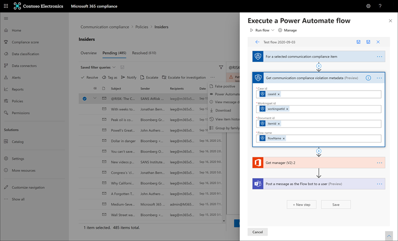

# <a name="communication-compliance-feature-reference"></a>Referenz zu Kommunikationskonformitätsfeatures

## <a name="policies"></a>Richtlinien

>[!Important]
>Die Verwendung von PowerShell zum Erstellen und Verwalten von Richtlinien zur Kommunikationscompliance wird nicht unterstützt. Zum Erstellen und Verwalten dieser Richtlinien müssen Sie die Richtlinienverwaltungssteuerelemente in der [Microsoft 365-Kommunikationskonformitätslösung verwenden.](https://compliance.microsoft.com/supervisoryreview)

Im Microsoft 365 Compliance Center erstellen Sie Richtlinien zur Kommunikationscompliance für Microsoft 365-Organisationen. Richtlinien zur Kommunikationskonformität definieren, welche Kommunikationen und Benutzer in Ihrer Organisation überprüft werden, definieren, welche benutzerdefinierten Bedingungen die Kommunikation erfüllen muss, und geben an, wer Überprüfungen vor sich nehmen soll. Benutzer,  denen die Administratorrolle "Kommunikationskonformität" zugewiesen wurde,  können Richtlinien einrichten, und jeder Benutzer, dem diese Rolle zugewiesen ist, kann auf die Seite "Kommunikationskonformität" und die globalen Einstellungen im Microsoft 365 Compliance Center zugreifen. Bei Bedarf können Sie den Verlauf der Änderungen an einer Richtlinie in eine CSV-Datei exportieren, die auch den Status der ausstehenden Überprüfung von Warnungen, eskalierten Elementen und aufgelösten Elementen enthält. Richtlinien können nicht umbenannt und gelöscht werden, wenn sie nicht mehr benötigt werden.

>[!NOTE]
>Aufsichtsrichtlinien, die im Security & Compliance Center für Office 365-Abonnements erstellt wurden, können nicht zu Microsoft 365 migriert werden. Wenn Sie von einem Office 365-Abonnement zu einem Microsoft 365-Abonnement migrieren, müssen Sie neue Richtlinien zur Kommunikationskonformität erstellen, um vorhandene Aufsichtsrichtlinien zu ersetzen.

## <a name="policy-templates"></a>Richtlinienvorlagen

Richtlinienvorlagen sind vordefinierte Richtlinieneinstellungen, mit denen Sie schnell Richtlinien erstellen können, um häufige Complianceszenarien zu adressieren. Jede dieser Vorlagen hat Unterschiede in Bedingungen und Umfang, und alle Vorlagen verwenden die gleichen Arten von Überprüfungssignalen. Sie können aus den folgenden Richtlinienvorlagen auswählen:

|**Bereich**|**Richtlinienvorlage**|**Details**|
|:-----|:-----|:-----|
| **Anstößige Sprache und Anti-Mobbing** | Überwachen der Kommunikation auf anstößige Sprache | - Standorte: Exchange Online, Microsoft Teams, Yammer, Skype for Business <br> - Direction: Inbound, Outbound, Internal <br> - Prozentsatz der Überprüfung: 100 % <br> - Bedingungen: Klassifikator für anstößige Sprache |
| **Vertrauliche Informationen** | Überwachen der Kommunikation auf vertrauliche Informationen | - Standorte: Exchange Online, Microsoft Teams, Yammer, Skype for Business <br> - Direction: Inbound, Outbound, Internal <br> - Prozentsatz der Überprüfung: 10 % <br> - Bedingungen: Vertrauliche Informationen, out-of-the-Box-Inhaltsmuster und Typen, Benutzerwörterbuchoption, Anlagen größer als 1 MB |
| **Einhaltung gesetzlicher Bestimmungen** | Überwachen der Kommunikation auf Informationen im Zusammenhang mit der Einhaltung gesetzlicher Vorschriften im Finanzwesen | - Standorte: Exchange Online, Microsoft Teams, Yammer, Skype for Business <br> - Direction: Inbound, Outbound <br> - Prozentsatz der Überprüfung: 10 % <br> - Bedingungen: Benutzerwörterbuchoption, Anlagen größer als 1 MB |
| **Interessenkonflikt** | Überwachen der Kommunikation zwischen zwei Gruppen oder zwei Benutzern, um Interessenkonflikte zu vermeiden | - Standorte: Exchange Online, Microsoft Teams, Yammer, Skype for Business <br> - Richtung: Intern <br> - Prozentsatz der Überprüfung: 100 % <br> - Bedingungen: Keine |

Die Kommunikation wird alle 24 Stunden ab dem Zeitpunkt überprüft, zu dem Richtlinien erstellt wurden. Wenn Sie beispielsweise um 11:00 Uhr eine Richtlinie für anstößige Sprache erstellen, erfasst die Richtlinie alle 24 Stunden um 11:00 Uhr kommunikationskonforme Signale. Das Bearbeiten einer Richtlinie ändert sich dieses Mal nicht. Zum Anzeigen des Datums und der Uhrzeit der letzten Überprüfung für eine Richtlinie navigieren Sie zur Spalte "Letzte *Richtlinienscan"* auf der Seite **"Richtlinie".** Datum und Uhrzeit der letzten Überprüfung werden in die Zeitzone Des lokalen Systems konvertiert.

## <a name="permissions"></a>Berechtigungen

>[!Important]
>Standardmäßig haben globale Administratoren keinen Zugriff auf Kommunikationskonformitätsfeatures. Die in diesem Schritt zugewiesenen Rollen sind erforderlich, bevor auf Kommunikationskonformitätsfeatures zugegriffen werden kann.

Es gibt fünf Rollengruppen, die zum Konfigurieren von Berechtigungen zum Verwalten von Kommunikationskonformitätsfeatures verwendet werden. Um  die Kommunikationskonformität als Menüoption im Microsoft 365 Compliance Center verfügbar zu machen und mit diesen Konfigurationsschritten fortzufahren, müssen Sie den Rollengruppen *"Communication Compliance"* oder *"Communication Compliance Admin"* zugewiesen sein. Um nach der Erstkonfiguration auf Kommunikationskonformitätsfeatures zugreifen und diese verwalten zu können, müssen Benutzer Mitglied mindestens einer Rollengruppe für die Kommunikationskonformität sein.

Je nachdem, wie Sie Kommunikationsrichtlinien und Warnungen verwalten möchten, müssen Sie Benutzer bestimmten Rollengruppen zuweisen. Sie haben die Möglichkeit, Bestimmten Rollengruppen Benutzer mit unterschiedlichen Complianceaufgaben zuzuordnen, um verschiedene Bereiche der Kommunikationskonformitätsfeatures zu verwalten. Sie können auch alle Benutzerkonten für designierte Administratoren, Analysten, Ermittler  und Betrachter der Rollengruppe "Kommunikationskonformität" zuweisen. Verwenden Sie eine einzelne Rollengruppe oder mehrere Rollengruppen, um ihre Anforderungen für die Verwaltung der Richtlinienkonformität optimal zu erfüllen.

Wählen Sie beim Konfigurieren der Kommunikationskonformität aus den folgenden Rollengruppenoptionen aus:

|**Rollengruppe**|**Rollengruppenberechtigungen**|
|:-----|:-----|
| **Kommunikationskonformität** | Verwenden Sie diese Rollengruppe, um die Kommunikationskonformität für Ihre Organisation in einer einzigen Gruppe zu verwalten. Durch Hinzufügen aller Benutzerkonten für designierte Administratoren, Analysten, Ermittler und Betrachter können Sie Berechtigungen zur Kommunikationskonformität in einer einzigen Gruppe konfigurieren. Diese Rollengruppe enthält alle Berechtigungsrollen für die Kommunikationskonformität. Diese Konfiguration ist die einfachste Möglichkeit, schnell mit der Kommunikationskonformität zu beginnen, und ist gut geeignet für Organisationen, die keine separaten Berechtigungen benötigen, die für separate Benutzergruppen definiert sind. |
| **Kommunikationskonformitätsadministrator** | Verwenden Sie diese Rollengruppe, um zunächst die Kommunikationskonformität zu konfigurieren und später Administratoren für die Kommunikationskonformität in eine definierte Gruppe zu untergtrennen. Benutzer, die dieser Rollengruppe zugewiesen sind, können Richtlinien zur Kommunikationskonformität, globale Einstellungen und Rollengruppenzuweisungen erstellen, lesen, aktualisieren und löschen. Benutzer, die dieser Rollengruppe zugewiesen sind, können keine Benachrichtigungen anzeigen. |
| **Communication Compliance Analyst** | Verwenden Sie diese Gruppe, um Benutzern Berechtigungen zu erteilen, die als Analysten für die Kommunikationskonformität fungieren. Benutzer, die dieser Rollengruppe zugewiesen sind, können Richtlinien anzeigen, in denen sie als Prüfer zugewiesen sind, Nachrichtenmetadaten (keine Nachrichteninhalte) anzeigen, an zusätzliche Prüfer eskalieren oder Benachrichtigungen an Benutzer senden. Analysten können ausstehende Warnungen nicht beheben. |
| **Kommunikations-Compliance-Ermittler** | Verwenden Sie diese Gruppe, um Benutzern Berechtigungen zu erteilen, die als Ermittler der Kommunikationskonformität fungieren. Benutzer, die dieser Rollengruppe zugewiesen sind, können Nachrichtenmetadaten und -inhalte anzeigen, an weitere Prüfer eskalieren, zu einem Advanced eDiscovery-Fall eskalieren, Benachrichtigungen an Benutzer senden und die Warnung auflösen. |
| **Kommunikations-Compliance-Viewer** | Verwenden Sie diese Gruppe, um Benutzern Berechtigungen zu erteilen, die Kommunikationsberichte verwalten. Benutzer, die dieser Rollengruppe zugewiesen sind, können auf der Startseite für die Kommunikationskonformität auf alle Berichts widgets zugreifen und alle Berichte zur Kommunikationskonformität anzeigen. |

### <a name="for-organizations-using-the-original-permissions-and-role-groups"></a>Für Organisationen, die die ursprünglichen Berechtigungen und Rollengruppen verwenden

Die neue Rollengruppenstruktur ersetzt die anfängliche Rollengruppenstruktur für die Kommunikationskonformität. Für Organisationen, die bereits Kommunikationskonformität verwenden, musste Ihnen die Rolle des Aufsichtsüberprüfungsadministrators zugewiesen werden, um mit der Kommunikationskonformität im Microsoft 365 Compliance Center zu beginnen. Darüber hinaus mussten Sie eine neue Rollengruppe für Prüfer mit den Rollen "Aufsichtsüberprüfungsadministrator", "Fallverwaltung", "Complianceadministrator" und "Überprüfen" erstellen, um Nachrichten mit Richtlinien übereinstimmungen zu untersuchen und zu beaufsichtigungen. Im Wesentlichen waren alle Administratoren und Prüfer in einer einzelnen Rollengruppe, und alle benutzer hatten dieselben Zugriffs- und Verwaltungsberechtigungen. Mit den neuesten Updates für die Kommunikationskonformität sollten Sie die Migration von der vorherigen Rollengruppenstruktur zur neuen Rollengruppenstruktur planen. Die Unterstützung für die vorherige Rollengruppenstruktur wird nicht mehr unterstützt.

Berücksichtigen Sie das folgende Beispiel, um Die Migrationsplanung zu unterstützen. Sie haben derzeit drei Arten von Benutzern in Ihrer Organisation: IT-Administratoren, Triage und Prüfer. Diese drei Benutzertypen befinden sich in der vorherigen Rollengruppenstruktur und sind alle Mitglieder einer einzelnen Rollengruppe, denen die folgenden Rollen zugewiesen sind:

- Aufsichtsüberprüfungsadministrator
- Fallverwaltung
- Complianceadministrator
- Überprüfung

Um die Rollen für diese Benutzer für die neue Rollengruppenstruktur zu aktualisieren und die Zugriffs- und Verwaltungsberechtigungen für die Benutzer zu trennen, können Sie drei neue Gruppen und die zugeordneten neuen Rollengruppenzuweisungen in Betracht ziehen:

- **IT-Administratoren:** Der neuen Rollengruppe *"Kommunikations-Compliance-Administrator"* zugewiesen.
- **Triage:** Der Rollengruppe *"Communication Compliance Analyst"* zugewiesen.
- **Prüfer:** Der neuen Rollengruppe *"Kommunikations-Compliance-Prüfer"* zugewiesen.

## <a name="supervised-users"></a>Überwachte Benutzer

Bevor Sie mit der Kommunikationscompliance beginnen, müssen Sie feststellen, wer die Überprüfung der Kommunikation benötigt. In der Richtlinie identifizieren die E-Mail-Adressen der Benutzer Einzelpersonen oder Personengruppen, die überwacht werden sollen. Einige Beispiele für diese Gruppen sind Microsoft 365-Gruppen, Exchange-basierte Verteilerlisten, Yammer Communitys und Microsoft Teams-Kanäle. Sie können auch bestimmte Benutzer oder Gruppen mit einer bestimmten Ausschlussgruppe oder einer Liste von Gruppen vom Überprüfen ausschließen.

>[!IMPORTANT]
>Benutzer, die von Richtlinien zur Kommunikationskonformität abgedeckt werden, müssen entweder über eine Microsoft 365 E5-Compliance-Lizenz, eine Office 365 Enterprise E3-Lizenz mit dem Advanced Compliance-Add-On verfügen oder in einem Office 365 Enterprise E5-Abonnement enthalten sein. Wenn Sie nicht über einen vorhandenen Enterprise E5-Plan verfügen und die Kommunikationskonformität testen möchten, können Sie sich für eine Testversion von [Office 365 Enterprise E5 registrieren.](https://go.microsoft.com/fwlink/p/?LinkID=698279)

## <a name="reviewers"></a>Prüfer

Wenn Sie eine Richtlinie zur Kommunikationskonformität erstellen, müssen Sie bestimmen, wer die Nachrichten der überwachten Benutzer überprüft. In der Richtlinie identifizieren die E-Mail-Adressen der Benutzer Einzelpersonen oder Personengruppen, welche die überwachte Kommunikation überprüfen sollen. Alle Prüfer müssen über Postfächer verfügen, die auf Exchange  Online gehostet werden, und sie müssen entweder den Rollen "Kommunikationskonformitätsanalyse" oder "Untersuchung der *Kommunikationskonformität" zugewiesen* sein. Prüfern (Analysten oder Ermittlern) muss auch die Rolle *"Communication Compliance Case Management" zugewiesen* sein. Wenn Prüfer einer Richtlinie hinzugefügt werden, erhalten sie automatisch eine E-Mail-Nachricht, die sie über die Zuweisung an die Richtlinie benachrichtigt und Links zu Informationen zum Überprüfungsprozess enthält.

## <a name="groups-for-supervised-users-and-reviewers"></a>Gruppen für überwachte Benutzer und Prüfer

Um die Einrichtung zu vereinfachen, erstellen Sie Gruppen für Personen, die ihre Kommunikation überprüfen müssen, und Gruppen für Personen, die diese Kommunikation überprüfen. Wenn Sie Gruppen verwenden, benötigen Sie möglicherweise mehrere. Zum Beispiel, wenn Sie die Kommunikation zwischen zwei verschiedenen Personengruppen überprüfen möchten oder wenn Sie eine Gruppe angeben möchten, die nicht überwacht wird.

Wenn Sie eine Verteilergruppe in der Richtlinie zuweisen, überwacht die Richtlinie alle E-Mails aller Benutzer in der Verteilergruppe. Wenn Sie eine Microsoft 365-Gruppe in der Richtlinie zuweisen, überwacht die Richtlinie alle an diese Gruppe gesendeten E-Mails, nicht die einzelnen E-Mails, die von jedem Gruppenmitglied empfangen wurden.

Das Hinzufügen von Gruppen und Verteilerlisten zu Richtlinien zur Kommunikationskonformität ist Teil der allgemeinen Bedingungen und Regeln, sodass die maximale Anzahl von Gruppen und Verteilerlisten, die von einer Richtlinie unterstützt werden, von der Anzahl der Bedingungen abhängig ist, die der Richtlinie ebenfalls hinzugefügt werden. Jede Richtlinie sollte etwa 20 Gruppen oder Verteilerlisten unterstützen, abhängig von der Anzahl der zusätzlichen Bedingungen, die in der Richtlinie vorhanden sind.

## <a name="supported-communication-types"></a>Unterstützte Kommunikationstypen

Mit Richtlinien zur Kommunikationskonformität können Sie Nachrichten auf einer oder mehreren der folgenden Kommunikationsplattformen als Gruppe oder als eigenständige Quellen überprüfen. Die auf diesen Plattformen erfassten Kommunikationen werden standardmäßig für jede Richtlinie sieben Jahre lang aufbewahrt, auch wenn Benutzer Ihre Organisation verlassen und ihre Postfächer gelöscht werden.

- **Microsoft Teams:** Die Chatkommunikation in öffentlichen und privaten Microsoft Teams-Kanälen und einzelnen Chats kann überprüft werden. Wenn Benutzern eine Kommunikationskonformitätsrichtlinie mit ausgewählter Microsoft Teams-Abdeckung zugewiesen ist, wird die Chatkommunikation für die Benutzer automatisch in allen Microsoft Teams überwacht, in denen die Benutzer Mitglied sind. Die Microsoft Teams-Abdeckung wird automatisch für vordefinierte Richtlinienvorlagen einbezogen und standardmäßig in der benutzerdefinierten Richtlinienvorlage ausgewählt. Es kann bis zu 48 Stunden dauern, bis Teams-Chats, die mit den Bedingungen der Kommunikationskonformitätsrichtlinie übereinstimmen, zu verarbeiten sind. Verwenden Sie die folgenden Gruppenverwaltungskonfigurationen, um einzelne Benutzerchats und Kanalkommunikation in Teams zu überwachen:

    - **Für Die Chatkommunikation in Teams:** Weisen Sie einzelnen Benutzern oder der Richtlinie [zur Kommunikationskonformität](https://support.office.com/article/Distribution-groups-E8BA58A8-FAB2-4AAF-8AA1-2A304052D2DE) eine Verteilergruppe zu. Diese Einstellung gilt für Eins-zu-eins- oder Eins-zu-viele-Benutzer/Chat-Beziehungen.
    - **Für Die Kommunikation im Teams-Kanal:** Weisen Sie jedem Microsoft Teams-Kanal oder jeder Microsoft 365-Gruppe, die Sie überprüfen möchten, die einen bestimmten Benutzer enthält, die Richtlinie zur Kommunikationskonformität zu. Wenn Sie denselben Benutzer zu anderen Microsoft Teams-Kanälen oder Microsoft 365-Gruppen hinzufügen, stellen Sie sicher, dass Sie diese neuen Kanäle und Gruppen in die Richtlinie zur Kommunikationscompliance aufnehmen.
    - **Für Teams Chatkommunikation** mit hybriden E-Mail-Umgebungen: Die Kommunikationskonformität kann Chatnachrichten für Benutzer für Organisationen mit einer lokalen Bereitstellung von Exchange oder eines externen E-Mail-Anbieters überwachen, der Microsoft Teams aktiviert hat. Sie müssen eine Verteilergruppe für die Benutzer mit lokalen oder externen Postfächern erstellen, die überwacht werden sollen. Beim Erstellen einer Kommunikationskonformitätsrichtlinie weisen Sie  diese Verteilergruppe im Richtlinienassistenten als Auswahl für überwachte Benutzer und Gruppen zu.

    >[!IMPORTANT]
    >Sie müssen eine Anforderung beim Microsoft-Support stellen, damit Ihre Organisation die grafische Benutzeroberfläche im Security & Compliance Center verwenden kann, um für lokale Benutzer nach Teams-Chatdaten zu suchen. Weitere Informationen finden Sie unter [Durchsuchen cloudbasierter Postfächer für lokale Benutzer.](search-cloud-based-mailboxes-for-on-premises-users.md)

Sie müssen eine Anforderung beim Microsoft-Support stellen, damit Ihre Organisation die grafische Benutzeroberfläche im Security & Compliance Center verwenden kann, um in den cloudbasierten Postfächern für lokale Benutzer nach Teams-Chatdaten zu suchen.

- **Exchange-E-Mail:** Postfächer, die im Rahmen Ihres Microsoft 365- oder Office 365-Abonnements auf Exchange Online gehostet werden, sind alle für die Nachrichtenprüfung berechtigt. Es kann bis zu 24 Stunden dauern, bis Exchange-E-Mail-Nachrichten und -Anlagen, die den Bedingungen der Kommunikationskonformitätsrichtlinie übereinstimmen, zu verarbeiten sind. Die für die Kommunikationscompliance unterstützten Anlagetypen sind die gleichen wie die [Dateitypen, die für die Inhaltsüberprüfung von Exchange-Mailflussregeln unterstützt werden](https://docs.microsoft.com/exchange/security-and-compliance/mail-flow-rules/inspect-message-attachments#supported-file-types-for-mail-flow-rule-content-inspection).

- **Yammer:** Private Nachrichten und öffentliche Unterhaltungen und zugehörige Anlagen in Yammer Communitys können überprüft werden. Wenn ein Benutzer einer Kommunikationskonformitätsrichtlinie hinzugefügt wird, die Yammer als definierten Kanal enthält, wird die Kommunikation zwischen allen Yammer-Communitys, bei denen der Benutzer Mitglied ist, in den Überprüfungsprozess einbezogen. Yammer chats and attachments matching communication compliance policy conditions may take up to 24 hours to process. Yammer muss sich im [nativen Modus befinden,](https://docs.microsoft.com/yammer/configure-your-yammer-network/overview-native-mode) damit Kommunikationskonformitätsrichtlinien die kommunikations- und Yammer überwachen können. Im nativen Modus befinden sich alle Yammer-Benutzer in Azure Active Directory (AAD), alle Gruppen sind Office 365-Gruppen, und alle Dateien werden in SharePoint Online gespeichert.

- **Skype for Business Online**: Chatnachrichten und zugehörige Anlagen in Skype for Business Online können überwacht werden. Die Bearbeitung von Skype for Business Online-Chats, in denen die Bedingungen für die Richtlinien zur Kommunikationscompliance erfüllt werden, kann bis zu 24 Stunden dauern. Überwachte Chatunterhaltungen stammen aus [vorherigen Unterhaltungen, die in Skype for Business Online gespeichert wurden.](https://support.office.com/article/Find-a-previous-Skype-for-Business-conversation-18892eba-5f18-4281-8c87-fd48bd72e6a2)  Verwenden Sie die folgende Gruppenverwaltungskonfiguration, um die Benutzerchatkommunikation in Skype for Business Online zu überwachen:

    - **Für Skype for Business Online-Chatkommunikation:** [](https://support.office.com/article/Distribution-groups-E8BA58A8-FAB2-4AAF-8AA1-2A304052D2DE) Weisen Sie einzelne Benutzer zu, oder weisen Sie der Richtlinie zur Kommunikationskonformität eine Verteilergruppe zu. Diese Einstellung gilt für Eins-zu-eins- oder Eins-zu-viele-Benutzer/Chat-Beziehungen.

- **Drittanbieterquellen:** Sie können die Kommunikation auf Daten überprüfen, die in Postfächer in Ihrer Microsoft 365-Organisation aus Drittanbieterquellen wie [Instant Bloomberg,](archive-instant-bloomberg-data.md) [Slack,](archive-slack-data.md) [Zoom,](archive-zoommeetings-data.md)SMS und vielem mehr importiert wurden. Eine vollständige Liste der connectors, die in der Kommunikationskonformität unterstützt werden, finden Sie unter [Archivieren von Drittanbieterdaten.](archiving-third-party-data.md)

    Sie müssen einen Drittanbieterconnector für Ihre Microsoft 365-Organisation konfigurieren, bevor Sie den Connector einer Richtlinie zur Kommunikationskonformität zuweisen können. Im **Abschnitt "Drittanbieterquellen"** des Assistenten für Kommunikationskonformitätsrichtlinien werden nur derzeit konfigurierte Drittanbieterconnectors angezeigt.

## <a name="transitioning-from-supervision-in-office-365"></a>Übergang von der Aufsicht in Office 365

Organisationen, die Aufsichtsrichtlinien in Office 365 verwenden und den Übergang zu Kommunikations-Compliance-Richtlinien in Microsoft 365 planen, müssen diese wichtigen Punkte verstehen:

- Beide Lösungen können in Ihrer Organisation nebeneinander verwendet werden, aber die in jeder Lösung verwendeten Richtlinien müssen eindeutige Richtliniennamen haben. aufweisen. Gruppen und benutzerdefinierte Schlüsselwortwörterbücher können während einer Übergangszeit von Lösungen gemeinsam genutzt werden.
- Nachrichten, die unter Aufsicht in Office 365-Richtlinienkonformität gespeichert wurden, können in Microsoft 365 nicht in die Kommunikationskonformität verschoben oder freigegeben werden.
- Die Aufsichtslösung in Office 365 wird vollständig durch die Kommunikationskonformitätslösung in Microsoft 365 ersetzt. Es wird empfohlen, neue Richtlinien für die Kommunikationskonformität zu erstellen, die dieselben Einstellungen wie vorhandene Aufsichtsrichtlinien haben, um die neuen Verbesserungen bei Untersuchung und Korrektur zu nutzen. Beim Übergang zur Kommunikationscompliance in Microsoft 365 sollten Sie planen, Berichtsdaten aus der Aufsicht in Office 365 zu exportieren, wenn Sie interne Richtlinien zur Aufbewahrung von Compliance-Anforderungen haben.

Informationen zum Aus der Aufsicht in Office 365 finden Sie in der [Microsoft 365-Roadmap.](https://www.microsoft.com/microsoft-365/roadmap)

## <a name="policy-settings"></a>Richtlinieneinstellungen

### <a name="users"></a>Benutzer

Sie haben die Möglichkeit, alle **Benutzer** auszuwählen oder bestimmte Benutzer in einer Kommunikationskonformitätsrichtlinie zu definieren. Durch Auswahl von **Alle Benutzer** wird die Richtlinie auf alle Benutzer und alle Gruppen angewendet, in denen ein Benutzer als Mitglied enthalten ist. Das Festlegen bestimmter Benutzer wendet die Richtlinie auf die festgelegten Benutzer und alle Gruppen an, in denen die festgelegten Benutzer als Mitglied enthalten sind.

### <a name="direction"></a>Direction

Standardmäßig wird die **Richtungsbedingung** angezeigt und kann nicht entfernt werden. Kommunikationsrichtungseinstellungen in einer Richtlinie werden einzeln oder gemeinsam ausgewählt:

- **Bound:** You can choose **Inbound** to review communications sent **to** the people you choose to supervise.
- **Ausgehend:** Sie können **"Ausgehend"** auswählen,  wenn Sie die Kommunikation überprüfen möchten, die von den Personen gesendet wurde, die Sie beaufsichtigt haben.
- **Intern:** Sie können **"Intern"** auswählen, um die Kommunikation zwischen den Personen zu überprüfen, die Sie in der Richtlinie identifiziert haben. 

### <a name="sensitive-information-types"></a>Typen vertraulicher Informationen

Sie haben die Möglichkeit, vertrauliche Informationstypen als Teil Ihrer Kommunikationskonformitätsrichtlinie zu verwenden. Typen vertraulicher Informationen sind vordefinierte oder benutzerdefinierte Datentypen, mit deren Hilfe Kreditkartennummern, Bankkontonummern, Reisepassnummern und vieles mehr identifiziert und geschützt werden können. Als Bestandteil von [Verhinderung von Datenverlust (Data Loss Prevention, DLP)](data-loss-prevention-policies.md), kann die Konfiguration vertraulicher Informationen Muster, Zeichennähe, Vertrauensniveaus und sogar benutzerdefinierte Datentypen verwenden, um möglicherweise vertrauliche Inhalte zu identifizieren und zu kennzeichnen. Die standardmäßigen Typen vertraulicher Informationen sind:

- Finanzwesen
- Gesundheit und Gesundheit
- Datenschutz
- Benutzerdefinierter Informationstyp

Weitere Informationen zu details vertraulichen Informationen und zu den Mustern in den Standardtypen finden Sie unter Entitätsdefinitionen für Typen [vertraulicher Informationen.](sensitive-information-type-entity-definitions.md)

### <a name="custom-keyword-dictionaries"></a>Benutzerdefinierte Schlüsselwörterbücher

Konfigurieren Sie benutzerdefinierte Schlüsselwörterbücher (oder Lexika), um eine einfache Verwaltung von Schlüsselwörtern zu ermöglichen, die für Ihre Organisation oder Branche spezifisch sind. Schlüsselwörterbücher unterstützen bis zu 100 KB Begriffe (nach der Komprimierung) im Wörterbuch und unterstützen jede Sprache. Der Mandantengrenzwert liegt nach der Komprimierung ebenfalls bei 100 KB. Bei Bedarf können Sie mehrere benutzerdefinierte Schlüsselwörterbücher auf eine einzelne Richtlinie anwenden oder ein einziges Schlüsselwortverzeichnis pro Richtlinie verwenden. Diese Wörterbücher werden in einer Kommunikationskonformitätsrichtlinie zugewiesen und können aus einer Datei (z. B. einer CSV- oder TXT-Liste) oder aus einer Liste stammen, die Sie im [Compliance Center importieren können.](create-a-keyword-dictionary.md) Verwenden Sie Benutzerwörterbücher, wenn Sie spezifisch für Ihre Organisation und Richtlinien spezifische Begriffe oder Sprachen unterstützen müssen.

### <a name="classifiers"></a>Klassifizierungen

Integrierte trainierbare und globale Klassifizierungen überprüfen gesendete oder empfangene Nachrichten über alle Kommunikationskanäle in Ihrer Organisation auf unterschiedliche Arten von Complianceproblemen. Klassifizierer verwenden eine Kombination aus künstlicher Intelligenz und Schlüsselwörtern, um Sprache in Botschaften zu identifizieren, die wahrscheinlich gegen die Antibelästigungsrichtlinien verstoßen. Integrierte Klassifizierungen unterstützen derzeit nur englische Schlüsselwörter in Nachrichten.

In die Kommunikationskonformität integrierte trainierbare und globale Klassifikatoren überprüfen die Kommunikation auf Begriffe, Bilder und Stimmungen für die folgenden Arten von Sprache und Inhalt:

- **Bedrohung:** Sucht nach Bedrohungen, um Gewalt oder physischen Schaden an einer Person oder Eigenschaft zu begehen.
- **Gezielte Belästigung:** Sucht nach anstößigen Verhaltensweisen, die auf Personen in Bezug auf Race, Farbe, Nationale Herkunft ausgerichtet sind.
- **Ansage:** Sucht nach profanen Ausdrücken, die die meisten Menschen verungl schen.
- **Bilder für Erwachsene:** Sucht nach Bildern, die sexueller Art sind.
- **Rassige** Bilder: Sucht nach Bildern, die der Natur nach suggestiv sind, aber weniger explizite Inhalte enthalten als Bilder, die als "Jugendlich" eingestuft werden.
- **Gory-Bilder:** Sucht nach Bildern, die Gewalt und Gewalt darstellen.

Die *Bildklassifikatoren "Adult",* *"Racy"* und *"Gory"* überprüfen Dateien in . JPEG, . PNG, . GIF und . BMP-Formate. Die Größe für Bilddateien muss kleiner als 4 MB sein, und die Abmessungen der Bilder müssen größer als 50 x 50 Pixel und größer als 50 KB sein, damit das Bild für die Auswertung in Frage kommen kann. Die Bildidentifikation wird für Exchange Online-E-Mail-Nachrichten und Microsoft Teams-Kanäle und -Chats unterstützt.

Die integrierten trainierbaren und globalen Klassifizierungen bieten keine vollständige Liste der Begriffe oder Bilder in diesen Bereichen. Darüber hinaus ändern sich sprach- und kulturhistorische Standards ständig, und angesichts dieser Unterschiede behält sich Microsoft das Recht vor, Klassifikatoren nach eigenem Ermessen zu aktualisieren. Klassifizierer unterstützen Ihre Organisation zwar bei der Überwachung dieser Bereiche, Klassifikatoren sind jedoch nicht dafür vorgesehen, die einzigen Mittel ihrer Organisation zur Überwachung oder Behandlung dieser Sprache oder Bilder zur Verfügung zu stellen. Ihre Organisation, nicht Microsoft, bleibt für alle Entscheidungen im Zusammenhang mit der Überwachung, Überprüfung und Blockierung von Sprache und Bildern in diesen Bereichen verantwortlich, einschließlich der Einhaltung des lokalen Datenschutzes und anderer anwendbarer Gesetze. Microsoft ermuntert, sich vor der Bereitstellung und Verwendung mit Rechtsberatern zu beraten.

>[!NOTE]
>Richtlinien, die Klassifizierungen verwenden, überprüfen und bewerten Nachrichten mit einer Wortanzahl von sechs oder mehr. Nachrichten mit weniger als sechs Wörtern werden in Richtlinien nicht mithilfe von Klassifizierungen ausgewertet. Um kürzere Nachrichten mit unangemessenen Inhalten zu identifizieren und Maßnahmen zu ergreifen, empfehlen wir, ein benutzerdefiniertes Schlüsselwortverzeichnis zur Überwachung der Kommunikationskonformitätsrichtlinien für diese Art von Inhalten hinzuzufügen.

Informationen zu trainierbaren Klassifizierungen in Microsoft 365 finden Sie unter ["Erste Schritte mit trainierbaren Klassifizierungen".](classifier-get-started-with.md)

### <a name="conditional-settings"></a>Bedingte Einstellungen
<a name="ConditionalSettings"> </a>

Die Bedingungen, die Sie für die Richtlinie auswählen, gelten für die Kommunikation von E-Mail- und Drittanbieterquellen in Ihrer Organisation (z. B. von Instant Bloomberg).

In der folgenden Tabelle werden weitere Informationen zu den einzelnen Bedingungen erläutert.
  
|**Bedingung**|**Verwendung**|
|:-----|:-----|
| **Inhalt entspricht einer dieser Klassifizierungen** | Gelten Sie für die Richtlinie, wenn Klassifizierer in eine Nachricht eingeschlossen oder ausgeschlossen werden. Einige Klassifizierungen sind in Ihrem Mandanten vordefiniert, und benutzerdefinierte Klassifizierungen müssen separat konfiguriert werden, bevor sie für diese Bedingung verfügbar sind. In einer Richtlinie kann nur ein Klassifikator als Bedingung definiert werden. Weitere Informationen zum Konfigurieren von Klassifizierungen finden Sie unter [Informationen zu trainierbaren Klassifizierungen (Vorschau).](classifier-learn-about.md) |
| **Inhalt enthält einen dieser Typen vertraulicher Informationen** | Gelten Sie für die Richtlinie, wenn vertrauliche Informationstypen in eine Nachricht eingeschlossen oder ausgeschlossen werden. Einige Klassifizierungen sind in Ihrem Mandanten vorab definiert, und benutzerdefinierte Klassifizierungen können separat oder als Teil des Bedingungszuweisungsprozesses konfiguriert werden. Jeder typ vertraulicher Informationen, den Sie auswählen, wird separat angewendet, und nur einer dieser Typen vertraulicher Informationen muss angewendet werden, damit die Richtlinie auf die Nachricht angewendet wird. Weitere Informationen zu benutzerdefinierten Typen vertraulicher Informationen finden Sie [unter Informationen zu vertraulichen Informationstypen.](sensitive-information-type-learn-about.md) |
| **Nachricht wird von einer dieser Domänen empfangen**  <br><br> **Nachricht wird von einer dieser Domänen nicht empfangen** | Wenden Sie die Richtlinie an, um bestimmte Domänen oder E-Mail-Adressen in empfangene Nachrichten ein- oder auszuschließen. Geben Sie jede Domäne oder E-Mail-Adresse ein, und trennen Sie mehrere Domänen oder E-Mail-Adressen durch ein Komma. Jede eingegebene Domäne oder E-Mail-Adresse wird separat angewendet, es muss nur eine Domäne oder E-Mail-Adresse gelten, damit die Richtlinie auf die Nachricht angewendet wird. <br><br> Wenn Sie alle E-Mails aus einer bestimmten Domäne überprüfen, aber Nachrichten ausschließen möchten, die nicht überprüft werden  müssen (Newsletter, Ankündigungen und so weiter), müssen Sie konfigurieren, dass eine Nachricht von einer dieser Domänenbedingung nicht empfangen wird, die die E-Mail-Adresse ausschließt (z. B. "newsletter@contoso.com"). |
| **Nachricht wird an eine dieser Domänen gesendet**  <br><br> **Nachricht wird nicht an diese Domänen gesendet** | Wenden Sie die Richtlinie an, um bestimmte Domänen oder E-Mail-Adressen in gesendete Nachrichten ein- oder auszuschließen. Geben Sie jede Domäne oder E-Mail-Adresse ein, und trennen Sie mehrere Domänen oder E-Mail-Adressen durch ein Komma. Jede Domäne oder E-Mail-Adresse wird separat angewendet, es muss nur eine Domäne oder E-Mail-Adresse gelten, damit die Richtlinie auf die Nachricht angewendet wird. <br><br> Wenn Sie alle an eine bestimmte Domäne gesendeten E-Mails überprüfen, aber gesendete Nachrichten ausschließen möchten, die nicht überprüft werden müssen, müssen Sie zwei Bedingungen konfigurieren: <br> - Eine **Nachricht wird an eine dieser** Domänenbedingung gesendet, die die Domäne definiert ("contoso.com"), UND <br> - Eine **Nachricht wird nicht an eine** dieser Domänenbedingung gesendet, die die E-Mail-Adresse ausschließt ("subscriptions@contoso.com"). |
| **Nachricht wird mit einer dieser Bezeichnungen klassifiziert**  <br><br> **Nachricht wird nicht mit einer dieser Bezeichnungen klassifiziert** | So wenden Sie die Richtlinie an, wenn bestimmte Aufbewahrungsbezeichnungen in eine Nachricht eingeschlossen oder ausgeschlossen werden. Aufbewahrungsbezeichnungen müssen separat konfiguriert werden, und konfigurierte Bezeichnungen werden als Teil dieser Bedingung ausgewählt. Jede bezeichnung, die Sie auswählen, wird separat angewendet (nur eine dieser Bezeichnungen muss gelten, damit die Richtlinie auf die Nachricht angewendet wird). Weitere Informationen zu Aufbewahrungsbezeichnungen finden Sie [unter Informationen zu Aufbewahrungsrichtlinien und Aufbewahrungsbezeichnungen.](retention.md)|
| **Nachricht enthält eines dieser Wörter**  <br><br> **Nachricht enthält keines dieser Wörter** | Um die Richtlinie anzuwenden, wenn bestimmte Wörter oder Ausdrücke in eine Nachricht eingeschlossen oder ausgeschlossen werden, geben Sie jedes Wort durch ein Komma getrennt ein. Verwenden Sie für Ausdrücke mit zwei oder mehr Wörtern Anführungszeichen um den Ausdruck herum. Jedes wort oder phrase, das Sie eingeben, wird separat angewendet (nur ein Wort muss angewendet werden, damit die Richtlinie auf die Nachricht angewendet wird). Weitere Informationen zum Eingeben von Wörtern oder Ausdrücken finden Sie im nächsten Abschnitt [Matching words and phrases to emails or attachments](communication-compliance-feature-reference.md#Matchwords).|
| **Anlage enthält eines dieser Wörter**  <br><br> **Anlage enthält keines dieser Wörter** | Um die Richtlinie anzuwenden, wenn bestimmte Wörter oder Ausdrücke in eine Nachrichtenanlage (z. B. ein Word-Dokument) eingeschlossen oder ausgeschlossen werden, geben Sie jedes Wort durch ein Komma getrennt ein. Verwenden Sie für Ausdrücke mit zwei oder mehr Wörtern Anführungszeichen um den Ausdruck herum. Jedes wort oder phrase, das Sie eingeben, wird separat angewendet (nur ein Wort muss angewendet werden, damit die Richtlinie auf die Anlage angewendet wird). Weitere Informationen zum Eingeben von Wörtern oder Ausdrücken finden Sie im nächsten Abschnitt [Matching words and phrases to emails or attachments](communication-compliance-feature-reference.md#Matchwords).|
| **Anlage ist einer dieser Dateitypen**  <br><br> **Anlage ist keiner dieser Dateitypen** | Um Kommunikationen zu überwachen, die bestimmte Anlagentypen enthalten oder ausschließen, geben Sie die Dateierweiterungen ein (z. B. EXE oder PDF). Wenn Sie mehrere Dateierweiterungen ein- oder ausschließen möchten, geben Sie diese in separaten Zeilen ein. Damit die Richtlinie angewendet wird, muss nur eine Anlagenerweiterung übereinstimmen.|
| **Nachricht ist größer als**  <br><br> **Nachrichtengröße ist nicht größer als** | Um Nachrichten basierend auf einer bestimmten Größe zu überprüfen, verwenden Sie diese Bedingungen, um die maximale oder minimale Größe einer Nachricht anzugeben, bevor sie überprüft werden kann. Wenn Sie beispielsweise  eine Nachrichtengröße von mehr als \> **1,0 MB** angeben, werden alle Nachrichten mit einer Größe von 1,01 MB und mehr überprüft. Sie können Byte, Kilobyte, Megabyte oder Gigabyte für diese Bedingung auswählen.|
| **Anlage ist größer als**  <br><br> **Anlage ist nicht größer als** | Um Nachrichten basierend auf der Größe ihrer Anlagen zu überprüfen, geben Sie die maximale oder minimale Größe einer Anlage an, bevor die Nachricht und ihre Anlagen einer Überprüfung unterliegen. Wenn Sie beispielsweise **"Anlage"** mit einer Größe von mehr als \> **2,0 MB** angeben, werden alle Nachrichten mit Anlagen mit einer Größe von 2,01 MB und mehr einer Überprüfung unterliegen. Sie können Byte, Kilobyte, Megabyte oder Gigabyte für diese Bedingung auswählen.|
   
#### <a name="matching-words-and-phrases-to-emails-or-attachments"></a>Übereinstimmende Wörter und Ausdrücke in E-Mails oder Anlagen
<a name="Matchwords"> </a>

Jedes Wort, das Sie eingeben und durch ein Komma trennen, wird separat angewendet (nur ein Wort muss gelten, damit die Richtlinienbedingung auf die E-Mail oder Anlage angewendet wird). Verwenden wir beispielsweise die **Bedingung"**"Nachricht enthält eines dieser Wörter mit den Schlüsselwörtern "banker", "confidential" und "insider trading" getrennt durch ein Komma (Banker, vertraulich,"Insider-Handel"). Die Richtlinie gilt für alle Nachrichten, die das Wort "banker", "vertraulich" oder den Ausdruck "Insider Trading" enthalten. Nur eins der Wörter oder einer der Ausdrücke muss vorkommen, damit die Richtlinienbedingung zutrifft. Wörter in der Nachricht oder Anlage müssen genau mit dem übereinstimmen, was Sie eingeben.

>[!IMPORTANT]
>Beim Importieren einer Benutzerwörterbuchdatei muss jedes Wort oder jede Phrase durch einen Wagenrücklauf und in einer separaten Zeile getrennt werden. <br> Beispiel: <br><br>
>*banker* <br>
>*vertraulich* <br>
>*Insiderhandel*

Um sowohl E-Mail-Nachrichten als auch [](create-test-tune-dlp-policy.md) Anlagen auf dieselben [](create-a-keyword-dictionary.md) Schlüsselwörter zu überprüfen, erstellen Sie eine Richtlinie zur Verhinderung von Datenverlust mit einem benutzerdefinierten Schlüsselwortwörterbuch für die Begriffe, die Sie in Nachrichten überprüfen möchten. Diese Richtlinienkonfiguration identifiziert definierte Schlüsselwörter, die entweder in der E-Mail-Nachricht **oder** in der E-Mail-Anlage angezeigt werden. Verwenden der standardmäßigen bedingten Richtlinieneinstellungen *(* Nachricht enthält eines dieser Wörter und *Anlage* enthält eines dieser Wörter) zum Identifizieren von Begriffen in Nachrichten und in Anlagen erfordert, dass die Begriffe **sowohl** in der Nachricht als auch in der Anlage vorhanden sind.
  
#### <a name="enter-multiple-conditions"></a>Eingeben mehrerer Bedingungen

Wenn Sie mehrere Bedingungen eingeben, verwendet Microsoft 365 alle Bedingungen zusammen, um zu bestimmen, wann die Kommunikationskonformitätsrichtlinie auf Kommunikationselemente angewendet werden soll. Wenn Sie mehrere Bedingungen einrichten, müssen alle Bedingungen erfüllt sein, damit die Richtlinie angewendet wird, es sei denn, Sie geben eine Ausnahme ein. Sie benötigen beispielsweise eine Richtlinie, die gilt, wenn eine Nachricht das Wort "trade" enthält und größer als 2 MB ist. Wenn die Nachricht jedoch auch die Wörter "Genehmigt von Contoso Financial" enthält, sollte die Richtlinie nicht gelten. In diesem Beispiel würden die drei Bedingungen wie folgt definiert:
  
- **Nachricht enthält eines dieser Wörter mit** dem Schlüsselwort "trade"
- **Nachrichtengröße ist größer als**, mit dem Wert 2 MB
- **Nachricht enthält keines dieser Wörter** mit den Schlüsselwörtern "Genehmigt von Contoso-Finanzteam"

### <a name="review-percentage"></a>Prozentsatz der Überprüfung

Wenn Sie die Menge der zu überprüfende Inhalte reduzieren möchten, können Sie einen Prozentsatz aller Kommunikationen angeben, die durch eine Kommunikationskonformitätsrichtlinie geregelt sind. Eine zufällige Stichprobe von Inhalten wird in Echtzeit aus dem Gesamtprozentsatz der Inhalte ausgewählt, die den gewählten Richtlinienbedingungen entsprechen. Wenn Sie möchten, dass Prüfer alle Elemente prüfen, können Sie in einer Richtlinie zur Kommunikationscompliance **100 %** konfigurieren.

## <a name="privacy"></a>Datenschutz

Der Schutz der Privatsphäre von Benutzern, die richtlinienkonform sind, ist wichtig und kann die Objektivität bei der Datenuntersuchung und Analyseüberprüfungen für Warnungen zur Kommunikationskonformität fördern. Diese Einstellung gilt nur für Benutzernamen, die in der Kommunikationskonformitätslösung angezeigt werden. Sie hat keinen Einfluss darauf, wie Namen in anderen Compliancelösungen oder im Admin Center angezeigt werden.

Für Benutzer mit einer Übereinstimmung mit der Kommunikationskonformität können Sie eine der folgenden Einstellungen in den Einstellungen für die **Kommunikationskonformität auswählen:**

- **Anonymisierte Versionen** von Benutzernamen anzeigen: Benutzernamen werden anonymisiert, um zu verhindern, dass Benutzer in der Rollengruppe *"Communication Compliance Analyst"* sehen, wer Richtlinienwarnungen zugeordnet ist. Benutzern in  der Rollengruppe "Kommunikationskonformitätsermittler" werden immer Benutzernamen angezeigt, nicht die anonymisierten Versionen. Beispielsweise würde ein Benutzer "Grace Grace" mit einem zufälligen Pseudonym wie "AnonIS8-988" in allen Bereichen der Kommunikationskonformität angezeigt. Wenn Sie diese Einstellung wählen, werden alle Benutzer mit aktuellen und früheren Richtlinienübereinstimmungen anonymisiert und gelten für alle Richtlinien. Benutzerprofilinformationen in den Benachrichtigungsdetails zur Kommunikationskonformität sind bei Auswahl dieser Option nicht verfügbar. Benutzernamen werden jedoch beim Hinzufügen neuer Benutzer zu vorhandenen Richtlinien oder beim Zuweisen von Benutzern zu neuen Richtlinien angezeigt. Wenn Sie diese Einstellung deaktivieren, werden Benutzernamen für alle Benutzer mit aktuellen oder früheren Richtlinien übereinstimmungen angezeigt.
- **Anonymisierte Versionen von Benutzernamen** nicht anzeigen: Benutzernamen werden für alle aktuellen und früheren Richtlinienkonformitätsbesprechungen für Warnungen zur Kommunikationskonformität angezeigt. Benutzerprofilinformationen (Name, Titel, Alias sowie Organisation oder Abteilung) werden für den Benutzer für alle Warnungen zur Kommunikationskonformität angezeigt.

## <a name="notice-templates"></a>Benachrichtigungsvorlagen

Sie können Benachrichtigungsvorlagen erstellen, wenn Sie Benutzern im Rahmen des Problemlösungsprozesses eine E-Mail-Erinnerungsbenachrichtigung für Richtlinien übereinstimmungen senden möchten. Benachrichtigungen können nur an die E-Mail-Adresse des Benutzers gesendet werden, die der Richtlinienentsprechung zugeordnet ist, die die spezifische Warnung zur Behebung generiert hat. Wenn Sie eine Benachrichtigungsvorlage auswählen, die im Rahmen des Korrekturworkflows auf eine Richtlinienverletzung angewendet werden soll, können Sie die in der Vorlage definierten Feldwerte akzeptieren oder die Felder bei Bedarf überschreiben.

Hinweisvorlagen sind benutzerdefinierte E-Mail-Vorlagen, in denen Sie die folgenden Meldungsfelder im Bereich "Kommunikationskonformitätseinstellungen" **definieren** können:

|**Field**|**Erforderlich**| **Details** |
|:-----|:-----|:-----|
|**Vorlagenname** | Ja | Der Anzeigename für die Benachrichtigungsvorlage, die Sie im Benachrichtigungsworkflow während der Wartung auswählen, unterstützt Textzeichen. |
| **Absenderadresse** | Ja | Die Adresse eines oder mehrerer Benutzer oder Gruppen, die die Nachricht an den Benutzer mit einer Richtlinienabsingnachricht senden, die aus Active Directory für Ihr Abonnement ausgewählt wurde. |
| **CC- und BCC-Adressen** | Nein | Optionale Benutzer oder Gruppen, die über die Richtlinienabsing benachrichtigt werden sollen, die in Active Directory für Ihr Abonnement ausgewählt sind. |
| **Betreff** | Ja | Informationen, die in der Betreffzeile der Nachricht angezeigt werden, unterstützen Textzeichen. |
| **Nachrichtentext** | Ja | Informationen, die im Nachrichtentext angezeigt werden, unterstützen Text- oder HTML-Werte. |

### <a name="html-for-notices"></a>HTML für Hinweise

Wenn Sie mehr als eine einfache textbasierte E-Mail für Benachrichtigungen erstellen möchten, können Sie mithilfe von HTML im Nachrichtentextfeld einer Benachrichtigungsvorlage eine ausführlichere Nachricht erstellen. Das folgende Beispiel stellt das Nachrichtentextformat für eine einfache HTML-basierte E-Mail-Benachrichtigungsvorlage bereit:

```HTML
<!DOCTYPE html>
<html>
    <body>
        <h2>Action Required: Contoso Employee Code of Conduct Policy Training</h2>
        <p>A recent message you've sent has generated a policy alert for the Contoso Employee <a href='https://www.contoso.com'>Code of Conduct Policy</a>.</p>
        <p>You are required to attend the Contoso Employee Code of Conduct <a href='https://www.contoso.com'>training</a> within the next 14 days. Please contact <a href='mailto:hr@contoso.com'>Human Resources</a> with any questions about this training request.</p>
        <p>Thank you,</p>
        <p><em>Human Resources</em></p>
    </body>
</html>
```

>[!NOTE]
>Die Implementierung von HTML href-Attributen in den Benachrichtigungsvorlagen zur Kommunikationskonformität unterstützt derzeit nur einfache Anführungszeichen anstelle doppelter Anführungszeichen für URL-Verweise.

## <a name="filters"></a>Filter

Mithilfe von Kommunikationskonformitätsfiltern können Sie Warnmeldungen filtern und sortieren, um eine schnellere Untersuchung und Problembehebung zu ermöglichen. Die Filterung ist auf  den Registerkarten **"Ausstehend"** und "Gelöst" für jede Richtlinie verfügbar. Zum Speichern eines Filters oder Filters, der als gespeicherte Filterabfrage festgelegt ist, müssen mindestens ein Wert als Filterauswahl konfiguriert werden. In der folgenden Tabelle sind die Filterdetails aufgeführt:

|**Filter**|**Details**|
|:-----|:-----|
| **Date** | Das Datum, an dem die Nachricht von einem Benutzer in Ihrer Organisation gesendet oder empfangen wurde. Um nach einem einzelnen Tag zu filtern, wählen Sie einen Datumsbereich aus, der mit dem Tag beginnt, für den Ergebnisse erzielt werden sollen, und mit dem folgenden Tag endet. Wenn Sie beispielsweise Ergebnisse für den 20.09.2020 filtern möchten, wählen Sie einen Filterdatumsbereich vom 20.09.2020-21.09.2020 aus.|
| **Dateiklasse** | Die Klasse der Nachricht basierend auf dem Nachrichtentyp, entweder *Nachricht* oder *Anlage.* |
| **Hat Anlage** | Das Anlagenan vorhandensein in der Nachricht. |
| **Elementklasse** | Die Quelle der Nachricht basierend auf dem Nachrichtentyp, der E-Mail, dem Microsoft Team-Chat, Bloomberg usw. Weitere Informationen zu allgemeinen Elementtypen und Nachrichtenklassen finden Sie unter [Elementtypen und Nachrichtenklassen.](https://docs.microsoft.com/office/vba/outlook/concepts/forms/item-types-and-message-classes) |
| **Empfängerdomänen** | Die Domäne, an die die Nachricht gesendet wurde. Diese Domäne ist in der Regel standardmäßig Ihre Microsoft 365-Abonnementdomäne. |
| **Empfänger** | Der Benutzer, an den die Nachricht gesendet wurde. |
| **Sender** | Die Person, die die Nachricht gesendet hat. |
| **Absenderdomäne** | Die Domäne, von der die Nachricht gesendet wurde. |
| **Größe** | Die Größe der Nachricht in KB. |
| **Betreff/Titel** | Der Nachrichtenbe betreff oder der Chattitel. |
| **Tags** | Die Tags, die einer Nachricht zugewiesen sind, entweder *"Questionable",* *"Compliant"* oder *"Non-compliant".* |
| **Eskaliert an** | Der Benutzername der Person, die als Teil einer Nachrichteneskalationsaktion enthalten ist. |
| **Klassifizierungen** | Der Name der integrierten und benutzerdefinierten Klassifizierungen, die für die Nachricht gelten. Beispiele hierfür sind *anstößige Sprache,* *gezielte Belästigung,* Anstößigkeit, *Bedrohung* und vieles mehr. 

## <a name="alert-policies"></a>Warnungsrichtlinien

Nachdem Sie eine Richtlinie konfiguriert haben, wird automatisch eine entsprechende Warnungsrichtlinie erstellt, und Warnungen werden für Nachrichten generiert, die den in der Richtlinie definierten Bedingungen entsprechen. Standardmäßig wird allen Richtlinienauslösern für Warnungsauslöser ein mittlerer Schweregrad in der zugeordneten Warnungsrichtlinie zugewiesen. Warnungen werden für eine Kommunikationskonformitätsrichtlinie generiert, sobald der Schwellenwert für aggregationsauslöser in der zugeordneten Warnungsrichtlinie erreicht ist.

Für Richtlinien zur Kommunikationskonformität sind die folgenden Warnungsrichtlinienwerte standardmäßig konfiguriert:

|**Auslöser der Warnungsrichtlinie**|**Standardwert**|
|:-----|:-----|
| Aggregation | Einfache Aggregation |
| Schwellenwert | 4 Aktivitäten |
| Fenster | 60 Minuten |

>[!Note]
>Die Schwellenwertauslösereinstellungen für Benachrichtigungsrichtlinien für Aktivitäten unterstützen einen Mindestwert von 3 oder höher für Richtlinien zur Kommunikationskonformität.

Sie können die Standardeinstellungen für Trigger für die Anzahl der Aktivitäten, den Zeitraum  für die Aktivitäten und für bestimmte Benutzer in Benachrichtigungsrichtlinien auf der Seite "Warnungsrichtlinien" im Security & Compliance Center ändern.

### <a name="change-the-severity-level-for-an-alert-policy"></a>Ändern des Schweregrads für eine Warnungsrichtlinie

Wenn Sie den schweregrad ändern möchten, der in einer Warnungsrichtlinie für eine bestimmte Richtlinie zur Kommunikationskonformität zugewiesen ist, führen Sie die folgenden Schritte aus:

1. Melden Sie [https://compliance.microsoft.com](https://compliance.microsoft.com) sich mit Anmeldeinformationen für ein Administratorkonto in Ihrer Microsoft 365-Organisation an.

2. Wechseln Sie im Microsoft 365 Compliance Center zu **"Richtlinien".**

3. Wählen Sie auf der Seite  "Richtlinien"  die **Office 365-Warnung** aus, um die Seite "Benachrichtigungsrichtlinien" im **Office 365 Security & Compliance Center zu öffnen.**

4. Aktivieren Sie das Kontrollkästchen für die Kommunikationskonformitätsrichtlinie, die Sie aktualisieren möchten, und wählen Sie dann **"Richtlinie bearbeiten" aus.**

5. Wählen Sie **auf der** Registerkarte "Beschreibung" die Dropdownliste **"Schweregrad"** aus, um die Richtlinienwarnungsstufe zu konfigurieren.

6. Wählen **Sie "Speichern"** aus, um den neuen Schweregrad auf die Richtlinie anzuwenden.

7. Wählen **Sie "Schließen"** aus, um die Seite mit den Details der Warnungsrichtlinie zu beenden.

## <a name="power-automate-flows"></a>Power Automate-Flüsse

[Microsoft Power Automate](https://docs.microsoft.com/power-automate/getting-started) ist ein Workflowdienst, der Aktionen in verschiedenen Anwendungen und Diensten automatisiert. Mithilfe von Vorlagenflüssen oder manuell erstellten Vorgängen können Sie allgemeine Aufgaben im Zusammenhang mit diesen Anwendungen und Diensten automatisieren. Wenn Sie Power Automate-Flüsse für die Kommunikationskonformität aktivieren, können Sie wichtige Aufgaben für Warnungen und Benutzer automatisieren. Sie können Power Automate-Flüsse konfigurieren, um Manager zu benachrichtigen, wenn Benutzer Warnungen zur Kommunikationskonformität und andere Anwendungen haben.

Kunden mit Microsoft 365-Abonnements, die Kommunikationskonformität enthalten, benötigen keine zusätzlichen Power Automate-Lizenzen, um die empfohlene Power Automate-Standardvorlage zur Kommunikationskonformität zu verwenden. Die Standardvorlage kann angepasst werden, um Ihre Organisation zu unterstützen und zentrale Kommunikationskonformitätsszenarien zu abdecken. Wenn Sie premium Power Automate-Features in diesen Vorlagen verwenden, eine benutzerdefinierte Vorlage mit dem Microsoft 365 Compliance Connector erstellen oder Power Automate-Vorlagen für andere Compliancebereiche in Microsoft 365 verwenden, benötigen Sie möglicherweise zusätzliche Power Automate-Lizenzen.

>[!IMPORTANT]
>Erhalten Sie Beim Testen von Power Automate-Flüssen Eingabeaufforderungen für eine zusätzliche Lizenzüberprüfung? Ihre Organisation hat möglicherweise noch keine Dienstupdates für diese Vorschaufunktion erhalten. Updates werden bereitgestellt, und alle Organisationen mit Microsoft 365-Abonnements, die Kommunikationskonformität enthalten, sollten bis zum 30. Oktober 2020 über Lizenzunterstützung für Flüsse verfügen, die aus den empfohlenen Power Automate-Vorlagen erstellt wurden.



Die folgende Power Automate-Vorlage wird Kunden bereitgestellt, um die Prozessautomatisierung für Warnungen zur Kommunikationskonformität zu unterstützen:

- **Vorgesetzter benachrichtigen,** wenn ein Benutzer eine Warnung zur Kommunikationskonformität hat: Einige Organisationen benötigen möglicherweise eine sofortige Verwaltungsbenachrichtigung, wenn ein Benutzer eine Warnung zur Kommunikationskonformität hat. Wenn dieser Fluss konfiguriert und ausgewählt ist, wird dem Vorgesetzten für den Fallbenutzer eine E-Mail mit den folgenden Informationen zu allen Warnungen gesendet:
    - Anwendbare Richtlinie für die Warnung
    - Datum/Uhrzeit der Warnung
    - Schweregrad der Warnung

### <a name="create-a-power-automate-flow"></a>Erstellen eines Power Automate-Ablaufs

Um einen Power Automate-Fluss aus einer empfohlenen Standardvorlage zu erstellen, verwenden Sie die Option **"Power Automate-Flüsse** verwalten" aus dem **Automate-Steuerelement,** wenn Sie direkt in einer Warnung arbeiten. Um einen Power Automate-Fluss mit **Power Automate-Flüssen** verwalten zu können, müssen Sie Mitglied mindestens einer Rollengruppe für die Kommunikationskonformität sein.

Führen Sie die folgenden Schritte aus, um einen Power Automate-Fluss aus einer Standardvorlage zu erstellen:

1. Wechseln Sie im Microsoft 365 Compliance Center zu "Kommunikationskonformitätsrichtlinien", und wählen Sie die Richtlinie mit der Warnung aus, die  >   Sie überprüfen möchten.
2. Wählen Sie in der Richtlinie die Registerkarte **"Ausstehend"** aus, und wählen Sie eine ausstehende Warnung aus.
3. Wählen **Sie Power Automate** aus dem Warnungsaktionsmenü aus.
4. Wählen Sie **auf der Power Automate-Seite** eine Standardvorlage aus den Vorlagen für die Kommunikationskonformität aus, die **Ihnen** auf der Seite möglicherweise gefällt.
5. Der Fluss listet die für den Fluss erforderlichen eingebetteten Verbindungen auf und zeigt an, ob die Verbindungsstatus verfügbar sind. Aktualisieren Sie bei Bedarf alle Verbindungen, die nicht als verfügbar angezeigt werden. Wählen Sie **"Weiter"** aus.
6. Standardmäßig sind die empfohlenen Flüsse mit den empfohlenen Kommunikationskonformitäts- und Microsoft 365-Dienstdatenfeldern vorkonfiguriert, die zum Abschließen der zugewiesenen Aufgabe für den Fluss erforderlich sind. Passen Sie bei Bedarf die  Flusskomponenten mithilfe des Steuerelements "Erweiterte Optionen anzeigen" an und konfigurieren Sie die verfügbaren Eigenschaften für die Flusskomponente.
7. Fügen Sie gegebenenfalls zusätzliche Schritte zum Fluss hinzu, indem Sie die Schaltfläche **"Neuer Schritt"** auswählen. In den meisten Fällen sollte diese Änderung für die empfohlenen Standardvorlagen nicht erforderlich sein.
8. Wählen **Sie "Entwurf speichern"** aus, um den Fluss zu einem späteren Zeitpunkt zur weiteren Konfiguration zu speichern, oder wählen Sie **"Speichern"** aus, um die Konfiguration für den Fluss fertig zu legen.
9. Wählen **Sie "Schließen"** aus, um zur Power Automate-Flussseite zurückzukehren. Die neue Vorlage wird als Fluss  auf der Registerkarte "Meine Flüsse" aufgeführt und steht automatisch über das Power Automate-Steuerelement für den Benutzer zur Verfügung, der den Fluss beim Arbeiten mit Warnungen zur Kommunikationskonformität erstellt hat.

### <a name="share-a-power-automate-flow"></a>Freigeben eines Power Automate-Ablaufs

Standardmäßig sind von einem Benutzer erstellte Power Automate-Flüsse nur für diesen Benutzer verfügbar. Damit andere Benutzer der Kommunikationskonformität Zugriff auf einen Fluss haben und diesen verwenden können, muss der Fluss vom Ersteller des Ablaufs freigegeben werden. Wenn Sie einen Fluss freigeben möchten, verwenden Sie das **Power Automate-Steuerelement,** wenn Sie direkt in einer Warnung arbeiten.

Um einen Power Automate -Fluss gemeinsam zu teilen, müssen Sie Mitglied mindestens einer Rollengruppe für die Kommunikationskonformität sein.
Führen Sie die folgenden Schritte aus, um einen Power Automate-Fluss zu teilen:

1. Wechseln Sie im Microsoft 365 Compliance Center zu "Kommunikationskonformitätsrichtlinien", und wählen Sie die Richtlinie mit der Warnung aus, die  >   Sie überprüfen möchten.
2. Wählen Sie in der Richtlinie die Registerkarte **"Ausstehend"** aus, und wählen Sie eine ausstehende Warnung aus.
3. Wählen **Sie Power Automate** im Menü "Warnungsaktion" aus.
4. Wählen Sie **auf der Seite "Power Automate-Flüsse"** die Registerkarte **"Meine Flüsse"** oder **"Teamabläufe"** aus.
5. Wählen Sie den zu teilende Fluss aus, und wählen Sie dann **im** Menü mit den Flussoptionen "Freigeben" aus.
6. Geben Sie auf der Seite "Flussfreigabe" den Namen des Benutzers oder der Gruppe ein, den Sie als Besitzer für den Fluss hinzufügen möchten.
7. Wählen Sie **im Dialogfeld "Verbindung verwendet"** die Option **"OK"** aus, um zu bestätigen, dass der hinzugefügte Benutzer oder die hinzugefügte Gruppe Vollzugriff auf den Fluss hat.

### <a name="edit-a-power-automate-flow"></a>Bearbeiten eines Power Automate-Ablaufs

Wenn Sie einen Fluss bearbeiten müssen, verwenden Sie das **Power Automate-Steuerelement,** wenn Sie direkt in einer Warnung arbeiten. Zum Bearbeiten eines Power Automate-Ablaufs müssen Sie Mitglied mindestens einer Rollengruppe für die Kommunikationskonformität sein.

Führen Sie die folgenden Schritte aus, um einen Power Automate-Fluss zu bearbeiten:

1. Wechseln Sie im Microsoft 365 Compliance Center zu "Kommunikationskonformitätsrichtlinien", und wählen Sie die Richtlinie mit der Warnung aus, die  >   Sie überprüfen möchten.
2. Wählen Sie in der Richtlinie die Registerkarte **"Ausstehend"** aus, und wählen Sie eine ausstehende Warnung aus.
3. Wählen **Sie Power Automate** aus dem Warnungsaktionsmenü aus.
4. Wählen Sie auf **der Seite "Power Automate-Flüsse"** den zu bearbeitende Fluss aus. Wählen **Sie im** Menü "Flusssteuerelement" die Option "Bearbeiten" aus.
5. Wählen Sie **die Auslassungspunkte**  >  **"Einstellungen" aus,** um eine Flusskomponenteneinstellung zu ändern, oder klicken Sie auf   >  **"Löschen",** um eine Flusskomponente zu löschen.
6. Wählen **Sie "Speichern"** und dann **"Schließen"** aus, um die Bearbeitung des Ablaufs zu abschließen.

### <a name="delete-a-power-automate-flow"></a>Löschen eines Power Automate-Ablaufs

Wenn Sie einen Fluss löschen müssen, verwenden Sie das **Power Automate-Steuerelement,** wenn Sie direkt in einer Warnung arbeiten. Zum Löschen eines Power Automate-Ablaufs müssen Sie Mitglied mindestens einer Rollengruppe für die Kommunikationskonformität sein.

Führen Sie die folgenden Schritte aus, um einen Power Automate-Fluss zu löschen:

1. Wechseln Sie im Microsoft 365 Compliance Center zu "Kommunikationskonformitätsrichtlinien", und wählen Sie die Richtlinie mit der Warnung aus, die  >   Sie überprüfen möchten.
2. Wählen Sie in der Richtlinie die Registerkarte **"Ausstehend"** aus, und wählen Sie eine ausstehende Warnung aus.
3. Wählen **Sie Power Automate** aus dem Warnungsaktionsmenü aus.
4. Wählen Sie auf **der Seite "Power Automate-Flüsse"** den zu löschende Fluss aus. Wählen **Sie im** Menü "Flusssteuerelement" die Option "Löschen" aus.
5. Wählen Sie im Dialogfeld zur Bestätigung des Löschvorgangs **"Löschen"** aus, um den Fluss zu entfernen, oder wählen Sie **"Abbrechen"** aus, um die Löschaktion zu beenden.

## <a name="reports-preview"></a>Berichte (Vorschau)

Das neue **Dashboard "Berichte"** ist der zentrale Ort zum Anzeigen aller Berichte zur Kommunikationskonformität. Berichts widgets provide a quick view of insights most commonly needed for an overall assessment of the status of communication compliance activities. In den Berichts widgets enthaltene Informationen können nicht exportiert werden. Detaillierte Berichte enthalten ausführliche Informationen zu bestimmten Bereichen der Kommunikationskonformität und bieten die Möglichkeit, Während der Überprüfung Informationen zu filtern, zu gruppieren, zu sortieren und zu exportieren.

Das **Dashboard "Berichte"** enthält die folgenden Berichts widgets und detaillierte Berichtslinks:

- **Widget für zuletzt verwendeten** Richtlinienüber so: Zeigt die Anzahl der Übereinstimmungen nach aktiver Richtlinie im Laufe der Zeit an.
- **Aufgelöste Elemente nach Richtlinien-Widget:** Zeigt die Anzahl der Benachrichtigungen über Richtlinienüber übereinstimmungen an, die im Laufe der Zeit durch die Richtlinie aufgelöst wurden.
- **Benutzer mit den meisten Richtlinien-Übereinstimmungs-Widget:** Zeigt die Benutzer (oder anonymisierte Benutzernamen) und die Anzahl der Richtlinien übereinstimmungen für einen bestimmten Zeitraum an.
- **Richtlinie mit den meisten Übereinstimmungen** Widget: zeigt die Richtlinien und die Anzahl der Übereinstimmungen für einen bestimmten Zeitraum, rangiert am höchsten zum niedrigsten für Übereinstimmungen.
- **Eskalationen nach Richtlinien-Widget:** Zeigt die Anzahl der Eskalationen pro Richtlinie über einen bestimmten Zeitraum an.
- **Detaillierter** Bericht zu Richtlinieneinstellungen und -status: bietet einen detaillierten Blick auf die Richtlinienkonfiguration und -einstellungen sowie den allgemeinen Status für jede Richtlinie (Übereinstimmungen und Aktionen) für Nachrichten. Verwenden Sie die *Option "Exportieren",* um eine zu erstellen. CSV-Datei, die die Berichtsdetails enthält.
- **Detaillierter Bericht zu** Elementen und Aktionen pro Richtlinie: Überprüfen und Exportieren übereinstimmender Elemente und Korrekturaktionen pro Richtlinie. Verwenden Sie die *Option "Exportieren",* um eine zu erstellen. CSV-Datei, die die Berichtsdetails enthält.
- **Detaillierter Bericht zu** Elementen und Aktionen pro Standort: Überprüfen und Exportieren übereinstimmender Elemente und Korrekturaktionen pro Microsoft 365-Speicherort. Verwenden Sie die *Option "Exportieren",* um eine zu erstellen. CSV-Datei, die die Berichtsdetails enthält.

## <a name="audit"></a>Überwachung

In einigen Fällen müssen Sie Aufsichts- oder Complianceprüfer informieren, um die Aufsicht über Benutzeraktivitäten und -kommunikation nachzuweisen. Diese Informationen können eine Zusammenfassung aller Aktivitäten im Zusammenhang mit einer definierten Organisationsrichtlinie oder zu jeder Zeit sein, zu der sich eine Kommunikationskonformitätsrichtlinie ändert. Richtlinien für die Kommunikationskonformität verfügen über integrierte Überwachungsprotokolle für die vollständige Bereitschaft für interne oder externe Audits. Detaillierte Überwachungsverläufe jeder Erstellungs-, Bearbeitungs- und Löschaktion werden von Ihren Kommunikationsrichtlinien erfasst, um Aufsichtsverfahren zu nachweisen.

>[!Important]
>Die Überwachung muss für Ihre Organisation aktiviert sein, bevor Kommunikationskonformitätsereignisse aufgezeichnet werden. Informationen zum Aktivieren der Überwachung finden Sie [unter Aktivieren des Überwachungsprotokolls.](communication-compliance-configure.md#step-2-required-enable-the-audit-log)

Wenn Sie Aktualisierungsaktivitäten für  Kommunikationskonformitätsrichtlinien anzeigen möchten, wählen Sie auf der Hauptseite das Steuerelement "Richtlinienupdates exportieren" für alle Richtlinien aus. Ihnen müssen die Rollen *"Globaler Administrator" oder* *"Kommunikations-Compliance-Administrator"* zugewiesen sein, um Updateaktivitäten exportieren zu können. Diese Aktion generiert eine Überwachungsdatei im CSV-Format, die die folgenden Informationen enthält:

|**Field**|**Details**|
|:-----|:-----|
| **CreationDate** | Das Datum, an dem die Aktualisierungsaktivität in einer Richtlinie ausgeführt wurde. |
| **UserIds** | Der Benutzer, der die Aktualisierungsaktivität in einer Richtlinie ausgeführt hat. |
| **Operations** | Die für die Richtlinie ausgeführten Aktualisierungsvorgänge. |
| **AuditData** | Dieses Feld ist die Hauptdatenquelle für alle Richtlinienaktualisierungsaktivitäten. Alle Aktualisierungsaktivitäten werden aufgezeichnet und durch Kommatrennzeichen getrennt. |

Zum Anzeigen der Aktivitäten zur Überprüfung der Kommunikationskonformität für eine Richtlinie wählen Sie das Steuerelement **"Überprüfungsaktivitäten** exportieren" auf der Seite **"Übersicht"** für eine bestimmte Richtlinie aus. Ihnen müssen die Rollen *"Globaler Administrator"* oder *"Kommunikations-Compliance-Administrator"* zugewiesen sein, um Rezensionsaktivitäten exportieren zu können. Diese Aktion generiert eine Überwachungsdatei im CSV-Format, die die folgenden Informationen enthält:

|**Field**|**Details**|
|:-----|:-----|
| **CreationDate** | Das Datum, an dem die Überprüfungsaktivität in einer Richtlinie ausgeführt wurde. |
| **UserIds** | Der Benutzer, der die Überprüfungsaktivität in einer Richtlinie ausgeführt hat. |
| **Operations** | Die Überprüfungsvorgänge, die für die Richtlinie ausgeführt wurden. |
| **AuditData** | Dieses Feld ist die Hauptdatenquelle für alle Richtlinienüberprüfungsaktivitäten. Alle Überprüfungsaktivitäten werden aufgezeichnet und durch Kommatrennzeichen getrennt. |

Sie können Überwachungsaktivitäten auch im einheitlichen Überwachungsprotokoll oder mit dem [Search-UnifiedAuditLog](https://docs.microsoft.com/powershell/module/exchange/search-unifiedauditlog) -PowerShell-Cmdlet anzeigen.

Im folgenden Beispiel werden beispielsweise die Aktivitäten für alle Aufsichtsüberprüfungsaktivitäten (Richtlinien und Regeln) zurückgegeben:

```PowerShell
Search-UnifiedAuditLog -StartDate $startDate -EndDate $endDate -RecordType AeD -Operations SupervisoryReviewTag
```

In diesem Beispiel werden die Aktualisierungsaktivitäten für Ihre Kommunikationskonformitätsrichtlinien zurückgegeben:

```PowerShell
Search-UnifiedAuditLog -StartDate $startDate -EndDate $endDate -RecordType Discovery -Operations SupervisionPolicyCreated,SupervisionPolicyUpdated,SupervisionPolicyDeleted
```

## <a name="ready-to-get-started"></a>Sind Sie bereit zu beginnen?

Informationen zum Konfigurieren der Kommunikationskonformität für Ihre Microsoft 365-Organisation finden Sie unter "Konfigurieren der Kommunikationskonformität [für Ihre Microsoft 365-Organisation".](communication-compliance-configure.md)
