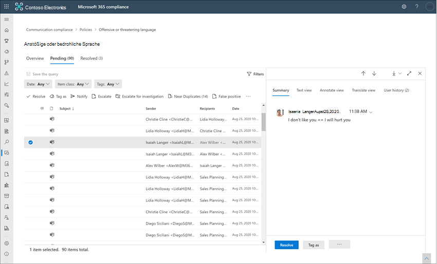

# Untersuchen und Beheben von Warnungen zur Kommunikationscompliance

Nachdem Sie die Richtlinien für die Kommunikations Konformität konfiguriert haben, erhalten Sie Warnungen im Microsoft 365 Compliance Center für Nachrichten Probleme, die ihren Richtlinienbedingungen entsprechen. Befolgen Sie die hier beschriebenen Workflowanweisungen, um Warnungs Probleme zu untersuchen und zu beheben.

## Untersuchen von Warnungen

Der erste Schritt zum Untersuchen von in ihren Richtlinien festgestellten Problemen besteht darin, generierte Warnungen im Microsoft 365 Compliance Center zu überprüfen. Im Compliance Center gibt es verschiedene Bereiche, die Ihnen helfen, Warnungen schnell zu untersuchen, je nachdem, wie Sie die Warnungs Gruppierung anzeigen möchten:

- **Homepage zur Kommunikation-Compliance**: Wenn Sie sich bei der [https://compliance.microsoft.com](https://compliance.microsoft.com) Verwendung von Anmeldeinformationen für ein Administratorkonto in Ihrer Microsoft 365 **Communication compliance**-Organisation anmelden, wählen Sie Übersicht über die Kommunikations Kompatibilität aus,  >  **Overview** um die Startseite für die Kommunikations Kompatibilität anzuzeigen. Hier sehen Sie Folgendes:
    - Warnungen, die eine Überprüfung benötigen, die von hoher bis niedriger Dringlichkeit aufgeführt ist. Wählen Sie eine Warnung aus, um die Seite mit den Warnungsdetails zu starten und Korrekturaktionen zu starten.
    - Aktuelle Richtlinien Übereinstimmungen werden nach Richtliniennamen aufgeführt.
    - Aufgelöste Elemente werden nach Richtliniennamen aufgelistet.
    - Eskalationen werden nach Richtlinienname aufgeführt.
    - Benutzer mit den meisten Richtlinien Übereinstimmungen werden von den meisten zur geringsten Anzahl von Übereinstimmungen aufgeführt.
- **Registerkarte "Benachrichtigungen"**: Navigieren Sie zu Benachrichtigungen zur **Kommunikations Konformität**  >  **Alerts** , um die nach Richtlinien Übereinstimmungen gruppierten Warnungen der letzten 30 Tage anzuzeigen. In dieser Ansicht können Sie schnell erkennen, welche Kommunikationsrichtlinien Richtlinien die meisten nach Schweregrad bestellten Warnungen generieren.  Erweitern Sie zum Starten von Korrekturaktionen eine Richtlinie, um eine bestimmte Warnung auszuwählen und die Seite Warnungsdetails zu öffnen.
- **Registerkarte Richtlinien**: Navigieren Sie zu **Kommunikations Konformitäts**  >  **Richtlinien** , um Richtlinien für die Kommunikations Konformität anzuzeigen, die für Ihre Microsoft 365-Organisation konfiguriert sind. Jede aufgeführte Richtlinie enthält die Anzahl der Warnungen, die überprüft werden müssen. Wenn Sie eine Richtlinie auswählen, werden alle ausstehenden Warnungen für Übereinstimmungen mit der Richtlinie angezeigt, und Sie können eine bestimmte Warnung auswählen, um die Richtlinien Detailseite zu starten und Korrekturaktionen zu starten.

### Verwenden von Filtern

Der nächste Schritt besteht darin, die Nachrichten so zu sortieren, dass es einfacher ist, Warnungen zu untersuchen. Communication Compliance unterstützt die Filterung auf mehreren Ebenen für mehrere Nachrichtenfelder, damit Sie Nachrichten mit Richtlinien Übereinstimmungen schnell untersuchen und überprüfen können. Filterung steht für ausstehende und aufgelöste Elemente für jede konfigurierte Richtlinie zur Verfügung. Sie können Filter Abfragen für eine Richtlinie konfigurieren oder benutzerdefinierte und standardmäßige Filter Abfragen für die Verwendung in jeder bestimmten Richtlinie konfigurieren und speichern. Nach dem Konfigurieren von Feldern für einen Filter werden die Filterfelder oben in der Warn Meldungswarteschlange angezeigt, die Sie für bestimmte Filterwerte konfigurieren können.

Eine vollständige Liste der Filter und Feld Details finden Sie unter [Filter](communication-compliance-feature-reference.md#filters) im Feature-Referenzthema.

#### So konfigurieren Sie einen Filter

1. Melden [https://compliance.microsoft.com](https://compliance.microsoft.com) Sie sich mit Anmeldeinformationen für ein Administratorkonto in Ihrer Microsoft 365-Organisation an.

2. Wechseln Sie im Microsoft 365 Compliance Center zu **Communication Compliance**.

3. Wählen Sie die Registerkarte **Richtlinien** aus, und wählen Sie dann eine Richtlinie zur Untersuchung aus, doppelklicken Sie auf die Seite **Richtlinie** öffnen.

4. Wählen Sie auf der Seite **Richtlinie** entweder die Registerkarte **Ausstehend** oder **aufgelöst** aus, um die Elemente für die Filterung anzuzeigen.

5. Wählen Sie das **Filter** -Steuerelement aus, um die Seite **Filter** Details zu öffnen.

6. Aktivieren Sie mindestens ein Kontrollkästchen, um Filter für diese Warnungen zu aktivieren. Sie können aus zahlreichen Filtern auswählen, einschließlich *Datum*, *Absender*, *Betreff/Titel*, *Klassifizierungen*und vieles mehr.

7. Wenn Sie den als Standardfilter ausgewählten Filter speichern möchten, wählen Sie **als Standard speichern**aus. Wenn Sie diesen Filter als gespeicherten Filter verwenden möchten, wählen Sie **Fertig**aus.

8. Wenn Sie die ausgewählten Filter als Filterabfrage speichern möchten, wählen Sie **Speichern des Abfrage** Steuerelements aus, nachdem Sie mindestens einen Filterwert konfiguriert haben. Geben Sie einen Namen für die Filterabfrage ein, und wählen Sie **Speichern**aus. Dieser Filter ist nur für diese Richtlinie verfügbar und wird im Abschnitt **gespeicherte Filter Abfragen** auf der Seite **Filter** Details aufgeführt.

    

### Verwenden von Near und Exact Duplicate Analysis

Compliance-Richtlinien für die Kommunikation überprüfen und konfigurieren automatisch nahe und exakte Nachrichtenduplikate ohne zusätzliche Konfigurationsschritte. Diese Ansicht ermöglicht es Ihnen, gleichzeitig oder als Gruppe schnell Nachrichten zu beheben, wodurch die Belastung der Nachrichten Ermittlung für Bearbeiter reduziert wird. Wenn Duplikate erkannt werden, werden die Steuerelemente **nahe Duplikate** und/oder **exakte Duplikate** auf der Symbolleiste für die Behebungsaktion angezeigt. Diese Ansicht ist nicht verfügbar, wenn nahe oder exakte Duplikate nicht gefunden werden.

#### So beheben Sie Duplikate

1. Melden [https://compliance.microsoft.com](https://compliance.microsoft.com) Sie sich mit Anmeldeinformationen für ein Administratorkonto in Ihrer Microsoft 365-Organisation an.

2. Wechseln Sie im Microsoft 365 Compliance Center zu **Communication Compliance**.

3. Wählen Sie die Registerkarte **Richtlinien** aus, und wählen Sie dann eine Richtlinie zur Untersuchung aus, doppelklicken Sie auf die Seite **Richtlinie** öffnen.

4. Wählen Sie auf der Seite **Richtlinie** entweder die Registerkarte **Ausstehend** oder **aufgelöst** aus, um doppelte Nachrichten anzuzeigen.

5. Wählen Sie die Steuerelemente **nahe Duplikate** oder **exakte Duplikate** aus, um die Detailseite Duplikate zu öffnen.

6. Wählen Sie eine oder mehrere Nachrichten zur Korrektur Aktionssteuerung für diese Nachrichten aus.

7. Wählen Sie **Auflösen**, **Benachrichtigen**, **eskalieren**oder **herunterladen** aus, um die Aktion auf die ausgewählten doppelten Nachrichten anzuwenden. als Standardfilter ausgewählt.

8. Wählen Sie **Schließen** aus, nachdem Sie die Korrekturaktionen für die Nachrichten abgeschlossen haben.

    

## Beheben von Warnungen

Unabhängig davon, wo Sie mit der Überprüfung von Warnungen oder der von Ihnen konfigurierten Filterung beginnen, besteht der nächste Schritt darin, Maßnahmen zum Beheben der Warnung zu ergreifen. Starten Sie die Warnungs Korrektur mit dem folgenden Workflow auf den Seiten **Richtlinien** oder **Warnungen** :

1. **Untersuchen Sie die Grundlagen der Nachricht**: Manchmal ist es von der Quelle oder vom Betreff her offensichtlich, dass eine Nachricht sofort korrigiert werden kann. Möglicherweise ist die Nachricht falsch oder fälschlicherweise mit einer Richtlinie abgeglichen und sollte als falsch positives Ergebnis aufgelöst werden. Wählen Sie das Steuerelement **falsch positiv** aus, um die Warnung sofort aufzulösen und aus der Warteschlange für ausstehende Warnungen zu entfernen. Anhand der Quell-oder Absenderinformationen wissen Sie möglicherweise bereits, wie die Nachricht unter diesen Umständen geroutet oder verarbeitet werden sollte. Verwenden Sie zum Zuweisen eines Tags zu entsprechenden Nachrichten oder zum Senden von Nachrichten an einen bestimmten Prüfer die Verwendung der **Tags als** oder **eskalieren** -Steuerelemente.

    

2. **Überprüfen Sie die Nachrichtendetails**: Nachdem Sie die Grundlagen der Nachricht überprüft haben, ist es an der Zeit, eine Nachricht zu öffnen, um die Details zu überprüfen und weitere Korrekturaktionen zu bestimmen. Wählen Sie eine Nachricht aus, um den vollständigen Nachrichtenkopf und die Textkörper Informationen anzuzeigen. Es stehen verschiedene Ansichten zur Verfügung, die Sie bei der Entscheidung über die richtige Vorgehensweise unterstützen:

    - **Quellansicht**: Diese Ansicht ist die standardmäßige Nachrichtenansicht, die in den meisten webbasierten Messaging Plattformen häufig angezeigt wird. Die Kopfzeileninformationen werden in der Formatvorlage Normal formatiert, und der Nachrichtentext unterstützt eingebettete Grafikdateien und Text umbrochen.
    - **Textansicht**: in der Textansicht wird eine nur-Text-Textansicht der Nachricht angezeigt und enthält Stichwort Hervorhebung für Begriffe, die in der zugeordneten Kommunikations Konformitätsrichtlinie übereinstimmen. Stichwort Hervorhebung kann Ihnen helfen, lange Nachrichten für den gewünschten Bereich schnell zu durchsuchen. Eingebettete Dateien werden nicht angezeigt, und die Nummerierung dieser Ansicht ist hilfreich, um auf relevante Details zwischen mehreren Prüfern zu verweisen.
    - **Ansicht mit Anmerkungen versehen**: in dieser Ansicht können Bearbeiter Anmerkungen direkt in der Nachricht hinzufügen, die in der Ansicht der Nachricht gespeichert werden.
    - **Benutzer Historie**: Ansicht "Benutzerverlauf" zeigt alle anderen Warnungen an, die von einer Kommunikations Konformitätsrichtlinie für den Benutzer generiert werden, der die Nachricht sendet.

    

3. **Entscheiden Sie sich für eine Korrekturaktion**: Nachdem Sie nun die Details der Nachricht für die Warnung überprüft haben, können Sie mehrere Korrekturaktionen auswählen:

    - **Lösung**: Wenn Sie das Steuerelement **Auflösen** auswählen, wird die Nachricht sofort aus der Warteschlange für **ausstehende Warnungen** entfernt, und die Nachricht kann nicht weiter ausgeführt werden. Wenn Sie **Auflösen**auswählen, haben Sie die Benachrichtigung im wesentlichen ohne weitere Klassifizierung geschlossen und können nicht erneut für weitere Aktionen geöffnet werden. Alle aufgelösten Nachrichten werden auf der Registerkarte **aufgelöst** angezeigt.
    - **Falsch positiv**: Sie können eine Nachricht jederzeit während des Workflows zur Nachrichtenüberprüfung als falsch positiv auflösen. Die Nachricht kann nicht erneut geöffnet werden, und alle falsch positiven Nachrichten werden auf der Registerkarte **aufgelöst** angezeigt.
    - **Tag as**: kennzeichnen der Nachricht als *konform*, *nicht konform*oder als *fragwürdig* , da Sie sich auf die Richtlinien und Standards für Ihre Organisation bezieht. Durch das Hinzufügen von Tags und Markierungs Kommentaren können Sie Richtlinienwarnungen für Eskalationen oder als Teil anderer interner Überprüfungsprozesse mikrofiltern. Nachdem die Markierung abgeschlossen ist, können Sie die Nachricht auch auflösen, um Sie aus der Warteschlange für ausstehende Überprüfungen zu entfernen.
    - **Notify**: Sie können das **Notify** -Steuerelement verwenden, um der Warnung eine benutzerdefinierte Notizvorlage zuzuweisen und eine Warnmeldung an den Benutzer zu senden. Wählen Sie die entsprechende Notizvorlage aus, und wählen Sie senden aus, um eine Erinnerung an den Mitarbeiter, der die Nachricht gesendet hat, per e-Mail zu **senden** und das Problem zu beheben.
    - **Eskalieren**: mithilfe des **Eskalations** Steuerelements können Sie auswählen, welche Person in Ihrer Organisation die Nachricht überprüfen soll. Wählen Sie aus einer Liste der Bearbeiter aus, die in der Kommunikations Konformitätsrichtlinie konfiguriert sind, um eine e-Mail-Benachrichtigung zu senden und eine zusätzliche Überprüfung der Nachrichten Benachrichtigung anzufordern Der ausgewählte Bearbeiter kann einen Link in der e-Mail-Benachrichtigung verwenden, um direkt zu den Elementen zu gelangen, die zur Überarbeitung eskaliert wurden.
    - **Erstellen eines Falles**: mit dem **Create a Case** -Steuerelement können Sie einen neuen [erweiterten eDiscovery-Fall](overview-ediscovery-20.md) für einzelne oder mehrere Nachrichten erstellen. Sie geben einen Namen und Notizen für den neuen Fall an, und Benutzer, der die Nachricht gesendet hat, die der Richtlinie entspricht, werden automatisch als Fall Verwalter zugewiesen. Sie benötigen keine zusätzlichen Berechtigungen, um den Fall zu verwalten. Durch das Erstellen einer Groß-/Kleinschreibung wird kein neues Tag für die Nachricht aufgelöst oder erstellt.

4. **Ermitteln, ob Nachrichtendetails außerhalb der Kommunikations Kompatibilität archiviert werden sollen**: Nachrichtendetails können exportiert oder heruntergeladen werden, wenn Sie die Nachrichten in einer separaten Speicherlösung archivieren müssen. Durch die Auswahl des **Download** -Steuerelements werden ausgewählte Nachrichten automatisch zu a hinzugefügt. ZIP-Datei, die im Speicher außerhalb von Microsoft 365 gespeichert werden kann.
