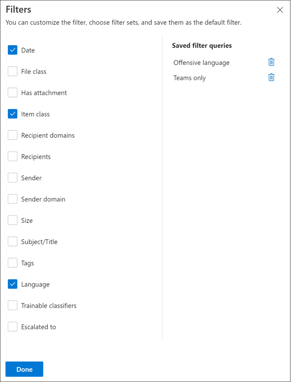

# Untersuchen und Beheben von Warnungen zur Kommunikationscompliance

Nachdem Sie die Richtlinien für die Kommunikations Konformität konfiguriert haben, erhalten Sie Warnungen im Microsoft 365 Compliance Center für Nachrichten Probleme, die ihren Richtlinienbedingungen entsprechen. Befolgen Sie die hier beschriebenen Workflowanweisungen, um Warnungs Probleme zu untersuchen und zu beheben.

## Untersuchen von Warnungen

Der erste Schritt zum Untersuchen von Problemen, die von ihren Richtlinien erkannt werden, ist die Überprüfung der Benachrichtigungen über Kommunikations Konformität im Microsoft 365 Compliance Center. Im Bereich Kommunikation Compliance Solution stehen verschiedene Bereiche zur Verfügung, mit denen Sie Warnungen schnell untersuchen können, je nachdem, wie Sie die Warnungs Gruppierung anzeigen möchten:

- **Seite für die Kommunikations Konformitätsrichtlinie**: Wenn Sie sich bei der [https://compliance.microsoft.com](https://compliance.microsoft.com) Verwendung von Anmeldeinformationen für ein Administratorkonto in Ihrer Microsoft 365-Organisation anmelden, wählen Sie **Kommunikations Kompatibilität** aus, um die Seite Kommunikations Konformitäts **Richtlinie** anzuzeigen. Auf dieser Seite werden die für Ihre Microsoft 365-Organisation konfigurierten Kommunikations Konformitätsrichtlinien und Links zu empfohlenen Richtlinienvorlagen angezeigt. Jede aufgeführte Richtlinie enthält die Anzahl der Warnungen, die überprüft werden müssen, die Anzahl der eskalierten und aufgelösten Elemente und den aktuellen Status der Richtlinie. Beim Auswählen einer Richtlinie werden alle ausstehenden Warnungen für Übereinstimmungen mit der Richtlinie angezeigt. Wählen Sie eine bestimmte Warnung aus, um die Seite mit den Richtliniendetails zu starten und Korrekturmaßnahmen zu ergreifen.
- **Warnungen**: Navigieren Sie zu Benachrichtigungen zur **Kommunikations Konformität**  >  **Alerts** , um die nach Richtlinien Übereinstimmungen gruppierten Warnungen der letzten 30 Tage anzuzeigen. In dieser Ansicht können Sie schnell erkennen, welche Richtlinien der Kommunikationscompliance die meisten Warnungen nach Schweregraden generieren. Um Korrekturaktionen zu starten, wählen Sie die der Warnung zugeordnete Richtlinie aus, um die Seite **Richtliniendetails** zu starten. Auf der Seite mit den **Richtliniendetails** können Sie eine Zusammenfassung der Aktivitäten auf der Übersichts **Seite lesen** , Warnmeldungen auf der Seite **Ausstehend** überprüfen und bearbeiten oder den Verlauf von geschlossenen Warnungen auf der Seite " **aufgelöst** " überprüfen.
- **Berichte**: Navigieren Sie zu **Kommunikations Kompatibilitäts**  >  **Berichten** , um den Bericht Widgets für die Kommunikations Konformität anzuzeigen. Jedes Widget bietet eine Übersicht über die Aktivitäten und Status von Kommunikationsrichtlinien Treue, einschließlich des Zugriffs auf tiefere Einblicke in Richtlinien Übereinstimmungen und Korrekturaktionen.

### Verwenden von Filtern

Der nächste Schritt besteht darin, die Nachrichten zu sortieren, um die Warnungen leichter untersuchen zu können. Auf der Seite **Richtliniendetails** unterstützt Communication Compliance die Filterung auf mehreren Ebenen für mehrere Nachrichtenfelder, damit Sie Nachrichten mit Richtlinien Übereinstimmungen schnell untersuchen und überprüfen können. Die Filterung ist für ausstehende und gelöste Elemente für jede konfigurierte Richtlinie verfügbar. Sie können Filterabfragen für eine Richtlinie konfigurieren oder benutzerdefinierte und standardmäßige Filterabfragen für die Verwendung in jeder bestimmten Richtlinie konfigurieren. Nachdem Sie die Felder für einen Filter konfiguriert haben, werden die Filterfelder oben in der Warteschlange für die Warnmeldung angezeigt, die Sie für bestimmte Filterwerte konfigurieren können.

Eine vollständige Liste der Filter und Feld Details finden Sie unter [Filter](communication-compliance-feature-reference.md#filters) im Feature Reference-Artikel.

#### So konfigurieren Sie einen Filter

1. Melden [https://compliance.microsoft.com](https://compliance.microsoft.com) Sie sich mit Anmeldeinformationen für ein Administratorkonto in Ihrer Microsoft 365-Organisation an.

2. Wechseln Sie im Microsoft 365 Compliance Center zu **Communication Compliance**.

3. Wählen Sie die Registerkarte **Richtlinien** aus, und wählen Sie dann eine Richtlinie zur Untersuchung aus, doppelklicken Sie auf die Seite **Richtlinie** öffnen.

4. Wählen Sie auf der Seite **Richtlinie** entweder die Registerkarte **Ausstehend** oder **aufgelöst** aus, um die Elemente für die Filterung anzuzeigen.

5. Wählen Sie das **Filter** -Steuerelement aus, um die Seite **Filter** Details zu öffnen.

6. Aktivieren Sie mindestens ein Kontrollkästchen, um Filter für diese Warnungen zu aktivieren. Sie können aus zahlreichen Filtern auswählen, einschließlich *Datum*, *Absender*, *Betreff/Titel*, *Klassifizierungen* und vieles mehr.

7. Wenn Sie den als Standardfilter ausgewählten Filter speichern möchten, wählen Sie **als Standard speichern** aus. Wenn Sie diesen Filter als gespeicherten Filter verwenden möchten, wählen Sie **Fertig** aus.

8. Wenn Sie die ausgewählten Filter als Filterabfrage speichern möchten, wählen Sie **Speichern des Abfrage** Steuerelements aus, nachdem Sie mindestens einen Filterwert konfiguriert haben. Geben Sie einen Namen für die Filterabfrage ein, und wählen Sie **Speichern** aus. Dieser Filter ist nur für diese Richtlinie verfügbar und wird im Abschnitt **gespeicherte Filter Abfragen** auf der Seite **Filter** Details aufgeführt.

    

### Verwenden der Analyse naher und genauer Duplikate

Richtlinien zur Kommunikationscompliance werden automatisch gescannt und nahe und genaue Nachrichtenduplikate ohne zusätzliche Konfigurationsschritte vorgruppiert. In dieser Ansicht können Sie schnell auf ähnliche Nachrichten einzeln oder als Gruppe reagieren, wodurch die Belastung der Nachrichten Ermittlung für Bearbeiter reduziert wird. Wenn Duplikate erkannt werden, werden die Steuerelemente **Nahe Duplikate** und/oder **Exakte Duplikate** in der Symbolleiste für Korrekturmaßnahmen angezeigt. Diese Ansicht ist nicht verfügbar, wenn nahe oder exakte Duplikate nicht gefunden werden.

#### So beheben Sie Duplikate

1. Melden [https://compliance.microsoft.com](https://compliance.microsoft.com) Sie sich mit Anmeldeinformationen für ein Administratorkonto in Ihrer Microsoft 365-Organisation an.

2. Wechseln Sie im Microsoft 365 Compliance Center zu **Communication Compliance**.

3. Wählen Sie die Registerkarte **Richtlinien** aus, und wählen Sie dann eine Richtlinie zur Untersuchung aus, doppelklicken Sie auf die Seite **Richtlinie** öffnen.

4. Wählen Sie auf der Seite **Richtlinie** entweder die Registerkarte **Ausstehend** oder **aufgelöst** aus, um doppelte Nachrichten anzuzeigen.

5. Wählen Sie die Steuerelemente **nahe Duplikate** oder **exakte Duplikate** aus, um die Detailseite Duplikate zu öffnen.

6. Wählen Sie eine oder mehrere Nachrichten zur Korrektur Aktionssteuerung für diese Nachrichten aus.

7. Wählen Sie **Auflösen**, **Benachrichtigen**, **eskalieren** oder **herunterladen** aus, um die Aktion auf die ausgewählten doppelten Nachrichten als Standardfilter anzuwenden.

8. Wählen Sie **Schließen** aus, nachdem Sie die Korrekturaktionen für die Nachrichten abgeschlossen haben.

    

## Beheben von Warnungen

Unabhängig davon, wo Sie mit der Überprüfung von Warnungen oder der von Ihnen konfigurierten Filterung beginnen, besteht der nächste Schritt darin, Korrekturmaßnahmen zur Lösung der Warnung zu ergreifen. Starten Sie die Warnungs Korrektur mit dem folgenden Workflow auf den Seiten **Richtlinien** oder **Benachrichtigungen** .

### Schritt 1: Überprüfen der Nachrichten Grundlagen

 Manchmal ist es aus der Quelle oder dem Betreff offensichtlich, dass eine Nachricht sofort korrigiert werden kann. Möglicherweise ist die Nachricht falsch oder fälschlicherweise mit einer Richtlinie abgeglichen und sollte als falsch positives Ergebnis aufgelöst werden. Wählen Sie die Steuerung für **Fehlmeldungen**, um die Warnung sofort zu lösen und aus der Warteschlange für ausstehende Warnungen zu entfernen. Anhand der Quell- oder Absenderinformationen wissen Sie möglicherweise bereits, wie die Nachricht unter diesen Bedingungen geroutet oder behandelt werden sollte. Erwägen Sie die Verwendung der Steuerelemente **Kennzeichnen als** oder **Eskalieren**, um entsprechenden Nachrichten eine Kennzeichnung zuzuweisen oder Nachrichten an einen bestimmten Bearbeiter zu senden.

### Schritt 2: Überprüfen der Nachrichtendetails

Nachdem Sie die Nachrichten Grundlagen überprüft haben, ist es an der Zeit, eine Nachricht zu öffnen, um die Details zu überprüfen und weitere Korrekturaktionen zu bestimmen. Wählen Sie eine Nachricht aus, um den gesamten Nachrichtenkopf und die Textkörperinformationen anzuzeigen. Es stehen mehrere Ansichten zur Verfügung, die Ihnen bei der Entscheidung zur richtigen Vorgehensweise helfen:

- **Quellansicht**: Diese Ansicht ist die standardmäßige Nachrichtenansicht, die häufig in den meisten webbasierten Messaging-Plattformen zu sehen ist. Die Kopfzeileninformationen werden in der Formatvorlage Normal formatiert, und der Nachrichtentext unterstützt eingebettete Grafikdateien und Text umbrochen.
- **Textansicht**: in der Textansicht wird eine nur-Text-Textansicht der Nachricht angezeigt, und es werden Stichwort Hervorhebungen in Nachrichten und Anlagen für Begriffe, die in der zugehörigen Kommunikations Konformitätsrichtlinie übereinstimmen, eingeschlossen. Stichwort Hervorhebung kann Ihnen helfen, lange Nachrichten und Anlagen für den gewünschten Bereich schnell zu überprüfen. In einigen Fällen ist hervorgehobener Text möglicherweise nur in Anlagen für Nachrichten, die Richtlinienbedingungen entsprechen. Eingebettete Dateien werden nicht angezeigt, und die Nummerierung dieser Ansicht ist hilfreich, um auf relevante Details zwischen mehreren Prüfern zu verweisen.
- **Anmerkungenansicht**: In dieser Ansicht können Prüfer Anmerkungen direkt zu der Nachricht hinzufügen, die in der Nachrichtenansicht gespeichert werden.
- **Benutzerhistorie**: Die Ansicht "Benutzerhistorie" zeigt alle anderen Warnungen an, die durch eine Richtlinie zur Kommunikationscompliance für den Benutzer, der die Nachricht sendet, generiert wurden.
- **Nachrichtendetail Ansicht**: Erweiterte Ansicht der Nachrichten Metadaten und Konfigurationsinformationen.
- **Benachrichtigung über Mustererkennung (Preview)**: viele belästigende und Mobbing-Aktionen im Laufe der Zeit und erfordern wiederkehrende Instanzen desselben Verhaltens durch einen Benutzer. Das *Muster erkannte* Benachrichtigung wird in den Warnungsdetails angezeigt und erhöht die Aufmerksamkeit auf die Warnung. Die Erkennung von Mustern erfolgt auf der Grundlage von Richtlinien und wertet das Verhalten in den letzten 30 Tagen aus, wenn mindestens zwei Nachrichten von einem Absender an denselben Empfänger gesendet werden. Ermittler und Bearbeiter können diese Benachrichtigung verwenden, um wiederholtes Verhalten zu identifizieren, um die Warnung nach Bedarf auszuwerten.

    

### Schritt 3: entscheiden Sie sich für eine Korrekturaktion

Nachdem Sie die Details der Nachricht für die Warnung überprüft haben, können Sie mehrere Korrekturaktionen auswählen:

- **Lösung**: Wenn Sie das Steuerelement **Auflösen** auswählen, wird die Nachricht sofort aus der Warteschlange für **ausstehende Warnungen** entfernt, und die Nachricht kann nicht weiter ausgeführt werden. Wenn Sie **Auflösen** auswählen, haben Sie die Benachrichtigung im wesentlichen ohne weitere Klassifizierung geschlossen und können nicht erneut für weitere Aktionen geöffnet werden. Alle aufgelösten Nachrichten werden auf der Registerkarte **aufgelöst** angezeigt.
- **Falsch positiv**: Sie können eine Nachricht jederzeit während des Workflows zur Nachrichtenüberprüfung als falsch positiv auflösen. False positive bedeutet, dass es sich bei der Warnung nicht um eine Aktion handelt oder dass die Warnung vom Warnungs Prozess falsch generiert wurde. Die Nachricht kann nicht erneut geöffnet werden, und alle falsch positiven Nachrichten werden auf der Registerkarte **aufgelöst** angezeigt.
- **Power Automation (Vorschau)**: Verwenden Sie einen Power-Automatisierungs Fluss, um Prozessaufgaben für eine Warnmeldung zu automatisieren. Standardmäßig enthält die Kommunikations Kompatibilität den *Notify Manager, wenn ein Benutzer über eine Benachrichtigungs* Fluss Vorlage für die Kommunikations Konformität verfügt, mit der Bearbeiter den Benachrichtigungsprozess für Benutzer mit Nachrichten Benachrichtigungen automatisieren können. Weitere Informationen zum Erstellen und Verwalten von Power Automation Flows in Communication Compliance finden Sie im Artikel zur [Kommunikation Compliance Feature Reference](communication-compliance-feature-reference.md#power-automate-flows-preview) .
- **Tag as**: kennzeichnen der Nachricht als *konform*, *nicht konform* oder als *fragwürdig* , da Sie sich auf die Richtlinien und Standards für Ihre Organisation bezieht. Durch das Hinzufügen von Tags und Markierungs Kommentaren können Sie Richtlinienwarnungen auf Eskalationen oder im Rahmen anderer interner Überprüfungsprozesse mikrofiltern. Nachdem die Markierung abgeschlossen ist, können Sie die Nachricht auch auflösen, um Sie aus der Warteschlange für ausstehende Überprüfungen zu entfernen.
- **Notify**: Sie können das **Notify** -Steuerelement verwenden, um der Warnung eine benutzerdefinierte Notizvorlage zuzuweisen und eine Warnmeldung an den Benutzer zu senden. Wählen Sie die entsprechende Notizvorlage aus dem Bereich **Kommunikations Kompatibilitätseinstellungen** aus, und wählen Sie senden aus, um eine Erinnerung an den Benutzer, der die Nachricht gesendet hat, per e-Mail zu **senden** und das Problem zu beheben.
- **Eskalieren**: mithilfe des **Eskalations** Steuerelements können Sie auswählen, welche Person in Ihrer Organisation die Nachricht überprüfen soll. Wählen Sie aus einer Liste der Bearbeiter aus, die in der Kommunikations Konformitätsrichtlinie konfiguriert sind, um eine e-Mail-Benachrichtigung zu senden und eine zusätzliche Überprüfung der Nachrichten Benachrichtigung anzufordern Der ausgewählte Prüfer kann einen Link in der E-Mail-Benachrichtigung verwenden, um direkt zu den an ihn zur Prüfung eskalierten Elementen zu gelangen.
- **Eskalieren zur Untersuchung**: mithilfe des Steuerelements **Eskalation für Untersuchung** können Sie einen neuen [erweiterten eDiscovery-Fall](overview-ediscovery-20.md) für einzelne oder mehrere Nachrichten erstellen. Sie geben einen Namen und Notizen für den neuen Fall an, und Benutzer, der die Nachricht gesendet hat, die der Richtlinie entspricht, werden automatisch als Fall Verwalter zugewiesen. Sie benötigen keine zusätzlichen Berechtigungen, um den Fall zu verwalten. Durch das Erstellen einer Groß-/Kleinschreibung wird kein neues Tag für die Nachricht aufgelöst oder erstellt. Sie können bei der Erstellung eines erweiterten eDiscovery-Falls während des Korrekturprozesses insgesamt 100 Nachrichten auswählen. Nachrichten in allen Kommunikationskanälen, die von der Kommunikations Konformität überwacht werden, werden unterstützt. Sie können beispielsweise 50 Microsoft Teams-Chats, 25 Exchange Online e-Mail-Nachrichten und 25 Jammer Meldungen auswählen, wenn Sie einen neuen erweiterten eDiscovery-Fall für einen Benutzer öffnen.
- **Verbessern der Klassifizierung (Preview)**: Warnungen, die anhand von Übereinstimmungstypen erstellt wurden, benötigen möglicherweise Feedback, um falsch positive Ergebnisse in Ihrer Organisation zu minimieren. Verwenden Sie das Steuerelement **Klassifizierung verbessern** , um Feedback zu geben, wenn die Konformitäts Klassifikation für die Kommunikation gültig ist, oder um andere Schulungs Klassifizierungen für diesen Übereinstimmungs vorzuschlagen. Sie können sicherstellen, dass es sich bei den Klassifizierern um eine *Übereinstimmung* oder *keine Übereinstimmung* handelt, oder andere Schulungs Klassifizierer vorschlagen, die dieser Art von Warnungs Aktivität zukünftig zugeordnet werden sollen.

    1. Wählen Sie eine Nachricht aus der Benachrichtigungsliste aus.
    2. Wählen Sie die Auslassungspunkte aus, und wählen Sie **Klassifizierung optimieren** aus.
    3. Wenn das Element im Detailbereich für die **Klassifizierungs Bewertung** einen echten positiven Wert aufweist, wählen Sie **Übereinstimmung** aus.  Wenn das Element fälschlicherweise als falsch positives Ergebnis in der Kategorie enthalten war, wählen Sie **keine Übereinstimmung** aus.
    4. Wenn es eine andere Klassifizierung gibt, die für das Element besser geeignet ist, wählen Sie Sie aus der Liste **andere schulungsable-Klassifizierungen vorschlagen** aus. Dieses Feedback löst die andere Klassifizierung aus, um das Element auszuwerten.

    > [!TIP]
    > Sie können gleichzeitig Feedback zu mehreren Elementen geben, indem Sie Sie alle auswählen und dann in der Befehlsleiste **ausführliches Feedback** auswählen.

    5. Wählen Sie **Feedback senden** aus, um Ihre Bewertung der **Übereinstimmung** zu senden und **keine Übereinstimmungs** Klassifizierungen zu erhalten, und schlagen Sie andere schulungsable-Klassifizierungen vor. Wenn Sie 30 Instanzen von Feedback für eine Klassifizierung bereitgestellt haben, wird Sie automatisch umgeschult. Eine Umschulung kann 1-4 Stunden in Anspruch nehmen. Klassifizierungen können nur zweimal pro Tag umgeschult werden.

    > [!IMPORTANT]
    > Diese Informationen werden in Ihrem Mandanten an die Klassifizierung weitergeleitet, und **es geht nicht zurück zu Microsoft**.

    Weitere Informationen zur Umschulungs Klassifizierung für die Kommunikations Kompatibilität finden Sie unter [Retrain a Klassifizierung in Communications Compliance](classifier-how-to-retrain-comms-compliance.md) article.

    

- **Nachricht in Microsoft Teams entfernen**: mithilfe des Steuerelements " **Nachricht in Teams entfernen** " können Sie ungeeignete Nachrichten und Inhalte blockieren, die in Warnungen aus Microsoft Teams-Kanälen und 1:1-und Gruppenchats identifiziert wurden. Entfernte Nachrichten und Inhalte werden durch einen richtlinientipp ersetzt, der erklärt, dass er blockiert wird, und die Richtlinie, die für die Entfernung aus der Ansicht gilt. Empfänger erhalten einen Link im richtlinientipp, um mehr über die zutreffende Richtlinie und den Überprüfungsprozess zu erfahren. Der Absender erhält einen richtlinientipp für die blockierte Nachricht und den blockierten Inhalt, kann aber die Details der blockierten Nachricht und des Inhalts für den Kontext bezüglich der Entfernung überprüfen.

    

### Schritt 4: bestimmen, ob Nachrichtendetails außerhalb der Kommunikations Kompatibilität archiviert werden sollen

Nachrichtendetails können exportiert oder heruntergeladen werden, wenn Sie die Nachrichten in einer separaten Speicherlösung archivieren müssen. Durch Auswahl des Steuerelements **Herunterladen** werden ausgewählte Nachrichten automatisch einer ZIP-Datei hinzugefügt, die außerhalb von Microsoft 365 gespeichert werden kann.
