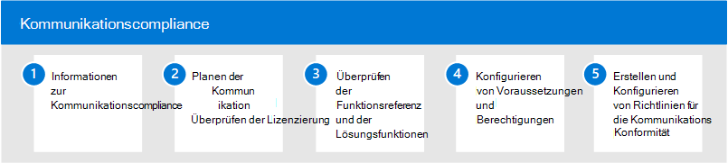

# Kommunikations Kompatibilität in Microsoft 365

Der Schutz vertraulicher Informationen sowie das erkennen und handeln von Belästigungs Ereignissen am Arbeitsplatz ist ein wichtiger Bestandteil der Einhaltung interner Richtlinien und Standards. Die Kommunikations Kompatibilität in Microsoft 365 hilft, diese Risiken zu minimieren, indem Sie Ihnen helfen, schnell Wiederherstellungsaktionen für e-Mail-und Microsoft Teams-Kommunikation zu erkennen, zu erfassen und zu ergreifen. Dazu gehören unangemessene Kommunikation mit anstößigen Inhalten, Bedrohungen sowie Belästigung und Kommunikation, die vertrauliche Informationen innerhalb und außerhalb Ihrer Organisation gemeinsam nutzen.

## Konfigurieren der Kommunikations Kompatibilität für Microsoft 365

Führen Sie die folgenden Schritte aus, um die Kommunikations Konformität für Ihre Organisation zu konfigurieren:

1. Informationen zur [Kommunikations Kompatibilität](communication-compliance.md) in Microsoft 365
2. Planen der [Kommunikation Compliance](communication-compliance-plan.md) und [Überprüfen der Lizenzierung](communication-compliance-configure.md#subscriptions-and-licensing)
3. Überprüfen der [Funktionsreferenz und der Lösungsfunktionen](communication-compliance-feature-reference.md)
4. Konfigurieren von [Voraussetzungen](communication-compliance-configure.md#step-2-required-enable-the-audit-log) und [Berechtigungen](communication-compliance-configure.md#step-1-required-enable-permissions-for-communication-compliance)
5. Erstellen und Konfigurieren von [Richtlinien für die Kommunikations Konformität](communication-compliance-configure.md#step-5-required-create-a-communication-compliance-policy)

## Weitere Informationen zur Kommunikation Compliance

- [Untersuchen und Beheben von Warnungen](communication-compliance-investigate-remediate.md)
- [Fallstudie: contoso konfiguriert schnell eine Offensive Sprachrichtlinie für Microsoft Teams, Exchange und jammern von Kommunikation](communication-compliance-case-study.md)