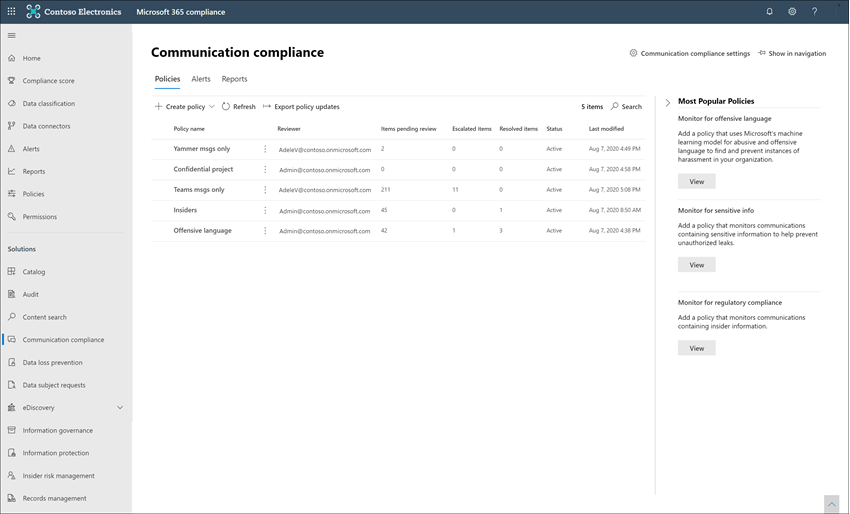

# Informationen zur Kommunikationscompliance in Microsoft 365

Kommunikationscompliance ist eine Insider-Risikolösung in Microsoft 365, die Ihnen hilft, Kommunikationsrisiken zu minimieren, indem sie Ihnen hilft, unangemessene Nachrichten in Ihrer Organisation zu erkennen, zu erfassen und darauf zu reagieren. Vordefinierte und benutzerdefinierte Richtlinien ermöglichen es Ihnen, die interne und externe Kommunikation auf Richtlinienübereinstimmungen zu überprüfen, damit sie von bestimmten Prüfern überprüft werden können. Prüfer können gescannte E-Mails, Microsoft Teams, Yammer oder Drittanbieterkommunikationen in Ihrer Organisation untersuchen und geeignete Maßnahmen ergreifen, um sicherzustellen, dass sie den Nachrichtenstandards Ihrer Organisation entsprechen.

Richtlinien zur Kommunikationscompliance in Microsoft 365 ihnen dabei helfen, viele moderne Herausforderungen im Zusammenhang mit Compliance und interner und externer Kommunikation zu bewältigen, einschließlich:

- Überprüfen zunehmender Kommunikationskanäletypen
- Das wachsende Volumen von Nachrichtendaten
- Behördliche Durchsetzung und das Risiko von Bußgeldern

Darüber hinaus kann es eine Trennung der Aufgaben zwischen Ihren IT-Administratoren und Ihrem Compliance-Management-Team geben. Kommunikationscompliance unterstützt die Trennung zwischen der Konfiguration von Richtlinien und der Untersuchung und Überprüfung von Nachrichten. Beispielsweise kann die IT-Gruppe für Ihre Organisation für die Einrichtung von Berechtigungen für die Kommunikationscompliancerolle, Gruppen und Richtlinien verantwortlich sein, und Ermittler und Prüfer sind möglicherweise für die Nachrichtentriage, -überprüfung und -gegenmaßnahmen verantwortlich.

Die neuesten Ignite-Präsentationen zur Kommunikationscompliance finden Sie in den folgenden Videos:

- [Fördern einer Kultur der Sicherheit und Inklusion mit Kommunikationscompliance](https://www.youtube.com/watch?v=oLVzxcaef3w)
- [Erfahren Sie, wie Sie Kommunikationsrisiken innerhalb Ihrer Organisation reduzieren können.](https://www.youtube.com/watch?v=vzARb1YaxGo)
- [Erfüllen gesetzlicher Complianceanforderungen mit Kommunikationscompliance](https://www.youtube.com/watch?v=gagOhtCBfgU)
- [Besser mit Microsoft Teams – Erfahren Sie mehr über die neuesten systemeigenen Teams integrierten Features in der Kommunikationscompliance](https://www.youtube.com/watch?v=m4jukD5Fh-o)

Eine kurze Übersicht über die Kommunikationscompliance finden Sie unter "Erkennen von [Belästigung am Arbeitsplatz und Reagieren mit Kommunikationscompliance" in Microsoft 365](https://youtu.be/z33ji7a7Zho) Video im Microsoft [Mechanics-Kanal.](https://www.youtube.com/user/OfficeGarageSeries)

## Szenarien für Kommunikationscompliance

Richtlinien zur Kommunikationscompliance können bei der Überprüfung von Nachrichten in Ihrer Organisation in verschiedenen wichtigen Compliancebereichen hilfreich sein:

- **Unternehmensrichtlinien**

    Benutzer müssen in ihrer gesamten geschäftlichen Kommunikation zulässige Nutzungs-, ethische Standards und andere Unternehmensrichtlinien einhalten. Richtlinien zur Kommunikationscompliance können Richtlinienüberstimmungen erkennen und Ihnen helfen, Korrekturmaßnahmen zu ergreifen, um diese Art von Vorfällen zu mindern. Sie können beispielsweise die Benutzerkommunikation in Ihrer Organisation auf potenzielle Personalbedenken wie Belästigung oder die Verwendung unangemessener oder anstößiger Sprache überprüfen.

- **Risikomanagement**

    Organisationen sind für die gesamte Kommunikation verantwortlich, die in ihrer Infrastruktur und ihren Unternehmensnetzwerksystemen verteilt ist. Die Verwendung von Kommunikationscompliancerichtlinien zur Identifizierung und Verwaltung potenzieller rechtlicher Risiken und Risiken kann dazu beitragen, Risiken zu minimieren, bevor sie den Unternehmensbetrieb beschädigen können. Sie können z. B. Nachrichten in Ihrer Organisation auf nicht autorisierte Kommunikationen und Interessengruppen zu vertraulichen Projekten wie bevorstehenden Käufen, Fusionen, Offenlegung von Einnahmen, Neuordnungen oder Änderungen am Führungsteam überprüfen.

- **Einhaltung gesetzlicher Bestimmungen**

    Die meisten Organisationen müssen im Rahmen ihrer normalen Betriebsabläufe einige Arten von gesetzlichen Compliancestandards einhalten. Diese Vorschriften erfordern häufig, dass Organisationen eine Art von Aufsichts- oder Aufsichtsprozess für Nachrichten implementieren, die für ihre Branche geeignet sind. Die FINRA-Regel (Financial Industry Regulatory Authority) 3110 ist ein gutes Beispiel für die Anforderung, dass Organisationen über Aufsichtsverfahren verfügen müssen, um die Benutzerkommunikation und die Arten von Unternehmen zu überprüfen, an denen sie beteiligt ist. Ein weiteres Beispiel könnte die Notwendigkeit sein, die Kommunikation zwischen Vermittlern und Händlern in Ihrem Unternehmen zu überprüfen, um sich gegen potenzielle Geldwäsche, Insiderhandel, geheime Absprachen oder Bestechungsaktivitäten zu schützen. Richtlinien zur Kommunikationscompliance können Ihrer Organisation helfen, diese Anforderungen zu erfüllen, indem sie einen Prozess zum Scannen und Berichten über die Unternehmenskommunikation bereitstellen. Weitere Informationen zur Unterstützung von Finanzorganisationen finden Sie unter [wichtige Compliance- und Sicherheitsüberlegungen für US-Bank- und -Capital-Märkte.](../solutions/financial-services-secure-collaboration.md)

## Wichtige Featurebereiche

Kommunikationscompliance in Microsoft 365 bietet mehrere wichtige Features, um Compliancebedenken auf Ihren Messagingplattformen zu beheben:

- Intelligente anpassbare Vorlagen
- Flexible Wartungsworkflows
- Ergebnisorientierte Einblicke

### Intelligente anpassbare Vorlagen

Intelligente anpassbare Vorlagen in der Kommunikationscompliance ermöglichen es Ihnen, maschinelles Lernen anzuwenden, um Kommunikationsverstöße in Ihrer Organisation intelligent zu erkennen.

- **Anpassbare vorkonfigurierte Vorlagen:** Neue Richtlinienvorlagen helfen bei der Bewältigung der häufigsten Kommunikationsrisiken. Die anfängliche Richtlinienerstellung und -nachaktualisierung sind jetzt schneller mit vordefinierten Vorlagen für Anti-Belästigung und anstößige Sprache, vertrauliche Informationen, Interessengruppen und Compliance-Vorlagen zur Einhaltung gesetzlicher Vorschriften.
- **Neue Machine Learning-Unterstützung:** Integrierte Bedrohungs-, Belästigungs-, Anstößigkeits- und [Bildklassifizierungen](classifier-get-started-with.md) tragen dazu bei, falsch positive Ergebnisse in gescannten Nachrichten zu reduzieren und Prüfern während des Untersuchungs- und Behebungsprozesses Zeit zu sparen.
- **Verbesserter Bedingungs-Generator:** Das Konfigurieren von Richtlinienbedingungen wird jetzt in einer einzigen integrierten Oberfläche im Richtlinien-Assistenten optimiert, wodurch Verwirrung bei der Anwendung von Bedingungen für Richtlinien verringert wird.

### Flexible Wartungsworkflows

Integrierte Korrekturworkflows ermöglichen es Ihnen, Nachrichten mit Richtlinienübersprechungen in Ihrer Organisation schnell zu identifizieren und entsprechende Maßnahmen zu ergreifen. Die folgenden neuen Features erhöhen die Effizienz bei Untersuchungs- und Korrekturaktivitäten:

- **Flexibler Korrekturworkflow:** Mithilfe eines neuen Korrekturworkflows können Sie schnell Maßnahmen für Richtlinienüberstimmungen ergreifen, einschließlich neuer Optionen zum Eskalieren von Nachrichten an andere Prüfer und zum Senden von E-Mail-Benachrichtigungen an Benutzer mit Richtlinienüberstimmungen.
- **Abgleich von Unterhaltungsrichtlinien:** Nachrichten in Unterhaltungen werden nach Richtlinienübereinstimmungen gruppiert, um Ihnen mehr Sichtbarkeit darüber zu geben, wie Unterhaltungen mit Ihren Kommunikationsrichtlinien zusammenhängen. Beispielsweise zeigt der Abgleich von Unterhaltungsrichtlinien in der Ansicht *"Ausstehende Warnungen"* automatisch alle Nachrichten in einem Teams Kanal an, die Übereinstimmungen mit Ihrer Richtlinie für anstößige Sprache aufweisen. Andere Nachrichten in der Unterhaltung, die nicht mit der Richtlinie für anstößige Sprache übereinstimmen, werden nicht angezeigt.
- **Hervorheben von Schlüsselwörtern**: Begriffe, die mit Richtlinienbedingungen übereinstimmen, werden in der Nachrichtentextansicht hervorgehoben, damit die Prüfer Richtlinienwarnungen schnell finden und korrigieren können.
- **Genaue und nahezu doppelte Erkennung:** Zusätzlich zur Überprüfung nach genauen Begriffen, die mit den Richtlinien für die Kommunikationscompliance übereinstimmen, gruppiert die Erkennung von Nahezu-Duplikaten textlich ähnliche Begriffe und Nachrichten zusammen, um ihren Überprüfungsprozess zu beschleunigen.
- **Optische Zeichenerkennung (OCR) (Vorschau):** Scannen, erkennen und untersuchen Sie gedruckten und handschriftlichen Text in Bildern, die in E-Mail- oder Microsoft Teams Chatnachrichten eingebettet oder angefügt sind.
- **Neue Filter:** Untersuchen und beheben Sie Richtlinienwarnungen schneller mit Nachrichtenfiltern für mehrere Felder, einschließlich Absender, Empfänger, Datum, Domänen und vielem mehr.
- **Verbesserte Nachrichtenansichten:** Untersuchungs- und Korrekturaktionen sind jetzt schneller mit neuen Nachrichtenquellen-, Text- und Anmerkungsansichten. Nachrichtenanlagen können jetzt angezeigt werden, um beim Ausführen von Korrekturmaßnahmen den vollständigen Kontext bereitzustellen.
- **Ansicht der Benutzerhistorie**: Die historische Ansicht aller Aktivitäten im Rahmen der Korrekturmaßnahmen für Benutzernachrichten, wie z. B. frühere Benachrichtigungen und Eskalationen bei Richtlinienübereinstimmungen, bietet Prüfern jetzt mehr Kontext während des Korrektur-Workflow-Prozesses. Erstmalige oder wiederholte Instanzen von Richtlinienüberstimmungen für Benutzer werden jetzt archiviert und können auf einfache Weise angezeigt werden.
- **Muster erkannte Benachrichtigung:** Viele Aktionen zur Belästigung und Benachrichtigung erfolgen im Laufe der Zeit und umfassen erneut auftretende Instanzen desselben Verhaltens durch einen Benutzer. Das neue Muster, das in den Warnungsdetails angezeigt wird, trägt dazu bei, die Aufmerksamkeit auf diese Warnungen und diese Art von Verhalten zu lenken.
- **Ansicht "Übersetzen" anzeigen:** Schnelles Untersuchen von Nachrichtendetails in acht Sprachen mithilfe der Übersetzungsunterstützung im Korrekturworkflow. Nachrichten in anderen Sprachen werden automatisch in die Anzeigesprache des Prüfers konvertiert.

### Ergebnisorientierte Einblicke

Neue interaktive Dashboards für Benachrichtigungen, Richtlinienübereinstimmungen, Aktionen und Trends helfen Ihnen, den Status von ausstehenden und korrigierten Warnungen in Ihrem Unternehmen schnell anzuzeigen.

- **Proaktive intelligente Warnungen**: Zu den Warnmeldungen bei Richtlinienübereinstimmungen, die sofortige Aufmerksamkeit erfordern, gehören neue, nach Schweregrad sortierte Dashboards für ausstehende Punkte und neue automatische E-Mail-Benachrichtigungen, die an bestimmte Prüfer gesendet werden.
- **Interaktive Dashboards**: Neue Dashboards zeigen Richtlinienübereinstimmungen, ausstehende und gelöste Aktionen sowie Trends nach Benutzern und Richtlinien an.
- **Überwachungsunterstützung:** Ein vollständiges Protokoll der Richtlinien- und Überprüfungsaktivitäten wird ganz einfach aus dem Microsoft 365 Compliance Center exportiert, um die Unterstützung von Überprüfungsanforderungen zu unterstützen.

## Integration in Microsoft 365-Dienste

Richtlinien für die Kommunikationscompliance scannen und erfassen Nachrichten über mehrere Kommunikationskanäle, um Compliance-Probleme schnell zu überprüfen und zu beheben:

- **Microsoft Teams:** Die Chatkommunikation für öffentliche und private [Microsoft Teams](/MicrosoftTeams/Teams-overview) Kanäle und einzelne Chats wird bei der Kommunikationscompliance als eigenständige Kanalquelle oder mit anderen Microsoft 365-Diensten unterstützt. Sie müssen einzelne Benutzer, Verteilergruppen oder bestimmte Microsoft Teams Kanäle manuell hinzufügen, wenn Sie Benutzer und Gruppen auswählen, die in einer Kommunikationscompliancerichtlinie überwacht werden sollen.
- **Exchange Online:** Alle Postfächer, die auf [Exchange Online](/Exchange/exchange-online) in Ihrer Microsoft 365 Organisation gehostet werden, können gescannt werden. E-Mails und Anlagen, die den Richtlinienbedingungen für die Kommunikationscompliance entsprechen, stehen sofort zur Überwachung und in Complianceberichten zur Verfügung. Exchange Online ist jetzt ein optionaler Quellkanal und in Richtlinien zur Kommunikationscompliance nicht mehr erforderlich.
- **Yammer**: Private Nachrichten und öffentliche Unterhaltungen in [Yammer](/yammer/yammer-landing-page) sind in Richtlinien zur Kommunikationscompliance unterstützt. Yammer ist ein optionaler Kanal und muss sich im [nativen Modus](/yammer/configure-your-yammer-network/overview-native-mode) befinden, um die Überprüfung von Nachrichten und Anlagen zu unterstützen.
- **Skype for Business Online:** Richtlinien zur Kommunikationscompliance unterstützen die Überprüfung der Chatkommunikation und zugehöriger Anlagen in [Skype for Business Online.](/SkypeForBusiness/skype-for-business-online)
- **Drittanbieterquellen:** Sie können Nachrichten aus [Drittanbieterquellen](archiving-third-party-data.md) auf Daten überprüfen, die in Postfächer in Ihrer Microsoft 365 Organisation importiert wurden. Kommunikationscompliance unterstützt Verbindungen zu mehreren beliebten Plattformen, einschließlich Instant Bloomberg und anderen.

Weitere Informationen zur Unterstützung von Messagingkanälen in Richtlinien zur Kommunikationscompliance finden Sie unter [unterstützte Kommunikationstypen.](communication-compliance-feature-reference.md#supported-communication-types)

## Workflow

Kommunikationscompliance hilft Ihnen dabei, häufige Probleme im Zusammenhang mit der Einhaltung interner Richtlinien und behördlicher Compliance-Anforderungen zu beheben. Mit fokussierten Richtlinienvorlagen und einem flexiblen Workflow können Sie umsetzbare Einblicke verwenden, um erkannte Complianceprobleme schnell zu beheben.

Das Identifizieren und Beheben von Kompatibilitätsproblemen mit der Kommunikationscompliance in Microsoft 365 verwendet den folgenden Workflow:

### Konfigurieren

In diesem Workflowschritt identifizieren Sie Ihre Complianceanforderungen und konfigurieren die entsprechenden Richtlinien für die Kommunikationscompliance. Richtlinienvorlagen sind eine hervorragende Möglichkeit, nicht nur schnell eine neue Compliancerichtlinie zu konfigurieren, sondern auch Richtlinien schnell zu ändern und zu aktualisieren, wenn sich Ihre Anforderungen ändern. Beispielsweise können Sie eine Richtlinie für anstößige Sprache und Schutz vor Belästigung bei der Kommunikation für eine kleine Gruppe von Benutzern schnell testen, bevor Sie eine Richtlinie für alle Benutzer in Ihrer Organisation konfigurieren.

> [!IMPORTANT]
> Standardmäßig haben globale Administratoren keinen Zugriff auf Kommunikationscompliancefeatures. Informationen zum Aktivieren von Berechtigungen für Kommunikationscompliancefeatures finden Sie unter ["Kommunikationscompliance in Ihrer Organisation verfügbar machen".](communication-compliance-configure.md#step-1-required-enable-permissions-for-communication-compliance)

Im Microsoft 365 Compliance Center können Sie aus den folgenden Richtlinienvorlagen wählen:

- **Anstößige oder bedrohliche Sprache:** Verwenden Sie diese Vorlage, um schnell eine Richtlinie zu erstellen, die integrierte Klassifizierungen verwendet, um Inhalte automatisch zu erkennen, die als beleidigend oder anstößig eingestuft werden können.
- **Vertrauliche Informationen:** Verwenden Sie diese Vorlage, um schnell eine Richtlinie zum Scannen der Kommunikation mit definierten Typen vertraulicher Informationen oder Schlüsselwörter zu erstellen, um sicherzustellen, dass wichtige Daten nicht für Personen freigegeben werden, die keinen Zugriff haben sollten.
- **Einhaltung gesetzlicher** Vorschriften: Verwenden Sie diese Vorlage, um schnell eine Richtlinie zu erstellen, um die Kommunikation auf Verweise auf finanzielle Standardbedingungen im Zusammenhang mit gesetzlichen Standards zu überprüfen.
- **Interessengruppen:** Verwenden Sie diese Vorlage, um schnell eine Richtlinie zur Überwachung der Kommunikation zwischen zwei Gruppen oder zwei Benutzern zu erstellen, um Interessengruppen zu vermeiden.
- **Benutzerdefinierte Richtlinie:** Verwenden Sie diese Vorlage, um bestimmte Kommunikationskanäle, individuelle Erkennungsbedingungen und die Menge an Inhalten zu konfigurieren, die in Ihrer Organisation überwacht und überprüft werden sollen.

### Untersuchen

In diesem Schritt befassen Sie sich eingehender mit den Problemen, die im Zusammenhang mit Ihren Kommunikationscompliancerichtlinien festgestellt wurden. Dieser Schritt umfasst die folgenden Aktionen, die in der Microsoft 365 Compliance Center verfügbar sind:

- **Warnungen:** Wenn eine Nachricht mit einer Richtlinienbedingung übereinstimmt, wird automatisch eine Warnung generiert. Für jede Warnung können Sie den Status, den Schweregrad, den erkannten Zeitpunkt und die Zuordnung eines Advanced eDiscovery Falls und dessen Status anzeigen. Neue Warnungen werden auf der Startseite für die Kommunikationscompliance und auf der Seite **"Warnungen"** angezeigt und in der Reihenfolge des Schweregrads aufgeführt.
- **Problemverwaltung**: Sie können für jede Warnung Untersuchungsmaßnahmen ergreifen, um Korrekturmaßnahmen für die Probleme in der Nachricht zu ergreifen.
- **Dokumentüberprüfung:** Während der Untersuchung eines Problems können Sie mehrere Ansichten der Nachricht verwenden, um das erkannte Problem ordnungsgemäß zu bewerten. Die Ansichten umfassen eine Zusammenfassung der Unterhaltung, nur Text, Anmerkungs- und Detailansichten der Kommunikationsunterhaltung.
- **Überprüfen des Benutzeraktivitätsverlaufs:** Anzeigen des Verlaufs von Benutzernachrichtenaktivitäten und Abhilfemaßnahmen, wie z. B. frühere Benachrichtigungen und Eskalationen, für Richtlinienübersprechungen.
- **Filter:** Verwenden Sie Filter wie Absender, Empfänger, Datum und Betreff, um die Nachrichtenwarnungen, die Sie überprüfen möchten, schnell einzugrenzen.

### Korrigieren

Der nächste Schritt besteht darin, probleme mit der Kommunikationscompliance zu beheben, die Sie mit den folgenden Optionen untersucht haben:

- **Beheben**: Nachdem Sie ein Problem überprüft haben, können Sie es beheben, indem Sie die Warnung auflösen. Wenn Sie eine Warnung auflösen, wird Sie aus der Warteschlange ausstehender Warnungen entfernt und die Aktion wird als Eintrag in der Warteschlange Aufgelöst für die entsprechende Richtlinie beibehalten. Warnungen werden automatisch aufgelöst, nachdem die Warnung als falsch positiv markiert, ein Hinweis an einen Benutzer über die Warnung gesendet oder ein neuer Fall für die Warnung geöffnet wurde.
- **Eine Nachricht kennzeichnen**: Als Teil der Lösung eines Problems können Sie die erkannte Nachricht als konform, nicht konform oder fragwürdig in Bezug auf die Richtlinien und Standards für Ihre Organisation kennzeichnen. Das Kennzeichnen kann Ihnen helfen, Richtlinienwarnungen für die Eskalation oder als Teil anderer interner Überprüfungsprozesse differenzierter zu filtern.
- **Benachrichtigen Sie den Benutzer:** Häufig verstoßen Benutzer versehentlich oder versehentlich gegen eine Richtlinie zur Kommunikationscompliance. Sie können das Benachrichtigungsfeature verwenden, um dem Benutzer eine Warnmeldung zu senden und das Problem zu beheben.
- **Eskalieren an einen anderen Prüfer**: Manchmal benötigt der Erstprüfer eines Problems Input von anderen Prüfern, um den Vorfall zu beheben. Sie können Nachrichtenprobleme als Teil des Lösungsprozesses leicht an Prüfer in anderen Bereichen Ihrer Organisation eskalieren.
- **Als falsches positives Ergebnis kennzeichnen**: Nachrichten, die fälschlicherweise als Übereinstimmungen von Compliancerichtlinien erkannt wurden, werden gelegentlich in den Überprüfungsvorgang übertragen. Sie können diese Arten von Warnungen als falsch positive Ergebnisse markieren und das Problem automatisch beheben.
- **Entfernen von Nachrichten in Teams (Vorschau):** Unangemessene Nachrichten werden möglicherweise aus der Anzeige in Microsoft Teams Kanälen oder persönlichen Chatnachrichten und Gruppenchatnachrichten entfernt. Entfernte unangemessene Nachrichten werden durch eine Benachrichtigung ersetzt, dass die Nachricht aufgrund eines Richtlinienverstoßes entfernt wurde.
- **Eskalieren zur Untersuchung:** In den schwerwiegendsten Situationen müssen Sie möglicherweise Kommunikationscomplianceinformationen mit anderen Prüfern in Ihrer Organisation teilen. Die Kommunikationscompliance ist eng mit anderen Compliance-Funktionen von Microsoft 365 integriert, um Sie bei der End-to-End-Risikobehebung zu unterstützen. Wenn Sie einen Fall zur Untersuchung eskalieren, können Sie Daten und die Verwaltung des Falls an Advanced eDiscovery in Microsoft 365 übertragen. Advanced eDiscovery bietet einen End-to-End-Workflow zum Beibehalten, Sammeln, Überprüfen, Analysieren und Exportieren von Inhalten, die auf die internen und externen Ermittlungen Ihrer Organisation abgestimmt sind. Dies ermöglicht es juristischen Teams, den gesamten Warnungs-Workflow für die gesetzliche Aufbewahrungspflicht zu verwalten. Weitere Informationen zu den Advanced eDiscovery-Fällen finden Sie unter [Übersicht über Advanced eDiscovery in Microsoft 365](overview-ediscovery-20.md).

### Überwachen

Die Nachverfolgung und Verwaltung von Complianceproblemen, die durch Kommunikationscompliancerichtlinien identifiziert werden, umfasst den gesamten Workflowprozess. Wenn Warnungen generiert und Untersuchungs- und Korrekturaktionen implementiert werden, müssen vorhandene Richtlinien möglicherweise überprüft und aktualisiert werden, und es müssen möglicherweise neue Richtlinien erstellt werden.

- **Überwachen und Melden:** Verwenden Sie Widgets für das Kommunikationscompliance-Dashboard, exportieren Sie Protokolle und Ereignisse, die in den einheitlichen Überwachungsprotokollen aufgezeichnet wurden, um Ihren Compliancestatus kontinuierlich zu bewerten und zu verbessern.

## Sind Sie bereit loszulegen?

- Informationen zur Planung finden Sie unter ["Planen der Kommunikationscompliance".](communication-compliance-plan.md)
- Sehen Sie sich die [Fallstudie für Contoso](communication-compliance-case-study.md) an und erfahren Sie, wie sie schnell eine Richtlinie zur Kommunikationscompliance konfiguriert haben, um in Microsoft Teams, Exchange Online und Yammer Kommunikation auf anstößige Sprache zu überwachen.
- Informationen zum Konfigurieren der Kommunikationscompliance für Ihre Microsoft 365 Organisation finden Sie unter Konfigurieren der [Kommunikationscompliance für Microsoft 365.](communication-compliance-configure.md)
