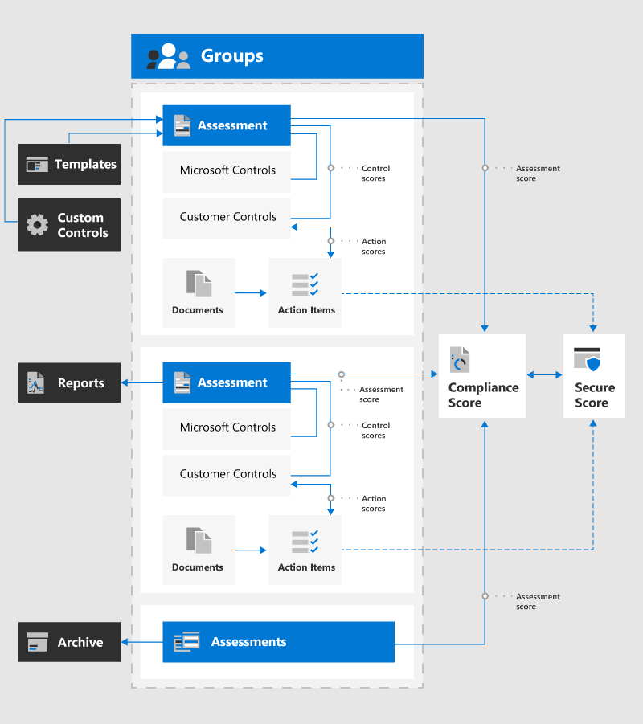
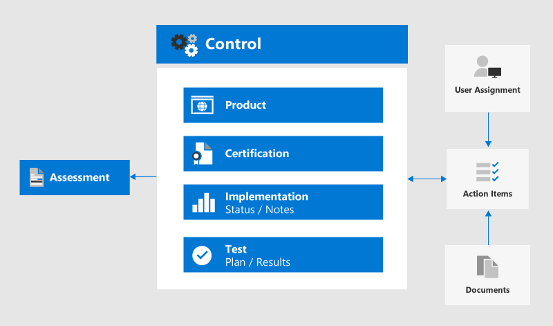

# Microsoft Compliance-Manager (Vorschau)Microsoft Compliance Manager (preview)

> [!IMPORTANT]
> Der Compliance-Manager ist nicht in Office 365, betrieben von 21Vianet, Office 365 Deutschland, Office 365 US Government Community High (GCC) High oder Office 365 Department of Defense verfügbar.Compliance Manager isn't available in Office 365 operated by 21Vianet, Office 365 Germany, Office 365 U.S. Government Community High (GCC High), or Office 365 Department of Defense.

**In diesem**Artikel erfahren Sie, was Compliance-Manager ist und welche Hauptkomponenten Sie kennen.**In this article**: Read this article to learn what Compliance Manager is and understand its main components.

**Erfahren Sie mehr über Updates**: Wir haben mehrere Updates im April 2020 Public Preview Release veröffentlicht.**Learn about updates**: We published several updates in the April 2020 public preview release. In den Versionshinweisen zu [Compliance-Manager](compliance-manager-release-notes.md) finden Sie Informationen zu neuen und bekannten Problemen.Visit the [Compliance Manager release notes](compliance-manager-release-notes.md) to see what's new and known issues.

## Was ist Compliance-Manager?What is Compliance Manager

Der [Microsoft Compliance-Manager (Preview)](https://servicetrust.microsoft.com/ComplianceManager) ist ein kostenloses Workflow basiertes Risiko Bewertungstool im Microsoft Service Trust-Portal zum Verwalten von behördlichen Compliance-Aktivitäten im Zusammenhang mit Microsoft Cloud Services.[Microsoft Compliance Manager (preview)](https://servicetrust.microsoft.com/ComplianceManager) is a free workflow-based risk assessment tool in the Microsoft Service Trust Portal for managing regulatory compliance activities related to Microsoft cloud services. Als Teil Ihres Microsoft 365-, Office 365-oder Azure Active Directory-Abonnements unterstützt Compliance Manager das Verwalten von behördlichen Vorschriften im Rahmen des Modells für die gemeinsame Verantwortung für Microsoft Cloud Services.Part of your Microsoft 365, Office 365, or Azure Active Directory subscription, Compliance Manager helps you manage regulatory compliance within the shared responsibility model for Microsoft cloud services.

Mit dem Compliance-Manager kann Ihre Organisation:With Compliance Manager, your organization can:
  
- Kombinieren detaillierter Compliance-Informationen von Microsoft für Auditoren und Regulatoren zu seinen Cloud-Diensten mit Ihrer Compliance-Selbsteinschätzung für Standards und Vorschriften, die für Ihre Organisation gelten.Combine detailed compliance information Microsoft provided to auditors and regulators about its cloud services with your compliance self-assessment for standards and regulations applicable for your organization. Dazu gehören Normen und Verordnungen, die von der internationalen Organisation für Normung (ISO), dem National Institute of Standards and Technology (NIST), der Krankenversicherung Portabilität und dem Accounting Act (HIPAA), der allgemeinen Datenschutzverordnung (dsgvo) und vielen anderen beschrieben werden.These include standards and regulations outlined by the International Organization for Standardization (ISO), the National Institute of Standards and Technology (NIST), the Health Insurance Portability and Accountability Act (HIPAA), the General Data Protection Regulation (GDPR), and many others.
- Ermöglicht Ihnen, Compliance-und bewertungsbezogene Aktivitäten zuzuweisen, nachzuverfolgen und zu erfassen, mit deren Hilfe Ihre Organisation Team Barrieren überwinden kann, um Ihre Compliance-Ziele zu erreichen.Enable you to assign, track, and record compliance and assessment-related activities, which can help your organization cross team barriers to achieve your compliance goals.
- Stellen Sie eine Konformitätsbewertung zur Verfügung, damit Sie Ihren Fortschritt nachverfolgen und Überwachungssteuerelemente priorisieren können, mit denen die Gefährdung Ihrer Organisation reduziert wird.Provide a Compliance Score to help you track your progress and prioritize auditing controls that help reduce your organization's exposure to risk.
- Stellen Sie ein sicheres Repository bereit, mit dem Sie Beweise und andere Artefakte im Zusammenhang mit ihren Compliance-Aktivitäten hochladen und verwalten können.Provide a secure repository for you to upload and manage evidence and other artifacts related to your compliance activities.
- Erstellen Sie ausführliche Microsoft Excel Berichte, in denen Compliance-Aktivitäten dokumentiert werden, die von Microsoft und Ihrer Organisation für Auditoren, Regulatoren und andere Konformitäts Prüfer ausgeführt wurden.Produce richly detailed Microsoft Excel reports that document compliance activities performed by Microsoft and your organization for auditors, regulators, and other compliance reviewers.

  
> [!IMPORTANT]
> Empfehlungen der Compliancebewertung und vom Compliance-Manager sollten nicht als eine Garantie für Compliance interpretiert werden.Recommendations from Compliance Score and Compliance Manager should not be interpreted as a guarantee of compliance. Es liegt an Ihnen, die Effektivität von Kunden Kontrollen pro ihrer regulatorischen Umgebung zu bewerten und zu validieren.It is up to you to evaluate and validate the effectiveness of customer controls per your regulatory environment. Diese Dienste befinden sich derzeit in der Vorschau und unterliegen den allgemeinen Geschäftsbedingungen in den [Online Dienstbedingungen](https://go.microsoft.com/fwlink/?linkid=2108910).These services are currently in preview and subject to the terms and conditions in the [Online Services Terms](https://go.microsoft.com/fwlink/?linkid=2108910). Siehe auch [Microsoft 365 Lizenzierung Leitfaden für Sicherheit und Compliance](https://docs.microsoft.com/office365/servicedescriptions/microsoft-365-service-descriptions/microsoft-365-tenantlevel-services-licensing-guidance/microsoft-365-security-compliance-licensing-guidance).See also [Microsoft 365 licensing guidance for security and compliance](https://docs.microsoft.com/office365/servicedescriptions/microsoft-365-service-descriptions/microsoft-365-tenantlevel-services-licensing-guidance/microsoft-365-security-compliance-licensing-guidance).

## Beziehung zur KonformitätsbewertungRelationship to Compliance Score

[Microsoft Compliance Score (Preview)](compliance-score.md) ist ein Feature im Microsoft 365 Compliance Center, das eine Ansicht auf oberster Ebene in der Compliance-Position Ihrer Organisation bereitstellt.[Microsoft Compliance Score (preview)](compliance-score.md) is a feature in the Microsoft 365 compliance center that provides a top-level view into your organization's compliance posture. Sie berechnet eine auf Risiken basierende Bewertung, die Ihren Fortschritt bei der Durchführung von Maßnahmen misst, mit denen sich Risiken hinsichtlich des Datenschutzes und regulatorischer Standards verringern lassen.It calculates a risk-based score measuring your progress in completing actions that help reduce risks around data protection and regulatory standards. Die Kenntnis ihrer allgemeinen Konformitätsbewertung hilft Ihrer Organisation, die Compliance zu verstehen und zu verwalten.Knowing your overall compliance score helps your organization understand and manage compliance. Grundlegendes [zur Berechnung der Konformitätsbewertung](compliance-score-methodology.md)Understand [how your compliance score is calculated](compliance-score-methodology.md).

Compliance-Manager teilt dasselbe Back-End mit Kompatibilitätsbewertung.Compliance Manager shares the same backend with Compliance Score. Während der öffentlichen Vorschauphase für beide Tools ist Compliance-Manager der Ort, an dem Sie Ihre Bewertungen und Implementierungen von benutzerdefinierten Steuerelementen verwalten.During the public preview phase for both tools, Compliance Manager is where you'll manage your assessments and custom control implementations. Erfahren Sie mehr über die [Beziehung zwischen Compliance Score und Compliance-Manager](compliance-score-release-notes.md#compliance-score-relationship-to-compliance-manager).Learn more about the [relationship between Compliance Score and Compliance Manager](compliance-score-release-notes.md#compliance-score-relationship-to-compliance-manager).

## Compliance-Manager-KomponentenCompliance Manager components

Compliance-Manager verwendet mehrere Komponenten, die Sie bei ihren Compliance-Verwaltungsaktivitäten unterstützen.Compliance Manager uses several components to help you with your compliance management activities. Diese Komponenten arbeiten zusammen, um einen vollständigen Verwaltungs Workflow und problemlose Kompatibilitätsberichte für Auditoren bereitzustellen.These components work together to provide a complete management work flow and hassle-free compliance reports for auditors.

Das Diagramm zeigt die Beziehungen zwischen den primären Komponenten von Compliance-Manager:The diagram shows the relationships between the primary components of Compliance Manager:

## GruppenGroups

[Gruppen](working-with-compliance-manager.md#groups) sind Container, die es Ihnen ermöglichen, Bewertungen zu organisieren und allgemeine Informations-und Workflowaufgaben Zwischenbewertungen mit denselben oder Verwandten, vom Kunden verwalteten Steuerelementen freizugeben.[Groups](working-with-compliance-manager.md#groups) are containers that allow you to organize Assessments and share common information and workflow tasks between Assessments that have the same or related customer-managed controls. Wenn zwei unterschiedliche Bewertungen in derselben Gruppe das vom Kunden verwaltete Steuerelement gemeinsam nutzen, wird der Abschluss der Implementierungsdetails, des Tests und des Status für das Steuerelement in allen anderen Bewertungen in der Gruppe automatisch mit dem gleichen Steuerelement synchronisiert.When two different Assessments in the same group share customer-managed control, the completion of implementation details, testing, and status for the control automatically synchronize to the same control in any other Assessment in the Group. Dadurch werden die zugewiesenen Aktionselemente für jedes Steuerelement in der gesamten Gruppe vereinheitlicht und Arbeits Duplikate reduziert.This unifies the assigned Action Items for each control across the group and reduces duplicating work. Sie können auch festlegen, dass Gruppen zum Organisieren verwendet werden.You can also choose to use groups to organize. Assessments nach Jahr, Bereich, Konformitäts Standard oder anderen Gruppierungen, die Ihnen bei der Organisation Ihrer Compliance-arbeiten helfen.Assessments by year, area, compliance standard, or other groupings to help organize your compliance work.

## BewertungenAssessments

Bei [Assessments](working-with-compliance-manager.md#assessments) handelt es sich um Container, mit denen Sie Steuerelemente basierend auf den Zuständigkeiten zwischen Microsoft und Ihrer Organisation für die Bewertung der Sicherheits-und Konformitätsrisiken von Cloud-Diensten organisieren können.[Assessments](working-with-compliance-manager.md#assessments) are containers that allow you to organize controls based on responsibilities shared between Microsoft and your organization for assessing cloud service security and compliance risks. Mithilfe von Assessments können Sie Datenschutzgarantien implementieren, die durch einen Compliance-Standard und entsprechende Datenschutzstandards, Verordnungen oder Gesetze festgelegt sind.Assessments help you implement data protection safeguards specified by a compliance standard and applicable data protection standards, regulations, or laws. Sie unterstützen Sie beim Erkennen Ihrer Datenschutz-und Compliance-Haltung gegenüber dem ausgewählten Industriestandard für den ausgewählten Microsoft Cloud-Dienst.They help you discern your data protection and compliance posture against the selected industry standard for the selected Microsoft cloud service. Die Bewertungen werden durch die Implementierung von Steuerelementen vervollständigt, die in der Bewertung enthalten sind, die einem Zertifizierungsstandard zugeordnet ist.Assessments are completed by the implementation of controls included in the Assessment that map to a certification standard.

Standardmäßig erstellt Compliance-Manager die folgenden Bewertungen für Ihre Organisation:By default, Compliance Manager creates the following Assessments for your organization:

- Office 365 ISO 27001Office 365 ISO 27001
- Office 365 NIST 800-53Office 365 NIST 800-53
- Office 365 dsgvoOffice 365 GDPR

Assessments weisen mehrere Komponenten auf:Assessments have several components:
  
- **In-Scope-Dienste**: jede Bewertung gilt für eine bestimmte Gruppe von Microsoft-Diensten.**In-Scope Services**: Each assessment applies to a specific set of Microsoft services.
- Von **Microsoft verwaltete Steuerelemente**: Microsoft implementiert und verwaltet für jeden clouddienst eine Reihe von Konformitätskontrollen für zutreffende Standards und Vorschriften.**Microsoft-managed controls**: For each cloud service, Microsoft implements and manages a set of compliance controls for applicable standards and regulations.
- Vom **Kunden verwaltete Steuerelemente**: diese Steuerelemente werden von Ihrer Organisation implementiert, wenn Sie für jedes Steuerelement Aktionen ausführen.**Customer-managed controls**: These controls are implemented by your organization when you take actions for each control.
- **Bewertungsfaktor**: der Prozentsatz der Gesamtpunktzahl für vom Kunden verwaltete Steuerelemente in der Bewertung.**Assessment Score**: The percentage of the total possible score for customer-managed controls in the Assessment. Auf diese Weise können Sie die Implementierung der jedem Steuerelement zugewiesenen Aktionen nachverfolgen.This helps you track the implementation of the Actions assigned to each control.

## SteuerelementeControls

[Steuerelemente](working-with-compliance-manager.md#controls-and-actions) sind Compliance-Prozesscontainer im Compliance-Manager, die definieren, wie Compliance-Aktivitäten verwaltet werden.[Controls](working-with-compliance-manager.md#controls-and-actions) are compliance process containers in Compliance Manager that define how you manage compliance activities. Diese Steuerelemente sind in Steuerelementfamilien organisiert, die mit der Bewertungsstruktur für entsprechende Zertifizierungen oder Verordnungen übereinstimmen.These controls are organized into control families that align with the Assessment structure for corresponding certifications or regulations.

- **Steuerelement-ID**: der Name des ausgewählten Steuerelements aus der entsprechenden Zertifizierung oder Verordnung.**Control ID**: The name of the selected control from the corresponding certification or regulation.
- **Steuerelement Titel**: der Titel für die Steuerelement-ID aus der entsprechenden Zertifizierung oder Verordnung.**Control Title**: The title for the Control ID from the corresponding certification or regulation.
- **Artikel-ID**: Dieses Feld ist nur für dsgvo-Bewertungen und gibt die entsprechende dsgvo-Artikelnummer an.**Article ID**: This field is only for GDPR assessments and specifies the corresponding GDPR article number.
- **Description**: Text of Control aus der entsprechenden Zertifizierung oder Verordnung.**Description**: Text of control from the corresponding certification or regulation. Aufgrund von Copyright-Einschränkungen wird ein Link zu relevanten Informationen für ISO-Standards aufgeführt.Due to copyright restrictions, a link to relevant information is listed for ISO standards.

Es gibt drei Arten von Steuerelementen im Compliance-Manager, von **Microsoft verwaltete Steuer**Elemente, von **Kunden verwalteten**Steuerelementen und von Steuerelementen für die **gemeinsame Verwaltung**.There are three types of controls in Compliance Manager, **Microsoft-managed controls**, **customer-managed controls**, and **Shared management controls**.

### Von Microsoft verwaltete SteuerelementeMicrosoft-managed controls

Für jeden clouddienst implementiert und verwaltet Microsoft eine Reihe von Steuerelementen im Rahmen der Einhaltung verschiedener Standards und Bestimmungen von Microsoft.For each cloud service, Microsoft implements and manages a set of controls as part of Microsoft's compliance with various standards and regulations. Jedes Steuerelement enthält Details darüber, wie Microsoft das Steuerelement implementiert hat und wie und wann diese Implementierung von Microsoft und/oder von einem unabhängigen Drittanbieter Prüfer getestet und validiert wurde.Each control provides details about how Microsoft implemented the control, and how and when that implementation was tested and validated by Microsoft and/or by an independent third-party auditor.

### Vom Kunden verwaltete SteuerelementeCustomer-managed controls

Vom Kunden verwaltete Steuerelemente werden von Ihrer Organisation verwaltet.Customer-managed controls are managed by your organization. Ihre Organisation ist für die Implementierung durch das Kunden verwaltete Steuerelement im Rahmen Ihres Konformitäts Prozesses für einen bestimmten Standard oder eine bestimmte Richtlinie verantwortlich.Your organization is responsible for customer-managed control implementation as part of your compliance process for a given standard or regulation. Von Kunden verwaltete Steuerelemente werden in Kontroll Familien für die entsprechende Zertifizierung oder Regulierung organisiert.Customer-managed controls are organized into control families for the corresponding certification or regulation. Verwenden Sie die von Kunden verwalteten Steuerelemente, um die empfohlenen Aktionen zu implementieren, die von Microsoft als Teil Ihrer Compliance-Aktivitäten vorgeschlagen werden.Use the customer-managed controls to implement the recommended actions suggested by Microsoft as part of your compliance activities. Ihre Organisation kann die normativen Anleitungen und empfohlenen Kundenaktionen in jeder vom Kunden verwalteten Steuerung verwenden, um den Implementierungs-und Bewertungsprozess für dieses Steuerelement zu verwalten.Your organization can use the prescriptive guidance and recommended customer actions in each customer-managed control to manage the implementation and assessment process for that control.

Kunden verwaltete Steuerelemente in Assessments verfügen außerdem über integrierte Workflow Verwaltungsfunktionen, mit deren Hilfe Sie den Fortschritt der Abschlussprüfung verwalten und nachverfolgen können.Customer-managed controls in Assessments also have built-in workflow management functionality that you can use to manage and track your progress towards Assessment completion. Mit dieser Workflow Funktionalität haben Sie folgende Möglichkeiten:With this workflow functionality, you can:

- Zuweisen von Aktionselementen für jedes SteuerelementAssign Action Items for each control
- Nachverfolgen von zugewiesenen AktionselementenTrack assigned Action Items
- Hochladen von Beweisen für die Implementierung des SteuerelementsUpload evidence of the implementation of the control
- Dokumentieren des Tests und der Überprüfung des SteuerelementsDocument the testing and validation of the control
- Die Aktionselemente als implementiert und getestet markierenMark the Action Items as implemented and tested

Beispielsweise weist ein Compliance Officer in Ihrer Organisation einem IT-Administrator ein Aktionselement zu, in dem die erforderlichen Berechtigungen zum Ausführen der empfohlenen Aktion erforderlich sind.For example, a Compliance Officer in your organization assigns an Action Item to an IT admin with the responsibility and necessary permissions to perform the recommended action. Der IT-Administrator lädt den Nachweis der Implementierungsaufgaben (Screenshots von Konfigurations-oder Richtlinieneinstellungen) und weist das Aktionselement dem Compliance Officer zurück, wenn es abgeschlossen ist.The IT admin uploads evidence of the implementation tasks (screenshots of configuration or policy settings) and assigns the Action Item back to the Compliance Officer when completed. Der Compliance Officer wertet den gesammelten Beweis aus, testet die Implementierung des Steuerelements und zeichnet das Implementierungsdatum und die Testergebnisse im Compliance-Manager auf.The Compliance Officer evaluates the collected evidence, tests the implementation of the control, and records the implementation date and test results in Compliance Manager.

### Gemeinsame VerwaltungssteuerelementeShared management controls

Ein freigegebenes Steuerelement bezieht sich auf ein beliebiges Steuerelement, bei dem Microsoft und Kunden beide Aufgaben für die Implementierung teilenA shared control refers to any control where Microsoft and customers both share responsibilities for implementation. Beispielsweise erfordern Steuerelemente im Zusammenhang mit der Personal Prüfung, der Konto-und Kennwortverwaltung sowie der Verschlüsselung Aktionen sowohl von Microsoft als auch von Kunden.For example, controls related to personnel screening, account and password management, and encryption require actions by both Microsoft and customers.

## AktionselementeAction Items

[Aktionen Elemente](working-with-compliance-manager.md#controls-and-actions) sind in vom Kunden verwalteten Steuerelementen als Teil der integrierten Workflow Verwaltungsfunktionen enthalten, die Sie zum Verwalten und Nachverfolgen des Fortschritts für den Abschluss der Bewertung verwenden können.[Actions Items](working-with-compliance-manager.md#controls-and-actions) are included in customer-managed controls as part of the built-in workflow management functionality that you can use to manage and track your progress towards Assessment completion.

Personen in Ihrer Organisation können den Compliance-Manager verwenden, um die vom Kunden verwalteten Steuerelemente aus allen Bewertungen zu überprüfen, denen Sie zugewiesen sind.People in your organization can use Compliance Manager to review the customer-managed controls from all Assessments for which they're assigned. Wenn ein Benutzer sich beim Compliance-Manager anmeldet und das **Aktionselemente**-Dashboard öffnet, wird eine Liste der ihm zugewiesenen Aktionselemente angezeigt.When a user signs in to Compliance Manager and opens the **Action Items** dashboard, a list of Action Items assigned to them is displayed. Je nach der Compliance-Manager-Rolle, die dem Benutzer zugewiesen wurde, kann er Implementierungs- oder Testdetails bereitstellen, den Status hochladen oder Aktionselemente zuweisen.Depending on the Compliance Manager role assigned to the user, they can provide implementation or test details, update the Status, or assign Action Items.

Zertifizierungs Steuerelemente werden in der Regel von einer Person implementiert und von einer anderen getestet.Certification controls are typically implemented by one person and tested by another. Wenn beispielsweise Aktionselemente, die anfänglich einer Person zugewiesen wurden, für die Implementierung abgeschlossen sind, werden diese Aktionselemente der nächsten Person zugewiesen, um Beweise zu testen und hochzuladen.For example, after Action Items initially assigned to one person for implementation are completed, those Action Items are assigned to the next person to test and upload evidence. Jeder Benutzer mit ausreichenden Berechtigungen für Steuerelement Zuweisungen kann Aktionselemente zuweisen und neu zuweisen.Any user with sufficient permissions for control assignments can assign and reassign Action Items. Dies ermöglicht eine zentrale Verwaltung von Steuerungs Zuweisungen und das dezentrale Routing von Aktionselementen zwischen Implementierern und Testern.This enables central management of control assignments and decentralized routing of Action Items between implementors and testers.

Beachten Sie, dass **Verbesserungs Aktionen** im Kompatibilitäts Bewertungsergebnis das Äquivalent von **Aktionselementen** im Compliance-Manager sind.Note that **Improvement actions** in Compliance Score are the equivalent of **Action Items** in Compliance Manager.

## BerechtigungenPermissions

Compliance-Manager verwendet ein Berechtigungsmodell der rollenbasierten Zugriffssteuerung.Compliance Manager uses a role-based access control permission model. Nur Benutzer, denen eine Benutzerrolle zugewiesen ist, können auf Compliance-Manager zugreifen, und welche Aktionen ein Benutzer ausführen darf, wird durch den jeweiligen Rollentyp eingeschränkt.Only users who are assigned a user role may access Compliance Manager, and the actions allowed by each user are restricted by role type. Zeigt [eine Tabelle](working-with-compliance-manager.md#permissions) mit den für jede Berechtigung zulässigen Aktionen an.[View a table](working-with-compliance-manager.md#permissions) showing the actions allowed for each permission.

Der Portaladministrator für Compliance-Manager kann die Berechtigungen für andere Benutzer im Compliance-Manager festlegen, indem Sie die folgenden Schritte ausführen:The portal admin for Compliance Manager can set permissions for other users in within Compliance Manager by following these steps:

1. Wählen Sie im Dropdownmenü Top **more** die Option **Admin**und dann **Settings**aus.From the top **More** drop-down menu, select **Admin**, then **Settings**.
2. Wählen Sie hier die Rolle aus, die Sie zuweisen möchten, und fügen Sie dann den Mitarbeiter hinzu, den Sie dieser Rolle zuweisen möchten.From here, select the role you want to assign, and then add the employee you want to assign to that role. Die Benutzer können dann bestimmte Aktionen ausführen.Users will then be able to perform certain actions.

Benutzer, denen die [globale Leserrolle in Azure Active Directory (Azure AD)](https://docs.microsoft.com/azure/active-directory/users-groups-roles/directory-assign-admin-roles#global-reader) zugewiesen ist, verfügen über eine schreibgeschützte Berechtigung für den Zugriff auf den Compliance-Manager.Users who are assigned the [Global Reader role in Azure Active Directory (Azure AD)](https://docs.microsoft.com/azure/active-directory/users-groups-roles/directory-assign-admin-roles#global-reader) have read-only permission to access Compliance Manager. Sie können jedoch keine Daten bearbeiten oder Aktionen im Compliance-Manager durchführen.However, they cannot edit data or perform any actions within Compliance Manager.

Es gibt keine standardmäßige **Gastzugriffs** Rolle mehr.There is no longer a default **Guest access** role. Jedem Benutzer muss eine Rolle zugewiesen werden, damit er auf Compliance-Manager zugreifen und darin arbeiten kann.Each user must be assigned a role in order to access and work within Compliance Manager.
  
## Verwalten von beweisenManage evidence

Compliance-Manager kann Beweise für Ihre Implementierungsaufgaben zum Testen und zur Validierung von von Kunden verwalteten Steuerelementen speichern.Compliance Manager can store evidence of your implementation tasks around testing and validation of customer-managed controls. Evidence enthält Dokumente, Tabellenkalkulationen, Screenshots, Bilder, Skripts, Skriptausgabe Dateien und andere Dateien.Evidence includes documents, spreadsheets, screenshots, images, scripts, script output files, and other files. Compliance-Manager erhält auch automatisch Telemetrie und erstellt einen Evidence Record für Aktionselemente, die mit Secure Score integriert sind.Compliance Manager also automatically receives telemetry and creates an evidence record for Action Items that are integrated with Secure Score. Alle Daten, die als Beweismaterial in den Compliance-Manager hochgeladen wurden, werden in den USA auf Microsoft-Cloud-Speicher Standorten gespeichert.Any data uploaded as evidence into Compliance Manager is stored in the United States on Microsoft Cloud Storage sites. Diese Daten werden in Azure-Regionen in Südostasien und Westeuropa repliziert.This data is replicated across Azure regions located in Southeast Asia and Western Europe.

## VorlagenTemplates

Compliance-Manager stellt vorkonfigurierte [Vorlagen](working-with-compliance-manager.md#templates) für Bewertungen bereit und ermöglicht es Ihnen, angepasste Vorlagen für von Kunden verwaltete Steuerelemente für Ihre Compliance-Anforderungen zu erstellen.Compliance Manager provides pre-configured [templates](working-with-compliance-manager.md#templates) for Assessments and allows you to create customized templates for customer-managed controls for your compliance needs. Neue Vorlagen werden erstellt, indem Steuerelementinformationen aus einer Excel-Datei importiert werden, oder Sie können eine Vorlage aus einer Kopie einer vorhandenen Vorlage erstellen.New templates are created by importing controls information from an Excel file, or you can create a template from a copy of an existing template.

Die vorkonfigurierten Vorlagen lauten wie folgt:The pre-configured templates are:

1. [Brasilien – allgemeine Datenschutz Gesetze (LGPD)Brazil General Data Protection Law (LGPD)](https://go.microsoft.com/fwlink/?linkid=2115387)
2. [California Consumer Privacy Act (CCPA)](https://go.microsoft.com/fwlink/?linkid=2108871) (Vorschau)[California Consumer Privacy Act (CCPA)](https://go.microsoft.com/fwlink/?linkid=2108871) (preview)
3. [Cloud Security Alliance (CSA) Cloud Controls Matrix (CCM) 3.0.1Cloud Security Alliance (CSA) Cloud Controls Matrix (CCM) 3.0.1](https://go.microsoft.com/fwlink/?linkid=2109076)
4. [Dubai Information Security Resolution (DGISR)Dubai Information Security Resolution (DGISR)](https://go.microsoft.com/fwlink/?linkid=2131193)
5. [Dsgvo der Europäischen UnionEuropean Union GDPR](https://go.microsoft.com/fwlink/?linkid=2108870)
6. [Federal Financial Institutions Examination Council (FFIEC) Information Security BookletFederal Financial Institutions Examination Council (FFIEC) Information Security Booklet](https://go.microsoft.com/fwlink/?linkid=2109077)
7. [FedRAMP moderatFedRAMP Moderate](https://go.microsoft.com/fwlink/?linkid=2108869)
8. [HIPAA](https://go.microsoft.com/fwlink/?linkid=2109078)  /  [HITECH](https://go.microsoft.com/fwlink/?linkid=2109079)[HIPAA](https://go.microsoft.com/fwlink/?linkid=2109078) / [HITECH](https://go.microsoft.com/fwlink/?linkid=2109079)
9. [IRAP](https://go.microsoft.com/fwlink/?linkid=2113709)  /  [Australische Regierung ISM](https://go.microsoft.com/fwlink/?linkid=2113024) (Vorschau)[IRAP](https://go.microsoft.com/fwlink/?linkid=2113709) / [Australian Government ISM](https://go.microsoft.com/fwlink/?linkid=2113024) (preview)
10. [ISO 27001:2013ISO 27001:2013](https://go.microsoft.com/fwlink/?linkid=2109073)
11. [ISO 27018:2014ISO 27018:2014](https://go.microsoft.com/fwlink/?linkid=2109074)
12. [ISO 27701:2019ISO 27701:2019](https://go.microsoft.com/fwlink/?linkid=2113025)
13. [Microsoft 365-Datenschutz BasisMicrosoft 365 Data Protection Baseline](compliance-score-methodology.md#initial-score-based-on-microsoft-365-data-protection-baseline)
14. [NIST 800-53 Rev. 4NIST 800-53 Rev. 4](https://go.microsoft.com/fwlink/?linkid=2109075)
15. [NIST 800-171NIST 800-171](https://go.microsoft.com/fwlink/?linkid=2108867)
16. [NIST-Cyber-Framework (CSF)NIST Cybersecurity Framework (CSF)](https://go.microsoft.com/fwlink/?linkid=2108868)
17. [SOC 1SOC 1](https://go.microsoft.com/fwlink/?linkid=2115184)
18. [SOC 2SOC 2](https://go.microsoft.com/fwlink/?linkid=2115184)

## Integration von Secure ScoreSecure Score integration

Compliance-Manager ist in [Microsoft Secure Score](../security/mtp/microsoft-secure-score.md) integriert, um den Kompatibilitäts Bewertungs Wert für synchronisierte Aktionselemente automatisch mit einem sicheren Bewertungs Guthaben zu versehen.Compliance Manager is integrated with [Microsoft Secure Score](../security/mtp/microsoft-secure-score.md) to automatically apply Secure Score credit to the Compliance Score for synced Action Items. Dies ist für einzelne Aktionselemente oder alle Aktionen Global konfigurierbar und stellt Aktualisierungen von Secure Score zur Verfügung.This is configurable for individual Action Items or all actions globally, and provides updates from Secure Score.

Sie haben beispielsweise eine sicherheitsbezogene Anforderung zum Aktivieren der Azure-Rechteverwaltung in Ihrer Organisation, die auch für ein Compliance-bezogenes Aktionselement gilt.For example, you have a security-related requirement for activating Azure Rights Management in your organization that also applies to a compliance-related Action Item. Wenn Azure Rights Management aktiviert und von Secure Score verarbeitet wird, erhält Compliance-Manager eine Benachrichtigung über das Update, und die Bewertung für das Aktionselement wird automatisch mit Abschluss Kredit aktualisiert.When Azure Rights Management is activated and processed by Secure Score, Compliance Manager receives notification of the update, and the score for the Action Item automatically updates with completion credit.

## Sind Sie bereit zu beginnen?Ready to get started?

Beginnen Sie [mit der Zusammenarbeit mit Compliance-Manager](working-with-compliance-manager.md) , um behördliche Compliance-Aktivitäten für Ihre Organisation zu verwalten.Start [working with Compliance Manager](working-with-compliance-manager.md) to manage regulatory compliance activities for your organization.

## RessourcenResources

- [Interaktiver Leitfaden: bewerten und verbessern der Datenschutz Steuerung mit Compliance-ManagerInteractive guide: Assess and enhance your data protection controls with Compliance Manager](https://content.cloudguides.com/guides/Compliance%20Manager)
- [Microsoft-Sicherheits-, Datenschutz-und Compliance-Tech-CommunityMicrosoft Security, Privacy, and Compliance Tech Community](https://techcommunity.microsoft.com/t5/Security-Privacy-Compliance/ct-p/SecurityPrivacyCompliance)