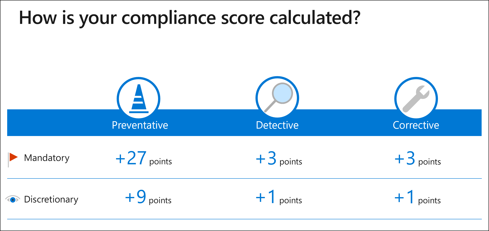

# Arbeiten mit Bewertungsvorlagen im Compliance-Manager

**In diesem Artikel:** Erfahren **Sie, wie Vorlagen funktionieren** und wie Sie sie auf der Seite "Bewertungsvorlagen" **verwalten.** Hier erhalten Sie Anweisungen zum **Erstellen** neuer Vorlagen, **Erweitern** und **Ändern vorhandener** Vorlagen, **Zum Formatieren von Vorlagendaten mit Excel** und Exportieren von **Vorlagenberichten.**

> [!IMPORTANT]
> Welche Bewertungsvorlagen für Ihre Organisation verfügbar sind, hängt von Ihrem Lizenzvertrag ab. [Überprüfen Sie die Details.](/office365/servicedescriptions/microsoft-365-service-descriptions/microsoft-365-tenantlevel-services-licensing-guidance/microsoft-365-security-compliance-licensing-guidance)

## Vorlagen (Übersicht)

Eine Vorlage ist ein Rahmen von Steuerelementen zum Erstellen einer Bewertung im Compliance-Manager. Unser umfassender Vorlagensatz kann Ihrer Organisation helfen, nationale, regionale und branchenspezifische Anforderungen hinsichtlich der Erfassung und Verwendung von Daten zu erfüllen. Wir verweisen auf Vorlagen mit demselben Namen wie die zugrunde liegende Zertifizierung oder Verordnung, z. B. die EU-DSGVO-Vorlage und die ISO/IEC 27701:2019-Vorlage. Da Der Compliance-Manager zum Bewerten verschiedener Produkttypen verwendet werden kann, gibt es für jede Vorlage zwei Versionen: eine, die für Microsoft 365 gilt, und eine universelle Version, die an Ihr ausgewähltes Produkt angepasst werden kann.

## Verfügbarkeit und Lizenzierung von Vorlagen

Die zur Verwendung verfügbaren Vorlagen basieren auf dem Lizenzvertrag Ihrer Organisation ([Details zur Lizenzierung anzeigen).](/office365/servicedescriptions/microsoft-365-service-descriptions/microsoft-365-tenantlevel-services-licensing-guidance/microsoft-365-security-compliance-licensing-guidance#compliance-manager) Es gibt zwei Kategorien von Vorlagen: enthalten und Premium.

#### Enthaltene vorlagen und Premiumvorlagen

1. **Eingeschlossene Vorlagen** werden von Ihrer Lizenz gewährt und umfassen wichtige Bestimmungen und Anforderungen.
2. **Premium Vorlagen** können erworben werden, um Ihre Bibliothek zu erweitern und bestimmte Anforderungen zu erfüllen. Nach dem Kauf können Sie beliebig viele Bewertungen aus einer Vorlage erstellen. [Erfahren Sie, wie Sie Premiumvorlagen erwerben können.](/office365/servicedescriptions/microsoft-365-service-descriptions/microsoft-365-tenantlevel-services-licensing-guidance/microsoft-365-security-compliance-licensing-guidance#compliance-manager)

Zeigen Sie die [vollständige Liste der Vorlagen an.](compliance-manager-templates-list.md)

#### Aktive und inaktive Vorlagen

Vorlagen zeigen den Aktivierungsstatus entweder als aktiv oder inaktiv an:

- Eine Vorlage wird als **aktiv** betrachtet, nachdem Sie eine Bewertung anhand dieser Vorlage erstellt haben.
- Eine Vorlage wird als **inaktiv** betrachtet, wenn Ihre Organisation sie nicht für eine Bewertung verwendet.

Wenn Sie Bewertungen mit einer gekauften Premiumvorlage verknüpfen, ist diese Vorlage ein Jahr lang aktiv. Ihr Kauf wird automatisch verlängert, es sei denn, Sie kündigen.

Sie können Premiumvorlagen auch als Testversion testen. Testlizenzen eignen sich für bis zu 25 Vorlagen für 30 Tage. Sobald Ihre Testversion beginnt, sollten die Vorlagen innerhalb von 48 Stunden in Ihrem Mandanten verfügbar sein. Testversionen können über die Microsoft 365 Admin Center aktiviert werden.

#### Aktivierter Vorlagenzähler

Die Seite "Bewertungsseite" und "Bewertungsvorlagen" weisen oben einen **aktivierten Vorlagenzähler** auf. Der Indikator zeigt die Anzahl der verwendeten Vorlagen von der Anzahl an, die Sie gemäß Ihrem Lizenzvertrag verwenden können. Die Verwendung von Vorlagen wird auf Zertifizierungsebene gezählt.

Wenn Ihr Zähler beispielsweise 2/5 anzeigt, bedeutet dies, dass Ihre Organisation 2 Vorlagen von 5 aktiviert hat, die zur Verwendung verfügbar sind.

Wenn Ihr Zähler 5/2 anzeigt, bedeutet dies, dass Ihre Organisation ihre Grenzen überschreitet und 3 der verwendeten Premiumvorlagen erwerben muss.

Microsoft 365 und universelle Versionen von Vorlagen verfügen über eine gemeinsame Lizenzierung, sodass Sie dieselbe zugrunde liegende Zertifizierung für mehrere Produkte verwenden können. Die Verwendung einer oder beider Versionen derselben Vorlage zählt nur als eine aktivierte Vorlage.

Weitere Informationen finden Sie unter [Compliance-Manager-Lizenzierungsleitfaden.](/office365/servicedescriptions/microsoft-365-service-descriptions/microsoft-365-tenantlevel-services-licensing-guidance/microsoft-365-security-compliance-licensing-guidance#compliance-manager)

## Anzeigen und Verwalten von Vorlagen

Auf der Seite "Bewertungsvorlagen" im Compliance-Manager werden eine Liste der Vorlagen und wichtige Details zu den Vorlagen angezeigt. Die Liste enthält Vorlagen, die vom Compliance-Manager bereitgestellt werden, sowie alle Vorlagen, die Ihre Organisation geändert oder erstellt hat. Sie können Filter anwenden, um eine Vorlage basierend auf Zertifizierung, Produktbereich, Land, Branche, wer sie erstellt hat und ob die Vorlage für die Erstellung von Bewertungen aktiviert ist, zu suchen.

Wählen Sie eine Vorlage aus der Zeile aus, um die Detailseite aufzurufen. Diese Seite enthält eine Beschreibung der Vorlage und weitere Informationen zu Zertifizierungs-, Bereichs- und Steuerelementdetails. Auf dieser Seite können Sie die entsprechenden Schaltflächen auswählen, um eine Bewertung zu erstellen, die Vorlagendaten in Excel zu exportieren oder die Vorlage zu ändern.

## Formatieren von Vorlagendaten mit Excel

Die zum Erstellen oder Ändern von Vorlagen verwendete Excel-Kalkulationstabelle ([Beispiel herunterladen)](https://go.microsoft.com/fwlink/?linkid=2124865)weist ein bestimmtes Format und Schema auf, das verwendet werden muss, um sie korrekt in compliance-Manager zu importieren. Sie enthält vier Registerkarten, von denen drei erforderlich sind:

1. [Vorlage](#template-tab) (erforderlich)
2. [ControlFamily](#controlfamily-tab) (erforderlich)
3. [Aktionen](#actions-tab) (erforderlich)
4. [Dimensionen](#dimensions-tab) (optional)

Beim Ausfüllen der Tabellenkalkulation mit Vorlagendaten muss die Tabelle **die Registerkarten in der oben aufgeführten Reihenfolge enthalten,** andernfalls werden Ihre Daten nicht erfolgreich in eine Vorlage importiert.

##### Registerkarte "Vorlage"

Die Registerkarte **"Vorlage"** ist erforderlich. Die Informationen auf dieser Registerkarte enthalten Metadaten zur Vorlage. Es gibt vier erforderliche Spalten. Die Spalten müssen die Reihenfolge auf dem Excel Blatt beibehalten, wie unten aufgeführt. Sie können **nach** den vier Spalten eine eigene Spalte hinzufügen, um Ihre eigenen Dimensionen bereitzustellen. Wenn Sie dies tun, müssen Sie sie der Registerkarte **Dimensionen** hinzufügen.

- **title:** Dies ist der Titel für Ihre Vorlage, der eindeutig sein muss. Sie kann keinen Namen für eine andere Vorlage im Compliance-Manager freigeben, einschließlich Ihrer eigenen Vorlagen oder einer Compliance-Manager-Vorlage.

- **produkt:** Dies ist eine erforderliche Dimension. Listet das der Vorlage zugeordnete Produkt auf.

- **Zertifizierung:** Dies ist die Verordnung, die Sie für die Vorlage verwenden.

- **inScopeServices:** Dies sind die Dienste innerhalb des Produkts, die in dieser Bewertung behandelt werden (wenn Sie z. B. Office 365 als Produkt aufgeführt haben, kann Microsoft Teams ein In-Scope-Dienst sein). Sie können mehrere Dienste durch zwei Semikolons getrennt auflisten.

> [!NOTE]
> Die Daten, die Sie in die **Produkt-** und **Zertifizierungszellen** einfügen, können nach dem Importieren der Kalkulationstabelle nicht bearbeitet werden, um eine Vorlage zu erstellen oder anzupassen. Außerdem kann eine Gruppe nicht zwei Bewertungen mit derselben **Produkt-/Zertifizierungskombination** enthalten. Sie können mehrere Vorlagen mit derselben Produkt-/Zertifizierungskombination haben.

##### Registerkarte "ControlFamily"

Die Registerkarte **"ControlFamily"** ist erforderlich.  Die erforderlichen Spalten auf dieser Registerkarte, die der in der Beispieltabelle angegebenen Reihenfolge entsprechen müssen, sind:

- **controlName:** Dies ist der Steuerelementname aus der Zertifizierung, standard oder Verordnung, die in der Regel eine Art von ID ist. Steuerelementnamen müssen innerhalb einer Vorlage eindeutig sein. Es können nicht mehrere Steuerelemente mit demselben Namen in der Tabelle vorhanden sein.

- **controlFamily**: Geben Sie ein Wort oder einen Ausdruck für controlFamily an, das eine allgemeine Gruppierung von Steuerelementen identifiziert. Eine controlFamily muss nicht eindeutig sein; er kann mehrmals in einer Kalkulationstabelle aufgeführt werden. Die gleiche controlFamily kann auch in mehreren Vorlagen aufgelistet werden, obwohl sie keine Beziehung zueinander haben. Jede controlFamily muss mindestens einem Steuerelement zugeordnet werden.

- **controlTitle:** Geben Sie einen Titel für das Steuerelement an. Während es sich bei "controlName" um einen Referenzcode handelt, handelt es sich bei dem Titel um ein Rich-Text-Format, das in der Regel in den Bestimmungen zu sehen ist.

- **controlDescription:** Geben Sie eine Beschreibung des Steuerelements an.

- **controlActionTitle:** Dies ist der Titel einer Aktion, die Sie mit diesem Steuerelement verknüpfen möchten. Sie können mehrere Aktionen hinzufügen, indem Sie zwei Semikolons ohne Leerzeichen dazwischen trennen. Jedes von Ihnen aufgelistete Steuerelement muss mindestens eine Aktion enthalten, und die Aktion muss vorhanden sein (d. h., Sie können eine Aktion auf der Registerkarte **"Aktionen"** derselben Tabelle auflisten, eine Aktion, die in einer anderen Vorlage vorhanden ist, oder eine von Microsoft erstellte Aktion). Unterschiedliche Steuerelemente können auf dieselbe Aktion verweisen.

##### Registerkarte "Aktionen"

Die Registerkarte **"Aktionen"** ist erforderlich.  Sie bezeichnet Verbesserungsmaßnahmen, die von Ihrer Organisation verwaltet werden, und nicht die von Microsoft, die bereits im Compliance-Manager vorhanden sind. Die erforderlichen Spalten für diese Registerkarte, die der in der Beispieltabelle angegebenen Reihenfolge entsprechen müssen, sind:

- **actionTitle**: Dies ist der Titel für Ihre Aktion und ein erforderliches Feld. Der von Ihnen bereitgestellte Titel muss eindeutig sein. **Wichtig:** Wenn Sie auf eine bereits vorhandene Aktion verweisen (z. B. in einer anderen Vorlage), und Sie die Elemente in den nachfolgenden Spalten ändern, werden diese Änderungen an dieselbe Aktion in anderen Vorlagen verteilt.

- **implementationType:** Listen Sie in diesem erforderlichen Feld einen der drei folgenden Implementierungstypen auf:
    - **Betriebsbereit** – Von Personen und Prozessen implementierte Aktionen zum Schutz der Vertraulichkeit, Integrität und Verfügbarkeit von Organisationssystemen, Ressourcen, Daten und Mitarbeitern (Beispiel: Sicherheitsbewusstsein und -schulung)
    - **Technische** – Aktionen, die mithilfe von Technologien und Mechanismen abgeschlossen werden, die in den Hardware-, Software- oder Firmwarekomponenten des Informationssystems enthalten sind, um die Vertraulichkeit, Integrität und Verfügbarkeit von Organisationssystemen und Daten zu schützen (Beispiel: mehrstufige Authentifizierung)
    - **Dokumentation** – Aktionen, die durch dokumentierte Richtlinien und Verfahren implementiert werden, um die zum Schutz der Vertraulichkeit, Integrität und Verfügbarkeit von Organisationssystemen, Ressourcen, Daten und Mitarbeitern erforderlichen Kontrollen einzurichten und zu definieren (Beispiel: eine Informationssicherheitsrichtlinie)

- **actionScore:** Geben Sie in diesem erforderlichen Feld einen numerischen Scorewert für Ihre Aktion an. Der Wert muss eine ganze Zahl zwischen 1 und 99 sein. er darf nicht 0, null oder leer sein. Je höher die Zahl, desto größer ist ihr Wert für die Verbesserung Ihres Compliancestatus. Die folgende Abbildung zeigt, wie Compliance-Manager Steuerelemente bewertet:

  

- **actionDescriptionTitle:** Dies ist der Titel der Beschreibung und erforderlich. Mit diesem Beschreibungstitel können Sie dieselbe Aktion in mehreren Vorlagen ausführen und in jeder Vorlage eine andere Beschreibung anzeigen.  Dieses Feld hilft Ihnen zu erläutern, auf welche Vorlage die Beschreibung verweist. In den meisten Fällen können Sie den Namen der Vorlage, die Sie erstellen, in dieses Feld einfügen.

- **actionDescription:** Geben Sie eine Beschreibung der Aktion an. Sie können Formatierungen wie Fetttext und Hyperlinks anwenden. Dieses Feld ist erforderlich.

- **Dimension-Aktionszweck:** Dies ist ein optionales Feld. Wenn Sie es einschließen, muss der Header das Präfix "dimension-" enthalten. Alle Dimensionen, die Sie hier einschließen, werden als Filter im Compliance-Manager verwendet und auf der Detailseite zu Verbesserungsmaßnahmen im Compliance-Manager angezeigt.

##### Registerkarte "Dimensionen"

Die Registerkarte **"Dimensionen"** ist optional. Wenn Sie jedoch an anderer Stelle auf eine Dimension verweisen, müssen Sie sie hier angeben, wenn sie nicht in einer Vorlage vorhanden ist, die Sie bereits erstellt haben, oder in einer Microsoft-Vorlage. Die Spalten für diese Registerkarte sind unten aufgeführt:

- **dimensionKey**: list as "product", "certifications", "action purpose"
- **dimensionValue**: Beispiele: Office 365, CUBEA, Preventative, Detective

Wenn Sie eine vorhandene Vorlage exportieren, verfügt die exportierte Kalkulationstabelle über die Registerkarte Dimensionen , die alle in der Vorlage verwendeten Dimensionen auflistet. 

## Erstellen einer Bewertungsvorlage

Um Eine eigene neue Vorlage für benutzerdefinierte Bewertungen zu erstellen, verwenden Sie Ihre speziell formatierte Excel-Kalkulationstabelle, um die erforderlichen Steuerelementdaten zusammenzustellen. Nach Abschluss des Arbeitsblatts importieren Sie es in compliance-Manager.

#### Erforderliche Rollen

Nur Benutzer mit einer Rolle "Globaler Administrator" oder "Compliance-Manager-Verwaltungsrolle" können Vorlagen erstellen und ändern. Erfahren Sie mehr über [Rollen und Berechtigungen.](compliance-manager-setup.md#set-user-permissions-and-assign-roles)

### Erstellen einer neuen Vorlage im Compliance-Manager

1. Wechseln Sie zur Seite **"Bewertungsvorlagen"** im Compliance-Manager.
2. Wählen Sie **"Neue Vorlage erstellen"** aus. Ein Vorlagenerstellungs-Assistent wird geöffnet.
3. Wählen Sie den Typ der Vorlage aus, die Sie erstellen möchten. Wählen Sie in diesem Fall **"Benutzerdefinierte Vorlage erstellen"** und dann **"Weiter"** aus.
4. Wählen Sie auf dem **Hochladen Dateibildschirm** **"Durchsuchen"** aus, um die formatierte Excel Datei mit allen erforderlichen Vorlagendaten zu suchen und hochzuladen.
5. Wenn keine Probleme mit Ihrer Datei auftreten, wird der Name der hochgeladenen Datei angezeigt. Wählen Sie **Weiter** aus, um fortzufahren. (Wenn Sie die Datei ändern müssen, wählen Sie **Hochladen eine andere Datei** aus).
    - Wenn bei Ihrer Datei ein Fehler auftritt, wird oben in einer Fehlermeldung erläutert, was falsch ist. Sie müssen Ihre Datei korrigieren und erneut hochladen. Fehler führen dazu, dass Die Tabellenkalkulation nicht ordnungsgemäß formatiert ist oder wenn in bestimmten Feldern ungültige Informationen vorhanden sind.
6. Der Bildschirm **"Überprüfen" und "Fertig stellen"** zeigt die Anzahl der Verbesserungsmaßnahmen und Steuerelemente sowie die Maximale Bewertung für die Vorlage an. Wenn Sie zur Genehmigung bereit sind, wählen Sie **Vorlage erstellen aus.** (Wenn Sie Änderungen vornehmen müssen, wählen Sie **"Zurück"** aus.)
7. Der letzte Bildschirm bestätigt, dass eine neue Vorlage erstellt wurde. Wählen Sie **"Fertig"** aus, um den Assistenten zu beenden.
8. Sie gelangen zur Detailseite Ihrer neuen Vorlage, auf der Sie [Ihre Bewertung erstellen](compliance-manager-assessments.md#create-assessments)können.

## Erweitern Microsoft 365 Bewertungsvorlagen

Compliance-Manager bietet die Möglichkeit, einer vorhandenen von Microsoft bereitgestellten Vorlage eigene Steuerelemente und Verbesserungsmaßnahmen hinzuzufügen. Dieser Vorgang wird als Erweiterung einer Microsoft-Vorlage bezeichnet. Wenn Sie eine Vorlage erweitern, kann sie weiterhin Updates erhalten, die von Microsoft veröffentlicht wurden. Dies kann passieren, wenn Änderungen an der zugehörigen Verordnung oder dem Produkt vorgenommen werden (siehe ["Akzeptieren von Updates für Bewertungen").](compliance-manager-assessments.md#accept-updates-to-assessments)

Beachten Sie, dass ihr Prozess unterschiedlich ist, wenn Sie Bewertungen für andere Produkte als Microsoft 365 einrichten. Weitere Informationen finden Sie unter [Erweitern von universellen Bewertungsvorlagen.](#extend-universal-assessment-templates)

### Vorbereiten von Vorlagendaten und Erstellen von Erweiterungen

Zur Vorbereitung müssen Sie eine speziell formatierte Excel Kalkulationstabelle zusammenstellen, um die erforderlichen Vorlagendaten zu importieren. Die Excel Dateien folgen dem oben beschriebenen allgemeinen Format, es gibt jedoch besondere Anforderungen für Erweiterungen. Sehen Sie sich die folgenden zusätzlichen Punkte an, um Fehler zu vermeiden:

- Ihre Kalkulationstabelle sollte nur die Aktionen und Steuerelemente enthalten, die Sie der Bewertung hinzufügen möchten.
- Die Kalkulationstabelle darf keines der Steuerelemente oder Aktionen enthalten, die bereits in der Bewertung vorhanden sind, die Sie ändern möchten.
- Erwägen Sie, "Erweiterung" in den Titel Ihrer Vorlage zu setzen, z. B. "DSGVO – Erweiterung [Ihr Firmenname]". Dies erleichtert die Identifizierung in der Liste auf der Seite mit **Bewertungsvorlagen,** die sich von der von Microsoft bereitgestellten Standardvorlage oder einer benutzerdefinierten Vorlage mit einem ähnlichen Namen unterscheidet.

Führen Sie nach dem Formatieren der Tabellenkalkulation die folgenden Schritte aus.

1. Wechseln Sie zur Seite **"Bewertungsvorlagen",** und wählen **Sie "Neue Vorlage erstellen"** aus. Ein Vorlagenerstellungs-Assistent wird geöffnet.

2. Wählen Sie den Typ der Vorlage aus, die Sie erstellen möchten. Wählen Sie in diesem Fall **"Microsoft-Vorlage erweitern"** und dann **"Microsoft-Vorlage" aus.**

3. Auf der rechten Seite des Bildschirms wird ein Vorlagenauswahl-Flyoutfenster mit einer Liste aller Vorlagen und deren Status "Aktiv" oder "Inaktiv" angezeigt. Der **aktivierte Vorlagenzähler** zeigt, wie viele Vorlagen derzeit von der Gesamtzahl der verfügbaren Vorlagen verwendet werden. Wenn Sie Ihren Grenzwert überschreiten, wird eine Meldungsleiste angezeigt.

4. Auf der rechten Seite des Bildschirms wird ein Flyoutfenster für die Vorlagenauswahl angezeigt. Verwenden der **Suche** zum Anwenden von Filtern zum Suchen der gewünschten Vorlage

5. Nachdem Sie die Vorlage gefunden haben, wählen Sie das Optionsfeld links neben dem Namen aus, und wählen Sie dann **Speichern** aus.

6. Auf dem nächsten Bildschirm wird die ausgewählte Vorlage angezeigt. Wenn richtig, wählen Sie **Weiter**. (Wenn falsch, wählen **Sie eine andere Vorlage** aus, um sie erneut auszuwählen.)

7. Wählen Sie auf dem **Hochladen Dateibildschirm** **"Durchsuchen"** aus, um die formatierte Excel Datei mit allen erforderlichen Vorlagendaten zu suchen und hochzuladen.

8. Wenn keine Probleme mit Ihrer Datei auftreten, wird auf dem nächsten Bildschirm der Name der hochgeladenen Datei angezeigt. Wählen Sie **"Weiter"** aus, um fortzufahren (wenn Sie die Datei ändern müssen, wählen Sie **Hochladen eine andere Datei** aus).

    - Wenn ein Problem mit Ihrer Datei vorliegt, wird oben in einer Fehlermeldung erläutert, was falsch ist. Sie müssen Ihre Datei korrigieren und erneut hochladen. Fehler führen dazu, dass Die Tabellenkalkulation nicht ordnungsgemäß formatiert ist oder wenn in bestimmten Feldern ungültige Informationen vorhanden sind.

9. Der Bildschirm **"Überprüfen" und "Fertig stellen"** zeigt die Anzahl der Verbesserungsmaßnahmen und Steuerelemente sowie die Maximale Bewertung für die Vorlage an. Wenn Sie bereit für die Genehmigung sind, wählen Sie **"Weiter"** aus. (Wenn Sie Änderungen vornehmen müssen, wählen Sie **Hochladen eine andere Datei** aus.)

10. Der letzte Bildschirm bestätigt, dass eine neue Vorlage erstellt wurde. Wählen Sie **"Fertig"** aus, um den Assistenten zu beenden.

11. Sie gelangen zur Detailseite Ihrer neuen Vorlage. Von hier aus können Sie Ihre Bewertung erstellen, indem Sie **"Bewertung erstellen"** auswählen. Anleitungen finden Sie unter [Erstellen und Verwalten von Bewertungen.](compliance-manager-assessments.md#create-assessments)

## Erweitern universeller Bewertungsvorlagen

Universelle Versionen von Vorlagen können auch erweitert werden, um Ihre produktspezifischen Bewertungen anzupassen. Wenn Sie eine Bewertung mithilfe einer universellen Vorlage erstellen, erhalten Sie eine spezielle Erweiterungsvorlage, und die Bewertung weist eine eindeutige Produkt- und Zertifizierungskombination auf. Dies kann an Ihre Anforderungen angepasst werden. Anleitungen zum Bearbeiten der Vorlage finden Sie in den nachstehenden Anweisungen zum Ändern einer Vorlage.

Beim Bearbeiten einer universellen Vorlage kann der gesamte Inhalt in der Vorlage geändert werden. Dadurch wird jedoch die Vererbung mit der übergeordneten Vorlage unterbrochen. Dies bedeutet, dass es nicht mehr automatisch Updates von Microsoft empfängt, wenn die übergeordnete Vorlage aktualisiert wird.

## Ändern einer Vorlage

Möglicherweise möchten Sie eine bereits erstellte Vorlage ändern, z. B. Steuerelemente hinzufügen oder Verbesserungsmaßnahmen hinzufügen oder entfernen. Der Vorgang ähnelt dem Erstellungsprozess der Vorlage, da Sie formatierte Excel-Datei mit Ihren Vorlagendaten hochladen.

Es gibt jedoch Details, die Sie beachten sollten, wenn Sie Ihre Datei mit Änderungen an vorhandenen Vorlagendaten formatieren. **Es wird empfohlen, diese Anweisungen sorgfältig zu lesen, um sicherzustellen, dass Sie vorhandene Daten, die Sie aufbewahren möchten, nicht überschreiben.**

### Formatieren der Excel datei zum Ändern einer vorhandenen Vorlage

Wählen Sie auf der Seite **"Bewertungsvorlagen"**   die Vorlage aus, die Sie ändern möchten, wodurch die Detailseite angezeigt wird. Wählen Sie dann **Exportieren in Excel** aus. Eine Excel-Datei mit allen Vorlagendaten wird heruntergeladen. Speichern Sie die Datei auf Ihrem lokalen Computer.

Um mit dieser Datei zu arbeiten, wechseln Sie zu einem Abschnitt unten, um schnell die benötigten Anweisungen zu finden:

- [Bearbeiten der Hauptvorlagenattribute](#edit-the-main-template-attributes)
- [Hinzufügen einer Verbesserungsmaßnahme](#add-an-improvement-action)
- [Bearbeiten der Informationen einer Verbesserungsmaßnahme](#edit-an-improvement-actions-information)
- [Ändern des Namens einer Verbesserungsmaßnahme](#change-an-improvement-actions-name)
- [Entfernen einer Verbesserungsmaßnahme](#remove-an-improvement-action)
- [Entfernen eines Steuerelements](#remove-a-control)

#### Bearbeiten der Hauptvorlagenattribute

Auf der Registerkarte **"Vorlagen"** können Sie alle Elemente in der **Titelspalte,** in der **Spalte "inScopeServices"** und in jeder anderen Spalte bearbeiten, die Sie möglicherweise hinzugefügt haben. Sie können jedoch nichts in den **Produkt-** oder **Zertifizierungsspalten** bearbeiten.

#### Hinzufügen einer Verbesserungsmaßnahme

1. Wechseln Sie zur Registerkarte **"Aktionen".** Fügen Sie Ihre Informationen in den erforderlichen Feldern in der ersten leeren Zeile unter den vorhandenen Aktionen hinzu.
2. Wechseln Sie zur Registerkarte **"ControlFamily".** Suchen Sie die Zeile mit dem Steuerelement, dem Ihre Verbesserungsmaßnahme zugeordnet ist. Fügen Sie die neue Aktion zur **Spalte "controlActionTitle"** in dieser Zeile hinzu (denken Sie daran, mehrere Aktionen in diesem Feld durch zwei Semikolons zu trennen, kein Leerzeichen dazwischen).
3. Speichern Sie Ihre Kalkulationstabelle.

#### Bearbeiten der Informationen einer Verbesserungsmaßnahme

Sie können die Informationen jeder Verbesserungsmaßnahme *mit Ausnahme des Titels* ändern. Sie können jede Zelle ab den Spalten B bearbeiten, und wenn Sie die Datei wieder in die Vorlage importieren, enthalten die Verbesserungsmaßnahmen in dieser Vorlage jetzt die aktualisierten Daten.

Sie können **"actionTitle"** (Spalte A) nicht bearbeiten, da der Compliance-Manager dies als neue Verbesserungsmaßnahme betrachtet. Wenn Sie den Namen einer Verbesserungsmaßnahme ändern möchten, lesen Sie die Anweisungen unmittelbar unten.

#### Ändern des Namens einer Verbesserungsmaßnahme

Wenn Sie den Namen einer Verbesserungsmaßnahme ändern möchten, müssen Sie in der Tabelle explizit festlegen, dass Sie einen vorhandenen Namen durch einen neuen Namen ersetzen. Führen Sie die folgenden Schritte aus:

1. Fügen Sie auf der Registerkarte **Aktionen** der Tabellenkalkulation nach Spalte A eine neue Spalte hinzu.
2. In dieser neuen Spalte, die jetzt Spalte B ist, setzen Sie als Kopfzeile in Zeile 1: **oldActionTitle**.
3. Kopieren Sie den Inhalt von Spalte A, und fügen Sie ihn in Spalte B ein. Dadurch werden Ihre vorhandenen Titel für Verbesserungsmaßnahmen, die Sie ändern möchten, in Spalte B eingefügt.
4. Löschen Sie in Spalte A den alten **Namen,** und ersetzen Sie ihn durch den neuen Namen für Ihre Verbesserungsmaßnahme.

Beachten Sie, dass Aktionstitel sowohl für Ihre Verbesserungsmaßnahmen als auch für Microsoft-Aktionen in Englisch geschrieben werden müssen, um erkannt zu werden, wenn in Steuerelementen darauf verwiesen wird.

#### Entfernen einer Verbesserungsmaßnahme

Um eine Verbesserungsmaßnahme aus einer Vorlage zu entfernen, müssen Sie sie aus jedem Steuerelement entfernen, das darauf verweist. Führen Sie die folgenden Schritte aus, um Ihre Tabellenkalkulation zu ändern:

1. Suchen Sie auf der Registerkarte **"ControlFamily"** nach dem Titel der Verbesserungsmaßnahme, die Sie entfernen möchten.
2. Löschen Sie den Titel der Verbesserungsmaßnahme in den Zellen, in denen sie angezeigt wird. Wenn die Verbesserungsmaßnahme die einzige Aktion für diese Zeile ist, löschen Sie die gesamte Zeile (wodurch das Steuerelement entfernt wird).
3. Löschen Sie auf der Registerkarte **"Aktionen"** die Zeile mit der Verbesserungsmaßnahme, die Sie löschen.
4. Speichern Sie Ihre Kalkulationstabelle.

Wenn Sie Ihre Kalkulationstabelle wieder in die Vorlage importieren, wird Ihre Verbesserungsmaßnahme aus der Vorlage entfernt.

Wenn Sie eine Verbesserungsmaßnahme aus einer Vorlage entfernen, wird die Verbesserungsmaßnahme nicht vollständig vom Compliance-Manager entfernt. Auf diese Aktion kann weiterhin von einer anderen Vorlage verwiesen werden.

#### Entfernen eines Steuerelements

Um ein Steuerelement zu entfernen, ändern Sie Ihre Kalkulationstabelle, indem Sie die folgenden Schritte ausführen und dann die Tabelle erneut importieren:

1. Suchen Sie auf der Registerkarte **"ControlFamily"** das Steuerelement, das Sie entfernen möchten, in der Spalte **"controlName".**
2. Löschen Sie die Zeile für dieses Steuerelement.
    - Wenn dieses gelöschte Steuerelement Verbesserungsmaßnahmen enthält, auf die von keinem anderen Steuerelement verwiesen wird, müssen Sie diese Verbesserungsmaßnahmen aus der Registerkarte **"Aktionen"** entfernen. Andernfalls erhalten Sie einen Überprüfungsfehler.

3. Speichern Sie Ihre Kalkulationstabelle.

Wenn Sie das Arbeitsblatt wieder in die Vorlage importieren, wird das Steuerelement aus der Vorlage entfernt.

### Ändern von Vorlageninformationen im Compliance-Manager

Nachdem Ihre Excel Datei abgeschlossen und gespeichert wurde, führen Sie die folgenden Schritte aus.

1. Öffnen Sie erneut die Seite mit der Bewertungsvorlage, und wählen Sie Ihre Vorlage aus. Wählen Sie auf der Detailseite Ihrer Vorlage die Option **"Vorlage ändern"** aus, um den Änderungs-Assistenten zu initiieren.
2. Wählen Sie auf dem **Bildschirm Hochladen Datei** die Option **"Durchsuchen"** aus, um Ihre Excel Datei zu suchen und hochzuladen.
3. Wenn keine Probleme mit Ihrer Datei auftreten, wird auf dem nächsten Bildschirm der Name der hochgeladenen Datei angezeigt. Wählen Sie **"Weiter"** aus, um fortzufahren (wenn Sie die Datei ändern müssen, wählen Sie **Hochladen eine andere Datei** aus).
    - Wenn ein Problem mit Ihrer Datei vorliegt, wird oben in einer Fehlermeldung erläutert, was falsch ist. Sie müssen Ihre Datei korrigieren und erneut hochladen. Fehler führen dazu, dass Die Tabellenkalkulation nicht ordnungsgemäß formatiert ist oder wenn in bestimmten Feldern ungültige Informationen vorhanden sind.

4. Der Bildschirm **"Überprüfen" und "Fertig stellen"** zeigt die Anzahl der Verbesserungsmaßnahmen und Steuerelemente sowie die Maximale Bewertung für die Vorlage an. Wenn Sie bereit für die Genehmigung sind, wählen Sie **"Weiter"** aus.
5. Der letzte Bildschirm bestätigt, dass die Vorlage geändert wurde. Wählen Sie **"Fertig"** aus, um den Assistenten zu beenden.

Ihre Vorlage enthält jetzt die änderungen, die Sie vorgenommen haben. Alle Bewertungen, die diese geänderte Vorlage verwenden, zeigen jetzt ausstehende Updates an, und Sie müssen die Aktualisierungen der Bewertungen akzeptieren, um die änderungen in der Vorlage widerzuspiegeln. Erfahren Sie mehr über [Updates für Bewertungen.](compliance-manager-assessments.md#accept-updates-to-assessments)

> [!NOTE]
> Wenn Sie compliance-Manager in einer anderen Sprache als Englisch verwenden, werden Sie feststellen, dass Text in Englisch angezeigt wird, wenn Sie eine Vorlage in Excel exportieren. Die Titel von Aktionen (sowohl Ihre Verbesserungsmaßnahmen als auch gegebenenfalls Microsoft-Aktionen) müssen englisch sein, damit sie von den Steuerelementen erkannt werden. Wenn Sie Änderungen an einem Aktionstitel vornehmen, müssen Sie ihn unbedingt auf Englisch schreiben, damit die Datei korrekt importiert wird.

## Exportieren einer Vorlage

Sie können eine Excel Datei exportieren, die alle Daten einer Vorlage enthält. Sie müssen eine Vorlage exportieren, um sie zu ändern, da dies die Excel Datei ist, die Sie im [Änderungsprozess](#modify-a-template)bearbeiten und hochladen. Sie können eine Vorlage auch als Referenz exportieren, wenn Sie beim Erstellen einer neuen benutzerdefinierten Vorlage Daten daraus verwenden möchten.

Um ihre Vorlage zu exportieren, wechseln Sie zur Seite "Vorlagendetails", und wählen Sie die Schaltfläche **"In Excel exportieren"** aus.

Beachten Sie, dass beim Exportieren einer Vorlage, die Sie aus einer Compliance-Manager-Vorlage erweitert haben, die exportierte Datei nur die Attribute enthält, die Sie der Vorlage hinzugefügt haben. Die exportierte Datei enthält nicht die ursprünglichen Vorlagendaten, die von Microsoft bereitgestellt werden. Informationen zum Abrufen eines solchen Berichts finden Sie in den Anweisungen zum [Exportieren eines Bewertungsberichts.](compliance-manager-assessments.md#export-an-assessment-report)
