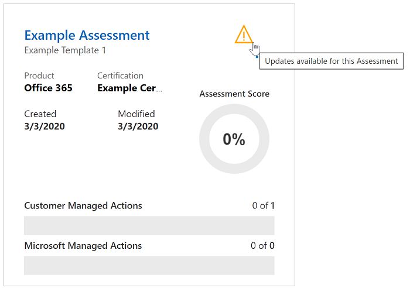

# Updates der Microsoft-Kompatibilitätsbewertung (Vorschau)Microsoft Compliance Score (Preview) updates

 Dieser Artikel enthält Details zu zukünftigen Updates für [Microsoft Compliance Score](compliance-score.md) und [Microsoft Compliance Manager](compliance-manager-overview.md).This article provides details about future updates to [Microsoft Compliance Score](compliance-score.md) and [Microsoft Compliance Manager](compliance-manager-overview.md). Erfahren Sie mehr über Ihre [Beziehung](compliance-score-release-notes.md#compliance-score-relationship-to-compliance-manager).Learn more about their [relationship](compliance-score-release-notes.md#compliance-score-relationship-to-compliance-manager).

## Verbesserte Vorlagenerstellung und AktualisierungsprozesseImproved template creation and update processes

Wir vereinfachen den Prozess des Importierens, Exportierens und Änderns von Vorlagen für Bewertungen.We're simplifying the process for importing, exporting, and modifying templates for assessments. Die neue Benutzeroberfläche erleichtert es Ihnen, eigene Bewertungen in das Konformitäts Bewertungsergebnis einzubringen und Sie auf dem neuesten Stand zu halten.The new experience will make it easier for you to bring your own assessments into Compliance Score and keep them updated.

### Der aktuelle ProzessThe current process

Es gibt zwei Möglichkeiten, eine Vorlage im Compliance-Manager zu erstellen.There are two ways to create a template in Compliance Manager. Sie können eine vorhandene Vorlage kopieren oder Vorlagendaten aus einer Excel-Kalkulationstabelle in eine neue Vorlage importieren.You can copy an existing template, or you can import template data from an Excel spreadsheet into a new template. Wählen Sie auf der Seite **Vorlagen** die Option **+ Vorlage hinzufügen** aus, um eine neue Vorlage zu erstellen, indem Sie einen Namen eingeben, Dimensionen auswählen und eine Excel-Datei mit einem bestimmten Format und Schema hochladen.From your **Templates** page, you select **+ Add template** to create a brand new template by entering a name, selecting dimensions, and uploading an Excel file with a specific format and schema. Sie können auch das Feld **Kopie von einer vorhandenen Vorlage** überprüfen, eine zu kopierende Vorlage auswählen und die Dimensionen überprüfen, wie in der Abbildung unten dargestellt.Or you can check the **Copy from an existing template** box, select a template to copy, and verify dimensions, as shown in the image below. Zum Anpassen Ihrer Vorlage ist ein [mehrstufiger Prozess](working-with-compliance-manager.md#templates) erforderlich, der mit dem Auswählen von **benutzerdefiniertem Steuerelement** nach dem Erstellen der Vorlage beginnt.Customizing your template requires a [multi-step process](working-with-compliance-manager.md#templates) that begins by selecting **Add custom control** after creating your template.

### Was ändert sichWhat's changing

Wir erleichtern Ihnen die Erstellung neuer Vorlagen.We're making it easier for you to create new templates. In einem schrittweisen **Erweiterungs** Prozess können Sie einer vorhandenen Microsoft-Vorlage eine Kalkulationstabelle mit ihren Aktionen und Steuerelementen hinzufügen, um Ihre eigene angepasste Version zu erstellen.In a one-step **extension** process, you can add a spreadsheet with your actions and controls to an existing Microsoft template to make your own customized version. Aktivieren Sie im Fenster **Vorlagen** -Flyout das Kontrollkästchen **Erweiterung aus globaler Vorlage erstellen** (siehe Abbildung unten).On the **Template** flyout pane, select the **Create extension from global template** checkbox, as shown in the image below. Anschließend fügen Sie Anpassungen mithilfe eines neuen Excel-Formats hinzu, das weniger komplex ist als die aktuelle.You'll then add customizations using a new Excel format that is less complex than the current one. Dieser neue Prozess ersetzt die aktuelle **Kopie aus einer vorhandenen Vorlage** und **Fügt benutzerdefinierte Steuerelementfunktionen hinzu** .This new process replaces the current **Copy from an existing template** and **Add custom control** functions.

Jedes Mal, wenn die ursprüngliche Bewertung über den unten beschriebenen Versions Verwaltungsprozess aktualisiert wird, erbt Ihre angepasste Bewertung diese Updates und behält Ihre benutzerdefinierten Steuerelemente bei.Each time the original assessment is updated through the versioning process outlined below, your customized assessment will inherit those updates and keep your custom controls.

Außerdem vereinfachen wir das Ändern Ihrer vorhandenen Vorlagen.We're also making it easier to modify your own existing templates. Sie können Ihre Vorlage exportieren, Änderungen in derselben Arbeitsmappe vornehmen und Sie dann mit gespeicherten Bearbeitungs speichern importieren.You can export your template, make changes in the same workbook, then import it with your edits saved.

## Versions Verwaltungs Hinweis und-SteuerelementVersioning notice and control

Ihre Organisation erhält aktualisierte Bewertungen in der nächsten Version von Compliance Score und Compliance-Manager, um Sie bei der Anpassung an Zertifizierungs-und Regel Updates zu unterstützen.Your organization will receive updated assessments in the next release of Compliance Score and Compliance Manager to help you align with certification and regulation updates.

Jedes Mal, wenn ein Update für die Vorlage eines Assessments oder eine Verbesserungs Aktion verfügbar ist, werden Sie von einem Warnungssymbol benachrichtigt, dass ein Update bereit ist.Going forward, whenever an update is available for an assessment's template or an improvement action, an alert icon notifies you that an update is ready. Wenn Sie auf dieses Symbol klicken, wird das Update in einem Popupfenster erläutert, und Sie werden aufgefordert, diese zu akzeptieren.When you click on that icon, a pop-up window explains the update and prompts you to accept. Unten sehen Sie ein Beispiel für die Versions Verwaltungs Warnung für eine Bewertung:Below is an example of the versioning alert for an assessment:

Wenn Sie das Warnsymbol auswählen, wird ein Flyout-Bereich angezeigt, in dem das Update erläutert wird, und Sie werden aufgefordert, Folgendes anzunehmenSelecting the alert icon reveals a flyout pane explaining the update and prompting you to accept:

## Häufige Aktionen synchronisieren den Status über Gruppen hinweg.Common actions will synch status across groups

Wenn Ihre Organisation über mehrere Bewertungsgruppen verfügt, ändert sich das Verhalten von **technischen** Aktionen (also Aktionen, die ihre gesamte Organisation betreffen).If your organization has multiple groups of assessments, the behavior of **Technical** actions (that is, actions affecting your entire organization) will change. Doppelte Aktionen in mehreren Gruppen werden in einer einzigen Aktion kombiniert.Any duplicate actions across groups will be combined into one single action. Diese einzelne Aktion enthält alle hochgeladenen Notizen und Beweise aus den doppelten Versionen.That single action will contain all uploaded notes and evidence from the duplicate versions. Durch diese Änderung verhalten sich technische Aktionen so, wie Sie es derzeit tun, wenn Sie derselben Gruppe angehören.With this change, technical actions will behave as they currently do when they belong to the same group. Alle Änderungen, die an der Aktion in einer Gruppe oder Bewertung vorgenommen werden, werden nun in allen Instanzen wiedergegeben.Any change made to the action in one group or assessment will now be reflected in all instances. Der **Implementierungsstatus**, die **Implementierungs-DAT**, der **Test Status**und das **Test Datum** spiegeln die neuesten Aktualisierungen wider.The **Implementation Status**, **Implementation Dat**, **Test Status**, and **Test Date** will reflect the most recent updates.

## SprachunterstützungLanguage support

Das Kompatibilitäts Ergebnis steht nun zusätzlich zu Englisch in den folgenden Sprachen zur Verfügung: Chinesisch (vereinfacht), Chinesisch (traditionell), Französisch, Deutsch, Italienisch, Japanisch, Koreanisch, Portugiesisch (Brasilien), Russisch und Spanisch.Compliance Score will now be available in the following languages in addition to English: Chinese (Simplified), Chinese (Traditional), French, German, Italian, Japanese, Korean, Portuguese (Brazil), Russian, and Spanish.
