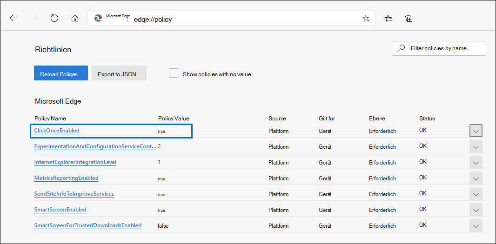
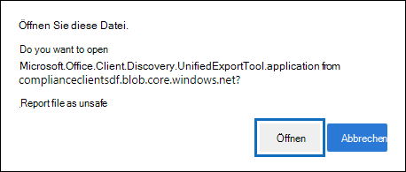
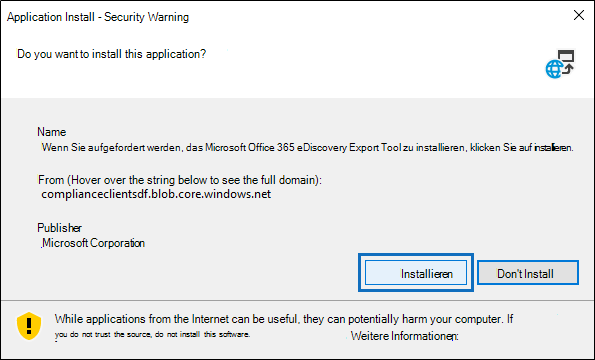

# Verwenden des Office 365 eDiscovery-Export Tools in Microsoft Edge

Aufgrund der letzten Änderungen an Microsoft Edge ist die ClickOnce-Unterstützung standardmäßig nicht mehr aktiviert. Um das eDiscovery-Export Tool Microsoft Office 365 zum Herunterladen von Inhaltssuche oder eDiscovery-Suchergebnissen weiterhin zu verwenden, müssen Sie entweder [Microsoft Internet Explorer](https://support.microsoft.com/help/17621/internet-explorer-downloads) verwenden oder die ClickOnce-Unterstützung in Microsoft Edge aktivieren.

## Vorgehensweise Aktivieren der ClickOnce-Unterstützung in Microsoft Edge

1. Navigieren Sie in Microsoft Edge zu **Edge://Flags/#Edge-Click-Once**.

2. Wenn der vorhandene Wert in der Dropdownliste auf **Standard** oder **deaktiviert** festgelegt ist, ändern Sie ihn in **aktiviert**.
    
   

3. Scrollen Sie nach unten zum Browserfenster, und klicken Sie auf **neu** starten, um Edge neu zu starten.

   

**Hinweis:** Organisationen können mithilfe von Gruppenrichtlinien die ClickOnce-Unterstützung deaktivieren. Um zu überprüfen, ob eine Organisationsrichtlinie für die ClickOnce-Unterstützung vorhanden ist, navigieren Sie zu **Edge://Policy**. Der folgende Screenshot zeigt, dass ClickOnce in der gesamten Organisation aktiviert ist. Wenn dieser Richtlinienwert auf **false**festgelegt ist, müssen Sie einen Administrator in Ihrer Organisation kontaktieren.

## Installieren und Ausführen des Office 365 eDiscovery-Export Tools

1. Klicken Sie auf der Flyout-Seite eines Exports in Inhaltssuche oder eines eDiscovery-Falls auf " **Ergebnisse herunterladen** ".

   

2. Sie werden mit einer Bestätigung aufgefordert, das Tool zu starten, indem Sie auf **Öffnen**klicken.

   

   Wenn das Microsoft Office-eDiscovery-Export Tool 365 nicht installiert ist, werden Sie mit einer Sicherheitswarnung aufgefordert, 

   

3. Klicken Sie auf **Installieren**. Nachdem die Installation erfolgt ist, wird das Export Tool automatisch gestartet.

Weitere Informationen hierzu finden Sie in den folgenden Themen:

- [Exportieren von Inhaltssuchergebnissen ](export-search-results.md)

- [Aktivieren von testmarkierungen in Microsoft Edge](https://microsoftedgesupport.microsoft.com/hc/articles/360034075294-How-to-enable-experiment-flags-in-Microsoft-Edge-Insider-channels)
