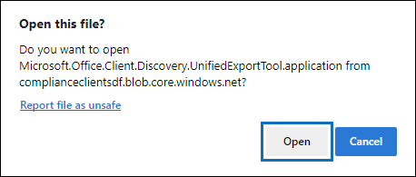

# Verwenden des eDiscovery-Export Tools in Microsoft EdgeUse the eDiscovery Export Tool in Microsoft Edge

Aufgrund der letzten Änderungen an der neuesten Version von Microsoft Edge ist die ClickOnce-Unterstützung standardmäßig nicht mehr aktiviert.As a result of recent changes to the newest version of Microsoft Edge, ClickOnce support is no longer enabled by default. Um das eDiscovery-Export Tool zum Herunterladen der Inhaltssuche oder der eDiscovery-Suchergebnisse weiter verwenden zu können, müssen Sie entweder [Microsoft Internet Explorer](https://support.microsoft.com/help/17621/internet-explorer-downloads) verwenden oder die ClickOnce-Unterstützung in der neuesten Version von Microsoft Edge aktivieren.To continue using the eDiscovery Export Tool to download Content Search or eDiscovery search results, you either need to use [Microsoft Internet Explorer](https://support.microsoft.com/help/17621/internet-explorer-downloads) or enable ClickOnce support in the newest version of Microsoft Edge.

## Aktivieren der ClickOnce-Unterstützung in Microsoft EdgeEnable ClickOnce support in Microsoft Edge

1. Wechseln Sie in Microsoft Edge zu **Edge://Flags/#Edge-Click-Once**.In Microsoft Edge, go to **edge://flags/#edge-click-once**.

2. Wenn der vorhandene Wert in der Dropdownliste auf **Standard** oder **deaktiviert** festgelegt ist, ändern Sie ihn in **aktiviert**.If the existing value is set to **Default** or **Disabled** in the dropdown list, change it to **Enabled**.

   

3. Scrollen Sie nach unten zum Browserfenster, und klicken Sie auf **neu** starten, um Edge neu zu starten.Scroll down to the bottom of the browser window and click **Restart** to restart Edge.

   

**Hinweis:** Organisationen können mithilfe von Gruppenrichtlinien die ClickOnce-Unterstützung deaktivieren.**Note:** Organizations can use Group Policy to disable ClickOnce support. Um zu überprüfen, ob eine Organisationsrichtlinie für die ClickOnce-Unterstützung vorhanden ist, wechseln Sie zu **Edge://Policy**.To check if there is an organizational policy for ClickOnce support, go to **edge://policy**. Der folgende Screenshot zeigt, dass ClickOnce in der gesamten Organisation aktiviert ist.The following screenshot shows that ClickOnce is enabled across the entire organization. Wenn dieser Richtlinienwert auf **false**festgelegt ist, müssen Sie einen Administrator in Ihrer Organisation kontaktieren.If this policy value is set to **false**, you will need to contact an admin in your organization.

## Installieren und Ausführen des eDiscovery-Export ToolsInstall and run the eDiscovery Export Tool

1. Klicken Sie auf der Flyout-Seite eines Exports in Inhaltssuche oder eines eDiscovery-Falls auf " **Ergebnisse herunterladen** ".Click **Download results** on the flyout page of an export in Content Search or an eDiscovery case.

   

2. Sie werden mit einer Bestätigung aufgefordert, das Tool zu starten, indem Sie auf **Öffnen**klicken.You will be prompted with a confirmation to launch the tool, Click **Open**.

   

   Wenn das eDiscovery-Export Tool nicht installiert ist, werden Sie mit einer Sicherheitswarnung aufgefordert,If the eDiscovery Export Tool isn't installed, you will be prompted with a Security Warning, 

   

3. Klicken Sie auf **Installieren**.Click **Install**. Nachdem die Installation erfolgt ist, wird das Export Tool automatisch gestartet.After it's installed, the export tool will launch automatically.

Weitere Informationen hierzu finden Sie in den folgenden Themen:For more information, see the following topics:

- [Exportieren von Inhaltssuchergebnissen Export Content Search results](export-search-results.md)

- [Aktivieren von testmarkierungen in Microsoft EdgeHow to enable experiment flags in Microsoft Edge](https://microsoftedgesupport.microsoft.com/hc/articles/360034075294-How-to-enable-experiment-flags-in-Microsoft-Edge-Insider-channels)
