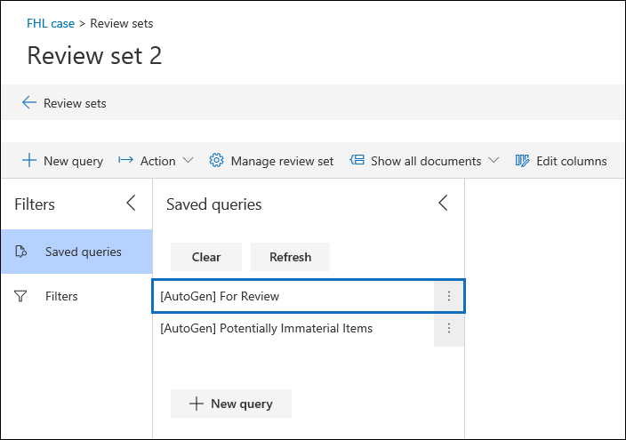

# Konfigurieren von Such- und Analyseeinstellungen in Advanced eDiscoveryConfigure search and analytics settings in Advanced eDiscovery

Sie können Einstellungen für jeden Advanced eDiscovery konfigurieren, um die folgenden Funktionen zu steuern.You can configure settings for each Advanced eDiscovery case to control the following functionality.

- Erkennung von Quasiduplikaten und E-Mail-ThreadingNear duplicates and email threading

- DesignsThemes

- Automatisch generierte Prüfdateisatz-AbfrageAutogenerated review set query

- Ignorieren von TextIgnore text

- Optical Character Recognition (optische Zeichenerkennung)Optical character recognition

So konfigurieren Sie die Such-und Analyseeinstellungen für einen Fall:To configure search and analytics settings for a case:

1. Wählen Sie auf der Seite **Advanced eDiscovery** den Fall aus.On the **Advanced eDiscovery** page, select the case.

2. Klicken Sie unter der Registerkarte **Einstellungen** unter **Suche und Analysen** auf **Auswählen**.On the **Settings** tab, under **Search & analytics**, click **Select**.

   Die Seite "Falleinstellungen" wird angezeigt.The case settings page is displayed. Diese Einstellungen werden in einem Fall auf alle Überprüfungssätze angewendet.These settings are applied to all review sets in a case.

   

## Erkennung von Quasiduplikaten und E-Mail-ThreadingNear duplicates and email threading

In diesem Abschnitt können Sie Parameter für die Duplikaterkennung, die Beinaheerkennung von Duplikaten und das E-Mail-Threading festlegen.In this section, you can set parameters for duplicate detection, near duplicate detection, and email threading. Weitere Informationen finden Sie unter [Near duplicate detection](near-duplicate-detection-in-advanced-ediscovery.md) and Email [threading](email-threading-in-advanced-ediscovery.md).For more information, see [Near duplicate detection](near-duplicate-detection-in-advanced-ediscovery.md) and [Email threading](email-threading-in-advanced-ediscovery.md).

- **In der Nähe von Duplikaten/E-Mail-Threading:** Wenn dies aktiviert ist, werden die Duplikaterkennung, die Erkennung von Duplikaten und das E-Mail-Threading als Teil des Workflows einbezogen, wenn Sie Analysen für die Daten in einem Überprüfungssatz ausführen.**Near duplicates/email threading:** When turned on, duplicate detection, near duplicate detection, and email threading are included as part of the workflow when you run analytics on the data in a review set.

- **Schwellenwert für dokument- und E-Mail-Ähnlichkeit:** Wenn die Ähnlichkeitsstufe für zwei Dokumente über dem Schwellenwert liegt, werden beide Dokumente in demselben fast doppelten Satz gesetzt.**Document and email similarity threshold:** If the similarity level for two documents is above the threshold, both documents are put in the same near duplicate set.

- **Minimale/maximale Anzahl von Wörtern:** Diese Einstellungen geben an, dass beinahe duplikate und E-Mail-Threading-Analyse nur für Dokumente ausgeführt werden, die mindestens die minimale Anzahl von Wörtern und höchstens die maximale Anzahl von Wörtern haben.**Minimum/maximum number of words:** These settings specify that near duplicates and email threading analysis are performed only on documents that have at least the minimum number of words and at most the maximum number of words.

## DesignsThemes

In diesem Abschnitt können Sie Parameter für Designs festlegen.In this section, you can set parameters for themes. Weitere Informationen finden Sie unter [Designs](themes-in-advanced-ediscovery.md).For more information, see [Themes](themes-in-advanced-ediscovery.md).

- **Designs:** Wenn dies aktiviert ist, wird das Clustering von Designs als Teil des Workflows ausgeführt, wenn Sie Analysen für die Daten in einem Überprüfungssatz ausführen.**Themes:** When turned on, themes clustering is performed as part of the workflow when you run analytics on the data in a review set.

- **Maximale Anzahl von Designs:** Gibt die maximale Anzahl von Designs an, die generiert werden können, wenn Sie Analysen für die Daten in einem Überprüfungssatz ausführen.**Maximum number of themes:** Specifies the maximum number of themes that can be generated when you run analytics on the data in a review set.

- **Fügen Sie Zahlen in Designs ein:** Wenn dies aktiviert ist, werden Zahlen (die ein Design identifizieren) beim Generieren von Designs eingeschlossen.**Include numbers in themes:** When turned on, numbers (that identify a theme) are included when generating themes. 

- **Passen Sie die maximale Anzahl von Designs dynamisch an:** In bestimmten Situationen sind möglicherweise nicht genügend Dokumente in einem Überprüfungssatz enthalten, um die gewünschte Anzahl von Designs zu erzeugen.**Adjust maximum number of themes dynamically:** In certain situations, there may not be enough documents in a review set to produce the desired number of themes. Wenn diese Einstellung aktiviert ist, passt Advanced eDiscovery die maximale Anzahl von Designs dynamisch an, anstatt zu versuchen, die maximale Anzahl von Designs zu erzwingen.When this setting is enabled, Advanced eDiscovery adjusts the maximum number of themes dynamically rather than attempting to enforce the maximum number of themes.

## Prüfdateisatz-AbfrageReview set query

Wenn Sie das Kontrollkästchen Gespeicherte **Suche** nach Analyse automatisch erstellen aktivieren, Advanced eDiscovery überprüfungssatzabfrage namens **For Review automatisch generiert.**If you select the **Automatically create a For Review saved search after analytics** checkbox, Advanced eDiscovery autogenerates review set query named **For Review.** 

Diese Abfrage filtert im Wesentlichen doppelte Elemente aus dem Überprüfungssatz heraus.This query basically filters out duplicate items from the review set. Auf diese Weise können Sie die eindeutigen Elemente im Überprüfungssatz überprüfen.This lets you review the unique items in the review set. Diese Abfrage wird nur erstellt, wenn Sie einen Prüfdateisatz innerhalb des Falls einer Analyse unterziehen.This query is created only when you run analytics for a review set in the case. Weitere Informationen zu Überprüfungssatzabfragen finden Sie unter [Query the data in a review set](review-set-search.md).For more information, about review set queries, see [Query the data in a review set](review-set-search.md).

## Ignorieren von TextIgnore text

Es gibt Situationen, in denen bestimmten Text die Qualität der Analyse verringert, z. B. langwierige Haftungsausschlüsse, die E-Mail-Nachrichten unabhängig vom Inhalt der E-Mail hinzugefügt werden.There are situations where certain text will diminish the quality of analytics, such as lengthy disclaimers that get added to email messages regardless of the content of the email. Wenn Sie wollen, dass bestimmte Textzeichenfolgen ignoriert werden soll, können Sie diese aus der Analyse ausschließen, indem Sie die Textzeichenfolgen und die Analysefunktionen (Erkennung von Quasiduplikaten, E-Mail-Threading, Designs und Relevanz) angeben, für die der Text ausgeschlossen werden soll.If you know of text that should be ignored, you can exclude it from analytics by specifying the text string and the analytics functionality (Near-duplicates, Email threading, Themes, and Relevance) that the text should be excluded for. Die Verwendung regulärer Ausdrücke (RegEx) als ignorierter Text wird ebenfalls unterstützt.Using regular expressions (RegEx) as ignored text is also supported. 

## Optical Character Recognition (OCR; optische Zeichenerkennung)Optical character recognition (OCR)

Wenn diese Einstellung aktiviert ist, wird die OCR-Verarbeitung für Bilddateien ausgeführt.When this setting is turned on, OCR processing will be run on image files. Die OCR-Verarbeitung wird in den folgenden Situationen ausgeführt:OCR processing is run in the following situations:

- Wenn verwahrer und nicht [verwahrte Datenquellen](non-custodial-data-sources.md) zu einem Fall hinzugefügt werden.When custodians and [non-custodial data sources](non-custodial-data-sources.md) are added to a case. Die OCR-Verarbeitung wird während des erweiterten Indizierungsprozesses ausgeführt.OCR processing is performed during the Advanced indexing process. Dies bedeutet, dass Text in Bilddateien, die den Suchkriterien entsprechen, in einer Auflistungssuche zurückgegeben wird.This means that text in image files that matches the search criteria will be returned in a collection search.

- Wenn Inhalte aus anderen Datenquellen (die keinem Verwahrer zugeordnet sind und dem Fall in einer nicht verwahrten Datenquelle hinzugefügt werden) einem Überprüfungssatz hinzugefügt werden.When content from other data sources (that aren't associated with a custodian and added to the case in a non-custodial data source) is added to a review set.

Nachdem Einem Überprüfungssatz Daten hinzugefügt wurden, kann der Bildtext überprüft, durchsucht, markiert und analysiert werden.After data is added to a review set, image text can be reviewed, searched, tagged, and analyzed. Sie können den extrahierten Text in der Textanzeige der ausgewählten Bilddatei im Überprüfungssatz anzeigen.You can view the extracted text in the Text viewer of the selected image file in the review set. Weitere Informationen finden Sie unter:For more information, see:

- [Erweiterte Indizierung der Daten von VerwaltungsberechtigtenAdvanced indexing of custodian data](indexing-custodian-data.md)

- [Hinzufügen von Suchergebnissen zu einem PrüfdateisatzAdd search results to a review set](add-data-to-review-set.md#optical-character-recognition)

- [Unterstützte BilddateitypenSupported image file types](supported-filetypes-ediscovery20.md#image)
