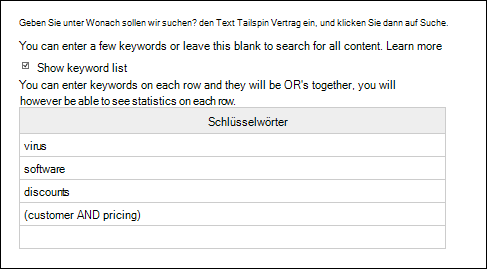
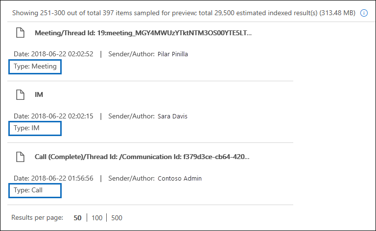

# <a name="feature-reference-for-content-search"></a>Featurereferenz für die Inhaltssuche

Dieser Artikel beschreibt Features und Funktionalität der Inhaltssuche.

## <a name="content-search-limits"></a>Grenzwerte für Inhaltssuchen

- Eine Beschreibung der Einschränkungen für die Inhaltssuche finden Sie unter [Einschränkungen der Inhaltssuche](limits-for-content-search.md).
  
- Microsoft sammelt Leistungsinformationen für Inhaltssuchen, die von allen Organisationen ausgeführt werden. Obwohl sich die Komplexität einer Suchabfrage negativ auf die Suchzeiten auswirken kann, ist die Anzahl der durchsuchten Postfächer der Faktor, der die Suchdauer am stärksten beeinflusst. Microsoft bietet zwar keine Vereinbarung zum Servicelevel (Service Level Agreement, SLA) für Suchzeiten an, in der folgenden Tabelle werden jedoch durchschnittliche Suchzeiten für eine Inhaltssuche basierend auf der Anzahl der in die Suche einbezogenen Postfächer angegeben.
  
  |**Anzahl Postfächer**|**Durchschnittliche Suchzeit**|
  |:-----|:-----|
  |100  <br/> |30 Sekunden  <br/> |
  |1.000  <br/> |45 Sekunden  <br/> |
  |10.000  <br/> |4 Minuten  <br/> |
  |25.000  <br/> |10 Minuten  <br/> |
  |50.000  <br/> |20 Minuten  <br/> |
  |100.000  <br/> |25 Minuten  <br/> |
  |||
  
## <a name="building-a-search-query"></a>Erstellen einer Suchabfrage

Ausführliche Informationen zum Erstellen einer Suchabfrage mithilfe von booleschen Suchoperatoren und Suchbedingungen sowie zum Suchen nach vertraulichen Informationstypen und Inhalten, die für Benutzer außerhalb Ihrer Organisation freigegeben wurden, finden Sie unter [Stichwortabfragen und Suchbedingungen für die Inhaltssuche](keyword-queries-and-search-conditions.md).
  
Bedenken Sie bei der Verwendung einer Schlüsselwortliste zum Erstellen einer Suchabfrage die folgenden Punkte:
  
- Sie müssen das Kontrollkästchen **Stichwortliste anzeigen** aktivieren und dann jedes Schlüsselwort in eine separate Zeile eingeben, um eine Suchabfrage zu erstellen, wobei die Schlüsselwörter (oder Schlüsselwortausdrücke) in jeder Zeile durch den Operator **OR** verbunden sind. Wenn Sie eine Liste von Schlüsselwörtern in das Schlüsselwortfeld einfügen oder nach der Eingabe eines Schlüsselworts die **EINGABETASTE** drücken, werden die Schlüsselwörter nicht mit dem Operator **OR** verbunden. Nachfolgend finden Sie falsche und richtige Beispiele für das Hinzufügen einer Liste von Schlüsselwörtern.
    
    **Falsch**
    
    
  
    **Richtig**
    
    
  
- Sie können auch eine Liste von Schlüsselwörtern oder Schlüsselwortausdrücken in einer Excel-Datei oder einer reinen Textdatei vorbereiten, und diese Liste dann kopieren und in die Schlüsselwortliste einfügen. Zu diesem Zweck müssen Sie das Kontrollkästchen **Schlüsselwortliste anzeigen** aktivieren. Klicken Sie dann auf die erste Zeile in der Schlüsselwortliste, und fügen Sie Ihre Liste ein. Jede Zeile aus der Excel- oder TXT-Datei wird in eine separate Zeile in der Schlüsselwortliste eingefügt. 
    
- Nachdem Sie eine Abfrage mithilfe der Schlüsselwortliste erstellt haben, ist es ratsam, die Suchabfragesyntax zu überprüfen, um sicherzustellen, dass die Suchabfrage Ihren Vorstellungen entspricht. In der Suchabfrage, die im Detailbereich unter **Abfrage** angezeigt wird, sind die Schlüsselwörter durch den Text **(c:s)** voneinander getrennt. Dies weist darauf hin, dass die Schlüsselwörter durch einen logischen Operator verbunden sind, dessen Funktionsweise mit jener des **OR**-Operators vergleichbar ist. Wenn Ihre Suchabfrage Bedingungen enthält, sind die Schlüsselwörter und die Bedingungen entsprechend durch den Text **(c:c)** voneinander getrennt. Dies weist darauf hin, dass die Schlüsselwörter durch einen logischen Operator verbunden sind, dessen Funktionsweise mit jener des **AND**-Operators vergleichbar ist. Es folgt ein Beispiel für die (im Bereich "Details" angezeigte) Suchabfrage, die sich ergibt, wenn Sie die Schlüsselwortliste und eine Bedingung verwenden. 
    
    
  
- Wenn Sie eine Inhaltssuche ausführen, überprüft Microsoft 365 Ihre Suchanfrage automatisch auf nicht unterstützte Zeichen und auf boolesche Operatoren, die nicht großgeschrieben werden dürfen. Nicht unterstützte Zeichen sind häufig ausgeblendet und verursachen in der Regel einen Suchfehler, oder es werden unerwartete Ergebnisse zurückgegeben. Weitere Informationen zu den nicht unterstützten Zeichen, nach denen gesucht wird, finden Sie unter [Überprüfen der Inhaltssuchabfrage auf Fehler](check-your-content-search-query-for-errors.md).
    
- Wenn eine Suchabfrage Schlüsselwörter für nichtenglische Zeichen enthält (z. B. chinesische Zeichen), können Sie auf **Abfragesprache Land/Region** klicken und einen Kulturcodewert für Sprache und Region für die Suche auswählen. Die standardmäßige Sprache/Region ist neutral. Woran erkennen Sie, dass Sie die Spracheinstellung für eine Inhaltssuche ändern müssen? Wenn Sie sicher sind, dass bestimmte Inhaltsspeicherorte nichtenglische Zeichen enthalten, nach denen Sie suchen, die Suche jedoch keine Ergebnisse zurückgibt, könnte die Spracheinstellung die Ursache sein. 
  
## <a name="partially-indexed-items"></a>Teilweise indizierte Elemente

- Teilweise indizierte Elemente in Postfächern werden in die geschätzten Suchergebnisse einbezogen. Teilweise indizierte Elemente aus SharePoint und OneDrive werden nicht in die geschätzten Suchergebnissen einbezogen. Weitere Informationen finden Sie unter [Teilweise indizierte Elemente in der eDiscovery](partially-indexed-items-in-content-search.md).

## <a name="searching-onedrive-accounts"></a>Durchsuchen von OneDrive-Konten

- Wie Sie eine Liste der URLs für die OneDrive-Websites in Ihrer Organisation erstellen können erfahren Sie unter [Erstellen einer Liste aller OneDrive-Speicherorte in Ihrer Organisation](/onedrive/list-onedrive-urls). Mit dem Skript in diesem Artikel wird eine Textdatei erstellt, die eine Liste aller OneDrive-Websites enthält. Um dieses Skript ausführen zu können, müssen Sie die SharePoint Online-Verwaltungsshell installieren und verwenden. Achten Sie darauf, die URL für die "MeineWebsite"-Domäne Ihrer Organisation an jede OneDrive-Website anzuhängen, die Sie durchsuchen möchten. Dies ist die Domäne, die Ihr gesamtes OneDrive enthält, z. B. `https://contoso-my.sharepoint.com`. Hier ein Beispiel für die URL der OneDrive-Website eines Benutzers: `https://contoso-my.sharepoint.com/personal/sarad_contoso_onmicrosoft.com`.
    
    In den seltenen Fällen, in denen der Benutzerprinzipalname (User Principal Name, UPN) einer Person geändert wird, wird die URL für deren OneDrive-Speicherort so geändert, dass der neue UPN integriert ist. In diesem Fall müssen Sie eine Inhaltssuche entsprechend ändern, indem Sie die neue OneDrive-URL für den Benutzer hinzufügen und die alte entfernen. Weitere Informationen hierzu finden Sie unter [Wie sich UPN-Änderungen auf die OneDrive-URL auswirken](/onedrive/upn-changes).
  
## <a name="searching-microsoft-teams-and-microsoft-365-groups"></a>Durchsuchen von Microsoft Teams und Microsoft 365-Gruppen

Sie können das Postfach durchsuchen, das mit einem Microsoft Team oder einer Microsoft 365-Gruppe verknüpft ist. Da Microsoft Teams auf Microsoft 365-Gruppen aufbaut, ist die Suche nach diesen ähnlich. In beiden Fällen wird nur das Gruppen- bzw. das Team-Postfach durchsucht. Die Postfächer der Gruppen- oder Teammitglieder werden nicht durchsucht. Um diese zu durchsuchen, müssen sie eigens zur Suche hinzugefügt werden.
  
Beachten Sie bei der Suche nach Inhalten in Microsoft Teams und Microsoft 365-Gruppen die folgenden Punkte.
  
- Um nach Inhalten zu suchen, die sich in Teams und Microsoft 365-Gruppen befinden, müssen Sie das Postfach und die SharePoint-Website angeben, die mit einem Team oder einer Gruppe verknüpft sind.

- Inhalte aus privaten Kanälen werden in den Postfächern jedes Benutzers, nicht im Postfach des Teams gespeichert. Wenn Sie nach Inhalten in privaten Kanälen suchen möchten, lesen Sie [eDiscovery für private Kanäle](/microsoftteams/ediscovery-investigation#ediscovery-of-private-channels).
    
- Führen Sie das Cmdlet **Get-UnifiedGroup** in Exchange Online aus, um Eigenschaften für ein Team oder eine Microsoft 365-Gruppe anzuzeigen. Das ist eine gute Möglichkeit, um die URL für die Website zu erhalten, die mit einem Team oder einer Gruppe verbunden ist. Der folgende Befehl zeigt beispielsweise ausgewählte Eigenschaften für eine Microsoft 365-Gruppe mit dem Namen „Senior Leadership Team“ an: 
    
  ```text
  Get-UnifiedGroup "Senior Leadership Team" | FL DisplayName,Alias,PrimarySmtpAddress,SharePointSiteUrl
  DisplayName            : Senior Leadership Team
  Alias                  : seniorleadershipteam
  PrimarySmtpAddress     : seniorleadershipteam@contoso.onmicrosoft.com
  SharePointSiteUrl      : https://contoso.sharepoint.com/sites/seniorleadershipteam
  ```

    > [!NOTE]
    > Zum Ausführen des **Get-UnifiedGroup**-Cmdlets müssen Sie über die Rolle "Empfänger (nur Anzeige)" in Exchange Online verfügen oder ein Mitglied einer Rollengruppe sein, der die Rolle "Empfänger (nur Anzeige)" zugewiesen wurde. 
  
- Wenn die Mailbox eines Benutzers durchsucht wird, wird kein Team oder keine Microsoft 365-Gruppe durchsucht, in welchem bzw. welcher der Benutzer Mitglied ist. Ähnlich wird bei der Suche in einem Team oder einer Microsoft 365-Gruppe nur das Gruppenpostfach und die Website der Gruppe durchsucht, die Sie angeben. Die Postfächer und OneDrive for Business-Konten von Gruppenmitgliedern werden nicht durchsucht, es sei denn, Sie fügen sie der Suche explizit hinzu.

- Um eine Liste der Mitglieder eines Teams oder einer Microsoft 365-Gruppe zu erhalten, können Sie die Eigenschaften auf der Seite **Start \> Gruppen** im Microsoft 365 Admin Center anzeigen. Alternativ können Sie den folgenden Befehl in Exchange Online-PowerShell ausführen: 

  ```powershell
  Get-UnifiedGroupLinks <group or team name> -LinkType Members | FL DisplayName,PrimarySmtpAddress
  ```

    > [!NOTE]
    > Zum Ausführen des **Get-UnifiedGroupLinks**-Cmdlets müssen Sie über die Rolle "Empfänger (nur Anzeige)" in Exchange Online verfügen oder ein Mitglied einer Rollengruppe sein, der die Rolle "Empfänger (nur Anzeige)" zugewiesen wurde. 
  
- Unterhaltungen, die Bestandteil eines Teams-Kanals sind, werden in dem Postfach gespeichert, das dem Team zugeordnet ist. Gleichermaßen werden Dateien, die Teammitglieder in einem Kanal freigeben, auf der SharePoint-Website des Teams gespeichert. Daher müssen Sie das Postfach und die SharePoint-Website des Teams als Inhaltsspeicherort hinzufügen, um Unterhaltungen und Dateien in einem Kanal zu durchsuchen.
    
- Demgegenüber werden Unterhaltungen, die Bestandteil der Chatliste in Teams sind, in den Exchange Online-Postfächern der Benutzer gespeichert, die am Chat teilnehmen. Und in Chatunterhaltungen freigegebene Dateien werden im OneDrive for Business-Konto des Benutzers gespeichert, der die Datei freigibt. Daher müssen Sie die Postfächer und OneDrive for Business-Konten der jeweiligen Benutzer als Inhaltsspeicherorte hinzufügen, um Unterhaltungen und Dateien in der Chatliste zu durchsuchen.
    
    > [!NOTE]
    > Benutzer mit lokalen Postfächern könnten in einer Exchange-Hybridbereitstellung an Unterhaltungen teilnehmen, die Teil der Chat-Liste in Microsoft Teams sind. In diesem Fall können Inhalte aus diesen Unterhaltungen ebenfalls durchsucht werden, weil sie in einem Cloud-basierten Speicherbereich (als *Cloud-basiertes Postfach für lokale Benutzer* bezeichnet) für Benutzer gespeichert sind, die über ein lokales Postfach verfügen. Weitere Informationen finden Sie unter [Nach Teams-Chatdaten für lokale Benutzer suchen](search-cloud-based-mailboxes-for-on-premises-users.md).
  
- Jedes Team bzw. jeder Team-Kanal enthält ein Wiki zum Erstellen von Notizen und zum Thema Zusammenarbeit. Die Wiki-Inhalte werden automatisch in einer Datei im MHT-Format gespeichert. Diese Datei wird in der Dokumentbibliothek für Wiki-Daten auf der SharePoint-Website des Teams gespeichert. Sie können das Tool für die Inhaltssuche zum Durchsuchen des Wikis verwenden, indem Sie die SharePoint-Website des Teams als den zu durchsuchenden Inhaltsspeicherort angeben.

    > [!NOTE]
    > Die Möglichkeit zum Durchsuchen des Wikis für ein Team oder einen Kanal (beim Durchsuchen der SharePoint-Website des Teams) wurde am 22. Juni 2017 freigegeben. Es können Wiki-Seiten, die an diesem Datum oder später gespeichert oder aktualisiert wurden, durchsucht werden. Wiki-Seiten, die das letzte Mal vor diesem Datum gespeichert oder aktualisiert wurden, sind nicht für die Suche verfügbar.

- Zusammenfassungsinformationen für Besprechungen und Anrufe in einem Teams-Kanal werden außerdem in den Postfächern der Benutzer gespeichert, die an der Besprechung oder dem Anruf teilgenommen haben. Dies bedeutet, dass Sie die Inhaltssuche verwenden können, um diese Zusammenfassungen zu durchsuchen. Zusammenfassungsinformationen umfassen Folgendes:
  
  - Datum, Startzeit, Endzeit und Dauer einer Besprechung oder eines Anrufs

  - Das Datum und die Uhrzeit, zu denen die einzelnen Teilnehmer der Besprechung oder dem Anruf beigetreten sind oder diese verlassen haben

  - An Voicemail gesendete Anrufe

  - Verpasste oder unbeantwortete Anrufe

  - Anrufweiterleitungen, die als zwei getrennte Anrufe dargestellt werden

  Es kann bis zu acht Stunden dauern, bis durchsuchbare Zusammenfassungen zu Besprechungen und Anrufen verfügbar sind.

  In den Suchergebnissen werden Besprechungszusammenfassungen im Feld **Typ** als **Besprechung** und Anrufübersichten als **Anruf** gekennzeichnet. Außerdem werden Unterhaltungen, die zu einem Teams-Kanals gehören und 1xN-Chats sind, im Feld **Typ** als **Sofortnachricht** gekennzeichnet.
  
  

   Weitere Informationen finden Sie unter [Microsoft Teams launches eDiscovery for calls and meetings](https://techcommunity.microsoft.com/t5/microsoft-teams-blog/microsoft-teams-launches-ediscovery-for-calling-and-meetings/ba-p/210947) (Microsoft Teams startet eDiscovery für Anrufe und Besprechungen).

- Karteninhalte, die von Apps in Teams-Kanälen, 1:1-Chats und 1xN-Chats erzeugt werden, werden in Postfächern gespeichert und können durchsucht werden. Eine *Karte* ist ein UI-Container für kurze Inhaltsteile. Karten können mehrere Eigenschaften und Anhänge haben und können Schaltflächen enthalten, die Kartenaktionen auslösen können. Weitere Informationen finden Sie unter:[Karten](/microsoftteams/platform/task-modules-and-cards/what-are-cards)

  Wie bei anderen Teams-Inhalten hängt der Speicherort der Karteninhalte davon ab, wo die Karte verwendet wurde. Inhalte für Karten, die in einem Teams-Kanal verwendet werden, werden im Postfach der Teams-Gruppe gespeichert. Karteninhalte für 1:1- und 1xN-Chats werden in den Postfächern der Chat-Teilnehmer gespeichert.

  Um nach Karteninhalten zu suchen, können Sie die Suchbedingungen `kind:microsoftteams` oder `itemclass:IPM.SkypeTeams.Message` verwenden. Beim Überprüfen von Suchergebnissen haben Karteninhalte, die von Bots in einem Teams-Kanal generiert wurden, die E-Mail-Eigenschaft **Absender/Autor** als `<appname>@teams.microsoft.com`, wobei `appname` der Name der App ist, die den Karteninhalt generiert hat. Wenn der Karteninhalt von einem Benutzer erzeugt wurde, identifiziert der Wert **Sender/Autor** den Benutzer.

  Wenn Sie den Karteninhalt in den Ergebnissen der Inhaltssuche anzeigen, erscheint der Inhalt als Anhang der Nachricht. Der Anhang trägt den Namen `appname.html`, wobei `appname` der Name der App ist, die den Karteninhalt erzeugt hat. Die folgenden Screenshots zeigen, wie Karteninhalte (für eine App namens Asana) in Teams und in den Suchergebnissen erscheinen.

  **Karteninhalt in Teams**

  

  **Karteninhalt in den Suchergebnissen**
  
  

  > [!NOTE]
  > Um Bilder von Karteninhalten in den Suchergebnissen zu diesem Zeitpunkt anzuzeigen (wie die Häkchen im vorherigen Screenshot), müssen Sie bei Teams angemeldet sein (unter https://teams.microsoft.com) in einem anderen Tab in derselben Browsersitzung, in der Sie die Suchergebnisse anzeigen. Andernfalls werden Bildplatzhalter angezeigt.

- Sie können die E-Mail-Eigenschaft **Art** oder die Suchbedingung **Art der Nachricht** verwenden, um gezielt nach Inhalten in Teams zu suchen.
  
  - Wenn Sie die Eigenschaft **Art** als Teil der Keywordsuchabfrage verwenden möchten, geben Sie im Feld **Schlüsselwörter** bei einer Suchabfrage `kind:microsoftteams` ein.

    
  
  - Wenn Sie eine Suchbedingung verwenden möchten, fügen Sie die Bedingung **Art der Nachricht** hinzu, und verwenden Sie den Wert `microsoftteams`.

    

   Bedingungen sind durch den Operator **AND** logisch mit der Schlüsselwortabfrage verknüpft. Dies bedeutet, dass ein Element sowohl der Schlüsselwortabfrage als auch der Suchbedingung entsprechen muss, damit es in den Suchergebnissen zurückgegeben wird. Weitere Informationen finden Sie im Abschnitt "Richtlinien für die Verwendung von Bedingungen" unter [Stichwortabfragen und Suchbedingungen für die Inhaltssuche](keyword-queries-and-search-conditions.md#guidelines-for-using-conditions).
  
## <a name="searching-yammer-groups"></a>Durchsuchen von Yammer-Gruppen

Sie können die **ItemClass**-E-Mail-Eigenschaft oder die **Typ**-Suchbedingung verwenden, um gezielt nach Unterhaltungselementen in Yammer-Gruppen zu suchen.

  - Wenn Sie die **ItemClass**-Eigenschaft als Teil der Schlüsselwort-Suchabfrage verwenden möchten, können Sie im Feld **Schlüsselwort** einer Suchabfrage eine (oder alle) der folgenden Eigenschaft:Wert-Paare eingeben:

     - ItemClass:IPM.Yammer.message
     - ItemClass:IPM.Yammer.poll
     - ItemClass:IPM.Yammer.praise
     - ItemClass:IPM.Yammer.question
  
    Sie können z. B. die folgende Suchabfrage verwenden, um Yammer-Nachrichten und -Lob-Elemente zurückzugeben:

    
  
  - Alternativ hierzu können Sie die **Typ**-E-Mail-Bedingung verwenden und **Yammer-Nachrichten** auswählen, um Yammer-Elemente zurückzugeben. Die folgende Suchabfrage gibt beispielsweise alle Yammer-Unterhaltungen zurück, die das Schlüsselwort "vertraulich" enthalten. 

    

## <a name="searching-inactive-mailboxes"></a>Durchsuchen von inaktiven Postfächern

Im Rahmen einer Inhaltssuche können auch inaktive Postfächer durchsucht werden. Um eine Liste der inaktiven Postfächer in Ihrer Organisation abzurufen, führen Sie in Exchange Online PowerShell den Befehl `Get-Mailbox -InactiveMailboxOnly` aus. Alternativ können Sie im Security & Compliance Center zu **Information governance**\> **Aufbewahrung** wechseln, und dann auf **Weitere** \> **Inaktive Postfächer** klicken.
  
Folgende Dinge sollten beim Durchsuchen inaktiver Postfächer beachtet werden:

- Wenn eine bestehende Inhaltssuche ein Benutzerpostfach einschließt und dieses wird deaktiviert, wird es weiterhin nach Inhalten durchsucht, wenn die Suche nach der Deaktivierung erneut ausgeführt wird.

- Es kann vorkommen, dass ein Benutzer über ein aktives und ein inaktives Postfach mit der gleichen SMTP-Adresse verfügt. In solchen Fällen wird nur jenes Postfach durchsucht, das Sie als Ort für eine Inhaltssuche auswählen. Anders ausgedrückt: Wenn Sie das Postfach eines Benutzers zu einer Suche hinzufügen, können Sie nicht davon ausgehen, dass sowohl aktive als auch inaktive Postfächer durchsucht werden. Nur das Postfach, das Sie der Suche explizit hinzufügen, wird durchsucht.

- Sie können die Security & Compliance Center-PowerShell verwenden, um eine Inhaltssuche zum Durchsuchen eines inaktiven Postfachs zu erstellen. Dazu müssen Sie vor der E-Mail-Adresse des inaktiven Postfachs einen Punkt ( . ) einfügen. Mit dem folgenden Befehl wird beispielsweise eine Inhaltssuche erstellt, die ein inaktives Postfach mit der E-Mail-Adresse pavelb@contoso.onmicrosoft.com durchsucht:

   ```powershell
   New-ComplianceSearch -Name InactiveMailboxSearch -ExchangeLocation .pavelb@contoso.onmicrosoft.com -AllowNotFoundExchangeLocationsEnabled $true
   ```

- Es wird dringend empfohlen, die Verwendung der gleichen SMTP-Adresse für ein aktives und ein inaktives Postfach zu vermeiden. Wenn eine SMTP-Adresse, die derzeit einem inaktiven Postfach zugeordnet ist, wiederverwendet werden soll, wird empfohlen, das inaktive Postfach oder dessen Inhalt in einem aktiven Postfach (bzw. im Archiv eines aktiven Postfachs) rückzuspeichern, und das inaktive Postfach anschließend zu löschen. Weitere Informationen hierzu finden Sie in einem der folgenden Beiträge:

  - [Wiederherstellen eines inaktiven Postfachs in Office 365](recover-an-inactive-mailbox.md)

  - [Rückspeichern eines inaktiven Postfachs in Office 365](restore-an-inactive-mailbox.md)

  - [Löschen eines inaktiven Postfachs in Office 365](delete-an-inactive-mailbox.md)

## <a name="searching-disconnected-or-de-licensed-mailboxes"></a>Durchsuchen von getrennten oder nicht mehr lizensierten Postfächern

Wenn die Exchange Online-Lizenz (oder die gesamte Microsoft 365-Lizenz) von einem Benutzerkonto oder in Azure Active Directory entfernt wird, wird das Postfach des Benutzers zu einem *nicht mehr verbundenen* Postfach. Dies bedeutet, dass das Postfach nicht mehr mit dem Benutzerkonto verknüpft ist. Beim Durchsuchen von getrennten Postfächern geschieht Folgendes:

- Wenn die Lizenz aus einem Postfach entfernt wird, kann das Postfach nicht mehr durchsucht werden. 

- Schließt eine bestehende Inhaltssuche ein Postfach ein, aus dem die Lizenz entfernt wurde, werden bei erneuten Inhaltssuchen keine Suchergebnisse aus dem getrennten Postfach angezeigt.

- Wenn Sie das Cmdlet **New-ComplianceSearch** zum Erstellen einer Inhaltssuche verwenden, und ein getrenntes Postfach als Exchange-Inhaltsspeicherort für die Suche festlegen, gibt die Inhaltssuche keine Suchergebnisse aus dem getrennten Postfach zurück.

Wenn Sie die Daten in einem getrennten Postfach beibehalten müssen, damit sie durchsuchbar sind, müssen Sie eine Aufbewahrung für das Postfach einrichten, bevor Sie die Lizenz entfernen. Dadurch bleiben die Daten erhalten und das getrennte Postfach durchsuchbar, bis die Aufbewahrung entfernt wird. Weitere Informationen zu Aufbewahrungen finden Sie unter [Identifizieren des Typs der Aufbewahrung für ein Exchange Online-Postfach](identify-a-hold-on-an-exchange-online-mailbox.md)

## <a name="searching-for-content-in-a-sharepoint-multi-geo-environment"></a>Suchen nach Inhalten in einer SharePoint-Multi-Geo-Umgebung

Wenn es erforderlich ist, dass ein eDiscovery-Manager nach Inhalten in SharePoint und OneDrive in verschiedenen Regionen in einer [SharePoint-Multi-Geo-Umgebung](../enterprise/multi-geo-capabilities-in-onedrive-and-sharepoint-online-in-microsoft-365.md) sucht, müssen Sie die folgenden Schritte ausführen, um dies zu erreichen:

1. Erstellen Sie ein separates Benutzerkonto für jeden geografischen Satellitenstandort, den der eDiscovery-Manager durchsuchen muss. Wenn Sie nach Inhalten auf Websites an diesem geografischen Standort suchen möchten, muss sich der eDiscovery-Manager bei dem Konto anmelden, das Sie für diesen Standort erstellt haben, und dann eine Inhaltssuche ausführen.

2. Erstellen Sie einen Suchberechtigungsfilter (und das entsprechende Benutzerkonto) für jeden geografischen Satellitenstandort, den der eDiscovery-Manager durchsuchen muss. Jeder dieser Suchberechtigungsfilter beschränkt den Umfang der Inhaltssuche auf einen bestimmten geografischen Standort, wenn der eDiscovery-Manager bei dem diesem Standort zugeordneten Benutzerkonto angemeldet ist.

> [!TIP]
> Wenn Sie das Suchtool in [Advanced eDiscovery](overview-ediscovery-20.md) verwenden, brauchen Sie diese Strategie nicht zu verwenden. Der Grund dafür ist, dass beim Durchsuchen von SharePoint-Websites und OneDrive-Konten in Advanced eDiscovery alle Datacenter durchsucht werden. Sie müssen diese Strategie der regionsspezifischen Benutzerkonten und Suchberechtigungsfilter nur bei Verwendung des Tools für die Inhaltssuche und beim Ausführen von Suchvorgängen verwenden, die [eDiscovery-Fällen](./get-started-core-ediscovery.md) zugeordnet sind.

Angenommen, ein eDiscovery-Manager muss nach SharePoint- und OneDrive-Inhalten an Satellitenstandorten in Nordamerika, Europa, und Asien-Pazifik suchen. Der erste Schritt besteht darin, drei Benutzerkonten zu erstellen (jeweils eines für jeden Standort). Als Nächstes erstellen Sie drei Suchberechtigungsfilter (jeweils einen für jeden Standort *und* das entsprechende Benutzerkonto). Nachfolgend finden Sie Beispiele für die drei Suchberechtigungsfilter für dieses Szenario. In jedem dieser Beispiele gibt die **Region** den Standort des SharePoint-Datacenters für diesen geografischen Raum an, und der Parameter **Benutzer** gibt das entsprechende Benutzerkonto an.

**Nordamerika**

```powershell
New-ComplianceSecurityFilter -FilterName "SPMultiGeo-NAM" -Users ediscovery-nam@contoso.com -Region NAM -Action ALL
```

**Europa**

```powershell
New-ComplianceSecurityFilter -FilterName "SPMultiGeo-EUR" -Users ediscovery-eur@contoso.com -Region EUR -Action ALL
```

**Asiatisch-pazifischer Raum**

```powershell
New-ComplianceSecurityFilter -FilterName "SPMultiGeo-APC" -Users ediscovery-apc@contoso.com -Region APC -Action ALL
```

Beachten Sie die folgenden Punkte, wenn Sie Suchberechtigungsfilter verwenden, um nach Inhalten in Multi-Geo-Umgebungen zu suchen:

- Der Parameter **Region** leitet Suchvorgänge an den angegebenen Satellitenstandort weiter. Wenn ein eDiscovery-Manager nur SharePoint- und OneDrive-Websites außerhalb der im Suchberechtigungsfilter angegebenen Region durchsucht, werden keine Suchergebnisse zurückgegeben. 

- Der Parameter **Region** steuert keine Suchvorgänge in Exchange-Postfächern. Beim Durchsuchen von Postfächern werden alle Datacenter durchsucht.

Weitere Informationen zum Verwenden von Suchberechtigungsfiltern in einer Multi-Geo-Umgebung finden Sie im Abschnitt "Durchsuchen und Exportieren von Inhalten in Multi-Geo-Umgebungen" unter [Einrichten von Compliance-Grenzwerten für eDiscovery-Untersuchungen](set-up-compliance-boundaries.md#searching-and-exporting-content-in-multi-geo-environments).
