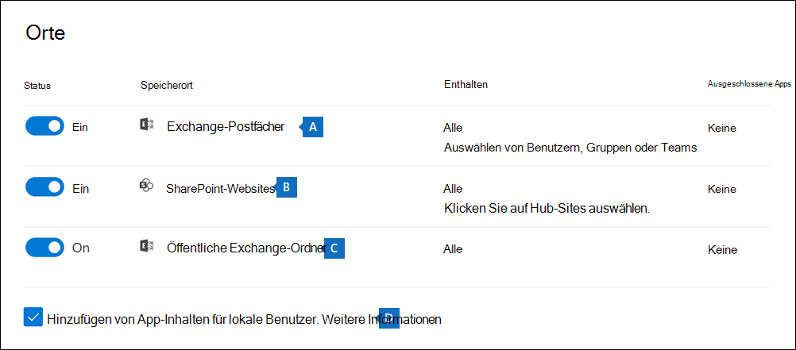

# Erstellen einer InhaltssucheCreate a content search

Sie können das Tool Inhaltssuche eDiscovery im Microsoft 365 Compliance Center verwenden, um nach Inhalten wie E-Mails, Dokumenten und Instant-Messaging-Konversationen in Ihrer Organisation zu suchen.You can use the Content search eDiscovery tool in the Microsoft 365 compliance center to search for in-place content such as email, documents, and instant messaging conversations in your organization. Verwenden Sie dieses Tool, um in den folgenden Microsoft 365-Datenquellen nach Inhalten zu suchen:Use this tool to search for content in these Microsoft 365 data sources:
  
- Exchange Online-PostfächerExchange Online mailboxes

- SharePoint Online-Websites und OneDrive for Business-KontenSharePoint Online sites and OneDrive for Business accounts

- Microsoft TeamsMicrosoft Teams

- Microsoft 365-GruppenMicrosoft 365 Groups

- Yammer-GruppenYammer Groups

Nachdem Sie eine Suche durchgeführt haben, werden die Anzahl der Inhaltsspeicherorte und eine geschätzte Anzahl von Suchergebnissen auf der Flyout-Seite angezeigt.After you run a search, the number of content locations and an estimated number of search results are displayed on the search flyout page. Sie können schnell Statistiken anzeigen, beispielsweise zu den inhaltsspeicherorten mit den meisten Elementen, die der Suchabfrage entsprechen.You can quickly view statistics, such as the content locations that have the most items that match the search query. Nach dem Ausführen einer Suche können Sie eine Vorschau der Ergebnisse anzeigen oder Sie auf einen lokalen Computer exportieren.After you run a search, you can preview the results or export them to a local computer.

## Eine Suche erstellen und ausführenCreate and run a search

Um auf die Seite **Inhaltssuche** im Microsoft 365 Compliance Center zuzugreifen, (um Inhaltssuchen auszuführen und die Ergebnisse in der Vorschau anzuzeigen und zu exportieren), müssen Administratoren, Compliance Officer oder eDiscovery-Manager Mitglied der Rollengruppe "eDiscovery-Manager" im Security & Compliance Center sein.To access to the **Content search** page in the Microsoft 365 compliance center (to run searches and preview results and export results), an administrator, compliance officer, or eDiscovery manager must be a member of the eDiscovery Manager role group in Security & Compliance Center. Weitere Informationen finden Sie unter [Zuweisen von eDiscovery-Berechtigungen](assign-ediscovery-permissions.md).For more information, see [Assign eDiscovery permissions](assign-ediscovery-permissions.md).
  
1. Wechseln Sie zu <https://compliance.microsoft.com> und melden Sie sich mit den Anmeldeinformationen eines Kontos an, dem die entsprechenden Berechtigungen zugewiesen wurden.Go to <https://compliance.microsoft.com> and sign in using the credentials of an account that's been assigned the appropriate permissions.

2. Klicken Sie im linken Navigationsbereich des Microsoft 365 Compliance Centers auf **Alle anzeigen** und dann auf **Inhaltssuche**.In the left navigation pane of the Microsoft 365 compliance center, click **Show all**, and then click **Content search**.

3. Klicken Sie auf der Seite **Inhaltssuche** auf **Neue Suche**.On the **Content search** page, click **New search**.

   > [!NOTE]
   > Die Option **Nach ID-Liste suchen:** erlaubt Ihnen bestimmte E-Mails und andere Elemente in Postfächern anhand einer Liste von Exchange-IDs durchzusuchen.The **Search by ID list** option lets you search for specific email messages and other mailbox items using a list of Exchange IDs. Um eine ID-Listensuche zu erstellen, übermitteln Sie eine durch Kommata getrennte Wertedatei (CSV), in der Sie die spezifischen Postfachelemente angeben, nach denen Sie suchen.To create an ID list search, you submit a comma-separated value (CSV) file that identifies the specific mailbox items to search for. Eine Anleitung finden Sie unter [CSV-Datei für eine ID-Listensuche vorbereiten](csv-file-for-an-id-list-content-search.md).For instructions, see [Prepare a CSV file for an ID list search](csv-file-for-an-id-list-content-search.md).

4. Geben Sie einen Namen für diese Suche ein. Das ist eine optionale Beschreibung, durch die sich die Suche leichter identifizieren lässt.Type a name for the search, an optional description that helps identify the search. Der Name der Suche darf in Ihrer Organisation nur einmalig vorkommen.The name of the search must be unique in your organization.

5. Wählen Sie auf der Seite **Speicherorte** die Inhaltsspeicherorte aus, die Sie durchsuchen möchten.On the **Locations** page, choose the content locations that you want to search. Sie können Postfächer, Websites und öffentliche Ordner durchsuchen.You can search mailboxes, sites, and public folders.

    
  
   1. **Exchange-Postfächer**: Setzen Sie den Schalter auf **Ein** und klicken Sie dann auf **Benutzer, Gruppen oder Teams auswählen**, um die Postfächer anzugeben, die im Haltebereich platziert werden sollen.**Exchange mailboxes**: Set the toggle to **On** and then click **Choose users, groups, or teams** to specify the mailboxes to place on hold. Verwenden Sie das Suchfeld, um Benutzerpostfächer und Verteilergruppen zu finden, (um die Postfächer von Gruppenmitgliedern aufzubewahren), die in den Haltebereich gesetzt werden sollen.Use the search box to find user mailboxes and distribution groups (to place a hold on the mailboxes of group members) to place on hold. Sie können auch Postfächer durchsuchen, die mit einem Microsoft Team (für Kanalnachrichten), einer Office 365-Gruppe und einer Yammer-Gruppe verbunden sind.You can also search the mailbox associated with a Microsoft Team (for channel messages), Office 365 Group, and Yammer Group. Weitere Informationen zu den in Postfächern gespeicherten Anwendungsdaten finden Sie unter [Für eDiscovery in Postfächern gespeicherte Inhalte](what-is-stored-in-exo-mailbox.md).For more information about the application data stored in mailboxes, see [Content stored in mailboxes for eDiscovery](what-is-stored-in-exo-mailbox.md).

   2. **SharePoint-Websites**: Setzen Sie den Schalter auf **Ein** und klicken Sie dann auf **Websites wählen** aus, um SharePoint-Websites und OneDrive-Konten anzugeben, die im Haltebereich platziert werden sollen.**SharePoint sites**: Set the toggle to **On** and then click **Choose sites** to specify SharePoint sites and OneDrive accounts to place on hold. Geben Sie die URL für jede Website ein, die Sie im Haltebereich platzieren möchten.Type the URL for each site that you want to place on hold. Sie können auch die URL für die SharePoint-Website eines Microsoft-Teams, einer Office 365-Gruppe oder einer Yammer-Gruppe hinzufügen.You can also add the URL for the SharePoint site for a Microsoft Team, Office 365 Group, or Yammer Group.
  
   3. **Öffentliche Exchange-Ordner**: Setzen Sie den Schalter auf **Ein**, um alle öffentlichen Ordner in Ihrer Exchange Online-Organisation in den Haltebereich zu versetzen.**Exchange public folders**: Set the toggle to **On** to put all public folders in your Exchange Online organization on hold. Sie können keine bestimmten öffentlichen Ordner auswählen, die im Haltebereich platziert werden sollen.You can't choose specific public folders to put on hold. Lassen Sie den Umschalter deaktiviert, wenn Sie öffentliche Ordner nicht in den Haltebereich platzieren möchten.Leave the toggle switch off if you don't want to put a hold on public folders.
  
   4. Lassen Sie dieses Kontrollkästchen aktiviert, um nach Teams-Inhalten für lokale Benutzer zu suchen.Keep this checkbox selected to search for Teams content for on-premises users. Wenn Sie z. B. alle Exchange-Postfächer in der Organisation durchsuchen und dieses Kontrollkästchen aktiviert ist, wird der cloudbasierte Speicher, der zum Speichern von Teams-Chatdaten für lokale Benutzer verwendet wird, in den Umfang der Suche einbezogen.For example, if you search all Exchange mailboxes in the organization and this checkbox is selected, the cloud-based storage used to store Teams chat data for on-premises users will be included in the scope of the search. Weitere Informationen finden Sie unter [Nach Teams-Chatdaten für lokale Benutzer suchen](search-cloud-based-mailboxes-for-on-premises-users.md).For more information, see [Search for Teams chat data for on-premises users](search-cloud-based-mailboxes-for-on-premises-users.md).

6. Geben Sie auf der Seite **Suchbedingungen definieren** eine Schlüsselwortabfrage ein und fügen Sie der Suchabfrage bei Bedarf Kriterien hinzu.On the **Define your search conditions** page, type a keyword query and add conditions to the search query if necessary.

   

   1. Schlüsselwörter, Nachrichteneigenschaften wie das Sende- und Empfangsdatum oder Dokumenteigenschaften wie Dateinamen oder das Datum angeben, an dem ein Dokument zuletzt geändert wurde.Specify keywords, message properties such as sent and received dates, or document properties such as file names or the date that a document was last changed. Sie können auch komplexere Abfragen mit booleschen Operatoren wie **AND**, **OR**, **NOT** und **NEAR** verwenden.You can use more complex queries that use a Boolean operator, such as **AND**, **OR**, **NOT**, and **NEAR**. Wenn Sie das Schlüsselwortfeld leer lassen, werden alle Inhalte in den angegebenen Inhaltsspeicherorten in die Suchergebnisse eingeschlossen.If you leave the keyword box empty, all content located in the specified content locations is included in the search results. Weitere Informationen finden Sie unter [Stichwortabfragen und Suchbedingungen für eDiscovery](keyword-queries-and-search-conditions.md).For more information, see [Keyword queries and search conditions for eDiscovery](keyword-queries-and-search-conditions.md).

   2. Alternativ können Sie auf das Kontrollkästchen **Schlüsselwortliste anzeigen** klicken, und dann in jede Zeile ein Schlüsselwort eingeben.Alternatively, you can click the **Show keyword list** checkbox and the type a keyword in each row. Wenn Sie dies tun, werden die Schlüsselwörter in den einzelnen Zeilen der erstellten Suchabfrage mit einem logischen (**c:s**)-Operator verknüpft. Dessen Funktionsweise ist mit jener des **OR**-Operators vergleichbar.If you do this, the keywords on each row are connected by a logical operator (**c:s**) that is similar in functionality to the **OR** operator in the search query that's created.

      Gründe für die Verwendung der SchlüsselwortlisteWhy use the keyword list? Sie können Statistiken abrufen, die zeigen, wie viele Elemente den einzelnen Schlüsselwörtern entsprechen.You can get statistics that show how many items match each keyword. Dadurch können Sie schnell erkennen, welche Schlüsselwörter am effektivsten (und am wenigsten effektiv) sind.This can help you quickly identify which keywords are the most (and least) effective. Sie können auch einen (in Klammern eingeschlossenen) Schlüsselwortausdruck in einer Zeile verwenden.You can also use a keyword phrase (surrounded by parentheses) in a row. Weitere Informationen zur Schlüsselwortliste sowie zu Suchstatistiken finden Sie unter [Schlüsselwortstatistik für Suchen abrufen](view-keyword-statistics-for-content-search.md#get-keyword-statistics-for-searches).For more information about the keyword list and search statistics, see [Get keyword statistics for searches](view-keyword-statistics-for-content-search.md#get-keyword-statistics-for-searches).

      > [!NOTE]
      > Um Probleme durch umfangreiche Schlüsselwortlisten zu verringern, ist die Schlüsselwortliste auf 20 Zeilen beschränkt.To help reduce issues caused by large keyword lists, you're limited to a maximum of 20 rows in the keyword list.

   3. Sie können Suchbedingungen hinzufügen, um die Suche einzuschränken und eine verfeinerte Suchergebnisliste zu erhalten.You can add search conditions to narrow a search and return a more refined set of results. Jede Bedingung fügt eine Klausel zur Suchabfrage hinzu, die beim Starten der Suche erstellt und ausgeführt wird.Each condition adds a clause to the search query that is created and run when you start the search. Eine Bedingung ist logisch mit der Schlüsselwortabfrage (im Feld „Schlüsselwort“ angegeben) durch einen logischen (**c:s**)-Operator verknüpft. Dessen Funktionsweise ist mit jener des **OR**-Operators vergleichbar.A condition is logically connected to the keyword query (specified in the keyword box) by a logical operator (**c:c**) that is similar in functionality to the **AND** operator. Dies bedeutet, dass Elemente sowohl die Schlüsselwortabfrage als auch eine oder mehrere Bedingungen erfüllen muss, damit sie in die Suchergebnisse aufgenommen werden.That means that items have to satisfy both the keyword query and one or more conditions to be included in the results. Auf diese Weise können die Suchergebnisse mithilfe von Bedingungen weiter eingegrenzt werden.This is how conditions help to narrow your results. Eine Liste und Beschreibung der Bedingungen, die Sie in einer Suchabfrage verwenden können, finden Sie unter [Suchbedingungen](keyword-queries-and-search-conditions.md#search-conditions).For a list and description of conditions that you can use in a search query, see [Search conditions](keyword-queries-and-search-conditions.md#search-conditions).

7. Überprüfen Sie die Sucheinstellungen (und bearbeiten Sie sie bei Bedarf) und übermitteln Sie dann die Suche, um sie zu starten.Review the search settings (and edit if necessary), and then submit the search to start it.
  
Um erneut auf diese Inhaltssuche oder auf andere Inhaltssuchen, die auf der Seite **Inhaltssuche** aufgelistet sind, zuzugreifen, wählen Sie die gewünschte Suche aus, und klicken Sie dann auf **Öffnen**.To access this content search again or access other content searches listed on the **Content search** page, select the search and then click **Open**.

## Nächste SchritteNext steps

Es folgt eine Liste der nächsten Schritte, die nach dem Erstellen und Ausführen einer Inhaltssuche ausgeführt werden müssen.Here's a list of next steps to perform after you create and run a Content search.

- [Anzeigen von Suchergebnissen in der VorschauPreview search results](preview-ediscovery-search-results.md)

- [Anzeigen von Statistiken für SuchergebnisseView statistics for search results](view-keyword-statistics-for-content-search.md)

- [Exportieren der SuchergebnisseExport search results](export-search-results.md)

- [Exportieren eines SuchberichtsExport a search report](export-a-content-search-report.md)

## Weitere InformationenMore information

Weitere Informationen zur Inhaltssuche, beispielsweise die Suche nach Inhalten in verschiedenen Microsoft 365-Diensten, finden Sie unter [Feature-Referenz für die Inhaltssuche](content-search-reference.md).For more information about Content search, such as searching for content in different Microsoft 365 services, see [Feature reference for Content search](content-search-reference.md).
