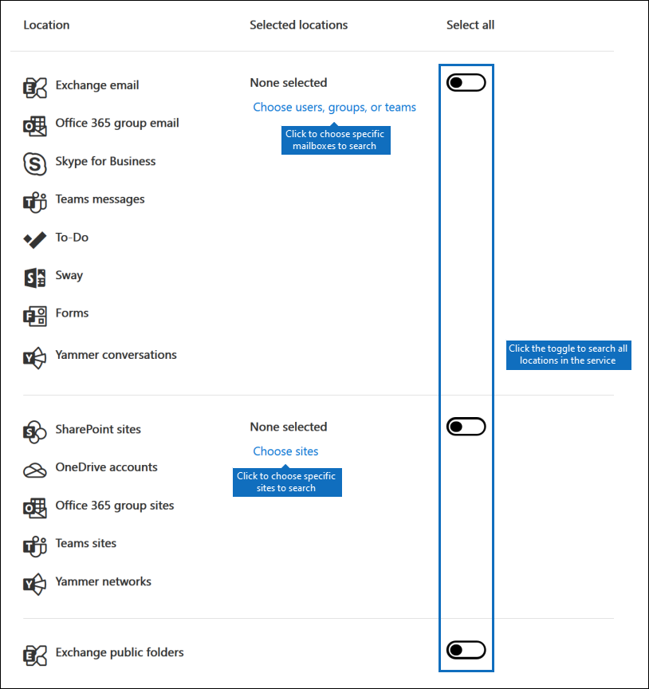
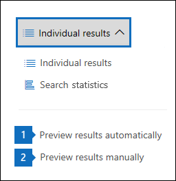
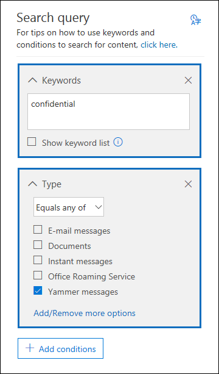

# <a name="content-search"></a>Inhaltssuche

Sie können das Tool Inhaltssuche eDiscovery im Compliance Center in Office 365 oder Microsoft 365 verwenden, um nach Elementen wie E-Mails, Dokumenten und Instant-Messaging-Konversationen in Ihrer Organisation zu suchen. Verwenden Sie dieses Tool, um nach Elementen in folgenden Diensten zu suchen:
  
- Exchange Online-Postfächer

- SharePoint Online-Websites und OneDrive for Business-Konten

- Microsoft Teams

- Microsoft 365-Gruppen

- Yammer-Gruppen

- Skype for Business-Unterhaltungen

Nachdem Sie eine Inhaltssuche durchgeführt haben, werden die Anzahl der Inhaltsspeicherorte und eine geschätzte Anzahl von Suchergebnissen in der Suchstatistik angezeigt. Sie können auch schnell Statistiken anzeigen, beispielsweise zu den inhaltsspeicherorten mit den meisten Elementen, die der Suchabfrage entsprechen. Nach dem Ausführen einer Suche können Sie eine Vorschau der Ergebnisse anzeigen oder Sie auf einen lokalen Computer exportieren.

## <a name="create-a-search"></a>Erstellen einer Suche

Um Zugriff auf die **Inhaltssuche** zu erhalten, Inhaltssuchen auszuführen und die Suchergebnisse in der Vorschau anzuzeigen, müssen Administratoren, Compliance Officer oder eDiscovery-Manager Mitglied der Rollengruppe "eDiscovery-Manager" im Security & Compliance Center sein. Weitere Informationen finden Sie unter [Zuweisen von eDiscovery-Berechtigungen](assign-ediscovery-permissions.md).
  
1. Rufen Sie die Seite [https://compliance.microsoft.com](https://compliance.microsoft.com) auf, und melden Sie sich mit Ihrer Microsoft-E-Mail-Adresse und Ihrem Kennwort an.

2. Klicken Sie im linken Navigationsbereich des Microsoft 365 Compliance Centers auf **Alle anzeigen** und dann auf **Inhaltssuche**.
    
3. Klicken Sie auf der Seite **Inhaltssuche** auf **Neue Suche**.
  
    Oder wählen Sie eine der anderen Suchoptionen:
    
    - **Geführte Suche:** Bei dieser Option wird ein Assistent gestartet, der Sie durch das Erstellen der Suche führt. Die Benutzeroberflächen zum Auswählen von Inhaltsspeicherorten und Erstellen der Suchabfrage sind identisch mit jener der Option **Neue Suche**.
    
    - **Nach ID-Liste suchen:** Mithilfe dieser Option können Sie bestimmte E-Mails und andere Elemente in Postfächern anhand einer Liste von Exchange-IDs suchen. Um eine ID-Listensuche zu erstellen, übermitteln Sie eine durch Kommata getrennte Wertedatei (CSV), in der Sie die spezifischen Postfachelemente angeben, nach denen Sie suchen. Eine Anleitung finden Sie unter [CSV-Datei für eine ID-Listensuche vorbereiten](csv-file-for-an-id-list-content-search.md). 
    
4. Geben Sie unter **Suchabfrage** die folgenden Elemente an:
    
    
  
   - **Zu suchende Schlüsselwörter:** Geben Sie eine Suchabfrage in das Feld **Schlüsselwörter** ein. Sie können Schlüsselwörter, Nachrichteneigenschaften wie das Sende- und Empfangsdatum oder Dokumenteigenschaften wie Dateinamen oder das Datum angeben, an dem ein Dokument zuletzt geändert wurde. Sie können auch komplexere Abfragen mit booleschen Operatoren wie **AND**, **OR**, **NOT** und **NEAR** verwenden. Sie können auch nach vertraulichen Informationen (z. B. Sozialversicherungsnummern) in Dokumenten oder nach Dokumenten suchen, die extern freigegeben wurden. Wenn Sie das Schlüsselwortfeld leer lassen, werden alle Inhalte in den angegebenen Inhaltsspeicherorten in die Suchergebnisse eingeschlossen.

      Alternativ können Sie auf das Kontrollkästchen **Schlüsselwortliste anzeigen** klicken, und dann in jede Zeile ein Schlüsselwort eingeben. Wenn Sie dies tun, werden die Schlüsselwörter in den einzelnen Zeilen der erstellten Suchabfrage mit einem logischen (**c:s**)-Operator verknüpft. Dessen Funktionsweise ist mit jener des **OR**-Operators vergleichbar. 
    
      Gründe für die Verwendung der Schlüsselwortliste Sie können Statistiken abrufen, die zeigen, wie viele Elemente den einzelnen Schlüsselwörtern entsprechen. Dadurch können Sie schnell erkennen, welche Schlüsselwörter am effektivsten (und am wenigsten effektiv) sind. Sie können auch einen (in Klammern eingeschlossenen) Schlüsselwortausdruck in einer Zeile verwenden. Weitere Informationen zu Suchstatistiken finden Sie unter [Anzeigen der Schlüsselwortstatistik für Inhaltssuchergebnisse](view-keyword-statistics-for-content-search.md).

     > [!NOTE]
     > Um Probleme durch umfangreiche Schlüsselwortlisten zu verringern, ist die Schlüsselwortliste jetzt auf 20 Zeilen beschränkt.
    
    - **Bedingungen:** Sie können Suchbedingungen hinzufügen, um die Suche einzuschränken und eine verfeinerte Suchergebnisliste zu erhalten. Jede Bedingung fügt eine Klausel zur Suchabfrage hinzu, die beim Starten der Suche erstellt und ausgeführt wird. Eine Bedingung ist logisch mit der Schlüsselwortabfrage (im Feld „Schlüsselwort“ angegeben) durch einen logischen (**c:s**)-Operator verknüpft. Dessen Funktionsweise ist mit jener des **OR**-Operators vergleichbar. Dies bedeutet, dass Elemente sowohl die Schlüsselwortabfrage als auch eine oder mehrere Bedingungen erfüllen muss, damit sie in die Suchergebnisse aufgenommen werden. Auf diese Weise können die Suchergebnisse mithilfe von Bedingungen weiter eingegrenzt werden. Eine Liste samt Beschreibung der Bedingungen, die Sie in einer Suchabfrage verwenden können, finden Sie im Abschnitt "Suchbedingungen" unter [Schlüsselwortabfragen und Suchbedingungen für die Inhaltssuche](keyword-queries-and-search-conditions.md#search-conditions).
    
       - **Speicherorte:** Wählen Sie die Inhaltsspeicherorte aus, die durchsucht werden sollen.
    
      - **Alle Speicherorte:**  Wählen Sie diese Option aus, um sämtliche Inhaltsspeicherorte in Ihrer Organisation zu durchsuchen. Dazu gehören E-Mails in allen Exchange-Postfächern (einschließlich aller inaktiven Postfächer und Postfächer für alle Microsoft Teams, Yammer-Gruppen und Microsoft 365-Gruppen), alle Skype for Business-Unterhaltungen, alle SharePoint- und OneDrive for Business-Websites (einschließlich der Websites für alle Microsoft Teams, Yammer-Gruppen und Microsoft 365-Gruppen) sowie Elemente in allen öffentlichen Exchange-Ordnern.
    
      - **Bestimmte Speicherorte:**  Wählen Sie diese Option aus, um bestimmte Inhaltsspeicherorte zu durchsuchen. Sie können alle Inhaltsspeicherorte für einen bestimmten Office 365-Dienst durchsuchen (z. B. alle Exchange-Postfächer oder alle SharePoint-Websites durchsuchen), oder bestimmte Speicherorte in jedem der angezeigten Office 365-Dienste nach Inhalten durchsuchen. 
    
        
  
         Sie können auch Verteilergruppen zur Liste der zu durchsuchenden Exchange-Postfächer hinzufügen. Bei Verteilergruppen werden die Postfächer der Gruppenmitglieder durchsucht. Dynamische Verteilergruppen werden nicht unterstützt.
    
       > [!NOTE]
       > Wenn Sie alle Postfach-Speicherorte oder nur bestimmte Postfächer durchsuchen, werden beim Exportieren der Ergebnisse einer Inhaltssuche auch Daten aus anderen Office 365-Anwendungen, die in Benutzerpostfächern gespeichert sind, einbezogen. Diese Daten werden nicht in die geschätzten Suchergebnisse einbezogen und sind für die Vorschau nicht verfügbar. Sie in den Suchergebnisse enthalten, wenn Sie diese exportieren und herunterladen. Weitere Informationen finden Sie unter [In Exchange Online-Postfächern gespeicherte Inhalte](what-is-stored-in-exo-mailbox.md).
   
5. Nachdem Sie Ihre Suchabfrage eingerichtet haben, klicken Sie auf **Speichern und ausführen**.
    
6. Geben Sie auf der Seite **Suche speichern** einen Namen für diese Suche ein sowie eine optionale Beschreibung, durch die Sie sie leichter identifizieren können. Der Name der Suche darf in Ihrer Organisation nur einmalig vorkommen. 
    
7. Klicken Sie auf **Speichern**, um die Suche zu starten. 
    
    Nachdem die Suche gespeichert und ausgeführt wurde, werden alle von der Suche zurückgegebenen Ergebnisse im Ergebnisbereich angezeigt. Je nachdem, welche Einstellungen Sie für die Vorschau gewählt haben, werden die Suchergebnisse direkt angezeigt, oder Sie müssen auf **Vorschau der Ergebnisse** klicken, um diese anzuzeigen. Ausführliche Informationen finden Sie im nächsten Abschnitt. 
    
Um erneut auf diese Inhaltssuche oder auf andere Inhaltssuchen, die auf der Seite **Inhaltssuche** aufgelistet sind, zuzugreifen, wählen Sie die gewünschte Suche aus, und klicken Sie dann auf **Öffnen**. 
  
Um die Ergebnisse zu löschen oder eine neue Suche zu erstellen, klicken Sie auf  **Neue Suche**.
  
## <a name="preview-search-results"></a>Vorschau von Suchergebnissen anzeigen

Es gibt zwei Einstellungsoptionen für die Vorschau der Suchergebnisse. Klicken Sie nach dem Ausführen einer neuen Suche oder dem Öffnen einer vorhandenen Suche auf **Einzelne Ergebnisse**, um die folgenden Vorschaueinstellungen anzuzeigen: 
  

  
1. **Vorschau der Ergebnisse automatisch anzeigen:** Mit dieser Einstellung werden die Suchergebnisse nach dem Suchlauf angezeigt.
    
2. **Vorschau der Ergebnisse manuell anzeigen:** Bei dieser Einstellung werden Platzhalter im Ergebnisbereich sowie die Schaltfläche **Vorschau der Ergebnisse** angezeigt, auf die Sie klicken müssen, damit die Suchergebnisse angezeigt werden. Dies ist die Standardeinstellung. Dass die Suchergebnisse beim Öffnen einer vorhandenen Suche nicht automatisch angezeigt werden trägt dazu bei, die Suchleistung zu verbessern. 
    
Es gibt Beschränkungen hinsichtlich der Anzahl der Elemente, die in der Vorschau angezeigt werden können. Weitere Informationen finden Sie unter [Grenzwerte für die Inhaltssuche](limits-for-content-search.md). 
  
Eine Liste der unterstützten Dateitypen, die in der Vorschau angezeigt werden können, finden Sie unter [Vorschau von Suchergebnissen anzeigen](#previewing-search-results) im Abschnitt "Weitere Informationen zur Inhaltssuche". Wenn für den Dateityp weder die Vorschau noch das Herunterladen einer Kopie des Dokuments unterstützt wird, können Sie auf **Ursprüngliche Datei herunterladen**, um sie auf den lokalen Computer herunterzuladen. Bei ASPX-Webseiten ist die URL der Seite eingeschlossen, Sie haben möglicherweise jedoch keine Berechtigungen zum Zugriff auf die Seite. 
  
Nicht indizierte Elemente können außerdem nicht in der Vorschau angezeigt werden.
  
## <a name="view-information-and-statistics-about-a-search"></a>Anzeigen von Informationen und Statistiken zu einer Suche

Nachdem Sie eine Inhaltssuche erstellt und ausgeführt haben, können Sie Statistiken über die geschätzten Suchergebnisse anzeigen. Dies umfasst eine Übersicht über die Suchergebnisse, die Abfragestatistiken, z. B. die Anzahl der Inhaltsspeicherorte mit Elementen, die der Suchabfrage entsprechen, und die Namen von Inhaltsspeicherorten, die die meisten übereinstimmenden Objekte enthalten. Sie können Statistiken für eine oder mehrere Inhaltssuchen anzeigen. Auf diese Weise können Sie schnell die Ergebnisse für mehrere Suchvorgänge vergleichen und Entscheidungen hinsichtlich der Effektivität Ihrer Suchabfragen treffen.
  
Sie können auch die Such- und Schlüsselwortstatistik in einer CSV-Datei herunterladen. Auf diese Weise können Sie die Filter- und Sortierfunktionen in Excel dazu verwenden, um Ergebnisse zu vergleichen und Berichte für Ihre Suchergebnisse vorzubereiten.
  
So zeigen Sie Suchstatistiken an:
  
1. Klicken Sie auf der Seite **Inhaltssuche** auf **Öffnen**, und klicken Sie dann auf die Suche, deren Statistik Sie anzeigen möchten.
  
2. Klicken Sie auf der Flyoutseite auf **Abfrage öffnen**. 
  
3. Klicken Sie in der Dropdownliste **Einzelne Ergebnisse** auf **Suchstatistiken**.
  
4. Klicken Sie in der Dropdownliste **Typ** auf eine der folgenden Optionen, je nachdem, welche Suchstatistiken Sie anzeigen möchten:
  
    - **Zusammenfassung:** Zeigt Statistiken für jeden Typ von durchsuchten Inhaltsspeicherorten an. Diese umfassen die Anzahl der Inhaltsspeicherorte mit Elementen, die der Suchabfrage entsprechen, sowie die Gesamtanzahl und die Größe von Suchergebniselementen. Dies ist die Standardeinstellung.

    - **Abfragen:** Bei dieser Option werden Statistiken zur Suchabfrage angezeigt. Dazu zählen der Typ des Inhaltsspeicherorts, auf den die Abfragestatistiken zutreffen, ein Teil der Suchabfrage, auf den die Statistiken zutreffen (beachten Sie, dass **Primär** die gesamte Suchabfrage angibt), die Anzahl der Inhaltsspeicherorte mit Elementen, die der Suchabfrage entsprechen, sowie die Gesamtanzahl und Größe der (am angegebenen Inhaltsspeicherort) gefundenen Elemente, die der Suchabfrage entsprechen. Außerdem werden Statistiken für nicht indizierte Elemente (auch als *teilweise indizierte Elemente* bezeichnet) angezeigt. Allerdings sind in den Statistiken nur teilweise indizierte Elemente aus Postfächern enthalten. Teilweise indizierte Elemente aus SharePoint und OneDrive werden nicht in die Statistiken einbezogen.

    - **Am häufigsten verwendete Speicherorte:** Bei dieser Option werden Statistiken zur Anzahl der Elemente angezeigt, die der Suchabfrage an jedem Inhaltsspeicherort entsprechen. Es werden die ersten 1.000 Speicherorte angezeigt.

Weitere Details zu Suchstatistiken finden Sie unter [Anzeigen der Schlüsselwortstatistik für Inhaltssuchergebnisse](view-keyword-statistics-for-content-search.md).
  
## <a name="export-search-results"></a>Exportieren der Suchergebnisse

Nachdem eine Suche erfolgreich ausgeführt wurde, können Sie die Suchergebnisse auf einen lokalen Computer exportieren. Wenn Sie E-Mail-Ergebnisse exportieren, können diese als PST-Dateien oder als einzelne Nachrichten (.msg-Dateien) auf Ihren Computer heruntergeladen werden. Wenn Sie Inhalte aus SharePoint- und OneDrive-Websites exportieren, werden Kopien der systemeigenen Office-Dokumente exportiert. Es gibt noch weitere Dokumente und Berichte, die zusammen mit den Suchergebnissen exportiert werden. Sie können auch den Suchergebnisbericht ohne die eigentlichen Elemente exportieren.
  
So exportieren Sie Suchergebnisse:
  
1. Wählen Sie auf der Seite **Inhaltssuche** die Suche aus, deren Suchergebnisse Sie exportieren möchten. 

2. Klicken Sie auf der Flyout-Seite auf **Ergebnisse exportieren**. Sie können auch einen Suchergebnisbericht exportieren.

3. Füllen Sie die Abschnitte auf der Flyoutseite **Ergebnisse exportieren** aus. Verwenden Sie die Bildlaufleiste, um alle Exportoptionen anzuzeigen.

Ausführlichere Anweisungen und Tipps zur Problembehandlung finden Sie unter:
  
- [Ergebnisse der Inhaltssuche exportieren ](export-search-results.md)

- [Bericht zur Inhaltssuche exportieren](export-a-content-search-report.md)

## <a name="more-information-about-content-search"></a>Weitere Informationen zur Inhaltssuche

In den folgenden Abschnitten finden Sie weitere Informationen zur Inhaltssuche.
  
[Grenzwerte für Inhaltssuchen](#content-search-limits)
  
[Erstellen einer Suchabfrage](#building-a-search-query)
  
[Durchsuchen von OneDrive-Konten](#searching-onedrive-accounts)
  
[Durchsuchen von Microsoft Teams und Microsoft 365-Gruppen](#searching-microsoft-teams-and-microsoft-365-groups)

[Durchsuchen von Yammer-Gruppen](#searching-yammer-groups)
  
[Durchsuchen von inaktiven Postfächern](#searching-inactive-mailboxes)
  
[Durchsuchen von getrennten oder nicht mehr lizensierten Postfächern](#searching-disconnected-or-de-licensed-mailboxes)

[Vorschau von Suchergebnissen anzeigen](#previewing-search-results)
  
[Teilweise indizierte Elemente](#partially-indexed-items)

[Suchen nach Inhalten in einer SharePoint-Multi-Geo-Umgebung](#searching-for-content-in-a-sharepoint-multi-geo-environment)
  
### <a name="content-search-limits"></a>Grenzwerte für Inhaltssuchen

- Eine Beschreibung der Einschränkungen für die Inhaltssuche finden Sie unter [Einschränkungen der Inhaltssuche](limits-for-content-search.md).
  
- Microsoft sammelt Performance-Informationen für Inhaltssuchen, die von allen Organisationen ausgeführt werden. Obwohl sich die Komplexität einer Suchabfrage negativ auf die Suchzeiten auswirken kann, ist die Anzahl der durchsuchten Postfächer der Faktor, der die Suchdauer am stärksten beeinflusst. Microsoft bietet zwar keine Vereinbarung zum Servicelevel (Service Level Agreement, SLA) für Suchzeiten an, in der folgenden Tabelle werden jedoch durchschnittliche Suchzeiten für eine Inhaltssuche basierend auf der Anzahl der in die Suche einbezogenen Postfächer angegeben.
  
  |**Anzahl Postfächer**|**Durchschnittliche Suchzeit**|
  |:-----|:-----|
  |100  <br/> |30 Sekunden  <br/> |
  |1.000  <br/> |45 Sekunden  <br/> |
  |10.000  <br/> |4 Minuten  <br/> |
  |25.000  <br/> |10 Minuten  <br/> |
  |50.000  <br/> |20 Minuten  <br/> |
  |100.000  <br/> |25 Minuten  <br/> |
  |||
  
### <a name="building-a-search-query"></a>Erstellen einer Suchabfrage

Ausführliche Informationen zum Erstellen einer Suchabfrage mithilfe von booleschen Suchoperatoren und Suchbedingungen sowie zum Suchen nach vertraulichen Informationstypen und Inhalten, die für Benutzer außerhalb Ihrer Organisation freigegeben wurden, finden Sie unter [Stichwortabfragen und Suchbedingungen für die Inhaltssuche](keyword-queries-and-search-conditions.md).
  
Bedenken Sie bei der Verwendung einer Schlüsselwortliste zum Erstellen einer Suchabfrage die folgenden Punkte:
  
- Sie müssen das Kontrollkästchen **Stichwortliste anzeigen** aktivieren und dann jedes Schlüsselwort in eine separate Zeile eingeben, um eine Suchabfrage zu erstellen, wobei die Schlüsselwörter (oder Schlüsselwortausdrücke) in jeder Zeile durch den Operator **OR** verbunden sind. Wenn Sie eine Liste von Schlüsselwörtern in das Schlüsselwortfeld einfügen oder nach der Eingabe eines Schlüsselworts die **EINGABETASTE** drücken, werden die Schlüsselwörter nicht mit dem Operator **OR** verbunden. Nachfolgend finden Sie falsche und richtige Beispiele für das Hinzufügen einer Liste von Schlüsselwörtern. 
    
    **Falsch**
    
    
  
    **Richtig**
    
    
  
- Sie können auch eine Liste von Schlüsselwörtern oder Schlüsselwortausdrücken in einer Excel-Datei oder einer reinen Textdatei vorbereiten, und diese Liste dann kopieren und in die Schlüsselwortliste einfügen. Zu diesem Zweck müssen Sie das Kontrollkästchen **Schlüsselwortliste anzeigen** aktivieren. Klicken Sie dann auf die erste Zeile in der Schlüsselwortliste, und fügen Sie Ihre Liste ein. Jede Zeile aus der Excel- oder TXT-Datei wird in eine separate Zeile in der Schlüsselwortliste eingefügt. 
    
- Nachdem Sie eine Abfrage mithilfe der Schlüsselwortliste erstellt haben, ist es ratsam, die Suchabfragesyntax zu überprüfen, um sicherzustellen, dass die Suchabfrage Ihren Vorstellungen entspricht. In der Suchabfrage, die im Detailbereich unter **Abfrage** angezeigt wird, sind die Schlüsselwörter durch den Text **(c:s)** voneinander getrennt. Dies weist darauf hin, dass die Schlüsselwörter durch einen logischen Operator verbunden sind, dessen Funktionsweise mit jener des **OR**-Operators vergleichbar ist. Wenn Ihre Suchabfrage Bedingungen enthält, sind die Schlüsselwörter und die Bedingungen entsprechend durch den Text **(c:c)** voneinander getrennt. Dies weist darauf hin, dass die Schlüsselwörter durch einen logischen Operator verbunden sind, dessen Funktionsweise mit jener des **AND**-Operators vergleichbar ist. Es folgt ein Beispiel für die (im Bereich "Details" angezeigte) Suchabfrage, die sich ergibt, wenn Sie die Schlüsselwortliste und eine Bedingung verwenden. 
    
    
  
- Wenn Sie eine Inhaltssuche ausführen, überprüft Microsoft 365 Ihre Suchanfrage automatisch auf nicht unterstützte Zeichen und auf boolesche Operatoren, die nicht großgeschrieben werden dürfen. Nicht unterstützte Zeichen sind häufig ausgeblendet und verursachen in der Regel einen Suchfehler, oder es werden unerwartete Ergebnisse zurückgegeben. Weitere Informationen zu den nicht unterstützten Zeichen, nach denen gesucht wird, finden Sie unter [Überprüfen der Inhaltssuchabfrage auf Fehler](check-your-content-search-query-for-errors.md).
    
- Wenn eine Suchabfrage Schlüsselwörter für nichtenglische Zeichen enthält (z. B. chinesische Zeichen), können Sie auf **Abfragesprache Land/Region** klicken und einen Kulturcodewert für Sprache und Region für die Suche auswählen. Die standardmäßige Sprache/Region ist neutral. Woran erkennen Sie, dass Sie die Spracheinstellung für eine Inhaltssuche ändern müssen? Wenn Sie sicher sind, dass bestimmte Inhaltsspeicherorte nichtenglische Zeichen enthalten, nach denen Sie suchen, die Suche jedoch keine Ergebnisse zurückgibt, könnte die Spracheinstellung die Ursache sein. 
  
### <a name="searching-onedrive-accounts"></a>Durchsuchen von OneDrive-Konten

- Wie Sie eine Liste der URLs für die OneDrive-Websites in Ihrer Organisation erstellen können erfahren Sie unter [Erstellen einer Liste aller OneDrive-Speicherorte in Ihrer Organisation](https://docs.microsoft.com/onedrive/list-onedrive-urls). Mit dem Skript in diesem Artikel wird eine Textdatei erstellt, die eine Liste aller OneDrive-Websites enthält. Um dieses Skript ausführen zu können, müssen Sie die SharePoint Online-Verwaltungsshell installieren und verwenden. Achten Sie darauf, die URL für die "MeineWebsite"-Domäne Ihrer Organisation an jede OneDrive-Website anzuhängen, die Sie durchsuchen möchten. Dies ist die Domäne, die Ihr gesamtes OneDrive enthält, z. B. `https://contoso-my.sharepoint.com`. Hier ein Beispiel für die URL der OneDrive-Website eines Benutzers: `https://contoso-my.sharepoint.com/personal/sarad_contoso_onmicrosoft.com`.
    
    In den seltenen Fällen, in denen der Benutzerprinzipalname (User Principal Name, UPN) einer Person geändert wird, wird die URL für deren OneDrive-Speicherort so geändert, dass der neue UPN integriert ist. In diesem Fall müssen Sie eine Inhaltssuche entsprechend ändern, indem Sie die neue OneDrive-URL für den Benutzer hinzufügen und die alte entfernen. Weitere Informationen hierzu finden Sie unter [Wie sich UPN-Änderungen auf die OneDrive-URL auswirken](https://docs.microsoft.com/onedrive/upn-changes).
  
### <a name="searching-microsoft-teams-and-microsoft-365-groups"></a>Durchsuchen von Microsoft Teams und Microsoft 365-Gruppen

Sie können das Postfach durchsuchen, das mit einem Microsoft Team oder einer Microsoft 365-Gruppe verknüpft ist. Da Microsoft Teams auf Microsoft 365-Gruppen aufbaut, ist die Suche nach diesen ähnlich. In beiden Fällen wird nur das Gruppen- bzw. das Team-Postfach durchsucht. Die Postfächer der Gruppen- oder Teammitglieder werden nicht durchsucht. Um diese zu durchsuchen, müssen sie eigens zur Suche hinzugefügt werden.
  
Beachten Sie bei der Suche nach Inhalten in Microsoft Teams und Microsoft 365-Gruppen die folgenden Punkte.
  
- Um nach Inhalten zu suchen, die sich in Teams und Microsoft 365-Gruppen befinden, müssen Sie das Postfach und die SharePoint-Website angeben, die mit einem Team oder einer Gruppe verknüpft sind.

- Inhalte aus privaten Kanälen werden in den Postfächern jedes Benutzers, nicht im Postfach des Teams gespeichert. Wenn Sie nach Inhalten in privaten Kanälen suchen möchten, lesen Sie [eDiscovery für private Kanäle](https://docs.microsoft.com/microsoftteams/ediscovery-investigation#ediscovery-of-private-channels).
    
- Führen Sie das Cmdlet **Get-UnifiedGroup** in Exchange Online aus, um Eigenschaften für ein Team oder eine Microsoft 365-Gruppe anzuzeigen. Das ist eine gute Möglichkeit, um die URL für die Website zu erhalten, die mit einem Team oder einer Gruppe verbunden ist. Der folgende Befehl zeigt beispielsweise ausgewählte Eigenschaften für eine Microsoft 365-Gruppe mit dem Namen „Senior Leadership Team“ an: 
    
  ```text
  Get-UnifiedGroup "Senior Leadership Team" | FL DisplayName,Alias,PrimarySmtpAddress,SharePointSiteUrl
  DisplayName            : Senior Leadership Team
  Alias                  : seniorleadershipteam
  PrimarySmtpAddress     : seniorleadershipteam@contoso.onmicrosoft.com
  SharePointSiteUrl      : https://contoso.sharepoint.com/sites/seniorleadershipteam
  ```

    > [!NOTE]
    > Zum Ausführen des **Get-UnifiedGroup**-Cmdlets müssen Sie über die Rolle "Empfänger (nur Anzeige)" in Exchange Online verfügen oder ein Mitglied einer Rollengruppe sein, der die Rolle "Empfänger (nur Anzeige)" zugewiesen wurde. 
  
- Wenn die Mailbox eines Benutzers durchsucht wird, wird kein Team oder keine Microsoft 365-Gruppe durchsucht, in welchem bzw. welcher der Benutzer Mitglied ist. Ähnlich wird bei der Suche in einem Team oder einer Microsoft 365-Gruppe nur das Gruppenpostfach und die Website der Gruppe durchsucht, die Sie angeben. Die Postfächer und OneDrive for Business-Konten von Gruppenmitgliedern werden nicht durchsucht, es sei denn, Sie fügen sie der Suche explizit hinzu.

- Um eine Liste der Mitglieder eines Teams oder einer Microsoft 365-Gruppe zu erhalten, können Sie die Eigenschaften auf der Seite **Start \> Gruppen** im Microsoft 365 Admin Center anzeigen. Alternativ können Sie den folgenden Befehl in Exchange Online-PowerShell ausführen: 

  ```powershell
  Get-UnifiedGroupLinks <group or team name> -LinkType Members | FL DisplayName,PrimarySmtpAddress
  ```

    > [!NOTE]
    > Zum Ausführen des **Get-UnifiedGroupLinks**-Cmdlets müssen Sie über die Rolle "Empfänger (nur Anzeige)" in Exchange Online verfügen oder ein Mitglied einer Rollengruppe sein, der die Rolle "Empfänger (nur Anzeige)" zugewiesen wurde. 
  
- Unterhaltungen, die Bestandteil eines Teams-Kanals sind, werden in dem Postfach gespeichert, das dem Team zugeordnet ist. Gleichermaßen werden Dateien, die Teammitglieder in einem Kanal freigeben, auf der SharePoint-Website des Teams gespeichert. Daher müssen Sie das Postfach und die SharePoint-Website des Teams als Inhaltsspeicherort hinzufügen, um Unterhaltungen und Dateien in einem Kanal zu durchsuchen.
    
- Demgegenüber werden Unterhaltungen, die Bestandteil der Chatliste in Teams sind, in den Exchange Online-Postfächern der Benutzer gespeichert, die am Chat teilnehmen. Und in Chatunterhaltungen freigegebene Dateien werden im OneDrive for Business-Konto des Benutzers gespeichert, der die Datei freigibt. Daher müssen Sie die Postfächer und OneDrive for Business-Konten der jeweiligen Benutzer als Inhaltsspeicherorte hinzufügen, um Unterhaltungen und Dateien in der Chatliste zu durchsuchen.
    
    > [!NOTE]
    > Benutzer mit lokalen Postfächern könnten in einer Exchange-Hybridbereitstellung an Unterhaltungen teilnehmen, die Teil der Chat-Liste in Microsoft Teams sind. In diesem Fall können Inhalte aus diesen Unterhaltungen ebenfalls durchsucht werden, weil sie in einem Cloud-basierten Speicherbereich (als *Cloud-basiertes Postfach für lokale Benutzer* bezeichnet) für Benutzer gespeichert sind, die über ein lokales Postfach verfügen. Weitere Informationen finden Sie unter [Nach Teams-Chatdaten für lokale Benutzer suchen](search-cloud-based-mailboxes-for-on-premises-users.md).
  
- Jedes Team bzw. jeder Team-Kanal enthält ein Wiki zum Erstellen von Notizen und zum Thema Zusammenarbeit. Die Wiki-Inhalte werden automatisch in einer Datei im MHT-Format gespeichert. Diese Datei wird in der Dokumentbibliothek für Wiki-Daten auf der SharePoint-Website des Teams gespeichert. Sie können das Tool für die Inhaltssuche zum Durchsuchen des Wikis verwenden, indem Sie die SharePoint-Website des Teams als den zu durchsuchenden Inhaltsspeicherort angeben.

    > [!NOTE]
    > Die Möglichkeit zum Durchsuchen des Wikis für ein Team oder einen Kanal (beim Durchsuchen der SharePoint-Website des Teams) wurde am 22. Juni 2017 freigegeben. Es können Wiki-Seiten, die an diesem Datum oder später gespeichert oder aktualisiert wurden, durchsucht werden. Wiki-Seiten, die das letzte Mal vor diesem Datum gespeichert oder aktualisiert wurden, sind nicht für die Suche verfügbar.

- Zusammenfassungsinformationen für Besprechungen und Anrufe in einem Teams-Kanal werden außerdem in den Postfächern der Benutzer gespeichert, die an der Besprechung oder dem Anruf teilgenommen haben. Dies bedeutet, dass Sie die Inhaltssuche verwenden können, um diese Zusammenfassungen zu durchsuchen. Zusammenfassungsinformationen umfassen Folgendes:
  
  - Datum, Startzeit, Endzeit und Dauer einer Besprechung oder eines Anrufs

  - Das Datum und die Uhrzeit, zu denen die einzelnen Teilnehmer der Besprechung oder dem Anruf beigetreten sind oder diese verlassen haben

  - An Voicemail gesendete Anrufe

  - Verpasste oder unbeantwortete Anrufe

  - Anrufweiterleitungen, die als zwei getrennte Anrufe dargestellt werden

  Es kann bis zu acht Stunden dauern, bis durchsuchbare Zusammenfassungen zu Besprechungen und Anrufen verfügbar sind.

  In den Suchergebnissen werden Besprechungszusammenfassungen im Feld **Typ** als **Besprechung** und Anrufübersichten als **Anruf** gekennzeichnet. Außerdem werden Unterhaltungen, die zu einem Teams-Kanals gehören und 1xN-Chats sind, im Feld **Typ** als **Sofortnachricht** gekennzeichnet.
  
  

   Weitere Informationen finden Sie unter [Microsoft Teams launches eDiscovery for calls and meetings](https://techcommunity.microsoft.com/t5/microsoft-teams-blog/microsoft-teams-launches-ediscovery-for-calling-and-meetings/ba-p/210947) (Microsoft Teams startet eDiscovery für Anrufe und Besprechungen).

- Karteninhalte, die von Apps in Teams-Kanälen, 1:1-Chats und 1xN-Chats erzeugt werden, werden in Postfächern gespeichert und können durchsucht werden. Eine *Karte* ist ein UI-Container für kurze Inhaltsteile. Karten können mehrere Eigenschaften und Anhänge haben und können Schaltflächen enthalten, die Kartenaktionen auslösen können. Weitere Informationen finden Sie unter:[Karten](https://docs.microsoft.com/microsoftteams/platform/task-modules-and-cards/what-are-cards)

  Wie bei anderen Teams-Inhalten hängt der Speicherort der Karteninhalte davon ab, wo die Karte verwendet wurde. Inhalte für Karten, die in einem Teams-Kanal verwendet werden, werden im Postfach der Teams-Gruppe gespeichert. Karteninhalte für 1:1- und 1xN-Chats werden in den Postfächern der Chat-Teilnehmer gespeichert.

  Um nach Karteninhalten zu suchen, können Sie die Suchbedingungen `kind:microsoftteams` oder `itemclass:IPM.SkypeTeams.Message` verwenden. Beim Überprüfen von Suchergebnissen haben Karteninhalte, die von Bots in einem Teams-Kanal generiert wurden, die E-Mail-Eigenschaft **Absender/Autor** als `<appname>@teams.microsoft.com`, wobei `appname` der Name der App ist, die den Karteninhalt generiert hat. Wenn der Karteninhalt von einem Benutzer erzeugt wurde, identifiziert der Wert **Sender/Autor** den Benutzer.

  Wenn Sie den Karteninhalt in den Ergebnissen der Inhaltssuche anzeigen, erscheint der Inhalt als Anhang der Nachricht. Der Anhang trägt den Namen `appname.html`, wobei `appname` der Name der App ist, die den Karteninhalt erzeugt hat. Die folgenden Screenshots zeigen, wie Karteninhalte (für eine App namens Asana) in Teams und in den Suchergebnissen erscheinen.

  **Karteninhalt in Teams**

  

  **Karteninhalt in den Suchergebnissen**
  
  

  > [!NOTE]
  > Um Bilder von Karteninhalten in den Suchergebnissen zu diesem Zeitpunkt anzuzeigen (wie die Häkchen im vorherigen Screenshot), müssen Sie bei Teams angemeldet sein (unter https://teams.microsoft.com) in einem anderen Tab in derselben Browsersitzung, in der Sie die Suchergebnisse anzeigen. Andernfalls werden Bildplatzhalter angezeigt.

- Sie können die E-Mail-Eigenschaft **Art** oder die Suchbedingung **Art der Nachricht** verwenden, um gezielt nach Inhalten in Teams zu suchen.
  
  - Wenn Sie die Eigenschaft **Art** als Teil der Keywordsuchabfrage verwenden möchten, geben Sie im Feld **Schlüsselwörter** bei einer Suchabfrage `kind:microsoftteams` ein.

    
  
  - Wenn Sie eine Suchbedingung verwenden möchten, fügen Sie die Bedingung **Art der Nachricht** hinzu, und verwenden Sie den Wert `microsoftteams`.

    

   Bedingungen sind durch den Operator **AND** logisch mit der Schlüsselwortabfrage verknüpft. Dies bedeutet, dass ein Element sowohl der Schlüsselwortabfrage als auch der Suchbedingung entsprechen muss, damit es in den Suchergebnissen zurückgegeben wird. Weitere Informationen finden Sie im Abschnitt "Richtlinien für die Verwendung von Bedingungen" unter [Stichwortabfragen und Suchbedingungen für die Inhaltssuche](keyword-queries-and-search-conditions.md#guidelines-for-using-conditions).
  
### <a name="searching-yammer-groups"></a>Durchsuchen von Yammer-Gruppen

Sie können die **ItemClass**-E-Mail-Eigenschaft oder die **Typ**-Suchbedingung verwenden, um gezielt nach Unterhaltungselementen in Yammer-Gruppen zu suchen.

  - Wenn Sie die **ItemClass**-Eigenschaft als Teil der Schlüsselwort-Suchabfrage verwenden möchten, können Sie im Feld **Schlüsselwort** einer Suchabfrage eine (oder alle) der folgenden Eigenschaft:Wert-Paare eingeben:

     - ItemClass:IPM.Yammer.message
     - ItemClass:IPM.Yammer.poll
     - ItemClass:IPM.Yammer.praise
     - ItemClass:IPM.Yammer.question
  
    Sie können z. B. die folgende Suchabfrage verwenden, um Yammer-Nachrichten und -Lob-Elemente zurückzugeben:

    
  
  - Alternativ hierzu können Sie die **Typ**-E-Mail-Bedingung verwenden und **Yammer-Nachrichten** auswählen, um Yammer-Elemente zurückzugeben. Die folgende Suchabfrage gibt beispielsweise alle Yammer-Unterhaltungen zurück, die das Schlüsselwort "vertraulich" enthalten. 

    

### <a name="searching-inactive-mailboxes"></a>Durchsuchen von inaktiven Postfächern

Im Rahmen einer Inhaltssuche können auch inaktive Postfächer durchsucht werden. Um eine Liste der inaktiven Postfächer in Ihrer Organisation abzurufen, führen Sie in Exchange Online PowerShell den Befehl `Get-Mailbox -InactiveMailboxOnly` aus. Alternativ können Sie im Security & Compliance Center zu **Information governance**\> **Aufbewahrung** wechseln, und dann auf **Weitere** \> **Inaktive Postfächer** klicken.
  
Folgende Dinge sollten beim Durchsuchen inaktiver Postfächer beachtet werden:

- Wenn eine bestehende Inhaltssuche ein Benutzerpostfach einschließt und dieses wird deaktiviert, wird es weiterhin nach Inhalten durchsucht, wenn die Suche nach der Deaktivierung erneut ausgeführt wird.

- Es kann vorkommen, dass ein Benutzer über ein aktives und ein inaktives Postfach mit der gleichen SMTP-Adresse verfügt. In solchen Fällen wird nur jenes Postfach durchsucht, das Sie als Ort für eine Inhaltssuche auswählen. Anders ausgedrückt: Wenn Sie das Postfach eines Benutzers zu einer Suche hinzufügen, können Sie nicht davon ausgehen, dass sowohl aktive als auch inaktive Postfächer durchsucht werden. Nur das Postfach, das Sie der Suche explizit hinzufügen, wird durchsucht.

- Sie können die Security & Compliance Center-PowerShell verwenden, um eine Inhaltssuche zum Durchsuchen eines inaktiven Postfachs zu erstellen. Dazu müssen Sie vor der E-Mail-Adresse des inaktiven Postfachs einen Punkt ( . ) einfügen. Mit dem folgenden Befehl wird beispielsweise eine Inhaltssuche erstellt, die ein inaktives Postfach mit der E-Mail-Adresse pavelb@contoso.onmicrosoft.com durchsucht:

   ```powershell
   New-ComplianceSearch -Name InactiveMailboxSearch -ExchangeLocation .pavelb@contoso.onmicrosoft.com -AllowNotFoundExchangeLocationsEnabled $true
   ```

- Es wird dringend empfohlen, die Verwendung der gleichen SMTP-Adresse für ein aktives und ein inaktives Postfach zu vermeiden. Wenn eine SMTP-Adresse, die derzeit einem inaktiven Postfach zugeordnet ist, wiederverwendet werden soll, wird empfohlen, das inaktive Postfach oder dessen Inhalt in einem aktiven Postfach (bzw. im Archiv eines aktiven Postfachs) rückzuspeichern, und das inaktive Postfach anschließend zu löschen. Weitere Informationen hierzu finden Sie in einem der folgenden Beiträge:

  - [Wiederherstellen eines inaktiven Postfachs in Office 365](recover-an-inactive-mailbox.md)

  - [Rückspeichern eines inaktiven Postfachs in Office 365](restore-an-inactive-mailbox.md)

  - [Löschen eines inaktiven Postfachs in Office 365](delete-an-inactive-mailbox.md)

### <a name="searching-disconnected-or-de-licensed-mailboxes"></a>Durchsuchen von getrennten oder nicht mehr lizensierten Postfächern

Wenn die Exchange Online-Lizenz (oder die gesamte Microsoft 365-Lizenz) von einem Benutzerkonto oder in Azure Active Directory entfernt wird, wird das Postfach des Benutzers zu einem *nicht mehr verbundenen* Postfach. Dies bedeutet, dass das Postfach nicht mehr mit dem Benutzerkonto verknüpft ist. Beim Durchsuchen von getrennten Postfächern geschieht Folgendes:

- Wenn die Lizenz aus einem Postfach entfernt wird, kann das Postfach nicht mehr durchsucht werden. 

- Schließt eine bestehende Inhaltssuche ein Postfach ein, aus dem die Lizenz entfernt wurde, werden bei erneuten Inhaltssuchen keine Suchergebnisse aus dem getrennten Postfach angezeigt.

- Wenn Sie das Cmdlet **New-ComplianceSearch** zum Erstellen einer Inhaltssuche verwenden, und ein getrenntes Postfach als Exchange-Inhaltsspeicherort für die Suche festlegen, gibt die Inhaltssuche keine Suchergebnisse aus dem getrennten Postfach zurück.

Wenn Sie die Daten in einem getrennten Postfach beibehalten müssen, damit sie durchsuchbar sind, müssen Sie eine Aufbewahrung für das Postfach einrichten, bevor Sie die Lizenz entfernen. Dadurch bleiben die Daten erhalten und das getrennte Postfach durchsuchbar, bis die Aufbewahrung entfernt wird. Weitere Informationen zu Aufbewahrungen finden Sie unter [Identifizieren des Typs der Aufbewahrung für ein Exchange Online-Postfach](identify-a-hold-on-an-exchange-online-mailbox.md)

### <a name="previewing-search-results"></a>Vorschau der Suchergebnisse anzeigen

Unterstützte Dateitypen können im Vorschaufenster angezeigt werden. Wenn ein Dateityp nicht unterstützt wird, müssen Sie eine Kopie der Datei auf Ihren lokalen Computer herunterladen, um sie anzeigen zu können. Die folgenden Dateitypen werden unterstützt und können im Suchergebnisbereich in einer Vorschau angezeigt werden.
  
- .TXT, .HTML, .MHTML
    
- .EML
    
- .DOC, .DOCX, .DOCM
    
- .PPTM, .PPTX
    
- .PDF
    
Darüber hinaus werden die folgenden Dateicontainertypen unterstützt. Eine Liste der Dateien in einem Container können Sie im Vorschaubereich anzeigen.
  
- .ZIP

- .GZIP

### <a name="partially-indexed-items"></a>Teilweise indizierte Elemente

- Wie zuvor erläutert, werden teilweise indizierte Elemente in Postfächern in die geschätzten Suchergebnisse einbezogen. Teilweise indizierte Elemente aus SharePoint und OneDrive werden nicht in die geschätzten Suchergebnissen einbezogen.

- Wenn ein teilweise indiziertes Element der Suchabfrage entspricht (weil andere Nachrichten- oder Dokumenteigenschaften die Suchkriterien erfüllen), wird es nicht in die geschätzte Anzahl nicht indizierter Elemente einbezogen. Wenn ein teilweise indiziertes Element durch die Suchkriterien ausgeschlossen ist, wird es nicht in die geschätzte Anzahl nicht indizierter Elemente einbezogen. Weitere Informationen finden Sie unter [Teilweise indizierte Elemente in der Inhaltssuche in Office 365](partially-indexed-items-in-content-search.md).

### <a name="searching-for-content-in-a-sharepoint-multi-geo-environment"></a>Suchen nach Inhalten in einer SharePoint-Multi-Geo-Umgebung

Wenn es erforderlich ist, dass ein eDiscovery-Manager nach Inhalten in SharePoint und OneDrive in verschiedenen Regionen in einer [SharePoint-Multi-Geo-Umgebung](https://go.microsoft.com/fwlink/?linkid=860840) sucht, müssen Sie die folgenden Schritte ausführen, um dies zu erreichen:

1. Erstellen Sie ein separates Benutzerkonto für jeden geografischen Satellitenstandort, den der eDiscovery-Manager durchsuchen muss. Wenn Sie nach Inhalten auf Websites an diesem geografischen Standort suchen möchten, muss sich der eDiscovery-Manager bei dem Konto anmelden, das Sie für diesen Standort erstellt haben, und dann eine Inhaltssuche ausführen.

2. Erstellen Sie einen Suchberechtigungsfilter (und das entsprechende Benutzerkonto) für jeden geografischen Satellitenstandort, den der eDiscovery-Manager durchsuchen muss. Jeder dieser Suchberechtigungsfilter beschränkt den Umfang der Inhaltssuche auf einen bestimmten geografischen Standort, wenn der eDiscovery-Manager bei dem diesem Standort zugeordneten Benutzerkonto angemeldet ist.

> [!TIP]
> Wenn Sie das Suchtool in [Advanced eDiscovery](overview-ediscovery-20.md) verwenden, brauchen Sie diese Strategie nicht zu verwenden. Der Grund dafür ist, dass beim Durchsuchen von SharePoint-Websites und OneDrive-Konten in Advanced eDiscovery alle Datacenter durchsucht werden. Sie müssen diese Strategie der regionsspezifischen Benutzerkonten und Suchberechtigungsfilter nur bei Verwendung des Tools für die Inhaltssuche und beim Ausführen von Suchvorgängen verwenden, die [eDiscovery-Fällen](ediscovery-cases.md) zugeordnet sind.

Angenommen, ein eDiscovery-Manager muss nach SharePoint- und OneDrive-Inhalten an Satellitenstandorten in Nordamerika, Europa, und Asien-Pazifik suchen. Der erste Schritt besteht darin, drei Benutzerkonten zu erstellen (jeweils eines für jeden Standort). Als Nächstes erstellen Sie drei Suchberechtigungsfilter (jeweils einen für jeden Standort *und* das entsprechende Benutzerkonto). Nachfolgend finden Sie Beispiele für die drei Suchberechtigungsfilter für dieses Szenario. In jedem dieser Beispiele gibt die **Region** den Standort des SharePoint-Datacenters für diesen geografischen Raum an, und der Parameter **Benutzer** gibt das entsprechende Benutzerkonto an.

**Nordamerika**

```powershell
New-ComplianceSecurityFilter -FilterName "SPMultiGeo-NAM" -Users ediscovery-nam@contoso.com -Region NAM -Action ALL
```

**Europa**

```powershell
New-ComplianceSecurityFilter -FilterName "SPMultiGeo-EUR" -Users ediscovery-eur@contoso.com -Region EUR -Action ALL
```

**Asiatisch-pazifischer Raum**

```powershell
New-ComplianceSecurityFilter -FilterName "SPMultiGeo-APC" -Users ediscovery-apc@contoso.com -Region APC -Action ALL
```

Beachten Sie die folgenden Punkte, wenn Sie Suchberechtigungsfilter verwenden, um nach Inhalten in Multi-Geo-Umgebungen zu suchen:

- Der Parameter **Region** leitet Suchvorgänge an den angegebenen Satellitenstandort weiter. Wenn ein eDiscovery-Manager nur SharePoint- und OneDrive-Websites außerhalb der im Suchberechtigungsfilter angegebenen Region durchsucht, werden keine Suchergebnisse zurückgegeben. 

- Der Parameter **Region** steuert keine Suchvorgänge in Exchange-Postfächern. Beim Durchsuchen von Postfächern werden alle Datacenter durchsucht.

Weitere Informationen zum Verwenden von Suchberechtigungsfiltern in einer Multi-Geo-Umgebung finden Sie im Abschnitt "Durchsuchen und Exportieren von Inhalten in Multi-Geo-Umgebungen" unter [Einrichten von Compliance-Grenzwerten für eDiscovery-Untersuchungen](set-up-compliance-boundaries.md#searching-and-exporting-content-in-multi-geo-environments).
