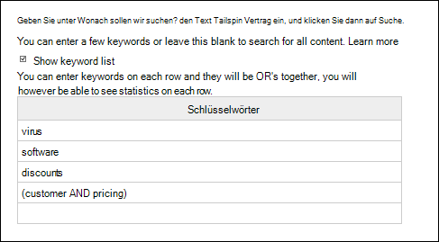

# <a name="content-search"></a><span data-ttu-id="6a080-106">Inhaltssuche</span><span class="sxs-lookup"><span data-stu-id="6a080-106">Content Search</span></span>

<span data-ttu-id="6a080-107">Sie können das Inhaltssuche-eDiscovery-Tool im Compliance Center in Office 365 oder Microsoft 365 verwenden, um in Ihrer Organisation nach internen Elementen wie E-Mails, Dokumenten und Instant Messaging-Unterhaltungen zu suchen.</span><span class="sxs-lookup"><span data-stu-id="6a080-107">You can use the Content Search eDiscovery tool in the compliance center in Office 365 or Microsoft 365 to search for in-place items such as email, documents, and instant messaging conversations in your organization.</span></span> <span data-ttu-id="6a080-108">Verwenden Sie dieses Tool, um nach Elementen in folgenden Diensten zu suchen:</span><span class="sxs-lookup"><span data-stu-id="6a080-108">Use this tool to search for items in these services:</span></span>
  
- <span data-ttu-id="6a080-109">Exchange-Postfächer und öffentliche Ordner</span><span class="sxs-lookup"><span data-stu-id="6a080-109">Exchange Online mailboxes and public folders</span></span>
    
- <span data-ttu-id="6a080-110">SharePoint Online-Websites und OneDrive for Business-Konten</span><span class="sxs-lookup"><span data-stu-id="6a080-110">SharePoint Online sites and OneDrive for Business accounts</span></span>
    
- <span data-ttu-id="6a080-111">Skype for Business-Unterhaltungen</span><span class="sxs-lookup"><span data-stu-id="6a080-111">Skype for Business conversations</span></span>
    
- <span data-ttu-id="6a080-112">Microsoft Teams</span><span class="sxs-lookup"><span data-stu-id="6a080-112">Microsoft Teams</span></span> 

- <span data-ttu-id="6a080-113">Microsoft 365-Gruppen</span><span class="sxs-lookup"><span data-stu-id="6a080-113">Microsoft 365 Groups</span></span>

- <span data-ttu-id="6a080-114">Yammer-Gruppen</span><span class="sxs-lookup"><span data-stu-id="6a080-114">Yammer Groups</span></span> 
    
<span data-ttu-id="6a080-115">Nach dem Ausführen einer Inhaltssuche werden die Anzahl der Inhaltsspeicherorte und die geschätzte Anzahl der Suchergebnisse in den Suchstatistiken angezeigt.</span><span class="sxs-lookup"><span data-stu-id="6a080-115">After you run a Content Search, the number of content locations and an estimated number of search results are displayed in the search statistics.</span></span> <span data-ttu-id="6a080-116">Sie können auch schnell Statistiken anzeigen, beispielsweise zu den inhaltsspeicherorten mit den meisten Elementen, die der Suchabfrage entsprechen.</span><span class="sxs-lookup"><span data-stu-id="6a080-116">You can also quickly view statistics, such as the content locations that have the most items that match the search query.</span></span> <span data-ttu-id="6a080-117">Nach dem Ausführen einer Suche können Sie eine Vorschau der Ergebnisse anzeigen oder Sie auf einen lokalen Computer exportieren.</span><span class="sxs-lookup"><span data-stu-id="6a080-117">After you run a search, you can preview the results or export them to a local computer.</span></span>

## <a name="create-a-search"></a><span data-ttu-id="6a080-118">Erstellen einer Suche</span><span class="sxs-lookup"><span data-stu-id="6a080-118">Create a search</span></span>

<span data-ttu-id="6a080-119">Um Zugriff auf die **Inhaltssuche** zu erhalten, Inhaltssuchen auszuführen und die Suchergebnisse in der Vorschau anzuzeigen, müssen Administratoren, Compliance Officer oder eDiscovery-Manager Mitglied der Rollengruppe "eDiscovery-Manager" im Security & Compliance Center sein.</span><span class="sxs-lookup"><span data-stu-id="6a080-119">To have access to the **Content search** page to run searches and preview and export search results, an administrator, compliance officer, or eDiscovery manager must be a member of the eDiscovery Manager role group in the Security & Compliance Center.</span></span> <span data-ttu-id="6a080-120">Weitere Informationen finden Sie unter [Zuweisen von eDiscovery-Berechtigungen](assign-ediscovery-permissions.md).</span><span class="sxs-lookup"><span data-stu-id="6a080-120">For more information, see [Assign eDiscovery permissions](assign-ediscovery-permissions.md).</span></span>
  
1. <span data-ttu-id="6a080-121">Rufen Sie die Seite [https://protection.office.com](https://protection.office.com) auf, und melden Sie sich mit Ihrer Microsoft-E-Mail-Adresse und Ihrem Kennwort an.</span><span class="sxs-lookup"><span data-stu-id="6a080-121">Go to [https://protection.office.com](https://protection.office.com) and sign in using your Microsoft email address and password.</span></span>
    
2. <span data-ttu-id="6a080-122">Klicken Sie auf **Suche** \> **Inhaltssuche**.</span><span class="sxs-lookup"><span data-stu-id="6a080-122">Click **Search** \> **Content search**.</span></span>
    
3. <span data-ttu-id="6a080-123">Klicken Sie auf der Seite **Suche** auf den Pfeil neben  **Neue Suche**.</span><span class="sxs-lookup"><span data-stu-id="6a080-123">On the **Search** page, click the arrow next to  **New search**.</span></span> 
    
    
  
    <span data-ttu-id="6a080-125">Sie können eine der folgenden Optionen auswählen:</span><span class="sxs-lookup"><span data-stu-id="6a080-125">You can choose one of the following options:</span></span>
    
    - <span data-ttu-id="6a080-126">**Geführte Suche:** Bei dieser Option wird ein Assistent gestartet, der Sie durch das Erstellen der Suche führt.</span><span class="sxs-lookup"><span data-stu-id="6a080-126">**Guided search:** This option starts a wizard that guides you through the creating the search.</span></span> <span data-ttu-id="6a080-127">Die Benutzeroberflächen zum Auswählen von Inhaltsspeicherorten und Erstellen der Suchabfrage sind identisch mit jener der Option **Neue Suche**.</span><span class="sxs-lookup"><span data-stu-id="6a080-127">The user interface to select content locations and build the search query are the same as the **New search** option.</span></span> 
    
    - <span data-ttu-id="6a080-128">**Neue Suche:** Bei dieser Option wird eine aktualisierte Benutzeroberfläche zum Erstellen einer Suche angezeigt.</span><span class="sxs-lookup"><span data-stu-id="6a080-128">**New search:** This option displays an updated user interface to create a search.</span></span> <span data-ttu-id="6a080-129">Dies ist die Standardoption, wenn Sie auf **Neue Suche** klicken.</span><span class="sxs-lookup"><span data-stu-id="6a080-129">This is the default option if you click **New search**.</span></span>
    
    - <span data-ttu-id="6a080-130">**Suche anhand einer ID-Liste:** Mithilfe dieser Option können Sie nach bestimmten E-Mail-Nachrichten und anderen Postfachelementen anhand einer Liste von Exchange-IDs suchen.</span><span class="sxs-lookup"><span data-stu-id="6a080-130">**Search by ID List:** This option lets you search for specific email messages and other mailbox items using a list of Exchange IDs.</span></span> <span data-ttu-id="6a080-131">Zum Erstellen einer Suche anhand einer ID-Liste (formell als "gezielte Suche" bezeichnet) übermitteln Sie eine durch Trennzeichen getrennte Datei (CSV), in der die Postfachelemente angegeben werden, nach denen gesucht werden soll.</span><span class="sxs-lookup"><span data-stu-id="6a080-131">To create an ID list search (formally called a targeted search), you submit a comma-separated value (CSV) file that identifies the specific mailbox items to search for.</span></span> <span data-ttu-id="6a080-132">Anweisungen hierzu finden Sie unter [Erstellen einer CSV-Datei für eine Inhaltssuche anhand einer ID-Liste in Office 365](csv-file-for-an-id-list-content-search.md).</span><span class="sxs-lookup"><span data-stu-id="6a080-132">For instructions, see [Prepare a CSV file for an ID list Content Search in Office 365](csv-file-for-an-id-list-content-search.md).</span></span>
    
    <span data-ttu-id="6a080-133">Die restlichen Schritte in diesem Verfahren entsprechen dem standardmäßigen neuen Such-Workflow.</span><span class="sxs-lookup"><span data-stu-id="6a080-133">The remainder of the steps in this procedure follows the default new search workflow.</span></span>
    
4. <span data-ttu-id="6a080-134">Klicken Sie in der Dropdownliste auf **Neue Suche**.</span><span class="sxs-lookup"><span data-stu-id="6a080-134">Click **New search** in the drop-down list.</span></span> 
    
5. <span data-ttu-id="6a080-135">Geben Sie unter **Suchabfrage** die folgenden Elemente an:</span><span class="sxs-lookup"><span data-stu-id="6a080-135">Under **Search query**, specify the following things:</span></span>
    
    
  
   - <span data-ttu-id="6a080-137">**Zu suchende Schlüsselwörter:** Geben Sie eine Suchabfrage in das Feld **Schlüsselwörter** ein.</span><span class="sxs-lookup"><span data-stu-id="6a080-137">**Keywords to search for:** Type a search query in **Keywords** box.</span></span> <span data-ttu-id="6a080-138">Sie können Schlüsselwörter, Nachrichteneigenschaften wie das Sende- und Empfangsdatum oder Dokumenteigenschaften wie Dateinamen oder das Datum angeben, an dem ein Dokument zuletzt geändert wurde.</span><span class="sxs-lookup"><span data-stu-id="6a080-138">You can specify keywords, message properties such as sent and received dates, or document properties such as file names or the date that a document was last changed.</span></span> <span data-ttu-id="6a080-139">Sie können auch komplexere Abfragen mit booleschen Operatoren wie **AND**, **OR**, **NOT** und **NEAR** verwenden.</span><span class="sxs-lookup"><span data-stu-id="6a080-139">You can use more complex queries that use a Boolean operator, such as **AND**, **OR**, **NOT**, and **NEAR**.</span></span> <span data-ttu-id="6a080-140">Sie können auch nach vertraulichen Informationen (z. B. Sozialversicherungsnummern) in Dokumenten oder nach Dokumenten suchen, die extern freigegeben wurden.</span><span class="sxs-lookup"><span data-stu-id="6a080-140">You can also search for sensitive information (such as social security numbers) in documents, or search for documents that have been shared externally.</span></span> <span data-ttu-id="6a080-141">Wenn Sie das Schlüsselwortfeld leer lassen, werden alle Inhalte in den angegebenen Inhaltsspeicherorten in die Suchergebnisse eingeschlossen.</span><span class="sxs-lookup"><span data-stu-id="6a080-141">If you leave the keyword box empty, all content located in the specified content locations is included in the search results.</span></span>
    
      <span data-ttu-id="6a080-142">Alternativ können Sie auf das Kontrollkästchen **Schlüsselwortliste anzeigen** klicken, und dann in jede Zeile ein Schlüsselwort eingeben.</span><span class="sxs-lookup"><span data-stu-id="6a080-142">Alternatively, you can click the **Show keyword list** checkbox and the type a keyword in each row.</span></span> <span data-ttu-id="6a080-143">Wenn Sie dies tun, werden die Schlüsselwörter in den einzelnen Zeilen der erstellten Suchabfrage mit einem logischen (**c:s**)-Operator verknüpft. Dessen Funktionsweise ist mit jener des **OR**-Operators vergleichbar.</span><span class="sxs-lookup"><span data-stu-id="6a080-143">If you do this, the keywords on each row are connected by a logical operator (**c:s**) that is similar in functionality to the **OR** operator in the search query that's created.</span></span> 
    
      <span data-ttu-id="6a080-144">Gründe für die Verwendung der Schlüsselwortliste</span><span class="sxs-lookup"><span data-stu-id="6a080-144">Why use the keyword list?</span></span> <span data-ttu-id="6a080-145">Sie können Statistiken abrufen, die zeigen, wie viele Elemente den einzelnen Schlüsselwörtern entsprechen.</span><span class="sxs-lookup"><span data-stu-id="6a080-145">You can get statistics that show how many items match each keyword.</span></span> <span data-ttu-id="6a080-146">Dadurch können Sie schnell erkennen, welche Schlüsselwörter am effektivsten (und am wenigsten effektiv) sind.</span><span class="sxs-lookup"><span data-stu-id="6a080-146">This can help you quickly identify which keywords are the most (and least) effective.</span></span> <span data-ttu-id="6a080-147">Sie können auch einen (in Klammern eingeschlossenen) Schlüsselwortausdruck in einer Zeile verwenden.</span><span class="sxs-lookup"><span data-stu-id="6a080-147">You can also use a keyword phrase (surrounded by parentheses) in a row.</span></span> <span data-ttu-id="6a080-148">Weitere Informationen zu Suchstatistiken finden Sie unter [Anzeigen der Schlüsselwortstatistik für Inhaltssuchergebnisse](view-keyword-statistics-for-content-search.md).</span><span class="sxs-lookup"><span data-stu-id="6a080-148">For more information about search statistics, see [View keyword statistics for Content Search results](view-keyword-statistics-for-content-search.md).</span></span>

     > [!NOTE]
     > <span data-ttu-id="6a080-149">Um Probleme durch umfangreiche Schlüsselwortlisten zu verringern, ist die Schlüsselwortliste jetzt auf 20 Zeilen beschränkt.</span><span class="sxs-lookup"><span data-stu-id="6a080-149">To help reduce issues caused by large keyword lists, you're now limited to a maximum of 20 rows in the keyword list.</span></span>
    
    - <span data-ttu-id="6a080-150">**Bedingungen:** Sie können Suchbedingungen hinzufügen, um die Suche einzuschränken und eine verfeinerte Suchergebnisliste zu erhalten.</span><span class="sxs-lookup"><span data-stu-id="6a080-150">**Conditions:** You can add search conditions to narrow a search and return a more refined set of results.</span></span> <span data-ttu-id="6a080-151">Jede Bedingung fügt eine Klausel zur Suchabfrage hinzu, die beim Starten der Suche erstellt und ausgeführt wird.</span><span class="sxs-lookup"><span data-stu-id="6a080-151">Each condition adds a clause to the search query that is created and run when you start the search.</span></span> <span data-ttu-id="6a080-152">Eine Bedingung ist logisch mit der Schlüsselwortabfrage (im Feld „Schlüsselwort“ angegeben) durch einen logischen (**c:s**)-Operator verknüpft. Dessen Funktionsweise ist mit jener des **OR**-Operators vergleichbar.</span><span class="sxs-lookup"><span data-stu-id="6a080-152">A condition is logically connected to the keyword query (specified in the keyword box) by a logical operator (**c:c**) that is similar in functionality to the **AND** operator.</span></span> <span data-ttu-id="6a080-153">Dies bedeutet, dass Elemente sowohl die Schlüsselwortabfrage als auch eine oder mehrere Bedingungen erfüllen muss, damit sie in die Suchergebnisse aufgenommen werden.</span><span class="sxs-lookup"><span data-stu-id="6a080-153">That means that items have to satisfy both the keyword query and one or more conditions to be included in the results.</span></span> <span data-ttu-id="6a080-154">Auf diese Weise können die Suchergebnisse mithilfe von Bedingungen weiter eingegrenzt werden.</span><span class="sxs-lookup"><span data-stu-id="6a080-154">This is how conditions help to narrow your results.</span></span> <span data-ttu-id="6a080-155">Eine Liste samt Beschreibung der Bedingungen, die Sie in einer Suchabfrage verwenden können, finden Sie im Abschnitt "Suchbedingungen" unter [Schlüsselwortabfragen und Suchbedingungen für die Inhaltssuche](keyword-queries-and-search-conditions.md#search-conditions).</span><span class="sxs-lookup"><span data-stu-id="6a080-155">For a list and description of conditions that you can use in a search query, see the "Search conditions" section in [Keyword queries and search conditions for Content Search](keyword-queries-and-search-conditions.md#search-conditions).</span></span>
    
       - <span data-ttu-id="6a080-156">**Speicherorte:** Wählen Sie die Inhaltsspeicherorte aus, die durchsucht werden sollen.</span><span class="sxs-lookup"><span data-stu-id="6a080-156">**Locations:** Choose the content locations to search.</span></span>
    
      - <span data-ttu-id="6a080-157">**Alle Speicherorte:**  Wählen Sie diese Option aus, um sämtliche Inhaltsspeicherorte in Ihrer Organisation zu durchsuchen.</span><span class="sxs-lookup"><span data-stu-id="6a080-157">**All locations:** Use this option to search all content locations in your organization.</span></span> <span data-ttu-id="6a080-158">Dazu gehören E-Mails in allen Exchange-Postfächern (einschließlich aller inaktiven Postfächer und Postfächer für alle Microsoft Teams, Yammer-Gruppen und Microsoft 365-Gruppen), alle Skype for Business-Unterhaltungen, alle SharePoint- und OneDrive for Business-Websites (einschließlich der Websites für alle Microsoft Teams, Yammer-Gruppen und Microsoft 365-Gruppen) sowie Elemente in allen öffentlichen Exchange-Ordnern.</span><span class="sxs-lookup"><span data-stu-id="6a080-158">This includes email in all Exchange mailboxes (including all inactive mailboxes, and mailboxes for all Microsoft Teams, Yammer Groups, and Microsoft 365 Groups), all Skype for Business conversations, all SharePoint and OneDrive for Business sites (including the sites for all Microsoft Teams, Yammer Groups, and Microsoft 365 Groups), and items in all Exchange public folders.</span></span>
    
      - <span data-ttu-id="6a080-159">**Bestimmte Speicherorte:**  Wählen Sie diese Option aus, um bestimmte Inhaltsspeicherorte zu durchsuchen.</span><span class="sxs-lookup"><span data-stu-id="6a080-159">**Specific locations:** Use this option to search specific content locations.</span></span> <span data-ttu-id="6a080-160">Sie können alle Inhaltsspeicherorte für einen bestimmten Office 365-Dienst durchsuchen (z. B. alle Exchange-Postfächer oder alle SharePoint-Websites durchsuchen), oder bestimmte Speicherorte in jedem der angezeigten Office 365-Dienste nach Inhalten durchsuchen.</span><span class="sxs-lookup"><span data-stu-id="6a080-160">You can search all content locations for a specific Office 365 service (such as searching all Exchange mailboxes or search all SharePoint sites) or you can search for content in specific locations of any of the Office 365 services that are displayed.</span></span> 
    
        
  
         <span data-ttu-id="6a080-162">Sie können auch Verteilergruppen zur Liste der zu durchsuchenden Exchange-Postfächer hinzufügen.</span><span class="sxs-lookup"><span data-stu-id="6a080-162">You can also add distribution groups to the list of Exchange mailboxes to search.</span></span> <span data-ttu-id="6a080-163">Bei Verteilergruppen werden die Postfächer der Gruppenmitglieder durchsucht.</span><span class="sxs-lookup"><span data-stu-id="6a080-163">For distribution groups, the mailboxes of group members are searched.</span></span> <span data-ttu-id="6a080-164">Dynamische Verteilergruppen werden nicht unterstützt.</span><span class="sxs-lookup"><span data-stu-id="6a080-164">Dynamic distribution groups aren't supported.</span></span>
    
       > [!NOTE]
       > <span data-ttu-id="6a080-165">Wenn Sie alle Postfach-Speicherorte oder nur bestimmte Postfächer durchsuchen, werden beim Exportieren der Ergebnisse einer Inhaltssuche auch Daten aus anderen Office 365-Anwendungen, die in Benutzerpostfächern gespeichert sind, einbezogen.</span><span class="sxs-lookup"><span data-stu-id="6a080-165">When you search all mailbox locations or just specific mailboxes, data from other Office 365 applications that's saved to user mailboxes is included when you export the results of a Content Search.</span></span> <span data-ttu-id="6a080-166">Diese Daten werden nicht in die geschätzten Suchergebnisse einbezogen und sind für die Vorschau nicht verfügbar.</span><span class="sxs-lookup"><span data-stu-id="6a080-166">This data won't be included in the estimated search results and isn't available for preview.</span></span> <span data-ttu-id="6a080-167">Sie in den Suchergebnisse enthalten, wenn Sie diese exportieren und herunterladen.</span><span class="sxs-lookup"><span data-stu-id="6a080-167">It is included when you export and download the search results.</span></span> <span data-ttu-id="6a080-168">Weitere Informationen finden Sie unter [In Exchange Online-Postfächern gespeicherte Inhalte](what-is-stored-in-exo-mailbox.md).</span><span class="sxs-lookup"><span data-stu-id="6a080-168">For more information, see [Content stored in Exchange Online mailboxes](what-is-stored-in-exo-mailbox.md).</span></span>
   
6. <span data-ttu-id="6a080-169">Nachdem Sie Ihre Suchabfrage eingerichtet haben, klicken Sie auf **Speichern und ausführen**.</span><span class="sxs-lookup"><span data-stu-id="6a080-169">After you've set up your search query, click **Save & run**.</span></span>
    
7. <span data-ttu-id="6a080-170">Geben Sie auf der Seite **Suche speichern** einen Namen für diese Suche ein sowie eine optionale Beschreibung, durch die Sie sie leichter identifizieren können.</span><span class="sxs-lookup"><span data-stu-id="6a080-170">On the **Save search** page, type a name for the search, and an optional description that helps identify the search.</span></span> <span data-ttu-id="6a080-171">Der Name der Suche darf in Ihrer Organisation nur einmalig vorkommen.</span><span class="sxs-lookup"><span data-stu-id="6a080-171">The name of the search has to be unique in your organization.</span></span> 
    
8. <span data-ttu-id="6a080-172">Klicken Sie auf **Speichern**, um die Suche zu starten.</span><span class="sxs-lookup"><span data-stu-id="6a080-172">Click **Save** to start the search.</span></span> 
    
    <span data-ttu-id="6a080-173">Nachdem die Suche gespeichert und ausgeführt wurde, werden alle von der Suche zurückgegebenen Ergebnisse im Ergebnisbereich angezeigt.</span><span class="sxs-lookup"><span data-stu-id="6a080-173">After you save and run the search, any results returned by the search are displayed in the results pane.</span></span> <span data-ttu-id="6a080-174">Je nachdem, welche Einstellungen Sie für die Vorschau gewählt haben, werden die Suchergebnisse direkt angezeigt, oder Sie müssen auf **Vorschau der Ergebnisse** klicken, um diese anzuzeigen.</span><span class="sxs-lookup"><span data-stu-id="6a080-174">Depending on how you have the preview setting configured, the search results are display or you have to click **Preview results** to view them.</span></span> <span data-ttu-id="6a080-175">Ausführliche Informationen finden Sie im nächsten Abschnitt.</span><span class="sxs-lookup"><span data-stu-id="6a080-175">See the next section for details.</span></span> 
    
<span data-ttu-id="6a080-176">Um erneut auf diese Inhaltssuche oder auf andere Inhaltssuchen, die auf der Seite **Inhaltssuche** aufgelistet sind, zuzugreifen, wählen Sie die gewünschte Suche aus, und klicken Sie dann auf **Öffnen**.</span><span class="sxs-lookup"><span data-stu-id="6a080-176">To access this content search again or access other content searches listed on the **Content search** page, select the search and then click **Open**.</span></span> 
  
<span data-ttu-id="6a080-177">Um die Ergebnisse zu löschen oder eine neue Suche zu erstellen, klicken Sie auf  **Neue Suche**.</span><span class="sxs-lookup"><span data-stu-id="6a080-177">To clear the results or create another search, click  **New search**.</span></span> 
  
## <a name="preview-search-results"></a><span data-ttu-id="6a080-178">Vorschau von Suchergebnissen anzeigen</span><span class="sxs-lookup"><span data-stu-id="6a080-178">Preview search results</span></span>

<span data-ttu-id="6a080-179">Es gibt zwei Einstellungsoptionen für die Vorschau der Suchergebnisse.</span><span class="sxs-lookup"><span data-stu-id="6a080-179">There are two configuration settings for previewing search results.</span></span> <span data-ttu-id="6a080-180">Klicken Sie nach dem Ausführen einer neuen Suche oder dem Öffnen einer vorhandenen Suche auf **Einzelne Ergebnisse**, um die folgenden Vorschaueinstellungen anzuzeigen:</span><span class="sxs-lookup"><span data-stu-id="6a080-180">After you run a new search or open an existing search, click **Individual results** to view the following preview settings:</span></span> 
  

  
1. <span data-ttu-id="6a080-182">**Vorschau der Ergebnisse automatisch anzeigen:** Bei dieser Einstellung werden die Suchergebnisse angezeigt, nachdem Sie eine Suche durchgeführt haben.</span><span class="sxs-lookup"><span data-stu-id="6a080-182">**Preview results automatically:** This setting displays the search results after you a run a search.</span></span>
    
2. <span data-ttu-id="6a080-183">**Vorschau der Ergebnisse manuell anzeigen:** Bei dieser Einstellung werden Platzhalter im Ergebnisbereich sowie die Schaltfläche **Vorschau der Ergebnisse** angezeigt, auf die Sie klicken müssen, damit die Suchergebnisse angezeigt werden.</span><span class="sxs-lookup"><span data-stu-id="6a080-183">**Preview results manually:** This setting displays placeholders in the search results pane, and displays the **Preview results** button that you have to click to display the search results.</span></span> <span data-ttu-id="6a080-184">Dies ist die Standardeinstellung.</span><span class="sxs-lookup"><span data-stu-id="6a080-184">This is the default setting.</span></span> <span data-ttu-id="6a080-185">Dass die Suchergebnisse beim Öffnen einer vorhandenen Suche nicht automatisch angezeigt werden trägt dazu bei, die Suchleistung zu verbessern.</span><span class="sxs-lookup"><span data-stu-id="6a080-185">It helps enhance search performance by not automatically displaying the search results when you open an existing search.</span></span> 
    
<span data-ttu-id="6a080-186">Es gibt Beschränkungen hinsichtlich der Anzahl der Elemente, die in der Vorschau angezeigt werden können.</span><span class="sxs-lookup"><span data-stu-id="6a080-186">There are limits related to how many items are available to be previewed.</span></span> <span data-ttu-id="6a080-187">Weitere Informationen finden Sie unter [Grenzwerte für die Inhaltssuche](limits-for-content-search.md).</span><span class="sxs-lookup"><span data-stu-id="6a080-187">For more information, see [Limits for Content Search](limits-for-content-search.md).</span></span> 
  
<span data-ttu-id="6a080-188">Eine Liste der unterstützten Dateitypen, die in der Vorschau angezeigt werden können, finden Sie unter [Vorschau von Suchergebnissen anzeigen](#previewing-search-results) im Abschnitt "Weitere Informationen zur Inhaltssuche".</span><span class="sxs-lookup"><span data-stu-id="6a080-188">For a list of supported file types that can be previewed, see [Previewing search results](#previewing-search-results) in the "More information about content search" section.</span></span> <span data-ttu-id="6a080-189">Wenn für den Dateityp weder die Vorschau noch das Herunterladen einer Kopie des Dokuments unterstützt wird, können Sie auf **Ursprüngliche Datei herunterladen**, um sie auf den lokalen Computer herunterzuladen.</span><span class="sxs-lookup"><span data-stu-id="6a080-189">If a file type isn't supported for preview or to download a copy of a document, you can click **Download original file** to download it to your local computer.</span></span> <span data-ttu-id="6a080-190">Bei ASPX-Webseiten ist die URL der Seite eingeschlossen, Sie haben möglicherweise jedoch keine Berechtigungen zum Zugriff auf die Seite.</span><span class="sxs-lookup"><span data-stu-id="6a080-190">For .aspx Web pages, the URL for the page is included though you might not have permissions to access the page.</span></span> 
  
<span data-ttu-id="6a080-191">Nicht indizierte Elemente können außerdem nicht in der Vorschau angezeigt werden.</span><span class="sxs-lookup"><span data-stu-id="6a080-191">Also note that unindexed items aren't available for previewing.</span></span>
  
## <a name="view-information-and-statistics-about-a-search"></a><span data-ttu-id="6a080-192">Anzeigen von Informationen und Statistiken zu einer Suche</span><span class="sxs-lookup"><span data-stu-id="6a080-192">View information and statistics about a search</span></span>

<span data-ttu-id="6a080-193">Nachdem Sie eine Inhaltssuche erstellt und ausgeführt haben, können Sie Statistiken über die geschätzten Suchergebnisse anzeigen.</span><span class="sxs-lookup"><span data-stu-id="6a080-193">After you create and run a content search, you can view statistics about the estimated search results.</span></span> <span data-ttu-id="6a080-194">Dies umfasst eine Übersicht über die Suchergebnisse, die Abfragestatistiken, z. B. die Anzahl der Inhaltsspeicherorte mit Elementen, die der Suchabfrage entsprechen, und die Namen von Inhaltsspeicherorten, die die meisten übereinstimmenden Objekte enthalten.</span><span class="sxs-lookup"><span data-stu-id="6a080-194">This includes a summary of the search results, the query statistics such as the number of content locations with items that match the search query, and the name of content locations that have the most matching items.</span></span> <span data-ttu-id="6a080-195">Sie können Statistiken für eine oder mehrere Inhaltssuchen anzeigen.</span><span class="sxs-lookup"><span data-stu-id="6a080-195">You can display statistics for one or more content searches.</span></span> <span data-ttu-id="6a080-196">Auf diese Weise können Sie schnell die Ergebnisse für mehrere Suchvorgänge vergleichen und Entscheidungen hinsichtlich der Effektivität Ihrer Suchabfragen treffen.</span><span class="sxs-lookup"><span data-stu-id="6a080-196">This lets you quickly compare the results for multiple searches and make decisions about the effectiveness of your search queries.</span></span>
  
<span data-ttu-id="6a080-197">Sie können auch die Such- und Schlüsselwortstatistik in einer CSV-Datei herunterladen.</span><span class="sxs-lookup"><span data-stu-id="6a080-197">You can also download the search statistics and keyword statistics to a CSV file.</span></span> <span data-ttu-id="6a080-198">Auf diese Weise können Sie die Filter- und Sortierfunktionen in Excel dazu verwenden, um Ergebnisse zu vergleichen und Berichte für Ihre Suchergebnisse vorzubereiten.</span><span class="sxs-lookup"><span data-stu-id="6a080-198">This lets you use the filtering and sorting features in Excel to compare results, and prepare reports for your search results.</span></span>
  
<span data-ttu-id="6a080-199">So zeigen Sie Suchstatistiken an:</span><span class="sxs-lookup"><span data-stu-id="6a080-199">To view search statistics:</span></span>
  
1. <span data-ttu-id="6a080-200">Klicken Sie auf der Seite **Inhaltssuche** auf **Öffnen**, und klicken Sie dann auf die Suche, deren Statistik Sie anzeigen möchten.</span><span class="sxs-lookup"><span data-stu-id="6a080-200">On the **Content search** page, click **Open** and then click the search that you want to view the statistic for.</span></span> 
    
2. <span data-ttu-id="6a080-201">Klicken Sie auf der Flyoutseite auf **Abfrage öffnen**.</span><span class="sxs-lookup"><span data-stu-id="6a080-201">On the flyout page, click **Open query**.</span></span> 
    
3. <span data-ttu-id="6a080-202">Klicken Sie in der Dropdownliste **Einzelne Ergebnisse** auf **Suchstatistiken**.</span><span class="sxs-lookup"><span data-stu-id="6a080-202">In the **Individual results** drop down list, click **Search statistics**.</span></span>
    
4. <span data-ttu-id="6a080-203">Klicken Sie in der Dropdownliste **Typ** auf eine der folgenden Optionen, je nachdem, welche Suchstatistiken Sie anzeigen möchten:</span><span class="sxs-lookup"><span data-stu-id="6a080-203">In the **Type** drop down list, click one of the following options depending on the search statistics you want to view:</span></span>
    
    - <span data-ttu-id="6a080-204">**Zusammenfassung:** Zeigt Statistiken für jeden Typ von durchsuchten Inhaltsspeicherorten an.</span><span class="sxs-lookup"><span data-stu-id="6a080-204">**Summary:** Displays statistics for each type of content locations searched.</span></span> <span data-ttu-id="6a080-205">Diese umfassen die Anzahl der Inhaltsspeicherorte mit Elementen, die der Suchabfrage entsprechen, sowie die Gesamtanzahl und die Größe von Suchergebniselementen.</span><span class="sxs-lookup"><span data-stu-id="6a080-205">This contents the number of content locations that contained items that matched the search query, and the total number and size of search result items.</span></span> <span data-ttu-id="6a080-206">Dies ist die Standardeinstellung.</span><span class="sxs-lookup"><span data-stu-id="6a080-206">This is the default setting.</span></span>

    - <span data-ttu-id="6a080-207">**Abfragen:** Bei dieser Option werden Statistiken zur Suchabfrage angezeigt.</span><span class="sxs-lookup"><span data-stu-id="6a080-207">**Queries:** Displays statistics about the search query.</span></span> <span data-ttu-id="6a080-208">Dazu zählen der Typ des Inhaltsspeicherorts, auf den die Abfragestatistiken zutreffen, ein Teil der Suchabfrage, auf den die Statistiken zutreffen (beachten Sie, dass **Primär** die gesamte Suchabfrage angibt), die Anzahl der Inhaltsspeicherorte mit Elementen, die der Suchabfrage entsprechen, sowie die Gesamtanzahl und Größe der (am angegebenen Inhaltsspeicherort) gefundenen Elemente, die der Suchabfrage entsprechen.</span><span class="sxs-lookup"><span data-stu-id="6a080-208">This includes the type of content location the query statistics are applicable to, part of the search query the statistics are applicable to (note that **Primary** indicates the entire search query), the number of the content locations that contain items that match the search query, and the total number and size and items that were found (in the specified content location) that match the search query.</span></span> <span data-ttu-id="6a080-209">Außerdem werden Statistiken für nicht indizierte Elemente (auch als *teilweise indizierte Elemente* bezeichnet) angezeigt.</span><span class="sxs-lookup"><span data-stu-id="6a080-209">Statistics for unindexed items (also called *partially indexed items*) are also displayed.</span></span> <span data-ttu-id="6a080-210">Allerdings sind in den Statistiken nur teilweise indizierte Elemente aus Postfächern enthalten.</span><span class="sxs-lookup"><span data-stu-id="6a080-210">However, only partially indexed items from mailboxes are included in the statistics.</span></span> <span data-ttu-id="6a080-211">Teilweise indizierte Elemente aus SharePoint und OneDrive werden nicht in die Statistiken einbezogen.</span><span class="sxs-lookup"><span data-stu-id="6a080-211">Partially indexed items from SharePoint and OneDrive are not included in the statistics.</span></span>

    - <span data-ttu-id="6a080-212">**Am häufigsten verwendete Speicherorte:** Bei dieser Option werden Statistiken zur Anzahl der Elemente angezeigt, die der Suchabfrage an jedem Inhaltsspeicherort entsprechen.</span><span class="sxs-lookup"><span data-stu-id="6a080-212">**Top locations:** Displays statistics about the number of items that match the search query in each content location.</span></span> <span data-ttu-id="6a080-213">Es werden die ersten 1.000 Speicherorte angezeigt.</span><span class="sxs-lookup"><span data-stu-id="6a080-213">The top 1,000 locations are displayed.</span></span>
    
<span data-ttu-id="6a080-214">Weitere Details zu Suchstatistiken finden Sie unter [Anzeigen der Schlüsselwortstatistik für Inhaltssuchergebnisse](view-keyword-statistics-for-content-search.md).</span><span class="sxs-lookup"><span data-stu-id="6a080-214">For more detailed information about search statistics, see [View keyword statistics for Content Search results](view-keyword-statistics-for-content-search.md).</span></span>
  
  
## <a name="export-search-results"></a><span data-ttu-id="6a080-215">Exportieren der Suchergebnisse</span><span class="sxs-lookup"><span data-stu-id="6a080-215">Export search results</span></span>

<span data-ttu-id="6a080-216">Nachdem eine Suche erfolgreich ausgeführt wurde, können Sie die Suchergebnisse auf einen lokalen Computer exportieren.</span><span class="sxs-lookup"><span data-stu-id="6a080-216">After a search is successfully run, you can export the search results to a local computer.</span></span> <span data-ttu-id="6a080-217">Wenn Sie E-Mail-Ergebnisse exportieren, können diese als PST-Dateien oder als einzelne Nachrichten (.msg-Dateien) auf Ihren Computer heruntergeladen werden.</span><span class="sxs-lookup"><span data-stu-id="6a080-217">When you export email results, they can be downloaded to your computer as PST files or as individual messages (.msg files).</span></span> <span data-ttu-id="6a080-218">Wenn Sie Inhalte aus SharePoint- und OneDrive-Websites exportieren, werden Kopien der systemeigenen Office-Dokumente exportiert.</span><span class="sxs-lookup"><span data-stu-id="6a080-218">When you export content from SharePoint and OneDrive sites, copies of native Office documents are exported.</span></span> <span data-ttu-id="6a080-219">Es gibt noch weitere Dokumente und Berichte, die zusammen mit den Suchergebnissen exportiert werden.</span><span class="sxs-lookup"><span data-stu-id="6a080-219">There are also other documents and reports that are included with the exported search results.</span></span> <span data-ttu-id="6a080-220">Sie können auch den Suchergebnisbericht ohne die eigentlichen Elemente exportieren.</span><span class="sxs-lookup"><span data-stu-id="6a080-220">You can also export the search results report and not the actual items.</span></span>
  
<span data-ttu-id="6a080-221">So exportieren Sie Suchergebnisse:</span><span class="sxs-lookup"><span data-stu-id="6a080-221">To export search results:</span></span>
  
1. <span data-ttu-id="6a080-222">Wählen Sie auf der Seite **Inhaltssuche** die Suche aus, deren Suchergebnisse Sie exportieren möchten.</span><span class="sxs-lookup"><span data-stu-id="6a080-222">On the **Content search** page, click the search that you want to export the search results for.</span></span> 
    
2. <span data-ttu-id="6a080-223">Klicken Sie auf der Flyoutseite auf  **Mehr**, und klicken Sie dann auf **Ergebnisse exportieren**.</span><span class="sxs-lookup"><span data-stu-id="6a080-223">On the flyout page, click  **More**, and then click **Export results**.</span></span> <span data-ttu-id="6a080-224">Sie können auch einen Suchergebnisbericht exportieren.</span><span class="sxs-lookup"><span data-stu-id="6a080-224">You can also export a search results report.</span></span>
    
3. <span data-ttu-id="6a080-225">Füllen Sie die Abschnitte auf der Flyoutseite **Ergebnisse exportieren** aus.</span><span class="sxs-lookup"><span data-stu-id="6a080-225">Complete the sections on the **Export results** fly out page.</span></span> <span data-ttu-id="6a080-226">Verwenden Sie die Bildlaufleiste, um alle Exportoptionen anzuzeigen.</span><span class="sxs-lookup"><span data-stu-id="6a080-226">Be sure to use the scroll bar to view all export options.</span></span> 
    
<span data-ttu-id="6a080-227">Ausführlichere Anweisungen und Tipps zur Problembehandlung finden Sie unter:</span><span class="sxs-lookup"><span data-stu-id="6a080-227">For more detailed instructions and troubleshooting tips, see:</span></span>
  
- [<span data-ttu-id="6a080-228">Exportieren von Inhaltssuchergebnissen </span><span class="sxs-lookup"><span data-stu-id="6a080-228">Export Content Search results</span></span>](export-search-results.md)
    
- [<span data-ttu-id="6a080-229">Exportieren eines Inhaltssuchberichts</span><span class="sxs-lookup"><span data-stu-id="6a080-229">Export a Content Search report</span></span>](export-a-content-search-report.md)
    
  
## <a name="more-information-about-content-search"></a><span data-ttu-id="6a080-230">Weitere Informationen zur Inhaltssuche</span><span class="sxs-lookup"><span data-stu-id="6a080-230">More information about content search</span></span>

<span data-ttu-id="6a080-231">Weitere Informationen zu Inhaltssuchen finden Sie in den folgenden Abschnitten.</span><span class="sxs-lookup"><span data-stu-id="6a080-231">See the following sections for more information about content searches.</span></span>
  
[<span data-ttu-id="6a080-232">Grenzwerte für Inhaltssuchen</span><span class="sxs-lookup"><span data-stu-id="6a080-232">Content search limits</span></span>](#content-search-limits)
  
[<span data-ttu-id="6a080-233">Erstellen einer Suchabfrage</span><span class="sxs-lookup"><span data-stu-id="6a080-233">Building a search query</span></span>](#building-a-search-query)
  
[<span data-ttu-id="6a080-234">Durchsuchen von OneDrive-Konten</span><span class="sxs-lookup"><span data-stu-id="6a080-234">Searching OneDrive accounts</span></span>](#searching-onedrive-accounts)
  
[<span data-ttu-id="6a080-235">Durchsuchen von Microsoft Teams und Microsoft 365-Gruppen</span><span class="sxs-lookup"><span data-stu-id="6a080-235">Searching Microsoft Teams and Microsoft 365 Groups</span></span>](#searching-microsoft-teams-and-microsoft-365-groups)

[<span data-ttu-id="6a080-236">Durchsuchen von Yammer-Gruppen</span><span class="sxs-lookup"><span data-stu-id="6a080-236">Searching Yammer Groups</span></span>](#searching-yammer-groups)
  
[<span data-ttu-id="6a080-237">Durchsuchen von inaktiven Postfächern</span><span class="sxs-lookup"><span data-stu-id="6a080-237">Searching inactive mailboxes</span></span>](#searching-inactive-mailboxes)
  
[<span data-ttu-id="6a080-238">Durchsuchen von getrennten oder nicht mehr lizensierten Postfächern</span><span class="sxs-lookup"><span data-stu-id="6a080-238">Searching disconnected or de-licensed mailboxes</span></span>](#searching-disconnected-or-de-licensed-mailboxes)

[<span data-ttu-id="6a080-239">Vorschau von Suchergebnissen anzeigen</span><span class="sxs-lookup"><span data-stu-id="6a080-239">Previewing search results</span></span>](#previewing-search-results)
  
[<span data-ttu-id="6a080-240">Teilweise indizierte Elemente</span><span class="sxs-lookup"><span data-stu-id="6a080-240">Partially indexed items</span></span>](#partially-indexed-items)

[<span data-ttu-id="6a080-241">Suchen nach Inhalten in einer SharePoint-Multi-Geo-Umgebung</span><span class="sxs-lookup"><span data-stu-id="6a080-241">Searching for content in a SharePoint Multi-Geo environment</span></span>](#searching-for-content-in-a-sharepoint-multi-geo-environment)
  
### <a name="content-search-limits"></a><span data-ttu-id="6a080-242">Grenzwerte für Inhaltssuchen</span><span class="sxs-lookup"><span data-stu-id="6a080-242">Content search limits</span></span>

- <span data-ttu-id="6a080-243">Eine Beschreibung der Einschränkungen, die für das Inhaltssuchfeature gelten, finden Sie unter [Grenzwerte für die Inhaltssuche](limits-for-content-search.md).</span><span class="sxs-lookup"><span data-stu-id="6a080-243">For a description of the limits that are applied to the Content Search feature, see [Limits for Content Search](limits-for-content-search.md).</span></span>
    
- <span data-ttu-id="6a080-244">Microsoft sammelt Leistungsinformationen für Inhaltssuchen, die von allen Organisationen durchgeführt werden.</span><span class="sxs-lookup"><span data-stu-id="6a080-244">Microsoft collects performance information for Content Searches run by all organizations.</span></span> <span data-ttu-id="6a080-245">Obwohl sich die Komplexität einer Suchabfrage negativ auf die Suchzeiten auswirken kann, ist die Anzahl der durchsuchten Postfächer der Faktor, der die Suchdauer am stärksten beeinflusst.</span><span class="sxs-lookup"><span data-stu-id="6a080-245">While the complexity of the search query can impact search times, the biggest factor that affects how long searches take is the number of mailboxes searched.</span></span> <span data-ttu-id="6a080-246">Microsoft bietet zwar keine Vereinbarung zum Servicelevel (Service Level Agreement, SLA) für Suchzeiten an, in der folgenden Tabelle werden jedoch durchschnittliche Suchzeiten für eine Inhaltssuche basierend auf der Anzahl der in die Suche einbezogenen Postfächer angegeben.</span><span class="sxs-lookup"><span data-stu-id="6a080-246">Although Microsoft doesn't provide a Service Level Agreement for search times, the following table lists average search times for a Content Search based on the number of mailboxes included in the search.</span></span>
    
|<span data-ttu-id="6a080-247">**Anzahl Postfächer**</span><span class="sxs-lookup"><span data-stu-id="6a080-247">**Number of mailboxes**</span></span>|<span data-ttu-id="6a080-248">**Durchschnittliche Suchzeit**</span><span class="sxs-lookup"><span data-stu-id="6a080-248">**Average search time**</span></span>|
|:-----|:-----|
|<span data-ttu-id="6a080-249">100</span><span class="sxs-lookup"><span data-stu-id="6a080-249">100</span></span>  <br/> |<span data-ttu-id="6a080-250">30 Sekunden</span><span class="sxs-lookup"><span data-stu-id="6a080-250">30 seconds</span></span>  <br/> |
|<span data-ttu-id="6a080-251">1.000</span><span class="sxs-lookup"><span data-stu-id="6a080-251">1,000</span></span>  <br/> |<span data-ttu-id="6a080-252">45 Sekunden</span><span class="sxs-lookup"><span data-stu-id="6a080-252">45 seconds</span></span>  <br/> |
|<span data-ttu-id="6a080-253">10.000</span><span class="sxs-lookup"><span data-stu-id="6a080-253">10,000</span></span>  <br/> |<span data-ttu-id="6a080-254">4 Minuten</span><span class="sxs-lookup"><span data-stu-id="6a080-254">4 minutes</span></span>  <br/> |
|<span data-ttu-id="6a080-255">25.000</span><span class="sxs-lookup"><span data-stu-id="6a080-255">25,000</span></span>  <br/> |<span data-ttu-id="6a080-256">10 Minuten</span><span class="sxs-lookup"><span data-stu-id="6a080-256">10 minutes</span></span>  <br/> |
|<span data-ttu-id="6a080-257">50.000</span><span class="sxs-lookup"><span data-stu-id="6a080-257">50,000</span></span>  <br/> |<span data-ttu-id="6a080-258">20 Minuten</span><span class="sxs-lookup"><span data-stu-id="6a080-258">20 minutes</span></span>  <br/> |
|<span data-ttu-id="6a080-259">100.000</span><span class="sxs-lookup"><span data-stu-id="6a080-259">100,000</span></span>  <br/> |<span data-ttu-id="6a080-260">25 Minuten</span><span class="sxs-lookup"><span data-stu-id="6a080-260">25 minutes</span></span>  <br/> |
  
### <a name="building-a-search-query"></a><span data-ttu-id="6a080-261">Erstellen einer Suchabfrage</span><span class="sxs-lookup"><span data-stu-id="6a080-261">Building a search query</span></span>

<span data-ttu-id="6a080-262">Ausführliche Informationen zum Erstellen einer Suchabfrage mithilfe von booleschen Suchoperatoren und Suchbedingungen sowie zum Suchen nach vertraulichen Informationstypen und Inhalten, die für Benutzer außerhalb Ihrer Organisation freigegeben wurden, finden Sie unter [Stichwortabfragen und Suchbedingungen für die Inhaltssuche](keyword-queries-and-search-conditions.md).</span><span class="sxs-lookup"><span data-stu-id="6a080-262">For detailed information about creating a search query, using Boolean search operators and search conditions, and searching for sensitive information types and content shared with users outside your organization, see [Keyword queries and search conditions for Content Search ](keyword-queries-and-search-conditions.md).</span></span>
  
<span data-ttu-id="6a080-263">Bedenken Sie bei der Verwendung einer Schlüsselwortliste zum Erstellen einer Suchabfrage die folgenden Punkte:</span><span class="sxs-lookup"><span data-stu-id="6a080-263">Keep the following things in mind when using the keyword list to create a search query.</span></span>
  
- <span data-ttu-id="6a080-264">Sie müssen das Kontrollkästchen **Stichwortliste anzeigen** aktivieren und dann jedes Schlüsselwort in eine separate Zeile eingeben, um eine Suchabfrage zu erstellen, wobei die Schlüsselwörter (oder Schlüsselwortausdrücke) in jeder Zeile durch den Operator **OR** verbunden sind.</span><span class="sxs-lookup"><span data-stu-id="6a080-264">You have to select the **Show keyword list** checkbox and then type each keyword in a separate row to create a search query where the keywords (or keyword phrases) in each row are connected by the **OR** operator.</span></span> <span data-ttu-id="6a080-265">Wenn Sie eine Liste von Schlüsselwörtern in das Schlüsselwortfeld einfügen oder nach der Eingabe eines Schlüsselworts die **EINGABETASTE** drücken, werden die Schlüsselwörter nicht mit dem Operator **OR** verbunden.</span><span class="sxs-lookup"><span data-stu-id="6a080-265">If you paste a list of keywords in the keyword box or press the **Enter** key after typing a keyword, they won't be connected by the **OR** operator.</span></span> <span data-ttu-id="6a080-266">Nachfolgend finden Sie falsche und richtige Beispiele für das Hinzufügen einer Liste von Schlüsselwörtern.</span><span class="sxs-lookup"><span data-stu-id="6a080-266">Here are incorrect and correct examples of how to add a list of keywords.</span></span> 
    
    <span data-ttu-id="6a080-267">**Falsch**</span><span class="sxs-lookup"><span data-stu-id="6a080-267">**Incorrect**</span></span>
    
    
  
    <span data-ttu-id="6a080-269">**Richtig**</span><span class="sxs-lookup"><span data-stu-id="6a080-269">**Correct**</span></span>
    
    
  
- <span data-ttu-id="6a080-271">Sie können auch eine Liste von Schlüsselwörtern oder Schlüsselwortausdrücken in einer Excel-Datei oder einer reinen Textdatei vorbereiten, und diese Liste dann kopieren und in die Schlüsselwortliste einfügen.</span><span class="sxs-lookup"><span data-stu-id="6a080-271">You can also prepare a list of keywords or keyword phrases in an Excel file or a plain text file, and then copy and paste your list into the keyword list.</span></span> <span data-ttu-id="6a080-272">Zu diesem Zweck müssen Sie das Kontrollkästchen **Schlüsselwortliste anzeigen** aktivieren.</span><span class="sxs-lookup"><span data-stu-id="6a080-272">To do this, you have to select the **Show keyword list** check box.</span></span> <span data-ttu-id="6a080-273">Klicken Sie dann auf die erste Zeile in der Schlüsselwortliste, und fügen Sie Ihre Liste ein.</span><span class="sxs-lookup"><span data-stu-id="6a080-273">Then, click the first row in the keyword list and paste your list.</span></span> <span data-ttu-id="6a080-274">Jede Zeile aus der Excel- oder TXT-Datei wird in eine separate Zeile in der Schlüsselwortliste eingefügt.</span><span class="sxs-lookup"><span data-stu-id="6a080-274">Each line from the Excel or text file is pasted into separate row in the keyword list.</span></span> 
    
- <span data-ttu-id="6a080-275">Nachdem Sie eine Abfrage mithilfe der Schlüsselwortliste erstellt haben, ist es ratsam, die Suchabfragesyntax zu überprüfen, um sicherzustellen, dass die Suchabfrage Ihren Vorstellungen entspricht.</span><span class="sxs-lookup"><span data-stu-id="6a080-275">After you create a query using the keyword list, it's a good idea to verify the search query syntax to make the search query is what you intended.</span></span> <span data-ttu-id="6a080-276">In der Suchabfrage, die im Detailbereich unter **Abfrage** angezeigt wird, sind die Schlüsselwörter durch den Text **(c:s)** voneinander getrennt.</span><span class="sxs-lookup"><span data-stu-id="6a080-276">In the search query that's displayed under **Query** in the details pane, the keywords are separated by the text **(c:s)**.</span></span> <span data-ttu-id="6a080-277">Dies weist darauf hin, dass die Schlüsselwörter durch einen logischen Operator verbunden sind, dessen Funktionsweise mit jener des **OR**-Operators vergleichbar ist.</span><span class="sxs-lookup"><span data-stu-id="6a080-277">This indicates that the keywords are connected by a logical operator similar in functionality to the **OR** operator.</span></span> <span data-ttu-id="6a080-278">Wenn Ihre Suchabfrage Bedingungen enthält, sind die Schlüsselwörter und die Bedingungen entsprechend durch den Text **(c:c)** voneinander getrennt.</span><span class="sxs-lookup"><span data-stu-id="6a080-278">Similarly, if your search query includes conditions, the keywords and the conditions are separated by the text **(c:c)**.</span></span> <span data-ttu-id="6a080-279">Dies weist darauf hin, dass die Schlüsselwörter durch einen logischen Operator verbunden sind, dessen Funktionsweise mit jener des **AND**-Operators vergleichbar ist.</span><span class="sxs-lookup"><span data-stu-id="6a080-279">This indicates that the keywords are connected to the conditions with a logical operator similar in functionality to the **AND** operator.</span></span> <span data-ttu-id="6a080-280">Es folgt ein Beispiel für die (im Bereich "Details" angezeigte) Suchabfrage, die sich ergibt, wenn Sie die Schlüsselwortliste und eine Bedingung verwenden.</span><span class="sxs-lookup"><span data-stu-id="6a080-280">Here's an example of the search query (displayed in the Details pane) that results when using the keyword list and a condition.</span></span> 
    
    
  
- <span data-ttu-id="6a080-282">Wenn Sie eine Inhaltssuche ausführen, überprüft Microsoft 365 Ihre Suchanfrage automatisch auf nicht unterstützte Zeichen und auf boolesche Operatoren, die nicht großgeschrieben werden dürfen.</span><span class="sxs-lookup"><span data-stu-id="6a080-282">When you run a content search, Microsoft 365 automatically checks your search query for unsupported characters and for Boolean operators that may not be capitalized.</span></span> <span data-ttu-id="6a080-283">Nicht unterstützte Zeichen sind häufig ausgeblendet und verursachen in der Regel einen Suchfehler, oder es werden unerwartete Ergebnisse zurückgegeben.</span><span class="sxs-lookup"><span data-stu-id="6a080-283">Unsupported characters are often hidden and typically cause a search error or return unintended results.</span></span> <span data-ttu-id="6a080-284">Weitere Informationen zu den nicht unterstützten Zeichen, nach denen gesucht wird, finden Sie unter [Überprüfen der Inhaltssuchabfrage auf Fehler](check-your-content-search-query-for-errors.md).</span><span class="sxs-lookup"><span data-stu-id="6a080-284">For more information about the unsupported characters that are checked, see [Check your Content Search query for errors](check-your-content-search-query-for-errors.md).</span></span>
    
- <span data-ttu-id="6a080-285">Wenn eine Suchabfrage Schlüsselwörter für nichtenglische Zeichen enthält (z. B. chinesische Zeichen), können Sie auf **Abfragesprache Land/Region** klicken und einen Kulturcodewert für Sprache und Region für die Suche auswählen.</span><span class="sxs-lookup"><span data-stu-id="6a080-285">If you have a search query that contains keywords for non-English characters (such as Chinese characters), you can click **Query language-country/region** and select a language-country culture code value for the search.</span></span> <span data-ttu-id="6a080-286">Die standardmäßige Sprache/Region ist neutral.</span><span class="sxs-lookup"><span data-stu-id="6a080-286">The default language/region is neutral.</span></span> <span data-ttu-id="6a080-287">Woran erkennen Sie, dass Sie die Spracheinstellung für eine Inhaltssuche ändern müssen?</span><span class="sxs-lookup"><span data-stu-id="6a080-287">How can you tell if you need to change the language setting for a content search?</span></span> <span data-ttu-id="6a080-288">Wenn Sie sicher sind, dass bestimmte Inhaltsspeicherorte nichtenglische Zeichen enthalten, nach denen Sie suchen, die Suche jedoch keine Ergebnisse zurückgibt, könnte die Spracheinstellung die Ursache sein.</span><span class="sxs-lookup"><span data-stu-id="6a080-288">If you're certain content locations contain the non-English characters you're searching for, but the search returns no results, the language setting may be the cause.</span></span> 
  
### <a name="searching-onedrive-accounts"></a><span data-ttu-id="6a080-289">Durchsuchen von OneDrive-Konten</span><span class="sxs-lookup"><span data-stu-id="6a080-289">Searching OneDrive accounts</span></span>

- <span data-ttu-id="6a080-290">Wie Sie eine Liste der URLs für die OneDrive-Websites in Ihrer Organisation erstellen können erfahren Sie unter [Erstellen einer Liste aller OneDrive-Speicherorte in Ihrer Organisation](https://support.office.com/article/8e200cb2-c768-49cb-88ec-53493e8ad80a).</span><span class="sxs-lookup"><span data-stu-id="6a080-290">To collect a list of the URLs for the OneDrive sites in your organization, see [Create a list of all OneDrive locations in your organization](https://support.office.com/article/8e200cb2-c768-49cb-88ec-53493e8ad80a).</span></span> <span data-ttu-id="6a080-291">Mit dem Skript in diesem Artikel wird eine Textdatei erstellt, die eine Liste aller OneDrive-Websites enthält.</span><span class="sxs-lookup"><span data-stu-id="6a080-291">This script in this article creates a text file that contains a list of all OneDrive sites.</span></span> <span data-ttu-id="6a080-292">Um dieses Skript ausführen zu können, müssen Sie die SharePoint Online-Verwaltungsshell installieren und verwenden.</span><span class="sxs-lookup"><span data-stu-id="6a080-292">To run this script, you have to install and use the SharePoint Online Management Shell.</span></span> <span data-ttu-id="6a080-293">Achten Sie darauf, die URL für die "MeineWebsite"-Domäne Ihrer Organisation an jede OneDrive-Website anzuhängen, die Sie durchsuchen möchten.</span><span class="sxs-lookup"><span data-stu-id="6a080-293">Be sure to append the URL for your organization's MySite domain to each OneDrive site that you want to search.</span></span> <span data-ttu-id="6a080-294">Dies ist die Domäne, die Ihr gesamtes OneDrive enthält, z. B. `https://contoso-my.sharepoint.com`.</span><span class="sxs-lookup"><span data-stu-id="6a080-294">This is the domain that contains all your OneDrive; for example,  `https://contoso-my.sharepoint.com`.</span></span> <span data-ttu-id="6a080-295">Hier ein Beispiel für die URL der OneDrive-Website eines Benutzers: `https://contoso-my.sharepoint.com/personal/sarad_contoso_onmicrosoft.com`.</span><span class="sxs-lookup"><span data-stu-id="6a080-295">Here's an example of a URL for a user's OneDrive site:  `https://contoso-my.sharepoint.com/personal/sarad_contoso_onmicrosoft.com`.</span></span>
    
    <span data-ttu-id="6a080-296">In den seltenen Fällen, in denen der Benutzerprinzipalname (User Principal Name, UPN) einer Person geändert wird, wird die URL für deren OneDrive-Speicherort so geändert, dass der neue UPN integriert ist.</span><span class="sxs-lookup"><span data-stu-id="6a080-296">In the rare case of a person's user principal name (UPN) being changed, the URL for their OneDrive location is changed to incorporate the new UPN.</span></span> <span data-ttu-id="6a080-297">In diesem Fall müssen Sie eine Inhaltssuche entsprechend ändern, indem Sie die neue OneDrive-URL für den Benutzer hinzufügen und die alte entfernen.</span><span class="sxs-lookup"><span data-stu-id="6a080-297">If this happens, you have to modify a content search by adding the user's new OneDrive URL and removing the old one.</span></span> <span data-ttu-id="6a080-298">Weitere Informationen hierzu finden Sie unter [Wie sich UPN-Änderungen auf die OneDrive-URL auswirken](https://docs.microsoft.com/onedrive/upn-changes).</span><span class="sxs-lookup"><span data-stu-id="6a080-298">For more information, see [How UPN changes affect the OneDrive URL](https://docs.microsoft.com/onedrive/upn-changes).</span></span>
  
### <a name="searching-microsoft-teams-and-microsoft-365-groups"></a><span data-ttu-id="6a080-299">Durchsuchen von Microsoft Teams und Microsoft 365-Gruppen</span><span class="sxs-lookup"><span data-stu-id="6a080-299">Searching Microsoft Teams and Microsoft 365 Groups</span></span>

<span data-ttu-id="6a080-300">Sie können das Postfach durchsuchen, das mit einer Microsoft 365-Gruppe oder einem Microsoft-Team verknüpft ist.</span><span class="sxs-lookup"><span data-stu-id="6a080-300">You can search the mailbox that's associated with an Microsoft 365 Group or a Microsoft Team.</span></span> <span data-ttu-id="6a080-301">Da Microsoft Teams auf Microsoft 365-Gruppen aufbaut, ist die Suche nach diesen ähnlich.</span><span class="sxs-lookup"><span data-stu-id="6a080-301">Because Microsoft Teams is built on Microsoft 365 Groups, searching them is similar.</span></span> <span data-ttu-id="6a080-302">In beiden Fällen wird nur das Gruppen- bzw. das Team-Postfach durchsucht.</span><span class="sxs-lookup"><span data-stu-id="6a080-302">In both cases, only the group or team mailbox is searched.</span></span> <span data-ttu-id="6a080-303">Die Postfächer der Gruppen- oder Teammitglieder werden nicht durchsucht.</span><span class="sxs-lookup"><span data-stu-id="6a080-303">The mailboxes of the group or team members aren't searched.</span></span> <span data-ttu-id="6a080-304">Um diese zu durchsuchen, müssen sie eigens zur Suche hinzugefügt werden.</span><span class="sxs-lookup"><span data-stu-id="6a080-304">To search them, you have to specifically add them to the search.</span></span>
  
<span data-ttu-id="6a080-305">Beachten Sie bei der Suche nach Inhalten in Microsoft Teams und Microsoft 365-Gruppen die folgenden Punkte.</span><span class="sxs-lookup"><span data-stu-id="6a080-305">Keep the following things in mind when searching for content in Microsoft Teams and Microsoft 365 Groups.</span></span>
  
- <span data-ttu-id="6a080-306">Um nach Inhalten zu suchen, die sich in Teams und Microsoft 365-Gruppen befinden, müssen Sie das Postfach und die SharePoint-Website angeben, die mit einem Team oder einer Gruppe verknüpft sind.</span><span class="sxs-lookup"><span data-stu-id="6a080-306">To search for content located in Teams and Microsoft 365 Groups, you have to specify the mailbox and SharePoint site that are associated with a team or group.</span></span>

- <span data-ttu-id="6a080-307">Inhalte aus privaten Kanälen werden in den Postfächern jedes Benutzers, nicht im Postfach des Teams gespeichert.</span><span class="sxs-lookup"><span data-stu-id="6a080-307">Content from private channels is stored in each user's mailbox, not the team mailbox.</span></span> <span data-ttu-id="6a080-308">Wenn Sie nach Inhalten in privaten Kanälen suchen möchten, lesen Sie [eDiscovery für private Kanäle](https://docs.microsoft.com/microsoftteams/ediscovery-investigation#ediscovery-of-private-channels).</span><span class="sxs-lookup"><span data-stu-id="6a080-308">To search for content in private channels, see [eDiscovery of private channels](https://docs.microsoft.com/microsoftteams/ediscovery-investigation#ediscovery-of-private-channels).</span></span>
    
- <span data-ttu-id="6a080-309">Führen Sie das Cmdlet **Get-UnifiedGroup** in Exchange Online aus, um Eigenschaften für ein Team oder eine Microsoft 365-Gruppe anzuzeigen.</span><span class="sxs-lookup"><span data-stu-id="6a080-309">Run the **Get-UnifiedGroup** cmdlet in Exchange Online to view properties for a team or an Microsoft 365 Group.</span></span> <span data-ttu-id="6a080-310">Dies ist eine gute Möglichkeit zum Abrufen der URL der einem Team oder einer Gruppe zugeordneten Website.</span><span class="sxs-lookup"><span data-stu-id="6a080-310">This is a good way to get the URL for the site that's associated with a team or a group.</span></span> <span data-ttu-id="6a080-311">Der folgende Befehl zeigt beispielsweise ausgewählte Eigenschaften für eine Microsoft 365-Gruppe mit dem Namen „Senior Leadership Team“ an:</span><span class="sxs-lookup"><span data-stu-id="6a080-311">For example, the following command displays selected properties for an Microsoft 365 Group named Senior Leadership Team:</span></span> 
    
  ```text
  Get-UnifiedGroup "Senior Leadership Team" | FL DisplayName,Alias,PrimarySmtpAddress,SharePointSiteUrl
  DisplayName            : Senior Leadership Team
  Alias                  : seniorleadershipteam
  PrimarySmtpAddress     : seniorleadershipteam@contoso.onmicrosoft.com
  SharePointSiteUrl      : https://contoso.sharepoint.com/sites/seniorleadershipteam
  ```

    > [!NOTE]
    > <span data-ttu-id="6a080-312">Zum Ausführen des **Get-UnifiedGroup**-Cmdlets müssen Sie über die Rolle "Empfänger (nur Anzeige)" in Exchange Online verfügen oder ein Mitglied einer Rollengruppe sein, der die Rolle "Empfänger (nur Anzeige)" zugewiesen wurde.</span><span class="sxs-lookup"><span data-stu-id="6a080-312">To run the **Get-UnifiedGroup** cmdlet, you have to be assigned the View-Only Recipients role in Exchange Online or be a member of a role group that's assigned the View-Only Recipients role.</span></span> 
  
- <span data-ttu-id="6a080-313">Wenn die Mailbox eines Benutzers durchsucht wird, wird kein Team oder keine Microsoft 365-Gruppe durchsucht, in welchem bzw. welcher der Benutzer Mitglied ist.</span><span class="sxs-lookup"><span data-stu-id="6a080-313">When a user's mailbox is searched, any team or Microsoft 365 Group that the user is a member of won't be searched.</span></span> <span data-ttu-id="6a080-314">Wenn Sie ein Team oder eine Microsoft 365-Gruppe durchsuchen, wird nur das Gruppenpostfach und die Gruppensite durchsucht, die Sie angeben.</span><span class="sxs-lookup"><span data-stu-id="6a080-314">Similarly, when you search a team or an Microsoft 365 Group, only the group mailbox and group site that you specify is searched.</span></span> <span data-ttu-id="6a080-315">Die Postfächer und OneDrive for Business-Konten von Gruppenmitgliedern werden nicht durchsucht, es sei denn, Sie fügen sie der Suche explizit hinzu.</span><span class="sxs-lookup"><span data-stu-id="6a080-315">The mailboxes and OneDrive for Business accounts of group members aren't searched unless you explicitly add them to the search.</span></span>
    
- <span data-ttu-id="6a080-316">Um eine Liste der Mitglieder eines Teams oder einer Microsoft 365-Gruppe zu erhalten, können Sie die Eigenschaften auf der Seite **Start \> Gruppen** im Microsoft 365 Admin Center anzeigen.</span><span class="sxs-lookup"><span data-stu-id="6a080-316">To get a list of the members of a team or an Microsoft 365 Group, you can view the properties on the **Home \> Groups** page in the Microsoft 365 admin center.</span></span> <span data-ttu-id="6a080-317">Alternativ können Sie den folgenden Befehl in Exchange Online-PowerShell ausführen:</span><span class="sxs-lookup"><span data-stu-id="6a080-317">Alternatively, you can run the following command in Exchange Online PowerShell:</span></span> 
    
  ```powershell
  Get-UnifiedGroupLinks <group or team name> -LinkType Members | FL DisplayName,PrimarySmtpAddress 
  ```

    > [!NOTE]
    > <span data-ttu-id="6a080-318">Zum Ausführen des **Get-UnifiedGroupLinks**-Cmdlets müssen Sie über die Rolle "Empfänger (nur Anzeige)" in Exchange Online verfügen oder ein Mitglied einer Rollengruppe sein, der die Rolle "Empfänger (nur Anzeige)" zugewiesen wurde.</span><span class="sxs-lookup"><span data-stu-id="6a080-318">To run the **Get-UnifiedGroupLinks** cmdlet, you have to be assigned the View-Only Recipients role in Exchange Online or be a member of a role group that's assigned the View-Only Recipients role.</span></span> 
  
- <span data-ttu-id="6a080-319">Unterhaltungen, die Bestandteil eines Teams-Kanals sind, werden in dem Postfach gespeichert, das dem Team zugeordnet ist.</span><span class="sxs-lookup"><span data-stu-id="6a080-319">Conversations that are part of a Teams channel are stored in the mailbox that's associated with the team.</span></span> <span data-ttu-id="6a080-320">Gleichermaßen werden Dateien, die Teammitglieder in einem Kanal freigeben, auf der SharePoint-Website des Teams gespeichert.</span><span class="sxs-lookup"><span data-stu-id="6a080-320">Similarly, files that team members share in a channel are stored on the team's SharePoint site.</span></span> <span data-ttu-id="6a080-321">Daher müssen Sie das Postfach und die SharePoint-Website des Teams als Inhaltsspeicherort hinzufügen, um Unterhaltungen und Dateien in einem Kanal zu durchsuchen.</span><span class="sxs-lookup"><span data-stu-id="6a080-321">Therefore, you have to add the team mailbox and SharePoint site as a content location to search conversations and files in a channel.</span></span>
    
- <span data-ttu-id="6a080-322">Demgegenüber werden Unterhaltungen, die Bestandteil der Chatliste in Teams sind, in den Exchange Online-Postfächern der Benutzer gespeichert, die am Chat teilnehmen.</span><span class="sxs-lookup"><span data-stu-id="6a080-322">Alternatively, conversations that are part of the Chat list in Teams are stored in the Exchange Online mailbox of the users who participate in the chat.</span></span> <span data-ttu-id="6a080-323">Und in Chatunterhaltungen freigegebene Dateien werden im OneDrive for Business-Konto des Benutzers gespeichert, der die Datei freigibt.</span><span class="sxs-lookup"><span data-stu-id="6a080-323">And files that a user shares in Chat conversations are stored in the OneDrive for Business account of the user who shares the file.</span></span> <span data-ttu-id="6a080-324">Daher müssen Sie die Postfächer und OneDrive for Business-Konten der jeweiligen Benutzer als Inhaltsspeicherorte hinzufügen, um Unterhaltungen und Dateien in der Chatliste zu durchsuchen.</span><span class="sxs-lookup"><span data-stu-id="6a080-324">Therefore, you have to add the individual user mailboxes and OneDrive for Business accounts as content locations to search conversations and files in the Chat list.</span></span>
    
    > [!NOTE]
    > <span data-ttu-id="6a080-325">Benutzer mit lokalen Postfächern könnten in einer Exchange-Hybridbereitstellung an Unterhaltungen teilnehmen, die Teil der Chat-Liste in Microsoft Teams sind.</span><span class="sxs-lookup"><span data-stu-id="6a080-325">In an Exchange hybrid deployment, users with an on-premises mailbox might participate in conversations that are part of the Chat list in Teams.</span></span> <span data-ttu-id="6a080-326">In diesem Fall können Inhalte aus diesen Unterhaltungen ebenfalls durchsucht werden, weil sie in einem Cloud-basierten Speicherbereich (als *Cloud-basiertes Postfach für lokale Benutzer* bezeichnet) für Benutzer gespeichert sind, die über ein lokales Postfach verfügen.</span><span class="sxs-lookup"><span data-stu-id="6a080-326">In this case, content from these conversations is also searchable because it's saved to a cloud-based storage area (called a *cloud-based mailbox for on-premises users*) for users who have an on-premises mailbox.</span></span> <span data-ttu-id="6a080-327">Weitere Informationen finden Sie unter [Durchsuchen von Cloud-basierten Postfächern für lokale Benutzer in Office 365](search-cloud-based-mailboxes-for-on-premises-users.md).</span><span class="sxs-lookup"><span data-stu-id="6a080-327">For more information, see [Searching cloud-based mailboxes for on-premises users in Office 365](search-cloud-based-mailboxes-for-on-premises-users.md).</span></span>
  
- <span data-ttu-id="6a080-328">Jedes Team bzw. jeder Team-Kanal enthält ein Wiki zum Erstellen von Notizen und zum Thema Zusammenarbeit.</span><span class="sxs-lookup"><span data-stu-id="6a080-328">Every team or team channel contains a Wiki for note-taking and collaboration.</span></span> <span data-ttu-id="6a080-329">Die Wiki-Inhalte werden automatisch in einer Datei im MHT-Format gespeichert.</span><span class="sxs-lookup"><span data-stu-id="6a080-329">The Wiki content is automatically saved to a file with a .mht format.</span></span> <span data-ttu-id="6a080-330">Diese Datei wird in der Dokumentbibliothek für Wiki-Daten auf der SharePoint-Website des Teams gespeichert.</span><span class="sxs-lookup"><span data-stu-id="6a080-330">This file is stored in the Teams Wiki Data document library on the team's SharePoint site.</span></span> <span data-ttu-id="6a080-331">Sie können das Tool für die Inhaltssuche zum Durchsuchen des Wikis verwenden, indem Sie die SharePoint-Website des Teams als den zu durchsuchenden Inhaltsspeicherort angeben.</span><span class="sxs-lookup"><span data-stu-id="6a080-331">You can use the Content Search tool to search the Wiki by specifying the team's SharePoint site as the content location to search.</span></span> 
    
    > [!NOTE]
    > <span data-ttu-id="6a080-332">Die Möglichkeit zum Durchsuchen des Wikis für ein Team oder einen Kanal (beim Durchsuchen der SharePoint-Website des Teams) wurde am 22. Juni 2017 freigegeben.</span><span class="sxs-lookup"><span data-stu-id="6a080-332">The capability to search the Wiki for a team or channel (when you search the team's SharePoint site) was released on June 22, 2017.</span></span> <span data-ttu-id="6a080-333">Es können Wiki-Seiten, die an diesem Datum oder später gespeichert oder aktualisiert wurden, durchsucht werden.</span><span class="sxs-lookup"><span data-stu-id="6a080-333">Wiki pages that were saved or updated on that date or after are available to be searched.</span></span> <span data-ttu-id="6a080-334">Wiki-Seiten, die das letzte Mal vor diesem Datum gespeichert oder aktualisiert wurden, sind nicht für die Suche verfügbar.</span><span class="sxs-lookup"><span data-stu-id="6a080-334">Wiki pages last saved or updated before that date aren't available for search.</span></span> 
 
- <span data-ttu-id="6a080-335">Zusammenfassungsinformationen für Besprechungen und Anrufe in einem Teams-Kanal werden außerdem in den Postfächern der Benutzer gespeichert, die an der Besprechung oder dem Anruf teilgenommen haben.</span><span class="sxs-lookup"><span data-stu-id="6a080-335">Summary information for meetings and calls in a Teams channel are also stored in the mailboxes of users who dialed into the meeting or call.</span></span> <span data-ttu-id="6a080-336">Dies bedeutet, dass Sie die Inhaltssuche verwenden können, um diese Zusammenfassungen zu durchsuchen.</span><span class="sxs-lookup"><span data-stu-id="6a080-336">This means you can use Content Search to search these summary records.</span></span> <span data-ttu-id="6a080-337">Zusammenfassungsinformationen umfassen Folgendes:</span><span class="sxs-lookup"><span data-stu-id="6a080-337">Summary information includes:</span></span> 
  
  - <span data-ttu-id="6a080-338">Datum, Startzeit, Endzeit und Dauer einer Besprechung oder eines Anrufs</span><span class="sxs-lookup"><span data-stu-id="6a080-338">Date, start time, end time, and duration of a meeting or call</span></span>

  - <span data-ttu-id="6a080-339">Das Datum und die Uhrzeit, zu denen die einzelnen Teilnehmer der Besprechung oder dem Anruf beigetreten sind oder diese verlassen haben</span><span class="sxs-lookup"><span data-stu-id="6a080-339">The date and time when each participant joined or left the meeting or call</span></span>

  - <span data-ttu-id="6a080-340">An Voicemail gesendete Anrufe</span><span class="sxs-lookup"><span data-stu-id="6a080-340">Calls sent to voice mail</span></span>

  - <span data-ttu-id="6a080-341">Verpasste oder unbeantwortete Anrufe</span><span class="sxs-lookup"><span data-stu-id="6a080-341">Missed or unanswered calls</span></span>

  - <span data-ttu-id="6a080-342">Anrufweiterleitungen, die als zwei getrennte Anrufe dargestellt werden</span><span class="sxs-lookup"><span data-stu-id="6a080-342">Call transfers, which are represented as two separate calls</span></span>

  <span data-ttu-id="6a080-343">Es kann bis zu acht Stunden dauern, bis durchsuchbare Zusammenfassungen zu Besprechungen und Anrufen verfügbar sind.</span><span class="sxs-lookup"><span data-stu-id="6a080-343">It can take up to 8 hours for meeting and call summary records to be available to be searched.</span></span>

  <span data-ttu-id="6a080-344">In den Suchergebnissen werden Besprechungszusammenfassungen im Feld **Typ** als **Besprechung**und Anrufübersichten als **Anruf** gekennzeichnet.</span><span class="sxs-lookup"><span data-stu-id="6a080-344">In the search results, meeting summaries are identified as **Meeting** in the **Type field**, and call summaries are identified as **Call**.</span></span> <span data-ttu-id="6a080-345">Außerdem werden Unterhaltungen, die zu einem Teams-Kanals gehören und 1xN-Chats sind, im Feld **Typ** als **Sofortnachricht** gekennzeichnet.</span><span class="sxs-lookup"><span data-stu-id="6a080-345">Also, conversations that are part of a Teams channel and 1xN chats are identified as **IM** in the **Type** field.</span></span>
  
  

- <span data-ttu-id="6a080-347">Sie können die E-Mail-Eigenschaft **Art** oder die Suchbedingung **Art der Nachricht** verwenden, um gezielt nach Inhalten in Teams zu suchen.</span><span class="sxs-lookup"><span data-stu-id="6a080-347">You can use the **Kind** email property or the **Message kind** search condition to search specifically for content in Teams.</span></span> 
  
  - <span data-ttu-id="6a080-348">Wenn Sie die Eigenschaft **Art** als Teil der Keywordsuchabfrage verwenden möchten, geben Sie im Feld **Schlüsselwörter** bei einer Suchabfrage `kind:microsoftteams` ein.</span><span class="sxs-lookup"><span data-stu-id="6a080-348">To use the **Kind** property as part of the keyword search query, in the **Keywords** box of a search query, type `kind:microsoftteams`.</span></span>

    
  
  - <span data-ttu-id="6a080-350">Wenn Sie eine Suchbedingung verwenden möchten, fügen Sie die Bedingung **Art der Nachricht** hinzu, und verwenden Sie den Wert `microsoftteams`.</span><span class="sxs-lookup"><span data-stu-id="6a080-350">To use a search condition, add the **Message kind** condition and use the value `microsoftteams`.</span></span> 

    

<span data-ttu-id="6a080-352">Bedingungen sind durch den Operator **AND** logisch mit der Schlüsselwortabfrage verknüpft.</span><span class="sxs-lookup"><span data-stu-id="6a080-352">Conditions are logically connected to the keyword query by the **AND** operator.</span></span> <span data-ttu-id="6a080-353">Dies bedeutet, dass ein Element sowohl der Schlüsselwortabfrage als auch der Suchbedingung entsprechen muss, damit es in den Suchergebnissen zurückgegeben wird.</span><span class="sxs-lookup"><span data-stu-id="6a080-353">That means an item must match both the keyword query and the search condition to be returned in the search results.</span></span> <span data-ttu-id="6a080-354">Weitere Informationen finden Sie im Abschnitt "Richtlinien für die Verwendung von Bedingungen" unter [Stichwortabfragen und Suchbedingungen für die Inhaltssuche](keyword-queries-and-search-conditions.md#guidelines-for-using-conditions).</span><span class="sxs-lookup"><span data-stu-id="6a080-354">For more information, see the "Guidelines for using conditions" section in [Keyword queries and search conditions for Content Search.](keyword-queries-and-search-conditions.md#guidelines-for-using-conditions)</span></span>
  
### <a name="searching-yammer-groups"></a><span data-ttu-id="6a080-355">Durchsuchen von Yammer-Gruppen</span><span class="sxs-lookup"><span data-stu-id="6a080-355">Searching Yammer Groups</span></span>

<span data-ttu-id="6a080-356">Sie können die **ItemClass**-E-Mail-Eigenschaft oder die **Typ**-Suchbedingung verwenden, um gezielt nach Unterhaltungselementen in Yammer-Gruppen zu suchen.</span><span class="sxs-lookup"><span data-stu-id="6a080-356">You can use the **ItemClass** email property or the **Type** search condition to search specifically for conversation items in Yammer Groups.</span></span>

  - <span data-ttu-id="6a080-357">Wenn Sie die **ItemClass**-Eigenschaft als Teil der Schlüsselwort-Suchabfrage verwenden möchten, können Sie im Feld **Schlüsselwort** einer Suchabfrage eine (oder alle) der folgenden Eigenschaft:Wert-Paare eingeben:</span><span class="sxs-lookup"><span data-stu-id="6a080-357">To use the **ItemClass** property as part of the keyword search query, in the **Keywords** box of a search query, you can type one (or all) of the following property:value pairs:</span></span>

     - <span data-ttu-id="6a080-358">ItemClass:IPM.Yammer.message</span><span class="sxs-lookup"><span data-stu-id="6a080-358">ItemClass:IPM.Yammer.message</span></span>
     - <span data-ttu-id="6a080-359">ItemClass:IPM.Yammer.poll</span><span class="sxs-lookup"><span data-stu-id="6a080-359">ItemClass:IPM.Yammer.poll</span></span>
     - <span data-ttu-id="6a080-360">ItemClass:IPM.Yammer.praise</span><span class="sxs-lookup"><span data-stu-id="6a080-360">ItemClass:IPM.Yammer.praise</span></span>
     - <span data-ttu-id="6a080-361">ItemClass:IPM.Yammer.question</span><span class="sxs-lookup"><span data-stu-id="6a080-361">ItemClass:IPM.Yammer.question</span></span>
  
    <span data-ttu-id="6a080-362">Sie können z. B. die folgende Suchabfrage verwenden, um Yammer-Nachrichten und -Lob-Elemente zurückzugeben:</span><span class="sxs-lookup"><span data-stu-id="6a080-362">For example, you can use the following search query to return Yammer messages and Yammer praise items:</span></span>

    
  
  - <span data-ttu-id="6a080-364">Alternativ hierzu können Sie die **Typ**-E-Mail-Bedingung verwenden und **Yammer-Nachrichten** auswählen, um Yammer-Elemente zurückzugeben.</span><span class="sxs-lookup"><span data-stu-id="6a080-364">Alternatively, you can use the **Type** email condition and select **Yammer messages** to return Yammer items.</span></span> <span data-ttu-id="6a080-365">Die folgende Suchabfrage gibt beispielsweise alle Yammer-Unterhaltungen zurück, die das Schlüsselwort "vertraulich" enthalten.</span><span class="sxs-lookup"><span data-stu-id="6a080-365">For example, the following search query will return all Yammer conversation items that contain the keyword "confidential".</span></span> 

    

### <a name="searching-inactive-mailboxes"></a><span data-ttu-id="6a080-367">Durchsuchen von inaktiven Postfächern</span><span class="sxs-lookup"><span data-stu-id="6a080-367">Searching inactive mailboxes</span></span>

<span data-ttu-id="6a080-368">Im Rahmen einer Inhaltssuche können auch inaktive Postfächer durchsucht werden.</span><span class="sxs-lookup"><span data-stu-id="6a080-368">You can search inactive mailboxes in a content search.</span></span> <span data-ttu-id="6a080-369">Um eine Liste der inaktiven Postfächer in Ihrer Organisation abzurufen, führen Sie in Exchange Online PowerShell den Befehl `Get-Mailbox -InactiveMailboxOnly` aus.</span><span class="sxs-lookup"><span data-stu-id="6a080-369">To get a list of the inactive mailboxes in your organization, run the command  `Get-Mailbox -InactiveMailboxOnly` in Exchange Online PowerShell.</span></span> <span data-ttu-id="6a080-370">Alternativ können Sie im Security & Compliance Center zu **Information governance**\> **Aufbewahrung** wechseln, und dann auf **Weitere** \> **Inaktive Postfächer** klicken.</span><span class="sxs-lookup"><span data-stu-id="6a080-370">Alternatively, you can go to **Information governance** \> **Retention** in the Security & Compliance Center, and then click **More** \> **Inactive mailboxes**.</span></span>
  
<span data-ttu-id="6a080-371">Folgende Dinge sollten beim Durchsuchen inaktiver Postfächer beachtet werden:</span><span class="sxs-lookup"><span data-stu-id="6a080-371">Here are a few things to keep in mind when searching inactive mailboxes.</span></span>

- <span data-ttu-id="6a080-372">Wenn eine bestehende Inhaltssuche ein Benutzerpostfach einschließt und dieses wird deaktiviert, wird es weiterhin nach Inhalten durchsucht, wenn die Suche nach der Deaktivierung erneut ausgeführt wird.</span><span class="sxs-lookup"><span data-stu-id="6a080-372">If an existing content search includes a user mailbox and that mailbox is made inactive, the content search will continue to search the inactive mailbox when you rerun the search after it becomes inactive.</span></span>
    
- <span data-ttu-id="6a080-373">Es kann vorkommen, dass ein Benutzer über ein aktives und ein inaktives Postfach mit der gleichen SMTP-Adresse verfügt.</span><span class="sxs-lookup"><span data-stu-id="6a080-373">Sometimes a user may have an active mailbox and an inactive mailbox that have the same SMTP address.</span></span> <span data-ttu-id="6a080-374">In solchen Fällen wird nur jenes Postfach durchsucht, das Sie als Ort für eine Inhaltssuche auswählen.</span><span class="sxs-lookup"><span data-stu-id="6a080-374">In this case, only the specific mailbox that you select as a location for a content search is searched.</span></span> <span data-ttu-id="6a080-375">Anders ausgedrückt: Wenn Sie das Postfach eines Benutzers zu einer Suche hinzufügen, können Sie nicht davon ausgehen, dass sowohl aktive als auch inaktive Postfächer durchsucht werden.</span><span class="sxs-lookup"><span data-stu-id="6a080-375">In other words, if you add a user's mailbox to a search, you can't assume that both their active and inactive mailboxes are searched.</span></span> <span data-ttu-id="6a080-376">Nur das Postfach, das Sie der Suche explizit hinzufügen, wird durchsucht.</span><span class="sxs-lookup"><span data-stu-id="6a080-376">Only the mailbox that you explicitly add to the search is searched.</span></span>
    
- <span data-ttu-id="6a080-377">Sie können die Security & Compliance Center-PowerShell verwenden, um eine Inhaltssuche zum Durchsuchen eines inaktiven Postfachs zu erstellen.</span><span class="sxs-lookup"><span data-stu-id="6a080-377">You can use Security & Compliance Center PowerShell to create a content search to search an inactive mailbox.</span></span> <span data-ttu-id="6a080-378">Dazu müssen Sie vor der E-Mail-Adresse des inaktiven Postfachs einen Punkt ( .</span><span class="sxs-lookup"><span data-stu-id="6a080-378">To do this, you have to pre-append a period ( .</span></span> <span data-ttu-id="6a080-379">) einfügen.</span><span class="sxs-lookup"><span data-stu-id="6a080-379">) to the email address of the inactive mailbox.</span></span> <span data-ttu-id="6a080-380">Mit dem folgenden Befehl wird beispielsweise eine Inhaltssuche erstellt, die ein inaktives Postfach mit der E-Mail-Adresse pavelb@contoso.onmicrosoft.com durchsucht:</span><span class="sxs-lookup"><span data-stu-id="6a080-380">For example, the following command creates a content search that searches an inactive mailbox with the email address pavelb@contoso.onmicrosoft.com:</span></span>

   ``` 
   New-ComplianceSearch -Name InactiveMailboxSearch -ExchangeLocation .pavelb@contoso.onmicrosoft.com -AllowNotFoundExchangeLocationsEnabled $true
   ```

- <span data-ttu-id="6a080-381">Es wird dringend empfohlen, die Verwendung der gleichen SMTP-Adresse für ein aktives und ein inaktives Postfach zu vermeiden.</span><span class="sxs-lookup"><span data-stu-id="6a080-381">We strongly recommend that you avoid having an active mailbox and inactive mailbox with the same SMTP address.</span></span> <span data-ttu-id="6a080-382">Wenn eine SMTP-Adresse, die derzeit einem inaktiven Postfach zugeordnet ist, wiederverwendet werden soll, wird empfohlen, das inaktive Postfach oder dessen Inhalt in einem aktiven Postfach (bzw. im Archiv eines aktiven Postfachs) rückzuspeichern, und das inaktive Postfach anschließend zu löschen.</span><span class="sxs-lookup"><span data-stu-id="6a080-382">If you need to reuse the SMTP address that is assigned to an inactive mailbox, we recommend that you recover the inactive mailbox or restore the contents of an inactive mailbox to an active mailbox (or the archive of an active mailbox), and then delete the inactive mailbox.</span></span> <span data-ttu-id="6a080-383">Weitere Informationen hierzu finden Sie in einem der folgenden Beiträge:</span><span class="sxs-lookup"><span data-stu-id="6a080-383">For more information, see one of the following topics:</span></span>
    
  - [<span data-ttu-id="6a080-384">Wiederherstellen eines inaktiven Postfachs in Office 365</span><span class="sxs-lookup"><span data-stu-id="6a080-384">Recover an inactive mailbox in Office 365</span></span>](recover-an-inactive-mailbox.md)
    
  - [<span data-ttu-id="6a080-385">Rückspeichern eines inaktiven Postfachs in Office 365</span><span class="sxs-lookup"><span data-stu-id="6a080-385">Restore an inactive mailbox in Office 365</span></span>](restore-an-inactive-mailbox.md)
    
  - [<span data-ttu-id="6a080-386">Löschen eines inaktiven Postfachs in Office 365</span><span class="sxs-lookup"><span data-stu-id="6a080-386">Delete an inactive mailbox in Office 365</span></span>](delete-an-inactive-mailbox.md)

### <a name="searching-disconnected-or-de-licensed-mailboxes"></a><span data-ttu-id="6a080-387">Durchsuchen von getrennten oder nicht mehr lizensierten Postfächern</span><span class="sxs-lookup"><span data-stu-id="6a080-387">Searching disconnected or de-licensed mailboxes</span></span>

<span data-ttu-id="6a080-388">Wenn die Exchange Online-Lizenz (oder die gesamte Microsoft 365-Lizenz) von einem Benutzerkonto oder in Azure Active Directory entfernt wird, wird das Postfach des Benutzers zu einem *nicht mehr verbundenen* Postfach.</span><span class="sxs-lookup"><span data-stu-id="6a080-388">If the Exchange Online license (or the entire Microsoft 365 license) is removed from a user account or in Azure Active Directory, the user's mailbox becomes a *disconnected* mailbox.</span></span> <span data-ttu-id="6a080-389">Dies bedeutet, dass das Postfach nicht mehr mit dem Benutzerkonto verknüpft ist.</span><span class="sxs-lookup"><span data-stu-id="6a080-389">This means that the mailbox is no longer associated with the user account.</span></span> <span data-ttu-id="6a080-390">Beim Durchsuchen von getrennten Postfächern geschieht Folgendes:</span><span class="sxs-lookup"><span data-stu-id="6a080-390">Here's what happens when searching disconnected mailboxes:</span></span>

- <span data-ttu-id="6a080-391">Wenn die Lizenz aus einem Postfach entfernt wird, kann das Postfach nicht mehr durchsucht werden.</span><span class="sxs-lookup"><span data-stu-id="6a080-391">If the license is removed from a mailbox, the mailbox is no longer searchable.</span></span> 

- <span data-ttu-id="6a080-392">Schließt eine bestehende Inhaltssuche ein Postfach ein, aus dem die Lizenz entfernt wurde, werden bei erneuten Inhaltssuchen keine Suchergebnisse aus dem getrennten Postfach angezeigt.</span><span class="sxs-lookup"><span data-stu-id="6a080-392">If an existing content search includes a mailbox in which the license is removed, no search results from the disconnected mailbox will be returned if you rerun the content search.</span></span>

- <span data-ttu-id="6a080-393">Wenn Sie das Cmdlet **New-ComplianceSearch** zum Erstellen einer Inhaltssuche verwenden, und ein getrenntes Postfach als Exchange-Inhaltsspeicherort für die Suche festlegen, gibt die Inhaltssuche keine Suchergebnisse aus dem getrennten Postfach zurück.</span><span class="sxs-lookup"><span data-stu-id="6a080-393">If you use the **New-ComplianceSearch** cmdlet to create a content search and specify a disconnected mailbox as the Exchange content location to search, the content search won't return any search results from the disconnected mailbox.</span></span>

<span data-ttu-id="6a080-394">Wenn Sie die Daten in einem getrennten Postfach beibehalten müssen, damit sie durchsuchbar sind, müssen Sie eine Aufbewahrung für das Postfach einrichten, bevor Sie die Lizenz entfernen.</span><span class="sxs-lookup"><span data-stu-id="6a080-394">If you need to preserve the data in a disconnected mailbox so that it's searchable, you must place a hold on the mailbox before removing the license.</span></span> <span data-ttu-id="6a080-395">Dadurch bleiben die Daten erhalten und das getrennte Postfach durchsuchbar, bis die Aufbewahrung entfernt wird.</span><span class="sxs-lookup"><span data-stu-id="6a080-395">This preserves the data and keeps the disconnected mailbox searchable until the hold is removed.</span></span> <span data-ttu-id="6a080-396">Weitere Informationen zu Aufbewahrungen finden Sie unter [Identifizieren des Typs der Aufbewahrung für ein Exchange Online-Postfach](identify-a-hold-on-an-exchange-online-mailbox.md)</span><span class="sxs-lookup"><span data-stu-id="6a080-396">For more information about holds, see [How to identify the type of hold placed on an Exchange Online mailbox](identify-a-hold-on-an-exchange-online-mailbox.md).</span></span>

### <a name="previewing-search-results"></a><span data-ttu-id="6a080-397">Vorschau der Suchergebnisse anzeigen</span><span class="sxs-lookup"><span data-stu-id="6a080-397">Previewing search results</span></span>

<span data-ttu-id="6a080-398">Unterstützte Dateitypen können im Vorschaufenster angezeigt werden.</span><span class="sxs-lookup"><span data-stu-id="6a080-398">You can preview supported file types in the preview pane.</span></span> <span data-ttu-id="6a080-399">Wenn ein Dateityp nicht unterstützt wird, müssen Sie eine Kopie der Datei auf Ihren lokalen Computer herunterladen, um sie anzeigen zu können.</span><span class="sxs-lookup"><span data-stu-id="6a080-399">If a file type isn't supported, you have to download a copy of the file to your local computer to view it.</span></span> <span data-ttu-id="6a080-400">Die folgenden Dateitypen werden unterstützt und können im Suchergebnisbereich in einer Vorschau angezeigt werden.</span><span class="sxs-lookup"><span data-stu-id="6a080-400">The following file types are supported and can be previewed in the search results pane.</span></span>
  
- <span data-ttu-id="6a080-401">.TXT, .HTML, .MHTML</span><span class="sxs-lookup"><span data-stu-id="6a080-401">.txt, .html, .mhtml</span></span>
    
- <span data-ttu-id="6a080-402">.EML</span><span class="sxs-lookup"><span data-stu-id="6a080-402">.eml</span></span>
    
- <span data-ttu-id="6a080-403">.DOC, .DOCX, .DOCM</span><span class="sxs-lookup"><span data-stu-id="6a080-403">.doc, .docx, .docm</span></span>
    
- <span data-ttu-id="6a080-404">.PPTM, .PPTX</span><span class="sxs-lookup"><span data-stu-id="6a080-404">.pptm, .pptx</span></span>
    
- <span data-ttu-id="6a080-405">.PDF</span><span class="sxs-lookup"><span data-stu-id="6a080-405">.pdf</span></span>
    
<span data-ttu-id="6a080-406">Darüber hinaus werden die folgenden Dateicontainertypen unterstützt.</span><span class="sxs-lookup"><span data-stu-id="6a080-406">Also, the following file container types are supported.</span></span> <span data-ttu-id="6a080-407">Eine Liste der Dateien in einem Container können Sie im Vorschaubereich anzeigen.</span><span class="sxs-lookup"><span data-stu-id="6a080-407">You can view the list of files in the container in the preview pane.</span></span>
  
- <span data-ttu-id="6a080-408">.ZIP</span><span class="sxs-lookup"><span data-stu-id="6a080-408">.zip</span></span>
    
- <span data-ttu-id="6a080-409">.GZIP</span><span class="sxs-lookup"><span data-stu-id="6a080-409">.gzip</span></span>
    
### <a name="partially-indexed-items"></a><span data-ttu-id="6a080-410">Teilweise indizierte Elemente</span><span class="sxs-lookup"><span data-stu-id="6a080-410">Partially indexed items</span></span>

- <span data-ttu-id="6a080-411">Wie zuvor erläutert, werden teilweise indizierte Elemente in Postfächern in die geschätzten Suchergebnisse einbezogen.</span><span class="sxs-lookup"><span data-stu-id="6a080-411">As previously explained, partially indexed items in mailboxes are included in the estimated search results.</span></span> <span data-ttu-id="6a080-412">Teilweise indizierte Elemente aus SharePoint und OneDrive werden nicht in die geschätzten Suchergebnissen einbezogen.</span><span class="sxs-lookup"><span data-stu-id="6a080-412">Partially indexed items from SharePoint and OneDrive aren't included in the estimated search results.</span></span> 
    
- <span data-ttu-id="6a080-413">Wenn ein teilweise indiziertes Element der Suchabfrage entspricht (weil andere Nachrichten- oder Dokumenteigenschaften die Suchkriterien erfüllen), wird es nicht in die geschätzte Anzahl nicht indizierter Elemente einbezogen.</span><span class="sxs-lookup"><span data-stu-id="6a080-413">If a partially indexed item matches the search query (because other message or document properties meet the search criteria), it isn't included in the estimated number of unindexed items.</span></span> <span data-ttu-id="6a080-414">Wenn ein teilweise indiziertes Element durch die Suchkriterien ausgeschlossen ist, wird es nicht in die geschätzte Anzahl nicht indizierter Elemente einbezogen.</span><span class="sxs-lookup"><span data-stu-id="6a080-414">If a partially indexed item is excluded by the search criteria, it isn't included in the estimated number of unindexed items.</span></span> <span data-ttu-id="6a080-415">Weitere Informationen finden Sie unter [Teilweise indizierte Elemente in der Inhaltssuche in Office 365](partially-indexed-items-in-content-search.md).</span><span class="sxs-lookup"><span data-stu-id="6a080-415">For more information, see [Partially indexed items in Content Search in Office 365](partially-indexed-items-in-content-search.md).</span></span>

### <a name="searching-for-content-in-a-sharepoint-multi-geo-environment"></a><span data-ttu-id="6a080-416">Suchen nach Inhalten in einer SharePoint-Multi-Geo-Umgebung</span><span class="sxs-lookup"><span data-stu-id="6a080-416">Searching for content in a SharePoint Multi-Geo environment</span></span>

<span data-ttu-id="6a080-417">Wenn es erforderlich ist, dass ein eDiscovery-Manager nach Inhalten in SharePoint und OneDrive in verschiedenen Regionen in einer [SharePoint-Multi-Geo-Umgebung](https://go.microsoft.com/fwlink/?linkid=860840) sucht, müssen Sie die folgenden Schritte ausführen, um dies zu erreichen:</span><span class="sxs-lookup"><span data-stu-id="6a080-417">If it's necessary for an eDiscovery manager to search for content in SharePoint and OneDrive in different regions in a [SharePoint multi-geo environment](https://go.microsoft.com/fwlink/?linkid=860840), then you need to do the following things to make that happen:</span></span>
   
1. <span data-ttu-id="6a080-418">Erstellen Sie ein separates Benutzerkonto für jeden geografischen Satellitenstandort, den der eDiscovery-Manager durchsuchen muss.</span><span class="sxs-lookup"><span data-stu-id="6a080-418">Create a separate user account for each satellite geo location that the eDiscovery manager needs to search.</span></span> <span data-ttu-id="6a080-419">Wenn Sie nach Inhalten auf Websites an diesem geografischen Standort suchen möchten, muss sich der eDiscovery-Manager bei dem Konto anmelden, das Sie für diesen Standort erstellt haben, und dann eine Inhaltssuche ausführen.</span><span class="sxs-lookup"><span data-stu-id="6a080-419">To search for content in sites in that geo location, the eDiscovery manager must sign in to the account you created for that location and then run a content search.</span></span>

2. <span data-ttu-id="6a080-420">Erstellen Sie einen Suchberechtigungsfilter (und das entsprechende Benutzerkonto) für jeden geografischen Satellitenstandort, den der eDiscovery-Manager durchsuchen muss.</span><span class="sxs-lookup"><span data-stu-id="6a080-420">Create a search permissions filter for each satellite geo location (and corresponding user account) the eDiscovery manager needs to search.</span></span> <span data-ttu-id="6a080-421">Jeder dieser Suchberechtigungsfilter beschränkt den Umfang der Inhaltssuche auf einen bestimmten geografischen Standort, wenn der eDiscovery-Manager bei dem diesem Standort zugeordneten Benutzerkonto angemeldet ist.</span><span class="sxs-lookup"><span data-stu-id="6a080-421">Each of these search permissions filters limits the scope of the content search to a specific geo location when the eDiscovery manager is signed in to the user account associated with that location.</span></span>
 
> [!TIP]
> <span data-ttu-id="6a080-422">Wenn Sie das Suchtool in [Advanced eDiscovery](overview-ediscovery-20.md) verwenden, brauchen Sie diese Strategie nicht zu verwenden.</span><span class="sxs-lookup"><span data-stu-id="6a080-422">You don't have to use this strategy when using the search tool in [Advanced eDiscovery](overview-ediscovery-20.md).</span></span> <span data-ttu-id="6a080-423">Der Grund dafür ist, dass beim Durchsuchen von SharePoint-Websites und OneDrive-Konten in Advanced eDiscovery alle Datacenter durchsucht werden.</span><span class="sxs-lookup"><span data-stu-id="6a080-423">That's because all datacenters are searched when you search SharePoint sites and OneDrive accounts in Advanced eDiscovery.</span></span> <span data-ttu-id="6a080-424">Sie müssen diese Strategie der regionsspezifischen Benutzerkonten und Suchberechtigungsfilter nur bei Verwendung des Tools für die Inhaltssuche und beim Ausführen von Suchvorgängen verwenden, die [eDiscovery-Fällen](ediscovery-cases.md) zugeordnet sind.</span><span class="sxs-lookup"><span data-stu-id="6a080-424">You have to use this strategy of region-specific user accounts and search permissions filters only when using the Content Search tool and running searches associated with [eDiscovery cases](ediscovery-cases.md).</span></span> 


<span data-ttu-id="6a080-425">Angenommen, ein eDiscovery-Manager muss nach SharePoint- und OneDrive-Inhalten an Satellitenstandorten in Nordamerika, Europa, und Asien-Pazifik suchen.</span><span class="sxs-lookup"><span data-stu-id="6a080-425">For example, let's say that an eDiscovery manager needs to search for SharePoint and OneDrive content in satellite locations in North American, Europe, and Asia Pacific.</span></span> <span data-ttu-id="6a080-426">Der erste Schritt besteht darin, drei Benutzerkonten zu erstellen (jeweils eines für jeden Standort).</span><span class="sxs-lookup"><span data-stu-id="6a080-426">The first step is to create three users accounts, one for each location.</span></span> <span data-ttu-id="6a080-427">Als Nächstes erstellen Sie drei Suchberechtigungsfilter (jeweils einen für jeden Standort *und* das entsprechende Benutzerkonto).</span><span class="sxs-lookup"><span data-stu-id="6a080-427">The next step is to create three search permissions filters, one for each location *and* corresponding user account.</span></span> <span data-ttu-id="6a080-428">Nachfolgend finden Sie Beispiele für die drei Suchberechtigungsfilter für dieses Szenario.</span><span class="sxs-lookup"><span data-stu-id="6a080-428">Here are examples of the three search permissions filters for this scenario.</span></span> <span data-ttu-id="6a080-429">In jedem dieser Beispiele gibt die **Region** den Standort des SharePoint-Datacenters für diesen geografischen Raum an, und der Parameter **Benutzer** gibt das entsprechende Benutzerkonto an.</span><span class="sxs-lookup"><span data-stu-id="6a080-429">In each of these examples, the **Region** specifies the SharePoint datacenter location for that geo and the **Users** parameter specifies the corresponding user account.</span></span> 

<span data-ttu-id="6a080-430">**Nordamerika**</span><span class="sxs-lookup"><span data-stu-id="6a080-430">**North America**</span></span>

```powershell
New-ComplianceSecurityFilter -FilterName "SPMultiGeo-NAM" -Users ediscovery-nam@contoso.com -Region NAM -Action ALL
```

<span data-ttu-id="6a080-431">**Europa**</span><span class="sxs-lookup"><span data-stu-id="6a080-431">**Europe**</span></span>

```powershell
New-ComplianceSecurityFilter -FilterName "SPMultiGeo-EUR" -Users ediscovery-eur@contoso.com -Region EUR -Action ALL
```

<span data-ttu-id="6a080-432">**Asiatisch-pazifischer Raum**</span><span class="sxs-lookup"><span data-stu-id="6a080-432">**Asia Pacific**</span></span>

```powershell
New-ComplianceSecurityFilter -FilterName "SPMultiGeo-APC" -Users ediscovery-apc@contoso.com -Region APC -Action ALL
```

<span data-ttu-id="6a080-433">Beachten Sie die folgenden Punkte, wenn Sie Suchberechtigungsfilter verwenden, um nach Inhalten in Multi-Geo-Umgebungen zu suchen:</span><span class="sxs-lookup"><span data-stu-id="6a080-433">Keep the following things in mind when using search permissions filters to search for content in multi-geo environments:</span></span>

- <span data-ttu-id="6a080-434">Der Parameter **Region** leitet Suchvorgänge an den angegebenen Satellitenstandort weiter.</span><span class="sxs-lookup"><span data-stu-id="6a080-434">The **Region** parameter directs searches to the specified satellite location.</span></span> <span data-ttu-id="6a080-435">Wenn ein eDiscovery-Manager nur SharePoint- und OneDrive-Websites außerhalb der im Suchberechtigungsfilter angegebenen Region durchsucht, werden keine Suchergebnisse zurückgegeben.</span><span class="sxs-lookup"><span data-stu-id="6a080-435">If an eDiscovery manager only searches SharePoint and OneDrive sites outside of the region specified in the search permissions filter, no search results are returned.</span></span> 

- <span data-ttu-id="6a080-436">Der Parameter **Region** steuert keine Suchvorgänge in Exchange-Postfächern.</span><span class="sxs-lookup"><span data-stu-id="6a080-436">The **Region** parameter doesn't control searches of Exchange mailboxes.</span></span> <span data-ttu-id="6a080-437">Beim Durchsuchen von Postfächern werden alle Datacenter durchsucht.</span><span class="sxs-lookup"><span data-stu-id="6a080-437">All datacenters are searched when you search mailboxes.</span></span> 
    
<span data-ttu-id="6a080-438">Weitere Informationen zum Verwenden von Suchberechtigungsfiltern in einer Multi-Geo-Umgebung finden Sie im Abschnitt "Durchsuchen und Exportieren von Inhalten in Multi-Geo-Umgebungen" unter [Einrichten von Compliance-Grenzwerten für eDiscovery-Untersuchungen](set-up-compliance-boundaries.md#searching-and-exporting-content-in-multi-geo-environments).</span><span class="sxs-lookup"><span data-stu-id="6a080-438">For more information about using search permissions filters in a multi-geo environment, see the "Searching and exporting content in Multi-Geo environments" section in [Set up compliance boundaries for eDiscovery investigations](set-up-compliance-boundaries.md#searching-and-exporting-content-in-multi-geo-environments).</span></span>
