# <a name="create-a-custom-sensitive-information-type-using-powershell"></a><span data-ttu-id="2a4a5-103">Erstellen eines benutzerdefinierten vertraulichen Informationstyps mit PowerShell</span><span class="sxs-lookup"><span data-stu-id="2a4a5-103">Create a custom sensitive information type using PowerShell</span></span>

<span data-ttu-id="2a4a5-104">In diesem Thema wird gezeigt, wie Sie PowerShell verwenden können, um eine XML-*Regelpaket*-Datei zu erstellen, in der Ihre eigenen [benutzerdefinierten vertraulichen Informationstypen](sensitive-information-type-entity-definitions.md) definiert werden.</span><span class="sxs-lookup"><span data-stu-id="2a4a5-104">This topic shows you how to use PowerShell to create an XML *rule package* file that defines your own custom [sensitive information types](sensitive-information-type-entity-definitions.md).</span></span> <span data-ttu-id="2a4a5-105">Sie müssen wissen, wie ein regulärer Ausdruck erstellt wird.</span><span class="sxs-lookup"><span data-stu-id="2a4a5-105">You need to know how to create a regular expression.</span></span> <span data-ttu-id="2a4a5-106">In diesem Thema wird als Beispiel ein benutzerdefinierter vertraulicher Informationstyp erstellt, der eine Mitarbeiter-ID identifiziert.</span><span class="sxs-lookup"><span data-stu-id="2a4a5-106">As an example, this topic creates a custom sensitive information type that identifies an employee ID.</span></span> <span data-ttu-id="2a4a5-107">Sie können diese XML-Beispieldatei als Ausgangspunkt für Ihre eigene XML-Datei verwenden.</span><span class="sxs-lookup"><span data-stu-id="2a4a5-107">You can use this example XML as a starting point for your own XML file.</span></span> <span data-ttu-id="2a4a5-108">Wenn Sie noch nicht mit Typen vertraulicher Informationen vertraut sind, wechseln Sie zu [Informationen zu Typen vertraulicher Informationen](sensitive-information-type-learn-about.md).</span><span class="sxs-lookup"><span data-stu-id="2a4a5-108">If you are new to sensitive information types, see [Learn about sensitive information types](sensitive-information-type-learn-about.md).</span></span>

<span data-ttu-id="2a4a5-109">Nachdem Sie eine wohlgeformte XML-Datei erstellt haben, können Sie sie mit Microsoft 365 PowerShell in Microsoft 365 hochladen.</span><span class="sxs-lookup"><span data-stu-id="2a4a5-109">After you've created a well-formed XML file, you can upload it to Microsoft 365 by using Microsoft 365 PowerShell.</span></span> <span data-ttu-id="2a4a5-110">Anschließend können Sie den benutzerdefinierten vertraulichen Informationstyp in Ihren Richtlinien verwenden und testen, ob die vertraulichen Informationen wie beabsichtigt erkannt werden.</span><span class="sxs-lookup"><span data-stu-id="2a4a5-110">Then you're ready to use your custom sensitive information type in your policies and test that it's detecting the sensitive information as you intended.</span></span>

> [!NOTE]
> <span data-ttu-id="2a4a5-111">Wenn Sie die differenzierte Kontrolle, die Ihne PowerShell bietet, nicht benötigen, können Sie benutzerdefinierte Typen vertraulicher Informationen im Compliance Center erstellen.</span><span class="sxs-lookup"><span data-stu-id="2a4a5-111">If you don't need the fine grained control that PowerShell provides, you can create custom sensitive information types in the Compliance center.</span></span> <span data-ttu-id="2a4a5-112">Weitere Informationen finden Sie unter [Erstellen eines benutzerdefinierten vertraulichen Informationstyps](create-a-custom-sensitive-information-type.md).</span><span class="sxs-lookup"><span data-stu-id="2a4a5-112">For more information, see [Create a custom sensitive information type](create-a-custom-sensitive-information-type.md).</span></span>

## <a name="important-disclaimer"></a><span data-ttu-id="2a4a5-113">Wichtiger Haftungsausschluss</span><span class="sxs-lookup"><span data-stu-id="2a4a5-113">Important disclaimer</span></span>

<span data-ttu-id="2a4a5-p104">Aufgrund der Unterschiede in Kundenumgebungen und Anforderungen an die Inhaltsübereinstimmung kann Microsoft-Support keine Unterstützung bei der Bereitstellung benutzerdefinierter Definitionen für die Inhaltsübereinstimmung leisten – z. B. Definieren von benutzerdefinierten Klassifizierungen oder Mustern für reguläre Ausdrücke (auch als „RegEx“ bezeichnet). Für benutzerdefinierte Entwicklung, Tests und Debugging im Bereich Inhaltsübereinstimmung müssen Microsoft 365-Kunden auf interne IT-Ressourcen zurückgreifen oder eine externe Beratungsressource wie z. B. Microsoft Consulting Services (MCS) nutzen. Supporttechniker können eingeschränkten Support für die Funktion bereitstellen, aber nicht garantieren, dass eine benutzerdefinierte Inhaltsübereinstimmungsentwicklung die Anforderungen oder Verpflichtungen des Kunden erfüllt. Als Beispiel für die Art von möglichem Support können Beispielmuster für reguläre Ausdrücke zu Testzwecken bereitgestellt werden. Außerdem kann der Support bei der Problembehandlung für ein vorhandenes RegEx-Muster, das nicht wie erwartet ausgelöst wird, mit einem einzelnen spezifischen Inhaltsbeispiel helfen.</span><span class="sxs-lookup"><span data-stu-id="2a4a5-p104">Due to the variances in customer environments and content match requirements, Microsoft Support cannot assist in providing custom content-matching definitions; e.g., defining custom classifications or regular expression (also known as RegEx) patterns. For custom content-matching development, testing, and debugging, Microsoft 365 customers will need to rely upon internal IT resources, or use an external consulting resource such as Microsoft Consulting Services (MCS). Support engineers can provide limited support for the feature, but cannot provide assurances that any custom content-matching development will fulfill the customer's requirements or obligations.  As an example of the type of support that can be provided, sample regular expression patterns may be provided for testing purposes. Or, support can assist with troubleshooting an existing RegEx pattern which is not triggering as expected with a single specific content example.</span></span>

<span data-ttu-id="2a4a5-119">Lesen Sie auch [Mögliche Überprüfungsprobleme, die zu beachten sind](#potential-validation-issues-to-be-aware-of) in diesem Thema.</span><span class="sxs-lookup"><span data-stu-id="2a4a5-119">See [Potential validation issues to be aware of](#potential-validation-issues-to-be-aware-of) in this topic.</span></span>

<span data-ttu-id="2a4a5-120">Weitere Informationen über die Boost.RegEx-Engine (ehemals RegEx++), die für die Verarbeitung des Textes verwendet wird, finden Sie unter [Boost.Regex 5.1.3](https://www.boost.org/doc/libs/1_68_0/libs/regex/doc/html/).</span><span class="sxs-lookup"><span data-stu-id="2a4a5-120">For more information about the Boost.RegEx (formerly known as RegEx++) engine that's used for processing the text, see [Boost.Regex 5.1.3](https://www.boost.org/doc/libs/1_68_0/libs/regex/doc/html/).</span></span>

## <a name="sample-xml-of-a-rule-package"></a><span data-ttu-id="2a4a5-121">Beispiel-XML für ein Regelpaket</span><span class="sxs-lookup"><span data-stu-id="2a4a5-121">Sample XML of a rule package</span></span>

<span data-ttu-id="2a4a5-p105">Unten sehen Sie die Beispiel-XML für das Regelpaket, das Sie in diesem Thema erstellen. Die Elemente und Attribute werden in den folgenden Abschnitten erläutert.</span><span class="sxs-lookup"><span data-stu-id="2a4a5-p105">Here's the sample XML of the rule package that we'll create in this topic. Elements and attributes are explained in the sections below.</span></span>
  
```xml
<?xml version="1.0" encoding="UTF-16"?>
<RulePackage xmlns="http://schemas.microsoft.com/office/2011/mce">
<RulePack id="DAD86A92-AB18-43BB-AB35-96F7C594ADAA">
    <Version build="0" major="1" minor="0" revision="0"/>
    <Publisher id="619DD8C3-7B80-4998-A312-4DF0402BAC04"/>
    <Details defaultLangCode="en-us">
        <LocalizedDetails langcode="en-us">
            <PublisherName>Contoso</PublisherName>
            <Name>Employee ID Custom Rule Pack</Name>
            <Description>
            This rule package contains the custom Employee ID entity.
            </Description>
        </LocalizedDetails>
    </Details>
</RulePack>
<Rules>
<!-- Employee ID -->
    <Entity id="E1CC861E-3FE9-4A58-82DF-4BD259EAB378" patternsProximity="300" recommendedConfidence="70">
        <Pattern confidenceLevel="60">
            <IdMatch idRef="Regex_employee_id"/>
        </Pattern>
        <Pattern confidenceLevel="70">
            <IdMatch idRef="Regex_employee_id"/>
            <Match idRef="Func_us_date"/>
        </Pattern>
        <Pattern confidenceLevel="80">
            <IdMatch idRef="Regex_employee_id"/>
            <Match idRef="Func_us_date"/>
            <Any minMatches="1">
                <Match idRef="Keyword_badge" minCount="2"/>
                <Match idRef="Keyword_employee"/>
            </Any>
            <Any minMatches="0" maxMatches="0">
                <Match idRef="Keyword_false_positives_local"/>
                <Match idRef="Keyword_false_positives_intl"/>
            </Any>
        </Pattern>
    </Entity>
    <Regex id="Regex_employee_id">(\s)(\d{9})(\s)</Regex>
    <Keyword id="Keyword_employee">
        <Group matchStyle="word">
            <Term>Identification</Term>
            <Term>Contoso Employee</Term>
        </Group>
    </Keyword>
    <Keyword id="Keyword_badge">
        <Group matchStyle="string">
            <Term>card</Term>
            <Term>badge</Term>
            <Term caseSensitive="true">ID</Term>
        </Group>
    </Keyword>
    <Keyword id="Keyword_false_positives_local">
        <Group matchStyle="word">
            <Term>credit card</Term>
            <Term>national ID</Term>
        </Group>
    </Keyword>
    <Keyword id="Keyword_false_positives_intl">
        <Group matchStyle="word">
            <Term>identity card</Term>
            <Term>national ID</Term>
            <Term>EU debit card</Term>
        </Group>
    </Keyword>
    <LocalizedStrings>
        <Resource idRef="E1CC861E-3FE9-4A58-82DF-4BD259EAB378">
            <Name default="true" langcode="en-us">Employee ID</Name>
            <Description default="true" langcode="en-us">
            A custom classification for detecting Employee IDs.
            </Description>
            <Description default="false" langcode="de-de">
            Description for German locale.
            </Description>
        </Resource>
    </LocalizedStrings>
</Rules>
</RulePackage>
```

## <a name="what-are-your-key-requirements-rule-entity-pattern-elements"></a><span data-ttu-id="2a4a5-p106">Was sind die wichtigsten Anforderungen? [Elemente „Rule“, „Entity“ und „Pattern“]</span><span class="sxs-lookup"><span data-stu-id="2a4a5-p106">What are your key requirements? [Rule, Entity, Pattern elements]</span></span>

<span data-ttu-id="2a4a5-126">Bevor Sie beginnen, ist es hilfreich, die grundlegende Struktur des XML-Schemas für eine Regel zu kennen, und wie Sie diese Struktur verwenden können, um den benutzerdefinierten vertraulichen Informationstyp zu definieren, damit die richtigen Inhalte erkannt werden.</span><span class="sxs-lookup"><span data-stu-id="2a4a5-126">Before you get started, it's helpful to understand the basic structure of the XML schema for a rule, and how you can use this structure to define your custom sensitive information type so that it will identify the right content.</span></span>
  
<span data-ttu-id="2a4a5-127">Eine Regel definiert eine oder mehrere Entitäten (vertrauliche Informationstypen), und jede Entität definiert ein oder mehrere Muster.</span><span class="sxs-lookup"><span data-stu-id="2a4a5-127">A rule defines one or more entities (sensitive information types), and each entity defines one or more patterns.</span></span> <span data-ttu-id="2a4a5-128">Ein Muster ist das, wonach eine Richtlinie bei der Auswertung von Inhalten wie E-Mails und Dokumenten sucht.</span><span class="sxs-lookup"><span data-stu-id="2a4a5-128">A pattern is what a policy looks for when it evaluates content such as email and documents.</span></span>

<span data-ttu-id="2a4a5-129">In diesem Thema bezeichnet der Begriff Regel im Zusammenhang mit dem XML-Markup die Muster, die eine Entität definieren. Dies wird auch als vertraulicher Informationstyp bezeichnet.</span><span class="sxs-lookup"><span data-stu-id="2a4a5-129">In this topic, the XML markup uses rule to mean the patterns that define an entity, also known as a sensitive information type.</span></span> <span data-ttu-id="2a4a5-130">Wenn Sie also in diesem Thema das Wort Regel lesen, denken Sie an eine Entität oder einen vertraulichen Informationstyp und nicht an Bedingungen und Aktionen.</span><span class="sxs-lookup"><span data-stu-id="2a4a5-130">So in this topic, when you see rule, think entity or sensitive information type, not conditions and actions.</span></span>
  
### <a name="simplest-scenario-entity-with-one-pattern"></a><span data-ttu-id="2a4a5-131">Einfachstes Szenario: Entität mit einem Muster</span><span class="sxs-lookup"><span data-stu-id="2a4a5-131">Simplest scenario: entity with one pattern</span></span>

<span data-ttu-id="2a4a5-132">Hier ist das einfachste Szenario.</span><span class="sxs-lookup"><span data-stu-id="2a4a5-132">Here's the simplest scenario.</span></span> <span data-ttu-id="2a4a5-133">Mit Ihrer Richtlinie sollen Inhalte erkannt werden, die die Mitarbeiter-ID Ihrer Organisation enthalten, die als neunstellige Nummer formatiert ist.</span><span class="sxs-lookup"><span data-stu-id="2a4a5-133">You want your policy to identify content that contains your organization's employee ID, which is formatted as a nine-digit number.</span></span> <span data-ttu-id="2a4a5-134">Das Muster verweist also auf einen regulären Ausdruck, der in der Regel enthalten ist und neunstellige Nummern erkennt.</span><span class="sxs-lookup"><span data-stu-id="2a4a5-134">So the pattern refers to a regular expression contained in the rule that identifies nine-digit numbers.</span></span> <span data-ttu-id="2a4a5-135">Jeder Inhalt, der eine neunstellige Nummer umfasst, entspricht dem Muster.</span><span class="sxs-lookup"><span data-stu-id="2a4a5-135">Any content containing a nine-digit number satisfies the pattern.</span></span>
  
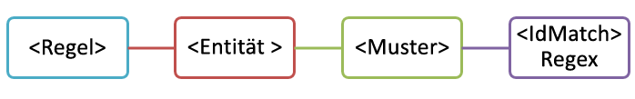
  
<span data-ttu-id="2a4a5-137">Obwohl dieses Muster einfach ist, führt möglicherweise jedoch zu einer Menge falsch positiver Ergebnisse, indem es Inhalte mit einer neunstelligen Zahl erkennt, die nicht unbedingt eine Mitarbeiter-ID ist.</span><span class="sxs-lookup"><span data-stu-id="2a4a5-137">However, while simple, this pattern may identify many false positives by matching content that contains any nine-digit number that is not necessarily an employee ID.</span></span>
  
### <a name="more-common-scenario-entity-with-multiple-patterns"></a><span data-ttu-id="2a4a5-138">Häufigeres Szenario: Entität mit mehreren Mustern</span><span class="sxs-lookup"><span data-stu-id="2a4a5-138">More common scenario: entity with multiple patterns</span></span>

<span data-ttu-id="2a4a5-139">Aus diesem Grund wird eine Entität in der Regel mit mehr als einem Muster definiert, wobei die Muster unterstützende Hinweise (z. B. ein Schlüsselwort oder Datum) zusätzlich zur Entität (z. B. die neunstellige Zahl) identifizieren.</span><span class="sxs-lookup"><span data-stu-id="2a4a5-139">For this reason, it's more common to define an entity by using more than one pattern, where the patterns identify supporting evidence (such as a keyword or date) in addition to the entity (such as a nine-digit number).</span></span>
  
<span data-ttu-id="2a4a5-140">Um zum Beispiel die Wahrscheinlichkeit zu erhöhen, Inhalt zu erkennen, der eine Mitarbeiter-ID enthält, können Sie ein anderes Muster definieren, das z. B. auch ein Einstellungsdatum identifiziert. Sie können noch ein weiteres Muster definieren, das sowohl ein Einstellungsdatum als auch ein Stichwort (z. B. „Mitarbeiter-ID“) zusätzlich zur neunstelligen Zahl identifiziert.</span><span class="sxs-lookup"><span data-stu-id="2a4a5-140">For example, to increase the likelihood of identifying content that contains an employee ID, you can define another pattern that also identifies a hire date, and define yet another pattern that identifies both a hire date and a keyword (such as "employee ID"), in addition to the nine-digit number.</span></span>
  
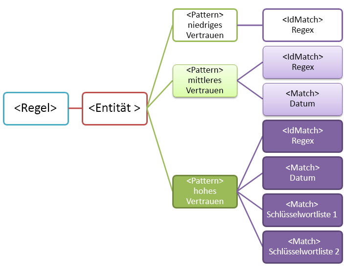
  
<span data-ttu-id="2a4a5-142">Beachten Sie einige wichtige Aspekte dieser Struktur:</span><span class="sxs-lookup"><span data-stu-id="2a4a5-142">Note a couple of important aspects of this structure:</span></span>
  
- <span data-ttu-id="2a4a5-143">Muster, die mehr Nachweise erfordern, weisen ein höheres Konfidenzniveau auf.</span><span class="sxs-lookup"><span data-stu-id="2a4a5-143">Patterns that require more evidence have a higher confidence level.</span></span> <span data-ttu-id="2a4a5-144">Dies ist nützlich, denn wenn Sie später diesen vertraulichen Informationstyp in einer Richtlinie verwenden, können Sie restriktivere Aktionen (z. B. Inhalt blockieren) nur für Übereinstimmungen mit höherem Konfidenzniveau und weniger restriktive Aktionen (z. B. Benachrichtigung senden) für Übereinstimmungen mit geringerem Konfidenzniveau verwenden.</span><span class="sxs-lookup"><span data-stu-id="2a4a5-144">This is useful because when you later use this sensitive information type in a policy, you can use more restrictive actions (such as block content) with only the higher-confidence matches, and you can use less restrictive actions (such as send notification) with the lower-confidence matches.</span></span>

- <span data-ttu-id="2a4a5-p111">Die unterstützenden Elemente "IdMatch" und "Match" verweisen auf reguläre Ausdrücke und Schlüsselwörter, die tatsächlich untergeordnete Elemente des Elements "Rule" und nicht des Elements "Pattern" sind. Auf diese unterstützenden Elemente wird von "Pattern" Bezug genommen, sie sind aber in "Rule" enthalten. Das bedeutet, dass auf eine einzelne Definition eines unterstützenden Elements, z. B. einen regulären Ausdruck oder eine Schlüsselwortliste, von mehreren Entitäten und Mustern Bezug genommen werden kann.</span><span class="sxs-lookup"><span data-stu-id="2a4a5-p111">The supporting IdMatch and Match elements reference regexes and keywords that are actually children of the Rule element, not the Pattern. These supporting elements are referenced by the Pattern but included in the Rule. This means that a single definition of a supporting element, like a regular expression or a keyword list, can be referenced by multiple entities and patterns.</span></span>

## <a name="what-entity-do-you-need-to-identify-entity-element-id-attribute"></a><span data-ttu-id="2a4a5-p112">Welche Entität muss erkannt werden? [Element "Entity", Attribut "id"]</span><span class="sxs-lookup"><span data-stu-id="2a4a5-p112">What entity do you need to identify? [Entity element, id attribute]</span></span>

<span data-ttu-id="2a4a5-p113">Eine Entität ist ein vertraulicher Informationstyp (z. B. eine Kreditkartennummer), der ein klar definiertes Muster aufweist. Jede Entität hat eine eindeutige GUID als ID.</span><span class="sxs-lookup"><span data-stu-id="2a4a5-p113">An entity is a sensitive information type, such as a credit card number, that has a well-defined pattern. Each entity has a unique GUID as its ID.</span></span>
  
### <a name="name-the-entity-and-generate-its-guid"></a><span data-ttu-id="2a4a5-152">Benennen der Entität und Generieren der GUID</span><span class="sxs-lookup"><span data-stu-id="2a4a5-152">Name the entity and generate its GUID</span></span>

1. <span data-ttu-id="2a4a5-153">Fügen Sie im XML-Editor Ihrer Wahl die Elemente „Regeln“ und „Element“ hinzu.</span><span class="sxs-lookup"><span data-stu-id="2a4a5-153">In your XML editor of choice, add the Rules and Entity elements.</span></span>
2. <span data-ttu-id="2a4a5-154">Fügen Sie einen Kommentar hinzu, der den Namen Ihrer benutzerdefinierten Entität enthält – in diesem Beispiel "Mitarbeiter-ID".</span><span class="sxs-lookup"><span data-stu-id="2a4a5-154">Add a comment that contains the name of your custom entity — in this example, Employee ID.</span></span> <span data-ttu-id="2a4a5-155">Fügen Sie später den Entitätsnamen zum Abschnitt mit den lokalisierten Zeichenfolgen hinzu, und dieser Name wird beim Erstellen einer Richtlinie auf der Benutzeroberfläche angezeigt.</span><span class="sxs-lookup"><span data-stu-id="2a4a5-155">Later, you'll add the entity name to the localized strings section, and that name is what appears in the UI when you create a policy.</span></span>
3. <span data-ttu-id="2a4a5-156">Generieren Sie eine GUID für die Entität.</span><span class="sxs-lookup"><span data-stu-id="2a4a5-156">Generate a GUID for your entity.</span></span> <span data-ttu-id="2a4a5-157">GUIDs können auf verschiedene Arten generiert werden, besonders einfach ist es aber in PowerShell. Dort müssen Sie nur **[guid]::NewGuid()** eingeben.</span><span class="sxs-lookup"><span data-stu-id="2a4a5-157">There are several ways to generate GUIDs, but you can do it easily in PowerShell by typing **[guid]::NewGuid()**.</span></span> <span data-ttu-id="2a4a5-158">Später fügen Sie auch die Entitäts-GUID zum Abschnitt mit den lokalisierten Zeichenfolgen hinzu.</span><span class="sxs-lookup"><span data-stu-id="2a4a5-158">Later, you'll also add the entity GUID to the localized strings section.</span></span>
  
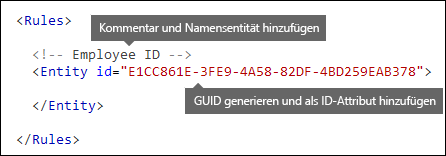
  
## <a name="what-pattern-do-you-want-to-match-pattern-element-idmatch-element-regex-element"></a><span data-ttu-id="2a4a5-p116">Welches Muster möchten Sie abgleichen? [Muster-Element, IdMatch-Element, Regex-Element]</span><span class="sxs-lookup"><span data-stu-id="2a4a5-p116">What pattern do you want to match? [Pattern element, IdMatch element, Regex element]</span></span>

<span data-ttu-id="2a4a5-p117">Das Muster enthält die Liste der Dinge, nach denen der vertrauliche Informationstyp sucht. Dies kann reguläre Ausdrücke, Stichwörter und integrierte Funktionen (die Aufgaben wie das Ausführen von regulären Ausdrücken zum Suchen nach Datumsangaben oder Adressen ausführen) umfassen. Vertrauliche Informationstypen können mehrere Muster mit eindeutigen Zuverlässigkeitsgraden aufweisen.</span><span class="sxs-lookup"><span data-stu-id="2a4a5-p117">The pattern contains the list of what the sensitive information type is looking for. This can include regexes, keywords, and built-in functions (which perform tasks like running regexes to find dates or addresses). Sensitive information types can have multiple patterns with unique confidences.</span></span>
  
<span data-ttu-id="2a4a5-p118">Allen der folgenden Muster ist gemeinsam, dass sie sich alle auf denselben regulären Ausdruck beziehen, der nach einer neunstelligen Zahl sucht (\d{9}), die von Leerzeichen eingeschlossen ist (\s) ... (\s). Das Element "IdMatch" verweist auf diesen regulären Ausdruck, und er ist die allgemeine Anforderung für alle Muster, die nach der Mitarbeiter-ID-Entität suchen. „IdMatch“ ist der Bezeichner, für den das Muster eine Entsprechung sucht, wie z. B. die Mitarbeiter-ID, Kreditkartennummer oder Sozialversicherungsnummern. Ein Pattern-Element muss genau ein IdMatch-Element haben.</span><span class="sxs-lookup"><span data-stu-id="2a4a5-p118">What all of the below patterns have in common is that they all reference the same regular expression, which looks for a nine-digit number (\d{9}) surrounded by white space (\s) … (\s). This regular expression is referenced by the IdMatch element and is the common requirement for all patterns that look for the Employee ID entity. IdMatch is the identifier that the pattern is to trying to match, such as Employee ID or credit card number or social security number. A Pattern element must have exactly one IdMatch element.</span></span>
  
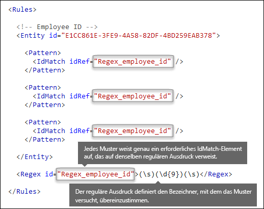
  
<span data-ttu-id="2a4a5-171">Wenn eine Übereinstimmung gefunden wird, gibt ein Muster eine Anzahl und ein Konfidenzniveau zurück, die Sie in den Bedingungen Ihrer Richtlinie verwenden können.</span><span class="sxs-lookup"><span data-stu-id="2a4a5-171">When satisfied, a pattern returns a count and confidence level, which you can use in the conditions in your policy.</span></span> <span data-ttu-id="2a4a5-172">Wenn Sie eine Bedingung für das Erkennen eines vertraulichen Informationstyps zu einer Richtlinie hinzufügen, können Sie die Anzahl und das Konfidenzniveau bearbeiten, wie es hier gezeigt wird.</span><span class="sxs-lookup"><span data-stu-id="2a4a5-172">When you add a condition for detecting a sensitive information type to a policy, you can edit the count and confidence level as shown here.</span></span> <span data-ttu-id="2a4a5-173">Das Konfidenzniveau (auch als Übereinstimmungsgenauigkeit bezeichnet) wird weiter unten in diesem Thema erläutert.</span><span class="sxs-lookup"><span data-stu-id="2a4a5-173">Confidence level (also called match accuracy) is explained later in this topic.</span></span>
  

  
<span data-ttu-id="2a4a5-p120">Beim Erstellen des regulären Ausdrucks müssen Sie berücksichtigen, dass es potenzielle Probleme geben kann. Wenn Sie z. B. einen regulären Ausdruck schreiben und hochladen, der zu viel Inhalt erkennt, kann dies die Leistung beeinträchtigen. Weitere Informationen zu diesen potenziellen Problemen finden Sie im Abschnitt [Mögliche Überprüfungsprobleme, die Sie beachten müssen](#potential-validation-issues-to-be-aware-of).</span><span class="sxs-lookup"><span data-stu-id="2a4a5-p120">When you create your regular expression, keep in mind that there are potential issues to be aware of. For example, if you write and upload a regex that identifies too much content, this can impact performance. To learn more about these potential issues, see the later section [Potential validation issues to be aware of](#potential-validation-issues-to-be-aware-of).</span></span>
  
## <a name="do-you-want-to-require-additional-evidence-match-element-mincount-attribute"></a><span data-ttu-id="2a4a5-p121">Sollen weitere Nachweise erforderlich sein? [Element "Match", Attribut "minCount"]</span><span class="sxs-lookup"><span data-stu-id="2a4a5-p121">Do you want to require additional evidence? [Match element, minCount attribute]</span></span>

<span data-ttu-id="2a4a5-180">Zusätzlich zu "IdMatch" kann in einem Muster das Element "Match" verwendet werden, um zusätzliche unterstützende Nachweise anzufordern, z. B. ein Schlüsselwort, einen regulären Ausdruck, ein Datum oder eine Adresse.</span><span class="sxs-lookup"><span data-stu-id="2a4a5-180">In addition to the IdMatch, a pattern can use the Match element to require additional supporting evidence, such as a keyword, regex, date, or address.</span></span>
  
<span data-ttu-id="2a4a5-p122">Ein Muster kann mehrere "Match"-Elemente umfassen, die direkt im Element "Pattern" enthalten sein oder mithilfe des Elements "Any" kombiniert werden können. "Match"-Elemente werden mit einem impliziten AND-Operator verknüpft. Es müssen alle "Match"-Elemente erfüllt sein, damit eine Übereinstimmung mit dem Muster erkannt wird. Sie können das Element "Any" zum Einführen von AND- oder OR-Operatoren verwenden (weitere Informationen dazu sind in einem späteren Abschnitt enthalten).</span><span class="sxs-lookup"><span data-stu-id="2a4a5-p122">A Pattern can include multiple Match elements; they can be included directly in the Pattern element or combined by using the Any element. Match elements are joined by an implicit AND operator; all Match elements must be satisfied for the pattern to be matched. You can use the Any element to introduce AND or OR operators (more on that in a later section).</span></span>
  
<span data-ttu-id="2a4a5-p123">Sie können das optionale minCount-Attribut verwenden, um anzugeben, wie viele Instanzen einer Übereinstimmung für jedes der Match-Elemente gefunden werden müssen. Sie können z. B. angeben, dass eine Übereinstimmung mit einem Muster nur dann vorliegt, wenn mindestens zwei Stichwörter aus einer Stichwortliste gefunden werden.</span><span class="sxs-lookup"><span data-stu-id="2a4a5-p123">You can use the optional minCount attribute to specify how many instances of a match need to be found for each of the Match elements. For example, you can specify that a pattern is satisfied only when at least two keywords from a keyword list are found.</span></span>
  
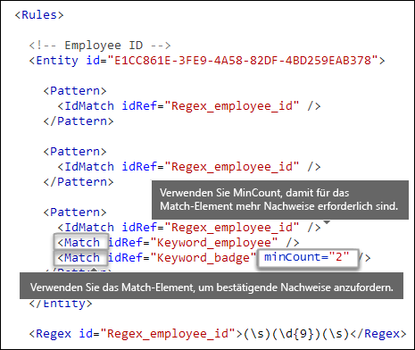
  
### <a name="keywords-keyword-group-and-term-elements-matchstyle-and-casesensitive-attributes"></a><span data-ttu-id="2a4a5-187">Stichwörter [Elemente „Keyword“, „Group“ und „Term“, matchStyle- und caseSensitive-Attribute]</span><span class="sxs-lookup"><span data-stu-id="2a4a5-187">Keywords [Keyword, Group, and Term elements, matchStyle and caseSensitive attributes]</span></span>

<span data-ttu-id="2a4a5-p124">Wenn Sie vertrauliche Informationen identifizieren möchten, wie z. B. eine Mitarbeiter-ID, dann sollen häufig Stichwörter als bestätigende Nachweise erforderlich sein. Möglicherweise möchten Sie beispielsweise zusätzlich zur Übereinstimmung mit einer neunstelligen Zahl auch nach Wörtern wie „Karte“, „Ausweis“ oder „ID“ suchen. Hierzu verwenden Sie das Keyword-Element. Das Keyword-Element verfügt über das Attribut „ID“, auf das sich mehrere Match-Elemente in mehreren Mustern oder Entitäten beziehen können.</span><span class="sxs-lookup"><span data-stu-id="2a4a5-p124">When you identify sensitive information, like an employee ID, you often want to require keywords as corroborative evidence. For example, in addition to matching a nine-digit number, you may want to look for words like "card", "badge", or "ID". To do this, you use the Keyword element. The Keyword element has an ID attribute that can be referenced by multiple Match elements in multiple patterns or entities.</span></span>
  
<span data-ttu-id="2a4a5-p125">Stichwörter werden als eine Liste von Term-Elementen in ein Group-Element eingeschlossen. Das Group-Element verfügt über ein matchStyle-Attribut mit zwei möglichen Werten:</span><span class="sxs-lookup"><span data-stu-id="2a4a5-p125">Keywords are included as a list of Term elements in a Group element. The Group element has a matchStyle attribute with two possible values:</span></span>
  
- <span data-ttu-id="2a4a5-p126">**matchStyle = "word"** Der Wortabgleich identifiziert ganze Wörter, die von Leerzeichen oder anderen Trennzeichen umgeben sind. Sie sollten immer „word“ verwenden, es sei denn, Sie müssen nach Übereinstimmungen mit Teilen von Wörtern oder Wörtern in asiatischen Sprachen suchen.</span><span class="sxs-lookup"><span data-stu-id="2a4a5-p126">**matchStyle="word"** Word match identifies whole words surrounded by white space or other delimiters. You should always use word unless you need to match parts of words or match words in Asian languages.</span></span> 
    
- <span data-ttu-id="2a4a5-p127">**matchStyle = "string"** Der Zeichenfolgenabgleich identifiziert Zeichenfolgen unabhängig davon, von welchen Zeichen sie umgeben sind. So erkennt „id“ zum Beispiel auch „bid“ und „idea“. Verwenden Sie „string“ nur, wenn Sie Übereinstimmungen mit asiatischen Wörtern suchen oder wenn das Stichwort als Teil anderer Zeichenfolgen enthalten sein kann.</span><span class="sxs-lookup"><span data-stu-id="2a4a5-p127">**matchStyle="string"** String match identifies strings no matter what they're surrounded by. For example, "id" will match "bid" and "idea". Use string only when you need to match Asian words or if your keyword may be included as part of other strings.</span></span> 
    
<span data-ttu-id="2a4a5-199">Sie können auch das caseSensitive-Attribut des Term-Elements verwenden, um festzulegen, dass der Inhalt genau mit dem Stichwort übereinstimmen muss, einschließlich Groß- und Kleinschreibung.</span><span class="sxs-lookup"><span data-stu-id="2a4a5-199">Finally, you can use the caseSensitive attribute of the Term element to specify that the content must match the keyword exactly, including lower- and upper-case letters.</span></span>
  
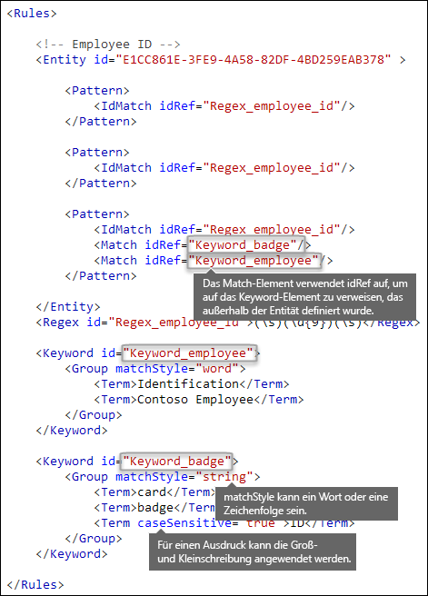
  
### <a name="regular-expressions-regex-element"></a><span data-ttu-id="2a4a5-201">Reguläre Ausdrücke [Element „Regex“]</span><span class="sxs-lookup"><span data-stu-id="2a4a5-201">Regular expressions [Regex element]</span></span>

<span data-ttu-id="2a4a5-p128">In diesem Beispiel verwendet die Entität „Employee ID“ bereits das IdMatch-Element, um auf einen regulären Ausdruck für das Muster zu verweisen – eine neunstellige Zahl, die von Leerzeichen umgeben ist. Darüber hinaus kann ein Muster ein Match-Element verwenden, um ein zusätzliches Regex-Element zum Identifizieren von bestätigenden Nachweisen, z. B. einer fünf- oder neunstellige Zahl im Format einer US-Postleitzahl, zu verwenden.</span><span class="sxs-lookup"><span data-stu-id="2a4a5-p128">In this example, the employee ID entity already uses the IdMatch element to reference a regex for the pattern — a nine-digit number surrounded by whitespace. In addition, a pattern can use a Match element to reference an additional Regex element to identify corroborative evidence, such as a five- or nine-digit number in the format of a US zip code.</span></span>
  
### <a name="additional-patterns-such-as-dates-or-addresses-built-in-functions"></a><span data-ttu-id="2a4a5-204">Zusätzliche Muster wie Datumsangaben oder Adressen [integrierte Funktionen]</span><span class="sxs-lookup"><span data-stu-id="2a4a5-204">Additional patterns such as dates or addresses [built-in functions]</span></span>

<span data-ttu-id="2a4a5-205">Zusätzlich zu den integrierten vertraulichen Informationstypen können Typen vertraulicher Informationen auch integrierte Funktionen verwenden, mit denen bestätigende Nachweise wie ein US-Datum, EU-Datum, ein Ablaufdatum oder eine US-Adresse identifiziert werden können.</span><span class="sxs-lookup"><span data-stu-id="2a4a5-205">In addition to the built-in sensitive information types, sensitive information types can also use built-in functions that can identify corroborative evidence such as a US date, EU date, expiration date, or US address.</span></span> <span data-ttu-id="2a4a5-206">Microsoft 365 bietet keine Unterstützung für das Hochladen eigener benutzerdefinierter Funktionen, doch wenn Sie einen benutzerdefinierten vertraulichen Informationstyp erstellen, kann die Entität auf die integrierten Funktionen verweisen.</span><span class="sxs-lookup"><span data-stu-id="2a4a5-206">Microsoft 365 does not support uploading your own custom functions, but when you create a custom sensitive information type, your entity can reference the built-in functions.</span></span>
  
<span data-ttu-id="2a4a5-207">Beispielsweise steht auf einem Mitarbeiterausweis außer der Mitarbeiter-ID auch ein Einstellungsdatum, sodass diese benutzerdefinierte Entität die integrierte Funktion `Func_us_date` verwenden kann, um ein Datum im US-typischen Format zu identifizieren.</span><span class="sxs-lookup"><span data-stu-id="2a4a5-207">For example, an employee ID badge has a hire date on it, so this custom entity can use the built-in function  `Func_us_date` to identify a date in the format commonly used in the US.</span></span> 
  
<span data-ttu-id="2a4a5-208">Weitere Informationen finden Sie unter [Wonach die DLP-Funktionen suchen](what-the-dlp-functions-look-for.md).</span><span class="sxs-lookup"><span data-stu-id="2a4a5-208">For more information, see [What the DLP functions look for](what-the-dlp-functions-look-for.md).</span></span>
  
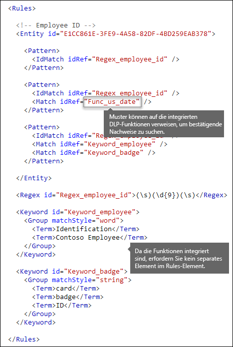
  
## <a name="different-combinations-of-evidence-any-element-minmatches-and-maxmatches-attributes"></a><span data-ttu-id="2a4a5-210">Verschiedene Kombinationen von Nachweisen [Element „Any“, minMatches- und maxMatches-Attribute]</span><span class="sxs-lookup"><span data-stu-id="2a4a5-210">Different combinations of evidence [Any element, minMatches and maxMatches attributes]</span></span>

<span data-ttu-id="2a4a5-p130">In einem Pattern-Element werden alle IdMatch- und Match-Elemente durch einen impliziten AND-Operator verknüpft – es müssen alle Übereinstimmungen gegeben sein, bevor das Muster als erfüllt betrachtet wird. Sie können jedoch mithilfe des Elements „Any“ eine flexiblere Übereinstimmungslogik erstellen, um Match-Elemente zu gruppieren. Sie können das Any-Element beispielsweise verwenden, um alle, keine oder eine genaue Teilmenge der untergeordneten Match-Elemente abzugleichen.</span><span class="sxs-lookup"><span data-stu-id="2a4a5-p130">In a Pattern element, all IdMatch and Match elements are joined by an implicit AND operator — all of the matches must be satisfied before the pattern can be satisfied. However, you can create more flexible matching logic by using the Any element to group Match elements. For example, you can use the Any element to match all, none, or an exact subset of its children Match elements.</span></span>
  
<span data-ttu-id="2a4a5-p131">Das Any-Element hat optionale minMatches- und maxMatches-Attribute, die Sie verwenden können, um zu definieren, wie viele der untergeordneten Match-Elemente erfüllt sein müssen, bevor das Muster als übereinstimmend angesehen wird. Beachten Sie, dass diese Attribute die Anzahl der Match-Elemente definiert, die erfüllt sein müssen, nicht die Anzahl der Instanzen gefundener Nachweise für die Übereinstimmungen. Zum Definieren einer Mindestanzahl von Instanzen für eine bestimmte Übereinstimmung, z. B. zwei Stichwörter aus einer Liste, verwenden Sie das minCount-Attribut für ein Match-Element (siehe oben).</span><span class="sxs-lookup"><span data-stu-id="2a4a5-p131">The Any element has optional minMatches and maxMatches attributes that you can use to define how many of the children Match elements must be satisfied before the pattern is matched. Note that these attributes define the number of Match elements that must be satisfied, not the number of instances of evidence found for the matches. To define a minimum number of instances for a specific match, such as two keywords from a list, use the minCount attribute for a Match element (see above).</span></span>
  
### <a name="match-at-least-one-child-match-element"></a><span data-ttu-id="2a4a5-217">Übereinstimmung mit mindestens einem untergeordneten "Match"-Element</span><span class="sxs-lookup"><span data-stu-id="2a4a5-217">Match at least one child Match element</span></span>

<span data-ttu-id="2a4a5-p132">Wenn Sie möchten, dass nur eine Mindestanzahl von Match-Elementen erfüllt sein muss, können Sie das minMatches-Attribut verwenden. Diese Match-Elemente werden eigentlich durch einen impliziten OR-Operator verknüpft. Dieses Any-Element wird erfüllt, wenn ein US-formatiertes Datum oder ein Stichwort aus einer Liste gefunden wird.</span><span class="sxs-lookup"><span data-stu-id="2a4a5-p132">If you want to require that only a minimum number of Match elements must be met, you can use the minMatches attribute. In effect, these Match elements are joined by an implicit OR operator. This Any element is satisfied if a US-formatted date or a keyword from either list is found.</span></span>

```xml
<Any minMatches="1" >
     <Match idRef="Func_us_date" />
     <Match idRef="Keyword_employee" />
     <Match idRef="Keyword_badge" />
</Any>
```
    
### <a name="match-an-exact-subset-of-any-children-match-elements"></a><span data-ttu-id="2a4a5-221">Übereinstimmung mit einer genauen Untermenge beliebiger untergeordneter Match-Elemente</span><span class="sxs-lookup"><span data-stu-id="2a4a5-221">Match an exact subset of any children Match elements</span></span>

<span data-ttu-id="2a4a5-p133">Wenn Sie möchten, dass eine genaue Anzahl von Match-Elementen gefunden werden soll, können Sie für „minMatches“ und „maxMatches“ den gleichen Wert festlegen. Dieses Any-Element ist nur dann erfüllt, wenn genau ein Datum oder Stichwort gefunden wird. Wenn mehr gefunden werden, gilt das Muster als nicht übereinstimmend.</span><span class="sxs-lookup"><span data-stu-id="2a4a5-p133">If you want to require that an exact number of Match elements must be met, you can set minMatches and maxMatches to the same value. This Any element is satisfied only if exactly one date or keyword is found — any more than that, and the pattern won't be matched.</span></span>

```xml
<Any minMatches="1" maxMatches="1" >
     <Match idRef="Func_us_date" />
     <Match idRef="Keyword_employee" />
     <Match idRef="Keyword_badge" />
</Any>
```
  
### <a name="match-none-of-children-match-elements"></a><span data-ttu-id="2a4a5-224">Übereinstimmung für keine untergeordneten Match-Elemente</span><span class="sxs-lookup"><span data-stu-id="2a4a5-224">Match none of children Match elements</span></span>

<span data-ttu-id="2a4a5-p134">Wenn Sie festlegen möchten, dass ein bestimmter Nachweis nicht vorhanden sein darf, damit die Übereinstimmung mit einem Muster gegeben ist, können Sie sowohl „minMatches“ als auch „maxMatches“ auf 0 festlegen. Dies kann hilfreich sein, wenn Sie eine Stichwortliste oder andere Nachweise haben, die wahrscheinlich zu einem falsch positiven Ergebnis führen.</span><span class="sxs-lookup"><span data-stu-id="2a4a5-p134">If you want to require the absence of specific evidence for a pattern to be satisfied, you can set both minMatches and maxMatches to 0. This can be useful if you have a keyword list or other evidence that are likely to indicate a false positive.</span></span>
  
<span data-ttu-id="2a4a5-p135">Die Entität „Employee ID“ such zum Beispiel nach dem Stichwort „Card“, da es sich auf eine „ID Card“ beziehen kann. Wenn „card“ jedoch nur im Ausdruck „credit card“ vorkommt, bedeutet „card“ in diesem Inhalt wahrscheinlich nicht „ID card“. Sie können also „credit card“ als Stichwort zu einer Liste mit Begriffen hinzufügen, die Sie von der Übereinstimmung mit dem Muster ausschließen möchten.</span><span class="sxs-lookup"><span data-stu-id="2a4a5-p135">For example, the employee ID entity looks for the keyword "card" because it might refer to an "ID card". However, if card appears only in the phrase "credit card", "card" in this content is unlikely to mean "ID card". So you can add "credit card" as a keyword to a list of terms that you want to exclude from satisfying the pattern.</span></span>
  
```xml
<Any minMatches="0" maxMatches="0" >
    <Match idRef="Keyword_false_positives_local" />
    <Match idRef="Keyword_false_positives_intl" />
</Any>
```

### <a name="match-a-number-of-unique-terms"></a><span data-ttu-id="2a4a5-230">Übereinstimmung mit einer Reihe eindeutiger Begriffe</span><span class="sxs-lookup"><span data-stu-id="2a4a5-230">Match a number of unique terms</span></span>

<span data-ttu-id="2a4a5-231">Wenn Entsprechungen für eine Reihe eindeutiger Begriffe gefunden werden sollen, verwenden Sie den *uniqueResults*-Parameter und legen Sie ihn wie im folgenden Beispiel auf *true* fest:</span><span class="sxs-lookup"><span data-stu-id="2a4a5-231">If you want to match a number of unique terms, use the *uniqueResults* parameter, set to *true*, as shown in the following example:</span></span>

```xml
<Pattern confidenceLevel="75">
    <IdMatch idRef="Salary_Revision_terms" />
    <Match idRef=" Salary_Revision_ID " minCount="3" uniqueResults="true" />
</Pattern>
```

<span data-ttu-id="2a4a5-232">In diesem Beispiel ist ein Muster für die Gehaltsrevision mit mindestens drei eindeutigen Übereinstimmungen definiert.</span><span class="sxs-lookup"><span data-stu-id="2a4a5-232">In this example, a pattern is defined for salary revision using at least three unique matches.</span></span> 
  
## <a name="how-close-to-the-entity-must-the-other-evidence-be-patternsproximity-attribute"></a><span data-ttu-id="2a4a5-p136">Wie nah an der Entität muss der andere Nachweis sein? [patternsProximity-Attribut]</span><span class="sxs-lookup"><span data-stu-id="2a4a5-p136">How close to the entity must the other evidence be? [patternsProximity attribute]</span></span>

<span data-ttu-id="2a4a5-p137">Der Typ für vertrauliche Informationen sucht nach einem Muster, das eine Mitarbeiter-ID darstellt, und als Teil dieses Musters sucht er auch nach bestätigenden Nachweisen, wie z. B. dem Stichwort „ID“. Daraus folgt: Je näher dieser Nachweis bei der Entität liegt, desto wahrscheinlicher ist das Muster eine tatsächliche Mitarbeiter-ID. Sie können festlegen, wie nah andere Nachweise bei der Entität im Muster liegen müssen, indem Sie das erforderliche patternsProximity-Attribut des Entity-Elements verwenden.</span><span class="sxs-lookup"><span data-stu-id="2a4a5-p137">Your sensitive information type is looking for a pattern that represents an employee ID, and as part of that pattern it's also looking for corroborative evidence like a keyword such as "ID". It makes sense that the closer together this evidence is, the more likely the pattern is to be an actual employee ID. You can determine how close other evidence in the pattern must be to the entity by using the required patternsProximity attribute of the Entity element.</span></span>
  
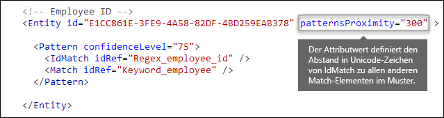
  
<span data-ttu-id="2a4a5-p138">Der patternsProximity-Attributwert definiert für jedes Muster in der Entität den Abstand (in Unicode-Zeichen) von der IdMatch-Position für alle anderen Übereinstimmungen, die für dieses Muster angegeben wurden. Das Näherungsfenster wird von der IdMatch-Position verankert, wobei das Fenster links und rechts von „IdMatch“ erweitert wird.</span><span class="sxs-lookup"><span data-stu-id="2a4a5-p138">For each pattern in the entity, the patternsProximity attribute value defines the distance (in Unicode characters) from the IdMatch location for all other Matches specified for that Pattern. The proximity window is anchored by the IdMatch location, with the window extending to the left and right of the IdMatch.</span></span>
  
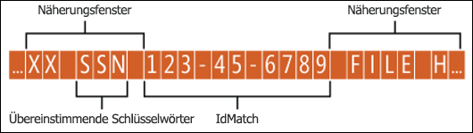
  
<span data-ttu-id="2a4a5-p139">Im nachstehenden Beispiel wird gezeigt, in welcher Weise das Näherungsfenster den Musterabgleich beeinflusst, wobei das IdMatch-Element für die benutzerdefinierte Employee ID-Entität mindestens eine bestätigende Übereinstimmung von Stichwort oder Datum erfordert. Aufgrund von ID2 und ID3 gibt es nur eine Übereinstimmung für ID1, und im Näherungsfenster wird kein oder nur ein teilweise bestätigender Nachweis gefunden.</span><span class="sxs-lookup"><span data-stu-id="2a4a5-p139">The example below illustrates how the proximity window affects the pattern matching where IdMatch element for the employee ID custom entity requires at least one corroborating match of keyword or date. Only ID1 matches because for ID2 and ID3, either no or only partial corroborating evidence is found within the proximity window.</span></span>
  
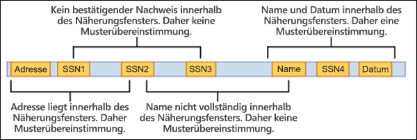
  
<span data-ttu-id="2a4a5-p140">Beachten Sie, dass bei E-Mails der Text und jede Anlage als separate Elemente behandelt werden. Dies bedeutet, dass sich das Näherungsfenster nicht über das Ende des jeweiligen Elements erstreckt. Für jedes Element (Anlage oder Text) muss sowohl idMatch als auch der bestätigende Nachweise vorhanden sein.</span><span class="sxs-lookup"><span data-stu-id="2a4a5-p140">Note that for email, the message body and each attachment are treated as separate items. This means that the proximity window does not extend beyond the end of each of these items. For each item (attachment or body), both the idMatch and corroborative evidence needs to reside in that item.</span></span>
  
## <a name="what-are-the-right-confidence-levels-for-different-patterns-confidencelevel-attribute-recommendedconfidence-attribute"></a><span data-ttu-id="2a4a5-p141">Welches sind die richtigen Konfidenzniveaus für verschiedene Muster? [Attribut "confidenceLevel", Attribut "recommendedConfidence"]</span><span class="sxs-lookup"><span data-stu-id="2a4a5-p141">What are the right confidence levels for different patterns? [confidenceLevel attribute, recommendedConfidence attribute]</span></span>

<span data-ttu-id="2a4a5-p142">Je mehr Nachweise für ein Muster erforderlich sind, desto höher ist der Zuverlässigkeitsgrad, dass eine tatsächliche Entität (z. B. Mitarbeiter-ID) beim Abgleich des Musters identifiziert wurde. So ist die Zuverlässigkeit beispielsweise größer bei einem Muster, für das eine neunstellige ID, das Einstellungsdatum und ein Stichwort in nächster Nähe erforderlich sind, als bei einem Muster, das nur eine neue neunstellige ID erfordert.</span><span class="sxs-lookup"><span data-stu-id="2a4a5-p142">The more evidence that a pattern requires, the more confidence you have that an actual entity (such as employee ID) has been identified when the pattern is matched. For example, you have more confidence in a pattern that requires a nine-digit ID number, hire date, and keyword in close proximity, than you do in a pattern that requires only a nine-digit ID number.</span></span>
  
<span data-ttu-id="2a4a5-252">Das Element "Pattern" weist ein erforderliches Attribut "confidenceLevel" auf.</span><span class="sxs-lookup"><span data-stu-id="2a4a5-252">The Pattern element has a required confidenceLevel attribute.</span></span> <span data-ttu-id="2a4a5-253">Sie können sich den Wert für "confidenceLevel" (eine ganze Zahl zwischen 1 und 100) als eine eindeutige ID für jedes Muster in einer Entität vorstellen – die Muster in einer Entität müssen unterschiedliche Konfidenzniveaus aufweisen, die von Ihnen zugewiesen werden.</span><span class="sxs-lookup"><span data-stu-id="2a4a5-253">You can think of the value of confidenceLevel (an integer between 1 and 100) as a unique ID for each pattern in an entity — the patterns in an entity must have different confidence levels that you assign.</span></span> <span data-ttu-id="2a4a5-254">Der genaue Wert der Zahl spielt keine Rolle – wählen Sie einfach Zahlen aus, die Ihrem Complianceteam sinnvoll erscheinen.</span><span class="sxs-lookup"><span data-stu-id="2a4a5-254">The precise value of the integer doesn't matter — simply pick numbers that make sense to your compliance team.</span></span> <span data-ttu-id="2a4a5-255">Nachdem Sie den benutzerdefinierten vertraulichen Informationstyp hochgeladen und anschließend eine Richtlinie erstellt haben, können Sie in den Bedingungen der von Ihnen erstellten Regeln auf diese Konfidenzniveaus verweisen.</span><span class="sxs-lookup"><span data-stu-id="2a4a5-255">After you upload your custom sensitive information type and then create a policy, you can reference these confidence levels in the conditions of the rules that you create.</span></span>
  
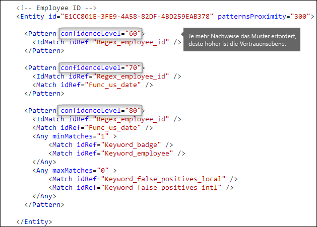
  
<span data-ttu-id="2a4a5-257">Zusätzlich zu "confidenceLevel" für jedes Muster weist "Entity" ein Attribut "recommendedConfidence" auf.</span><span class="sxs-lookup"><span data-stu-id="2a4a5-257">In addition to confidenceLevel for each Pattern, the Entity has a recommendedConfidence attribute.</span></span> <span data-ttu-id="2a4a5-258">Dieses Attribut für die empfohlene Konfidenz kann man sich als das Standardkonfidenzniveau für die Regel vorstellen.</span><span class="sxs-lookup"><span data-stu-id="2a4a5-258">The recommended confidence attribute can be thought of as the default confidence level for the rule.</span></span> <span data-ttu-id="2a4a5-259">Wenn Sie beim Erstellen einer Regel in einer Richtlinie kein zu verwendendes Konfidenzniveau für die Regel angeben, erfolgt der Abgleich für diese Regel basierend auf dem empfohlenen Konfidenzniveau für die Entität.</span><span class="sxs-lookup"><span data-stu-id="2a4a5-259">When you create a rule in a policy, if you don't specify a confidence level for the rule to use, that rule will match based on the recommended confidence level for the entity.</span></span> <span data-ttu-id="2a4a5-260">Bitte beachten Sie, dass das recommendedConfidence-Attribut für jede Entitäts-ID im Regelpaket zwingend erforderlich ist. Wenn es nicht vorhanden ist, können Sie keine Richtlinien speichern, die den Typ „vertrauliche Informationen“ verwenden.</span><span class="sxs-lookup"><span data-stu-id="2a4a5-260">Please note that the recommendedConfidence attribute is mandatory for each Entity ID in the Rule Package, if missing you won't be able to save policies that use the Sensitive Information Type.</span></span> 
  
## <a name="do-you-want-to-support-other-languages-in-the-ui-of-the-compliance-center-localizedstrings-element"></a><span data-ttu-id="2a4a5-261">Möchten Sie in der Benutzeroberfläche des Compliance Center andere Sprachen unterstützen?</span><span class="sxs-lookup"><span data-stu-id="2a4a5-261">Do you want to support other languages in the UI of the Compliance center?</span></span> <span data-ttu-id="2a4a5-262">[LocalizedStrings-Element]</span><span class="sxs-lookup"><span data-stu-id="2a4a5-262">[LocalizedStrings element]</span></span>

<span data-ttu-id="2a4a5-263">Wenn Ihr Complianceteam das Microsoft 365 Compliance Center zum Erstellen von Richtlinien in verschiedenen Gebietsschemas und in verschiedenen Sprachen verwendet, können Sie lokalisierte Versionen des Namens und der Beschreibung Ihres benutzerdefinierten vertraulichen Informationstyps bereitstellen.</span><span class="sxs-lookup"><span data-stu-id="2a4a5-263">If your compliance team uses the Microsoft 365 Compliance center to create polices policies in different locales and in different languages, you can provide localized versions of the name and description of your custom sensitive information type.</span></span> <span data-ttu-id="2a4a5-264">Wenn Ihr Complianceteam Microsoft 365 in einer von Ihnen unterstützten Sprache verwendet, wird der lokalisierte Name auf der Benutzeroberfläche angezeigt.</span><span class="sxs-lookup"><span data-stu-id="2a4a5-264">When your compliance team uses Microsoft 365 in a language that you support, they'll see the localized name in the UI.</span></span>
  

  
<span data-ttu-id="2a4a5-p147">Das Rules-Element muss ein LocalizedStrings-Element enthalten, das ein Resource-Element enthält, das auf die GUID Ihrer benutzerdefinierten Entität verweist. Jedes Resource-Element enthält wiederum ein oder mehrere Name-Elemente und Description-Elemente, die jeweils das langcode-Attribut verwenden, um eine lokalisierte Zeichenfolge für eine bestimmte Sprache bereitzustellen.</span><span class="sxs-lookup"><span data-stu-id="2a4a5-p147">The Rules element must contain a LocalizedStrings element, which contains a Resource element that references the GUID of your custom entity. In turn, each Resource element contains one or more Name and Description elements that each use the langcode attribute to provide a localized string for a specific language.</span></span>
  
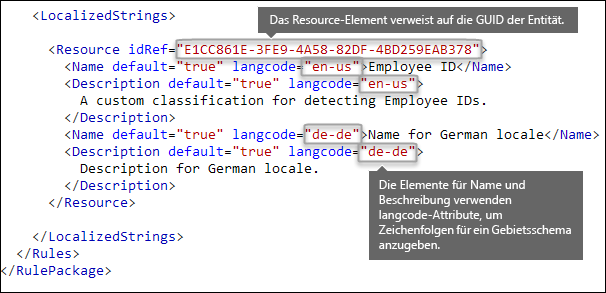
  
<span data-ttu-id="2a4a5-269">Beachten Sie, dass Sie lokalisierte Zeichenfolgen nur für die Anzeige Ihres benutzerdefinierten vertraulichen Informationstyps auf der Benutzeroberfläche des Compliance Centers verwenden.</span><span class="sxs-lookup"><span data-stu-id="2a4a5-269">Note that you use localized strings only for how your custom sensitive information type appears in the UI of the Compliance center.</span></span> <span data-ttu-id="2a4a5-270">Sie können lokalisierte Zeichenfolgen nicht verwenden, um verschiedene lokalisierte Versionen einer Schlüsselwortliste oder eines regulären Ausdrucks bereitzustellen.</span><span class="sxs-lookup"><span data-stu-id="2a4a5-270">You can't use localized strings to provide different localized versions of a keyword list or regular expression.</span></span>
  
## <a name="other-rule-package-markup-rulepack-guid"></a><span data-ttu-id="2a4a5-271">Sonstige Regelpaket-Markups [RulePack-GUID]</span><span class="sxs-lookup"><span data-stu-id="2a4a5-271">Other rule package markup [RulePack GUID]</span></span>

<span data-ttu-id="2a4a5-p149">Der Anfang jedes Regelpakets enthält einige allgemeine Informationen, die Sie ausfüllen müssen. Sie können das folgende Markup als Vorlage verwenden und die Platzhalter ". . ." durch eigene Informationen ersetzen.</span><span class="sxs-lookup"><span data-stu-id="2a4a5-p149">Finally, the beginning of each RulePackage contains some general information that you need to fill in. You can use the following markup as a template and replace the ". . ." placeholders with your own info.</span></span>
  
<span data-ttu-id="2a4a5-p150">Am wichtigsten ist Folgendes: Sie müssen eine GUID für das RulePack generieren. Weiter oben haben Sie eine GUID für die Entität generiert. Dies ist eine zweite GUID für das RulePack. Es gibt mehrere Methoden zum Generieren von GUIDs, aber Sie können dies ganz einfach in PowerShell durch Eingabe von „[guid]::NewGuid()“ durchführen.</span><span class="sxs-lookup"><span data-stu-id="2a4a5-p150">Most importantly, you'll need to generate a GUID for the RulePack. Above, you generated a GUID for the entity; this is a second GUID for the RulePack. There are several ways to generate GUIDs, but you can do it easily in PowerShell by typing [guid]::NewGuid().</span></span>
  
<span data-ttu-id="2a4a5-p151">Das Version-Element ist ebenfalls wichtig. Wenn Sie das Regelpaket zum ersten Mal hochladen, merkt sich Microsoft 365 die Versionsnummer. Wenn Sie das Regelpaket später aktualisieren und eine neue Version hochladen, stellen Sie sicher, dass Sie die Versionsnummer aktualisieren, da Microsoft 365 das Regelpaket sonst nicht bereitstellt.</span><span class="sxs-lookup"><span data-stu-id="2a4a5-p151">The Version element is also important. When you upload your rule package for the first time, Microsoft 365 notes the version number. Later, if you update the rule package and upload a new version, make sure to update the version number or Microsoft 365 won't deploy the rule package.</span></span>
  
```xml
<?xml version="1.0" encoding="utf-16"?>
<RulePackage xmlns="http://schemas.microsoft.com/office/2011/mce">
  <RulePack id=". . .">
    <Version major="1" minor="0" build="0" revision="0" />
    <Publisher id=". . ." /> 
    <Details defaultLangCode=". . .">
      <LocalizedDetails langcode=" . . . ">
         <PublisherName>. . .</PublisherName>
         <Name>. . .</Name>
         <Description>. . .</Description>
      </LocalizedDetails>
    </Details>
  </RulePack>
  
 <Rules>
    . . .
 </Rules>
</RulePackage>

```

<span data-ttu-id="2a4a5-283">Wenn es fertig ist, sollte das RulePack-Element wie folgt aussehen.</span><span class="sxs-lookup"><span data-stu-id="2a4a5-283">When complete, your RulePack element should look like this.</span></span>
  
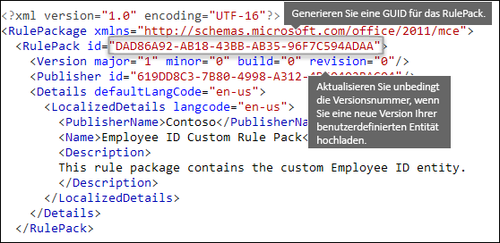
  
## <a name="changes-for-exchange-online"></a><span data-ttu-id="2a4a5-285">Änderungen für Exchange Online</span><span class="sxs-lookup"><span data-stu-id="2a4a5-285">Changes for Exchange Online</span></span>

<span data-ttu-id="2a4a5-286">Sie haben bisher möglicherweise Exchange Online PowerShell verwendet, um Ihre benutzerdefinierten Typen für vertrauliche Informationen für DLP zu importieren.</span><span class="sxs-lookup"><span data-stu-id="2a4a5-286">Previously, you might have used Exchange Online PowerShell to import your custom sensitive information types for DLP.</span></span> <span data-ttu-id="2a4a5-287">Nun können Ihre benutzerdefinierten vertraulichen Informationstypen sowohl im Exchange Admin Center als auch im Compliance Center verwendet werden.</span><span class="sxs-lookup"><span data-stu-id="2a4a5-287">Now your custom sensitive information types can be used in both the Exchange admin center and the Compliance center.</span></span> <span data-ttu-id="2a4a5-288">Im Rahmen dieser Verbesserung sollten Sie Compliance Center-PowerShell verwenden, um Ihre benutzerdefinierten vertraulichen Informationstypen zu importieren. Sie können sie nicht mehr aus Exchange PowerShell importieren.</span><span class="sxs-lookup"><span data-stu-id="2a4a5-288">As part of this improvement, you should use Compliance center PowerShell to import your custom sensitive information types — you can't import them from the Exchange PowerShell anymore.</span></span> <span data-ttu-id="2a4a5-289">Ihre benutzerdefinierten vertraulichen Informationstypen funktionieren weiterhin wie zuvor, es kann jedoch bis zu einer Stunde dauern, bis Änderungen, die Sie im Compliance Center an benutzerdefinierten vertraulichen Informationstypen vorgenommen haben, im Exchange Admin Center angezeigt werden.</span><span class="sxs-lookup"><span data-stu-id="2a4a5-289">Your custom sensitive information types will continue to work just like before; however, it may take up to one hour for changes made to custom sensitive information types in the Compliance center to appear in the Exchange admin center.</span></span>
  
<span data-ttu-id="2a4a5-290">Beachten Sie, dass Sie im Compliance Center das Cmdlet **[New-DlpSensitiveInformationTypeRulePackage](https://docs.microsoft.com/powershell/module/exchange/new-dlpsensitiveinformationtyperulepackage)** verwenden, um ein Regelpaket hochzuladen.</span><span class="sxs-lookup"><span data-stu-id="2a4a5-290">Note that in the Compliance center, you use the **[New-DlpSensitiveInformationTypeRulePackage](https://docs.microsoft.com/powershell/module/exchange/new-dlpsensitiveinformationtyperulepackage)** cmdlet to upload a rule package.</span></span> <span data-ttu-id="2a4a5-291">(Im Exchange Admin Center wurde früher das Cmdlet **ClassificationRuleCollection** verwendet.)</span><span class="sxs-lookup"><span data-stu-id="2a4a5-291">(Previously, in the Exchange admin center, you used the  **ClassificationRuleCollection**\` cmdlet.)</span></span> 
  
## <a name="upload-your-rule-package"></a><span data-ttu-id="2a4a5-292">Hochladen des Regelpakets</span><span class="sxs-lookup"><span data-stu-id="2a4a5-292">Upload your rule package</span></span>


<span data-ttu-id="2a4a5-293">Gehen Sie zum Hochladen des Regelpakets wie folgt vor:</span><span class="sxs-lookup"><span data-stu-id="2a4a5-293">To upload your rule package, do the following steps:</span></span>
  
1. <span data-ttu-id="2a4a5-294">Speichern Sie es als XML-Datei mit Unicode-Codierung.</span><span class="sxs-lookup"><span data-stu-id="2a4a5-294">Save it as an .xml file with Unicode encoding.</span></span>
    
2. [<span data-ttu-id="2a4a5-295">Verbindung mit Compliance Center-PowerShell herstellen</span><span class="sxs-lookup"><span data-stu-id="2a4a5-295">Connect to Compliance center PowerShell</span></span>](https://go.microsoft.com/fwlink/p/?LinkID=799771)
    
3. <span data-ttu-id="2a4a5-296">Verwenden Sie die folgende Syntax:</span><span class="sxs-lookup"><span data-stu-id="2a4a5-296">Use the following syntax:</span></span>

   ```powershell
   New-DlpSensitiveInformationTypeRulePackage -FileData (Get-Content -Path "PathToUnicodeXMLFile" -Encoding Byte -ReadCount 0)
   ```

   <span data-ttu-id="2a4a5-297">Dieses Beispiel lädt die Unicode-XML-Datei mit dem Namen „MyNewRulePack.xml“ aus C:\Dokumente“ hoch.</span><span class="sxs-lookup"><span data-stu-id="2a4a5-297">This example uploads the Unicode XML file named MyNewRulePack.xml from C:\My Documents.</span></span>

   ```powershell
   New-DlpSensitiveInformationTypeRulePackage -FileData (Get-Content -Path "C:\My Documents\MyNewRulePack.xml" -Encoding Byte -ReadCount 0)
   ```

   <span data-ttu-id="2a4a5-298">Ausführliche Informationen zur Syntax und zu den Parametern finden Sie unter [New-DlpSensitiveInformationTypeRulePackage](https://docs.microsoft.com/powershell/module/exchange/new-dlpsensitiveinformationtyperulepackage).</span><span class="sxs-lookup"><span data-stu-id="2a4a5-298">For detailed syntax and parameter information, see [New-DlpSensitiveInformationTypeRulePackage](https://docs.microsoft.com/powershell/module/exchange/new-dlpsensitiveinformationtyperulepackage).</span></span>

   > [!NOTE]
   > <span data-ttu-id="2a4a5-299">Maximal werden 10 Regelpakete unterstützt, aber jedes Paket kann die Definition mehrerer Typen vertraulicher Informationen enthalten.</span><span class="sxs-lookup"><span data-stu-id="2a4a5-299">The maximum number of rule packages supported is 10, but each package can contain the definition of multiple sensitive information types.</span></span>

4. <span data-ttu-id="2a4a5-300">Um sicherzustellen, dass Sie einen neuen Typ für vertrauliche Informationen erstellt haben, führen Sie einen der folgenden Schritte aus:</span><span class="sxs-lookup"><span data-stu-id="2a4a5-300">To verify that you've successfully created a new sensitive information type, do any of the following steps:</span></span>

   - <span data-ttu-id="2a4a5-301">Führen Sie das Cmdlet [Get-DlpSensitiveInformationTypeRulePackage](https://docs.microsoft.com/powershell/module/exchange/get-dlpsensitiveinformationtyperulepackage) aus, um zu überprüfen, ob das neue Regelpaket aufgeführt wird:</span><span class="sxs-lookup"><span data-stu-id="2a4a5-301">Run the [Get-DlpSensitiveInformationTypeRulePackage](https://docs.microsoft.com/powershell/module/exchange/get-dlpsensitiveinformationtyperulepackage) cmdlet to verify the new rule package is listed:</span></span>

     ```powershell
     Get-DlpSensitiveInformationTypeRulePackage
     ``` 

   - <span data-ttu-id="2a4a5-302">Führen Sie das Cmdlet [Get-DlpSensitiveInformationType](https://docs.microsoft.com/powershell/module/exchange/get-dlpsensitiveinformationtype) aus, um zu überprüfen, ob der Typ für vertrauliche Informationen aufgeführt wird:</span><span class="sxs-lookup"><span data-stu-id="2a4a5-302">Run the [Get-DlpSensitiveInformationType](https://docs.microsoft.com/powershell/module/exchange/get-dlpsensitiveinformationtype) cmdlet to verify the sensitive information type is listed:</span></span>

     ```powershell
     Get-DlpSensitiveInformationType
     ``` 

     <span data-ttu-id="2a4a5-303">Bei benutzerdefinierten Typen für vertrauliche Informationen ist der Publisher-Eigenschaftswert ein anderer als „Microsoft Corporation“.</span><span class="sxs-lookup"><span data-stu-id="2a4a5-303">For custom sensitive information types, the Publisher property value will be something other than Microsoft Corporation.</span></span>

   - <span data-ttu-id="2a4a5-304">Ersetzen Sie \<Name\> durch den Namenswert des Typs für vertrauliche Informationen (z. B. die Mitarbeiter-ID), und führen Sie das Cmdlet [Get-DlpSensitiveInformationType](https://docs.microsoft.com/powershell/module/exchange/get-dlpsensitiveinformationtype) aus:</span><span class="sxs-lookup"><span data-stu-id="2a4a5-304">Replace \<Name\> with the Name value of the sensitive information type (example: Employee ID) and run the [Get-DlpSensitiveInformationType](https://docs.microsoft.com/powershell/module/exchange/get-dlpsensitiveinformationtype) cmdlet:</span></span>

     ```powershell
     Get-DlpSensitiveInformationType -Identity "<Name>"
     ```
    
## <a name="potential-validation-issues-to-be-aware-of"></a><span data-ttu-id="2a4a5-305">Mögliche Überprüfungsprobleme, die zu beachten sind</span><span class="sxs-lookup"><span data-stu-id="2a4a5-305">Potential validation issues to be aware of</span></span>

<span data-ttu-id="2a4a5-p154">Wenn Sie die XML-Datei des Regelpakets hochladen, überprüft das System den XML-Code und sucht nach bekannten fehlerhaften Mustern und offensichtlichen Leistungsproblemen. Hier sind einige bekannte Probleme aufgeführt, auf die eine Überprüfung erfolgt – ein regulärer Ausdruck:</span><span class="sxs-lookup"><span data-stu-id="2a4a5-p154">When you upload your rule package XML file, the system validates the XML and checks for known bad patterns and obvious performance issues. Here are some known issues that the validation checks for — a regular expression:</span></span>
  
- <span data-ttu-id="2a4a5-308">Darf nicht mit einem Alternator „|“ beginnen, das allem entspricht, da es als leere Übereinstimmung angesehen wird.</span><span class="sxs-lookup"><span data-stu-id="2a4a5-308">Cannot begin or end with alternator "|", which matches everything because it's considered an empty match.</span></span>
    
  <span data-ttu-id="2a4a5-309">Beispiel: „|a“ oder „|b“ besteht die Überprüfung nicht.</span><span class="sxs-lookup"><span data-stu-id="2a4a5-309">For example, "|a" or "b|" will not pass validation.</span></span>
    
- <span data-ttu-id="2a4a5-310">Darf nicht mit einem „. {0, m}“-Muster beginnen oder enden, da dies keine Funktion hat und nur die Leistung beeinträchtigt.</span><span class="sxs-lookup"><span data-stu-id="2a4a5-310">Cannot begin or end with a ".{0,m}" pattern, which has no functional purpose and only impairs performance.</span></span>
    
  <span data-ttu-id="2a4a5-311">Beispiel: „.{0,50}ASDF“ oder „ASDF.{0,50}“ besteht die Überprüfung nicht.</span><span class="sxs-lookup"><span data-stu-id="2a4a5-311">For example, ".{0,50}ASDF" or "ASDF.{0,50}" will not pass validation.</span></span>
    
- <span data-ttu-id="2a4a5-312">Darf „.{0,m}“ oder „.{1,m}“ nicht in Gruppen haben, und darf nicht „.\*“ oder „.+“ in Gruppen haben.</span><span class="sxs-lookup"><span data-stu-id="2a4a5-312">Cannot have ".{0,m}" or ".{1,m}" in groups, and cannot have ".\*" or ".+" in groups.</span></span>
    
  <span data-ttu-id="2a4a5-313">Beispiel: „(.{0,50000})“ besteht die Überprüfung nicht.</span><span class="sxs-lookup"><span data-stu-id="2a4a5-313">For example, "(.{0,50000})" will not pass validation.</span></span>
    
- <span data-ttu-id="2a4a5-314">Darf keine Zeichen mit den Wiederholern „{0,m}“ oder „{1,m}“ haben.</span><span class="sxs-lookup"><span data-stu-id="2a4a5-314">Cannot have any character with "{0,m}" or "{1,m}" repeaters in groups.</span></span>
    
  <span data-ttu-id="2a4a5-315">Beispiel: „(a\*)“ besteht die Überprüfung nicht.</span><span class="sxs-lookup"><span data-stu-id="2a4a5-315">For example, "(a\*)" will not pass validation.</span></span>
    
- <span data-ttu-id="2a4a5-316">Darf nicht mit „.{1,m}“ beginnen oder enden; verwenden Sie stattdessen „.“</span><span class="sxs-lookup"><span data-stu-id="2a4a5-316">Cannot begin or end with ".{1,m}"; instead, use just "."</span></span>
    
  <span data-ttu-id="2a4a5-317">Beispiel: „.{1,m}asdf“ besteht die Überprüfung nicht; verwenden Sie stattdessen „.asdf“.</span><span class="sxs-lookup"><span data-stu-id="2a4a5-317">For example, ".{1,m}asdf" will not pass validation; instead, use just ".asdf".</span></span>
    
- <span data-ttu-id="2a4a5-318">Darf keinen unbegrenzten Wiederholer in einer Grupe haben (wie z. B. „\*“ oder „+“).</span><span class="sxs-lookup"><span data-stu-id="2a4a5-318">Cannot have an unbounded repeater (such as "\*" or "+") on a group.</span></span>
    
  <span data-ttu-id="2a4a5-319">Beispiel: „(xx)\*“ und „(xx)+“ bestehen die Überprüfung nicht.</span><span class="sxs-lookup"><span data-stu-id="2a4a5-319">For example, "(xx)\*" and "(xx)+" will not pass validation.</span></span>
  
- <span data-ttu-id="2a4a5-320">Schlüsselwörter dürfen aus maximal 50 Zeichen bestehen.</span><span class="sxs-lookup"><span data-stu-id="2a4a5-320">Keywords have a maximum of 50 characters in Length.</span></span>  <span data-ttu-id="2a4a5-321">Wenn eine Gruppe ein Schlüsselwort enthält, das diesen Wert überschreitet, besteht eine vorgeschlagene Lösung darin, die Gruppe von Begriffen als [Schlüsselwörterbuch](https://docs.microsoft.com/microsoft-365/compliance/create-a-keyword-dictionary) zu erstellen und auf die GUID des Schlüsselwörterbuchs innerhalb der XML-Struktur als Teil der Entität für die Übereinstimmung oder idMatch in der Datei zu verweisen.</span><span class="sxs-lookup"><span data-stu-id="2a4a5-321">If you have a keyword within a Group exceeding this, a suggested solution is to create the Group of terms as a [Keyword Dictionary](https://docs.microsoft.com/microsoft-365/compliance/create-a-keyword-dictionary) and reference the GUID of the Keyword Dictionary within the XML structure as part of the Entity for Match or idMatch in the file.</span></span>

- <span data-ttu-id="2a4a5-322">Jeder benutzerdefinierte Typ vertraulicher Informationen kann maximal 2048 Schlüsselwörter enthalten.</span><span class="sxs-lookup"><span data-stu-id="2a4a5-322">Each Custom Sensitive Information Type can have a maximum of 2048 keywords total.</span></span>

- <span data-ttu-id="2a4a5-323">Bei Verwendung des PowerShell-Cmdlets gibt es eine maximale Rückgabegröße der deserialisierten Daten von ca. 1 Megabyte.</span><span class="sxs-lookup"><span data-stu-id="2a4a5-323">When using the PowerShell Cmdlet there is a maximum return size of the Deserialized Data of approximately 1 megabyte.</span></span>   <span data-ttu-id="2a4a5-324">Dies wirkt sich auf die Größe der XML-Datei aus.</span><span class="sxs-lookup"><span data-stu-id="2a4a5-324">This will affect the size of your XML file.</span></span> <span data-ttu-id="2a4a5-325">Beschränken Sie die hochgeladene Datei auf eine maximale Größe von 512 MB als vorgeschlagenen Grenzwert, um konsistente Ergebnisse ohne Fehler bei der Verarbeitung zu erhalten.</span><span class="sxs-lookup"><span data-stu-id="2a4a5-325">Keep the uploaded file limited to a 512 megabyte maximum as a suggested limit for consistent results without error when processing.</span></span>

- <span data-ttu-id="2a4a5-326">Die XML-Struktur erfordert keine Formatierungszeichen wie Leerzeichen, Tabstopps oder Wagenrücklauf-/Zeilenvorschubeinträge.</span><span class="sxs-lookup"><span data-stu-id="2a4a5-326">The XML structure does not require formatting characters such as Spaces, Tabs or Carriage Return / Linefeed entries.</span></span>  <span data-ttu-id="2a4a5-327">Beachten Sie dies beim Optimieren des Speicherplatzes bei Uploads.</span><span class="sxs-lookup"><span data-stu-id="2a4a5-327">Take note of this when optimizing for space on uploads.</span></span>
    
<span data-ttu-id="2a4a5-328">Wenn ein benutzerdefinierter Typ für vertrauliche Informationen ein Problem enthält, das die Leistung beeinträchtigen könnte, wird er nicht hochgeladen, und es wird möglicherweise eine der folgenden Fehlermeldungen angezeigt:</span><span class="sxs-lookup"><span data-stu-id="2a4a5-328">If a custom sensitive information type contains an issue that may affect performance, it won't be uploaded and you may see one of these error messages:</span></span>
  
- <span data-ttu-id="2a4a5-329">**Generische Mengenangaben, die mit mehr Inhalten übereinstimmen als erwartet (z. B. „+“, „\*“)**</span><span class="sxs-lookup"><span data-stu-id="2a4a5-329">**Generic quantifiers which match more content than expected (e.g., '+', '\*')**</span></span>
    
- <span data-ttu-id="2a4a5-330">**Lookaround-Assertionen**</span><span class="sxs-lookup"><span data-stu-id="2a4a5-330">**Lookaround assertions**</span></span>
    
- <span data-ttu-id="2a4a5-331">**Komplexe Gruppieren in Verbindung mit allgemeinen Mengenangaben**</span><span class="sxs-lookup"><span data-stu-id="2a4a5-331">**Complex grouping in conjunction with general quantifiers**</span></span>
    
## <a name="recrawl-your-content-to-identify-the-sensitive-information"></a><span data-ttu-id="2a4a5-332">Neues Durchforsten des Inhalts, um die Typen für vertrauliche Informationen zu identifizieren</span><span class="sxs-lookup"><span data-stu-id="2a4a5-332">Recrawl your content to identify the sensitive information</span></span>

<span data-ttu-id="2a4a5-333">Microsoft 365 verwendet den Suchcrawler zum Erkennen und Klassifizieren vertraulicher Informationen in Websiteinhalten.</span><span class="sxs-lookup"><span data-stu-id="2a4a5-333">Microsoft 365 uses the search crawler to identify and classify sensitive information in site content.</span></span> <span data-ttu-id="2a4a5-334">Inhalte von SharePoint Online- und OneDrive for Business-Websites werden automatisch erneut durchforstet, sobald sie aktualisiert wurden.</span><span class="sxs-lookup"><span data-stu-id="2a4a5-334">Content in SharePoint Online and OneDrive for Business sites is recrawled automatically whenever it's updated.</span></span> <span data-ttu-id="2a4a5-335">Um aber den neuen benutzerdefinierten vertraulichen Informationstyp in allen vorhandenen Inhalten zu identifizieren, müssen diese Inhalte erneut durchforstet werden.</span><span class="sxs-lookup"><span data-stu-id="2a4a5-335">But to identify your new custom type of sensitive information in all existing content, that content must be recrawled.</span></span>
  
<span data-ttu-id="2a4a5-336">In Microsoft 365 können Sie das erneute Durchforsten des gesamten Mandanten nicht manuell anfordern, für eine Websitesammlung, Liste oder Bibliothek ist dies jedoch möglich. Weitere Informationen finden Sie unter [Manuelles Durchforsten und erneutes Indizieren einer Website, einer Bibliothek oder Liste](https://docs.microsoft.com/sharepoint/crawl-site-content).</span><span class="sxs-lookup"><span data-stu-id="2a4a5-336">In Microsoft 365, you can't manually request a recrawl of an entire tenant, but you can do this for a site collection, list, or library — see [Manually request crawling and re-indexing of a site, a library or a list](https://docs.microsoft.com/sharepoint/crawl-site-content).</span></span>
  
## <a name="remove-a-custom-sensitive-information-type"></a><span data-ttu-id="2a4a5-337">Entfernen eines benutzerdefinierten Typs für vertrauliche Informationen</span><span class="sxs-lookup"><span data-stu-id="2a4a5-337">Remove a custom sensitive information type</span></span>

> [!NOTE]
> <span data-ttu-id="2a4a5-338">Bevor Sie einen benutzerdefinierten Typ für vertrauliche Informationen entfernen, überprüfen Sie, dass keine DLP-Richtlinien oder Exchange-Nachrichtenflussregeln (auch bezeichnet als Transportregeln) mehr auf den Typ vertraulicher Informationen verweisen.</span><span class="sxs-lookup"><span data-stu-id="2a4a5-338">Before your remove a custom sensitive information type, verify that no DLP policies or Exchange mail flow rules (also known as transport rules) still reference the sensitive information type.</span></span>

<span data-ttu-id="2a4a5-339">Im Compliance Center PowerShell gibt es zwei Methoden zum Entfernen eines benutzerdefinierten Typs für vertrauliche Informationen:</span><span class="sxs-lookup"><span data-stu-id="2a4a5-339">In Compliance center PowerShell, there are two methods to remove custom sensitive information types:</span></span>

- <span data-ttu-id="2a4a5-p159">**Entfernen einzelner benutzerdefinierten Typen für vertrauliche Informationen**: Verwenden Sie die unter [Ändern eines benutzerdefinierten Typs für vertrauliche Informationen](#modify-a-custom-sensitive-information-type) aufgeführte Methode. Sie exportieren das benutzerdefinierte Regelpaket, das den benutzerdefinierten Typ für vertrauliche Informationen enthält, entfernen den Typ für vertrauliche Informationen aus der XML-Datei und importieren die aktualisierte XML-Datei wieder in das vorhandene benutzerdefinierte Regelpaket.</span><span class="sxs-lookup"><span data-stu-id="2a4a5-p159">**Remove individual custom sensitive information types**: Use the method documented in [Modify a custom sensitive information type](#modify-a-custom-sensitive-information-type). You export the custom rule package that contains the custom sensitive information type, remove the sensitive information type from the XML file, and import the updated XML file back into the existing custom rule package.</span></span>

- <span data-ttu-id="2a4a5-342">**Entfernen eines benutzerdefinierten Regelpakets und aller benutzerdefinierten Typen für vertrauliche Informationen, die darin enthalten sind**: Diese Methode ist in diesem Abschnitt aufgeführt.</span><span class="sxs-lookup"><span data-stu-id="2a4a5-342">**Remove a custom rule package and all custom sensitive information types that it contains**: This method is documented in this section.</span></span>

1. [<span data-ttu-id="2a4a5-343">Verbindung mit Compliance Center-PowerShell herstellen</span><span class="sxs-lookup"><span data-stu-id="2a4a5-343">Connect to Compliance center PowerShell</span></span>](https://go.microsoft.com/fwlink/p/?LinkID=799771)

2. <span data-ttu-id="2a4a5-344">Wenn Sie ein benutzerdefiniertes Regelpaket entfernen möchten, verwenden Sie das Cmdlet [Remove-DlpSensitiveInformationTypeRulePackage](https://docs.microsoft.com/powershell/module/exchange/remove-dlpsensitiveinformationtyperulepackage):</span><span class="sxs-lookup"><span data-stu-id="2a4a5-344">To remove a custom rule package, use the [Remove-DlpSensitiveInformationTypeRulePackage](https://docs.microsoft.com/powershell/module/exchange/remove-dlpsensitiveinformationtyperulepackage) cmdlet:</span></span>

   ```powershell
   Remove-DlpSensitiveInformationTypeRulePackage -Identity "RulePackageIdentity"
   ```

   <span data-ttu-id="2a4a5-345">Sie können den Wert „Name“ (für jede Sprache) oder den Wert `RulePack id` (GUID) verwenden, um das Regelpaket zu identifizieren.</span><span class="sxs-lookup"><span data-stu-id="2a4a5-345">You can use the Name value (for any language) or the `RulePack id` (GUID) value to identify the rule package.</span></span>

   <span data-ttu-id="2a4a5-346">In diesem Beispiel wird das Regelpaket mit dem Namen „Employee ID Custom Rule Pack“ entfernt.</span><span class="sxs-lookup"><span data-stu-id="2a4a5-346">This example removes the rule package named "Employee ID Custom Rule Pack".</span></span>

   ```powershell
   Remove-DlpSensitiveInformationTypeRulePackage -Identity "Employee ID Custom Rule Pack"
   ```

   <span data-ttu-id="2a4a5-347">Ausführliche Informationen zur Syntax und den Parametern finden Sie unter [Remove-DlpSensitiveInformationTypeRulePackage](https://docs.microsoft.com/powershell/module/exchange/remove-dlpsensitiveinformationtyperulepackage).</span><span class="sxs-lookup"><span data-stu-id="2a4a5-347">For detailed syntax and parameter information, see [Remove-DlpSensitiveInformationTypeRulePackage](https://docs.microsoft.com/powershell/module/exchange/remove-dlpsensitiveinformationtyperulepackage).</span></span>

3. <span data-ttu-id="2a4a5-348">Um sicherzustellen, dass Sie einen benutzerdefinierten Typen für vertrauliche Informationen erfolgreich entfernt haben, führen Sie einen der folgenden Schritte aus:</span><span class="sxs-lookup"><span data-stu-id="2a4a5-348">To verify that you've successfully removed a custom sensitive information type, do any of the following steps:</span></span>

   - <span data-ttu-id="2a4a5-349">Führen Sie das Cmdlet [Get-DlpSensitiveInformationTypeRulePackage](https://docs.microsoft.com/powershell/module/exchange/get-dlpsensitiveinformationtyperulepackage) aus und vergewissern Sie sich, dass das Regelpaket nicht mehr aufgeführt wird:</span><span class="sxs-lookup"><span data-stu-id="2a4a5-349">Run the [Get-DlpSensitiveInformationTypeRulePackage](https://docs.microsoft.com/powershell/module/exchange/get-dlpsensitiveinformationtyperulepackage) cmdlet and verify the rule package is no longer listed:</span></span>

     ```powershell
     Get-DlpSensitiveInformationTypeRulePackage
     ```

   - <span data-ttu-id="2a4a5-350">Führen Sie das Cmdlet [Get-DlpSensitiveInformationType](https://docs.microsoft.com/powershell/module/exchange/get-dlpsensitiveinformationtype) aus und stellen Sie sicher, dass die Typen für vertrauliche Informationen im entfernten Regelpaket nicht mehr aufgeführt werden:</span><span class="sxs-lookup"><span data-stu-id="2a4a5-350">Run the [Get-DlpSensitiveInformationType](https://docs.microsoft.com/powershell/module/exchange/get-dlpsensitiveinformationtype) cmdlet to verify the sensitive information types in the removed rule package are no longer listed:</span></span>

     ```powershell
     Get-DlpSensitiveInformationType
     ```

     <span data-ttu-id="2a4a5-351">Bei benutzerdefinierten Typen für vertrauliche Informationen ist der Publisher-Eigenschaftswert ein anderer als „Microsoft Corporation“.</span><span class="sxs-lookup"><span data-stu-id="2a4a5-351">For custom sensitive information types, the Publisher property value will be something other than Microsoft Corporation.</span></span>

   - <span data-ttu-id="2a4a5-352">Ersetzen Sie \<Name\> durch den Namenswert des Typs für vertrauliche Informationen (z. B. die Mitarbeiter-ID), und führen Sie das Cmdlet [Get-DlpSensitiveInformationType](https://docs.microsoft.com/powershell/module/exchange/get-dlpsensitiveinformationtype) aus, um sicherzustellen, dass der Typ für vertrauliche Informationen nicht mehr aufgeführt wird:</span><span class="sxs-lookup"><span data-stu-id="2a4a5-352">Replace \<Name\> with the Name value of the sensitive information type (for example, Employee ID) and run the [Get-DlpSensitiveInformationType](https://docs.microsoft.com/powershell/module/exchange/get-dlpsensitiveinformationtype) cmdlet to verify the sensitive information type is no longer listed:</span></span>

     ```powershell
     Get-DlpSensitiveInformationType -Identity "<Name>"
     ```

## <a name="modify-a-custom-sensitive-information-type"></a><span data-ttu-id="2a4a5-353">Ändern eines benutzerdefinierten Typs für vertrauliche Informationen</span><span class="sxs-lookup"><span data-stu-id="2a4a5-353">Modify a custom sensitive information type</span></span>

<span data-ttu-id="2a4a5-354">Im Compliance Center PowerShell müssen Sie zum Ändern eines Typs für vertrauliche Informationen wie folgt vorgehen:</span><span class="sxs-lookup"><span data-stu-id="2a4a5-354">In Compliance center PowerShell, modifying a custom sensitive information type requires you to:</span></span>

1. <span data-ttu-id="2a4a5-355">Exportieren Sie das vorhandene Regelpaket, das den benutzerdefinierten Typ für vertrauliche Informationen enthält, in eine XML-Datei (oder verwenden Sie die vorhandene XML-Datei, wenn Sie darüber verfügen).</span><span class="sxs-lookup"><span data-stu-id="2a4a5-355">Export the existing rule package that contains the custom sensitive information type to an XML file (or use the existing XML file if you have it).</span></span>

2. <span data-ttu-id="2a4a5-356">Ändern Sie den benutzerdefinierten Typ für vertrauliche Informationen in der exportierten XML-Datei.</span><span class="sxs-lookup"><span data-stu-id="2a4a5-356">Modify the custom sensitive information type in the exported XML file.</span></span>

3. <span data-ttu-id="2a4a5-357">Importieren Sie die aktualisierte XML-Datei wieder in das vorhandene Regelpaket.</span><span class="sxs-lookup"><span data-stu-id="2a4a5-357">Import the updated XML file back into the existing rule package.</span></span>

<span data-ttu-id="2a4a5-358">Informationen zum Herstellen der Verbindung zu Compliance Center PowerShell finden Sie unter [Verbinden mit Compliance Center PowerShell](https://go.microsoft.com/fwlink/p/?LinkID=799771).</span><span class="sxs-lookup"><span data-stu-id="2a4a5-358">To connect to Compliance Center PowerShell, see [Connect to Compliance Center PowerShell](https://go.microsoft.com/fwlink/p/?LinkID=799771).</span></span>

### <a name="step-1-export-the-existing-rule-package-to-an-xml-file"></a><span data-ttu-id="2a4a5-359">Schritt 1: Exportieren des vorhandenen Regelpakets in eine XML-Datei</span><span class="sxs-lookup"><span data-stu-id="2a4a5-359">Step 1: Export the existing rule package to an XML file</span></span>

> [!NOTE]
> <span data-ttu-id="2a4a5-360">Wenn Sie eine Kopie der XML-Datei haben (z. B. eine soeben erstellte und importierte Datei), können Sie mit dem nächsten Schritt fortfahren, in dem Sie die XML-Datei ändern.</span><span class="sxs-lookup"><span data-stu-id="2a4a5-360">If you have a copy of the XML file (for example, you just created and imported it), you can skip to the next step to modify the XML file.</span></span>

1. <span data-ttu-id="2a4a5-361">Sollten Sie ihn noch nicht kennen, führen Sie das Cmdlet [Get-DlpSensitiveInformationTypeRulePackage](https://docs.microsoft.com/powershell/module/exchange/get-dlpsensitiveinformationtype) aus, um den Namen des benutzerdefinierten Regelpakets zu ermitteln:</span><span class="sxs-lookup"><span data-stu-id="2a4a5-361">If you don't already know it, run the [Get-DlpSensitiveInformationTypeRulePackage](https://docs.microsoft.com/powershell/module/exchange/get-dlpsensitiveinformationtype) cmdlet to find the name of the custom rule package:</span></span>

   ```powershell
   Get-DlpSensitiveInformationTypeRulePackage
   ```

   > [!NOTE]
   > <span data-ttu-id="2a4a5-362">Das integrierte Regelpaket mit den integrierten vertraulichen Informationstypen trägt den Namen Microsoft-Regelpaket.</span><span class="sxs-lookup"><span data-stu-id="2a4a5-362">The built-in rule package that contains the built-in sensitive information types is named Microsoft Rule Package.</span></span> <span data-ttu-id="2a4a5-363">Das Regelpaket, das die benutzerdefinierten vertraulichen Informationstypen enthält, die Sie in der Benutzeroberfläche des Compliance Centers erstellt haben, trägt den Namen "Microsoft. SCCManaged.CustomRulePack".</span><span class="sxs-lookup"><span data-stu-id="2a4a5-363">The rule package that contains the custom sensitive information types that you created in the Compliance center UI is named Microsoft.SCCManaged.CustomRulePack.</span></span>

2. <span data-ttu-id="2a4a5-364">Verwenden Sie das Cmdlet [Get-DlpSensitiveInformationTypeRulePackage](https://docs.microsoft.com/powershell/module/exchange/get-dlpsensitiveinformationtyperulepackage), um das benutzerdefinierte Regelpaket in einer Variablen zu speichern:</span><span class="sxs-lookup"><span data-stu-id="2a4a5-364">Use the [Get-DlpSensitiveInformationTypeRulePackage](https://docs.microsoft.com/powershell/module/exchange/get-dlpsensitiveinformationtyperulepackage) cmdlet to store the custom rule package to a variable:</span></span>

   ```powershell
   $rulepak = Get-DlpSensitiveInformationTypeRulePackage -Identity "RulePackageName"
   ```

   <span data-ttu-id="2a4a5-365">Wenn der Name für das Regelpaket beispielsweise „Employee ID Custom Rule Pack“ lautet, führen Sie das folgende Cmdlet aus:</span><span class="sxs-lookup"><span data-stu-id="2a4a5-365">For example, if the name of the rule package is "Employee ID Custom Rule Pack", run the following cmdlet:</span></span>

   ```powershell
   $rulepak = Get-DlpSensitiveInformationTypeRulePackage -Identity "Employee ID Custom Rule Pack"
   ```

3. <span data-ttu-id="2a4a5-366">Verwenden Sie das Cmdlet [Set-Content](https://docs.microsoft.com/powershell/module/microsoft.powershell.management/set-content?view=powershell-6) zum Exportieren des benutzerdefinierten Regelpakets in eine XML-Datei:</span><span class="sxs-lookup"><span data-stu-id="2a4a5-366">Use the [Set-Content](https://docs.microsoft.com/powershell/module/microsoft.powershell.management/set-content?view=powershell-6) cmdlet to export the custom rule package to an XML file:</span></span>

   ```powershell
   Set-Content -Path "XMLFileAndPath" -Encoding Byte -Value $rulepak.SerializedClassificationRuleCollection
   ```

   <span data-ttu-id="2a4a5-367">In diesem Beispiel wird das Regelpaket in die Datei mit dem Namen „ExportedRulePackage.xml“ im Ordner „C:\Dokumente“ exportiert.</span><span class="sxs-lookup"><span data-stu-id="2a4a5-367">This example export the rule package to the file named ExportedRulePackage.xml in the C:\My Documents folder.</span></span>

   ```powershell
   Set-Content -Path "C:\My Documents\ExportedRulePackage.xml" -Encoding Byte -Value $rulepak.SerializedClassificationRuleCollection
   ```

#### <a name="step-2-modify-the-sensitive-information-type-in-the-exported-xml-file"></a><span data-ttu-id="2a4a5-368">Schritt 2: Ändern Sie den benutzerdefinierten Typ für vertrauliche Informationen in der exportierten XML-Datei.</span><span class="sxs-lookup"><span data-stu-id="2a4a5-368">Step 2: Modify the sensitive information type in the exported XML file</span></span>

<span data-ttu-id="2a4a5-369">Typen für vertrauliche Informationen in der XML-Datei und andere Elemente in der Datei werden weiter oben in diesem Thema beschrieben.</span><span class="sxs-lookup"><span data-stu-id="2a4a5-369">Sensitive information types in the XML file and other elements in the file are described earlier in this topic.</span></span>

#### <a name="step-3-import-the-updated-xml-file-back-into-the-existing-rule-package"></a><span data-ttu-id="2a4a5-370">Schritt 3: Importieren Sie die aktualisierte XML-Datei wieder in das vorhandene Regelpaket.</span><span class="sxs-lookup"><span data-stu-id="2a4a5-370">Step 3: Import the updated XML file back into the existing rule package</span></span>

<span data-ttu-id="2a4a5-371">Verwenden Sie das Cmdlet [Set-DlpSensitiveInformationTypeRulePackage](https://docs.microsoft.com/powershell/module/exchange/set-dlpsensitiveinformationtyperulepackage), um die aktualisierte XML-Datei wieder in das vorhandene Regelpaket zu importieren:</span><span class="sxs-lookup"><span data-stu-id="2a4a5-371">To import the updated XML back into the existing rule package, use the [Set-DlpSensitiveInformationTypeRulePackage](https://docs.microsoft.com/powershell/module/exchange/set-dlpsensitiveinformationtyperulepackage) cmdlet:</span></span>

```powershell
Set-DlpSensitiveInformationTypeRulePackage -FileData ([Byte[]]$(Get-Content -Path "C:\My Documents\External Sensitive Info Type Rule Collection.xml" -Encoding Byte -ReadCount 0))
```

<span data-ttu-id="2a4a5-372">Ausführliche Informationen zur Syntax und zu den Parametern finden Sie unter [Set-DlpSensitiveInformationTypeRulePackage](https://docs.microsoft.com/powershell/module/exchange/set-dlpsensitiveinformationtyperulepackage).</span><span class="sxs-lookup"><span data-stu-id="2a4a5-372">For detailed syntax and parameter information, see [Set-DlpSensitiveInformationTypeRulePackage](https://docs.microsoft.com/powershell/module/exchange/set-dlpsensitiveinformationtyperulepackage).</span></span>

## <a name="reference-rule-package-xml-schema-definition"></a><span data-ttu-id="2a4a5-373">Referenz: XML-Schemadefinition für Regelpaket</span><span class="sxs-lookup"><span data-stu-id="2a4a5-373">Reference: Rule package XML schema definition</span></span>

<span data-ttu-id="2a4a5-374">Sie können dieses Markup kopieren, als eine XSD-Datei speichern und diese zum Überprüfen der XML-Datei für das Regelpaket verwenden.</span><span class="sxs-lookup"><span data-stu-id="2a4a5-374">You can copy this markup, save it as an XSD file, and use it to validate your rule package XML file.</span></span>
  
```xml
<?xml version="1.0" encoding="utf-8"?>
<xs:schema xmlns:mce="http://schemas.microsoft.com/office/2011/mce"
           targetNamespace="http://schemas.microsoft.com/office/2011/mce"
           xmlns:xs="https://www.w3.org/2001/XMLSchema"
           elementFormDefault="qualified"
           attributeFormDefault="unqualified"
           id="RulePackageSchema">
  <!-- Use include if this schema has the same target namespace as the schema being referenced, otherwise use import -->
  <xs:element name="RulePackage" type="mce:RulePackageType"/>
  <xs:simpleType name="LangType">
    <xs:union memberTypes="xs:language">
      <xs:simpleType>
        <xs:restriction base="xs:string">
          <xs:enumeration value=""/>
        </xs:restriction>
      </xs:simpleType>
    </xs:union>
  </xs:simpleType>
  <xs:simpleType name="GuidType" final="#all">
    <xs:restriction base="xs:token">
      <xs:pattern value="[0-9a-fA-F]{8}\-([0-9a-fA-F]{4}\-){3}[0-9a-fA-F]{12}"/>
    </xs:restriction>
  </xs:simpleType>
  <xs:complexType name="RulePackageType">
    <xs:sequence>
      <xs:element name="RulePack" type="mce:RulePackType"/>
      <xs:element name="Rules" type="mce:RulesType">
        <xs:key name="UniqueRuleId">
          <xs:selector xpath="mce:Entity|mce:Affinity|mce:Version/mce:Entity|mce:Version/mce:Affinity"/>
          <xs:field xpath="@id"/>
        </xs:key>
        <xs:key name="UniqueProcessorId">
          <xs:selector xpath="mce:Regex|mce:Keyword|mce:Fingerprint"></xs:selector>
          <xs:field xpath="@id"/>
        </xs:key>
        <xs:key name="UniqueResourceIdRef">
          <xs:selector xpath="mce:LocalizedStrings/mce:Resource"/>
          <xs:field xpath="@idRef"/>
        </xs:key>
        <xs:keyref name="ReferencedRuleMustExist" refer="mce:UniqueRuleId">
          <xs:selector xpath="mce:LocalizedStrings/mce:Resource"/>
          <xs:field xpath="@idRef"/>
        </xs:keyref>
        <xs:keyref name="RuleMustHaveResource" refer="mce:UniqueResourceIdRef">
          <xs:selector xpath="mce:Entity|mce:Affinity|mce:Version/mce:Entity|mce:Version/mce:Affinity"/>
          <xs:field xpath="@id"/>
        </xs:keyref>
      </xs:element>
    </xs:sequence>
  </xs:complexType>
  <xs:complexType name="RulePackType">
    <xs:sequence>
      <xs:element name="Version" type="mce:VersionType"/>
      <xs:element name="Publisher" type="mce:PublisherType"/>
      <xs:element name="Details" type="mce:DetailsType">
        <xs:key name="UniqueLangCodeInLocalizedDetails">
          <xs:selector xpath="mce:LocalizedDetails"/>
          <xs:field xpath="@langcode"/>
        </xs:key>
        <xs:keyref name="DefaultLangCodeMustExist" refer="mce:UniqueLangCodeInLocalizedDetails">
          <xs:selector xpath="."/>
          <xs:field xpath="@defaultLangCode"/>
        </xs:keyref>
      </xs:element>
      <xs:element name="Encryption" type="mce:EncryptionType" minOccurs="0" maxOccurs="1"/>
    </xs:sequence>
    <xs:attribute name="id" type="mce:GuidType" use="required"/>
  </xs:complexType>
  <xs:complexType name="VersionType">
    <xs:attribute name="major" type="xs:unsignedShort" use="required"/>
    <xs:attribute name="minor" type="xs:unsignedShort" use="required"/>
    <xs:attribute name="build" type="xs:unsignedShort" use="required"/>
    <xs:attribute name="revision" type="xs:unsignedShort" use="required"/>
  </xs:complexType>
  <xs:complexType name="PublisherType">
    <xs:attribute name="id" type="mce:GuidType" use="required"/>
  </xs:complexType>
  <xs:complexType name="LocalizedDetailsType">
    <xs:sequence>
      <xs:element name="PublisherName" type="mce:NameType"/>
      <xs:element name="Name" type="mce:RulePackNameType"/>
      <xs:element name="Description" type="mce:OptionalNameType"/>
    </xs:sequence>
    <xs:attribute name="langcode" type="mce:LangType" use="required"/>
  </xs:complexType>
  <xs:complexType name="DetailsType">
    <xs:sequence>
      <xs:element name="LocalizedDetails" type="mce:LocalizedDetailsType" maxOccurs="unbounded"/>
    </xs:sequence>
    <xs:attribute name="defaultLangCode" type="mce:LangType" use="required"/>
  </xs:complexType>
  <xs:complexType name="EncryptionType">
    <xs:sequence>
      <xs:element name="Key" type="xs:normalizedString"/>
      <xs:element name="IV" type="xs:normalizedString"/>
    </xs:sequence>
  </xs:complexType>
  <xs:simpleType name="RulePackNameType">
    <xs:restriction base="xs:token">
      <xs:minLength value="1"/>
      <xs:maxLength value="64"/>
    </xs:restriction>
  </xs:simpleType>
  <xs:simpleType name="NameType">
    <xs:restriction base="xs:normalizedString">
      <xs:minLength value="1"/>
      <xs:maxLength value="256"/>
    </xs:restriction>
  </xs:simpleType>
  <xs:simpleType name="OptionalNameType">
    <xs:restriction base="xs:normalizedString">
      <xs:minLength value="0"/>
      <xs:maxLength value="256"/>
    </xs:restriction>
  </xs:simpleType>
  <xs:simpleType name="RestrictedTermType">
    <xs:restriction base="xs:string">
      <xs:minLength value="1"/>
      <xs:maxLength value="100"/>
    </xs:restriction>
  </xs:simpleType>
  <xs:complexType name="RulesType">
    <xs:sequence>
      <xs:choice maxOccurs="unbounded">
        <xs:element name="Entity" type="mce:EntityType"/>
        <xs:element name="Affinity" type="mce:AffinityType"/>
        <xs:element name="Version" type="mce:VersionedRuleType"/>
      </xs:choice>
      <xs:choice minOccurs="0" maxOccurs="unbounded">
        <xs:element name="Regex" type="mce:RegexType"/>
        <xs:element name="Keyword" type="mce:KeywordType"/>
        <xs:element name="Fingerprint" type="mce:FingerprintType"/>
        <xs:element name="ExtendedKeyword" type="mce:ExtendedKeywordType"/>
      </xs:choice>
      <xs:element name="LocalizedStrings" type="mce:LocalizedStringsType"/>
    </xs:sequence>
  </xs:complexType>
  <xs:complexType name="EntityType">
    <xs:sequence>
      <xs:element name="Pattern" type="mce:PatternType" maxOccurs="unbounded"/>
      <xs:element name="Version" type="mce:VersionedPatternType" minOccurs="0" maxOccurs="unbounded" />
    </xs:sequence>
    <xs:attribute name="id" type="mce:GuidType" use="required"/>
    <xs:attribute name="patternsProximity" type="mce:ProximityType" use="required"/>
    <xs:attribute name="recommendedConfidence" type="mce:ProbabilityType"/>
    <xs:attribute name="workload" type="mce:WorkloadType"/>
  </xs:complexType>
  <xs:complexType name="PatternType">
    <xs:sequence>
      <xs:element name="IdMatch" type="mce:IdMatchType"/>
      <xs:choice minOccurs="0" maxOccurs="unbounded">
        <xs:element name="Match" type="mce:MatchType"/>
        <xs:element name="Any" type="mce:AnyType"/>
      </xs:choice>
    </xs:sequence>
    <xs:attribute name="confidenceLevel" type="mce:ProbabilityType" use="required"/>
  </xs:complexType>
  <xs:complexType name="AffinityType">
    <xs:sequence>
      <xs:element name="Evidence" type="mce:EvidenceType" maxOccurs="unbounded"/>
      <xs:element name="Version" type="mce:VersionedEvidenceType" minOccurs="0" maxOccurs="unbounded" />
    </xs:sequence>
    <xs:attribute name="id" type="mce:GuidType" use="required"/>
    <xs:attribute name="evidencesProximity" type="mce:ProximityType" use="required"/>
    <xs:attribute name="thresholdConfidenceLevel" type="mce:ProbabilityType" use="required"/>
    <xs:attribute name="workload" type="mce:WorkloadType"/>
  </xs:complexType>
  <xs:complexType name="EvidenceType">
    <xs:sequence>
      <xs:choice maxOccurs="unbounded">
        <xs:element name="Match" type="mce:MatchType"/>
        <xs:element name="Any" type="mce:AnyType"/>
      </xs:choice>
    </xs:sequence>
    <xs:attribute name="confidenceLevel" type="mce:ProbabilityType" use="required"/>
  </xs:complexType>
  <xs:complexType name="IdMatchType">
    <xs:attribute name="idRef" type="xs:string" use="required"/>
  </xs:complexType>
  <xs:complexType name="MatchType">
    <xs:attribute name="idRef" type="xs:string" use="required"/>
    <xs:attribute name="minCount" type="xs:positiveInteger" use="optional"/>
    <xs:attribute name="uniqueResults" type="xs:boolean" use="optional"/>
  </xs:complexType>
  <xs:complexType name="AnyType">
    <xs:sequence>
      <xs:choice maxOccurs="unbounded">
        <xs:element name="Match" type="mce:MatchType"/>
        <xs:element name="Any" type="mce:AnyType"/>
      </xs:choice>
    </xs:sequence>
    <xs:attribute name="minMatches" type="xs:nonNegativeInteger" default="1"/>
    <xs:attribute name="maxMatches" type="xs:nonNegativeInteger" use="optional"/>
  </xs:complexType>
  <xs:simpleType name="ProximityType">
    <xs:union>
      <xs:simpleType>
        <xs:restriction base='xs:string'>
          <xs:enumeration value="unlimited"/>
        </xs:restriction>
      </xs:simpleType>
      <xs:simpleType>
        <xs:restriction base="xs:positiveInteger">
          <xs:minInclusive value="1"/>
        </xs:restriction>
      </xs:simpleType>
    </xs:union>
  </xs:simpleType>
  <xs:simpleType name="ProbabilityType">
    <xs:restriction base="xs:integer">
      <xs:minInclusive value="1"/>
      <xs:maxInclusive value="100"/>
    </xs:restriction>
  </xs:simpleType>
  <xs:simpleType name="WorkloadType">
    <xs:restriction base="xs:string">
      <xs:enumeration value="Exchange"/>
      <xs:enumeration value="Outlook"/>
    </xs:restriction>
  </xs:simpleType>
  <xs:simpleType name="EngineVersionType">
    <xs:restriction base="xs:token">
      <xs:pattern value="^\d{2}\.01?\.\d{3,4}\.\d{1,3}$"/>
    </xs:restriction>
  </xs:simpleType>
  <xs:complexType name="VersionedRuleType">
    <xs:choice maxOccurs="unbounded">
      <xs:element name="Entity" type="mce:EntityType"/>
      <xs:element name="Affinity" type="mce:AffinityType"/>
    </xs:choice>
    <xs:attribute name="minEngineVersion" type="mce:EngineVersionType" use="required" />
  </xs:complexType>
  <xs:complexType name="VersionedPatternType">
    <xs:sequence>
      <xs:element name="Pattern" type="mce:PatternType" maxOccurs="unbounded"/>
    </xs:sequence>
    <xs:attribute name="minEngineVersion" type="mce:EngineVersionType" use="required" />
  </xs:complexType>
  <xs:complexType name="VersionedEvidenceType">
    <xs:sequence>
      <xs:element name="Evidence" type="mce:EvidenceType" maxOccurs="unbounded"/>
    </xs:sequence>
    <xs:attribute name="minEngineVersion" type="mce:EngineVersionType" use="required" />
  </xs:complexType>
  <xs:simpleType name="FingerprintValueType">
    <xs:restriction base="xs:string">
      <xs:minLength value="2732"/>
      <xs:maxLength value="2732"/>
    </xs:restriction>
  </xs:simpleType>
  <xs:complexType name="FingerprintType">
    <xs:simpleContent>
      <xs:extension base="mce:FingerprintValueType">
        <xs:attribute name="id" type="xs:token" use="required"/>
        <xs:attribute name="threshold" type="mce:ProbabilityType" use="required"/>
        <xs:attribute name="shingleCount" type="xs:positiveInteger" use="required"/>
        <xs:attribute name="description" type="xs:string" use="optional"/>
      </xs:extension>
    </xs:simpleContent>
  </xs:complexType>
  <xs:complexType name="RegexType">
    <xs:simpleContent>
      <xs:extension base="xs:string">
        <xs:attribute name="id" type="xs:token" use="required"/>
      </xs:extension>
    </xs:simpleContent>
  </xs:complexType>
  <xs:complexType name="KeywordType">
    <xs:sequence>
      <xs:element name="Group" type="mce:GroupType" maxOccurs="unbounded"/>
    </xs:sequence>
    <xs:attribute name="id" type="xs:token" use="required"/>
  </xs:complexType>
  <xs:complexType name="GroupType">
    <xs:sequence>
      <xs:choice>
        <xs:element name="Term" type="mce:TermType" maxOccurs="unbounded"/>
      </xs:choice>
    </xs:sequence>
    <xs:attribute name="matchStyle" default="word">
      <xs:simpleType>
        <xs:restriction base="xs:NMTOKEN">
          <xs:enumeration value="word"/>
          <xs:enumeration value="string"/>
        </xs:restriction>
      </xs:simpleType>
    </xs:attribute>
  </xs:complexType>
  <xs:complexType name="TermType">
    <xs:simpleContent>
      <xs:extension base="mce:RestrictedTermType">
        <xs:attribute name="caseSensitive" type="xs:boolean" default="false"/>
      </xs:extension>
    </xs:simpleContent>
  </xs:complexType>
  <xs:complexType name="ExtendedKeywordType">
    <xs:simpleContent>
      <xs:extension base="xs:string">
        <xs:attribute name="id" type="xs:token" use="required"/>
      </xs:extension>
    </xs:simpleContent>
  </xs:complexType>
  <xs:complexType name="LocalizedStringsType">
    <xs:sequence>
      <xs:element name="Resource" type="mce:ResourceType" maxOccurs="unbounded">
      <xs:key name="UniqueLangCodeUsedInNamePerResource">
        <xs:selector xpath="mce:Name"/>
        <xs:field xpath="@langcode"/>
      </xs:key>
      <xs:key name="UniqueLangCodeUsedInDescriptionPerResource">
        <xs:selector xpath="mce:Description"/>
        <xs:field xpath="@langcode"/>
      </xs:key>
    </xs:element>
    </xs:sequence>
  </xs:complexType>
  <xs:complexType name="ResourceType">
    <xs:sequence>
      <xs:element name="Name" type="mce:ResourceNameType" maxOccurs="unbounded"/>
      <xs:element name="Description" type="mce:DescriptionType" minOccurs="0" maxOccurs="unbounded"/>
    </xs:sequence>
    <xs:attribute name="idRef" type="mce:GuidType" use="required"/>
  </xs:complexType>
  <xs:complexType name="ResourceNameType">
    <xs:simpleContent>
      <xs:extension base="xs:string">
        <xs:attribute name="default" type="xs:boolean" default="false"/>
        <xs:attribute name="langcode" type="mce:LangType" use="required"/>
      </xs:extension>
    </xs:simpleContent>
  </xs:complexType>
  <xs:complexType name="DescriptionType">
    <xs:simpleContent>
      <xs:extension base="xs:string">
        <xs:attribute name="default" type="xs:boolean" default="false"/>
        <xs:attribute name="langcode" type="mce:LangType" use="required"/>
      </xs:extension>
    </xs:simpleContent>
  </xs:complexType>
</xs:schema>
```

## <a name="more-information"></a><span data-ttu-id="2a4a5-375">Weitere Informationen</span><span class="sxs-lookup"><span data-stu-id="2a4a5-375">More information</span></span>

- [<span data-ttu-id="2a4a5-376">Übersicht über die Richtlinien zur Verhinderung von Datenverlust</span><span class="sxs-lookup"><span data-stu-id="2a4a5-376">Overview of data loss prevention policies</span></span>](data-loss-prevention-policies.md)

- [<span data-ttu-id="2a4a5-377">Entitätsdefinitionen für Typen vertraulicher Informationen</span><span class="sxs-lookup"><span data-stu-id="2a4a5-377">Sensitive information type entity definitions</span></span>](sensitive-information-type-entity-definitions.md)

- [<span data-ttu-id="2a4a5-378">Wonach die DLP-Funktionen suchen</span><span class="sxs-lookup"><span data-stu-id="2a4a5-378">What the DLP functions look for</span></span>](what-the-dlp-functions-look-for.md)
