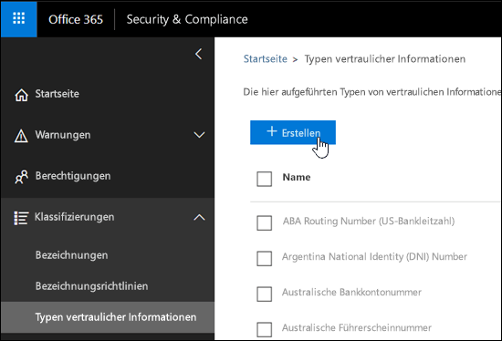
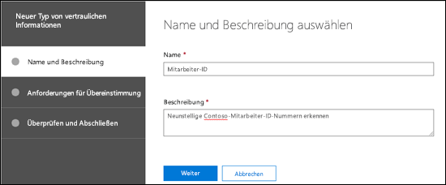
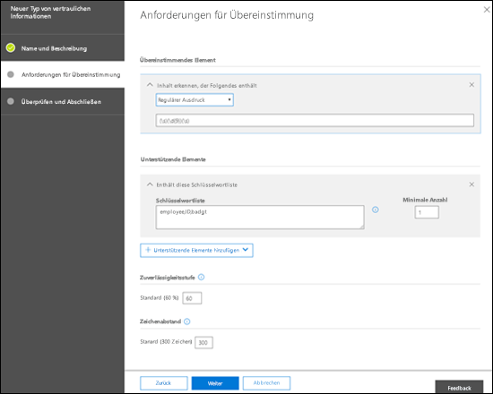
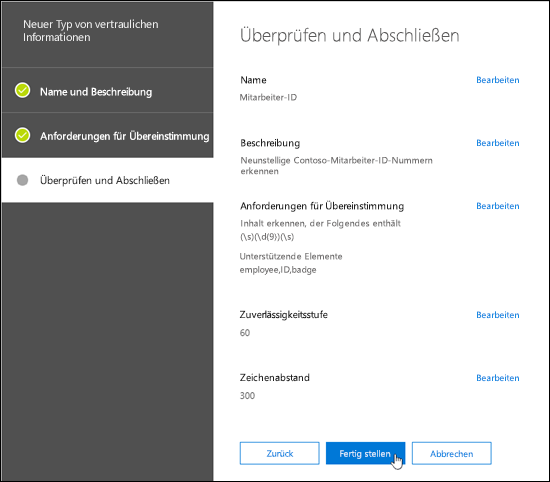
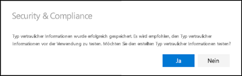
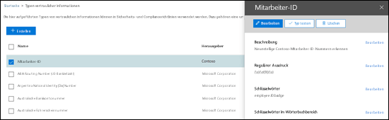
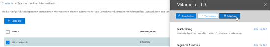
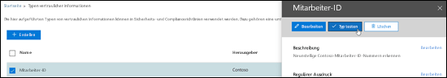
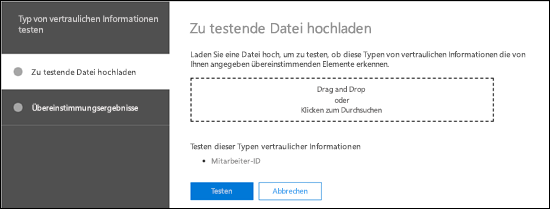
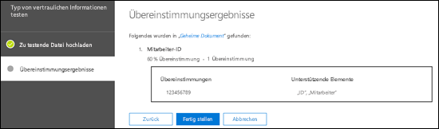

<!-- rename md file to match the display name -->
# Erstellen eines benutzerdefinierten vertraulichen Informationstyps im Security & Compliance CenterCreate a custom sensitive information type in the Security & Compliance Center

Lesen Sie diesen Artikel, zumErstellen eines benutzerdefinierten vertraulichen Informationstyps im Security & Compliance Center ([https://protection.office.com](https://protection.office.com)).Read this article to create a custom sensitive information type in the Security & Compliance Center ([https://protection.office.com](https://protection.office.com)). Die benutzerdefinierte Typen vertraulicher Informationen, die Sie mit dieser Methode erstellen, werden zum Regelpaket namens `Microsoft.SCCManaged.CustomRulePack`hinzugefügt.The custom sensitive information types that you create by using this method are added to the rule package named `Microsoft.SCCManaged.CustomRulePack`.

Sie können auch benutzerdefinierte vertrauliche Informationstypen mithilfe von PowerShell und genauer Datenübereinstimmung erstellen.You can also create custom sensitive information types by using PowerShell and Exact Data Match capabilities. Weitere Informationen zu diesen Methoden finden Sie unter:To learn more about those methods, see:
- [Erstellen eines benutzerdefinierten Typs für vertrauliche Informationen in Security & Compliance Center PowerShellCreate a custom sensitive information type in Security & Compliance Center PowerShell](create-a-custom-sensitive-information-type-in-scc-powershell.md)
- [Erstellen eines benutzerdefinierten vertraulichen Informationstyps für DLP mit genauer Datenübereinstimmung (EDM)Create a custom sensitive information type for DLP with Exact Data Match (EDM)](create-custom-sensitive-information-types-with-exact-data-match-based-classification.md)

> [!NOTE]
> Microsoft 365 Information Protection unterstützt jetzt in der Vorschau Sprachen mit Doublebyte-Zeichensätzen für:Microsoft 365 Information Protection now  supports in preview double byte character set languages for:
> - Chinesisch (vereinfacht)Chinese (simplified)
> - Chinesisch (traditionell)Chinese (traditional)
> - KoreanischKorean
> - JapanischJapanese
> 
>Diese Vorschau ist nur in der kommerziellen Cloud verfügbar, und die Einführung ist beschränkt auf:This preview is only in the commercial cloud and the rollout is limited to:
> - JapanJapan
> - KoreaKorea
> - ChinaChina
> - HongkongHong Kong
> - MacauMacau
> - TaiwanTaiwan
>
>Diese Unterstützung ist für vertrauliche Informationstypen verfügbar.This support is available for sensitive information types. Weitere Informationen hierzu finden Sie in den [Versionshinweisen (Vorschau) zur Unterstützung des Informationsschutzes für Doppelbyte-Zeichensätze](mip-dbcs-relnotes.md).See, [Information protection support for double byte character sets release notes (preview)](mip-dbcs-relnotes.md) for more information.

## Bevor Sie beginnenBefore you begin

> [!NOTE]
> Sie sollten über globale Administrator-oder Compliance-Administratorberechtigungen verfügen, um über die Benutzeroberfläche einen benutzerdefinierten vertraulichen Informationstyp erstellen, testen und bereitstellen zu können.You should have Global admin or Compliance admin permissions to create, test, and deploy a custom sensitive information type through the UI. Informationen hierzu finden Sie unter[Zu Administratorrollen](https://docs.microsoft.com/office365/admin/add-users/about-admin-roles?view=o365-worldwide) in Office 365.See [About admin roles](https://docs.microsoft.com/office365/admin/add-users/about-admin-roles?view=o365-worldwide) in Office 365.

- Ihre Organisation muss über ein Abonnement verfügen, z. B. Office 365 Enterprise, das Verhinderung von Datenverlust (DLP) beinhaltet.Your organization must have a subscription, such as Office 365 Enterprise, that includes Data Loss Prevention (DLP). Siehe [Nachrichtenrichtlinie und Compliance ServiceDescription](https://docs.microsoft.com/office365/servicedescriptions/exchange-online-protection-service-description/messaging-policy-and-compliance-servicedesc).See [Messaging Policy and Compliance ServiceDescription](https://docs.microsoft.com/office365/servicedescriptions/exchange-online-protection-service-description/messaging-policy-and-compliance-servicedesc). 

- Benutzerdefinierte Typen für vertrauliche Informationen erfordern Kenntnisse über reguläre Ausdrücke (RegEx). Weitere Informationen über das Modul Boost.RegEx (vormals als RegEx++ bezeichnet), das für die Textverarbeitung verwendet wird, finden Sie unter [Boost.Regex 5.1.3](https://www.boost.org/doc/libs/1_68_0/libs/regex/doc/html/).Custom sensitive information types require familiarity with regular expressions (RegEx). For more information about the Boost.RegEx (formerly known as RegEx++) engine that's used for processing the text, see [Boost.Regex 5.1.3](https://www.boost.org/doc/libs/1_68_0/libs/regex/doc/html/).

  Der Kundendienst und Support von Microsoft kann beim Erstellen benutzerdefinierter Klassifizierungen oder Muster für reguläre Ausdrücke keine Unterstützung anbieten.Microsoft Customer Service & Support can't assist with creating custom classifications or regular expression patterns. Die Supportmitarbeiter können eingeschränkten Support für das Feature bereitstellen, beispielsweise Muster für reguläre Ausdrücke zu Testzwecken oder Hilfestellung bei der Problembehandlung eines bestehenden Musters für reguläre Ausdrücke, das nicht wie erwartet ausgelöst wird, es können jedoch keine Zusicherungen dahingehend gegeben werden, dass benutzerdefinierte Entwicklungen für die Inhaltsübereinstimmung Ihre Anforderungen oder Verpflichtungen erfüllen.Support engineers can provide limited support for the feature, such as, providing sample regular expression patterns for testing purposes, or assisting with troubleshooting an existing regular expression pattern that's not triggering as expected, but can't provide assurances that any custom content-matching development will fulfill your requirements or obligations.

- DLP verwendet den Suchcrawler zum Erkennen und Klassifizieren vertraulicher Informationen in SharePoint Online- und OneDrive for Business-Websites.DLP uses the search crawler to identify and classify sensitive information in SharePoint Online and OneDrive for Business sites. Um den neuen benutzerdefinierten vertraulichen Informationstyp in vorhandenen Inhalten zu identifizieren, müssen die Inhalte erneut durchforstet werden.To identify your new custom sensitive information type in existing content, the content must be re-crawled. Inhalte werden basierend auf einem Zeitplan durchforstet, aber Sie können Inhalte für eine Websitesammlung, Liste oder Bibliothek manuell erneut durchforsten.Content is crawled based on a schedule, but you can manually re-crawl content for a site collection, list, or library. Weitere Informationen finden Sie unter [Manuelles Anfordern des Durchforstens und des erneuten Indizierens einer Website, Bibliothek oder Liste](https://docs.microsoft.com/sharepoint/crawl-site-content).For more information, see [Manually request crawling and re-indexing of a site, a library or a list](https://docs.microsoft.com/sharepoint/crawl-site-content).

## Erstellen von benutzerdefinierten Typen für vertrauliche Informationen im Security & Compliance CenterCreate custom sensitive information types in the Security & Compliance Center

Wechseln Sie im Security & Compliance Center zu **Klassifizierungen** \> **Typen vertraulicher Informationen**, und klicken Sie auf **Erstellen**.In the Security & Compliance Center, go to **Classifications** \> **Sensitive info types** and click **Create**.

Die Einstellungen sind selbsterklärend und werden auf der entsprechenden Seite des Assistenten erläutert:The settings are fairly self-evident, and are explained on the associate page of the wizard:

- **Name****Name**

- **Beschreibung****Description**

- **Näherung****Proximity**

- **Zuverlässigkeitsstufe****Confidence level**

- **Primäres Muster-Element** (Schlüsselwörter, reguläre Ausdrücke oder Wörterbuch)**Primary pattern element** (keywords, regular expression, or dictionary)

- Optionale Elemente für **unterstützende Muster** (Schlüsselwörter, reguläre Ausdrücke oder Wörterbuch) und einen entsprechenden Wert für **Mindestkosten**.Optional **Supporting pattern elements** (keywords, regular expression, or dictionary) and a corresponding **Minimum cost** value.

Sehen Sie sich das folgende Szenario an: Sie möchten einen benutzerdefinierten Typ für vertrauliche Informationen, der neunstellige Mitarbeiternummern in Inhalten erkennt, zusammen mit den Schlüsselwörtern „Mitarbeiter“, „ID“ und „Ausweis“. Um diesen benutzerdefinierten Typ für vertrauliche Information zu erstellen, führen Sie die folgenden Schritte aus:Here's a scenario: You want a custom sensitive information type that detects 9-digit employee numbers in content, along with the keywords "employee" "ID" and "badge". To create this custom sensitive information type, do the following steps:

1. Wechseln Sie im Security & Compliance Center zu **Klassifizierungen** \> **Typen vertraulicher Informationen**, und klicken Sie auf **Erstellen**.In the Security & Compliance Center, go to **Classifications** \> **Sensitive info types** and click **Create**.

    

2. Geben Sie auf der Seite **Namen und Beschreibung auswählen**, die geöffnet wird, die folgenden Werte ein:In the **Choose a name and description** page that opens, enter the following values:

  - **Name**: Mitarbeiter-ID.**Name**: Employee ID.

  - **Beschreibung**: Neunstellige Contoso-Mitarbeiter-ID-Nummern erkennen.**Description**: Detect nine-digit Contoso employee ID numbers.

    

    Klicken Sie nach Abschluss des Vorgangs auf **Weiter**.When you're finished, click **Next**.

3. Klicken Sie auf der Seite **Anforderungen für Übereinstimmung** auf **Element hinzufügen**, um die folgenden Einstellungen zu konfigurieren:In the **Requirements for matching** page that opens, click **Add an element** configure the following settings:

    - **Inhalt erkennen, der Folgendes enthält**:**Detect content containing**:
 
      a. Klicken Sie auf die Option, dass **eines der folgenden Elemente enthalten sein muss**, und wählen Sie **Regulärer Ausdruck** aus.a. Click **Any of these** and select **Regular expression**.

      b. Geben Sie in dem Feld für den regulären Ausdruck `(\s)(\d{9})(\s)` ein (neunstellige Zahlen umgeben von einem Leerzeichen).b. In the regular expression box, enter `(\s)(\d{9})(\s)` (nine-digit numbers surrounded by white space).
  
    - **Unterstützende Elemente**: Klicken Sie auf **Unterstützende Elemente hinzufügen**, und wählen Sie **Enthält die folgende Schlüsselwortliste** aus.**Supporting elements**: Click **Add supporting elements** and select **Contains this keyword list**.

    - Konfigurieren Sie in dem Bereich **Enthält die folgende Schlüsselwortliste**, der angezeigt wird, die folgenden Einstellungen:In the **Contains this keyword list** area that appears, configure the following settings:

      - **Schlüsselwortliste**: Geben Sie den folgenden Wert ein: Mitarbeiter,ID,Ausweis.**Keyword list**: Enter the following value: employee,ID,badge.

      - **Mindestanzahl**: Behalten Sie den Standardwert 1 bei.**Minimum count**: Leave the default value 1.

    - Behalten Sie den Standardwert 60 für den **Zuverlässigkeitsgrad** bei.Leave the default **Confidence level** value 60. 

    - Behalten Sie den Standardwert 300 für den **Zeichenabstand** bei.Leave the default **Character proximity** value 300.

    

    Klicken Sie nach Abschluss des Vorgangs auf **Weiter**.When you're finished, click **Next**.

4. Überprüfen Sie auf der Seite **Überprüfen und Abschließen** die Einstellungen, und klicken Sie auf **Fertig stellen**.On the **Review and finalize** page that opens, review the settings and click **Finish**.

    

5. Auf der nächsten Seite werden Sie aufgefordert, den neuen benutzerdefinierten Typ für vertrauliche Informationen zu testen. Klicken Sie dazu auf **Ja**. Weitere Informationen finden Sie unter [Testen von benutzerdefinierten Typen für vertrauliche Information im Security & Compliance Center](#test-custom-sensitive-information-types-in-the-security--compliance-center). Um die Regel später zu testen, klicken Sie auf **Nein**.The next page encourages you to test the new custom sensitive information type by clicking **Yes**. For more information, see [Test custom sensitive information types in the Security & Compliance Center](#test-custom-sensitive-information-types-in-the-security--compliance-center). To test the rule later, click **No**.

    

### Woher wissen Sie, dass dieses Verfahren erfolgreich war?How do you know this worked?

Um sicherzustellen, dass Sie einen neuen Typ für vertrauliche Informationen erstellt haben, führen Sie einen der folgenden Schritte aus:To verify that you've successfully created a new sensitive information type, do any of the following steps:

  - Wechseln Sie zu **Klassifizierungen** \> **Typen vertraulicher Informationen**, und bestätigen Sie, dass der neue benutzerdefinierte Typ für vertrauliche Informationen aufgeführt ist.Go to **Classifications** \> **Sensitive info types** and verify the new custom sensitive information type is listed.

  - Testen Sie den neuen benutzerdefinierten Typ für vertrauliche Informationen. Weitere Informationen finden Sie unter [Testen von benutzerdefinierten Typen für vertrauliche Informationen im Security & Compliance Center](#test-custom-sensitive-information-types-in-the-security--compliance-center).Test the new custom sensitive information type. For more information, see [Test custom sensitive information types in the Security & Compliance Center](#test-custom-sensitive-information-types-in-the-security--compliance-center).

## Ändern von benutzerdefinierten Typen für vertrauliche Information im Security & Compliance CenterModify custom sensitive information types in the Security & Compliance Center

**Hinweise**:**Notes**:
<!-- check to see if this note contradicts the guidance in "customize a built in sensitive information type customize-a-built-in-sensitive-information-type it sure seems like it does-->
- Sie können nur benutzerdefinierte Typen für vertrauliche Informationen ändern; integrierte Typen vertraulicher Informationen können nicht geändert werden. Sie können aber PowerShell verwenden, um integrierte Typen vertraulicher Informationen zu exportieren, diese anzupassen und sie als benutzerdefinierte Typen vertraulicher Informationen zu importieren. Weitere Informationen finden Sie unter [Anpassen eines integrierten benutzerdefinierten Typs für vertrauliche Informationen](customize-a-built-in-sensitive-information-type.md).You can only modify custom sensitive information types; you can't modify built-in sensitive information types. But you can use PowerShell to export built-in custom sensitive information types, customize them, and import them as custom sensitive information types. For more information, see [Customize a built-in sensitive information type](customize-a-built-in-sensitive-information-type.md).

- Sie können nur benutzerdefinierte Typen für vertrauliche Informationen ändern, die Sie in der Benutzeroberfläche erstellt haben. Wenn Sie das [PowerShell-Verfahren](create-a-custom-sensitive-information-type-in-scc-powershell.md) zum Importieren eines Regelpakets für benutzerdefinierte Typen für vertrauliche Informationen verwendet haben, erhalten Sie eine Fehlermeldung.You can only modify custom sensitive information types that you created in the UI. If you used the [PowerShell procedure](create-a-custom-sensitive-information-type-in-scc-powershell.md) to import a custom sensitive information type rule package, you'll get an error.

Wechseln Sie im Security & Compliance Center zu **Klassifizierungen** \> **Typen vertraulicher Informationen**, und wählen Sie den benutzerdefinierten Typ vertraulicher Informationen aus, den Sie ändern möchten. Klicken Sie anschließend auf **Bearbeiten**.In the Security & Compliance Center, go to **Classifications** \> **Sensitive info types**, select the custom sensitive information type that you want to modify, and then click **Edit**.

  

Hier stehen die gleichen Optionen wie beim Erstellen des benutzerdefinierten Typs für vertrauliche Informationen im Security & Compliance Center zur Verfügung. Weitere Informationen finden Sie unter [Erstellen von benutzerdefinierten Typen für vertrauliche Informationen im Security & Compliance Center](#create-custom-sensitive-information-types-in-the-security--compliance-center).The same options are available here as when you created the custom sensitive information type in the Security & Compliance Center. For more information, see [Create custom sensitive information types in the Security & Compliance Center](#create-custom-sensitive-information-types-in-the-security--compliance-center).

### Woher wissen Sie, dass dieses Verfahren erfolgreich war?How do you know this worked?

Um sicherzustellen, dass Sie einen neuen Typ für vertrauliche Informationen erfolgreich geändert haben, führen Sie einen der folgenden Schritte aus:To verify that you've successfully modified a sensitive information type, do any of the following steps:

  - Wechseln Sie zu **Klassifizierungen** \> **Typen vertraulicher Informationen**, um die Eigenschaften des geänderten benutzerdefinierten Typs vertraulicher Informationen zu überprüfen.Go to **Classifications** \> **Sensitive info types** to verify the properties of the modified custom sensitive information type. 

  - Testen Sie den geänderten benutzerdefinierten Typ für vertrauliche Informationen. Weitere Informationen finden Sie unter [Testen von benutzerdefinierten Typen für vertrauliche Informationen im Security & Compliance Center](#test-custom-sensitive-information-types-in-the-security--compliance-center).Test the modified custom sensitive information type. For more information, see [Test custom sensitive information types in the Security & Compliance Center](#test-custom-sensitive-information-types-in-the-security--compliance-center).

## Entfernen von benutzerdefinierten Typen für vertrauliche Informationen im Security & Compliance CenterRemove custom sensitive information types in the Security & Compliance Center 

**Hinweise**:**Notes**:

- Sie können nur benutzerdefinierte Typen für vertrauliche Informationen entfernen; Sie können keine integrierten Typen vertraulicher Informationen entfernen.You can only remove custom sensitive information types; you can't remove built-in sensitive information types.

- Bevor Sie einen benutzerdefinierten Typ für vertrauliche Informationen entfernen, überprüfen Sie, dass keine DLP-Richtlinien oder Exchange-Nachrichtenflussregeln (auch bezeichnet als Transportregeln) mehr auf den Typ vertraulicher Informationen verweisen.Before your remove a custom sensitive information type, verify that no DLP policies or Exchange mail flow rules (also known as transport rules) still reference the sensitive information type.

1. Wechseln Sie im Security & Compliance Center zu **Klassifizierungen** \> **Typen vertraulicher Informationen**, und wählen Sie einen oder mehrere benutzerdefinierte Typen vertraulicher Informationen aus, die Sie entfernen möchten.In the Security & Compliance Center, go to **Classifications** \> **Sensitive info types** and select one or more custom sensitive information types that you want to remove.

2. Klicken Sie in dem Fenster, das geöffnet wird, auf **Löschen** (oder auf **Typen vertraulicher Informationen löschen**, wenn Sie mehrere ausgewählt haben).In the fly-out that opens, click **Delete** (or **Delete sensitive info types** if you selected more than one).

    

3. Klicken Sie in der angezeigten Warnmeldung auf **Ja**.In the warning message that appears, click **Yes**.

### Woher wissen Sie, dass dieses Verfahren erfolgreich war?How do you know this worked?

Um sicherzustellen, dass Sie einen benutzerdefinierten Typ vertraulicher Informationen erfolgreich entfernt haben, wechseln Sie zu **Klassifizierungen** \> **Typen vertraulicher Informationen**, und bestätigen Sie, dass der benutzerdefinierte Typ vertraulicher Informationen nicht mehr aufgeführt ist.To verify that you've successfully removed a custom sensitive information type, go to **Classifications** \> **Sensitive info types** to verify the custom sensitive information type is no longer listed.

## Testen von benutzerdefinierten Typen für vertrauliche Informationen im Security & Compliance CenterTest custom sensitive information types in the Security & Compliance Center

1. Wechseln Sie im Security & Compliance Center zu **Klassifizierungen** \> **Typen vertraulicher Informationen**.In the Security & Compliance Center, go to **Classifications** \> **Sensitive info types**.

2. Wählen Sie einen oder mehrere benutzerdefinierte Typen vertraulicher Informationen aus, die Sie testen möchten. Klicken Sie in dem Fenster, das geöffnet wird, auf **Typ testen** (oder auf **Typen vertraulicher Informationen testen**, wenn Sie mehrere ausgewählt haben).Select one or more custom sensitive information types to test. In the fly-out that opens, click **Test type** (or **Test sensitive info types** if you selected more than one).

    

3. Laden Sie auf der Seite **Zu testende Datei hochladen**, die geöffnet wird, per Drag & Drop ein zu testendes Dokument hoch, oder klicken Sie auf **Durchsuchen**, und wählen Sie eine Datei aus.On the **Upload file to test** page that opens, upload a document to test by dragging and dropping a file or by clicking **Browse** and selecting a file.

    

4. Klicken Sie auf die Schaltfläche **Testen**, um das Dokument auf Musterübereinstimmungen in der Datei zu testen.Click the **Test** button to test the document for pattern matches in the file.

5. Klicken Sie auf der Seite **Übereinstimmungsergebnisse** auf **Fertig stellen**.On the **Match results** page, click **Finish**.

    
