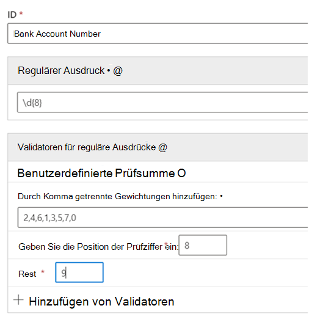

# Erste Schritte mit benutzerdefinierten Typen vertraulicher InformationenGet started with custom sensitive information types

Wenn die vorkonfigurierten Typen vertraulicher Informationen nicht Ihren Anforderungen entsprechen, können Sie Ihre eigenen benutzerdefinierten Typen vertraulicher Informationen erstellen, die Sie vollständig selbst definieren, oder Sie können einen der vorkonfigurierten Typen kopieren und dann ändern.If the pre-configured sensitive information types don't meet your needs, you can create your own custom sensitive information types that you fully define or you can copy one of the pre-configured ones and modify it.

Die benutzerdefinierten Typen vertraulicher Informationen, die Sie mit dieser Methode erstellen, werden zum Regelpaket namens `Microsoft.SCCManaged.CustomRulePack`hinzugefügt.The custom sensitive information types that you create by using this method are added to the rule package named `Microsoft.SCCManaged.CustomRulePack`.

Es gibt zwei Möglichkeiten, wie ein neuer vertraulicher Informationstyp erstellen werden kann:There are two ways to create a new sensitive information type:

- [vom Grund auf, wobei Sie alle Elemente selbst definierenfrom scratch where you fully define all elements](#create-a-custom-sensitive-information-type)
- [indem Sie einen bereits vorhandenen Typ vertraulicher Informationen kopieren und dann änderncopy and modify an existing sensitive information type](#copy-and-modify-a-sensitive-information-type)

## Bevor Sie beginnen:Before you begin

- Sie sollten mit den Typen vertraulicher Informationen und deren Zusammenstellung vertraut sein.You should be familiar with sensitive information types and what they are composed of. Informationen hierzu finden Sie unter [Weitere Informationen zu Typen vertraulicher Informationen](sensitive-information-type-learn-about.md).See, [Learn about sensitive information types](sensitive-information-type-learn-about.md). Es ist wichtig, dass Sie die Rollen des Folgenden verstehen:It is critical to understand the roles of:
    - [Reguläre Ausdrücke](https://www.boost.org/doc/libs/1_68_0/libs/regex/doc/html/) – Microsoft 365 Typen vertraulicher Informationen verwenden das Modul Boost.RegEx 5.1.3[regular expressions](https://www.boost.org/doc/libs/1_68_0/libs/regex/doc/html/) - Microsoft 365 sensitive information types uses the Boost.RegEx 5.1.3 engine
    - Schlüsselwortlisten – Sie können Ihre eigenen erstellen, während Sie Ihren Typ vertraulicher Informationen definieren oder aus vorhandenen Schlüsselwortlisten auswählenkeyword lists - you can create your own as you define your sensitive information type or choose from existing keyword lists
    - [Schlüsselwörterbuchkeyword dictionary](create-a-keyword-dictionary.md)
    - [Funktionenfunctions](what-the-dlp-functions-look-for.md)
    - [Konfidenzniveausconfidence levels](sensitive-information-type-learn-about.md#more-on-confidence-levels)
 
- Sie müssen über globale Administrator-oder Compliance-Administratorberechtigungen verfügen, um über die Benutzeroberfläche einen benutzerdefinierten vertraulichen Informationstyp erstellen, testen und bereitstellen zu können.You must have Global admin or Compliance admin permissions to create, test, and deploy a custom sensitive information type through the UI. Informationen hierzu finden Sie unter[Zu Administratorrollen](/office365/admin/add-users/about-admin-roles?view=o365-worldwide) in Office 365.See [About admin roles](/office365/admin/add-users/about-admin-roles?view=o365-worldwide) in Office 365.

- Ihre Organisation muss über ein Abonnement verfügen, z. B. Office 365 Enterprise, das Verhinderung von Datenverlust (DLP) beinhaltet.Your organization must have a subscription, such as Office 365 Enterprise, that includes Data Loss Prevention (DLP). Siehe [Nachrichtenrichtlinie und Compliance ServiceDescription](/office365/servicedescriptions/exchange-online-protection-service-description/messaging-policy-and-compliance-servicedesc).See [Messaging Policy and Compliance ServiceDescription](/office365/servicedescriptions/exchange-online-protection-service-description/messaging-policy-and-compliance-servicedesc). 

> [!IMPORTANT]
> Der Kundendienst und Support von Microsoft kann beim Erstellen benutzerdefinierter Klassifizierungen oder Muster für reguläre Ausdrücke keine Unterstützung anbieten.Microsoft Customer Service & Support can't assist with creating custom classifications or regular expression patterns. Die Supportmitarbeiter können eingeschränkten Support für das Feature bereitstellen, beispielsweise Muster für reguläre Ausdrücke zu Testzwecken oder Hilfestellung bei der Problembehandlung eines bestehenden Musters für reguläre Ausdrücke, das nicht wie erwartet ausgelöst wird, es können jedoch keine Zusicherungen dahingehend gegeben werden, dass benutzerdefinierte Entwicklungen für die Inhaltsübereinstimmung Ihre Anforderungen oder Verpflichtungen erfüllen.Support engineers can provide limited support for the feature, such as, providing sample regular expression patterns for testing purposes, or assisting with troubleshooting an existing regular expression pattern that's not triggering as expected, but can't provide assurances that any custom content-matching development will fulfill your requirements or obligations.

## Erstellen eines benutzerdefinierten Typs für vertrauliche InformationenCreate a custom sensitive information type

Verwenden Sie dieses Verfahren, um einen neuen Typ vertraulicher Informationen zu erstellen, den Sie vollständig definieren.Use this procedure to create a new sensitive information type that you fully define. 

1. Wechseln Sie im Compliance Center zu **Datenklassifizierung** \> **Typen vertraulicher Informationen** und wählen Sie **Informationstyp erstellen** aus.In the Compliance Center, go to **Data classification** \> **Sensitive info types** and choose **Create info type**.
2. Füllen Sie die Werte für **Name** und **Beschreibung** aus und wählen Sie **Weiter**.Fill in values for **Name** and **Description** and choose **Next**.
3. Wählen Sie **Muster erstellen**.Choose **Create pattern**. Während Sie Ihren neuen Typ vertraulicher Informationen definieren, können Sie mehrere Muster erstellen, jedes mit unterschiedlichen Elementen und Konfidenzniveaus.You can create multiple patterns, each with different elements and confidence levels, as you define your new sensitive information type.
4. Wählen Sie ein Standard-Konfidenzniveau für das Muster aus.Choose the default confidence level for the pattern. Die Werte sind **Niedrige Konfidenz**, **Mittlere Konfidenz** und **Hohe Konfidenz**.The values are **Low confidence**, **Medium confidence**, and **High confidence**.
5. Wählen Sie und definieren Sie das **Primäre Element**.Choose and define **Primary element**. Das primäre Element kann ein **Regulärer Ausdruck** mit einem optionalen Validator, eine **Schlüsselwortliste**, ein **Schlüsselwörterbuch**, oder eine der vorkonfigurierten **Funktionen** sein.The primary element can be a **Regular expression** with an optional validator, a **Keyword list**, a **Keyword dictionary**, or one of the pre-configured **Functions**. Weitere Informationen zu DLP-Funktionen finden Sie unter [Wonach die DLP-Funktionen suchen](what-the-dlp-functions-look-for.md).For more information on DLP functions, see [What the DLP functions look for](what-the-dlp-functions-look-for.md). Weitere Informationen zum Datum und zu den Prüfsummenüberprüfungen finden Sie unter Weitere Informationen zu [Validatoren für reguläre Ausdrücke](#more-information-on-regular-expression-validators).For more information on the date and the checksum validators, see [More information on regular expression validators](#more-information-on-regular-expression-validators).
6. Füllen Sie einen Wert für den **Zeichenabstand** aus.Fill in a value for **Character proximity**.
7. (Optional) Wenn Sie welche haben, fügen Sie unterstützende Elemente hinzu.(Optional) Add supporting elements if you have any. Unterstützende Elemente können ein regulärer Ausdruck mit einem optionalen Validator, eine Schlüsselwortliste, ein Schlüsselwörterbuch, oder eine der vordefinierten Funktionen sein.Supporting elements can be a regular expression with an optional validator, a keyword list, a keyword dictionary or one of the pre-defined functions. Unterstützende Elemente können über eine eigene **Character-Näherungskonfiguration** verfügen.Supporting elements can have their own **Character proximity** configuration. 
8. (Optional) Fügen Sie [**zusätzliche Prüfungen**](#more-information-on-additional-checks) aus der Liste der verfügbaren Prüfungen hinzu.(Optional) Add any [**additional checks**](#more-information-on-additional-checks) from the list of available checks.
9. Wählen Sie **Erstellen**.Choose **Create**.
10. Wählen Sie **Weiter** aus.Choose **Next**.
11. Wählen Sie das **empfohlene Konfidenzniveau** für diesen Typ vertraulicher Informationen aus.Choose the **recommended confidence level** for this sensitive information type.
12. Überprüfen Sie Ihre Einstellungen, und wählen Sie dann **Absenden** aus.Check your setting and choose **Submit**.

> [!IMPORTANT]
> Microsoft 365 verwendet den Suchcrawler zum Erkennen und Klassifizieren vertraulicher Informationen in SharePoint Online- und OneDrive for Business-Websites.Microsoft 365 uses the search crawler to identify and classify sensitive information in SharePoint Online and OneDrive for Business sites. Um den neuen benutzerdefinierten vertraulichen Informationstyp in vorhandenen Inhalten zu identifizieren, müssen die Inhalte erneut durchforstet werden.To identify your new custom sensitive information type in existing content, the content must be re-crawled. Inhalte werden basierend auf einem Zeitplan durchforstet, aber Sie können Inhalte für eine Websitesammlung, Liste oder Bibliothek manuell erneut durchforsten.Content is crawled based on a schedule, but you can manually re-crawl content for a site collection, list, or library. Weitere Informationen finden Sie unter [Manuelles Anfordern des Durchforstens und des erneuten Indizierens einer Website, Bibliothek oder Liste](/sharepoint/crawl-site-content).For more information, see [Manually request crawling and re-indexing of a site, a library or a list](/sharepoint/crawl-site-content).

13. Auf der Seite **Datenklassifizierung** werden Ihnen alle Typen vertraulicher Informationen aufgelistet angezeigt.On the **Data classification** page, you'll see all the sensitive information types listed. Wählen Sie **Aktualisieren** und suchen Sie dann nach dem Typ vertraulicher Informationen, den Sie erstellt haben.Choose **Refresh** and then browse for or use the search tool to find the sensitive information type you created.

## Einen vertraulichen Informationstyp testenTest a sensitive information type

Sie können jeden Typ vertraulicher Informationen in der Liste testen.You can test any sensitive information type in the list. Wir empfehlen jeden Typ vertraulicher Informationen, den Sie erstellen, zu testen, bevor Sie ihn in einer Richtlinie verwenden.We suggest that you test every sensitive information type that you create before using it in a policy.

1. Bereiten Sie zwei Dateien vor, wie z. B. ein Word-Dokument.Prepare two files, like a Word document. Eins mit einem Inhalt, der den Elementen entspricht, die Sie in Ihren Typen vertraulicher Informationen angegebenen haben, und eins, das ihnen nicht entspricht.One with content that matches the elements you specified in your sensitive information type and one that doesn't match.
2. Wechseln Sie im Compliance Center zu **Datenklassifizierung** \> **Typen vertraulicher Informationen** und wählen Sie den Typ vertraulicher Informationen aus der Liste aus, um den Detailbereich zu öffnen, und wählen Sie dann **Test**.In the Compliance Center, go to **Data classification** \> **Sensitive info types** and choose the sensitive information type from the list to open the details pane and choose **Test**.
3. Laden Sie eine Datei hoch und wählen Sie **Test**.Upload a file and choose **Test**.
4. Überprüfen Sie die Ergebnisse auf der Seite **Stimmt mit den Ergebnissen überein**, und wählen Sie **Fertigstellen** aus.On the **Matches results** page, review the results and choose **Finish**.

## Ändern von benutzerdefinierten Typen vertraulicher Informationen im Compliance CenterModify custom sensitive information types in the Compliance Center

1. Wechseln Sie im Compliance Center zu **Datenklassifizierung** \> **Typen vertraulicher Informationen** und wählen Sie den Typ vertraulicher Informationen aus der Liste aus, die Sie ändern möchten, wählen Sie **Bearbeiten**.In the Compliance Center, go to **Data classification** \> **Sensitive info types** and choose the sensitive information type from the list that you want to modify choose **Edit**.
2. Sie können andere Muster mit einzigartigen primären und unterstützenden Elementen, Konfidenzniveaus, Zeichenabstand und [**zusätzlichen Prüfungen**](#more-information-on-additional-checks) hinzufügen, oder die bereits vorhandenen bearbeiten/entfernen.You can add other patterns, with unique primary and supporting elements, confidence levels, character proximity, and [**additional checks**](#more-information-on-additional-checks) or edit/remove the existing ones.

## Entfernen von benutzerdefinierten Typen für vertrauliche Informationen im Compliance CenterRemove custom sensitive information types in the Compliance Center 

> [!NOTE]
> Sie können nur benutzerdefinierte Typen für vertrauliche Informationen entfernen; Sie können keine integrierten Typen vertraulicher Informationen entfernen.You can only remove custom sensitive information types; you can't remove built-in sensitive information types.

> [!IMPORTANT]
> Bevor Sie einen benutzerdefinierten Typ für vertrauliche Informationen entfernen, überprüfen Sie, dass keine DLP-Richtlinien oder Exchange-Nachrichtenflussregeln (auch bezeichnet als Transportregeln) mehr auf den Typ vertraulicher Informationen verweisen.Before your remove a custom sensitive information type, verify that no DLP policies or Exchange mail flow rules (also known as transport rules) still reference the sensitive information type.

1. Wechseln Sie im Compliance Center zu **Datenklassifizierung** \> **Typen vertraulicher Informationen** und wählen Sie den Typ vertraulicher Informationen aus der Liste aus, die Sie entfernen möchten.In the Compliance Center, go to **Data classification** \> **Sensitive info types** and choose the sensitive information type from the list that you want to remove.
2. Im Flyout, das geöffnet wird, wählen Sie **Löschen**.In the fly-out that opens, choose **Delete**.

## Einen Typ vertraulicher Informationen kopieren und ändernCopy and modify a sensitive information type

Verwendung Sie dieses Verfahren, um einen neuen Typ vertraulicher Informationen zu erstellen, der auf einem bereits vorhandenen Typ vertraulicher Informationen basiert.Use this procedure to create a new sensitive information type that is based on an existing sensitive information type. 

1. Wechseln Sie im Compliance Center zu **Datenklassifizierung** \> **Typen vertraulicher Informationen** und wählen Sie den Typ vertraulicher Informationen aus, die Sie kopieren möchten.In the Compliance Center, go to **Data classification** \> **Sensitive info types** and choose the sensitive information type that you want to copy.
2. Wählen Sie im Flyout **Kopieren** aus.In the flyout, choose **Copy**.
3. Wählen Sie in der Liste der Typen vertraulicher Informationen **Aktualisieren** aus, und suchen Sie nach der Kopie, die Sie gerade erstellt haben.Choose **Refresh** in the list of sensitive information types and either browse or search for the copy you just made. Die Teilzeichenfolge sucht nach Arbeit, daher könnten Sie einfach nach `copy` suchen, und die Suche würde dann alle Typen vertraulicher Informationen mit dem Wort `copy` im Namen zurückgeben.Partial sting searches work, so you could just search for `copy` and search would return all the sensitive information types with the word `copy` in the name. 
4. Füllen Sie die Werte für **Name** und **Beschreibung** aus und wählen Sie **Weiter**.Fill in values for **Name** and **Description** and choose **Next**.
5. Wählen Sie Ihre Kopie des Typs vertraulicher Informationen aus und wählen Sie **Bearbeiten**.Choose your sensitive information type copy and choose **Edit**. 
6. Geben Sie Ihrem neuen Typ vertraulicher Informationen einen neuen **Namen** und **Beschreibung**.Give your new sensitive information type a new **Name** and **Description**.
7. Sie können die vorhandenen Muster bearbeiten und entfernen und neue hinzufügen.You can choose to edit or remove the existing patterns and add new ones. Wählen Sie ein Standard-Konfidenzniveau für das neue Muster aus.Choose the default confidence level for the new pattern. Die Werte sind **Niedrige Konfidenz**, **Mittlere Konfidenz** und **Hohe Konfidenz**.The values are **Low confidence**, **Medium confidence**, and **High confidence**.
8. Wählen Sie und definieren Sie das **Primäre Element**.Choose and define **Primary element**. Das primäre Element kann ein **Regulärer Ausdruck**, eine **Schlüsselwortliste**, ein **Schlüsselwörterbuch**, oder eine der vorkonfigurierten **Funktionen** sein.The primary element can be a **Regular expression**, a **Keyword list**, a **Keyword dictionary**, or one of the pre-configured **Functions**. Lesen Sie [Wonach die DLP-Funktionen suchen](what-the-dlp-functions-look-for.md).See, [What the DLP functions look for](what-the-dlp-functions-look-for.md).
9. Füllen Sie einen Wert für den **Zeichenabstand** aus.Fill in a value for **Character proximity**.
10. (Optional) Wenn Sie **Unterstützende Elemente** oder jede beliebige [**Zusätzliche Prüfungen**](#more-information-on-additional-checks) haben, fügen Sie diese hinzu.(Optional) If you have **Supporting elements** or any [**Additional checks**](#more-information-on-additional-checks) add them. Bei Bedarf können Sie Ihre **Unterstützenden Elemente** gruppieren.If needed you can group your **Supporting elements**.
11. Wählen Sie **Erstellen**.Choose **Create**.
12. Wählen Sie **Weiter** aus.Choose **Next**.
13. Wählen Sie das **empfohlene Konfidenzniveau** für diesen Typ vertraulicher Informationen aus.Choose the **recommended confidence level** for this sensitive information type.
14. Überprüfen Sie Ihre Einstellungen, und wählen Sie dann **Absenden** aus.Check your setting and choose **Submit**.

Sie können auch benutzerdefinierte vertrauliche Informationstypen mithilfe von PowerShell und genauer Datenübereinstimmung erstellen.You can also create custom sensitive information types by using PowerShell and Exact Data Match capabilities. Weitere Informationen zu diesen Methoden finden Sie unter:To learn more about those methods, see:
- [Erstellen eines benutzerdefinierten Typs für vertrauliche Informationen in Security & Compliance Center PowerShellCreate a custom sensitive information type in Security & Compliance Center PowerShell](create-a-custom-sensitive-information-type-in-scc-powershell.md)
- [Erstellen eines benutzerdefinierten vertraulichen Informationstyps für DLP mit genauer Datenübereinstimmung (EDM)Create a custom sensitive information type for DLP with Exact Data Match (EDM)](create-custom-sensitive-information-types-with-exact-data-match-based-classification.md)

## Weitere Informationen zu Validatoren für reguläre AusdrückeMore information on regular expression validators

### PrüfsummenüberprüfungChecksum validator

Wenn Sie eine Prüfsumme für eine Ziffer in einem regulären Ausdruck ausführen müssen, können Sie den *Prüfsummen-Validator verwenden.*If you need to run a checksum on a digit in a regular expression, you can use the *checksum validator*. Beispiel: Sie müssen eine SIT für eine achtstellige Lizenznummer erstellen, wobei die letzte Ziffer eine Prüfsummenziffer ist, die mithilfe einer Mod 9-Berechnung überprüft wird.For example, say you need to create a SIT for an eight digit license number where the last digit is a checksum digit that is validated using a mod 9 calculation. Sie haben den Prüfsummenalgorithmus so eingerichtet:You've set up the checksum algorithm like this:
 
Sum = Digit 1 \* Weight 1 + Digit 2 \* weight 2 + digit 3 \* weight 3 + digit 4 \* weight 4 + digit 5 \* weight 5 + digit 6 \* weight 6 + digit 7 \* weight 7 + digit 8 \* weight 8 Mod value = Sum % 9 If Mod value == digit 8 Account number is valid If Mod value != digit 8 Account number is invalidSum = digit 1 \* Weight 1 + digit 2 \* weight 2 + digit 3 \* weight 3 + digit 4 \* weight 4 + digit 5 \* weight 5 + digit 6 \* weight 6 + digit 7 \* weight 7 + digit 8 \* weight 8 Mod value = Sum % 9 If Mod value == digit 8 Account number is valid If Mod value != digit 8 Account number is invalid

1. Definieren Sie das primäre Element mit diesem regulären Ausdruck:Define the primary element with this regular expression:

`\d{8}`

2. Fügen Sie dann den Prüfsummen-Validator hinzu.Then add the checksum validator.
3. Fügen Sie die Durch Kommas getrennten Gewichtungswerte, die Position der Prüfziffer und den Mod-Wert hinzu.Add the weight values separated by commas, the position of the check digit and the Mod value. Weitere Informationen zum Modulo-Vorgang finden Sie unter [Modulo-Vorgang](https://en.wikipedia.org/wiki/Modulo_operation).For more information on the Modulo operation, see [Modulo operation](https://en.wikipedia.org/wiki/Modulo_operation).

> [!NOTE]
> Wenn die Prüfziffer nicht Teil der Prüfsummenberechnung ist, verwenden Sie 0 als Gewichtung für die Prüfziffer.If the check digit is not part of the checksum calculation then use 0 as the weight for the check digit. Im obigen Fall ist die Gewichtung 8 beispielsweise gleich 0, wenn die Prüfziffer nicht zum Berechnen der Prüfziffer verwendet werden soll.For example, in the above case weight 8 will be equal to 0 if the check digit is not to be used for calculating the check digit.  Modulo_operation).Modulo_operation).

### Datums validatorDate validator

Wenn ein in regulären Ausdruck eingebetteter Datumswert Teil eines neuen Musters  ist, das Sie erstellen, können Sie mit dem Datumsprüfer testen, ob er Ihren Kriterien entspricht.If a date value that is embedded in regular expression is part of a new pattern you are creating, you can use the *date validator* to test that it meets your criteria. Beispiel: Sie möchten eine SIT für eine neunstellige Mitarbeiteridentifikationsnummer erstellen.For example, say you want to create a SIT for a nine digit employee identification number. Die ersten sechs Ziffern sind das Einstellungsdatum im DDMMYY-Format und die letzten drei sind zufällig generierte Zahlen.The first six digits are the date of hire in DDMMYY format and the last three are randomly generated numbers. So überprüfen Sie, ob die ersten sechs Ziffern im richtigen Format vorliegen.To validate that the first six digits are in the correct format. 

1. Definieren Sie das primäre Element mit diesem regulären Ausdruck:Define the primary element with this regular expression:

`\d{9}`

2. Fügen Sie dann den Datums validator hinzu.Then add the date validator.
3. Wählen Sie das Datumsformat und den Startversatz aus.Select the date format and the start offset. Da die Datumszeichenfolge die ersten sechs Ziffern ist, ist der Offset `0` .Since the date string is the first six digits, the offset is `0`.

### Funktionale Prozessoren als ValidatorenFunctional processors as validators

Sie können Funktionsprozessoren für einige der am häufigsten verwendeten SITs als Validatoren verwenden.You can use function processors for some of the most commonly used SITs as validators. Auf diese Weise können Sie Ihren eigenen regulären Ausdruck definieren und gleichzeitig sicherstellen, dass sie die zusätzlichen Prüfungen bestehen, die für die SIT erforderlich sind.This allows you to define your own regular expression while ensuring they pass the additional checks required by the SIT. Beispielsweise wird Func_India_Aadhar sichergestellt, dass der von Ihnen definierte benutzerdefinierte reguläre Ausdruck die validierungslogik übergibt, die für die indische Aadhar-Karte erforderlich ist.For example, Func_India_Aadhar will ensure that the custom regular expression defined by you passes the validation logic required for Indian Aadhar card. Weitere Informationen zu DLP-Funktionen, die als Validatoren verwendet werden können, finden Sie unter [What the DLP functions look for](what-the-dlp-functions-look-for.md#what-the-dlp-functions-look-for).For more information on DLP functions that can be used as validators, see [What the DLP functions look for](what-the-dlp-functions-look-for.md#what-the-dlp-functions-look-for). 

### Luhn-ÜberprüfungsprüferLuhn check validator

Sie können die Luhn-Überprüfungsüberprüfung verwenden, wenn Sie über einen benutzerdefinierten Vertraulichen Informationstyp verfügen, der einen regulären Ausdruck enthält, der den [Luhn-Algorithmus übergeben soll.](https://en.wikipedia.org/wiki/Luhn_algorithm)You can use the Luhn check validator if you have a custom Sensitive information type that includes a regular expression which should pass the [Luhn algorithm](https://en.wikipedia.org/wiki/Luhn_algorithm).

## Weitere Informationen zu zusätzlichen PrüfungenMore information on additional checks

Hier sind die Definitionen und einige Beispiele für die verfügbaren zusätzlichen Prüfungen.Here are the definitions and some examples for the available additional checks.

**Bestimmte Übereinstimmungen ausschließen**: Mit dieser Prüfung können Sie Schlüsselwörter definieren, die beim Erkennen von Übereinstimmungen für das zu bearbeitende Muster ausgeschlossen werden sollen.**Exclude specific matches**: This check lets you define keywords to exclude when detecting matches for the pattern you are editing. Beispielsweise können Sie Testkreditkartennummern wie '4111111111111111' ausschließen, damit sie nicht als gültige Nummer übereinstimmen.For example, you might exclude test credit card numbers like '4111111111111111' so that they're not matched as a valid number.

**Beginnt oder beginnt nicht mit Zeichen**: Mit dieser Prüfung können Sie die Zeichen definieren, mit denen die übereinstimmenden Elemente beginnen müssen oder nicht.**Starts or doesn't start with characters**: This check lets you define the characters that the matched items must or must not start with. Wenn Sie beispielsweise möchten, dass das Muster nur Kreditkartennummern erkennt, die mit 41, 42 oder 43 beginnen, wählen Sie **Beginnt mit** und fügen Sie der Liste 41, 42 und 43 hinzu, getrennt durch Kommas.For example, if you want the pattern to detect only credit card numbers that start with 41, 42, or 43, select **Starts with** and add 41, 42, and 43 to the list, separated by commas. 

**Endet oder endet nicht mit Zeichen**: Mit dieser Prüfung können Sie die Zeichen definieren, mit denen die übereinstimmenden Elemente enden müssen oder nicht.**Ends or doesn't end with characters**: This check lets you define the characters that the matched items must or must not end with. Wenn Ihre Mitarbeiter-ID beispielsweise nicht mit 0 oder 1 enden kann, wählen Sie **Endet nicht mit** und fügen Sie der Liste 0 und 1 hinzu, getrennt durch Kommas.For example, if your Employee ID number cannot end with 0 or 1, select **Doesn't end with** and add 0 and 1 to the list, separated by commas.

**Doppelte Zeichen ausschließen**: Mit dieser Prüfung können Sie Übereinstimmungen ignorieren, bei denen alle Ziffern gleich sind.**Exclude duplicate characters**: This check lets you ignore matches in which all the digits are the same. Wenn beispielsweise bei der sechsstelligen Mitarbeiter-ID nicht alle Ziffern identisch sein können, können Sie **Doppelte Zeichen ausschließen** auswählen, um 111111, 222222, 333333, 444444, 555555, 666666, 777777, 888888, 999999 und 000000 aus der Liste der gültigen Übereinstimmungen für die Mitarbeiter-ID auszuschließen.For example, if the six digit employee ID number cannot have all the digits be the same, you can select **Exclude duplicate characters** to exclude 111111, 222222, 333333, 444444, 555555, 666666, 777777, 888888, 999999, and 000000 from the list of valid matches for the employee ID.

**Präfixe einschließen oder ausschließen**: Mit dieser Prüfung können Sie die Schlüsselwörter definieren, die unmittelbar vor der übereinstimmenden Entität gefunden werden müssen oder nicht.**Include or exclude prefixes**: This check lets you define the keywords that must or must not be found immediately before the matching entity. Abhängig von Ihrer Auswahl werden Entitäten abgeglichen oder nicht abgeglichen, wenn ihnen die hier angegebenen Präfixe vorangestellt sind.Depending on your selection, entities will be matched or not matched if they're preceded by the prefixes you include here. Wenn Sie beispielsweise das Präfix **GUID:** **ausschließen**, wird jede Entität, der **GUID:** vorangestellt ist, nicht als Übereinstimmung betrachtet.For example, if you **Exclude** the prefix **GUID:**, any entity that's preceded by **GUID:** won't be considered a match.

**Suffixe einschließen oder ausschließen** Mit dieser Prüfung können Sie die Schlüsselwörter definieren, die unmittelbar nach der übereinstimmenden Entität gefunden werden müssen oder nicht.**Include or exclude suffixes** This check lets you define the keywords that must or must not be found immediately after the matching entity. Abhängig von Ihrer Auswahl werden Entitäten abgeglichen oder nicht abgeglichen, wenn auf sie die Suffixe folgen, die Sie hier einfügen.Depending on your selection, entities will be matched or not matched if they're followed by the suffixes you include here. Wenn Sie beispielsweise das Suffix **:GUID** **ausschließen**, wird der Text, auf den **:GUID** folgt, nicht abgeglichen.For example, if you **Exclude** the suffix **:GUID**, any text that's followed by **:GUID** won't be matched.

> [!NOTE]
> Microsoft 365 Information Protection unterstützt in der Vorschau Sprachen mit Doppelbyte-Zeichensätzen für:Microsoft 365 Information Protection supports, in preview, double byte character set languages for:
> - Chinesisch (vereinfacht)Chinese (simplified)
> - Chinesisch (traditionell)Chinese (traditional)
> - KoreanischKorean
> - JapanischJapanese
>
>Diese Unterstützung ist für vertrauliche Informationstypen verfügbar.This support is available for sensitive information types. Mehr dazu finden Sie in den [Versionshinweisen (Vorschau) zur Unterstützung des Informationsschutzes für Doppelbyte-Zeichensätze](mip-dbcs-relnotes.md).See, [Information protection support for double byte character sets release notes (preview)](mip-dbcs-relnotes.md) for more information.