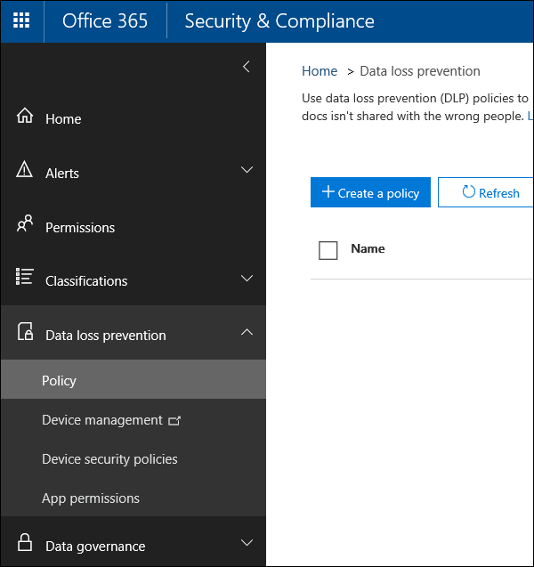

# Erstellen einer DLP-Richtlinie aus einer VorlageCreate a DLP policy from a template

Die einfachste und gängigste Methode zum Einstieg in DLP-Richtlinien (Data Loss Prevention, Verhinderung von Datenverlust) ist die Verwendung einer der in Office 365 enthaltenen Vorlagen.The easiest, most common way to get started with DLP policies is to use one of the templates included in Office 365. Sie können eine dieser Vorlagen wie folgt verwenden oder die Regeln anpassen, um die spezifischen Complianceanforderungen Ihrer Organisation zu erfüllen.You can use one of these templates as is, or customize the rules to meet your organization's specific compliance requirements.
  
Microsoft 365 umfasst mehr als 40 einsatzbereite Vorlagen, mit deren Hilfe Sie eine Vielzahl gängiger behördlicher und geschäftlicher Richtlinienanforderungen erfüllen können.Microsoft 365 includes over 40 ready-to-use templates that can help you meet a wide range of common regulatory and business policy needs. Es gibt z. B. DLP-Richtlinienvorlagen für:For example, there are DLP policy templates for:
  
- Gramm-Leach-Bliley Act (GLBA)Gramm-Leach-Bliley Act (GLBA)
    
- Payment Card Industry Data Security Standard (PCI-DSS)Payment Card Industry Data Security Standard (PCI-DSS)
    
- United States Personally Identifiable Information (U.S. PII)United States Personally Identifiable Information (U.S. PII)
    
- United States Health Insurance Act (HIPAA)United States Health Insurance Act (HIPAA)
    
Sie können eine Vorlage anpassen, indem Sie eine vorhandene Regel ändern oder neue hinzufügen. Beispielsweise können Sie neue Arten von vertraulichen Informationen zu einer Regel hinzufügen oder die Anzahl in einer Regel ändern, damit sie leichter oder schwerer ausgelöst wird. Sie können es auch Benutzern ermöglichen, die Aktionen in einer Regel anhand einer geschäftlichen Begründung außer Kraft zu setzen oder ändern, an wen Benachrichtigungen und Schadensberichte gesendet werden. Eine DLP-Richtlinienvorlage ist ein flexibler Ausgangspunkt für viele gängige Compliance-Szenarien.You can fine tune a template by modifying any of the existing rules or adding new ones. For example, you can add new types of sensitive information to a rule, modify the counts in a rule to make it harder or easier to trigger, allow people to override the actions in a rule by providing a business justification, or change who notifications and incident reports are sent to. A DLP policy template is a flexible starting point for many common compliance scenarios.
  
Sie können auch die benutzerdefinierte Vorlage auswählen, die über keine Standardregeln verfügt, und die DLP-Richtlinie von Grund auf neu konfigurieren, um die spezifischen Vorschriften für Ihre Organisation einzuhalten.You can also choose the Custom template, which has no default rules, and configure your DLP policy from scratch, to meet the specific compliance requirements for your organization.
  
## Beispiel: Identifizieren von vertraulichen Informationen auf OneDrive for Business Websites und Einschränken des Zugriffs für Personen außerhalb Ihrer OrganisationExample: Identify sensitive information across all OneDrive for Business sites and restrict access for people outside your organization

OneDrive for Business Konten machen es Personen in Ihrer Organisation einfach, zusammenzuarbeiten und Dokumente zu teilen.OneDrive for Business accounts make it easy for people across your organization to collaborate and share documents. Ein allgemeines Problem für Compliance officers ist jedoch, dass vertrauliche Informationen, die in OneDrive for Business gespeichert sind, versehentlich an Personen außerhalb Ihrer Organisation weitergegeben werden.But a common concern for compliance officers is that sensitive information stored in OneDrive for Business accounts may be inadvertently shared with people outside your organization. Eine DLP-Richtlinie kann dieses Risiko verringern.A DLP policy can help mitigate this risk.
  
In diesem Beispiel erstellen Sie eine DLP-Richtlinie, die US-PII-Daten identifiziert, die itIN (Individual Taxpayer Identification Numbers), Sozialversicherungsnummern und US-Reisepassnummern enthält.In this example, you'll create a DLP policy that identifies U.S. PII data, which includes Individual Taxpayer Identification Numbers (ITIN), Social Security Numbers, and U.S. passport numbers. Sie beginnen mit einer Vorlage und ändern dann die Vorlage, um die Complianceanforderungen Ihrer Organisation zu erfüllen– insbesondere:You'll get started by using a template, and then you'll modify the template to meet your organization's compliance requirements—specifically, you'll:
  
- Fügen Sie mehrere Typen vertraulicher Informationen hinzu , z. B. US-Bankkontonummern und Führerscheinnummern der USA, damit die DLP-Richtlinie noch mehr Ihrer vertraulichen Daten schützt.Add a couple of types of sensitive information—U.S. bank account numbers and U.S. driver's license numbers—so that the DLP policy protects even more of your sensitive data.
    
- Machen Sie die Richtlinie vertraulicher, sodass ein einzelnes Vorkommen vertraulicher Informationen ausreicht, um den Zugriff für externe Benutzer einzuschränken.Make the policy more sensitive, so that a single occurrence of sensitive information is enough to restrict access for external users.
    
- Sie ermöglichen Benutzern, die Aktionen anhand einer geschäftlichen Begründung oder der Meldung eines falsch positiven Ergebnisses außer Kraft zu setzen.Allow users to override the actions by providing a business justification or reporting a false positive. Auf diese Weise verhindert Ihre DLP-Richtlinie nicht, dass Personen in Ihrer Organisation ihre Arbeit erledigen, sofern sie einen gültigen geschäftlichen Grund für die Freigabe der vertraulichen Informationen haben.This way, your DLP policy won't prevent people in your organization from getting their work done, provided they have a valid business reason for sharing the sensitive information.
    
### Erstellen einer DLP-Richtlinie aus einer VorlageCreate a DLP policy from a template

1. Wechseln Sie zu [https://protection.office.com](https://protection.office.com).Go to [https://protection.office.com](https://protection.office.com).
    
2. Melden Sie sich mit Ihrem Geschäfts-, Schul- oder Unikonto an.Sign in using your work or school account. Sie sind jetzt im Security &amp; Compliance Center.You're now in the Security &amp; Compliance Center.
    
3. In the Security &amp; Compliance Center left navigation Data loss \> \> **prevention** \> **Policy** \> **+ Create a policy**.In the Security &amp; Compliance Center \> left navigation \> **Data loss prevention** \> **Policy** \> **+ Create a policy**.
    
    
  
4. Wählen Sie die DLP-Richtlinienvorlage aus, die die Typen vertraulicher Informationen schützt, die Sie als \> **Nächstes benötigen.**Choose the DLP policy template that protects the types of sensitive information that you need \> **Next**.
    
    In diesem Beispiel wählen  Sie Daten der personenbezogenen Daten \> **(Privacy U.S. Personally Identifiable Information, PII)** aus, da sie bereits die meisten Typen vertraulicher Informationen enthalten, die Sie schützen möchten– Sie fügen später ein paar hinzu.In this example, you'll select **Privacy** \> **U.S. Personally Identifiable Information ‎(PII)‎ Data** because it already includes most of the types of sensitive information that you want to protect—you'll add a couple later. 
    
    Wenn Sie eine Vorlage auswählen, können Sie die Beschreibung auf der rechten Seite lesen, um zu erfahren, welche Arten vertraulicher Informationen die Vorlage schützt.When you select a template, you can read the description on the right to learn what types of sensitive information the template protects.
    
    
  
5. Nennen Sie die \> **Richtlinie Weiter**.Name the policy \> **Next**.
    
6. Gehen Sie wie folgt vor, um die Speicherorte zu wählen, die die DLP-Richtlinie schützen soll:To choose the locations that you want the DLP policy to protect, do one of the following:
    
  - Wählen **Sie Alle Speicherorte in Office 365** Weiter \> **aus.**Choose **All locations in Office 365** \> **Next**.
    
  - Wählen **Sie Let me choose specific locations** Next \> **aus.**Choose **Let me choose specific locations** \> **Next**. Wählen Sie in diesem Beispiel diese Option aus.For this example, choose this.
    
    Um einen gesamten Speicherort wie alle E-Mail-Exchange oder alle OneDrive-Konten ein- oder auszuschließen, deaktivieren Sie den **Status** dieses Speicherorts.To include or exclude an entire location such as all Exchange email or all OneDrive accounts, switch the **Status** of that location on or off. 
    
    Um nur bestimmte SharePoint websites oder OneDrive for Business zu verwenden, wechseln Sie zu **Status,** und  klicken Sie dann unter Include auf die Links, um bestimmte Websites oder Konten zu wählen.To include only specific SharePoint sites or OneDrive for Business accounts, switch the **Status** to on, and then click the links under **Include** to choose specific sites or accounts. Wenn Sie eine Richtlinie auf eine Website anwenden, werden die in dieser Richtlinie konfigurierten Regeln automatisch auf alle Unterwebsites dieser Website angewendet.When you apply a policy to a site, the rules configured in that policy are automatically applied to all subsites of that site. 
    
    
  
    Deaktivieren Sie in diesem Beispiel den Status für Exchange-E-Mails und **SharePoint-Websites,** um vertrauliche Informationen zu schützen, die in allen **OneDrive for Business-Konten** gespeichert sind, und lassen Sie den **Status** für **OneDrive-Konten.** In this example, to protect sensitive information stored in all OneDrive for Business accounts, turn off the **Status** for both **Exchange email** and **SharePoint sites**, and leave the **Status** on for **OneDrive accounts**.
    
7. Wählen **Sie Erweiterte Einstellungen verwenden** Weiter \> **aus.**Choose **Use advanced settings** \> **Next**.
    
8. Eine DLP-Richtlinienvorlage enthält vordefinierte Regeln mit Bedingungen und Aktionen, die bestimmte Arten von vertraulichen Informationen erkennen und entsprechende Aktionen ausführen.A DLP policy template contains predefined rules with conditions and actions that detect and act upon specific types of sensitive information. Sie können vorhandene Regeln bearbeiten, löschen oder deaktivieren oder neue hinzufügen.You can edit, delete, or turn off any of the existing rules, or add new ones. Klicken Sie nach getaner Arbeit auf **Weiter**.When done, click **Next**.
    
    
  
    In diesem Beispiel enthält die VORLAGE FÜR PII-Daten in den USA zwei vordefinierte Regeln:In this example, the U.S. PII Data template includes two predefined rules:
    
  - **Geringes Inhaltsvolumen erkannte US-PII** Diese Regel sucht nach Dateien mit 1 bis 10 Vorkommen jeder der drei Arten vertraulicher Informationen (ITIN, SSN und US-Reisepassnummern), in denen die Dateien für Personen außerhalb der Organisation freigegeben werden.**Low volume of content detected U.S. PII** This rule looks for files containing between 1 and 10 occurrences of each of three types of sensitive information (ITIN, SSN, and U.S. passport numbers), where the files are shared with people outside the organization. Wenn gefunden, sendet die Regel eine E-Mail-Benachrichtigung an den primären Websitesammlungsadministrator, den Dokumentbesitzer und die Person, die das Dokument zuletzt geändert hat.If found, the rule sends an email notification to the primary site collection administrator, document owner, and person who last modified the document. 
    
  - **Hohe Menge von Inhalten, die in den USA piI erkannt wurden** Diese Regel sucht nach Dateien mit 10 oder mehr Vorkommen der drei gleichen typen vertraulichen Informationen, in denen die Dateien für Personen außerhalb der Organisation freigegeben werden.**High volume of content detected U.S. PII** This rule looks for files containing 10 or more occurrences of each of the same three sensitive information types, where the files are shared with people outside the organization. Wenn diese Aktion gefunden wird, sendet sie auch eine E-Mail-Benachrichtigung und schränkt den Zugriff auf die Datei ein.If found, this action also sends an email notification, plus it restricts access to the file. Für Inhalte in einem OneDrive for Business bedeutet dies, dass die Berechtigungen für das Dokument für alle Personen eingeschränkt sind, mit Ausnahme des primären Websitesammlungsadministrators, des Dokumentbesitzers und der Person, die das Dokument zuletzt geändert hat.For content in a OneDrive for Business account, this means that permissions for the document are restricted for everyone except the primary site collection administrator, document owner, and person who last modified the document. 
    
    Um die spezifischen Anforderungen Ihrer Organisation zu erfüllen, sollten Sie die Auslösung der Regeln vereinfachen, damit ein einzelnes Vorkommen vertraulicher Informationen ausreicht, um den Zugriff für externe Benutzer zu blockieren.To meet your organization's specific requirements, you may want to make the rules easier to trigger, so that a single occurrence of sensitive information is enough to block access for external users. Nachdem Sie sich diese Regeln anschaut, wissen Sie, dass Sie keine Regeln mit niedriger und hoher Anzahl benötigen– Sie benötigen nur eine einzelne Regel, die den Zugriff blockiert, wenn ein Vorkommen vertraulicher Informationen gefunden wird.After looking at these rules, you understand that you don't need low and high count rules—you need only a single rule that blocks access if any occurrence of sensitive information is found.
    
    Daher erweitern Sie die Regel namens **Low volume of content detected U.S. PII** Delete \> **rule**.So you expand the rule named **Low volume of content detected U.S. PII** \> **Delete rule**.
    
    
  
9. In diesem Beispiel müssen Sie nun zwei Typen vertraulicher Informationen hinzufügen (US-Bankkontonummern und Führerscheinnummern der USA), Personen das Außerkraft setzen und die Anzahl in ein beliebiges Vorkommen ändern.Now, in this example, you need to add two sensitive information types (U.S. bank account numbers and U.S. driver's license numbers), allow people to override a rule, and change the count to any occurrence. Sie können all dies tun, indem Sie eine Regel bearbeiten, wählen Sie also Hohe Menge von erkannten **Inhalten in** den USA PII \> **Edit-Regel aus.**You can do all of this by editing one rule, so select **High volume of content detected U.S. PII** \> **Edit rule**.
    
    
  
10. Um einen vertraulichen Informationstyp hinzuzufügen, fügen Sie im Abschnitt **Bedingungen** Typen hinzufügen \> **oder ändern hinzu.**To add a sensitive information type, in the **Conditions** section \> **Add or change types**. Wählen Sie dann unter **Add or change types** die Option Hinzufügen die Option \>  \> **Us.S. Bankkontonummer** und **U.S.** Führerscheinnummer \> **Hinzufügen Fertig** \> **aus.**Then, under **Add or change types** \> choose **Add** \> select **U.S. Bank Account Number** and **U.S. Driver's License Number** \> **Add** \> **Done**.
    
    
  
    
  
11. Um die Anzahl zu ändern (die Anzahl der Instanzen vertraulicher Informationen, die zum Auslösen der Regel erforderlich sind), wählen Sie unter **Instanzanzahl** den Min-Wert für jeden Typ \>  \> 1 aus.To change the count (the number of instances of sensitive information required to trigger the rule), under **Instance count** \> choose the **min** value for each type \> enter 1. Die Mindestanzahl darf nicht leer sein.The minimum count cannot be empty. Die maximale Anzahl kann leer sein. Ein leerer **maximaler** Wert wird in **eine beliebige konvertiert.**The maximum count can be empty; an empty **max** value convert to **any**.
    
    Wenn Sie fertig sind, sollte die Min.-Anzahl für alle Typen vertraulicher Informationen **1** sein, und die maximale Anzahl sollte alle **sein.**When finished, the min count for all of the sensitive information types should be **1** and the max count should be **any**. Anders ausgedrückt: Jedes Vorkommen dieser Art vertraulicher Informationen erfüllt diese Bedingung.In other words, any occurrence of this type of sensitive information will satisfy this condition.
    
    
  
12. Für die endgültige Anpassung möchten Sie nicht, dass Ihre DLP-Richtlinien Personen an ihrer Arbeit blockieren, wenn sie über eine gültige Geschäftliche Begründung verfügen oder eine falsch positive Einstellung haben. Sie möchten daher, dass die Benutzerbenachrichtigung Optionen enthält, um die Blockierende Aktion außer Kraft zu setzen.For the final customization, you don't want your DLP policies to block people from doing their work when they have a valid business justification or encounter a false positive, so you want the user notification to include options to override the blocking action.
    
    Im Abschnitt **Benutzerbenachrichtigungen** sehen Sie, dass E-Mail-Benachrichtigungen und Richtlinientipps für diese Regel in der Vorlage standardmäßig aktiviert sind.In the **User notifications** section, you can see that email notifications and policy tips are turned on by default for this rule in the template. 
    
    Im  Abschnitt Benutzerüberschreibungen sehen Sie, dass Außerkraftsetzungen für eine Geschäftliche Begründung aktiviert sind, Außerkraftsetzungen zum Melden falsch positiver Ergebnisse jedoch nicht.In the **User overrides** section, you can see that overrides for a business justification are turned on, but overrides to report false positives are not. Wählen Sie Die Regel automatisch außer Kraft **setzen aus, wenn sie als falsch positiv angezeigt wird.**Choose **Override the rule automatically if they report it as a false positive**.
    
    
  
13. Ändern Sie oben im Regel-Editor den Namen dieser Regel von dem standardmäßigen High Volume of **content detected U.S. PII** in **Any content detected with U.S. PII,** da sie jetzt durch alle Vorkommen der typen vertraulicher Informationen ausgelöst wird.At the top of the rule editor, change the name of this rule from the default **High volume of content detected U.S. PII** to **Any content detected with U.S. PII** because it's now triggered by any occurrence of its sensitive information types. 
    
14. Unten im Regel-Editor \> **Speichern**.At the bottom of the rule editor \> **Save**.
    
15. Überprüfen Sie die Bedingungen und Aktionen für diese Regel \> **Weiter**.Review the conditions and actions for this rule \> **Next**.
    
    Beachten Sie auf der rechten Seite die **Option Status** für die Regel.On the right, notice the **Status** switch for the rule. Wenn Sie eine gesamte Richtlinie deaktivieren, werden auch alle in der Richtlinie enthaltenen Regeln deaktiviert.If you turn off an entire policy, all rules contained in the policy are also turned off. Hier können Sie jedoch eine bestimmte Regel deaktivieren, ohne die gesamte Richtlinie zu deaktivieren.However, here you can turn off a specific rule without turning off the entire policy. Dies kann hilfreich sein, wenn Sie eine Regel untersuchen müssen, die eine große Anzahl falsch positiver Ergebnisse generiert.This can be useful when you need to investigate a rule that is generating a large number of false positives. 
    
16. Lesen Und verstehen Sie auf der nächsten Seite Folgendes, und wählen Sie dann aus, ob sie die Regel aktivieren oder zuerst \> **testen möchten Weiter**.On the next page, read and understand the following, and then choose whether to turn on the rule or test it out first \> **Next**.
    
     Bevor Sie DLP-Richtlinien erstellen, sollten Sie sie erst einmal nach und nach bereitstellen, um die Auswirkungen beurteilen und ihre Effektivität testen zu können, bevor Sie sie vollständig durchsetzen.Before you create your DLP policies, you should consider rolling them out gradually to assess their impact and test their effectiveness before you fully enforce them. Sie möchten beispielsweise nicht, dass eine neue DLP-Richtlinie versehentlich den Zugriff auf Tausende von Dokumenten blockiert, die Personen benötigen, um ihre Arbeit erledigen zu können.For example, you don't want a new DLP policy to unintentionally block access to thousands of documents that people require to get their work done. 
    
    Wenn Sie DLP-Richtlinien erstellen, die potenziell weitreichende Auswirkungen haben können, empfehlen wir, in der folgenden Reihenfolge vorzugehen:If you're creating DLP policies with a large potential impact, we recommend following this sequence:
    
17. Beginnen Sie im Testmodus ohne Richtlinientipps, und werten Sie die Auswirkungen dann anhand der DLP-Berichte aus. In den DLP-Berichten werden die Anzahl von Richtlinienübereinstimmungen, der Ort des Vorkommens, der Typ und der Schweregrad aufgeführt. Auf Grundlage der Ergebnisse können Sie die Regeln nach Bedarf genauer anpassen. Im Testmodus haben DLP-Richtlinien keinen Einfluss auf die Produktivität der Mitarbeiter in Ihrer Organisation.Start in test mode without Policy Tips and then use the DLP reports to assess the impact. You can use DLP reports to view the number, location, type, and severity of policy matches. Based on the results, you can fine tune the rules as needed. In test mode, DLP policies will not impact the productivity of people working in your organization. 
    
18. Fahren Sie im Testmodus mit Benachrichtigungen und Richtlinientipps fort, sodass Sie die Benutzer über die Einhaltungsrichtlinien in Kenntnis setzen und auf die Anwendung der Regeln vorbereiten können. In dieser Phase können Sie die Benutzer auch bitte, Sie über falsche Positivmeldungen zu benachrichtigen, damit Sie die Regeln noch besser abstimmen können.Move to Test mode with notifications and Policy Tips so that you can begin to teach users about your compliance policies and prepare them for the rules that are going to be applied. At this stage, you can also ask users to report false positives so that you can further refine the rules.
    
19. Aktivieren Sie die Richtlinien, damit die Regeln erzwungen und der Inhalt geschützt wird.Turn on the policies so that the rules are enforced and the content's protected. Überwachen Sie weiterhin die DLP-Berichte und alle Schadensberichte oder Benachrichtigungen, um sicherzustellen, dass die von Ihnen gewünschten Ergebnisse erzielt werden.Continue to monitor the DLP reports and any incident reports or notifications to make sure that the results are what you intend. 
    
    
  
20. Überprüfen Sie Ihre Einstellungen für diese Richtlinie, wählen \> Sie **Erstellen aus.**Review your settings for this policy \> choose **Create**.
    
Nachdem Sie eine DLP-Richtlinie erstellt und aktiviert haben, wird sie für alle Inhaltsquellen bereitgestellt, die sie enthält, z. B. SharePoint Onlinewebsites oder OneDrive for Business-Konten, in denen die Richtlinie beginnt, ihre Regeln für diesen Inhalt automatisch zu erzwingen.After you create and turn on a DLP policy, it's deployed to any content sources that it includes, such as SharePoint Online sites or OneDrive for Business accounts, where the policy begins automatically enforcing its rules on that content.
  
## Anzeigen des Status einer DLP-RichtlinieView the status of a DLP policy

Sie können jederzeit den Status Ihrer DLP-Richtlinien auf der  Seite **Richtlinie** im Abschnitt Verhinderung von Datenverlust im Security &amp; Compliance Center anzeigen.At any time, you can view the status of your DLP policies on the **Policy** page in the **Data loss prevention** section of the Security &amp; Compliance Center. Hier finden Sie wichtige Informationen, z. B. ob eine Richtlinie erfolgreich aktiviert oder deaktiviert wurde oder ob sich die Richtlinie im Testmodus befindet.Here you can find important information, such as whether a policy was successfully enabled or disabled, or whether the policy is in test mode. 
  
Nachfolgend werden die verschiedenen Statuswerte und deren Bedeutung beschrieben.Here are the different statuses and what they mean.
  
|**Status****Status**|**Erläuterung****Explanation**|
|:-----|:-----|
|**Aktivieren von...****Turning on…**   |Die Richtlinie wird gerade für die Inhaltsquellen, die sie umfasst, bereitgestellt. Die Richtlinie wird noch nicht bei allen Quellen erzwungen.The policy is being deployed to the content sources that it includes. The policy is not yet enforced on all sources.    |
|**Testen, mit Benachrichtigungen****Testing, with notifications**   |Die Richtlinie ist im Testmodus. Die Aktionen in einer Regel werden nicht angewendet, aber Richtlinienübereinstimmungen werden mithilfe der DLP-Berichte zusammengestellt und angezeigt. Benachrichtigungen über Richtlinienübereinstimmungen werden an die angegebenen Empfänger gesendet.The policy is in test mode. The actions in a rule are not applied, but policy matches are collected and can be viewed by using the DLP reports. Notifications about policy matches are sent to the specified recipients.    |
|**Testen, ohne Benachrichtigungen****Testing, without notifications**   |Die Richtlinie ist im Testmodus. Die Aktionen in einer Regel werden nicht angewendet, aber Richtlinienübereinstimmungen werden mithilfe der DLP-Berichte zusammengestellt und angezeigt. Benachrichtigungen über Richtlinienübereinstimmungen werden nicht an die angegebenen Empfänger gesendet.The policy is in test mode. The actions in a rule are not applied, but policy matches are collected and can be viewed by using the DLP reports. Notifications about policy matches are not sent to the specified recipients.    |
|**On****On**   |Die Richtlinie ist aktiv und wird erzwungen. Die Richtlinie wurde erfolgreich für alle zugehörigen Inhaltsquellen bereitgestellt.The policy is active and enforced. The policy was successfully deployed to all its content sources.    |
|**Wird deaktiviert...****Turning off…**   |Die Richtlinie wird gerade aus den Inhaltsquellen, die sie umfasst, entfernt. Die Richtlinie kann noch bei einigen Quellen aktiv sein und erzwungen werden. Das Deaktivieren einer Richtlinie kann bis zu 45 Minuten dauern.The policy is being removed from the content sources that it includes. The policy may still be active and enforced on some sources. Turning off a policy may take up to 45 minutes.    |
|**Off****Off**   |Die Richtlinie ist nicht aktiv und wird nicht erzwungen. Die Einstellungen für die Richtlinie (Quellen, Schlüsselwörter, Dauer usw.) werden gespeichert.The policy is not active and not enforced. The settings for the policy (sources, keywords, duration, etc) are saved.    |
|**Löschen...****Deleting…**   |Die Richtlinie wird gerade gelöscht.The policy is in the process of being deleted. Die Richtlinie ist nicht aktiv und wird nicht erzwungen.The policy is not active and not enforced. Das Delet einer Richtlinie dauert normalerweise eine Stunde.It normally takes an hour for a policy to delet   |
   
## Deaktivieren einer DLP-RichtlinieTurn off a DLP policy

Sie können eine DLP-Richtlinie jederzeit bearbeiten oder deaktivieren.You can edit or turn off a DLP policy at any time. Wenn Sie eine Richtlinie deaktivieren, werden alle Regeln in der Richtlinie deaktiviert.Turning off a policy disables all of the rules in the policy.
  
Um eine DLP-Richtlinie zu bearbeiten oder zu deaktivieren, wählen Sie auf der Seite **Richtlinie** \> die Richtlinie Bearbeiten richtlinie \> **aus.**To edit or turn off a DLP policy, on the **Policy** page \> select the policy \> **Edit policy**.
  

  
Darüber hinaus können Sie jede Regel einzeln deaktivieren, indem Sie die Richtlinie bearbeiten und dann wie oben beschrieben den **Status** dieser Regel deaktivieren.In addition, you can turn off each rule individually by editing the policy and then toggling off the **Status** of that rule, as described above. 
  
## Weitere InformationenMore information

- [Informationen zur Verhinderung von DatenverlustLearn about data loss prevention](dlp-learn-about-dlp.md)
- [Senden von Benachrichtigungen und Anzeigen von Richtlinientipps für DLP-RichtlinienSend notifications and show policy tips for DLP policies](use-notifications-and-policy-tips.md)
- [Erstellen einer DLP-Richtlinie zum Schützen von Dokumenten mit FCI- oder anderen EigenschaftenCreate a DLP policy to protect documents with FCI or other properties](protect-documents-that-have-fci-or-other-properties.md)
- [Bestandteile von DLP-RichtlinienvorlagenWhat the DLP policy templates include](what-the-dlp-policy-templates-include.md)
- [Entitätsdefinitionen für Typen vertraulicher InformationenSensitive information type entity definitions](sensitive-information-type-entity-definitions.md)
