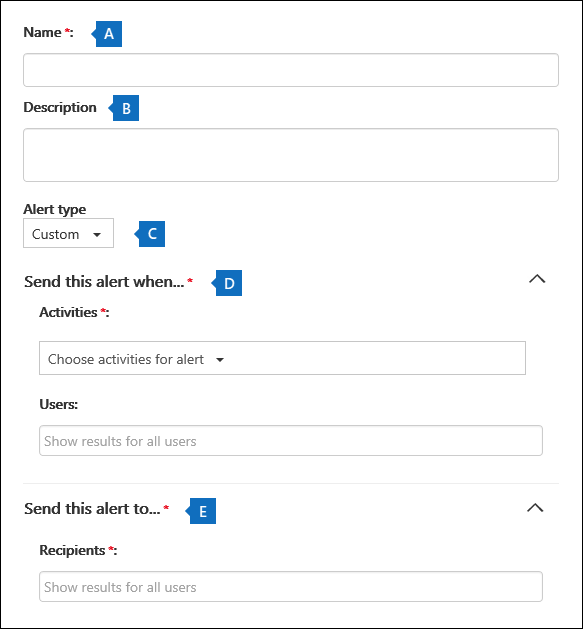

# Erstellen von AktivitätswarnungenCreate activity alerts

Sie können eine Aktivitätswarnung erstellen, die Ihnen eine E-Mail-Benachrichtigung sendet, wenn Benutzer bestimmte Aktivitäten in Office 365 ausführen.You can create an activity alert that will send you an email notification when users perform specific activities in Office 365. Aktivitätswarnungen ähneln der Suche nach Ereignissen im Überwachungsprotokoll, mit der Ausnahme, dass Sie eine E-Mail-Nachricht erhalten, wenn ein Ereignis für eine Aktivität auftritt, für die Sie eine Warnung erstellt haben.Activity alerts are similar to searching for events in the audit log, except that you'll be sent an email message when an event for an activity that you've created an alert for happens.

 **Warum Aktivitätswarnungen verwenden, anstatt das Überwachungsprotokoll zu durchsuchen?****Why use activity alerts instead of searching the audit log?** Möglicherweise gibt es bestimmte Arten von Aktivitäten, die von bestimmten Benutzern ausgeführt werden, die Sie wirklich kennen möchten.There might be certain kinds of activity or activity performed by specific users that you really want to know about. Anstatt sich daran erinnern zu müssen, das Überwachungsprotokoll nach diesen Aktivitäten zu durchsuchen, können Sie Aktivitätswarnungen verwenden, um Ihnen Microsoft 365 eine E-Mail-Nachricht zu senden, wenn Benutzer diese Aktivitäten ausführen.Instead of having to remember to search the audit log for those activities, you can use activity alerts to have Microsoft 365 send you an email message when users perform those activities. Sie können z. B. eine Aktivitätswarnung erstellen, um Sie zu benachrichtigen, wenn ein Benutzer Dateien in SharePoint löscht, oder Sie können eine Warnung erstellen, um Sie zu benachrichtigen, wenn ein Benutzer Nachrichten dauerhaft aus dem Postfach löscht.For example, you can create an activity alert to notify you when a user deletes files in SharePoint or you can create an alert to notify you when a user permanently deletes messages from their mailbox. Die an Sie gesendete E-Mail-Benachrichtigung enthält Informationen dazu, welche Aktivität ausgeführt wurde und welcher Benutzer sie ausgeführt hat.The email notification sent to you includes information about which activity was performed and the user who performed it.

> [!NOTE]
> Aktivitätswarnungen sind veraltet.Activity alerts are being deprecated. Es wird empfohlen, mit der Verwendung von Warnungsrichtlinien im Security and Compliance Center zu beginnen, anstatt neue Aktivitätswarnungen zu erstellen.We recommend that you start using alert policies in the security and compliance center instead of creating new activity alerts. Alert policies provide addition functionality such as the ability to create an alert policy that triggers an alert when any user performs a specified activity, and displaying alerts on the **View alerts** page in the security and compliance center.Alert policies provide addition functionality such as the ability to create an alert policy that triggers an alert when any user performs a specified activity, and displaying alerts on the **View alerts** page in the security and compliance center. Weitere Informationen finden Sie unter [Warnungsrichtlinien.](alert-policies.md)For more information, see [Alert policies](alert-policies.md).

## Bestätigen von Rollen und Konfigurieren der ÜberwachungsprotokollierungConfirm roles and configure audit logging

- Ihnen muss die Rolle "Organisationskonfiguration" im Security & Compliance Center zugewiesen sein, um Aktivitätswarnungen zu verwalten.You must be assigned the Organization Configuration role in the Security & Compliance Center to manage activity alerts. Standardmäßig wird diese Rolle den Rollengruppen "Complianceadministrator" und "Organisationsverwaltung" zugewiesen.By default, this role is assigned to the Compliance Administrator and Organization Management role groups. Weitere Informationen zum Hinzufügen von Mitgliedern zu Rollengruppen finden Sie unter ["Benutzern Zugriff auf das Security & Compliance Center gewähren".](../security/office-365-security/grant-access-to-the-security-and-compliance-center.md)For more information about adding members to role groups, see [Give users access to the Security & Compliance Center](../security/office-365-security/grant-access-to-the-security-and-compliance-center.md).

- Sie (oder ein anderer Administrator) müssen zuerst die Überwachungsprotokollierung für Ihre Organisation aktivieren, bevor Sie mit der Verwendung von Aktivitätswarnungen beginnen können.You (or another admin) must first turn on audit logging for your organization before you can start using activity alerts. Klicken Sie dazu einfach auf der Seite **"Aktivitätswarnungen"** auf "Aufzeichnung von **Benutzer- und Administratoraktivitäten starten".**To do this, just click **Start recording user and admin activity** on the **Activity alerts** page. (Wenn dieser Link nicht angezeigt wird, wurde die Überwachung bereits für Ihre Organisation aktiviert.) Sie können die Überwachung auch auf der **Seite "Überwachungsprotokollsuche"** im Security & Compliance Center aktivieren (wechseln Sie zur **Suche** nach \> **Überwachungsprotokollen).**(If you don't see this link, auditing has already been turned on for your organization.) You can also turn on auditing on the **Audit log search** page in the Security & Compliance Center (go to **Search** \> **Audit log search**). Sie müssen dies nur einmal für Ihre Organisation tun.You only have to do this once for your organization.

- Sie können Warnungen für dieselben Aktivitäten erstellen, nach denen Sie im Überwachungsprotokoll suchen können.You can create alerts for the same activities that you can search for in the audit log. Im Abschnitt ["Weitere Informationen"](#more-information) finden Sie eine Liste allgemeiner Szenarien (und der zu überwachenden spezifischen Aktivität), für die Sie Warnungen erstellen können.See the [More information](#more-information) section for a list of common scenarios (and the specific activity to monitor) that you can create alerts for.

- Sie können die Seite **"Aktivitätswarnungen"** im Security & Compliance Center verwenden, um Warnungen nur für Aktivitäten zu erstellen, die von Benutzern ausgeführt werden, die im Adressbuch Ihrer Organisation aufgeführt sind.You can use the **Activity alerts** page in the Security & Compliance Center to create alerts only for activity performed by users who are listed in your organization's address book. Sie können diese Seite nicht verwenden, um Warnungen für Aktivitäten zu erstellen, die von externen Benutzern ausgeführt werden, die nicht im Adressbuch aufgeführt sind.You can't use this page to create alerts for activity performed by external users who aren't listed in the address book.

## Erstellen einer AktivitätswarnungCreate an activity alert

1. Wechseln Sie zu [https://protection.office.com/managealerts](https://protection.office.com/managealerts).Go to [https://protection.office.com/managealerts](https://protection.office.com/managealerts).

2. Melden Sie sich mit Ihrem Geschäfts-, Schul- oder Unikonto an.Sign in using your work or school account.

3. Klicken Sie auf der Seite **"Aktivitätswarnungen"** auf  **"Neu** hinzufügen".On the **Activity alerts** page, click  **New**.

   Die Flyoutseite zum Erstellen einer Aktivitätswarnung wird angezeigt.The flyout page to create an activity alert is displayed.

    

4. Füllen Sie die folgenden Felder aus, um eine Aktivitätswarnung zu erstellen:Complete the following fields to create an activity alert:

    a.a. **Name** – Geben Sie einen Namen für die Warnung ein.**Name** - Type a name for the alert. Warnungsnamen müssen innerhalb Ihrer Organisation eindeutig sein.Alert names must be unique within your organization.

    b.b. **Beschreibung** (optional) – Beschreiben Sie die Warnung, z. B. die Aktivitäten und Benutzer, die nachverfolgt werden, und die Benutzer, an die E-Mail-Benachrichtigungen gesendet werden.**Description** (Optional) - Describe the alert, such as the activities and users being tracked, and the users that email notifications are sent to. Beschreibungen bieten eine schnelle und einfache Möglichkeit, den Zweck der Warnung für andere Administratoren zu beschreiben.Descriptions provide a quick and easy way to describe the purpose of the alert to other admins.

    c.c. **Warnungstyp** : Stellen Sie sicher, dass die Option **"Benutzerdefiniert"** ausgewählt ist.**Alert type** - Make sure the **Custom** option is selected.

    d.d. **Senden Sie diese Warnung, wenn** – klicken Sie **auf "Warnung senden", wenn** sie angezeigt wird, und konfigurieren Sie dann diese beiden Felder:**Send this alert when** - Click **Send this alert when** and then configure these two fields:

    - **Aktivitäten** – Klicken Sie auf die Dropdownliste, um die Aktivitäten anzuzeigen, für die Sie eine Warnung erstellen können.**Activities** - Click the drop-down list to display the activities that you can create an alert for. Dies ist die gleiche Aktivitätsliste, die beim Durchsuchen des Überwachungsprotokolls angezeigt wird.This is the same activities list that's displayed when you search the audit log. Sie können eine oder mehrere bestimmte Aktivitäten auswählen oder auf den Namen der Aktivitätsgruppe klicken, um alle Aktivitäten in der Gruppe auszuwählen.You can select one or more specific activities or you can click the activity group name to select all activities in the group. Eine Beschreibung dieser Aktivitäten finden Sie im Abschnitt "Überwachte Aktivitäten" unter ["Durchsuchen des Überwachungsprotokolls".](search-the-audit-log-in-security-and-compliance.md#audited-activities)For a description of these activities, see the "Audited activities" section in [Search the audit log](search-the-audit-log-in-security-and-compliance.md#audited-activities). Wenn ein Benutzer eine der Aktivitäten ausführt, die Sie der Warnung hinzugefügt haben, wird eine E-Mail-Benachrichtigung gesendet.When a user performs any of the activities that you've added to the alert, an email notification is sent.

     - **Benutzer** – Klicken Sie auf dieses Kontrollkästchen, und wählen Sie dann einen oder mehrere Benutzer aus.**Users** - Click this box and then select one or more users. Wenn die Benutzer in diesem Feld die Aktivitäten ausführen, die Sie dem Feld **"Aktivitäten"** hinzugefügt haben, wird eine Warnung gesendet.If the users in this box perform the activities that you added to the **Activities** box, an alert will be sent. Lassen Sie das Feld **"Benutzer"** leer, um eine Warnung zu senden, wenn ein Benutzer in Ihrer Organisation die in der Warnung angegebenen Aktivitäten ausführt.Leave the **Users** box blank to send an alert when any user in your organization performs the activities specified by the alert.

    e.e. **Senden Sie diese Warnung an** – Klicken Sie auf Diese Warnung **senden,** und klicken Sie dann in das Feld **"Empfänger",** und geben Sie einen Namen ein, um einen Benutzer hinzuzufügen, der eine E-Mail-Benachrichtigung erhält, wenn ein Benutzer (im Feld **"Benutzer"** angegeben) eine Aktivität ausführt (im Feld **"Aktivitäten"** angegeben).**Send this alert to** - Click **Send this alert**, and then click in the **Recipients** box and type a name to add a users who will receive an email notification when a user (specified in the **Users** box) performs an activity (specified in the **Activities** box). Beachten Sie, dass Sie der Liste der Empfänger standardmäßig hinzugefügt werden.Note that you are added to the list of recipients by default. Sie können Ihren Namen aus dieser Liste entfernen.You can remove your name from this list.

5. Klicken Sie auf **"Speichern",** um die Warnung zu erstellen.Click **Save** to create the alert.

    Die neue Warnung wird in der Liste auf der Seite **"Aktivitätswarnungen"** angezeigt.The new alert is displayed in the list on the **Activity alerts** page.

    

    Der Status der Warnung ist auf **"Ein"** festgelegt.The status of the alert is set to **On**. Beachten Sie, dass die Empfänger, die beim Senden einer Warnung eine E-Mail-Benachrichtigung erhalten haben, ebenfalls aufgeführt sind.Note that the recipients who will received an email notification when an alert is sent are also listed.

## Deaktivieren einer AktivitätswarnungTurn off an activity alert

Sie können eine Aktivitätswarnung deaktivieren, damit keine E-Mail-Benachrichtigung gesendet wird.You can turn off an activity alert so that an email notification isn't sent. Nachdem Sie die Aktivitätswarnung deaktiviert haben, wird sie weiterhin in der Liste der Aktivitätswarnungen für Ihre Organisation angezeigt, und Sie können ihre Eigenschaften weiterhin anzeigen.After you turn off the activity alert, it's still displayed in the list of activity alerts for your organization, and you can still view its properties.

1. Wechseln Sie zu Gehe [https://protection.office.com/managealerts](https://protection.office.com/managealerts) zu .Go to Go to [https://protection.office.com/managealerts](https://protection.office.com/managealerts).

2. Melden Sie sich mit Ihrem Geschäfts-, Schul- oder Unikonto an.Sign in using your work or school account.

3. Klicken Sie in der Liste der Aktivitätswarnungen für Ihre Organisation auf die Warnung, die Sie deaktivieren möchten.In the list of activity alerts for your organization, click the alert that you want to turn off.

4. Klicken Sie auf der **Seite "Warnung bearbeiten"** auf die Umschaltfläche **"Ein",** um den Status in **"Aus"** zu ändern, und klicken Sie dann auf **"Speichern".**On the **Edit alert** page, click the **On** toggle switch to change the status to **Off**, and then click **Save**.

    Der Status der Warnung auf den Seiten **"Aktivitätswarnungen"** ist auf **"Aus"** festgelegt.The status of the alert on the **Activity alerts** pages is set to **Off**.

Um eine Aktivitätswarnung wieder einzuschalten, wiederholen Sie einfach diese Schritte, und klicken Sie auf den Schalter **"Aus",** um den Status in **"Ein"** zu ändern.To turn an activity alert back on, just repeat these steps and click the **Off** toggle switch to change the status to **On**.

## Weitere InformationenMore information

- Hier ist ein Beispiel für die E-Mail-Benachrichtigung, die an die Benutzer gesendet wird, die im Feld "Diese Warnung an senden" angegeben sind (und unter **"Empfänger"** auf der Seite **"Aktivitätswarnungen"** aufgeführt) im Security & Compliance Center aufgeführt sind.Here's an example of the email notification that is sent to the users that are specified in the Sent this alert to field (and listed under **Recipients** on the **Activity alerts** page) in the Security & Compliance Center.

    

- Nachfolgend finden Sie einige allgemeine Dokument- und E-Mail-Aktivitäten, für die Sie Aktivitätswarnungen erstellen können.Here's are some common document and email activities that you can create an activity alerts for. Die Tabellen beschreiben die Aktivität, den Namen der Aktivität, für die eine Warnung erstellt werden soll, und den Namen der Aktivitätsgruppe, unter der die Aktivität in der Dropdownliste **Aktivitäten** aufgeführt ist.The tables describes the activity, the name of the activity to create an alert for, and the name of the activity group that the activity is listed under in the **Activities** drop-down list. Eine vollständige Liste der Aktivitäten, für die Sie Aktivitätswarnungen erstellen können, finden Sie im Abschnitt "Überwachte Aktivitäten" unter ["Durchsuchen des Überwachungsprotokolls".](search-the-audit-log-in-security-and-compliance.md#audited-activities)To see a complete list of the activities that you can create activity alerts for, see the "Audited activities" section in [Search the audit log](search-the-audit-log-in-security-and-compliance.md#audited-activities).

    > [!TIP]
    > Möglicherweise möchten Sie eine Aktivitätswarnung für nur eine Aktivität erstellen, die von einem beliebigen Benutzer ausgeführt wird.You might want to create an activity alert for just one activity that's performed by any user. Sie können auch eine Aktivitätswarnung erstellen, die mehrere Aktivitäten nachverfolgt, die von einem oder mehreren Benutzern ausgeführt werden.Or you might want to create an activity alert that track multiple activities performed by one or mores users.

    In der folgenden Tabelle sind einige allgemeine dokumentbezogene Aktivitäten in SharePoint oder OneDrive for Business aufgeführt.The following table lists some common document-related activities in SharePoint or OneDrive for Business.

    |**Wenn ein Benutzer dies tut...****When a user does this...**|**Erstellen einer Warnung für diese Aktivität****Create an alert for this activity**|**Aktivitätsgruppe****Activity group**|
    |:-----|:-----|:-----|
    |Zeigt ein Dokument auf einer Website an.Views a document on a site.    |DateizugriffAccessed file    |Datei- und OrdneraktivitätenFile and folder activities    |
    |Bearbeitet oder ändert ein Dokument.Edits or changes a document.    |Datei geändertModified file    |Datei- und OrdneraktivitätenFile and folder activities    |
    |Gibt ein Dokument für einen Benutzer außerhalb Ihrer Organisation frei.Shares a document with a user outside of your organization.    |Freigeben von Dateien, Ordnern oder WebsitesShare file, folder, or site    UndAnd    Freigabeeinladung erstelltCreated sharing invitation    Weitere Informationen finden Sie unter [Verwenden der Freigabeüberwachung im Überwachungsprotokoll](use-sharing-auditing.md).For more information, see [Use sharing auditing in the audit log](use-sharing-auditing.md).    |Freigabe- und Zugriffsanforderungsaktivitäten Sharing and access request activities    |
    |Lädt ein Dokument hoch oder lädt es herunter.Uploads or downloads a document.    |Datei hochgeladenUploaded file    Und/oderAnd/or    Datei heruntergeladenDownloaded file    |Datei- und OrdneraktivitätenFile and folder activities    |
    |Ändert die Zugriffsberechtigungen für eine Website.Changes the access permissions to a site.    |Websiteberechtigungen geändertModified site permissions    |WebsiteverwaltungsaktivitätenSite administration activities    |

    In der folgenden Tabelle sind einige allgemeine E-Mail-bezogene Aktivitäten in Exchange Online aufgeführt.The following table lists some common email-related activities in Exchange Online.

    |**Wenn ein Benutzer dies tut...****When a user does this...**|**Erstellen einer Warnung für diese Aktivität****Create an alert for this activity**|**Aktivitätsgruppe****Activity group**|
    |:-----|:-----|:-----|
    |Löscht (löscht) eine E-Mail-Nachricht dauerhaft aus ihrem Postfach.Permanently deletes (purges) an email message from their mailbox.    |Nachrichten aus Postfach gelöschtPurged messages from mailbox    | Exchange-PostfachaktivitätenExchange mailbox activities    |
    |Sendet eine E-Mail-Nachricht von einem freigegebenen Postfach.Sends an email message from a shared mailbox.    |Nachricht mit Berechtigungen vom Typ "Senden als" gesendetSent message using Send As permissions    UndAnd    Nachricht mit Berechtigungen vom Typ "Senden im Auftrag von" gesendetSent message using Send On Behalf permissions    | Exchange-PostfachaktivitätenExchange mailbox activities    |

- Sie können auch die Cmdlets **"New-ActivityAlert"** und **"Set-ActivityAlert"** in Security & Compliance Center PowerShell verwenden, um Aktivitätswarnungen zu erstellen und zu bearbeiten.You can also use the **New-ActivityAlert** and **Set-ActivityAlert** cmdlets in Security & Compliance Center PowerShell to create and edit activity alerts. Beachten Sie folgende Punkte, wenn Sie diese Cmdlets zum Erstellen oder Bearbeiten von Aktivitätswarnungen verwenden:Keep the following things in mind if you use these cmdlets to create or edit activity alerts:

  - Wenn Sie ein Cmdlet verwenden, um der Warnung eine Aktivität hinzuzufügen, die nicht in der Dropdownliste **"Aktivitäten"** aufgeführt ist, wird auf der Eigenschaftenseite für die Warnung eine Meldung angezeigt, die besagt: "Diese Warnung enthält benutzerdefinierte Vorgänge, die nicht in der Auswahl aufgeführt sind."If you use a cmdlet to add an activity to the alert that isn't listed in the **Activities** drop-down list, a message is displayed in on the property page for the alert that says, "This alert has custom operations not listed in the picker."

  - Ein guter Grund für die Verwendung der Cmdlets zum Erstellen oder Bearbeiten einer Aktivitätswarnung ist das Senden von E-Mail-Benachrichtigungen an eine Person außerhalb Ihrer Organisation.A good reason to use the cmdlets to create or edit an activity alert is to send email notifications to someone outside of your organization. Dieser externe Benutzer wird in der Liste der Empfänger für die Warnung aufgeführt.This external user will be listed in the list of recipients for the alert. Wenn Sie diesen externen Benutzer jedoch aus der Warnung entfernen, kann dieser Benutzer nicht mithilfe der **Seite "Warnung bearbeiten"** erneut zur Warnung hinzugefügt werden.But if you remove this external user from the alert, that user can't be re-added to the alert by using the **Edit alert** page. Sie müssen den externen Benutzer mithilfe des Cmdlets **"Set-ActivityAlert"** erneut hinzufügen oder das Cmdlet **"New-ActivityAlert"** verwenden, um einer neuen Warnung denselben (oder einen anderen) externen Benutzer hinzuzufügen.You'll have to re-add the external user using the **Set-ActivityAlert** cmdlet, or use the **New-ActivityAlert** cmdlet to add the same (or different) external user to a new alert.
