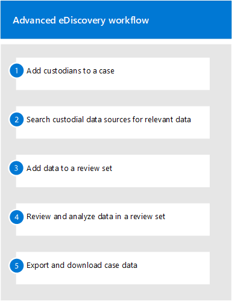

# Erstellen und Verwalten eines Advanced eDiscovery-Falls

Nach dem Einrichten von Advanced eDiscovery und dem Zuweisen von Berechtigungen zu [eDiscovery-Managern](get-started-with-advanced-ediscovery.md#step-2-assign-ediscovery-permissions) in Ihrer Organisation, die Fälle verwalten, besteht der nächste Schritt im Erstellen und Verwalten eines Falls.

Dieser Artikel bietet außerdem einen umfassenden Überblick über die Verwendung von Fällen zum Verwalten des Advanced eDiscovery-Workflows für eine rechtliche Untersuchung.

## Erstellen eines Falls

Führen Sie die folgenden Schritte aus, um einen Fall zu erstellen und Mitglieder hinzuzufügen. Der Benutzer, der den Fall erstellt, wird automatisch als Mitglied hinzugefügt.

1. Wechseln Sie zu, und melden Sie sich mit den Anmeldeinformationen für ein Benutzerkonto [https://compliance.microsoft.com](https://compliance.microsoft.com) an, dem eDiscovery-Berechtigungen zugewiesen wurden. Mitglieder der Rollengruppe Organisationsverwaltung können auch Erweiterte eDiscovery-Fälle erstellen.

2. Klicken Sie im linken Navigationsbereich des Microsoft 365 Compliance Centers auf **Ale anzeigen**, und klicken Sie dann auf **eDiscovery > Advanced**.

3. Klicken Sie auf der **Seite Erweiterte eDiscovery** auf **die** Registerkarte Fälle, und klicken Sie dann auf **Fall erstellen.**

4. Geben Sie auf der Flyoutseite Neuer **eDiscovery-Fall** dem Fall einen Namen (erforderlich) zu, und geben Sie dann eine optionale Fallnummer und Beschreibung ein. Der Fallname muss in Ihrer Organisation eindeutig sein.

5. Klicken **Sie auf Speichern,** um den Fall zu erstellen.

   Der neue Fall wird erstellt, **und** die Registerkarte Einstellungen im neuen Fall wird angezeigt.

6. Klicken Sie **auf &** Registerkarte Einstellungen  auf **Auswählen,** und klicken Sie dann auf **Aktualisieren**.

7. Klicken Sie auf **Aktualisieren**.

8. Klicken Sie **auf der Seite** Flyout für diesen Fall verwalten unter Mitglieder **verwalten** auf **Hinzufügen,** um dem Fall Mitglieder hinzuzufügen.

9. Aktivieren Sie in der Liste der Personen das Kontrollkästchen neben den Namen der Personen, die Sie dem Fall hinzufügen möchten. Stellen Sie wie bereits erläutert sicher, dass den Personen, die Sie dem Fall hinzufügen, die entsprechenden eDiscovery-Berechtigungen zugewiesen wurden.

10. Nachdem Sie die Personen ausgewählt haben, die als Mitglieder des Falls hinzugefügt werden, klicken Sie auf **Hinzufügen**.

11. Klicken Sie auf der Flyout-Seite **Fall verwalten** auf **Speichern**, um die neue Liste der Fallbeteiligten zu speichern.

12. Klicken Sie auf **die Registerkarte Start,** um zur Fall-Homepage zu wechseln.

## Verwalten des Workflows

Damit Sie mit Advanced eDiscovery beginnen können, finden Sie hier einen grundlegenden Workflow, der auf gängige [eDiscovery-Methoden ausgerichtet ist.](advanced-ediscovery-edrm.md) In jedem dieser Schritte werden auch einige erweiterte Erweiterte eDiscovery-Funktionen hervorgehoben, die Sie erkunden können.

1. **[Fügen Sie dem Fall](add-custodians-to-case.md) Custodians und [nicht verwahrte](non-custodial-data-sources.md) Datenquellen hinzu.** Der erste Schritt nach dem Erstellen eines Falls besteht im Hinzufügen von Verwahrern. Ein *Verwahrer* ist eine Person mit administrativer Kontrolle über ein Dokument oder eine elektronische Datei, die für den Fall relevant sein kann. Darüber hinaus können Sie Datenquellen hinzufügen, die keinem bestimmten Benutzer zugeordnet sind, aber möglicherweise für den Fall relevant sind.

   Hier sind einige Dinge, die passieren (oder die Sie tun können), wenn Sie einem Fall Custodians hinzufügen:

   - Daten im #A0 des Verwahrers, im #A1 und in allen Microsoft Teams- oder Yammer-Gruppen, in der der Custodian Mitglied ist, können in dem Fall als Verwahrerdaten "markiert" werden.
  
   - Verwahrerdaten werden neu indiziert (durch einen Prozess namens *Erweiterte Indizierung*). Dies trägt dazu bei, die Suche im nächsten Schritt zu optimieren.
  
   - Sie können Personenbezogene Daten in einem Halterecht speichern. Dadurch werden Daten beibehalten, die für den Fall während der Untersuchung relevant sein können.
  
   - Sie können einem Verwahrer andere Datenquellen zuordnen (z. B. können Sie eine #A0 oder eine Microsoft 365-Gruppe einem Verwahrer zuordnen), damit diese Daten wie die Daten im Postfach oder im #A1 des Verwahrers neu indiziert, in den Haltepunkt gesetzt und durchsucht werden können.

   - Sie können den [Kommunikationsworkflow](managing-custodian-communications.md) in Advanced eDiscovery verwenden, um eine Benachrichtigung über das gesetzliche Halterecht an Custodians zu senden.

2. **[Durchsuchen sie Datenquellen nach daten, die für den Fall relevant sind.](collecting-data-for-ediscovery.md)** Nachdem Sie einem Fall Custodians und nicht verwahrte Datenquellen hinzugefügt haben, verwenden Sie das integrierte Suchtool, um diese Datenquellen nach Daten zu durchsuchen, die für den Fall relevant sein können. Sie verwenden Schlüsselwörter, Eigenschaften  und Bedingungen, um Suchabfragen zu erstellen, die Suchergebnisse mit den Daten zurückgeben, die für den Fall am ehesten relevant sind. Sie können auch Folgendes tun:

   - Anzeigen [von Suchstatistiken,](search-statistics-in-advanced-ediscovery.md) mit deren Hilfe Sie eine Suchabfrage zum Einen der Ergebnisse einfeinern können.

   - Zeigen Sie eine Vorschau der Suchergebnisse an, um schnell zu überprüfen, ob die relevanten Daten gefunden werden.

   - Überarbeiten Sie eine Abfrage, und führen Sie die Suche erneut aus.

3. **[Hinzufügen von Daten zu einem Überprüfungssatz](add-data-to-review-set.md)**. Nachdem Sie konfiguriert und überprüft haben, ob eine Suche die gewünschten Daten zurückgibt, fügen Sie im nächsten Schritt die Suchergebnisse zu einem Überprüfungssatz hinzu. Wenn Sie einem Überprüfungssatz Daten hinzufügen, werden Elemente vom ursprünglichen Speicherort an einen sicheren Azure Storage-Speicherort kopiert. Die Daten werden erneut indiziert, um sie für eine sorgfältige und schnelle Suche beim Überprüfen und Analysieren von Elementen im Überprüfungssatz zu optimieren. Darüber hinaus können Sie einem Überprüfungssatz auch [Nicht-Office 365-Daten hinzufügen.](load-non-office-365-data-into-a-review-set.md)

   Es gibt auch eine spezielle Art von Überprüfungssatz, dem Sie Daten hinzufügen können, die als *Unterhaltungsüberprüfungssatz bezeichnet werden.* Diese Arten von Rezensionssätzen bieten Unterhaltungsrekonstruktionsfunktionen zum Rekonstruieren, Überprüfen und Exportieren von Threadunterhaltungen wie in Microsoft Teams. Weitere Informationen finden Sie [unter Überprüfen von Unterhaltungen in Advanced eDiscovery](conversation-review-sets.md).

4. **Überprüfen und Analysieren von Daten in einem Überprüfungssatz**. Da sich Die Daten nun in einem Überprüfungssatz befindet, können Sie eine Vielzahl von Tools und Funktionen verwenden, um die Falldaten mit dem Ziel zu anzeigen und zu analysieren, um den Datensatz auf das zu reduzieren, was für den fall, den Sie untersuchen, am relevantesten ist. Hier finden Sie eine Liste einiger Tools und Funktionen, die Sie während dieses Prozesses verwenden können.

   - [Anzeigen von Dokumenten](view-documents-in-review-set.md). Dazu gehören das Anzeigen der Metadaten für jedes Dokument in einem Überprüfungssatz und das Anzeigen des Dokuments in der systemeigenen Version oder Textversion.

   - [Erstellen von Abfragen und Filtern](review-set-search.md). Sie erstellen Suchabfragen mithilfe verschiedener Suchkriterien (einschließlich der Möglichkeit, alle Dateimetadateneigenschaften zu durchsuchen), um die Falldaten weiter zu verfeinern und auf das zu ändern, was für den Fall am relevantesten ist.  Sie können auch Überprüfungssatzfilter verwenden, um schnell andere Bedingungen auf die Ergebnisse einer Suchabfrage anzuwenden, um diese Ergebnisse weiter zu verfeinern. 

   - [Erstellen und Verwenden von Tags](tagging-documents.md). Sie können Tags auf Dokumente in einem Überprüfungssatz anwenden, um die reaktionsschnellen (oder nicht reaktionsschnellen) Dokumente zu identifizieren und diese Tags dann beim Erstellen von Suchabfragen zu verwenden, um die markierten Dokumente ein- oder auszuschließen. Sie können auch markierungen, um zu bestimmen, welche Dokumente exportiert werden.

   - [Anmerkungen und Redact-Dokumente](view-documents-in-review-set.md#annotate-view). Sie können das Anmerkungstool in einer Rezension verwenden, um Dokumente zu kommentieren und Inhalte in Dokumenten als Arbeitsprodukt zu rotieren. Wir generieren während der Überprüfung eine PDF-Version eines kommentierten oder redaktierten Dokuments, um das Risiko zu verringern, dass die nicht gewagte systemeigene Version des Dokuments exportiert wird.

   - [Analysieren von Falldaten](analyzing-data-in-review-set.md). Die Analysefunktionalität in Advanced eDiscovery ist leistungsstark. Nachdem Sie Analysen für die Daten im Überprüfungssatz ausgeführt haben, führen wir Analysen durch, z. B. in der Nähe von Duplikaterkennung, E-Mail-Threading und Designs, die dazu beitragen können, die Menge an Dokumenten zu reduzieren, die Sie überprüfen müssen. Außerdem generieren wir einen Analysebericht, der das Ergebnis der ausgeführten Analyse zusammenfasst. Wie bereits erläutert, wird bei der Ausführung der Analyse auch [das Erkennungsmodell der Anwalts-Client-Rechte ausgeführt.](attorney-privilege-detection.md#use-the-attorney-client-privilege-detection-model)

5. **Exportieren und Herunterladen von Falldaten**. Ein letzter Schritt nach dem Sammeln, Überprüfen und Analysieren von Falldaten besteht im Exportieren aus Advanced eDiscovery zur externen Überprüfung oder zur Überprüfung durch Personen außerhalb des Untersuchungsteams. Das Exportieren von Daten ist ein Zwei-Schritt-Prozess. Der erste Schritt  besteht im Exportieren von Daten aus dem Überprüfungssatz und kopieren Sie sie an einen anderen Azure Storage-Speicherort (einen von Microsoft oder einen von Ihrer Organisation verwalteten). Anschließend verwenden Sie Azure Storage Explorer, um [die Daten](download-export-jobs.md) auf einen lokalen Computer herunterzuladen. Zusätzlich zu den exportierten Datendateien enthält der Inhalt des Exportpakets auch einen Exportbericht, einen Zusammenfassenden Bericht und einen Fehlerbericht.
