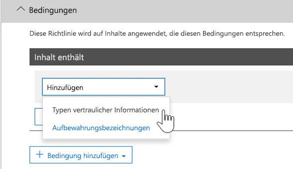

# <a name="create-custom-sensitive-information-types-with-exact-data-match-based-classification"></a>Erstellen von benutzerdefinierten vertraulichen Informationstypen mit genauer Datenübereinstimmungsklassifizierung


[Benutzerdefinierte Typen vertraulicher Informationen](sensitive-information-type-learn-about.md) werden verwendet, um vertrauliche Elemente zu identifizieren, sodass Sie verhindern können, dass Sie versehentlich oder in unangemessener Weise geteilt werden. Sie können einen benutzerdefinierten Typ vertraulicher Informationen folgendermaßen definieren:

- Durch Muster
- Durch den Nachweis von Schlüsselwörtern, z. B. *Mitarbeiter*,*Badge* oder *ID*
- Ähnliche Zeichen als Nachweis in einem bestimmten Muster
- Konfidenzniveaus

 Solche benutzerdefinierten vertraulichen Informationstypen erfüllen die geschäftlichen Anforderungen vieler Organisationen.

Was aber, wenn Sie einen benutzerdefinierten vertraulichen Informationstyp (SIT) nutzen möchten, der genaue Datenwerte verwendet, anstatt eines Typs, der Übereinstimmungen basierend auf generischen Mustern findet? Mit einer EDM-basierten Klassifizierung (Exact Data Match, genaue Datenübereinstimmung) können Sie einen benutzerdefinierten Informationstyp mit den folgenden Merkmalen erstellen:

- dynamisch und leicht zu aktualisieren
- skalierbarer
- weniger falsch positive Ergebnisse
- arbeitet mit strukturierten vertraulichen Daten
- behandelt vertrauliche Informationen sicherer
- mit verschiedenen Microsoft Cloud Services verwendbar


Die EDM-basierte Klassifikation ermöglicht es Ihnen, benutzerdefinierte vertrauliche Informationstypen zu erstellen, die sich auf genaue Werte in einer Datenbank mit vertraulichen Informationen beziehen. Die Datenbank kann täglich aktualisiert werden und bis zu 100 Millionen Datenzeilen enthalten. Mitarbeiter, Patienten oder Kunden kommen und gehen und Datensätze ändern sich, aber Ihre benutzerdefinierten vertraulichen Informationstypen bleiben aktuell und anwendbar. Darüber hinaus können Sie EDM-basierte Klassifikation mit Richtlinien verwenden, z. B. [Richtlinien zur Verhinderung von Datenverlust](dlp-learn-about-dlp.md) oder [Microsoft Cloud App Security-Dateirichtlinien](/cloud-app-security/data-protection-policies).

> [!NOTE]
> Microsoft 365 Information Protection unterstützt in der Vorschauversion Sprachen mit Doppelbyte-Zeichensätzen für:
> - Chinesisch (vereinfacht)
> - Chinesisch (traditionell)
> - Koreanisch
> - Japanisch
> 
> Diese Unterstützung ist für vertrauliche Informationstypen verfügbar. Mehr dazu finden Sie in den [Versionshinweisen (Vorschau) zur Unterstützung des Informationsschutzes für Doppelbyte-Zeichensätze](mip-dbcs-relnotes.md).
 

## <a name="required-licenses-and-permissions"></a>Erforderliche Lizenzen und Berechtigungen

Sie müssen ein globaler, Compliance- oder Exchange Online-Administrator sein, um die in diesem Artikel beschriebenen Aufgaben auszuführen. Weitere Informationen über DLP-Berechtigungen finden Sie unter [Berechtigungen](data-loss-prevention-policies.md#permissions).

Die EDM-basierte Klassifizierung ist in diesen Abonnements enthalten.

- Office 365 E5
- Microsoft 365 E5
- Microsoft 365 E5 Compliance
- Microsoft E5/ A5 Information Protection und Governance

## <a name="portal-links-for-your-subscription"></a>Portal Links für Ihr Abonnement


|Portal  |Weltweit/GCC  |GCC – hoch  |DOD  |
|---------|---------|---------|---------|
|Office SCC     |  protection.office.com       |scc.office365.us         |scc.protection.apps.mil |
|Microsoft 365 Security Center     |security.microsoft.com         |security.microsoft.us         |security.apps.mil|
|Microsoft 365 Compliance Center     |compliance.microsoft.com         |compliance.microsoft.us         |compliance.apps.mil|


## <a name="the-work-flow-at-a-glance"></a>Der Workflow auf einen Blick

|Phase  |Anforderungen  |
|---------|---------|
|[Teil 1: Einrichten der EDM-basierten Klassifizierung](#part-1-set-up-edm-based-classification)<br/><br/>(je nach Bedarf)<br/>- [Bearbeiten des Datenbankschemas](#editing-the-schema-for-edm-based-classification) <br/>- [Entfernen des Schemas](#removing-the-schema-for-edm-based-classification) |– Lesezugriff auf vertrauliche Daten<br/>– Datenbankschema im XML-Format (Beispiel)<br/>– Regelpaket im XML-Format (Beispiel)<br/>– Administratorberechtigungen für das Security & Compliance Center (mithilfe von PowerShell) |
|[Teil 2: Hashen und Hochladen vertraulicher Daten](#part-2-hash-and-upload-the-sensitive-data)<br/><br/>(je nach Bedarf)<br/>[Aktualisieren der Daten](#refreshing-your-sensitive-information-database) |– Benutzerdefinierte Sicherheitsgruppe und Benutzerkonto<br/>– Lokaler Administratorzugriff auf den Computer mit dem EDM-Upload-Agent<br/>– Lesezugriff auf vertrauliche Daten<br/>– Prozess und Zeitplan für die Datenaktualisierung|
|[Teil 3: Verwenden der EDM-basierten Klassifizierung mit Ihren Microsoft Cloud Services](#part-3-use-edm-based-classification-with-your-microsoft-cloud-services) |– Microsoft 365-Abonnement mit DLP<br/>– EDM-basiertes Klassifizierungsfeature aktiviert |

### <a name="part-1-set-up-edm-based-classification"></a>Teil 1: Einrichten der EDM-basierten Klassifizierung

Das Einrichten und Konfigurieren der EDM-basierten Klassifizierung umfasst:

1. [Speichern vertraulicher Daten im CSV-Format](#save-sensitive-data-in-csv-format)
2. [Definieren Ihres Datenbankschemas für vertrauliche Informationen](#define-the-schema-for-your-database-of-sensitive-information)
3. [Erstellen eines Regelpakets](#set-up-a-rule-package)


#### <a name="save-sensitive-data-in-csv-format"></a>Speichern vertraulicher Daten im CSV-Format

1. Identifizieren Sie die vertraulichen Informationen, die Sie verwenden möchten. Exportieren Sie die Daten in eine App, wie z. B. Microsoft Excel, und speichern Sie die Datei im CSV-Format. Die Datendatei kann maximal Folgendes umfassen:
      - bis zu 100 Millionen Zeilen vertraulicher Daten
      - bis zu 32 Spalten (Felder) pro Datenquelle
      - bis zu 5 als durchsuchbar markierte Spalten (Felder)

2. Strukturieren Sie die vertraulichen Daten in der CSV-Datei so, dass die erste Zeile die Namen der für die EDM-basierte Klassifizierung verwendeten Felder enthält. Möglicherweise gibt es in Ihrer CSV-Datei Feldnamen, wie z. B. "SSN", "Geburtsdatum", "Vorname" oder "Nachname". Die Namen der Spaltenüberschriften dürfen keine Leerzeichen oder Unterstriche enthalten. Die CSV-Datei, die wir in diesem Artikel verwenden, trägt beispielsweise den Namen *PatientRecords.csv* und hat u. a. die Spalten *PatientID*, *MRN*, *LastName*, *FirstName* und *SSN*.

3. Achten Sie auf das Format der Felder für die vertraulichen Daten. Insbesondere würden Felder, deren Inhalt Kommas enthalten kann (z. B. eine Straßenadresse, die den Wert „Seattle,WA“ enthält), beim Parsen durch das EDM-Tool als zwei getrennte Felder interpretiert werden. Um dies zu vermeiden, müssen Sie sicherstellen, dass solche Felder in der Tabelle mit den vertraulichen Daten von einfachen oder doppelten Anführungszeichen umgeben sind. Wenn Felder, die Kommas enthalten können, auch Leerzeichen enthalten können, müssen Sie einen benutzerdefinierten Datentyp für vertrauliche Daten erstellen, der dem entsprechenden Format entspricht (z. B. eine Zeichenfolge aus mehreren Wörtern mit Kommas und Leerzeichen darin), um sicherzustellen, dass die Zeichenfolge beim Scannen des Dokuments richtig zugeordnet wird.

#### <a name="define-the-schema-for-your-database-of-sensitive-information"></a>Definieren des Schemas für Ihre Datenbank mit vertraulichen Informationen

Wenn Sie es aus geschäftlichen oder technischen Gründen vorziehen, PowerShell oder die Befehlszeile nicht zu verwenden, um Ihr Schema und EDM-Muster vertraulicher Informationstypen (Regelpaket) zu erstellen, können Sie den [Assistenten für das Exact Data Match (EDM)-Schema und vertrauliche Informationstypen](sit-edm-wizard.md) verwenden, um sie zu erstellen. Wenn Sie mit dem Erstellen des Schemas und des EDM-vertraulicher-Informationstyp-Musters fertig sind, kehren Sie zurück, um alle Schritte abzuschließen, die erforderlich sind, um Ihren EDM-basierten vertraulicher Informationstyp für die Verwendung verfügbar zu machen.

> [!NOTE]
> Der Assistent für die Exact Data Match Schema und vertraulicher Informationstyp ist nur für die World Wide- und GCC-Cloud verfügbar.

1. Definieren Sie das Schema für die Datenbank mit vertraulichen Informationen im XML-Format (ähnlich wie in unserem Beispiel unten). Nennen Sie diese Schemadatei **edm.xml** und konfigurieren Sie sie so, dass es für jede Spalte in der Datenbank eine Zeile mit der folgenden Syntax gibt: 

      `\<Field name="" searchable=""/\>`.

      - Verwenden Sie Spaltennamen für *Field name*-Werte.
      - Verwenden Sie *searchable="true“* für maximal 5 Felder, die durchsuchbar sein sollen. Mindestens ein Feld muss durchsuchbar sein.

      Im folgenden Beispiel definiert die XML-Datei das Schema für eine Datenbank mit Patientendatensätzen, wobei fünf Felder als durchsuchbar angegeben werden: *PatientID*, *MRN*, *SSN*, *Phone* und *DOB*.

      (Sie können das Beispiel kopieren, ändern und verwenden.)

      ```xml
      <EdmSchema xmlns="http://schemas.microsoft.com/office/2018/edm">
            <DataStore name="PatientRecords" description="Schema for patient records" version="1">
                  <Field name="PatientID" searchable="true" caseInsensitive="true" ignoredDelimiters="-,/,*,#,^" />
                  <Field name="MRN" searchable="true" />
                  <Field name="FirstName" />
                  <Field name="LastName" />
                  <Field name="SSN" searchable="true" />
                  <Field name="Phone" searchable="true" />
                  <Field name="DOB" searchable="true" />
                  <Field name="Gender" />
                  <Field name="Address" />
            </DataStore>
      </EdmSchema>
      ```

##### <a name="configurable-match-using-the-caseinsensitive-and-ignoreddelimiters-fields"></a>Konfigurierbare Übereinstimmung unter Verwendung der Felder caseInsensitive und ignoredDelimiters

Das obige XML-Beispiel verwendet die Felder `caseInsensitive` und `ignoredDelimiters`. 

Wenn Sie das Feld ***caseInsensitive** _ in Ihre Schemadefinition aufnehmen, das auf den Wert von `true` festgelegt ist, schließt EDM ein Element nicht aus, das auf Groß- und Kleinschreibung für das `PatientID` Feld basiert. EDM wird also sehen, dass `PatientID` _ *FOO-1234** und **fOo-1234** identisch sind.

Wenn Sie das Feld **ignoredDelimiters** _ mit unterstützten Zeichen einfügen, ignoriert EDM diese Zeichen im `PatientID`. EDM wird also sehen, dass `PatientID` _ *FOO-1234** und `PatientID` **FOO#1234** identisch sind. Das Banner `ignoredDelimiters` unterstützt alle nicht alphanumerischen Zeichen. Hier einige Beispiele:
- \.
- \-
- \/
- \_
- \*
- \^
- \#
- \!
- \?
- \[
- \]
- \{
- \}
- \\
- \~
- \; 

Das Banner `ignoredDelimiters` ist nicht vorhanden:
- Zeichen 0-9
- A-Z
- a-z
- \"
- \,

In diesem Beispiel, in dem beide, `caseInsensitive` und `ignoredDelimiters`, verwendet werden, sieht EDM **FOO-1234** und **fOo#1234** als identisch an und klassifiziert das Element als sensiblen Informationstyp für Patientenakten. 

4. Informationen zum Herstellen der Verbindung zu Security & Compliance Center PowerShell finden Sie unter [Verbinden mit Security & Compliance Center PowerShell](/powershell/exchange/connect-to-scc-powershell).

5. Führen Sie die folgenden Cmdlets nacheinander aus, um das Datenbankschema hochzuladen:

      ```powershell
      $edmSchemaXml=Get-Content .\\edm.xml -Encoding Byte -ReadCount 0
      New-DlpEdmSchema -FileData $edmSchemaXml -Confirm:$true
      ```

      Sie werden zu folgenden Bestätigungen aufgefordert:

      > Bestätigen
      >
      > Möchten Sie diese Aktion wirklich ausführen?
      >
      > Das neue EDM-Schema für den Datenspeicher „patientrecords“ wird importiert.
      >
      > \[J\] Ja \[A\] Ja für alle \[N\] Nein \[L\] Nein für alle \[?\] Hilfe (Standard ist "J"):

> [!TIP]
> Wenn Sie möchten, dass Ihre Änderungen ohne Bestätigung durchgeführt werden, verwenden Sie in Schritt 5 stattdessen das folgende Cmdlet: New-DlpEdmSchema -FileData $edmSchemaXml

> [!NOTE]
> Es kann zwischen 10–60 Minuten dauern, bis das EDMSchema durch Ergänzungen aktualisiert wird. Das Update muss abgeschlossen sein, bevor Sie Schritte ausführen, die die Zusätze verwenden.

#### <a name="set-up-a-rule-package"></a>Einrichten eines Regelpakets

1. Erstellen Sie ein Regelpaket im XML-Format (mit Unicode-Codierung), ähnlich wie im folgenden Beispiel. (Sie können das Beispiel kopieren, ändern und verwenden.)

      Vergewissern Sie sich beim Einrichten des Regelpakets, dass Sie die CSV-Datei und die **edm.xml**-Datei korrekt referenzieren. Sie können das Beispiel kopieren, ändern und verwenden. In dieser XML-Beispieldatei müssen die folgenden Felder so angepasst werden, dass Sie Ihren vertraulichen EDM-Typ erstellen:

      - **RulePack id und ExactMatch id**: Verwenden Sie [New-GUID](/powershell/module/microsoft.powershell.utility/new-guid?view=powershell-6), um eine GUID zu generieren.

      - **Datenspeicher**: Dieses Feld gibt den zu verwendenden EDM-Nachschlage-Datenspeicher an. Sie geben einen Datenquellennamen eines konfigurierten EDM-Schemas an.

      - **idMatch**: Dieses Feld verweist auf das primäre Element für EDM.
        - Stimmt überein mit: gibt das Feld an, das in der exakten Suche verwendet werden soll. Sie geben den Namen eines durchsuchbaren Felds im EDM-Schema für den Datenspeicher an.
        - Klassifizierung: Dieses Feld gibt die Übereinstimmung für den vertraulichen Typ an, der EDM-Nachschlagevorgänge auslöst. Sie können den Namen oder die GUID eines vorhandenen integrierten oder benutzerdefinierten vertraulichen Informationstyps angeben. Beachten Sie, dass auf alle Zeichenfolgen, die dem angegebenen vertraulichen Informationstyp entsprechen, ein Hash angewendet wird und sie mit jedem Eintrag in der Tabelle mit vertraulichen Informationen verglichen werden. Um Leistungsprobleme zu vermeiden, sollten Sie bei Verwendung eines benutzerdefinierten vertraulichen Informationstyps als Klassifizierungselement in EDM keinen Inhaltstyp verwenden, der einem großen Prozentsatz des Inhalts entspricht (z. B. "beliebige Zahl" oder "beliebiges aus fünf Buchstaben bestehendes Wort"). Fügen Sie hierzu unterstützende Schlüsselwörter hinzu oder schließen Sie Formatierung in die Definition des benutzerdefinierten vertraulichen Klassifizierungsinformationstyps ein. 

      - **Übereinstimmung:** Dieses Feld verweist auf zusätzliche Nachweise, die sich in der Nähe von "idMatch" befinden.
        - Stimmt überein mit: Sie geben einen Feldnamen im EDM-Schema für den Datenspeicher an.
      - **Ressource:** In diesem Abschnitt werden der Name und die Beschreibung für den vertraulichen Typ in mehreren Sprachversionen angegeben.
        - idRef: Sie geben die GUID für die ExactMatch-ID an.
        - Name und Beschreibungen: nach Bedarf anpassen.

      ```xml
      <RulePackage xmlns="http://schemas.microsoft.com/office/2018/edm">
        <RulePack id="fd098e03-1796-41a5-8ab6-198c93c62b11">
          <Version build="0" major="2" minor="0" revision="0" />
          <Publisher id="eb553734-8306-44b4-9ad5-c388ad970528" />
          <Details defaultLangCode="en-us">
            <LocalizedDetails langcode="en-us">
              <PublisherName>IP DLP</PublisherName>
              <Name>Health Care EDM Rulepack</Name>
              <Description>This rule package contains the EDM sensitive type for health care sensitive types.</Description>
            </LocalizedDetails>
          </Details>
        </RulePack>
        <Rules>
          <ExactMatch id = "E1CC861E-3FE9-4A58-82DF-4BD259EAB371" patternsProximity = "300" dataStore ="PatientRecords" recommendedConfidence = "65" >
            <Pattern confidenceLevel="65">
              <idMatch matches = "SSN" classification = "U.S. Social Security Number (SSN)" />
            </Pattern>
            <Pattern confidenceLevel="75">
              <idMatch matches = "SSN" classification = "U.S. Social Security Number (SSN)" />
              <Any minMatches ="3" maxMatches ="6">
                <match matches="PatientID" />
                <match matches="MRN"/>
                <match matches="FirstName"/>
                <match matches="LastName"/>
                <match matches="Phone"/>
                <match matches="DOB"/>
              </Any>
            </Pattern>
          </ExactMatch>
          <LocalizedStrings>
            <Resource idRef="E1CC861E-3FE9-4A58-82DF-4BD259EAB371">
              <Name default="true" langcode="en-us">Patient SSN Exact Match.</Name>
              <Description default="true" langcode="en-us">EDM Sensitive type for detecting Patient SSN.</Description>
            </Resource>
          </LocalizedStrings>
        </Rules>
      </RulePackage>
      ```

2. Laden Sie das Regelpaket hoch, indem Sie nacheinander die folgenden PowerShell-Cmdlets ausführen:

      ```powershell
      $rulepack=Get-Content .\\rulepack.xml -Encoding Byte -ReadCount 0
      New-DlpSensitiveInformationTypeRulePackage -FileData $rulepack
      ```

Sie haben die EDM-basierte Klassifizierung nun eingerichtet. Der nächste Schritt ist das Hashen vertraulicher Daten, gefolgt vom Hochladen der Hashes für die Indizierung.

Wie Sie im vorherigen Verfahren erfahren haben, wurden im PatientRecords-Schema fünf Felder als durchsuchbar definiert: *PatientID*, *MRN*, *SSN*, *Phone* und *DOB*. In unserem Beispiel für ein Regelpaket sind diese Felder enthalten, und es wird auf die Datenbankschemadatei (**edm.xml**) verwiesen, wobei ein *ExactMatch*-Element pro durchsuchbarem Feld vorhanden ist. Sehen Sie sich das folgende ExactMatch-Element an:

```xml
<ExactMatch id = "E1CC861E-3FE9-4A58-82DF-4BD259EAB371" patternsProximity = "300" dataStore ="PatientRecords" recommendedConfidence = "65" >
      <Pattern confidenceLevel="65">
        <idMatch matches = "SSN" classification = "U.S. Social Security Number (SSN)" />
      </Pattern>
      <Pattern confidenceLevel="75">
        <idMatch matches = "SSN" classification = "U.S. Social Security Number (SSN)" />
        <Any minMatches ="3" maxMatches ="100">
          <match matches="PatientID" />
          <match matches="MRN"/>
          <match matches="FirstName"/>
          <match matches="LastName"/>
          <match matches="Phone"/>
          <match matches="DOB"/>
        </Any>
      </Pattern>
    </ExactMatch>
```

Beachten Sie in diesem Beispiel Folgendes:

- Der dataStore-Name verweist auf die zuvor erstellte CSV-Datei: **dataStore = "PatientRecords"**.

- Der idMatch-Wert verweist auf ein durchsuchbares Feld, das in der Datenbankschema-Datei aufgelistet ist: **idMatch matches = "SSN"**.

- Der classification-Wert verweist auf einen vorhandenen oder benutzerdefinierten vertraulichen Informationstyp: **classification = "US-Sozialversicherungsnummer (SSN)"**. (In diesem Fall wird der vorhandene vertrauliche Informationstyp "US-Sozialversicherungsnummer" verwendet.)

> [!NOTE]
> Es kann zwischen 10–60 Minuten dauern, bis das EDMSchema durch Ergänzungen aktualisiert wird. Das Update muss abgeschlossen sein, bevor Sie Schritte ausführen, die die Zusätze verwenden.
 
Nachdem Sie das Regelpaket mit Ihrem EDM-Typ vertraulicher Informationen und Ihre Tabelle vertraulicher Daten importiert haben, können Sie Ihren neu erstellten Typ mit der Funktion **Testen** im EDM-Assistenten im Compliance Center testen. Anweisungen zur Verwendung dieser Funktion finden Sie unter [Verwendung des Assistenten für das Schema exakter Datenübereinstimmung und für den Typ vertraulicher Informationen](sit-edm-wizard.md).

#### <a name="editing-the-schema-for-edm-based-classification"></a>Bearbeiten des Schemas für die EDM-basierte Klassifikation

Wenn Sie Änderungen an Ihrer **edm.xml**-Datei vornehmen und z. B. ändern möchten, welche Felder für die EDM-basierte Klassifikation verwendet werden, führen Sie die folgenden Schritte aus:

> [!TIP]
> Sie können Ihr EDM-Schema und Ihre Datendatei ändern, um die **konfigurierbare Übereinstimmung zu nutzen**. Bei der Konfiguration ignoriert EDM bei der Auswertung eines Elements Groß- und Kleinschreibung und einige Trennzeichen. Dies erleichtert die Definition Ihres XML-Schemas und Ihrer vertraulichen Datendateien. Weitere Informationen finden Sie unter [Ändern des Schemas für exakte Datenübereinstimmungen, um konfigurierbare Übereinstimmungen zu verwenden](sit-modify-edm-schema-configurable-match.md).

1. Bearbeiten Sie Ihre **edm.mxl**-Datei. (Dies ist die Datei, die im Abschnitt [Definieren des Schemas](#define-the-schema-for-your-database-of-sensitive-information) in diesem Artikel behandelt wird).

2. Informationen zum Herstellen der Verbindung zu Security & Compliance Center PowerShell finden Sie unter [Verbinden mit Security & Compliance Center PowerShell](/powershell/exchange/connect-to-scc-powershell).

3. Führen Sie die folgenden Cmdlets nacheinander aus, um Ihr Datenbankschema zu aktualisieren:

      ```powershell
      $edmSchemaXml=Get-Content .\\edm.xml -Encoding Byte -ReadCount 0
      Set-DlpEdmSchema -FileData $edmSchemaXml -Confirm:$true
      ```

      Sie werden zu folgenden Bestätigungen aufgefordert:

      > Bestätigen
      >
      > Möchten Sie diese Aktion wirklich ausführen?
      >
      > Das EDM-Schema für den Datenspeicher „patientrecords“ wird aktualisiert.
      >
      > \[J\] Ja \[A\] Ja für alle \[N\] Nein \[L\] Nein für alle \[?\] Hilfe (Standard ist "J"):

      > [!TIP]
      > Wenn Sie möchten, dass Ihre Änderungen ohne Bestätigung durchgeführt werden, verwenden Sie in Schritt 3 stattdessen das folgende Cmdlet: Set-DlpEdmSchema -FileData $edmSchemaXml

      > [!NOTE]
      > Es kann zwischen 10–60 Minuten dauern, bis das EDMSchema durch Ergänzungen aktualisiert wird. Das Update muss abgeschlossen sein, bevor Sie Schritte ausführen, die die Zusätze verwenden.

#### <a name="removing-the-schema-for-edm-based-classification"></a>Entfernen des Schemas für die EDM-basierte Klassifikation

(Nach Bedarf) Wenn Sie das Schema entfernen möchten, das Sie für die EDM-basierte Klassifizierung verwenden, gehen Sie folgendermaßen vor:

1. Informationen zum Herstellen der Verbindung zu Security & Compliance Center PowerShell finden Sie unter [Verbinden mit Security & Compliance Center PowerShell](/powershell/exchange/connect-to-scc-powershell).

2. Führen Sie die folgenden PowerShell-Cmdlets aus, und ersetzen Sie dabei den Datenspeichernamen "patient records" durch den Namen, den Sie entfernen möchten:

      ```powershell
      Remove-DlpEdmSchema -Identity patientrecords
      ```

      Sie werden zum Bestätigen aufgefordert:

      > Bestätigen
      >
      > Möchten Sie diese Aktion wirklich ausführen?
      >
      > Das EDM-Schema für den Datenspeicher „patientrecords“ wird entfernt.
      >
      > \[J\] Ja \[A\] Ja für alle \[N\] Nein \[L\] Nein für alle \[?\] Hilfe (Standard ist "J"):

      > [!TIP]
      >  Wenn Sie möchten, dass Ihre Änderungen ohne Bestätigung durchgeführt werden, verwenden Sie in Schritt 2 stattdessen das folgende Cmdlet: Remove-DlpEdmSchema -Identity patientrecords -Confirm:$false

### <a name="part-2-hash-and-upload-the-sensitive-data"></a>Teil 2: Hashvorgang durchführen und vertrauliche Daten hochladen

In dieser Phase richten Sie eine benutzerdefinierte Sicherheitsgruppe, ein Benutzerkonto und das Tool EDM-Upload-Agent ein. Dann verwenden Sie das Tool, um für die vertraulichen Daten mit Salt-Wert einen Hashvorgang durchzuführen und sie hochzuladen.

Der Hashvorgang und das Hochlande können mit einem einzigen Computer durchgeführt werden. Sie können aber auch den Hashvorgang vom Upload trennen, um größere Sicherheit zu gewährleisten.

Wenn Sie den Hashvorgang und das Hochladen von einem Computer aus durchführen möchten, muss dieser eine direkte Verbindung zu Ihrem Microsoft 365-Mandanten herstellen können. Dies setzt voraus, dass für den Hashvorgang die vertraulichen Datendateien im Klartext auf diesem Computer bereitstehen.

Wenn Sie Ihre vertrauliche Datendatei im Klartext nicht verfügbar machen möchten, können Sie den Hashvorgang auf einem Computer an einem sicheren Ort durchführen, und dann die Hashdatei und die Saltdatei auf einen Computer kopieren, der für das Hochladen eine direkte Verbindung mit Ihrem Microsoft 365-Mandanten herstellen kann. In diesem Szenario benötigen Sie den EDMUploadAgent auf beiden Computern.

> [!IMPORTANT]
> Wenn Sie den Assistenten für Exact Data Match Schema und vertraulicher Informationstyp verwendet haben, um Ihre Schema- und Musterdateien zu erstellen, ***müssen*** Sie das Schema für dieses Verfahren herunterladen.

> [!NOTE]
> Wenn Ihre Organisation [Kundenschlüssel für Microsoft 365 auf Mandantenebene (öffentliche Vorschau)](customer-key-tenant-level.md#overview-of-customer-key-for-microsoft-365-at-the-tenant-level-public-preview) eingerichtet hat, wird bei der genauen Datenübereinstimmung automatisch dessen Verschlüsselungsfunktionalität verwendet. Dies ist nur für Mandanten mit E5-Lizenz in der kommerziellen Cloud verfügbar.

#### <a name="prerequisites"></a>Voraussetzungen

- Ein Microsoft 365-Geschäfts-, Schul- oder Unikonto, das der **EDM-\_DataUploaders**-Sicherheitsgruppe hinzugefügt wird
- Einen Computer mit Windows 10 oder Windows Server 2016 mit .NET Version 4.6.2, um den EDM-Upload-Agenten auszuführen
- Ein Verzeichnis auf dem für das Hochladen verwendeten Computer für den:
    -  EDM-Upload-Agenten
    - Ihre vertrauliche Elementdatei im CSV-Format (in unseren Beispielen **"PatientRecords.csv"**)
    -  sowie die Output-Hash- und-Saltdateien
    - Den Namen des Datenspeichers aus der Datei **EDM.xml** (in diesem Beispiel `PatientRecords`)
- Wenn Sie den Assistenten für das [Schema exakter Datenübereinstimmung und den vertraulichen Informationstyp](sit-edm-wizard.md) verwendet haben, ***müssen*** Sie ihn herunterladen.

#### <a name="set-up-the-security-group-and-user-account"></a>Einrichten der Sicherheitsgruppe und des Benutzerkontos

1. Als globaler Administrator gehen Sie über den entsprechenden [Link für Ihr Abonnement](#portal-links-for-your-subscription) zum Verwaltungszentrum und [erstellen Sie eine Sicherheitsgruppe](/office365/admin/email/create-edit-or-delete-a-security-group?view=o365-worldwide) namens **EDM\_DataUploaders**.

2. Fügen Sie einen oder mehrere Benutzer zu der **EDM\_DataUploaders**-Sicherheitsgruppe hinzu. (Diese Benutzer verwalten die Datenbank mit vertraulichen Informationen.)

#### <a name="hash-and-upload-from-one-computer"></a>Hash und Upload von einem Computer

Dieser Computer muss direkten Zugriff auf Ihren Microsoft 365-Mandanten haben.

>[!NOTE]
> Bevor Sie mit diesem Verfahren beginnen, stellen Sie sicher, dass Sie Mitglied der **EDM\_DataUploaders**-Sicherheitsgruppe sind.

> [!TIP]
> Optional können Sie vor dem Hochladen eine Validierung für Ihre CSV-Datei ausführen, indem Sie Folgendes ausführen:
>
>`EdmUploadAgent.exe /ValidateData /DataFile [data file] /Schema [schema file]`
>
>Weitere Informationen zu allen von EdmUploadAgent.exe >unterstützten Parametern erhalten Sie
>
> `EdmUploadAgent.exe /?`


#### <a name="links-to-edm-upload-agent-by-subscription-type"></a>Links zum EDM-Upload-Agenten nach Abonnementtyp

- [Handel + GCC](https://go.microsoft.com/fwlink/?linkid=2088639) – die meisten gewerblichen Kunden sollten dies verwenden
- [GCC-Hoch](https://go.microsoft.com/fwlink/?linkid=2137521) – Dies ist speziell für Cloud-Abonnenten mit hoher Sicherheit in der Regierung
- [DoD](https://go.microsoft.com/fwlink/?linkid=2137807) – Dies ist speziell für Cloud-Kunden des US-Verteidigungsministeriums

1. Erstellen Sie ein Arbeitsverzeichnis für das den EDM-Upload-Agenten. Das kann beispielsweise das Verzeichnis **C:\EDM\Data** sein. Platzieren Sie dort die Datei **PatientRecords.csv"**.

2. Laden Sie den für Ihr Abonnement geeigneten [EDM-Upload-Agenten](#links-to-edm-upload-agent-by-subscription-type) herunter und installieren Sie ihn in das im ersten Schritt erstellte Verzeichnis.

   > [!NOTE]
   > Der EDM-Upload-Agent unter den oben aufgeführten Links wurde aktualisiert, um automatisch einen Saltwert zu den Hashdaten hinzuzufügen. Alternativ können Sie auch ihren eigenen Saltwert angeben. Sobald Sie diese Version verwendet haben, können Sie die vorherige Version des EDM-Upload-Agenten nicht mehr verwenden.
   >
   > Sie können Daten mit dem EDM-Upload-Agenten nur zwei Mal pro Tag in einen bestimmten Datenspeicherort hochladen.

   > [!TIP]
   > Um eine Liste der unterstützten Befehlsparameter zu erhalten, führen Sie den Agenten ohne Argumente aus. Beispiel: "EdmUploadAgent.exe".

2. Autorisieren Sie den EDM-Upload-Agenten Öffnen Sie dafür die Eingabeaufforderung (als Administrator), wechseln Sie ins Verzeichnis **C:\EDM\Data** und führen Sie dann den folgenden Befehl aus:

   `EdmUploadAgent.exe /Authorize`

3. Melden Sie sich mit Ihrem Microsoft 365-Geschäfts-, Schul- oder Unikonto an, das der Sicherheitsgruppe „EDM_DataUploaders“hinzugefügt wurde. Ihre Mandanteninformationen werden aus dem Benutzerkonto extrahiert, um die Verbindung herzustellen.

   OPTIONAL: Wenn Sie den Assistenten für Exact Data Match Schema und vertraulicher Informationstyp verwendet haben, um Ihre Schema- und Musterdateien zu erstellen, führen Sie den folgenden Befehl in einem Eingabeaufforderungsfenster aus:

   `EdmUploadAgent.exe /SaveSchema /DataStoreName <schema name> /OutputDir <path to output folder>`

4. Um den Hashvorgang durchzuführen die vertraulichen Daten hochzuladen, führen Sie den folgenden Befehl in der Eingabeaufforderung aus:

   `EdmUploadAgent.exe /UploadData /DataStoreName [DS Name] /DataFile [data file] /HashLocation [hash file location] /Schema [Schema file]`

   Beispiel: **EdmUploadAgent.exe /UploadData /DataStoreName PatientRecords /DataFile C:\Edm\Hash\PatientRecords.csv /HashLocation C:\Edm\Hash /Schema edm.xml**

   Dadurch wird dem Hashwert automatisch ein zufällig generierter Saltwert hinzugefügt, um die Sicherheit zu vergrößern. Wenn Sie optional einen eigenen Saltwert verwenden möchten, fügen Sie dem Befehl **/Salt <saltvalue>** hinzu. Dieser Wert muss 64 Zeichen umfassen und darf nur die Zeichen a-z und die Ziffern 0-9 enthalten.

5. Überprüfen Sie den Uploadstatus, indem Sie den folgenden Befehl ausführen:

   `EdmUploadAgent.exe /GetSession /DataStoreName \<DataStoreName\>`

   Beispiel: **EdmUploadAgent.exe /GetSession /DataStoreName PatientRecords**

   Suchen Sie nach dem Status in **ProcessingInProgress**. Überprüfen Sie den Status alle paar Minuten, bis er sich zu **Abgeschlossen** geändert hat. Sobald der Status „Abgeschlossen“ angezeigt wird, können Sie die EDM-Daten verwenden.

#### <a name="separate-hash-and-upload"></a>Trennen von Hash und Upload

Führen Sie den Hashvorgang auf einem Computer in einer sicheren Umgebung aus.

OPTIONAL: Wenn Sie den Assistenten für Exact Data Match Schema und vertraulicher Informationstyp verwendet haben, um Ihre Schema- und Musterdateien zu erstellen, führen Sie den folgenden Befehl in einem Eingabeaufforderungsfenster aus:

`EdmUploadAgent.exe /SaveSchema /DataStoreName <schema name> /OutputDir <path to output folder>`

1. Führen Sie in den Eingabeaufforderungsfenstern den folgenden Befehl aus:

   `EdmUploadAgent.exe /CreateHash /DataFile [data file] /HashLocation [hash file location] /Schema [Schema file] >`

   Beispiel:

   > **EdmUploadAgent.exe /CreateHash /DataFile C:\Edm\Data\PatientRecords.csv /HashLocation C:\Edm\Hash /Schema edm.xml**

   Dadurch wird eine Hashdatei und eine Saltdatei mit diesen Erweiterungen ausgegeben, wenn Sie die Option **/Salt <saltvalue>** nicht angegeben haben:
   - .EdmHash
   - .EdmSalt

2. Kopieren Sie diese Dateien auf sichere Weise auf den Computer, den Sie verwenden, um Ihre CSV-Datei mit den vertraulichen Elementen (PatientRecords) in ihren-Mandanten hochzuladen.

   Führen Sie zum Hochladen gehashter Daten den folgenden Befehl in der Windows-Eingabeaufforderung aus:

   `EdmUploadAgent.exe /UploadHash /DataStoreName \<DataStoreName\> /HashFile \<HashedSourceFilePath\>`

   Zum Beispiel:

   > **EdmUploadAgent.exe /UploadHash /DataStoreName PatientRecords /HashFile C:\\Edm\\Hash\\PatientRecords.EdmHash**


   Führen Sie zur Überprüfung, ob Ihre vertraulichen Daten hochgeladen wurden, den folgenden Befehl in der Windows-Eingabeaufforderung aus:

   `EdmUploadAgent.exe /GetDataStore`

   Sie sehen eine Liste der Datenspeicher und wann sie zuletzt aktualisiert wurden.

   Wenn Sie alle Daten sehen möchten, die in einen bestimmten Store hochgeladen wurden, führen Sie den folgenden Befehl in einer Windows-Eingabeaufforderung aus:

   `EdmUploadAgent.exe /GetSession /DataStoreName <DataStoreName>`

   Fahren Sie mit dem Einrichten des Prozesses und des Zeitplans für [Aktualisieren der Datenbank für vertrauliche Informationen](#refreshing-your-sensitive-information-database) fort.

Sie können nun die EDM-basierte Klassifikation mit Ihren Microsoft Cloud Services verwenden. Sie können beispielsweise [eine DLP-Richtlinie mithilfe der EDM-basierten Klassifizierung](#to-create-a-dlp-policy-with-edm) einrichten.

#### <a name="refreshing-your-sensitive-information-database"></a>Aktualisieren der Datenbank für vertrauliche Informationen

Sie können Ihre Datenbank für vertrauliche Informationen täglich aktualisieren, und das EDM-Upload-Tool kann die vertraulichen Daten neu indizieren und dann die indizierten Daten erneut hochladen.

1. Ermitteln Sie den Vorgang und die Häufigkeit (täglich oder wöchentlich) zum Aktualisieren der Datenbank mit vertraulichen Informationen.

2. Exportieren Sie die vertraulichen Daten erneut in eine App, wie z. B. Microsoft Excel, und speichern Sie die Datei im CSV-Format. Behalten Sie den Dateinamen und den Speicherort bei, den Sie beim Ausführen der unter [Hashen und Hochladen vertraulicher Daten](#part-2-hash-and-upload-the-sensitive-data) beschriebenen Schritte verwendet haben.

      > [!NOTE]
      > Wenn es keine Änderungen an der Struktur (Feldnamen) der CSV-Datei gibt, müssen Sie auch keine an der Datenbankschemadatei vornehmen, wenn Sie die Daten aktualisieren. Wenn Sie jedoch Änderungen vornehmen müssen, stellen Sie sicher, dass Sie das Datenbankschema und Ihr Regelpaket entsprechend bearbeiten.

3. Verwenden Sie die [Aufgabenplanung](/windows/desktop/TaskSchd/task-scheduler-start-page), um die Schritte 2 und 3 im Verfahren [Hashen und Hochladen vertraulicher Daten](#part-2-hash-and-upload-the-sensitive-data) zu automatisieren. Sie können Aufgaben mithilfe verschiedener Methoden planen:

      | Methode             | Vorgehensweise |
      | ---------------------- | ---------------- |
      | Windows PowerShell     | Siehe Dokumentation [Aufgabenplanung](/powershell/module/scheduledtasks/?view=win10-ps) und [Beispiel PowerShell-Skript](#example-powershell-script-for-task-scheduler) in diesem Artikel |
      | Aufgabenplaner-API     | Siehe Dokumentation [Aufgabenplaner](/windows/desktop/TaskSchd/using-the-task-scheduler)                                                                                                                                                                                                                                                                                |
      | Windows-Benutzeroberfläche | Klicken Sie in Windows auf **Start** und geben Sie „Aufgabenplanung“ ein. Klicken Sie dann in der Ergebnisliste mit der rechten Maustaste auf **Aufgabenplaner** und wählen Sie **Als Administrator ausführen**.                                                                                                                                                                                                                                                                           |

#### <a name="example-powershell-script-for-task-scheduler"></a>„PowerShell-Beispielskript“ für „Aufgabenplanung“

Dieser Abschnitt enthält ein Beispiel für ein PowerShell-Skript, mit dem Sie Ihre Aufgaben zum Hashen von Daten und Hochladen gehashter Daten planen können:

##### <a name="to-schedule-hashing-and-upload-in-a-combined-step"></a>So planen Sie das Hashen und Hochladen in einem kombinierten Schritt

```powershell
param(\[string\]$dataStoreName,\[string\]$fileLocation)
\# Assuming current user is also the user context to run the task
$user = "$env:USERDOMAIN\\$env:USERNAME"
$edminstallpath = 'C:\\Program Files\\Microsoft\\EdmUploadAgent\\'
$edmuploader = $edminstallpath + 'EdmUploadAgent.exe'
$csvext = '.csv'
$schemaext = '.xml'
\# Assuming CSV file name is same as data store name
$dataFile = "$fileLocation\\$dataStoreName$csvext"
\# Assuming location to store hash file is same as the location of csv file
$hashLocation = $fileLocation
\# Assuming Schema file name is same as data store name
$schemaFile = "$fileLocation\\$dataStoreName$schemaext"
$uploadDataArgs = '/UploadData /DataStoreName ' + $dataStoreName + ' /DataFile ' + $dataFile + ' /HashLocation' + $hashLocation + ' /Schema ' + $schemaFile
\# Set up actions associated with the task
$actions = @()
$actions += New-ScheduledTaskAction -Execute $edmuploader -Argument $uploadDataArgs -WorkingDirectory $edminstallpath
\# Set up trigger for the task
$trigger = New-ScheduledTaskTrigger -Weekly -DaysOfWeek Sunday -At 2am
\# Set up task settings
$principal = New-ScheduledTaskPrincipal -UserId $user -LogonType S4U -RunLevel Highest
$settings = New-ScheduledTaskSettingsSet -RunOnlyIfNetworkAvailable -StartWhenAvailable -WakeToRun
\# Create the scheduled task
$scheduledTask = New-ScheduledTask -Action $actions -Principal $principal -Trigger $trigger -Settings $settings
\# Get credentials to run the task
$creds = Get-Credential -UserName $user -Message "Enter credentials to run the task"
$password=\[Runtime.InteropServices.Marshal\]::PtrToStringAuto(\[Runtime.InteropServices.Marshal\]::SecureStringToBSTR($creds.Password))
\# Register the scheduled task
$taskName = 'EDMUpload\_' + $dataStoreName
Register-ScheduledTask -TaskName $taskName -InputObject $scheduledTask -User $user -Password $password
```

#### <a name="to-schedule-hashing-and-upload-as-separate-steps"></a>So planen Sie das Hashen und Hochladen als separate Schritte

```powershell
param(\[string\]$dataStoreName,\[string\]$fileLocation)
\# Assuming current user is also the user context to run the task
$user = "$env:USERDOMAIN\\$env:USERNAME"
$edminstallpath = 'C:\\Program Files\\Microsoft\\EdmUploadAgent\\'
$edmuploader = $edminstallpath + 'EdmUploadAgent.exe'
$csvext = '.csv'
$edmext = '.EdmHash'
$schemaext = '.xml'
\# Assuming CSV file name is same as data store name
$dataFile = "$fileLocation\\$dataStoreName$csvext"
$hashFile = "$fileLocation\\$dataStoreName$edmext"
\# Assuming Schema file name is same as data store name
$schemaFile = "$fileLocation\\$dataStoreName$schemaext "

\# Assuming location to store hash file is same as the location of csv file
$hashLocation = $fileLocation
$createHashArgs = '/CreateHash' + ' /DataFile ' + $dataFile + ' /HashLocation ' + $hashLocation + ' /Schema ' + $schemaFile
$uploadHashArgs = '/UploadHash /DataStoreName ' + $dataStoreName + ' /HashFile ' + $hashFile
\# Set up actions associated with the task
$actions = @()
$actions += New-ScheduledTaskAction -Execute $edmuploader -Argument $createHashArgs -WorkingDirectory $edminstallpath
$actions += New-ScheduledTaskAction -Execute $edmuploader -Argument $uploadHashArgs -WorkingDirectory $edminstallpath
\# Set up trigger for the task
$trigger = New-ScheduledTaskTrigger -Weekly -DaysOfWeek Sunday -At 2am
\# Set up task settings
$principal = New-ScheduledTaskPrincipal -UserId $user -LogonType S4U -RunLevel Highest
$settings = New-ScheduledTaskSettingsSet -RunOnlyIfNetworkAvailable -StartWhenAvailable -WakeToRun
\# Create the scheduled task
$scheduledTask = New-ScheduledTask -Action $actions -Principal $principal -Trigger $trigger -Settings $settings
\# Get credentials to run the task
$creds = Get-Credential -UserName $user -Message "Enter credentials to run the task"
$password=\[Runtime.InteropServices.Marshal\]::PtrToStringAuto(\[Runtime.InteropServices.Marshal\]::SecureStringToBSTR($creds.Password))
\# Register the scheduled task
$taskName = 'EDMUpload\_' + $dataStoreName
Register-ScheduledTask -TaskName $taskName -InputObject $scheduledTask -User $user -Password $password

```

### <a name="part-3-use-edm-based-classification-with-your-microsoft-cloud-services"></a>Teil 3: Verwenden der EDM-basierten Klassifizierung mit Ihren Microsoft Cloud Services

Diese Speicherorte sind unterstützte Typen vertraulicher EDM-Informationen:

- DLP für Exchange Online (E-Mail)
- OneDrive for Business (Dateien)
- Microsoft Teams (Unterhaltungen)
- DLP für SharePoint (Dateien)
- DLP-Richtlinien für Microsoft Cloud App-Sicherheit
- Serverseitige Richtlinien für die automatische Bezeichnung

#### <a name="to-create-a-dlp-policy-with-edm"></a>Erstellen einer DLP-Richtlinie mit EDM

1. Gehen Sie zum Security & Compliance Center, indem Sie den entsprechenden [Link für Ihr Abonnement](#portal-links-for-your-subscription) verwenden.

2. Wählen Sie **Verhinderung von Datenverlust** \> **Richtlinie**.

3. Wählen Sie **Richtlinie erstellen** \> **Benutzerdefiniert** \> **Weiter**.

4. Geben Sie auf der Registerkarte **Richtlinie benennen** einen Namen und eine Beschreibung ein und wählen Sie dann **Weiter**.

5. Wählen Sie auf der Registerkarte **Speicherorte auswählen** **Bestimmte Speicherorte auswählen** und wählen Sie dann **Weiter**.

6. Wählen Sie in der Spalte **Status** die Option **Exchange-E-Mail, OneDrive-Konten, Teams-Chat und Kanalnachricht** und dann **Weiter** aus.

7. Wählen Sie auf der Registerkarte **Richtlinieneinstellungen** **Erweiterte Einstellungen verwenden** und dann **Weiter**.

8. Wählen Sie **+ Neue Regel** aus.

9. Geben Sie im Abschnitt **Name** einen Namen und eine Beschreibung für die Regel ein.

10. Wählen Sie im Abschnitt **Bedingungen** in der Liste **+ Bedingung hinzufügen** **Inhalt enthält vertraulichen Typ**.

      

11. Suchen Sie den vertraulichen Informationstyp, den Sie beim Einrichten Ihres Regelpakets erstellt haben, und wählen Sie dann **+ Hinzufügen**.  
    Wählen Sie dann **Fertig**.

12. Wählen Sie Optionen für die Regel aus, wie z. B. **Benutzerbenachrichtigungen**, **Benutzeraußerkraftsetzungen**, **Schadensberichte** usw., und wählen Sie dann **Speichern**.

13. Überprüfen Sie auf der Registerkarte die **Richtlinieneinstellungen**, überprüfen Sie Ihre Regeln und wählen Sie dann **Weiter**.

14. Geben Sie an, ob Sie die Richtlinie sofort aktivieren, sie testen oder deaktivieren möchten. Wählen Sie dann **Weiter** aus.

15. Überprüfen Sie auf der Registerkarte **Überprüfen Sie Ihre Einstellungen** Ihre Richtlinie. Nehmen Sie alle erforderlichen Änderungen vor. Wenn Sie fertig sind, wählen Sie **Erstellen** aus.

> [!NOTE]
> Es kann ungefähr eine Stunde dauern, bis Ihre neue DLP-Richtlinie im Rechenzentrum erscheint.

## <a name="related-articles"></a>Verwandte Artikel

- [Entitätsdefinitionen für Typen vertraulicher Informationen](sensitive-information-type-entity-definitions.md)
- [Informationen zu Typen vertraulicher Informationen](sensitive-information-type-learn-about.md)
- [Informationen zur Verhinderung von Datenverlust](dlp-learn-about-dlp.md)
- [Microsoft Cloud App Security](/cloud-app-security)
- [New-DlpEdmSchema](/powershell/module/exchange/new-dlpedmschema)
- [Ändern Sie das Schema für die genaue Datenübereinstimmung, um eine konfigurierbare Übereinstimmung zu verwenden](sit-modify-edm-schema-configurable-match.md)
